# Documentation Map

Visual guide to finding documentation based on your needs.

```mermaid
graph TB
    Start{What do you<br/>need to do?}
    
    Start -->|Learn the API| Learn[Learning Phase]
    Start -->|Solve a problem| Task[Task Phase]
    Start -->|Look up details| Lookup[Lookup Phase]
    Start -->|Understand why| Understand[Understanding Phase]
    
    Learn --> T1[📖 Tutorials<br/>Coming soon]
    Learn --> A1[📄 OpenAPI Spec<br/>api/v1/openapi.yaml]
    
    Task --> H1[🛠️ Deployment Guide<br/>how-to-guides/DEPLOYMENT.md]
    Task --> H2[🔜 Operations Guide<br/>Suggested]
    Task --> H3[🔜 Development Guide<br/>Suggested]
    
    Lookup --> R1[📚 API Specification<br/>api/v1/openapi.yaml]
    Lookup --> R2[📚 Server Specification<br/>reference/HTTP_SERVER.md]
    Lookup --> R3[📚 Project Structure<br/>reference/PROJECT_STRUCTURE.md]
    Lookup --> R4[📚 Testing Strategy<br/>reference/TESTING_STRATEGY.md]
    
    Understand --> E1[💡 Architecture Design<br/>explanation/ARCHITECTURE.md]
    Understand --> E2[💡 Design Summary<br/>explanation/DESIGN_SUMMARY.md]
    
    style Learn fill:#e1f5ff
    style Task fill:#fff4e1
    style Lookup fill:#e1ffe1
    style Understand fill:#ffe1f5
    
    style T1 fill:#e1f5ff
    style H1 fill:#fff4e1
    style H2 fill:#fff4e1
    style H3 fill:#fff4e1
    style R1 fill:#e1ffe1
    style R2 fill:#e1ffe1
    style R3 fill:#e1ffe1
    style R4 fill:#e1ffe1
    style E1 fill:#ffe1f5
    style E2 fill:#ffe1f5
```

## By Role

| Role | Primary Documents |
|------|------------------|
| **API User** | [OpenAPI Spec](../api/v1/openapi.yaml) |
| **DevOps/SRE** | [Deployment](how-to-guides/DEPLOYMENT.md) → [HTTP Server](reference/HTTP_SERVER.md) → [Architecture](explanation/ARCHITECTURE.md) |
| **Developer** | [Project Structure](reference/PROJECT_STRUCTURE.md) → [Architecture](explanation/ARCHITECTURE.md) → [Testing](reference/TESTING_STRATEGY.md) |
| **Security Auditor** | [OpenAPI](../api/v1/openapi.yaml) → [Architecture](explanation/ARCHITECTURE.md) → [HTTP Server](reference/HTTP_SERVER.md) |

## By Task

| Task | Document |
|------|----------|
| Deploy the server | [DEPLOYMENT.md](how-to-guides/DEPLOYMENT.md) |
| Understand architecture | [ARCHITECTURE.md](explanation/ARCHITECTURE.md) |
| Look up API endpoints | [openapi.yaml](../api/v1/openapi.yaml) |
| Find server limits | [HTTP_SERVER.md](reference/HTTP_SERVER.md) |
| Understand codebase | [PROJECT_STRUCTURE.md](reference/PROJECT_STRUCTURE.md) |
| Write tests | [TESTING_STRATEGY.md](reference/TESTING_STRATEGY.md) |
| See complete design | [DESIGN_SUMMARY.md](explanation/DESIGN_SUMMARY.md) |

## By Type

### 📖 Tutorials (Learning-Oriented)

**Status:** Not yet created

### 🛠️ How-To Guides (Problem-Oriented)

- [DEPLOYMENT.md](how-to-guides/DEPLOYMENT.md)

### 📚 Reference (Information-Oriented)

- [openapi.yaml](../api/v1/openapi.yaml)
- [HTTP_SERVER.md](reference/HTTP_SERVER.md)
- [PROJECT_STRUCTURE.md](reference/PROJECT_STRUCTURE.md)
- [TESTING_STRATEGY.md](reference/TESTING_STRATEGY.md)

### 💡 Explanation (Understanding-Oriented)

- [ARCHITECTURE.md](explanation/ARCHITECTURE.md)
- [DESIGN_SUMMARY.md](explanation/DESIGN_SUMMARY.md)

