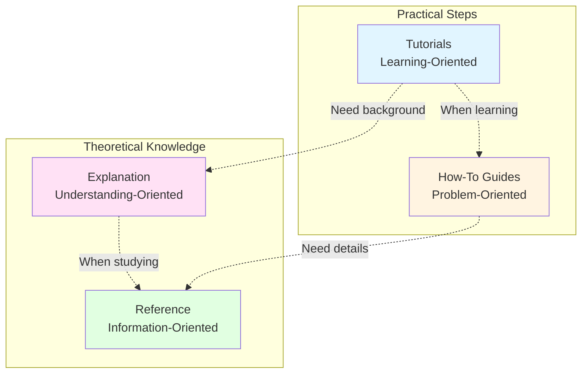

# Documentation

Documentation organized by the [Diátaxis framework](https://diataxis.fr/) into four categories based on user needs.

---

## Tutorials (Learning-Oriented)

Step-by-step guides for getting started with the API.

**Status:** ⚠️ Not yet created

---

## How-To Guides (Problem-Oriented)

Task-focused instructions for accomplishing specific goals.

- **[Deployment Guide](how-to-guides/DEPLOYMENT.md)** - Production deployment procedures

---

## Reference (Information-Oriented)

Technical specifications and detailed information for lookup.

- **[OpenAPI Specification](../api/v1/openapi.yaml)** - REST API contract
- **[HTTP Server Specification](reference/HTTP_SERVER.md)** - Server behavior and limits
- **[Project Structure](reference/PROJECT_STRUCTURE.md)** - Codebase organization
- **[Testing Strategy](reference/TESTING_STRATEGY.md)** - Testing approach

---

## Explanation (Understanding-Oriented)

Background knowledge and design rationale for deeper understanding.

- **[Architecture Design](explanation/ARCHITECTURE.md)** - System design and decisions
- **[Design Summary](explanation/DESIGN_SUMMARY.md)** - Complete design overview

---

## Quick Navigation

| Goal | Document |
|------|----------|
| Deploy the server | [Deployment Guide](how-to-guides/DEPLOYMENT.md) |
| Look up API endpoints | [OpenAPI Specification](../api/v1/openapi.yaml) |
| Find server limits | [HTTP Server Specification](reference/HTTP_SERVER.md) |
| Understand codebase | [Project Structure](reference/PROJECT_STRUCTURE.md) |
| Write tests | [Testing Strategy](reference/TESTING_STRATEGY.md) |
| Understand architecture | [Architecture Design](explanation/ARCHITECTURE.md) |
| See design overview | [Design Summary](explanation/DESIGN_SUMMARY.md) |
