# Architecture Design - Linux File Magic API Server <!-- omit in toc -->

- [1. Overview](#1-overview)
- [2. System Architecture](#2-system-architecture)
  - [2.1. High-Level Architecture](#21-high-level-architecture)
  - [2.2. Layer Dependencies](#22-layer-dependencies)
- [3. Clean Architecture Layers](#3-clean-architecture-layers)
  - [3.1. Domain Layer](#31-domain-layer)
  - [3.2. Application Layer](#32-application-layer)
  - [3.3. Infrastructure Layer](#33-infrastructure-layer)
  - [3.4. Presentation Layer](#34-presentation-layer)
- [4. Component Architecture](#4-component-architecture)
  - [4.1. Domain Components](#41-domain-components)
  - [4.2. Application Flow](#42-application-flow)
    - [Standard Content Analysis](#standard-content-analysis)
    - [Large File Analysis Flow](#large-file-analysis-flow)
  - [4.3. Large Content Handling Strategy](#43-large-content-handling-strategy)
    - [Architecture](#architecture)
    - [Configuration Parameters](#configuration-parameters)
    - [Processing Strategy](#processing-strategy)
    - [Memory-Mapped I/O Benefits](#memory-mapped-io-benefits)
    - [Temporary File Management](#temporary-file-management)
    - [Error Handling](#error-handling)
    - [Resource Limits](#resource-limits)
    - [Implementation Location](#implementation-location)
  - [4.4. Infrastructure Integration](#44-infrastructure-integration)
  - [4.5. HTTP Request Streaming Architecture](#45-http-request-streaming-architecture)
    - [Request Body Streaming Flow](#request-body-streaming-flow)
    - [Architecture Benefits](#architecture-benefits)
    - [Implementation Considerations](#implementation-considerations)
    - [Performance Characteristics](#performance-characteristics)
    - [Adopted Design](#adopted-design)
    - [References](#references)
- [5. Axum HTTP Server Architecture](#5-axum-http-server-architecture)
  - [5.1. Request Processing Flow](#51-request-processing-flow)
  - [5.2. Middleware Architecture](#52-middleware-architecture)
  - [5.3. Routing Structure](#53-routing-structure)
  - [5.4. State Management](#54-state-management)
- [6. Security Architecture](#6-security-architecture)
  - [6.1. Authentication Flow](#61-authentication-flow)
  - [6.2. Path Validation Strategy](#62-path-validation-strategy)
  - [6.3. Request Constraints](#63-request-constraints)
  - [6.4. Memory-Mapped I/O Security](#64-memory-mapped-io-security)
- [7. Error Handling Architecture](#7-error-handling-architecture)
  - [7.1. Error Flow](#71-error-flow)
  - [7.2. Error Mapping Strategy](#72-error-mapping-strategy)
  - [7.3. Disk Space Error Handling](#73-disk-space-error-handling)
- [8. Concurrency Architecture](#8-concurrency-architecture)
  - [8.1. Runtime Model](#81-runtime-model)
  - [8.2. Async I/O Requirements](#82-async-io-requirements)
  - [8.3. Timeout Strategy](#83-timeout-strategy)
  - [8.4. Connection Limits](#84-connection-limits)
- [9. Observability Architecture](#9-observability-architecture)
  - [9.1. Tracing Strategy](#91-tracing-strategy)
  - [9.2. Request Correlation](#92-request-correlation)
  - [9.3. Metrics Collection](#93-metrics-collection)
- [10. Configuration Strategy](#10-configuration-strategy)
- [11. Lifecycle Management](#11-lifecycle-management)
- [12. Technology Stack](#12-technology-stack)
- [Summary](#summary)
- [Summary](#summary-1)

---

## 1. Overview

This document describes the architecture for the Linux File Magic API server, a REST API that provides file type identification using `libmagic` through an Axum-based HTTP interface. The architecture strictly adheres to Clean Architecture principles with explicit layer separation and dependency inversion.

**Architectural Goals:**
- Maintain pure domain logic independent of frameworks and I/O
- Enable testability through trait-based abstractions
- Support horizontal scaling and high concurrency
- Provide production-grade observability and error handling
- Enforce security boundaries for file system access

**Key Constraints:**
- Domain layer has zero external dependencies (only `std`)
- All I/O operations confined to infrastructure layer
- Dependencies point inward only (presentation → application → domain)
- Infrastructure implements domain-defined traits

---

## 2. System Architecture

### 2.1. High-Level Architecture

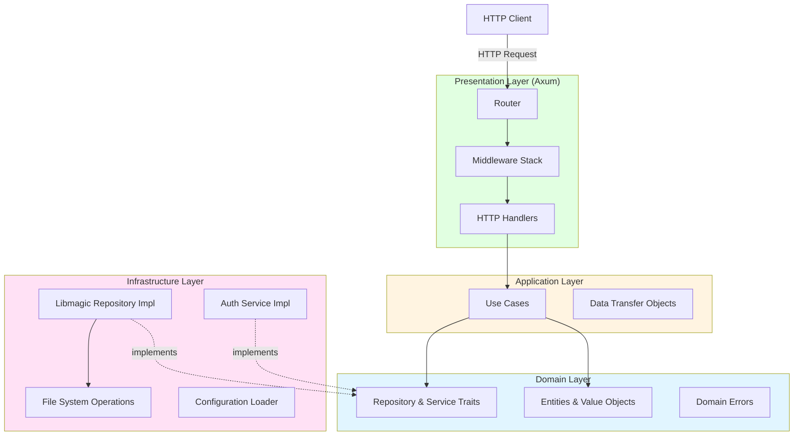
```mermaid
graph TB
    Client[HTTP Client]
    
    subgraph Presentation["Presentation Layer (Axum)"]
        Router[Router]
        Middleware[Middleware Stack]
        Handlers[HTTP Handlers]
    end
    
    subgraph Application["Application Layer"]
        UseCases[Use Cases]
        DTOs[Data Transfer Objects]
    end
    
    subgraph Domain["Domain Layer"]
        Entities[Entities & Value Objects]
        Traits[Repository & Service Traits]
        DomainErrors[Domain Errors]
    end
    
    subgraph Infrastructure["Infrastructure Layer"]
        LibmagicImpl[Libmagic Repository Impl]
        AuthImpl[Auth Service Impl]
        FileSystem[File System Operations]
        Config[Configuration Loader]
    end
    
    Client -->|HTTP Request| Router
    Router --> Middleware
    Middleware --> Handlers
    Handlers --> UseCases
    UseCases --> Entities
    UseCases --> Traits
    LibmagicImpl -.->|implements| Traits
    AuthImpl -.->|implements| Traits
    LibmagicImpl --> FileSystem
    
    style Domain fill:#e1f5ff
    style Application fill:#fff4e1
    style Infrastructure fill:#ffe1f5
    style Presentation fill:#e1ffe1
```

### 2.2. Layer Dependencies

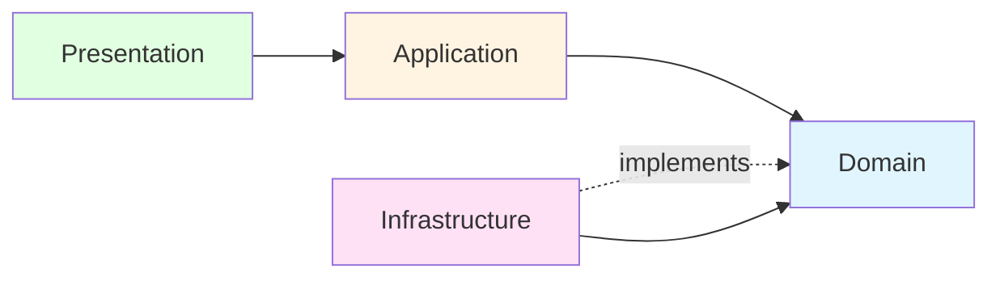
```mermaid
graph LR
    P[Presentation] --> A[Application]
    A --> D[Domain]
    I[Infrastructure] -.->|implements| D
    I --> D
    
    style D fill:#e1f5ff
    style A fill:#fff4e1
    style I fill:#ffe1f5
    style P fill:#e1ffe1
```

**Dependency Rules:**
- Solid arrows: Direct compile-time dependencies
- Dotted arrows: Runtime trait implementation
- All dependencies point toward the domain core
- Infrastructure depends on domain for trait definitions
- Presentation never directly depends on infrastructure

---

## 3. Clean Architecture Layers

### 3.1. Domain Layer

**Location:** `src/domain/`

**Purpose:** Contains pure business logic and domain rules with no framework or I/O dependencies. This layer defines the core abstractions and business entities.

**Directory Structure:**
```
src/domain/
├── entities/          # Domain entities with identity
├── value_objects/     # Immutable validated objects
├── repositories/      # Repository trait definitions
├── services/          # Domain service trait definitions
└── errors/            # Domain-specific error types
```

**Key Components:**

| Component | Purpose |
|-----------|---------|
| `entities/magic_result.rs` | Core entity representing file magic analysis result |
| `value_objects/filename.rs` | Validated Windows-compatible filename (max 310 chars) |
| `value_objects/file_path.rs` | Validated relative path (no traversal) |
| `value_objects/request_id.rs` | UUID v4 wrapper for request correlation |
| `value_objects/mime_type.rs` | Validated MIME type representation |
| `value_objects/credentials.rs` | Authentication credentials container |
| `repositories/magic_repository.rs` | Trait defining file magic analysis operations |
| `services/authentication_service.rs` | Trait defining authentication behavior |
| `errors/` | Validation, magic analysis, and domain-level errors |

**Constraints:**
- No dependencies on external crates except Rust standard library
- All validation logic lives here
- Defines abstractions (traits) implemented by infrastructure

### 3.2. Application Layer

**Location:** `src/application/`

**Purpose:** Orchestrates domain objects to implement business use cases. This layer coordinates workflows without containing business rules or I/O logic.

**Directory Structure:**
```
src/application/
├── use_cases/         # Business workflow implementations
├── dtos/              # Data transfer objects for use case boundaries
└── errors/            # Application-level error types
```

**Key Components:**

| Component | Purpose |
|-----------|---------|
| `use_cases/analyze_content.rs` | Orchestrates file magic analysis from binary content |
| `use_cases/analyze_path.rs` | Orchestrates file magic analysis from file path |
| `use_cases/health_check.rs` | System health verification workflow |
| `dtos/analyze_content_request.rs` | Input DTO for content analysis |
| `dtos/analyze_path_request.rs` | Input DTO for path-based analysis |
| `dtos/magic_response.rs` | Output DTO with magic analysis results |

**Responsibilities:**
- Receive requests through DTOs
- Validate business workflow constraints
- Call domain repositories through trait interfaces
- Transform domain entities into response DTOs
- Handle cross-cutting concerns (timeouts, transaction boundaries)

**Constraints:**
- Depends only on domain layer
- No knowledge of HTTP, databases, or external systems
- Receives infrastructure implementations through dependency injection

### 3.3. Infrastructure Layer

**Location:** `src/infrastructure/`

**Purpose:** Implements domain-defined abstractions with concrete external integrations. This layer contains all I/O operations, framework integrations, and platform-specific code.

**Directory Structure:**
```
src/infrastructure/
├── magic/             # Libmagic FFI bindings and implementation
│   ├── ffi.rs        # Raw extern "C" declarations
│   ├── wrapper.rs    # Safe Rust wrapper
│   └── lib.rs        # Repository implementation
├── auth/              # Authentication service implementation
├── filesystem/        # File system utilities, sandbox, mmap, temp files
└── config/            # Configuration loading and parsing
```

**Key Components:**

| Component | Purpose |
|-----------|---------|
| `magic/libmagic_repository.rs` | Implements MagicRepository using libmagic C library |
| `auth/basic_auth_service.rs` | Implements AuthenticationService with basic auth |
| `magic/ffi.rs` | Raw FFI bindings to libmagic C API with extern declarations |
| `magic/wrapper.rs` | Safe Rust wrapper over raw FFI with RAII cleanup |
| `magic/libmagic_repository.rs` | Repository trait implementation using custom FFI |
| `filesystem/sandbox.rs` | Path validation and sandbox boundary enforcement |
| `filesystem/mmap.rs` | Memory-mapped I/O abstraction for large files |
| `filesystem/temp_file_handler.rs` | Streaming writes and RAII cleanup for temp files |
| `config/server_config.rs` | Configuration file parsing and environment variable loading |

**Implementation Notes:**
- Custom FFI bindings built from scratch without using `magic` crate
- Uses `tokio::task::spawn_blocking` for blocking libmagic calls
- Maps C errors to domain error types at FFI boundary
- Provides thread-safe access to libmagic through Arc and Mutex
- Uses memory-mapped I/O for efficient large file handling
- Enforces path canonicalization and symlink policies

### 3.4. Presentation Layer

**Location:** `src/presentation/`

**Purpose:** Handles HTTP protocol details, request routing, and response formatting using Axum framework. This layer translates HTTP requests into application use cases and formats results as HTTP responses.

**Directory Structure:**
```
src/presentation/
├── http/
│   ├── handlers/      # HTTP endpoint implementations
│   ├── middleware/    # Request/response middleware
│   ├── extractors/    # Custom Axum extractors
│   ├── responses/     # Response type definitions
│   └── router.rs      # Route configuration
└── state/             # Shared application state
```

**Key Components:**

| Component | Purpose |
|-----------|---------|
| `http/handlers/magic_handlers.rs` | Handles POST /v1/magic/content and /v1/magic/path |
| `http/handlers/health_handlers.rs` | Handles GET /v1/ping health check |
| `http/middleware/request_id.rs` | Injects UUID into request extensions |
| `http/middleware/auth.rs` | Validates basic authentication credentials |
| `http/middleware/timeout.rs` | Enforces request timeout constraints |
| `http/middleware/error_handler.rs` | Maps errors to HTTP status codes and JSON |
| `http/extractors/filename.rs` | Extracts and validates filename query parameter |
| `http/responses/` | JSON response structures with IntoResponse trait |
| `http/router.rs` | Axum router configuration and middleware composition |
| `state/app_state.rs` | Dependency injection container for handlers |

**Responsibilities:**
- Parse HTTP requests and extract parameters
- Validate HTTP-level constraints (headers, content-type)
- Delegate to application use cases
- Format responses as JSON with appropriate status codes
- Apply middleware for cross-cutting concerns

---

## 4. Component Architecture

### 4.1. Domain Components

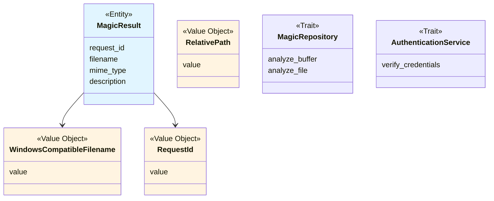
```mermaid
classDiagram
    class MagicResult {
        <<Entity>>
        request_id
        filename
        mime_type
        description
    }
    
    class WindowsCompatibleFilename {
        <<Value Object>>
        value
    }
    
    class RelativePath {
        <<Value Object>>
        value
    }
    
    class RequestId {
        <<Value Object>>
        value
    }
    
    class MagicRepository {
        <<Trait>>
        analyze_buffer
        analyze_file
    }
    
    class AuthenticationService {
        <<Trait>>
        verify_credentials
    }
    
    MagicResult --> WindowsCompatibleFilename
    MagicResult --> RequestId
    
    style MagicResult fill:#e1f5ff
    style WindowsCompatibleFilename fill:#fff4e1
    style RelativePath fill:#fff4e1
    style RequestId fill:#fff4e1
```

**Domain Component Descriptions:**

| Component | Type | Location | Purpose |
|-----------|------|----------|---------|
| WindowsCompatibleFilename | Value Object | `domain/value_objects/filename.rs` | Encapsulates filename validation (max 310 chars, no `/` or `\0`) |
| RelativePath | Value Object | `domain/value_objects/file_path.rs` | Encapsulates path validation (no leading `/`, no `..`, no `//`) |
| RequestId | Value Object | `domain/value_objects/request_id.rs` | Wraps UUID v4 for request correlation |
| MimeType | Value Object | `domain/value_objects/mime_type.rs` | Validates and represents MIME types |
| BasicAuthCredentials | Value Object | `domain/value_objects/credentials.rs` | Contains username/password pair |
| MagicResult | Entity | `domain/entities/magic_result.rs` | Aggregates file magic analysis results with identity |
| MagicRepository | Trait | `domain/repositories/magic_repository.rs` | Defines interface for file magic analysis operations |
| AuthenticationService | Trait | `domain/services/authentication_service.rs` | Defines interface for credential verification |

**MagicRepository Unified Interface:**

The MagicRepository trait uses a unified interface that accepts a byte slice regardless of data source:

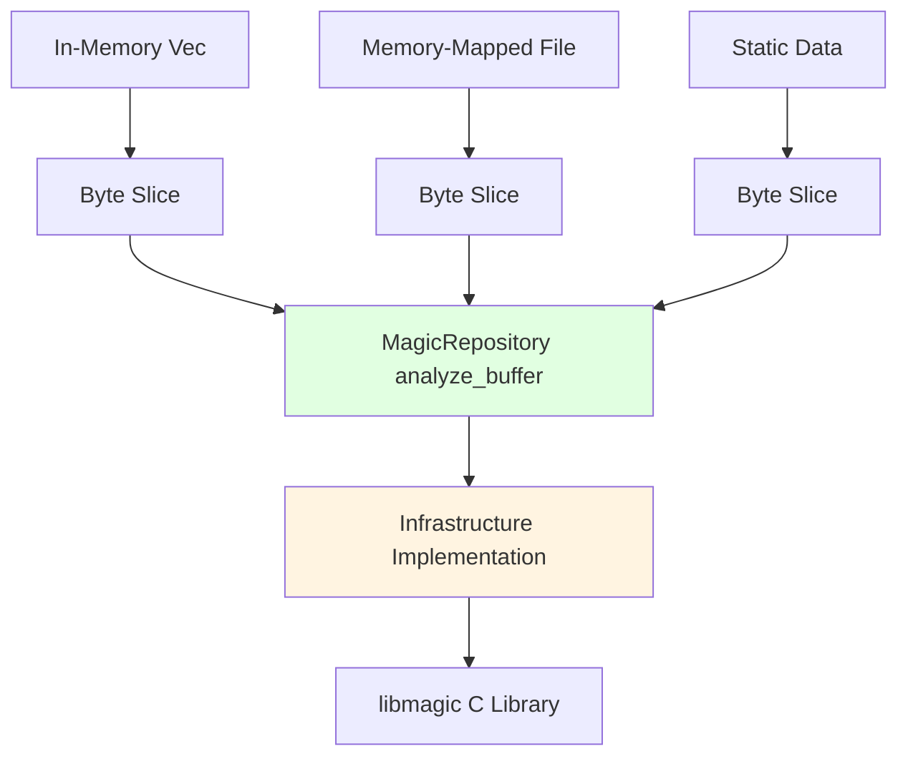
```mermaid
graph TB
    Memory[In-Memory Vec] --> Slice1[Byte Slice]
    Mmap[Memory-Mapped File] --> Slice2[Byte Slice]
    Static[Static Data] --> Slice3[Byte Slice]
    
    Slice1 --> Trait[MagicRepository analyze_buffer]
    Slice2 --> Trait
    Slice3 --> Trait
    
    Trait --> Impl[Infrastructure Implementation]
    Impl --> Libmagic[libmagic C Library]
    
    style Trait fill:#e1ffe1
    style Impl fill:#fff4e1
```

**Interface Design:**

| Method | Signature | Accepts | Purpose |
|--------|-----------|---------|---------|
| analyze_buffer | analyze_buffer(data, filename) | Any byte slice | Analyzes binary data from any source |
| analyze_file | analyze_file(path) | File path | Analyzes file by path (libmagic opens file) |

**Unified Byte Slice Acceptance:**

The analyze_buffer method accepts byte slices from any source without distinction:

1. **In-Memory Buffers** - Small files (< 10MB) held in `Vec<u8>` or `Bytes`
2. **Memory-Mapped Slices** - Large files (≥ 10MB) mapped via `mmap()` 
3. **Static Data** - Compile-time embedded data or test fixtures
4. **Network Buffers** - Data from HTTP request bodies
5. **Any `AsRef<[u8]>`** - Any type implementing byte slice reference

**Benefits of Unified Interface:**

- **Simplicity:** Single method for all buffer sources
- **Flexibility:** Caller decides memory strategy (buffer vs mmap)
- **Zero-Copy:** Mmap slices passed without additional copying
- **Testability:** Easy to test with static byte arrays
- **Composability:** Works with any `&[u8]` provider

**Usage Examples:**

The unified interface accepts byte slices from various sources:

| Source Type | Description | Use Case |
|-------------|-------------|----------|
| Small file buffer | In-memory Vec<u8> from file read | Files under threshold |
| Memory-mapped file | Mmap slice reference | Large files over threshold |
| Static test data | Const byte array | Unit testing |
| Network buffer | HTTP request body bytes | Direct analysis |

**Implementation Note:**

Infrastructure layer (`LibmagicRepository`) receives `&[u8]` and passes it directly to libmagic's `magic_buffer()` FFI call via raw pointer. The libmagic C library treats all byte slices identically regardless of their memory source.

### 4.2. Application Flow

#### Standard Content Analysis

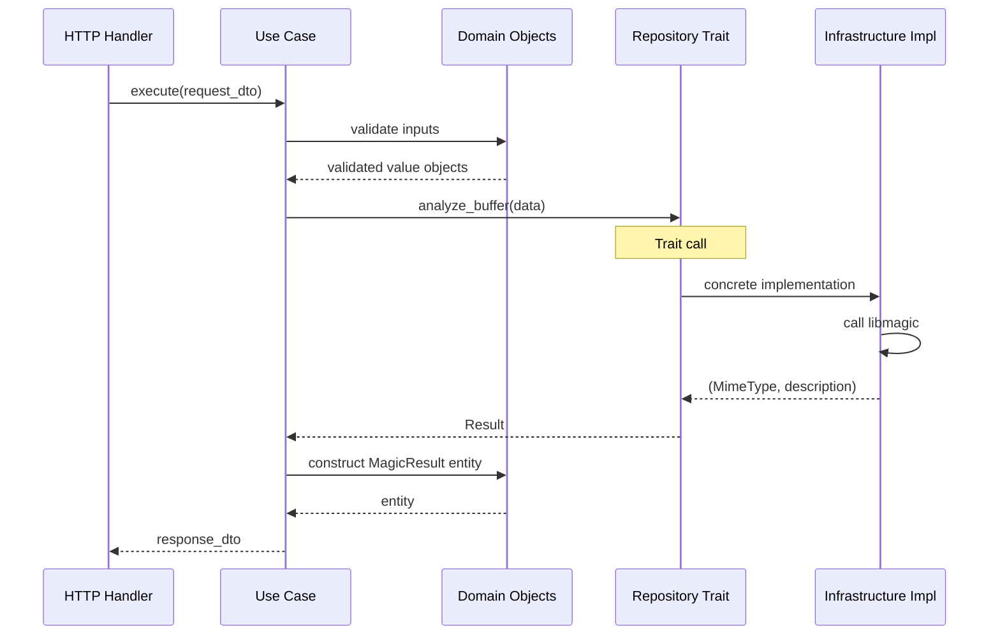
```mermaid
sequenceDiagram
    participant Handler as HTTP Handler
    participant UseCase as Use Case
    participant Domain as Domain Objects
    participant Repo as Repository Trait
    participant Impl as Infrastructure Impl
    
    Handler->>UseCase: execute(request_dto)
    UseCase->>Domain: validate inputs
    Domain-->>UseCase: validated value objects
    UseCase->>Repo: analyze_buffer(data)
    Note over Repo: Trait call
    Repo->>Impl: concrete implementation
    Impl->>Impl: call libmagic
    Impl-->>Repo: (MimeType, description)
    Repo-->>UseCase: Result
    UseCase->>Domain: construct MagicResult entity
    Domain-->>UseCase: entity
    UseCase-->>Handler: response_dto
```

#### Large File Analysis Flow

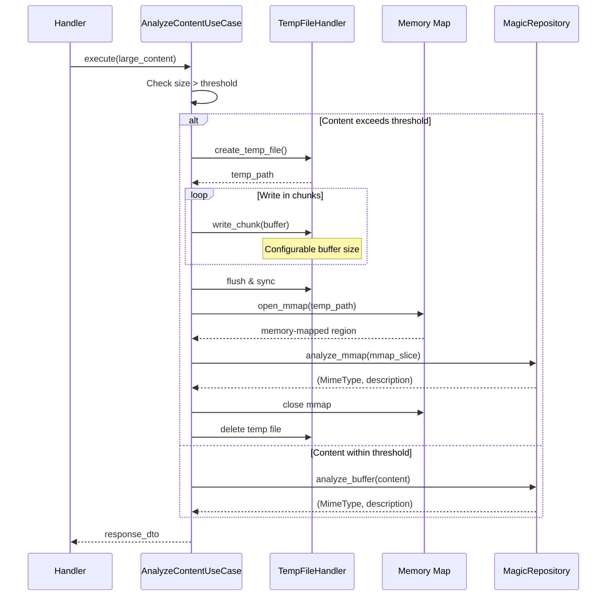
```mermaid
sequenceDiagram
    participant Handler
    participant UseCase as AnalyzeContentUseCase
    participant TempFile as TempFileHandler
    participant Mmap as Memory Map
    participant Repo as MagicRepository
    
    Handler->>UseCase: execute(large_content)
    UseCase->>UseCase: Check size > threshold
    
    alt Content exceeds threshold
        UseCase->>TempFile: create_temp_file()
        TempFile-->>UseCase: temp_path
        
        loop Write in chunks
            UseCase->>TempFile: write_chunk(buffer)
            Note over TempFile: Configurable buffer size
        end
        
        UseCase->>TempFile: flush & sync
        UseCase->>Mmap: open_mmap(temp_path)
        Mmap-->>UseCase: memory-mapped region
        UseCase->>Repo: analyze_mmap(mmap_slice)
        Repo-->>UseCase: (MimeType, description)
        UseCase->>Mmap: close mmap
        UseCase->>TempFile: delete temp file
    else Content within threshold
        UseCase->>Repo: analyze_buffer(content)
        Repo-->>UseCase: (MimeType, description)
    end
    
    UseCase-->>Handler: response_dto
```

**Use Case Orchestration:**

The application layer coordinates domain operations through three primary use cases:

1. **AnalyzeContentUseCase** (`application/use_cases/analyze_content.rs`)
   - Receives binary content and filename from handler
   - Validates content is non-empty
   - **Large File Handling:** If content exceeds threshold, streams to temporary file
   - Uses memory-mapped I/O for large files to reduce memory footprint
   - Delegates to MagicRepository trait
   - Constructs response DTO from domain entity
   - Applies 30-second timeout constraint
   - Cleans up temporary files after analysis

2. **AnalyzePathUseCase** (`application/use_cases/analyze_path.rs`)
   - Receives file path and filename from handler
   - Validates path is within sandbox boundaries
   - Checks file existence before analysis
   - Delegates to MagicRepository trait
   - Returns 404 error if file not found

3. **HealthCheckUseCase** (`application/use_cases/health_check.rs`)
   - Simple liveness probe
   - Returns success immediately
   - No external dependencies

### 4.3. Large Content Handling Strategy

**Problem:** Analyzing large files (10MB-100MB) in memory can cause:
- High memory consumption under concurrent load
- Increased garbage collection pressure
- Potential out-of-memory conditions

**Solution:** Stream large content to temporary file and use memory-mapped I/O.

#### Architecture

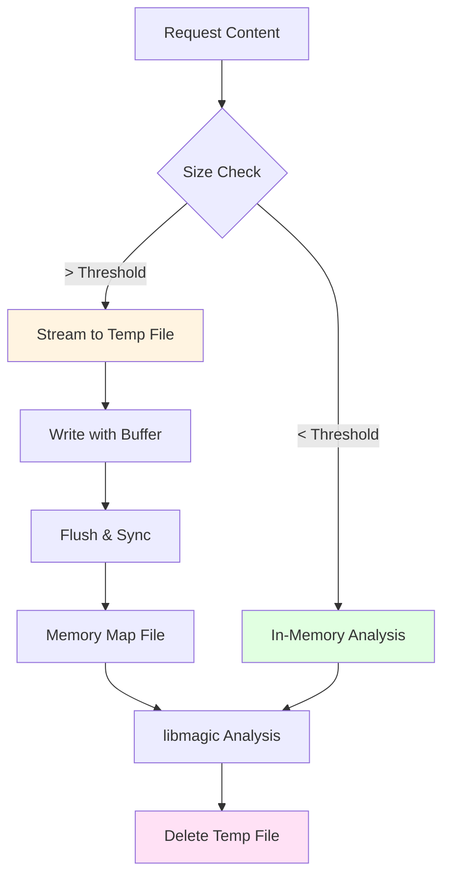
```mermaid
graph TB
    Content[Request Content] --> Check{Size Check}
    
    Check -->|< Threshold| Memory[In-Memory Analysis]
    Check -->|> Threshold| Stream[Stream to Temp File]
    
    Stream --> Write[Write with Buffer]
    Write --> Flush[Flush & Sync]
    Flush --> Mmap[Memory Map File]
    Mmap --> Analyze[libmagic Analysis]
    Analyze --> Cleanup[Delete Temp File]
    
    Memory --> Analyze
    
    style Memory fill:#e1ffe1
    style Stream fill:#fff4e1
    style Cleanup fill:#ffe1f5
```

#### Configuration Parameters

| Parameter | Config Key | Default | Purpose |
|-----------|-----------|---------|---------|
| **Size Threshold** | `analysis.large_file_threshold_mb` | 10 MB | Trigger point for file streaming |
| **Write Buffer Size** | `analysis.write_buffer_size_kb` | 64 KB | Chunk size for streaming writes |
| **Temp Directory** | `analysis.temp_dir` | `/tmp/magicer` | Location for temporary files |

#### Processing Strategy

**Chunked Content:**
1. Content is always streamed to a temporary file regardless of size.
2. Temporary file is created with a unique name.
3. Content is written in configurable chunks.
4. Analysis is performed using memory-mapped I/O on the temporary file.

**Small Content (No Chunked & < Threshold):**
1. Keep entire content in memory
2. Pass directly to libmagic via buffer API
3. No file I/O overhead
4. Fast path for typical requests

**Large Content (No Chunked & ≥ Threshold):**
1. Create temporary file with unique name
2. Stream content in configurable chunks
3. Flush and sync to ensure data persistence
4. Open file with memory-mapped I/O (mmap)
5. Pass mmap slice to libmagic
6. Close mmap and delete temporary file

#### Memory-Mapped I/O Benefits

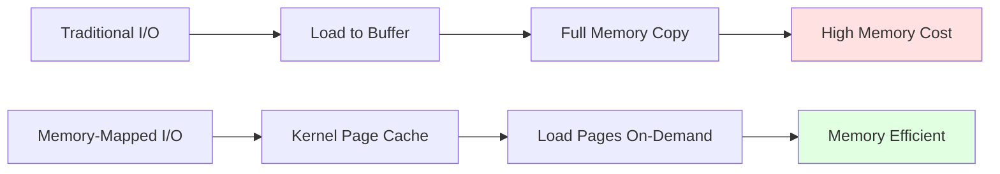
```mermaid
graph LR
    Traditional[Traditional I/O] --> Buffer[Load to Buffer]
    Buffer --> Memory[Full Memory Copy]
    
    Mmap[Memory-Mapped I/O] --> Kernel[Kernel Page Cache]
    Kernel --> OnDemand[Load Pages On-Demand]
    
    Memory --> Cost[High Memory Cost]
    OnDemand --> Efficient[Memory Efficient]
    
    style Cost fill:#ffe1e1
    style Efficient fill:#e1ffe1
```

**Advantages:**
- **Lazy Loading:** Pages loaded only when accessed
- **Kernel Cache:** Leverages OS page cache
- **Memory Efficiency:** No duplicate buffering
- **Performance:** Near-native file access speed

#### Temporary File Management

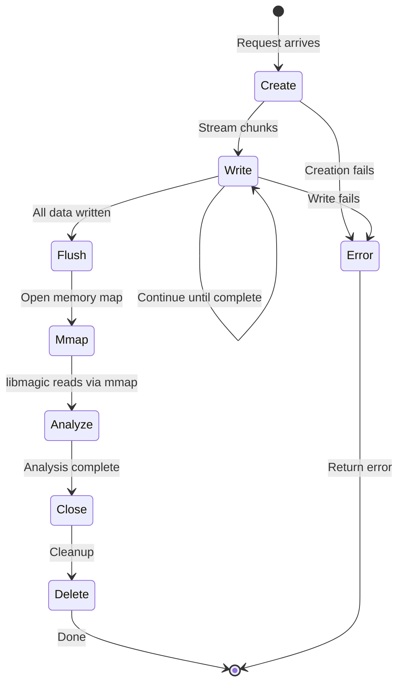
```mermaid
stateDiagram-v2
    [*] --> Create: Request arrives
    Create --> Write: Stream chunks
    Write --> Write: Continue until complete
    Write --> Flush: All data written
    Flush --> Mmap: Open memory map
    Mmap --> Analyze: libmagic reads via mmap
    Analyze --> Close: Analysis complete
    Close --> Delete: Cleanup
    Delete --> [*]: Done
    
    Create --> Error: Creation fails
    Write --> Error: Write fails
    Error --> [*]: Return error
```

**Safety Requirements:**

| Requirement | Implementation |
|-------------|----------------|
| **Unique Names** | UUID-based temp file names |
| **Atomic Creation** | `O_CREAT \| O_EXCL` flags prevent race conditions |
| **Atomic Cleanup** | Drop trait ensures deletion |
| **Panic Safety** | RAII pattern for cleanup |
| **Permission Control** | File created with 0600 (owner only) |
| **Directory Isolation** | Separate temp directory from sandbox |

**Atomic File Creation (Preventing Concurrent Write Races):**

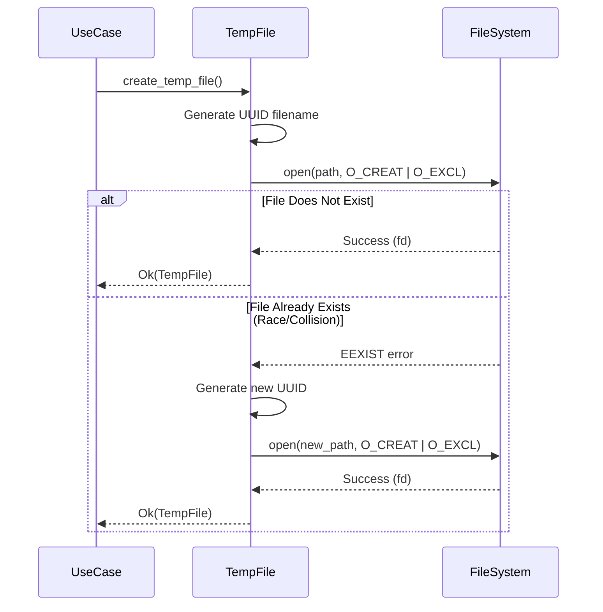
```mermaid
sequenceDiagram
    participant UseCase
    participant TempFile
    participant FileSystem
    
    UseCase->>TempFile: create_temp_file()
    TempFile->>TempFile: Generate UUID filename
    
    TempFile->>FileSystem: open(path, O_CREAT | O_EXCL)
    
    alt File Does Not Exist
        FileSystem-->>TempFile: Success (fd)
        TempFile-->>UseCase: Ok(TempFile)
    else File Already Exists (Race/Collision)
        FileSystem-->>TempFile: EEXIST error
        TempFile->>TempFile: Generate new UUID
        TempFile->>FileSystem: open(new_path, O_CREAT | O_EXCL)
        FileSystem-->>TempFile: Success (fd)
        TempFile-->>UseCase: Ok(TempFile)
    end
```

**Atomic Creation Strategy:**

| Component | Specification | Purpose |
|-----------|--------------|---------|
| **Filename Format** | `{request_id}_{timestamp}_{random}.tmp` | Collision-resistant naming |
| **Open Flags** | `O_CREAT \| O_EXCL \| O_RDWR` | Atomic creation, fail if exists |
| **Collision Handling** | Retry with new random suffix (max 3 attempts) | Handle UUID collision edge case |
| **Permissions** | `0600` (owner read/write only) | Security isolation |
| **Error Detection** | `EEXIST` errno indicates collision | Explicit collision detection |

**Race Condition Prevention:**

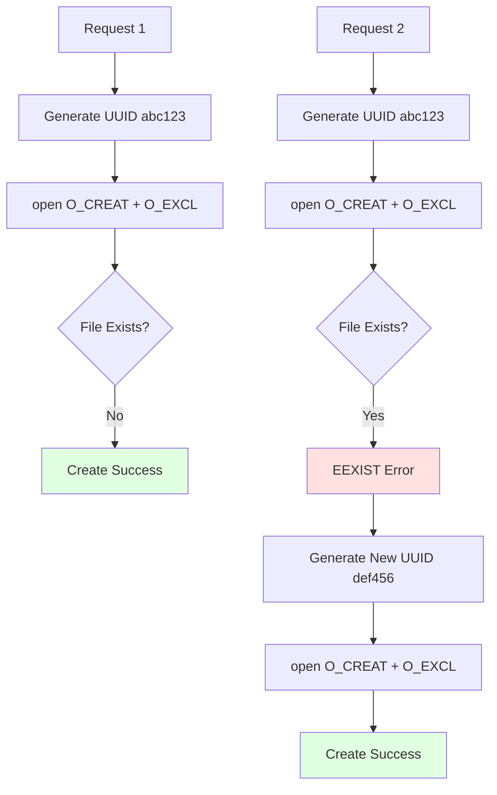
```mermaid
graph TB
    Request1[Request 1] --> UUID1[Generate UUID abc123]
    Request2[Request 2] --> UUID2[Generate UUID abc123]
    
    UUID1 --> Create1["open O_CREAT + O_EXCL"]
    UUID2 --> Create2["open O_CREAT + O_EXCL"]
    
    Create1 --> Check1{File Exists?}
    Create2 --> Check2{File Exists?}
    
    Check1 -->|No| Success1[Create Success]
    Check2 -->|Yes| Fail[EEXIST Error]
    
    Fail --> Retry[Generate New UUID def456]
    Retry --> Create3["open O_CREAT + O_EXCL"]
    Create3 --> Success2[Create Success]
    
    style Success1 fill:#e1ffe1
    style Success2 fill:#e1ffe1
    style Fail fill:#ffe1e1
```

**Implementation Requirements:**

The temporary file creation process uses atomic file operations with retry logic to handle collisions.

**Atomic Creation Process:**

| Step | Action | Purpose |
|------|--------|---------|
| 1. Generate unique filename | UUID + timestamp + random suffix | Minimize collision probability |
| 2. Open with create_new flag | O_CREAT + O_EXCL flags | Atomic existence check and creation |
| 3. Check for collision | ErrorKind::AlreadyExists | Detect race condition |
| 4. Retry on collision | Generate new filename | Handle collision gracefully |
| 5. Fail after max retries | Return error | Prevent infinite loops |

**Filename Generation Strategy:**

The unique filename combines three entropy sources to minimize collision probability:

| Component | Type | Entropy | Example |
|-----------|------|---------|---------|
| Request ID | UUID v4 | 122 bits | `550e8400-e29b-41d4-a716-446655440000` |
| Timestamp | Nanoseconds since epoch | Time-based | `1707654321000000000` |
| Random suffix | 32-bit random | 32 bits | `3847562109` |
| **Combined** | - | **~154 bits** | `550e8400_1707654321_3847562109.tmp` |

**Retry Logic:**

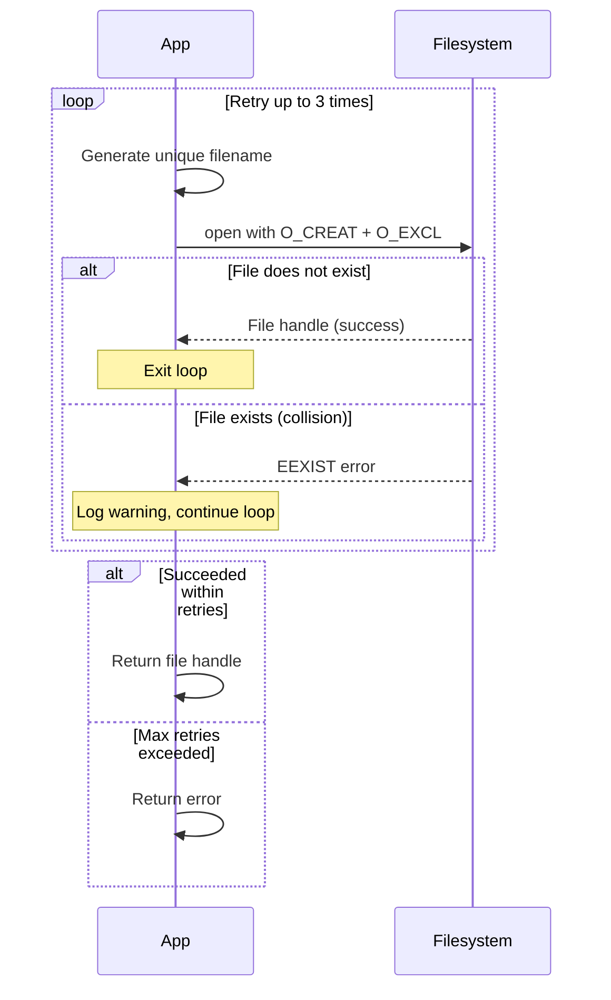
```mermaid
sequenceDiagram
    participant App
    participant FS as Filesystem
    
    loop Retry up to 3 times
        App->>App: Generate unique filename
        App->>FS: open with O_CREAT + O_EXCL
        
        alt File does not exist
            FS-->>App: File handle (success)
            Note over App: Exit loop
        else File exists (collision)
            FS-->>App: EEXIST error
            Note over App: Log warning, continue loop
        end
    end
    
    alt Succeeded within retries
        App->>App: Return file handle
    else Max retries exceeded
        App->>App: Return error
    end
```

**Collision Probability Analysis:**

| Scenario | Probability | Mitigation |
|----------|------------|------------|
| UUID v4 collision | 2^-122 (negligible) | UUIDs provide sufficient entropy |
| Timestamp collision | Possible with concurrent requests | Add random suffix |
| Combined collision | 2^-122 × 2^-32 (virtually impossible) | Triple-component naming |
| Retry exhaustion | Only if 3 consecutive collisions | Extremely unlikely, logged |

**Atomic Operations Guarantee:**

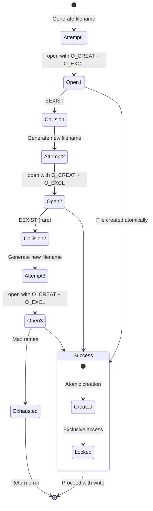
```mermaid
stateDiagram-v2
    [*] --> Attempt1: Generate filename
    Attempt1 --> Open1: open with O_CREAT + O_EXCL
    
    Open1 --> Success: File created atomically
    Open1 --> Collision: EEXIST
    
    Collision --> Attempt2: Generate new filename
    Attempt2 --> Open2: open with O_CREAT + O_EXCL
    
    Open2 --> Success
    Open2 --> Collision2: EEXIST (rare)
    
    Collision2 --> Attempt3: Generate new filename
    Attempt3 --> Open3: open with O_CREAT + O_EXCL
    
    Open3 --> Success
    Open3 --> Exhausted: Max retries
    
    Success --> [*]: Proceed with write
    Exhausted --> [*]: Return error
    
    state Success {
        [*] --> Created: Atomic creation
        Created --> Locked: Exclusive access
    }
```

**Benefits of Atomic Creation:**

1. **Race Condition Prevention:** `O_EXCL` ensures atomic test-and-set
2. **No TOCTOU Vulnerability:** Check and create in single atomic operation
3. **Concurrent Safety:** Multiple threads/processes cannot create same file
4. **Explicit Collision Detection:** `EEXIST` clearly indicates collision
5. **Deterministic Retry:** Known error condition enables retry logic

**Security Properties:**

| Property | Guarantee | Verification |
|----------|-----------|--------------|
| **Atomicity** | File creation is atomic operation | Kernel-level guarantee |
| **Exclusivity** | Only one process can create specific filename | `O_EXCL` flag enforcement |
| **No Symlink Attacks** | `O_EXCL` fails on existing symlinks | POSIX specification |
| **Permission Enforcement** | Mode set atomically at creation | `mode(0o600)` |

**Error Handling:**

| Error Condition | errno | Action |
|----------------|-------|--------|
| File already exists | `EEXIST` | Retry with new filename |
| Permission denied | `EACCES` | Return error (directory permission issue) |
| Disk full | `ENOSPC` | Return 507 Insufficient Storage |
| Max retries exceeded | N/A | Return error with context |

**Testing Requirements:**

1. **Collision Simulation:** Force same UUID generation to verify retry
2. **Concurrent Creation:** Spawn multiple threads with same filename
3. **Permission Verification:** Ensure 0600 mode set atomically
4. **Retry Logic:** Verify max 3 attempts, exponential backoff
5. **Error Context:** Verify error messages include filename and attempt count

**Monitoring:**

Track temporary file operations with metrics:

| Metric | Event | Purpose |
|--------|-------|---------|
| `temp_file_creation_total` | File created successfully | Count total creations |
| `temp_file_collision_total` | EEXIST error occurred | Track collision frequency |
| `temp_file_retry_total` | Retry attempt made | Monitor retry patterns |
| `temp_file_retry_exhausted_total` | Max retries exceeded | Alert on failures |

**Implementation Location:**

- **Atomic Creation:** `infrastructure/filesystem/temp_file_handler.rs`
- **Filename Generation:** `infrastructure/filesystem/temp_file_handler.rs`
- **Retry Logic:** `infrastructure/filesystem/temp_file_handler.rs`
- **Error Types:** `domain/errors/storage_error.rs`

#### Error Handling

| Error Scenario | Response |
|----------------|----------|
| Temp file creation fails | Return 500 Internal Server Error |
| Write fails (disk full) | Return 507 Insufficient Storage |
| Mmap fails | Fallback to buffer analysis or error |
| Analysis timeout | Delete temp file, return 504 |
| Cleanup fails | Log warning, continue |

#### Resource Limits

**Concurrent Temp Files:**
- Maximum concurrent requests: 1000 (connection limit)
- Maximum temp files: 1000 (one per request)
- Disk space check: Recommended 10GB free minimum

**Disk Space Management:**
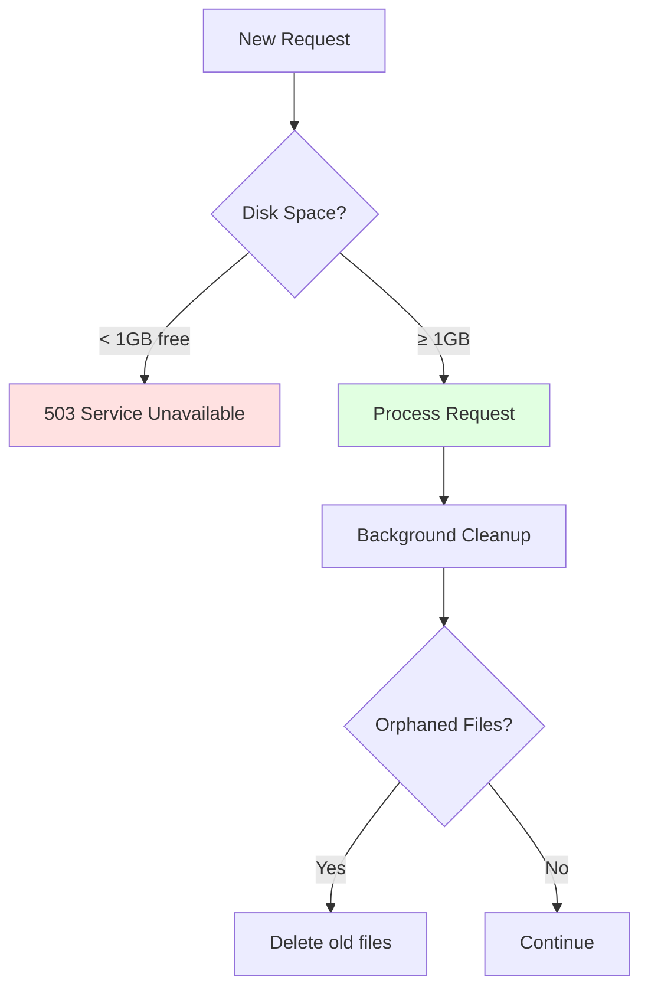
```mermaid
graph TB
    Request[New Request] --> Check{Disk Space?}
    Check -->|< 1GB free| Reject[503 Service Unavailable]
    Check -->|≥ 1GB| Process[Process Request]
    
    Process --> Monitor[Background Cleanup]
    Monitor --> Orphaned{Orphaned Files?}
    Orphaned -->|Yes| Delete[Delete old files]
    Orphaned -->|No| Continue[Continue]
    
    style Reject fill:#ffe1e1
    style Process fill:#e1ffe1
```

**Orphaned File Cleanup:**
- Background task runs every 5 minutes
- Deletes temp files older than 1 hour
- Logs cleanup operations

#### Implementation Location

| Component | Location | Responsibility |
|-----------|----------|----------------|
| Use Case Logic | `application/use_cases/analyze_content.rs` | Size check, orchestration |
| TempFileHandler | `infrastructure/filesystem/temp_file_handler.rs` | File creation, RAII cleanup |
| Mmap Wrapper | `infrastructure/filesystem/mmap.rs` | Memory-mapped I/O abstraction |
| Configuration | `infrastructure/config/server_config.rs` | Threshold and buffer size |

### 4.4. Infrastructure Integration

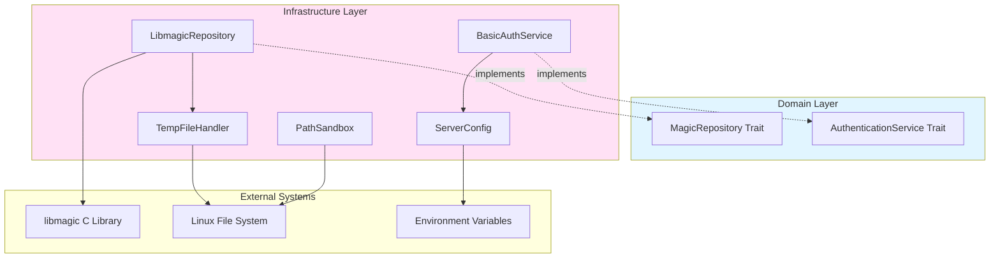
```mermaid
graph TB
    subgraph Domain["Domain Layer"]
        MRTrait[MagicRepository Trait]
        ASTrait[AuthenticationService Trait]
    end
    
    subgraph Infrastructure["Infrastructure Layer"]
        LibmagicImpl[LibmagicRepository]
        AuthImpl[BasicAuthService]
        Sandbox[PathSandbox]
        TempFile[TempFileHandler]
        Config[ServerConfig]
    end
    
    subgraph External["External Systems"]
        Libmagic[libmagic C Library]
        FileSystem[Linux File System]
        EnvVars[Environment Variables]
    end
    
    LibmagicImpl -.->|implements| MRTrait
    AuthImpl -.->|implements| ASTrait
    
    LibmagicImpl --> Libmagic
    LibmagicImpl --> TempFile
    TempFile --> FileSystem
    Sandbox --> FileSystem
    AuthImpl --> Config
    Config --> EnvVars
    
    style Domain fill:#e1f5ff
    style Infrastructure fill:#ffe1f5
```

**Infrastructure Components:**

| Component | Location | Purpose |
|-----------|----------|---------|
| LibmagicRepository | `infrastructure/magic/libmagic_repository.rs` | Repository implementation coordinating FFI calls |
| Raw FFI Bindings | `infrastructure/magic/ffi.rs` | Raw `extern "C"` declarations for libmagic |
| Safe FFI Wrapper | `infrastructure/magic/wrapper.rs` | Safe Rust wrapper over raw FFI with RAII cleanup |
| Mmap Handler | `infrastructure/filesystem/mmap.rs` | Memory-mapped I/O for large file analysis |
| BasicAuthService | `infrastructure/auth/basic_auth_service.rs` | Credential verification with constant-time comparison |
| PathSandbox | `infrastructure/filesystem/sandbox.rs` | Path canonicalization and boundary enforcement |
| TempFileHandler | `infrastructure/filesystem/temp_file_handler.rs` | RAII-based temporary file management with streaming |
| ServerConfig | `infrastructure/config/server_config.rs` | Configuration loading from TOML and environment |

### 4.5. HTTP Request Streaming Architecture

The server conditionally streams HTTP request bodies to temporary files based on the transfer encoding and content length.

#### Request Body Streaming Flow

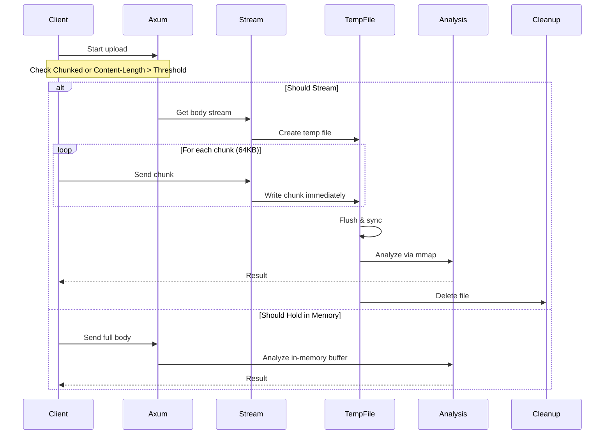
```mermaid
sequenceDiagram
    participant Client
    participant Axum
    participant Stream
    participant TempFile
    participant Analysis
    participant Cleanup
    
    Client->>Axum: Start upload
    Note over Client,Axum: Check Chunked or Content-Length > Threshold
    
    alt Should Stream
        Axum->>Stream: Get body stream
        Stream->>TempFile: Create temp file
        
        loop For each chunk (64KB)
            Client->>Stream: Send chunk
            Stream->>TempFile: Write chunk immediately
        end
        
        TempFile->>TempFile: Flush & sync
        TempFile->>Analysis: Analyze via mmap
        Analysis-->>Client: Result
        TempFile->>Cleanup: Delete file
    else Should Hold in Memory
        Client->>Axum: Send full body
        Axum->>Analysis: Analyze in-memory buffer
        Analysis-->>Client: Result
    end
```

**Request Flow:**
- **Chunked OR Content-Length > Threshold:** Client → Stream to Temp File (64KB buffer) → Analysis → Response
- **Otherwise:** Client → In-Memory Buffer → Analysis → Response

**Memory Footprint:** 
- **Streaming:** Constant 64KB regardless of file size
- **In-Memory:** Equal to file size (up to threshold)

#### Architecture Benefits

**1. Efficient Memory Usage**

For large files or streams of unknown size, the server maintains a constant memory footprint. For small files, it avoids disk I/O latency.

**2. Earlier Failure Detection (for Streaming)**

For requests that are streamed, disk full is detected before buffering the entire upload.

**3. Flexible Processing Path**

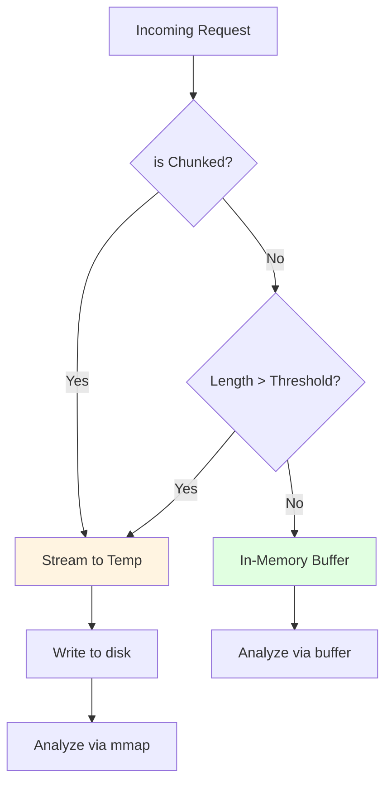
```mermaid
graph TB
    Request[Incoming Request] --> Chunked{is Chunked?}
    Chunked -->|Yes| Stream[Stream to Temp]
    Chunked -->|No| LengthCheck{Length > Threshold?}
    LengthCheck -->|Yes| Stream
    LengthCheck -->|No| Memory[In-Memory Buffer]
    
    Stream --> Write[Write to disk]
    Write --> AnalyzeStream[Analyze via mmap]
    Memory --> AnalyzeMem[Analyze via buffer]
    
    style Stream fill:#fff4e1
    style Memory fill:#e1ffe1
```

- **Conditional streaming** optimizes for both small and large payloads.
- **Threshold-based** switching prevents OOM for large non-chunked uploads.
- **Chunked encoding** is always offloaded to disk to handle potentially infinite streams safely.

#### Implementation Considerations

**1. Stream Handler Complexity**

**Required Capabilities:**
- Custom stream handling for HTTP body
- Error handling for partial writes
- Configurable chunk size
- Decision logic for streaming vs. buffering

**2. Temporary File Usage**

- Temporary files are used only when streaming is triggered.
- Uniform analysis via `MagicRepository::analyze_buffer` for both mmap and memory buffers.

**3. Early Validation Strategy**

- Authentication before deciding to stream or buffer.
- Pre-flight disk space checks for streaming path.
- Invalid requests rejected without disk I/O.

**Implementation Location:**

| Component | Location | Responsibility |
|-----------|----------|----------------|
| Stream Handler | `presentation/http/extractors/body_stream.rs` | Custom Axum extractor for streaming |
| Temp Writer | `infrastructure/filesystem/stream_writer.rs` | Async streaming to temp file |
| Stream Coordinator | `application/use_cases/analyze_content.rs` | Coordinate streaming and analysis |

#### Performance Characteristics

**System Behavior (1000 concurrent requests, SSD storage):**

| Metric | Conditional Streaming Architecture |
|--------|--------------------------|
| Peak Memory | Varies by file size (max threshold * 1000 for small files) |
| Disk I/O | Only for large/chunked requests |
| Throughput | Optimized for small files |

**Key Performance Properties:**
- Optimized latency for small files (in-memory)
- Protected memory for large files (streaming)
- Robust handling of chunked transfer encoding
- Predictable resource consumption under load


---

## 5. Axum HTTP Server Architecture

### 5.1. Request Processing Flow

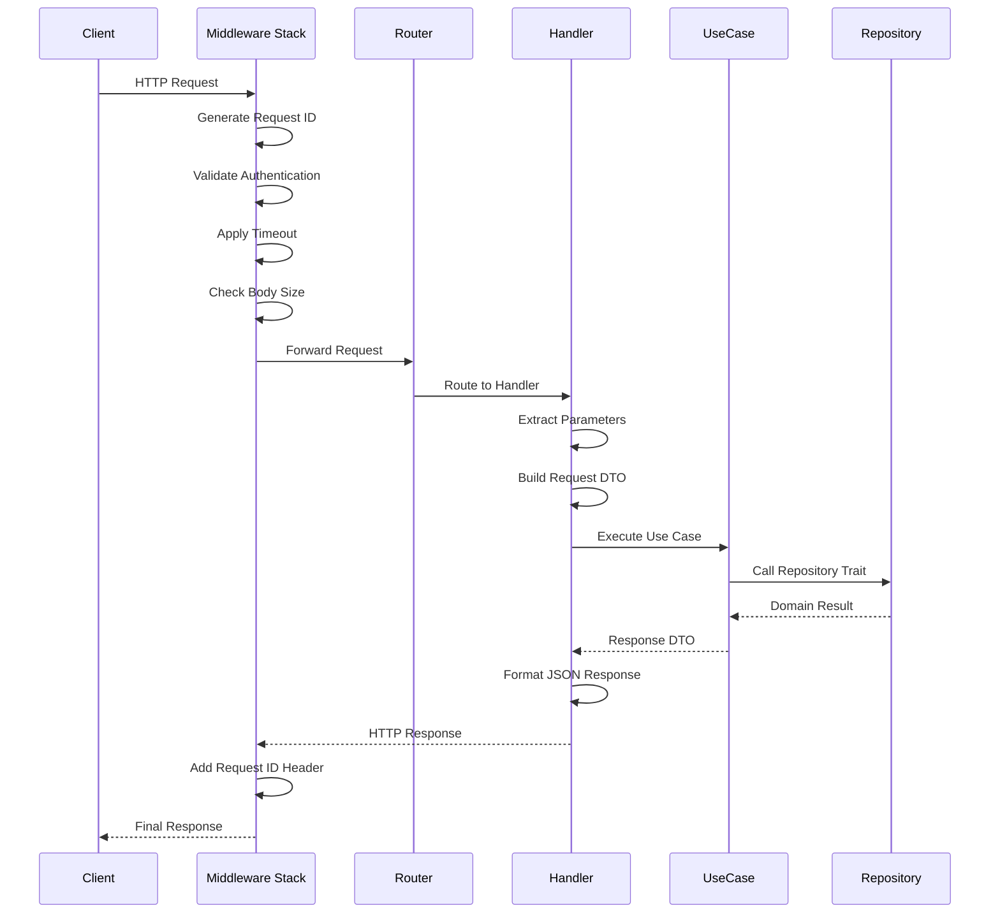
```mermaid
sequenceDiagram
    participant Client
    participant Middleware as Middleware Stack
    participant Router
    participant Handler
    participant UseCase
    participant Repository
    
    Client->>Middleware: HTTP Request
    Middleware->>Middleware: Generate Request ID
    Middleware->>Middleware: Validate Authentication
    Middleware->>Middleware: Apply Timeout
    Middleware->>Middleware: Check Body Size
    Middleware->>Router: Forward Request
    Router->>Handler: Route to Handler
    Handler->>Handler: Extract Parameters
    Handler->>Handler: Build Request DTO
    Handler->>UseCase: Execute Use Case
    UseCase->>Repository: Call Repository Trait
    Repository-->>UseCase: Domain Result
    UseCase-->>Handler: Response DTO
    Handler->>Handler: Format JSON Response
    Handler-->>Middleware: HTTP Response
    Middleware->>Middleware: Add Request ID Header
    Middleware-->>Client: Final Response
```

### 5.2. Middleware Architecture


```mermaid
graph LR
    Request[Incoming Request] --> M1[Request ID]
    M1 --> M2[Timeout Enforcement]
    M2 --> M3[Body Size Limit]
    M3 --> M4[Authentication]
    M4 --> M5[Error Handler]
    M5 --> Handler[Handler]
    Handler --> Response[Response]
    
    style M1 fill:#e1f5ff
    style M2 fill:#fff4e1
    style M3 fill:#ffe1f5
    style M4 fill:#e1ffe1
    style M5 fill:#f5e1ff
```

**Middleware Execution Order (Outer to Inner):**

| Order | Middleware | Location | Purpose |
|-------|-----------|----------|---------|
| 1 | Request ID | `presentation/http/middleware/request_id.rs` | Generates UUID v4 and injects into request extensions |
| 2 | Timeout | `presentation/http/middleware/timeout.rs` | Enforces 60s read/write timeout |
| 3 | Body Limit | Axum built-in | Rejects requests exceeding 100MB |
| 4 | Authentication | `presentation/http/middleware/auth.rs` | Validates HTTP Basic Auth (selective routes) |
| 5 | Error Handler | `presentation/http/middleware/error_handler.rs` | Converts all errors to JSON with appropriate status codes |

### 5.3. Routing Structure

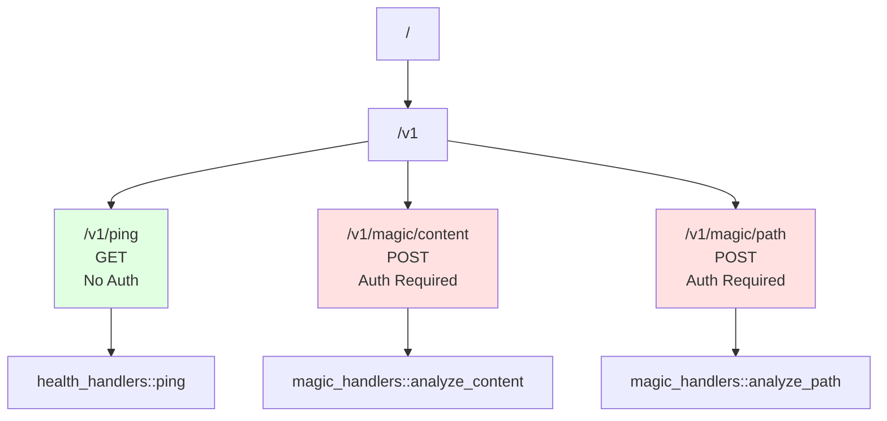
```mermaid
graph TB
    Root["/"]
    V1["/v1"]
    Ping["/v1/ping<br/>GET<br/>No Auth"]
    Content["/v1/magic/content<br/>POST<br/>Auth Required"]
    Path["/v1/magic/path<br/>POST<br/>Auth Required"]
    
    Root --> V1
    V1 --> Ping
    V1 --> Content
    V1 --> Path
    
    Ping --> HealthHandler[health_handlers::ping]
    Content --> MagicHandler1[magic_handlers::analyze_content]
    Path --> MagicHandler2[magic_handlers::analyze_path]
    
    style Ping fill:#e1ffe1
    style Content fill:#ffe1e1
    style Path fill:#ffe1e1
```

**Route Definitions:**

| Method | Path | Handler Location | Auth | Purpose |
|--------|------|------------------|------|---------|
| GET | `/v1/ping` | `presentation/http/handlers/health_handlers.rs` | No | Health check endpoint |
| POST | `/v1/magic/content` | `presentation/http/handlers/magic_handlers.rs` | Yes | Analyze binary content |
| POST | `/v1/magic/path` | `presentation/http/handlers/magic_handlers.rs` | Yes | Analyze file by path |

**Router Configuration:**

The router is configured in `presentation/http/router.rs` with two route groups:
- Public routes without authentication middleware
- Protected routes with authentication middleware applied

All routes share global middleware for request ID, timeout, and body size limits.

### 5.4. State Management

```mermaid
graph TB
    subgraph AppState["AppState (Shared)"]
        UC1[AnalyzeContentUseCase]
        UC2[AnalyzePathUseCase]
        UC3[HealthCheckUseCase]
        AuthSvc[AuthenticationService]
    end
    
    subgraph Dependencies["Injected Dependencies"]
        MagicRepo[MagicRepository Impl]
        Config[Sandbox Config]
    end
    
    UC1 --> MagicRepo
    UC2 --> MagicRepo
    UC2 --> Config
    
    Handler1[Handler 1] -.->|accesses| AppState
    Handler2[Handler 2] -.->|accesses| AppState
    Handler3[Handler 3] -.->|accesses| AppState
    
    style AppState fill:#e1f5ff
```

**State Initialization Flow:**

The application state is constructed during startup and contains all dependency-injected components:

1. Infrastructure components are instantiated (LibmagicRepository, BasicAuthService)
2. Use cases are constructed with repository trait objects
3. AppState struct wraps all use cases and services
4. AppState is cloned cheaply (Arc internally) for each request handler

**State Location:** `presentation/state/app_state.rs`

**Handler Access Pattern:**

Handlers receive AppState through Axum's State extractor, providing access to all use cases without direct infrastructure dependencies.

---

## 6. Security Architecture

### 6.1. Authentication Flow

```mermaid
sequenceDiagram
    participant Client
    participant AuthMiddleware
    participant AuthService
    participant Handler
    
    Client->>AuthMiddleware: Request with Authorization header
    AuthMiddleware->>AuthMiddleware: Parse Basic Auth
    AuthMiddleware->>AuthService: verify_credentials()
    AuthService->>AuthService: Constant-time comparison
    alt Valid Credentials
        AuthService-->>AuthMiddleware: Ok
        AuthMiddleware->>Handler: Forward request
        Handler-->>Client: 200 Response
    else Invalid Credentials
        AuthService-->>AuthMiddleware: Error
        AuthMiddleware-->>Client: 401 Unauthorized
    end
```

**Authentication Strategy:**

| Aspect | Implementation |
|--------|----------------|
| Protocol | HTTP Basic Authentication (RFC 7617) |
| Middleware | `presentation/http/middleware/auth.rs` |
| Service | `infrastructure/auth/basic_auth_service.rs` implements `AuthenticationService` trait |
| Credential Storage | Environment variables (production: external secrets manager) |
| Timing Attack Prevention | Constant-time comparison using `subtle` crate |
| Selective Application | Applied only to `/v1/magic/*` routes, not `/v1/ping` |

### 6.2. Path Validation Strategy

```mermaid
graph TB
    Input[User Input Path] --> V1[RelativePath Value Object]
    V1 -->|Regex Validation| V1A{Valid?}
    V1A -->|No| Reject1[400 Bad Request]
    V1A -->|Yes| V2[PathSandbox]
    V2 --> V2A[Canonicalize Path]
    V2A --> V2B[Resolve Symlinks]
    V2B --> V2C{Within Sandbox?}
    V2C -->|No| Reject2[403 Forbidden]
    V2C -->|Yes| V2D{File Exists?}
    V2D -->|No| Reject3[404 Not Found]
    V2D -->|Yes| Accept[Proceed to Analysis]
    
    style Reject1 fill:#ffe1e1
    style Reject2 fill:#ffe1e1
    style Reject3 fill:#ffe1e1
    style Accept fill:#e1ffe1
```

**Path Security Layers:**

1. **Input Validation** (`domain/value_objects/file_path.rs`)
   - Rejects paths with leading `/` (absolute paths)
   - Rejects paths containing `..` (parent directory traversal)
   - Rejects paths with `//` (double slashes)
   - Rejects paths with leading spaces
   - Rejects paths ending with `.`

2. **Canonicalization** (`infrastructure/filesystem/sandbox.rs`)
   - Uses `std::fs::canonicalize()` to resolve path
   - Follows symlinks to actual file location
   - Converts to absolute path

3. **Boundary Enforcement** (`infrastructure/filesystem/sandbox.rs`)
   - Ensures canonicalized path starts with configured `base_dir`
   - Prevents symlink escape attacks
   - Returns 403 Forbidden if boundary violated

4. **Existence Check** (`application/use_cases/analyze_path.rs`)
   - Verifies file exists before analysis
   - Returns 404 Not Found if missing

**Example Paths:**

| Input | Validation Result | Reason |
|-------|------------------|--------|
| `uploads/file.txt` | ✅ Accept | Valid relative path |
| `/etc/passwd` | ❌ Reject | Absolute path (leading `/`) |
| `../etc/passwd` | ❌ Reject | Contains `..` |
| `data/../../secret` | ❌ Reject | Contains `..` |
| `data//file.txt` | ❌ Reject | Double slash |
| `symlink_to_etc` | ❌ Reject (if escapes sandbox) | Symlink pointing outside |

### 6.3. Request Constraints

```mermaid
graph TB
    Request[Incoming Request]
    
    Request --> C1{Body Size}
    C1 -->|> 100MB| R1[413 Payload Too Large]
    C1 -->|≤ 100MB| C2{URI Length}
    
    C2 -->|> 8KB| R2[414 URI Too Long]
    C2 -->|≤ 8KB| C3{Header Size}
    
    C3 -->|> 16KB| R3[431 Headers Too Large]
    C3 -->|≤ 16KB| C4{Request Timeout}
    
    C4 -->|> 60s| R4[408 Request Timeout]
    C4 -->|≤ 60s| C5{Analysis Timeout}
    
    C5 -->|> 30s| R5[504 Gateway Timeout]
    C5 -->|≤ 30s| Accept[Process Request]
    
    style R1 fill:#ffe1e1
    style R2 fill:#ffe1e1
    style R3 fill:#ffe1e1
    style R4 fill:#ffe1e1
    style R5 fill:#ffe1e1
    style Accept fill:#e1ffe1
```

**Constraint Enforcement:**

| Constraint | Value | Enforcement Layer | Purpose |
|------------|-------|-------------------|---------|
| Max Request Body | 100MB | Axum `DefaultBodyLimit` middleware | Prevent memory exhaustion |
| Max URI Length | 8KB | Axum default | Prevent buffer overflow attacks |
| Max Header Size | 16KB | Hyper default | Prevent header DoS attacks |
| Request Timeout | 60s | Custom timeout middleware | Prevent connection exhaustion |
| Analysis Timeout | 30s | Use case level | Prevent indefinite blocking |
| Keep-Alive Timeout | 75s | Hyper configuration | Balance connection reuse and cleanup |

### 6.4. Memory-Mapped I/O Security

Memory-mapped I/O used for large file analysis must follow strict security requirements to prevent memory corruption, unauthorized access, and timing attacks.

```mermaid
graph TB
    File[Temporary File] --> Open[Open File Descriptor]
    Open --> Mmap[Create Memory Map]
    
    Mmap --> P1[PROT_READ ONLY]
    Mmap --> P2[MAP_PRIVATE Copy-on-Write]
    Mmap --> P3[No PROT_EXEC]
    
    P1 --> Protection[Memory Protection]
    P2 --> Protection
    P3 --> Protection
    
    Protection --> Monitor[Signal Handler]
    Monitor --> SIGBUS{SIGBUS?}
    
    SIGBUS -->|File Modified| Unmap[Unmap Memory]
    SIGBUS -->|File Truncated| Unmap
    Unmap --> Error[Return Error]
    
    style P1 fill:#e1ffe1
    style P2 fill:#e1ffe1
    style P3 fill:#e1ffe1
    style Error fill:#ffe1e1
```

**Required Memory Map Flags:**

| Flag | Purpose | Security Benefit |
|------|---------|------------------|
| `PROT_READ` | Read-only access | Prevents accidental or malicious writes |
| No `PROT_WRITE` | Deny write permission | Protects file integrity during analysis |
| No `PROT_EXEC` | Deny execute permission | Prevents code injection via mapped memory |
| `MAP_PRIVATE` | Copy-on-write semantics | Isolates process from concurrent modifications |

**Security Properties:**

```mermaid
classDiagram
    class MemoryMap {
        +file_descriptor: RawFd
        +address: *const u8
        +length: usize
        +flags: MapFlags
        +mmap() Result~Self~
        +unmap() Result~()~
    }
    
    class MapFlags {
        +PROT_READ: Protection
        +MAP_PRIVATE: Visibility
        +validate() bool
    }
    
    MemoryMap --> MapFlags
    
    note for MapFlags "Required:\n- PROT_READ only\n- MAP_PRIVATE\n- No PROT_WRITE\n- No PROT_EXEC"
```

**Protection Mechanisms:**

1. **Read-Only Mapping (`PROT_READ`)**
   - Mapped memory region has read-only permissions
   - Write attempts trigger SIGSEGV (segmentation fault)
   - Prevents corruption of temporary files
   - Ensures analysis cannot modify original content

2. **Private Copy-on-Write (`MAP_PRIVATE`)**
   - Changes made by process are not visible to other processes
   - Protects against shared memory attacks
   - Concurrent file modifications do not affect mapped view
   - Process-local copy created on write attempt

3. **No Execute Permission**
   - Memory region cannot contain executable code
   - Prevents code injection attacks
   - Mitigates ROP (Return-Oriented Programming) exploits
   - Defense-in-depth security layer

4. **SIGBUS Handling**
   - Signal raised when mapped file is modified or truncated
   - Signal raised when accessing beyond file size
   - Handler gracefully unmaps memory and returns error
   - Prevents undefined behavior and crashes

**Threat Mitigation:**

| Threat | Mitigation | Implementation |
|--------|-----------|----------------|
| File Modification During Analysis | MAP_PRIVATE + SIGBUS handler | Isolated copy, graceful error on change |
| Timing Attacks via Page Faults | Read-only prevents information leakage | No write side-channels |
| Memory Corruption | PROT_READ prevents writes | Hardware-enforced protection |
| Code Injection | No PROT_EXEC | Cannot execute mapped memory |
| Shared Memory Attacks | MAP_PRIVATE isolates process | Private copy-on-write |
| Unauthorized File Access | File created with 0600 permissions | Owner-only access |

**Error Handling Flow:**

```mermaid
sequenceDiagram
    participant UseCase
    participant Mmap
    participant Kernel
    participant SignalHandler
    participant Cleanup
    
    UseCase->>Mmap: mmap(fd, PROT_READ, MAP_PRIVATE)
    Mmap->>Kernel: System call
    Kernel-->>Mmap: Memory address
    Mmap-->>UseCase: Ok(mapped_slice)
    
    alt Concurrent File Modification
        UseCase->>Kernel: Access mapped memory
        Kernel->>SignalHandler: SIGBUS signal
        SignalHandler->>Mmap: Mark error state
        SignalHandler-->>UseCase: Return from signal
        UseCase->>Mmap: munmap()
        Mmap->>Cleanup: Delete temp file
        UseCase-->>UseCase: Return error to client
    else Normal Operation
        UseCase->>UseCase: Analyze via libmagic
        UseCase->>Mmap: munmap()
        Mmap->>Cleanup: Delete temp file
        UseCase-->>UseCase: Return result
    end
```

**Implementation Location:**

- **Mmap Wrapper:** `infrastructure/magic/mmap.rs` - Safe wrapper around `libc::mmap`
- **Signal Handler:** `infrastructure/magic/signals.rs` - SIGBUS handler setup
- **Flag Validation:** Compile-time checks ensure correct flags
- **Error Conversion:** Maps SIGBUS to domain error type

**Validation at Runtime:**

```mermaid
graph TB
    Create[Create Temp File] --> Perms[Set 0600 Permissions]
    Perms --> Mmap[Call mmap]
    Mmap --> Validate{Validate Flags}
    
    Validate -->|PROT_READ| V1[✓ Read-only]
    Validate -->|MAP_PRIVATE| V2[✓ Copy-on-write]
    Validate -->|No PROT_WRITE| V3[✓ No write]
    Validate -->|No PROT_EXEC| V4[✓ No execute]
    
    V1 --> Check{All Valid?}
    V2 --> Check
    V3 --> Check
    V4 --> Check
    
    Check -->|Yes| Proceed[Proceed with Analysis]
    Check -->|No| Panic[Panic: Security Violation]
    
    style V1 fill:#e1ffe1
    style V2 fill:#e1ffe1
    style V3 fill:#e1ffe1
    style V4 fill:#e1ffe1
    style Panic fill:#ffe1e1
```

**Testing Requirements:**

- Unit tests verify correct mmap flags
- Integration tests simulate file modification during mapping
- SIGBUS handler tests verify graceful degradation
- Security tests attempt privilege escalation via mmap
- Fuzz tests with concurrent file operations

---

## 7. Error Handling Architecture

### 7.1. Error Flow

```mermaid
graph TB
    DE[Domain Error] -->|map_err| AE[Application Error]
    AE -->|From trait| PE[Presentation Error]
    PE -->|IntoResponse| HTTP[HTTP JSON Response]
    
    subgraph Domain Layer
        DE
        DV[ValidationError]
        DM[MagicError]
        DA[AuthenticationError]
    end
    
    subgraph Application Layer
        AE
        AT[Timeout]
        AF[NotFound]
    end
    
    subgraph Presentation Layer
        PE
        HTTP
    end
    
    DV -.-> DE
    DM -.-> DE
    DA -.-> DE
    
    style Domain Layer fill:#e1f5ff
    style Application Layer fill:#fff4e1
    style Presentation Layer fill:#e1ffe1
```

**Error Transformation Chain:**

1. **Domain Layer** (`src/domain/errors/`) produces pure domain errors with no HTTP knowledge
2. **Application Layer** (`src/application/errors/`) wraps domain errors and adds application-level errors
3. **Presentation Layer** (`src/presentation/http/responses/error_response.rs`) maps to HTTP status codes

### 7.2. Error Mapping Strategy

```mermaid
graph LR
    VE[ValidationError] --> B400[400 Bad Request]
    AE[AuthenticationError] --> U401[401 Unauthorized]
    NF[NotFoundError] --> N404[404 Not Found]
    PL[PayloadTooLarge] --> P413[413 Payload Too Large]
    TO[TimeoutError] --> T504[504 Gateway Timeout]
    ME[MagicError] --> S500[500 Internal Server Error]
    UE[Unexpected Error] --> S500
    
    style B400 fill:#ffe1e1
    style U401 fill:#ffe1e1
    style N404 fill:#ffe1e1
    style P413 fill:#ffe1e1
    style T504 fill:#ffe1e1
    style S500 fill:#ffe1e1
```

**Error Mapping Table:**

| Error Source | Error Type | HTTP Status | JSON Error Message | Response Location |
|--------------|-----------|-------------|-------------------|-------------------|
| Domain validation | `ValidationError::InvalidFilename` | 400 | "Invalid filename parameter" | `error_response.rs` |
| Domain validation | `ValidationError::PathTraversal` | 400 | "Path traversal not allowed" | `error_response.rs` |
| Domain validation | `ValidationError::ExceedsMaxLength` | 400 | "Filename exceeds maximum length" | `error_response.rs` |
| Infrastructure auth | `AuthenticationError::InvalidCredentials` | 401 | "Authentication required" | `error_response.rs` |
| Application | `ApplicationError::NotFound` | 404 | "File not found" | `error_response.rs` |
| Middleware | Body limit exceeded | 413 | "Request body exceeds 100MB limit" | Axum built-in |
| Infrastructure | `MagicError::AnalysisFailed` | 500 | "Internal server error" | `error_response.rs` |
| Application | `ApplicationError::Timeout` | 504 | "Request timeout exceeded" | `error_response.rs` |

**Error Response Format:**

All error responses follow this JSON structure defined in the OpenAPI specification:

```json
{
  "error": "Human-readable error message",
  "request_id": "550e8400-e29b-41d4-a716-446655440000"
}
```

**Error Handling Principles:**

- Domain errors contain detailed information for debugging
- Application errors add context about workflow failures
- Presentation layer sanitizes errors to prevent information leakage
- All errors include request_id for tracing
- 5xx errors log full details internally but return generic messages externally

**Error Context Requirements:**

All errors must include context about which operation failed to enable effective debugging and troubleshooting.

```mermaid
graph TB
    Operation[Operation Fails] --> Context[Add Operation Context]
    Context --> Cause[Add Failure Cause]
    Cause --> Details[Add Relevant Details]
    
    Details --> Error[Complete Error Message]
    
    Error --> Example1["Failed to create temp file: disk full"]
    Error --> Example2["Failed to write chunk at offset 10485760: I/O error"]
    Error --> Example3["Failed to memory map file: resource limit exceeded"]
    Error --> Example4["Failed to analyze buffer: libmagic returned NULL"]
    
    style Error fill:#e1ffe1
    style Example1 fill:#fff4e1
    style Example2 fill:#fff4e1
    style Example3 fill:#fff4e1
    style Example4 fill:#fff4e1
```

**Error Message Structure:**

```
"Failed to {operation}: {root_cause}"
```

**Required Components:**

| Component | Description | Example |
|-----------|-------------|---------|
| **Operation** | What the system was attempting to do | `create temp file`, `write chunk`, `memory map file`, `analyze buffer` |
| **Root Cause** | Why the operation failed | `disk full`, `I/O error`, `resource limit exceeded`, `libmagic returned NULL` |
| **Details** (optional) | Additional context | `at offset 10485760`, `file: /tmp/abc123`, `errno: ENOMEM` |

**Error Context by Operation Type:**

**1. Temp File Operations:**

| Operation | Error Message Template | Example |
|-----------|----------------------|---------|
| File creation | `Failed to create temp file: {cause}` | `Failed to create temp file: disk full` |
| File write | `Failed to write chunk at offset {offset}: {cause}` | `Failed to write chunk at offset 10485760: I/O error` |
| File flush | `Failed to flush temp file: {cause}` | `Failed to flush temp file: broken pipe` |
| File sync | `Failed to sync temp file to disk: {cause}` | `Failed to sync temp file to disk: I/O error` |
| File deletion | `Failed to delete temp file {path}: {cause}` | `Failed to delete temp file /tmp/abc123: permission denied` |

**2. Memory-Mapped I/O Operations:**

| Operation | Error Message Template | Example |
|-----------|----------------------|---------|
| File open | `Failed to open file for mmap: {cause}` | `Failed to open file for mmap: file not found` |
| Mmap creation | `Failed to memory map file: {cause}` | `Failed to memory map file: resource limit exceeded` |
| Mmap read | `Failed to read from mmap: {cause}` | `Failed to read from mmap: SIGBUS received` |
| Munmap | `Failed to unmap memory: {cause}` | `Failed to unmap memory: invalid address` |

**3. libmagic FFI Operations:**

| Operation | Error Message Template | Example |
|-----------|----------------------|---------|
| Cookie creation | `Failed to create libmagic cookie: {cause}` | `Failed to create libmagic cookie: insufficient memory` |
| Database load | `Failed to load magic database: {cause}` | `Failed to load magic database: file not found` |
| Buffer analysis | `Failed to analyze buffer: {cause}` | `Failed to analyze buffer: libmagic returned NULL` |
| File analysis | `Failed to analyze file {path}: {cause}` | `Failed to analyze file /data/test.bin: access denied` |
| Error retrieval | `Failed to get libmagic error: {cause}` | `Failed to get libmagic error: invalid cookie` |

**4. Disk Space Operations:**

| Operation | Error Message Template | Example |
|-----------|----------------------|---------|
| Space check | `Failed to check disk space: {cause}` | `Failed to check disk space: statvfs failed` |
| Insufficient space | `Insufficient storage space for analysis` | `Temp directory has 512MB available, but 1024MB minimum required` |
| Write during stream | `Disk space exhausted during file processing` | `Failed to write chunk at offset 52428800: No space left on device` |

**5. Network/HTTP Operations:**

| Operation | Error Message Template | Example |
|-----------|----------------------|---------|
| Body read | `Failed to read request body: {cause}` | `Failed to read request body: connection reset` |
| Stream chunk | `Failed to stream chunk: {cause}` | `Failed to stream chunk: timeout exceeded` |
| Response write | `Failed to write response: {cause}` | `Failed to write response: broken pipe` |

**Error Context Propagation:**

```mermaid
sequenceDiagram
    participant Infra as Infrastructure
    participant App as Application
    participant Pres as Presentation
    participant Client
    
    Infra->>Infra: Operation fails
    Note over Infra: Create error with context:<br/>"Failed to write chunk at offset 10485760: I/O error"
    
    Infra->>App: Return domain error with context
    App->>App: Wrap in application error
    Note over App: Preserve original context
    
    App->>Pres: Return application error
    Pres->>Pres: Map to HTTP error
    
    alt 5xx Error (Internal)
        Note over Pres: Log full context internally
        Pres->>Client: Generic message externally
    else 4xx Error (Client)
        Note over Pres: Return context to client
        Pres->>Client: Full context in response
    end
```

**Context Preservation Rules:**

1. **Infrastructure Layer:**
   - Capture operation name and failure cause at error site
   - Include relevant details (offset, path, errno)
   - Use `format!()` to construct descriptive message
   - Map to domain error with context preserved

2. **Application Layer:**
   - Wrap infrastructure errors without losing context
   - Add application-level context if needed
   - Never swallow error details
   - Maintain full error chain

3. **Presentation Layer:**
   - For 4xx errors: Return full context to client (actionable)
   - For 5xx errors: Log full context internally, return generic message externally
   - Always include request_id for correlation

**Implementation Approach:**

Error messages should be constructed at the point of failure to include operation context and root cause.

**Error Construction Pattern:**

| Layer | Responsibility | Example Context |
|-------|----------------|-----------------|
| Infrastructure | Capture OS error and operation | "Failed to create temp file: {os_error}" |
| Infrastructure | Include operation details | "Failed to write chunk at offset {offset}: {os_error}" |
| Application | Wrap with request context | Preserve domain error + add request_id |
| Presentation | Convert to HTTP response | Map to status code, sanitize for client |

**Context Preservation:**

```mermaid
graph LR
    Infra[Infrastructure Layer] --> |Domain Error| App[Application Layer]
    App --> |Application Error| Pres[Presentation Layer]
    
    Infra --> Details["• Operation name<br/>• Root cause<br/>• Relevant details"]
    App --> Preserve["• Preserve infra context<br/>• Add request ID<br/>• Add correlation"]
    Pres --> Response["• Map to HTTP status<br/>• Sanitize 5xx errors<br/>• Full details for 4xx"]
    
    style Details fill:#e1ffe1
    style Preserve fill:#e1f5ff
    style Response fill:#fff4e1
```

**Testing Error Context:**

All error scenarios must verify:
1. ✅ Operation name is included
2. ✅ Root cause is included
3. ✅ Relevant details are included (if applicable)
4. ✅ Error message is human-readable
5. ✅ Context is preserved across layer boundaries

**Bad Examples (Missing Context):**

❌ `"Operation failed"` - No operation specified
❌ `"I/O error"` - No operation context
❌ `"Error: ENOSPC"` - Technical but not descriptive
❌ `"Error writing file"` - Missing which file, why it failed

**Good Examples (With Context):**

✅ `"Failed to create temp file: disk full"`
✅ `"Failed to write chunk at offset 10485760: I/O error"`
✅ `"Failed to memory map file: resource limit exceeded"`
✅ `"Failed to analyze buffer: libmagic returned NULL"`

### 7.3. Disk Space Error Handling

For large file analysis requiring temporary file streaming, disk space exhaustion must be detected early and handled gracefully.

```mermaid
sequenceDiagram
    participant UseCase
    participant DiskCheck
    participant TempFile
    participant Stream
    participant Cleanup
    
    UseCase->>DiskCheck: Check available space
    DiskCheck->>DiskCheck: statvfs(temp_dir)
    
    alt Insufficient Space (< min_free_space_mb)
        DiskCheck-->>UseCase: InsufficientStorage error
        UseCase-->>UseCase: Return 507 immediately
    else Sufficient Space
        DiskCheck-->>UseCase: Ok
        UseCase->>TempFile: Create temp file
        TempFile-->>UseCase: Ok(file)
        
        loop For each chunk
            UseCase->>Stream: Write chunk
            alt Write Success
                Stream-->>UseCase: Ok
            else Disk Full During Write
                Stream-->>UseCase: IoError (ENOSPC)
                UseCase->>Cleanup: Delete partial file
                Cleanup-->>UseCase: Ok (best effort)
                UseCase-->>UseCase: Return 507 with context
            end
        end
        
        UseCase->>UseCase: Continue with analysis
    end
```

**Pre-Flight Disk Space Check:**

Before creating temporary file for large content streaming, verify sufficient disk space is available.

```mermaid
graph TB
    Content[Large Content] --> Check{Pre-flight Check}
    
    Check --> StatVfs[statvfs temp_dir]
    StatVfs --> Available[Get available bytes]
    Available --> Compare{available >= threshold?}
    
    Compare -->|No| Error507[507 Insufficient Storage]
    Compare -->|Yes| Reserve{Can fit content?}
    
    Reserve -->|available >= content_size + threshold| Create[Create Temp File]
    Reserve -->|available < content_size + threshold| Error507
    
    Create --> Stream[Stream Content]
    
    style Error507 fill:#ffe1e1
    style Create fill:#e1ffe1
```

**Disk Space Check Algorithm:**

1. Call `statvfs()` on temp directory to get filesystem stats
2. Calculate: `available_mb = (f_bavail * f_frsize) / (1024 * 1024)`
3. Get configured threshold: `min_free_space_mb` from config
4. If `available_mb < min_free_space_mb`: reject request immediately
5. If `available_mb >= min_free_space_mb`: proceed with temp file creation
6. Additional check: `available_mb >= (content_size_mb + min_free_space_mb)` for safety margin

**Configuration Parameter:**

| Parameter | Config Key | Default | Purpose |
|-----------|-----------|---------|---------|
| Minimum Free Space | `analysis.min_free_space_mb` | 1024 MB (1 GB) | Disk space threshold for temp operations |

**Error Mapping:**

| Condition | Error Type | HTTP Status | Error Message | Client-Visible Details |
|-----------|-----------|-------------|---------------|----------------------|
| Pre-flight check fails | `InsufficientStorageError` | 507 | "Insufficient storage space for analysis" | Yes - actionable error |
| Disk full during write | `IoError(ENOSPC)` → `InsufficientStorageError` | 507 | "Disk space exhausted during file processing" | Yes - explains failure point |
| Partial file cleanup fails | Log warning only | 507 | Same as above | No - cleanup is best-effort |

**Partial File Cleanup Strategy:**

```mermaid
stateDiagram-v2
    [*] --> CreateFile: Start streaming
    CreateFile --> Writing: File created
    Writing --> Writing: Write chunks
    Writing --> Complete: All written
    Writing --> DiskFull: ENOSPC error
    
    Complete --> [*]: Success
    
    DiskFull --> Cleanup: Attempt delete
    Cleanup --> CleanupSuccess: Delete succeeds
    Cleanup --> CleanupFailed: Delete fails
    
    CleanupSuccess --> [*]: Return 507 error
    CleanupFailed --> LogWarning: Log cleanup failure
    LogWarning --> [*]: Return 507 error anyway
```

**Cleanup Requirements:**

1. **On Write Failure:**
   - Immediately close file handle
   - Attempt to delete partial temporary file
   - Use `std::fs::remove_file()` - returns `Result`

2. **If Cleanup Succeeds:**
   - Log info: "Deleted partial temp file after disk error: {path}"
   - Return 507 error to client with descriptive message

3. **If Cleanup Fails:**
   - Log warning: "Failed to delete partial temp file: {path} - {error}"
   - Rely on orphaned file cleanup (startup/background task)
   - Still return 507 error to client (don't fail cleanup failure)

4. **Best-Effort Guarantee:**
   - Cleanup failure does NOT change client response
   - Original write error is what matters
   - Orphaned file cleanup handles missed files

**Error Context Propagation:**

Error messages must include context about which operation failed:

```json
{
  "error": "Insufficient storage space for analysis",
  "details": "Temp directory has 512MB available, but 1024MB minimum required",
  "request_id": "550e8400-e29b-41d4-a716-446655440000"
}
```

```json
{
  "error": "Disk space exhausted during file processing",
  "details": "Failed to write chunk at offset 52428800 (50MB): No space left on device",
  "request_id": "550e8400-e29b-41d4-a716-446655440000"
}
```

**Implementation Location:**

- **Pre-flight Check:** `application/use_cases/analyze_content.rs` - before creating temp file
- **Disk Space Utility:** `infrastructure/filesystem/disk_space.rs` - `check_available_space(path: &Path) -> Result<u64>`
- **Cleanup Logic:** RAII in temp file wrapper (`infrastructure/filesystem/temp_file.rs`)
- **Error Types:** `domain/errors/storage_error.rs` - `InsufficientStorageError`

**Platform-Specific Implementation:**

Use `libc::statvfs` system call on Linux to retrieve filesystem statistics and calculate available space.

**Implementation Strategy:**

| Step | Action | Purpose |
|------|--------|---------|
| 1 | Convert path to C string | FFI compatibility |
| 2 | Call `libc::statvfs` | Get filesystem statistics |
| 3 | Check return value | Detect syscall errors |
| 4 | Calculate available bytes | `f_bavail * f_frsize` |
| 5 | Convert to megabytes | User-friendly units |

**Filesystem Statistics:**

| Field | Meaning | Usage |
|-------|---------|-------|
| `f_bavail` | Available blocks for non-root | Blocks accessible to application |
| `f_frsize` | Fundamental block size | Bytes per block |
| `f_blocks` | Total blocks | Total filesystem capacity |
| `f_bfree` | Free blocks (including reserved) | Not used (includes root-reserved space) |

**Testing Requirements:**

1. **Pre-flight Check Tests:**
   - Mock filesystem with low space (< threshold)
   - Verify 507 error returned immediately
   - Verify no temp file created

2. **Disk Full During Write Tests:**
   - Simulate ENOSPC error during streaming
   - Verify partial file is deleted
   - Verify 507 error with correct context

3. **Cleanup Failure Tests:**
   - Simulate delete failure (permission denied)
   - Verify warning is logged
   - Verify 507 error still returned to client

4. **Edge Cases:**
   - Exact threshold boundary (available == threshold)
   - Content size exactly fills remaining space
   - Multiple concurrent requests depleting space

**Error Response Examples:**

Pre-flight check failure response format:

| Field | Value | Purpose |
|-------|-------|---------|
| Status | 507 Insufficient Storage | HTTP status code |
| Error message | "Insufficient storage space for analysis" | Human-readable description |
| Details | Available vs required space | Actionable information |
| Request ID | UUID | Correlation for debugging |

Write failure response format:

| Field | Value | Purpose |
|-------|-------|---------|
| Status | 507 Insufficient Storage | HTTP status code |
| Error message | "Disk space exhausted during file processing" | Human-readable description |
| Details | Failed offset and OS error | Debug information |
| Request ID | UUID | Correlation for debugging |

**Monitoring and Observability:**

Metrics to track:
- `disk_space_check_failures_total` - Counter for pre-flight rejections
- `disk_space_write_failures_total` - Counter for ENOSPC during streaming
- `partial_file_cleanup_failures_total` - Counter for cleanup failures
- `temp_dir_available_space_mb` - Gauge for current available space

Log entries:
- INFO: Pre-flight check passed: {available_mb}MB available
- WARN: Pre-flight check failed: {available_mb}MB < {threshold_mb}MB
- ERROR: Disk full during write at offset {offset}: {error}
- WARN: Failed to cleanup partial file {path}: {error}

---

## 8. Concurrency Architecture

### 8.1. Runtime Model

```mermaid
graph TB
    subgraph Tokio Runtime
        Worker1[Worker Thread 1]
        Worker2[Worker Thread 2]
        Worker3[Worker Thread 3]
        Worker4[Worker Thread 4]
    end
    
    subgraph Blocking Thread Pool
        Block1[Blocking Thread 1]
        Block2[Blocking Thread 2]
        Block3[Blocking Thread N]
    end
    
    Request[Incoming Requests] --> Tokio
    
    Tokio --> Worker1
    Tokio --> Worker2
    Tokio --> Worker3
    Tokio --> Worker4
    
    Worker1 -.->|spawn_blocking| Block1
    Worker2 -.->|spawn_blocking| Block2
    Worker4 -.->|spawn_blocking| Block3
    
    Block1 --> Libmagic[libmagic C Library]
    Block2 --> Libmagic
    Block3 --> Libmagic
    
    style Tokio Runtime fill:#e1f5ff
    style Blocking Thread Pool fill:#fff4e1
```

**Runtime Configuration:**

| Component | Configuration | Location | Purpose |
|-----------|---------------|----------|---------|
| Tokio Runtime | Multi-threaded, 4 worker threads | `src/main.rs` | Handle async I/O and HTTP multiplexing |
| Blocking Pool | Unbounded (Tokio default: 512) | Automatic | Execute CPU-bound libmagic operations |
| Task Scheduling | Work-stealing scheduler | Tokio internal | Balance load across workers |

**Concurrency Strategy:**

- HTTP request handling is fully async on Tokio workers
- libmagic calls use `tokio::task::spawn_blocking` to avoid blocking async runtime
- Repository implementation wraps libmagic handle in `Arc<Mutex<T>>` for thread safety
- Each blocking call executes on dedicated OS thread from blocking pool
- Blocking threads return results through channels back to async context

### 8.2. Async I/O Requirements

All read/write I/O operations (network and filesystem) must be asynchronous to prevent blocking the Tokio runtime.

```mermaid
graph TB
    subgraph Async IO ["Async I/O (Required)"]
        direction TB
        N1[Network Read<br/>TCP socket receive]
        N2[Network Write<br/>TCP socket send]
        F1[File Read<br/>Temp file streaming]
        F2[File Write<br/>Temp file creation]
        
        N1 --> A1[tokio::net::TcpStream]
        N2 --> A2[tokio::net::TcpStream]
        F1 --> A3[tokio::fs::File]
        F2 --> A4[tokio::fs::File]
    end
    
    subgraph Blocking ["Blocking Calls (Isolated)"]
        direction TB
        L1[libmagic FFI]
        L2[Path Canonicalization]
        L3[CPU-bound Work]
        
        L1 --> B1[spawn_blocking]
        L2 --> B2[spawn_blocking]
        L3 --> B3[spawn_blocking]
    end
    
    style Async IO fill:#e1ffe1
    style Blocking fill:#fff4e1
```

**Async I/O Requirements Table:**

| I/O Operation | Type | Required Implementation | Location |
|--------------|------|------------------------|----------|
| **HTTP Request Read** | Network | `axum::body::Body` (async) | `presentation/http/handlers/` |
| **HTTP Response Write** | Network | `axum::response::IntoResponse` (async) | `presentation/http/handlers/` |
| **Temp File Creation** | Filesystem | `tokio::fs::File::create()` | `infrastructure/filesystem/temp_file_handler.rs` |
| **Temp File Write** | Filesystem | `tokio::fs::File::write_all()` | `infrastructure/filesystem/temp_file_handler.rs` |
| **Temp File Read** | Filesystem | `tokio::fs::File::read()` | `infrastructure/filesystem/temp_file_handler.rs` |
| **Temp File Delete** | Filesystem | `tokio::fs::remove_file()` | `infrastructure/filesystem/temp_file_handler.rs` |
| **Directory Scan** | Filesystem | `tokio::fs::read_dir()` | Orphaned file cleanup |
| **File Metadata** | Filesystem | `tokio::fs::metadata()` | Cleanup, age checks |

**Why Async I/O is Mandatory:**

```mermaid
sequenceDiagram
    participant R1 as Request 1
    participant R2 as Request 2
    participant Worker as Tokio Worker
    participant Disk
    
    Note over Worker: Scenario: Blocking I/O (BAD)
    R1->>Worker: Start file write
    Worker->>Disk: Blocking write (10ms)
    Note over Worker: Worker thread BLOCKED
    Note over R2: Request 2 waits...
    Disk-->>Worker: Complete
    Worker-->>R1: Done
    Worker->>R2: Now can process
    
    Note over Worker: Scenario: Async I/O (GOOD)
    R1->>Worker: Start file write (async)
    Worker->>Disk: Initiate write
    Note over Worker: Worker available
    Worker->>R2: Process immediately
    Disk-->>Worker: Write complete (callback)
    Worker-->>R1: Done
```

**Async I/O Benefits:**

| Benefit | Explanation | Impact |
|---------|-------------|--------|
| **Non-Blocking** | Worker threads never wait for I/O | Higher throughput |
| **Concurrent Processing** | Handle multiple requests during I/O wait | Better resource utilization |
| **Scalability** | Limited workers handle thousands of connections | Efficient scaling |
| **Fairness** | All requests make progress | No head-of-line blocking |
| **Responsiveness** | Slow I/O doesn't block other requests | Consistent latency |

**Implementation Pattern:**

The implementation must use Tokio's async filesystem operations for all file I/O.

**Async Operation Requirements:**

| Operation Type | Correct API | Purpose |
|----------------|-------------|---------|
| File creation | `tokio::fs::File::create().await` | Non-blocking file creation |
| Write data | `file.write_all().await` | Non-blocking write |
| Flush buffer | `file.flush().await` | Non-blocking flush to disk |
| Sync metadata | `file.sync_all().await` | Non-blocking fsync |

**Correct vs Incorrect Pattern:**

The key difference is using Tokio's async file operations instead of standard library blocking operations.

| Approach | File Creation | Write Operation | Flush Operation | Worker Impact |
|----------|---------------|-----------------|-----------------|---------------|
| **Correct (Async)** | `tokio::fs::File::create().await` | `file.write_all().await` | `file.flush().await` | ✅ Worker free during I/O |
| **Incorrect (Blocking)** | `std::fs::File::create()` | `file.write_all()` | `file.flush()` | ❌ Worker blocked during I/O |

**Streaming with Async I/O:**

```mermaid
sequenceDiagram
    participant Client
    participant Handler
    participant Stream
    participant AsyncFile
    participant Disk
    
    Client->>Handler: POST with 100MB body
    Handler->>Stream: Get body stream (async)
    Stream->>AsyncFile: Create temp file (async)
    
    loop For each 64KB chunk
        Stream->>Stream: await next chunk (async)
        Stream->>AsyncFile: write_all(chunk).await
        Note over AsyncFile: Async write - worker free
        AsyncFile->>Disk: Async I/O
        Note over Handler: Worker processes other requests
        Disk-->>AsyncFile: Write complete
    end
    
    AsyncFile->>AsyncFile: flush().await
    AsyncFile->>AsyncFile: sync_all().await
```

**Blocking Operations (Isolated via spawn_blocking):**

While I/O must be async, some operations are inherently blocking and must be isolated:

| Operation | Why Blocking | Isolation Method |
|-----------|-------------|------------------|
| `magic_buffer()` | C FFI, CPU-bound | `tokio::task::spawn_blocking` |
| `magic_file()` | C FFI, may do sync I/O | `tokio::task::spawn_blocking` |
| `std::fs::canonicalize()` | Synchronous syscall | `tokio::task::spawn_blocking` |
| Heavy computation | CPU-intensive | `tokio::task::spawn_blocking` |

**Async I/O Enforcement:**

```mermaid
graph TB
    Code[Code Review] --> Check1{Uses tokio::fs?}
    Check1 -->|No| Check2{Uses std::fs?}
    Check2 -->|Yes| Reject[❌ Reject: Use tokio::fs]
    Check2 -->|No| Check3{Uses tokio::net?}
    Check3 -->|No| Check4{Uses std::net?}
    Check4 -->|Yes| Reject2[❌ Reject: Use tokio::net]
    
    Check1 -->|Yes| Verify1[✅ Async I/O]
    Check3 -->|Yes| Verify2[✅ Async I/O]
    Check4 -->|No| Pass[✅ Pass]
    
    style Reject fill:#ffe1e1
    style Reject2 fill:#ffe1e1
    style Verify1 fill:#e1ffe1
    style Verify2 fill:#e1ffe1
    style Pass fill:#e1ffe1
```

**Forbidden Patterns:**

❌ **Never use synchronous I/O in async functions:**

Synchronous operations block Tokio workers and degrade performance.

| Forbidden Pattern | Problem | Impact |
|-------------------|---------|--------|
| `std::fs::read()` in async fn | Blocks worker thread | Reduced concurrency |
| `std::net::TcpStream::connect()` in async fn | Blocks worker thread | Poor scalability |
| `File::create()` from std | Blocks during syscall | Latency spikes |

**Required Patterns:**

✅ **Always use async I/O:**

All I/O operations must use Tokio's async APIs to maintain non-blocking behavior.

| Correct Pattern | Benefit | Use Case |
|-----------------|---------|----------|
| `tokio::fs::read().await` | Non-blocking filesystem read | Load configuration, read files |
| `tokio::net::TcpStream::connect().await` | Non-blocking network connection | HTTP clients, database connections |
| `tokio::fs::File::create().await` | Non-blocking file creation | Temporary files, logging |

**HTTP Request Body Streaming Pattern:**

The request body streaming process demonstrates proper async I/O usage for processing large uploads.
    let mut file = tokio::fs::File::create(temp_path).await?;  // ✅ Async create
    
    while let Some(chunk) = stream.next().await {  // ✅ Async iteration
**HTTP Request Body Streaming Pattern:**

The request body streaming process demonstrates proper async I/O usage for processing large uploads.

**Streaming Process:**

| Step | Operation | Async API | Purpose |
|------|-----------|-----------|---------|
| 1 | Convert body to stream | `body.into_data_stream()` | Get async chunk iterator |
| 2 | Create temp file | `tokio::fs::File::create().await` | Non-blocking file creation |
| 3 | Process chunks | `stream.next().await` | Non-blocking chunk retrieval |
| 4 | Write chunks | `file.write_all().await` | Non-blocking write operation |
| 5 | Flush buffer | `file.flush().await` | Non-blocking buffer flush |
| 6 | Sync to disk | `file.sync_all().await` | Non-blocking fsync |

**Mmap Integration (Special Case):**

Memory-mapped I/O is synchronous by nature but acceptable because:

1. **No Blocking Calls:** Mmap setup (`mmap()`/`munmap()`) is fast (~1μs)
2. **Page Faults:** Handled by kernel, don't block Rust code
3. **Isolated:** Created in `spawn_blocking` if mmap() call is slow
4. **Read Access:** Page faults for reads are transparent to async runtime

**Mmap Isolation Strategy:**

| Scenario | Approach | Reason |
|----------|----------|--------|
| Small files | Direct mmap creation | Fast syscall (<1μs) |
| Large files | `spawn_blocking` wrapper | Isolate potential slowdown |
| Mmap reads | Direct access | Page faults handled by kernel |
| Mmap cleanup | Direct munmap | Fast syscall |

**Performance Characteristics:**

| I/O Type | Latency | Throughput | Async Benefit |
|----------|---------|------------|---------------|
| Network read | 1-100ms | Variable | ✅ Critical - high latency |
| Network write | 1-100ms | Variable | ✅ Critical - backpressure |
| File read (SSD) | 0.1-10ms | High | ✅ Important - concurrent I/O |
| File write (SSD) | 0.1-10ms | High | ✅ Important - concurrent I/O |
| File metadata | 0.01-1ms | Very High | ✅ Good practice |

**Testing Async I/O:**

Test verification ensures all I/O operations use async APIs.

**Test Strategy:**

| Test Type | Purpose | Implementation |
|-----------|---------|----------------|
| Compilation test | Verify Tokio types used | Use `#[tokio::test]` with tokio types only |
| Lint test | Detect blocking I/O | Enable clippy `blocking_in_async` |
| Runtime test | Verify non-blocking behavior | Monitor worker thread activity |

**Linting Rules:**

Enable Clippy lints to catch blocking I/O at compile time.

**Required Lints:**

| Lint | Level | Purpose |
|------|-------|---------|
| `blocking_in_async` | deny | Catch `std::fs` usage in async functions |
| `await_holding_lock` | warn | Avoid holding locks across await points |
| `await_holding_refcell_ref` | warn | Avoid RefCell borrows across awaits |

**Documentation Requirements:**

All async functions performing I/O must document:
- What I/O operations are performed
- Expected latency range
- Cancellation safety (if applicable)

**Documentation Template:**

| Section | Content | Purpose |
|---------|---------|---------|
| Summary | Brief operation description | Function purpose |
| I/O Operations | List of I/O calls made | Performance expectations |
| Latency Range | Expected duration | Capacity planning |
| Cancellation | Drop behavior | Safety guarantees |

**Example Documentation Format:**

The function documentation should describe I/O operations, performance characteristics, and cancellation behavior for async functions performing I/O operations.

**Architecture Compliance:**

| Layer | Async I/O Usage | Verification Method |
|-------|----------------|---------------------|
| Domain | No I/O allowed | Architecture tests check no I/O imports |
| Application | Orchestration only (async) | Use cases are async, no blocking I/O |
| Infrastructure | All I/O must be async | Code review + lints |
| Presentation | Axum handlers (async) | Framework enforces |

**Summary:**

- ✅ **All network I/O:** `tokio::net` (never `std::net`)
- ✅ **All filesystem I/O:** `tokio::fs` (never `std::fs`)
- ✅ **Blocking operations:** Isolated via `spawn_blocking`
- ✅ **HTTP streaming:** Async body streams
- ✅ **Error handling:** Async-compatible error types
- ✅ **Testing:** `#[tokio::test]` for all I/O tests

### 8.3. Timeout Strategy

```mermaid
graph TB
    Request[Request Arrives]
    
    Request --> T1[Request Read Timeout<br/>60 seconds]
    T1 -->|Timeout| E1[408 Request Timeout]
    T1 -->|Complete| T2[Handler Execution]
    
    T2 --> T3[Analysis Timeout<br/>30 seconds]
    T3 -->|Timeout| E2[504 Gateway Timeout]
    T3 -->|Complete| T4[Response Write]
    
    T4 --> T5[Response Write Timeout<br/>60 seconds]
    T5 -->|Timeout| E3[Connection Close]
    T5 -->|Complete| Success[200 OK]
    
    Success --> T6[Keep-Alive<br/>75 seconds]
    T6 -->|Timeout| Close[Connection Close]
    T6 -->|New Request| Request
    
    style E1 fill:#ffe1e1
    style E2 fill:#ffe1e1
    style E3 fill:#ffe1e1
    style Success fill:#e1ffe1
```

**Timeout Hierarchy:**

| Timeout Type | Duration | Enforcement Level | Purpose |
|--------------|----------|-------------------|---------|
| Request Read | 60s | Hyper/Axum configuration | Prevent slow-read attacks |
| Response Write | 60s | Hyper/Axum configuration | Prevent slow-send attacks |
| Analysis Execution | 30s | Application use case | Prevent indefinite libmagic blocking |
| Keep-Alive | 75s | Hyper configuration | Balance connection reuse and resource cleanup |

**Timeout Implementation Locations:**

- **Request/Response Timeouts:** Configured in Axum server builder at `src/main.rs`
- **Analysis Timeout:** Applied in use cases using `tokio::time::timeout()` at `src/application/use_cases/`
- **Keep-Alive Timeout:** Configured in Hyper server settings

### 8.4. Connection Limits

```mermaid
graph TB
    Clients[Clients] --> |New Connections| Backlog[OS TCP Backlog<br/>1024 pending]
    Backlog --> |Accept| Active[Active Connections<br/>1000 max]
    Backlog -->|Full| Refused[Connection Refused]
    
    Active --> |Idle 75s| Closed1[Close Connection]
    Active --> |Request Complete| Reuse[Connection Reuse]
    Active --> |Max Reached| Block[Block New Accepts]
    
    Reuse --> Active
    
    style Backlog fill:#fff4e1
    style Active fill:#e1f5ff
    style Refused fill:#ffe1e1
    style Closed1 fill:#ffe1e1
```

**Connection Management:**

| Parameter | Value | Specification | Configuration Location |
|-----------|-------|---------------|------------------------|
| Max Concurrent Connections | 1,000 | Application layer limit | Axum server configuration |
| TCP Backlog | 1,024 | OS-level pending queue | TCP listener configuration |
| Keep-Alive Timeout | 75s | Idle connection timeout | Hyper settings |
| TCP_NODELAY | Enabled | Disable Nagle algorithm | Socket configuration |

**Connection Lifecycle:**

1. Client initiates TCP connection
2. Connection enters OS backlog queue (max 1024)
3. Server accepts connection into active pool (max 1000)
4. Connection processes request(s) with HTTP/1.1 keep-alive
5. Connection closes after 75s idle or explicit closure
6. Resources freed for new connections

---

## 9. Observability Architecture

### 9.1. Tracing Strategy

```mermaid
graph TB
    Request[Incoming Request]
    
    Request --> M1[Middleware: Generate Request ID]
    M1 --> Span1[Create Root Span]
    
    Span1 --> Handler[Handler Span]
    Handler --> UseCase[Use Case Span]
    UseCase --> Repo[Repository Span]
    
    Repo --> Libmagic[Libmagic Call]
    Libmagic --> RepoEnd[Repository Span End]
    RepoEnd --> UseCaseEnd[Use Case Span End]
    UseCaseEnd --> HandlerEnd[Handler Span End]
    HandlerEnd --> Span1End[Root Span End]
    
    Span1End --> Output[Structured Log Output]
    
    style Span1 fill:#e1f5ff
    style Handler fill:#fff4e1
    style UseCase fill:#ffe1f5
    style Repo fill:#e1ffe1
```

**Tracing Framework:**

| Component | Purpose | Location |
|-----------|---------|----------|
| `tracing` crate | Span and event creation | Throughout codebase |
| `tracing-subscriber` | Log formatting and output | `src/main.rs` initialization |
| JSON formatter | Structured logging for production | Configured at startup |
| Pretty formatter | Human-readable logs for development | Configured via environment |

**Instrumentation Points:**

| Layer | Instrumentation | Information Captured |
|-------|----------------|----------------------|
| Middleware | Entry/exit spans | Request ID, duration, status code |
| Handlers | Endpoint spans | Route, parameters, response size |
| Use Cases | Workflow spans | Use case name, input validation, duration |
| Repositories | I/O spans | Operation type, file size, libmagic duration |
| Errors | Error events | Error type, message, context, request ID |

**Log Format Configuration:**

Controlled via environment variable `MAGICER_LOG_FORMAT`:
- `json` - Structured JSON for production (default)
- `pretty` - Human-readable for development
- `compact` - Minimal console output

### 9.2. Request Correlation

```mermaid
sequenceDiagram
    participant Client
    participant Middleware
    participant Extensions
    participant Handler
    participant UseCase
    participant Logger
    
    Client->>Middleware: HTTP Request
    Middleware->>Middleware: Generate UUID v4
    Middleware->>Extensions: Store RequestId
    Middleware->>Logger: Log request start
    Logger->>Logger: Include request_id in span
    
    Middleware->>Handler: Forward request
    Handler->>Extensions: Extract RequestId
    Handler->>UseCase: Execute with context
    UseCase->>Logger: Log use case execution
    Logger->>Logger: Include request_id in span
    
    UseCase-->>Handler: Result
    Handler-->>Middleware: Response
    Middleware->>Middleware: Add request_id to response JSON
    Middleware->>Logger: Log request complete
    Logger->>Logger: Include request_id in span
    Middleware-->>Client: JSON Response with request_id
```

**Request ID Flow:**

1. **Generation:** Request ID middleware (`presentation/http/middleware/request_id.rs`) generates UUID v4
2. **Storage:** UUID stored in `Request::extensions()` for handler access
3. **Propagation:** Passed to all spans via tracing context
4. **Response:** Included in all JSON responses under `request_id` field
5. **Logging:** Appears in every log entry for the request lifecycle

**Benefits:**

- Correlate all logs for a single request across components
- Trace request through distributed systems (future)
- Debug issues by filtering logs by request_id
- Match client errors to server logs

### 9.3. Metrics Collection

```mermaid
graph LR
    subgraph Application
        Handler[Handlers]
        UseCase[Use Cases]
        Repo[Repositories]
    end
    
    Handler --> M1[Request Counter]
    Handler --> M2[Response Time Histogram]
    Handler --> M3[Error Counter]
    
    UseCase --> M4[Use Case Duration]
    
    Repo --> M5[Libmagic Duration]
    Repo --> M6[File Size Distribution]
    
    M1 --> Collector[Metrics Collector]
    M2 --> Collector
    M3 --> Collector
    M4 --> Collector
    M5 --> Collector
    M6 --> Collector
    
    Collector --> Prometheus[Metrics Exporter]
    Prometheus --> Endpoint[Prometheus Endpoint]
    
    style Application fill:#e1f5ff
    style Collector fill:#fff4e1
    style Prometheus fill:#ffe1f5
```

**Proposed Metrics (Future Enhancement):**

| Metric Name | Type | Labels | Purpose |
|-------------|------|--------|---------|
| `http_requests_total` | Counter | method, path, status | Track request volume |
| `http_request_duration_seconds` | Histogram | method, path | Measure latency (p50, p95, p99) |
| `http_errors_total` | Counter | error_type, status_code | Track error rates |
| `active_connections` | Gauge | - | Monitor connection pool usage |
| `magic_analysis_duration_seconds` | Histogram | operation_type | Measure libmagic performance |
| `file_size_bytes` | Histogram | operation_type | Track payload distribution |

**Metrics Endpoint:**

- Path: `/v1/metrics` (future)
- Format: Prometheus text format
- Authentication: No (typically accessed from internal network only)

**Implementation Note:**

Metrics collection is planned for future implementation using `metrics` crate with Prometheus exporter. Current implementation focuses on structured logging via tracing.

---

## 10. Configuration Strategy

```mermaid
graph TB
    Defaults[Default Values] --> Merge1[Merge]
    ConfigFile[config.toml] --> Merge1
    Merge1 --> Merge2[Merge]
    EnvVars[Environment Variables] --> Merge2
    Merge2 --> Final[Final Configuration]
    
    Final --> Validation[Validate]
    Validation -->|Valid| App[Application Startup]
    Validation -->|Invalid| Error[Startup Error]
    
    style Defaults fill:#e1f5ff
    style ConfigFile fill:#fff4e1
    style EnvVars fill:#ffe1f5
    style Final fill:#e1ffe1
    style Error fill:#ffe1e1
```

**Configuration Sources (Priority Order):**

1. **Environment Variables** (highest priority)
2. **Configuration File** (TOML)
3. **Default Values** (lowest priority)

**Configuration Structure:**

Location: `infrastructure/config/server_config.rs`

| Configuration Section | Key Parameters | Purpose |
|----------------------|----------------|---------|
| Server Settings | host, port, max_connections, backlog | Network binding and connection limits |
| Timeout Settings | read_timeout_secs, write_timeout_secs, analysis_timeout_secs, keepalive_secs | Request and connection timeout values |
| Auth Settings | username, password | Basic authentication credentials |
| Sandbox Settings | base_dir | Root directory for path-based file access |
| Magic Settings | database_path (optional) | Custom libmagic database location |
| Logging Settings | level, format | Logging verbosity and format |

**Environment Variable Mapping:**

| Environment Variable | Configuration Path | Example Value |
|---------------------|-------------------|---------------|
| `MAGICER_HOST` | server.host | `0.0.0.0` |
| `MAGICER_PORT` | server.port | `8080` |
| `MAGICER_AUTH_USERNAME` | auth.username | `api_user` |
| `MAGICER_AUTH_PASSWORD` | auth.password | `secret123` |
| `MAGICER_SANDBOX_DIR` | sandbox.base_dir | `/var/lib/magicer/files` |
| `RUST_LOG` | logging.level | `info` |
| `MAGICER_LOG_FORMAT` | logging.format | `json` |

**Configuration File Location:**

- Development: `./config/config.toml`
- Production: `/etc/magicer/config.toml` (configurable via `MAGICER_CONFIG_PATH`)

---

## 11. Lifecycle Management

```mermaid
stateDiagram-v2
    [*] --> Initialize: Process Start
    
    Initialize --> LoadConfig: Load Configuration
    LoadConfig --> ValidateConfig: Validate Settings
    ValidateConfig --> InitInfra: Initialize Infrastructure
    InitInfra --> BuildState: Build AppState
    BuildState --> StartServer: Start HTTP Server
    
    StartServer --> Running: Server Listening
    
    Running --> ShutdownSignal: SIGTERM/SIGINT
    
    ShutdownSignal --> DrainConns: Stop Accepting New Connections
    DrainConns --> WaitInFlight: Wait for In-Flight Requests (10s max)
    WaitInFlight --> Cleanup: Cleanup Resources
    Cleanup --> [*]: Process Exit
    
    ValidateConfig --> [*]: Invalid Config
    InitInfra --> [*]: Infrastructure Error
```

**Startup Sequence:**

1. **Load Configuration** - Parse TOML file and environment variables
2. **Validate Configuration** - Ensure all required settings present and valid
3. **Initialize Infrastructure**
   - Create libmagic repository with database loading
   - Initialize authentication service with credentials
   - Validate sandbox directory exists and is accessible
4. **Build Application State** - Construct use cases and inject dependencies
5. **Start HTTP Server** - Bind to address and begin accepting connections
6. **Enter Running State** - Process requests

**Graceful Shutdown Sequence:**

```mermaid
sequenceDiagram
    participant OS
    participant SignalHandler
    participant Server
    participant Connections
    participant Repository
    
    OS->>SignalHandler: SIGTERM/SIGINT
    SignalHandler->>SignalHandler: Log shutdown initiated
    SignalHandler->>Server: Begin graceful shutdown
    Server->>Server: Stop accepting new connections
    Server->>Connections: Notify existing connections
    
    loop For each active connection
        Connections->>Connections: Complete in-flight request
    end
    
    SignalHandler->>SignalHandler: Wait max 10 seconds
    
    alt All connections closed
        Server->>Repository: Drop resources
        Repository->>Repository: Close libmagic handles
        Repository-->>SignalHandler: Cleanup complete
    else Timeout reached
        Server->>Connections: Force close remaining
        Server->>Repository: Drop resources
        Repository-->>SignalHandler: Cleanup complete
    end
    
    SignalHandler->>OS: Exit process (code 0)
```

**Shutdown Behavior:**

| Phase | Duration | Action |
|-------|----------|--------|
| Signal Reception | Immediate | Register SIGTERM or SIGINT |
| Stop Accept | Immediate | Close listening socket |
| Drain Connections | Up to 10s | Allow in-flight requests to complete |
| Force Close | After 10s | Terminate remaining connections |
| Resource Cleanup | Immediate | Drop Arc references, close file handles |
| Process Exit | Immediate | Exit with status code 0 |

**Signal Handling:**

- Listens for SIGTERM (systemd/Docker) and SIGINT (Ctrl+C)
- Single signal triggers graceful shutdown
- Second signal forces immediate termination
- Implementation location: `src/main.rs`

---

## 12. Technology Stack

**Core Dependencies:**

| Category | Crate | Version | Purpose |
|----------|-------|---------|---------|
| Web Framework | `axum` | 0.7 | HTTP server and routing |
| HTTP Server | `hyper` | 1.0 | Underlying HTTP implementation |
| Middleware | `tower` | 0.4 | Middleware composition and utilities |
| HTTP Middleware | `tower-http` | 0.5 | Common HTTP middleware (CORS, compression, tracing) |
| Async Runtime | `tokio` | 1.x | Asynchronous runtime with work-stealing scheduler |
| Serialization | `serde` | 1.x | JSON serialization/deserialization |
| JSON | `serde_json` | 1.x | JSON format support |
| Config Format | `toml` | 0.8 | TOML configuration parsing |
| Tracing | `tracing` | 0.1 | Structured logging and instrumentation |
| Log Subscriber | `tracing-subscriber` | 0.3 | Log formatting and output |
| UUID | `uuid` | 1.x | Request ID generation |
| Security | `subtle` | 2.x | Constant-time cryptographic operations |
| Base64 | `base64` | 0.21 | Basic auth header parsing |
| Memory Mapping | `memmap2` | 0.9 | Memory-mapped file I/O |
| Bitflags | `bitflags` | 2.x | Type-safe libmagic flag operations |
| Error Handling | `thiserror` | 1.x | Derive macro for error types |
| Error Context | `anyhow` | 1.x | Error context (main.rs only) |

**Development Dependencies:**

| Crate | Version | Purpose |
|-------|---------|---------|
| `axum-test` | 14.x | HTTP endpoint testing utilities |
| `proptest` | 1.x | Property-based testing |
| `mockall` | 0.12 | Mock object generation |
| `criterion` | 0.5 | Benchmarking framework |
| `reqwest` | 0.11 | HTTP client for E2E tests |

**System Dependencies:**

- `libmagic1` - Runtime shared library for file type identification (linked via FFI)
- `libmagic-dev` - Development headers for FFI bindings (build-time only)
- `file` - Provides magic database files (`/usr/share/misc/magic.mgc`)

**Note:** This project builds libmagic FFI bindings from scratch as a learning exercise, not using the `magic` crate.

---

## Summary

This architecture provides:

1. **Clean Separation** - Four distinct layers with explicit dependencies
2. **Testability** - Trait abstractions enable comprehensive testing with mocks
3. **Security** - Multi-layer path validation and constant-time authentication
4. **Scalability** - Async-first design with configurable concurrency limits
5. **Observability** - Structured logging with request correlation
6. **Reliability** - Graceful shutdown and timeout enforcement at multiple levels
7. **Maintainability** - Clear component boundaries following DDD principles

The Axum framework integrates naturally with clean architecture through state management, middleware composition, and trait-based dependency injection.

---

## Summary

This architecture provides:
1. **Clear separation of concerns** via Clean Architecture layers
2. **Type-safe domain modeling** with value objects
3. **Secure-by-default** path handling and authentication
4. **Observable** with request ID tracing and structured logging
5. **Resilient** with timeouts, limits, and graceful shutdown
6. **Testable** with dependency injection and trait abstractions

The Axum framework integrates naturally with this design through its state management, middleware composition, and async-first handlers.
