# Architecture Design - Linux File Magic API Server <!-- omit in toc -->

- [1. Overview](#1-overview)
- [2. System Architecture](#2-system-architecture)
  - [2.1. High-Level Architecture](#21-high-level-architecture)
  - [2.2. Layer Dependencies](#22-layer-dependencies)
- [3. Clean Architecture Layers](#3-clean-architecture-layers)
  - [3.1. Domain Layer](#31-domain-layer)
  - [3.2. Application Layer](#32-application-layer)
  - [3.3. Infrastructure Layer](#33-infrastructure-layer)
  - [3.4. Presentation Layer](#34-presentation-layer)
- [4. Component Architecture](#4-component-architecture)
  - [4.1. Domain Components](#41-domain-components)
  - [4.2. Application Flow](#42-application-flow)
  - [4.3. Infrastructure Integration](#43-infrastructure-integration)
- [5. Axum HTTP Server Architecture](#5-axum-http-server-architecture)
  - [5.1. Request Processing Flow](#51-request-processing-flow)
  - [5.2. Middleware Architecture](#52-middleware-architecture)
  - [5.3. Routing Structure](#53-routing-structure)
  - [5.4. State Management](#54-state-management)
- [6. Security Architecture](#6-security-architecture)
  - [6.1. Authentication Flow](#61-authentication-flow)
  - [6.2. Path Validation Strategy](#62-path-validation-strategy)
  - [6.3. Request Constraints](#63-request-constraints)
- [7. Error Handling Architecture](#7-error-handling-architecture)
  - [7.1. Error Flow](#71-error-flow)
  - [7.2. Error Mapping Strategy](#72-error-mapping-strategy)
- [8. Concurrency Architecture](#8-concurrency-architecture)
  - [8.1. Runtime Model](#81-runtime-model)
  - [8.2. Timeout Strategy](#82-timeout-strategy)
  - [8.3. Connection Limits](#83-connection-limits)
- [9. Observability Architecture](#9-observability-architecture)
  - [9.1. Tracing Strategy](#91-tracing-strategy)
  - [9.2. Request Correlation](#92-request-correlation)
  - [9.3. Metrics Collection](#93-metrics-collection)
- [10. Configuration Strategy](#10-configuration-strategy)
- [11. Lifecycle Management](#11-lifecycle-management)
- [12. Technology Stack](#12-technology-stack)

---

## 1. Overview

This document describes the architecture for the Linux File Magic API server, a REST API that provides file type identification using `libmagic` through an Axum-based HTTP interface. The architecture strictly adheres to Clean Architecture principles with explicit layer separation and dependency inversion.

**Architectural Goals:**
- Maintain pure domain logic independent of frameworks and I/O
- Enable testability through trait-based abstractions
- Support horizontal scaling and high concurrency
- Provide production-grade observability and error handling
- Enforce security boundaries for file system access

**Key Constraints:**
- Domain layer has zero external dependencies (only `std`)
- All I/O operations confined to infrastructure layer
- Dependencies point inward only (presentation → application → domain)
- Infrastructure implements domain-defined traits

---

## 2. System Architecture

### 2.1. High-Level Architecture

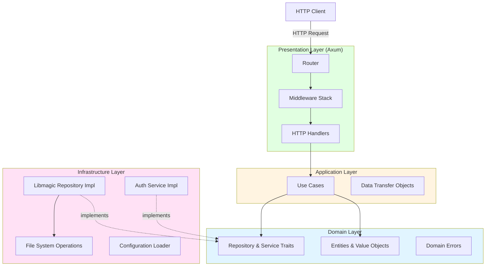
```mermaid
graph TB
    Client[HTTP Client]
    
    subgraph Presentation["Presentation Layer (Axum)"]
        Router[Router]
        Middleware[Middleware Stack]
        Handlers[HTTP Handlers]
    end
    
    subgraph Application["Application Layer"]
        UseCases[Use Cases]
        DTOs[Data Transfer Objects]
    end
    
    subgraph Domain["Domain Layer"]
        Entities[Entities & Value Objects]
        Traits[Repository & Service Traits]
        DomainErrors[Domain Errors]
    end
    
    subgraph Infrastructure["Infrastructure Layer"]
        LibmagicImpl[Libmagic Repository Impl]
        AuthImpl[Auth Service Impl]
        FileSystem[File System Operations]
        Config[Configuration Loader]
    end
    
    Client -->|HTTP Request| Router
    Router --> Middleware
    Middleware --> Handlers
    Handlers --> UseCases
    UseCases --> Entities
    UseCases --> Traits
    LibmagicImpl -.->|implements| Traits
    AuthImpl -.->|implements| Traits
    LibmagicImpl --> FileSystem
    
    style Domain fill:#e1f5ff
    style Application fill:#fff4e1
    style Infrastructure fill:#ffe1f5
    style Presentation fill:#e1ffe1
```

### 2.2. Layer Dependencies

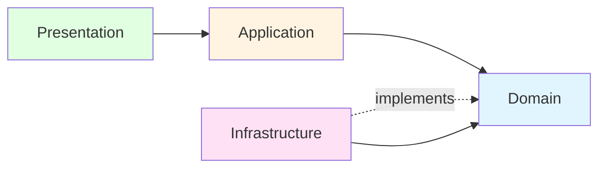
```mermaid
graph LR
    P[Presentation] --> A[Application]
    A --> D[Domain]
    I[Infrastructure] -.->|implements| D
    I --> D
    
    style D fill:#e1f5ff
    style A fill:#fff4e1
    style I fill:#ffe1f5
    style P fill:#e1ffe1
```

**Dependency Rules:**
- Solid arrows: Direct compile-time dependencies
- Dotted arrows: Runtime trait implementation
- All dependencies point toward the domain core
- Infrastructure depends on domain for trait definitions
- Presentation never directly depends on infrastructure

---

## 3. Clean Architecture Layers

### 3.1. Domain Layer

**Location:** `src/domain/`

**Purpose:** Contains pure business logic and domain rules with no framework or I/O dependencies. This layer defines the core abstractions and business entities.

**Directory Structure:**
```
src/domain/
├── entities/          # Domain entities with identity
├── value_objects/     # Immutable validated objects
├── repositories/      # Repository trait definitions
├── services/          # Domain service trait definitions
└── errors/            # Domain-specific error types
```

**Key Components:**

| Component | Purpose |
|-----------|---------|
| `entities/magic_result.rs` | Core entity representing file magic analysis result |
| `value_objects/filename.rs` | Validated Windows-compatible filename (max 310 chars) |
| `value_objects/file_path.rs` | Validated relative path (no traversal) |
| `value_objects/request_id.rs` | UUID v4 wrapper for request correlation |
| `value_objects/mime_type.rs` | Validated MIME type representation |
| `value_objects/credentials.rs` | Authentication credentials container |
| `repositories/magic_repository.rs` | Trait defining file magic analysis operations |
| `services/authentication_service.rs` | Trait defining authentication behavior |
| `errors/` | Validation, magic analysis, and domain-level errors |

**Constraints:**
- No dependencies on external crates except Rust standard library
- All validation logic lives here
- Defines abstractions (traits) implemented by infrastructure

### 3.2. Application Layer

**Location:** `src/application/`

**Purpose:** Orchestrates domain objects to implement business use cases. This layer coordinates workflows without containing business rules or I/O logic.

**Directory Structure:**
```
src/application/
├── use_cases/         # Business workflow implementations
├── dtos/              # Data transfer objects for use case boundaries
└── errors/            # Application-level error types
```

**Key Components:**

| Component | Purpose |
|-----------|---------|
| `use_cases/analyze_content.rs` | Orchestrates file magic analysis from binary content |
| `use_cases/analyze_path.rs` | Orchestrates file magic analysis from file path |
| `use_cases/health_check.rs` | System health verification workflow |
| `dtos/analyze_content_request.rs` | Input DTO for content analysis |
| `dtos/analyze_path_request.rs` | Input DTO for path-based analysis |
| `dtos/magic_response.rs` | Output DTO with magic analysis results |

**Responsibilities:**
- Receive requests through DTOs
- Validate business workflow constraints
- Call domain repositories through trait interfaces
- Transform domain entities into response DTOs
- Handle cross-cutting concerns (timeouts, transaction boundaries)

**Constraints:**
- Depends only on domain layer
- No knowledge of HTTP, databases, or external systems
- Receives infrastructure implementations through dependency injection

### 3.3. Infrastructure Layer

**Location:** `src/infrastructure/`

**Purpose:** Implements domain-defined abstractions with concrete external integrations. This layer contains all I/O operations, framework integrations, and platform-specific code.

**Directory Structure:**
```
src/infrastructure/
├── magic/             # Libmagic wrapper implementation
├── auth/              # Authentication service implementation
├── filesystem/        # File system utilities and sandbox
└── config/            # Configuration loading and parsing
```

**Key Components:**

| Component | Purpose |
|-----------|---------|
| `magic/libmagic_repository.rs` | Implements MagicRepository using libmagic C library |
| `auth/basic_auth_service.rs` | Implements AuthenticationService with basic auth |
| `filesystem/sandbox.rs` | Path validation and sandbox boundary enforcement |
| `filesystem/temp_file_handler.rs` | Temporary file management for content analysis |
| `config/server_config.rs` | Configuration file parsing and environment variable loading |

**Implementation Notes:**
- Uses `tokio::task::spawn_blocking` for blocking libmagic calls
- Maps external errors to domain error types at boundaries
- Provides thread-safe access to libmagic through Arc and Mutex
- Enforces path canonicalization and symlink policies

### 3.4. Presentation Layer

**Location:** `src/presentation/`

**Purpose:** Handles HTTP protocol details, request routing, and response formatting using Axum framework. This layer translates HTTP requests into application use cases and formats results as HTTP responses.

**Directory Structure:**
```
src/presentation/
├── http/
│   ├── handlers/      # HTTP endpoint implementations
│   ├── middleware/    # Request/response middleware
│   ├── extractors/    # Custom Axum extractors
│   ├── responses/     # Response type definitions
│   └── router.rs      # Route configuration
└── state/             # Shared application state
```

**Key Components:**

| Component | Purpose |
|-----------|---------|
| `http/handlers/magic_handlers.rs` | Handles POST /v1/magic/content and /v1/magic/path |
| `http/handlers/health_handlers.rs` | Handles GET /v1/ping health check |
| `http/middleware/request_id.rs` | Injects UUID into request extensions |
| `http/middleware/auth.rs` | Validates basic authentication credentials |
| `http/middleware/timeout.rs` | Enforces request timeout constraints |
| `http/middleware/error_handler.rs` | Maps errors to HTTP status codes and JSON |
| `http/extractors/filename.rs` | Extracts and validates filename query parameter |
| `http/responses/` | JSON response structures with IntoResponse trait |
| `http/router.rs` | Axum router configuration and middleware composition |
| `state/app_state.rs` | Dependency injection container for handlers |

**Responsibilities:**
- Parse HTTP requests and extract parameters
- Validate HTTP-level constraints (headers, content-type)
- Delegate to application use cases
- Format responses as JSON with appropriate status codes
- Apply middleware for cross-cutting concerns

---

## 4. Component Architecture

### 4.1. Domain Components

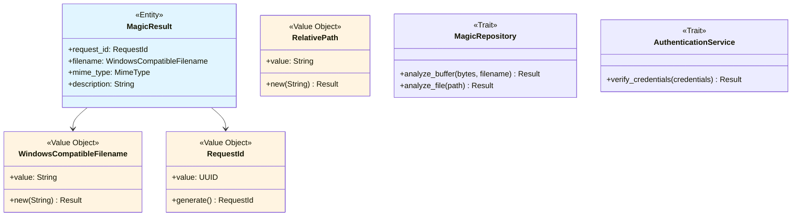
```mermaid
classDiagram
    class MagicResult {
        <<Entity>>
        +request_id: RequestId
        +filename: WindowsCompatibleFilename
        +mime_type: MimeType
        +description: String
    }
    
    class WindowsCompatibleFilename {
        <<Value Object>>
        +value: String
        +new(String) Result
    }
    
    class RelativePath {
        <<Value Object>>
        +value: String
        +new(String) Result
    }
    
    class RequestId {
        <<Value Object>>
        +value: UUID
        +generate() RequestId
    }
    
    class MagicRepository {
        <<Trait>>
        +analyze_buffer(bytes, filename) Result
        +analyze_file(path) Result
    }
    
    class AuthenticationService {
        <<Trait>>
        +verify_credentials(credentials) Result
    }
    
    MagicResult --> WindowsCompatibleFilename
    MagicResult --> RequestId
    
    style MagicResult fill:#e1f5ff
    style WindowsCompatibleFilename fill:#fff4e1
    style RelativePath fill:#fff4e1
    style RequestId fill:#fff4e1
```

**Domain Component Descriptions:**

| Component | Type | Location | Purpose |
|-----------|------|----------|---------|
| WindowsCompatibleFilename | Value Object | `domain/value_objects/filename.rs` | Encapsulates filename validation (max 310 chars, no `/` or `\0`) |
| RelativePath | Value Object | `domain/value_objects/file_path.rs` | Encapsulates path validation (no leading `/`, no `..`, no `//`) |
| RequestId | Value Object | `domain/value_objects/request_id.rs` | Wraps UUID v4 for request correlation |
| MimeType | Value Object | `domain/value_objects/mime_type.rs` | Validates and represents MIME types |
| BasicAuthCredentials | Value Object | `domain/value_objects/credentials.rs` | Contains username/password pair |
| MagicResult | Entity | `domain/entities/magic_result.rs` | Aggregates file magic analysis results with identity |
| MagicRepository | Trait | `domain/repositories/magic_repository.rs` | Defines interface for file magic analysis operations |
| AuthenticationService | Trait | `domain/services/authentication_service.rs` | Defines interface for credential verification |

### 4.2. Application Flow

#### Standard Content Analysis

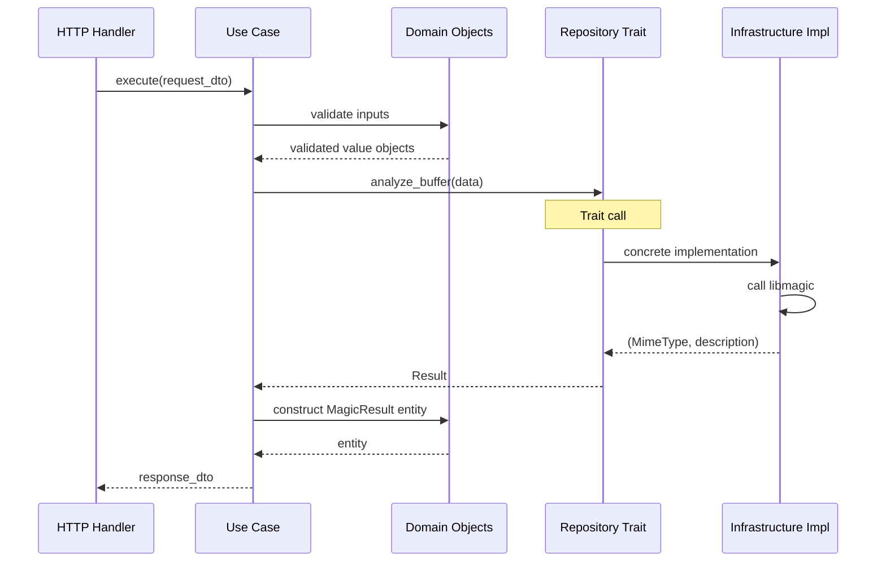
```mermaid
sequenceDiagram
    participant Handler as HTTP Handler
    participant UseCase as Use Case
    participant Domain as Domain Objects
    participant Repo as Repository Trait
    participant Impl as Infrastructure Impl
    
    Handler->>UseCase: execute(request_dto)
    UseCase->>Domain: validate inputs
    Domain-->>UseCase: validated value objects
    UseCase->>Repo: analyze_buffer(data)
    Note over Repo: Trait call
    Repo->>Impl: concrete implementation
    Impl->>Impl: call libmagic
    Impl-->>Repo: (MimeType, description)
    Repo-->>UseCase: Result
    UseCase->>Domain: construct MagicResult entity
    Domain-->>UseCase: entity
    UseCase-->>Handler: response_dto
```

#### Large File Analysis Flow

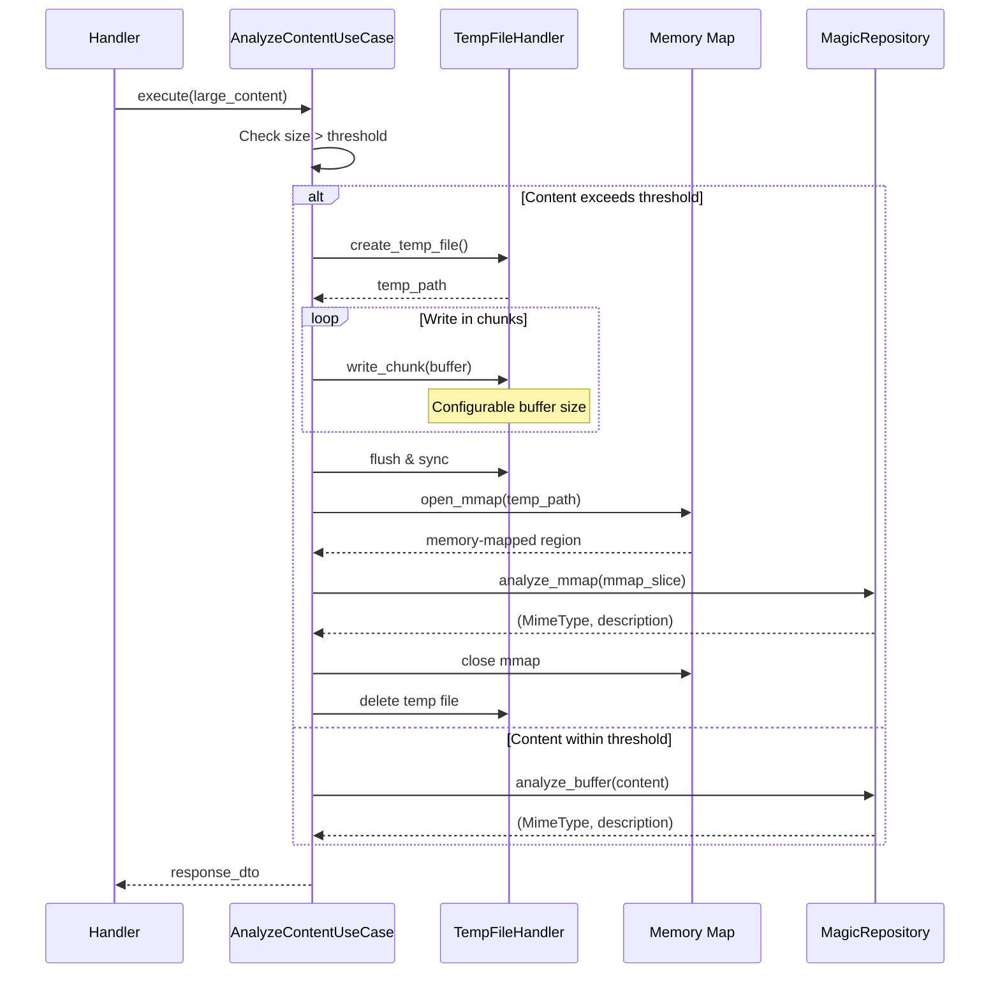
```mermaid
sequenceDiagram
    participant Handler
    participant UseCase as AnalyzeContentUseCase
    participant TempFile as TempFileHandler
    participant Mmap as Memory Map
    participant Repo as MagicRepository
    
    Handler->>UseCase: execute(large_content)
    UseCase->>UseCase: Check size > threshold
    
    alt Content exceeds threshold
        UseCase->>TempFile: create_temp_file()
        TempFile-->>UseCase: temp_path
        
        loop Write in chunks
            UseCase->>TempFile: write_chunk(buffer)
            Note over TempFile: Configurable buffer size
        end
        
        UseCase->>TempFile: flush & sync
        UseCase->>Mmap: open_mmap(temp_path)
        Mmap-->>UseCase: memory-mapped region
        UseCase->>Repo: analyze_mmap(mmap_slice)
        Repo-->>UseCase: (MimeType, description)
        UseCase->>Mmap: close mmap
        UseCase->>TempFile: delete temp file
    else Content within threshold
        UseCase->>Repo: analyze_buffer(content)
        Repo-->>UseCase: (MimeType, description)
    end
    
    UseCase-->>Handler: response_dto
```

**Use Case Orchestration:**

The application layer coordinates domain operations through three primary use cases:

1. **AnalyzeContentUseCase** (`application/use_cases/analyze_content.rs`)
   - Receives binary content and filename from handler
   - Validates content is non-empty
   - **Large File Handling:** If content exceeds threshold, streams to temporary file
   - Uses memory-mapped I/O for large files to reduce memory footprint
   - Delegates to MagicRepository trait
   - Constructs response DTO from domain entity
   - Applies 30-second timeout constraint
   - Cleans up temporary files after analysis

2. **AnalyzePathUseCase** (`application/use_cases/analyze_path.rs`)
   - Receives file path and filename from handler
   - Validates path is within sandbox boundaries
   - Checks file existence before analysis
   - Delegates to MagicRepository trait
   - Returns 404 error if file not found

3. **HealthCheckUseCase** (`application/use_cases/health_check.rs`)
   - Simple liveness probe
   - Returns success immediately
   - No external dependencies

### 4.3. Large Content Handling Strategy

**Problem:** Analyzing large files (10MB-100MB) in memory can cause:
- High memory consumption under concurrent load
- Increased garbage collection pressure
- Potential out-of-memory conditions

**Solution:** Stream large content to temporary file and use memory-mapped I/O.

#### Architecture

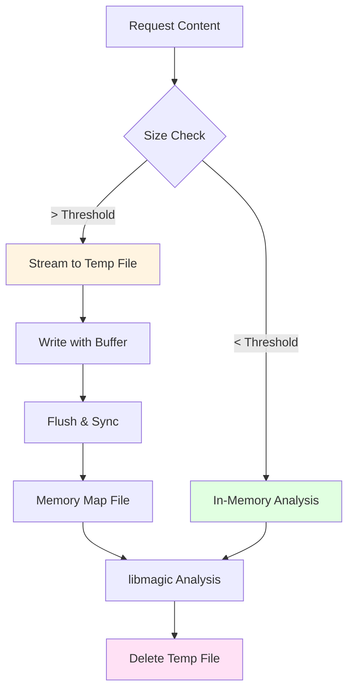
```mermaid
graph TB
    Content[Request Content] --> Check{Size Check}
    
    Check -->|< Threshold| Memory[In-Memory Analysis]
    Check -->|> Threshold| Stream[Stream to Temp File]
    
    Stream --> Write[Write with Buffer]
    Write --> Flush[Flush & Sync]
    Flush --> Mmap[Memory Map File]
    Mmap --> Analyze[libmagic Analysis]
    Analyze --> Cleanup[Delete Temp File]
    
    Memory --> Analyze
    
    style Memory fill:#e1ffe1
    style Stream fill:#fff4e1
    style Cleanup fill:#ffe1f5
```

#### Configuration Parameters

| Parameter | Config Key | Default | Purpose |
|-----------|-----------|---------|---------|
| **Size Threshold** | `analysis.large_file_threshold_mb` | 10 MB | Trigger point for file streaming |
| **Write Buffer Size** | `analysis.write_buffer_size_kb` | 64 KB | Chunk size for streaming writes |
| **Temp Directory** | `analysis.temp_dir` | `/tmp/magicer` | Location for temporary files |

#### Processing Strategy

**Small Content (< Threshold):**
1. Keep entire content in memory
2. Pass directly to libmagic via buffer API
3. No file I/O overhead
4. Fast path for typical requests

**Large Content (≥ Threshold):**
1. Create temporary file with unique name
2. Stream content in configurable chunks
3. Flush and sync to ensure data persistence
4. Open file with memory-mapped I/O (mmap)
5. Pass mmap slice to libmagic
6. Close mmap and delete temporary file

#### Memory-Mapped I/O Benefits

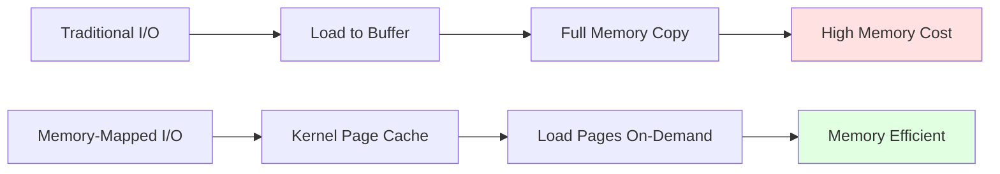
```mermaid
graph LR
    Traditional[Traditional I/O] --> Buffer[Load to Buffer]
    Buffer --> Memory[Full Memory Copy]
    
    Mmap[Memory-Mapped I/O] --> Kernel[Kernel Page Cache]
    Kernel --> OnDemand[Load Pages On-Demand]
    
    Memory --> Cost[High Memory Cost]
    OnDemand --> Efficient[Memory Efficient]
    
    style Cost fill:#ffe1e1
    style Efficient fill:#e1ffe1
```

**Advantages:**
- **Lazy Loading:** Pages loaded only when accessed
- **Kernel Cache:** Leverages OS page cache
- **Memory Efficiency:** No duplicate buffering
- **Performance:** Near-native file access speed

#### Temporary File Management

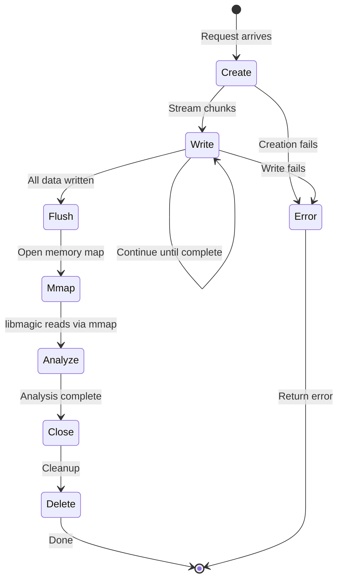
```mermaid
stateDiagram-v2
    [*] --> Create: Request arrives
    Create --> Write: Stream chunks
    Write --> Write: Continue until complete
    Write --> Flush: All data written
    Flush --> Mmap: Open memory map
    Mmap --> Analyze: libmagic reads via mmap
    Analyze --> Close: Analysis complete
    Close --> Delete: Cleanup
    Delete --> [*]: Done
    
    Create --> Error: Creation fails
    Write --> Error: Write fails
    Error --> [*]: Return error
```

**Safety Requirements:**

| Requirement | Implementation |
|-------------|----------------|
| **Unique Names** | UUID-based temp file names |
| **Atomic Cleanup** | Drop trait ensures deletion |
| **Panic Safety** | RAII pattern for cleanup |
| **Permission Control** | File created with 0600 (owner only) |
| **Directory Isolation** | Separate temp directory from sandbox |

#### Error Handling

| Error Scenario | Response |
|----------------|----------|
| Temp file creation fails | Return 500 Internal Server Error |
| Write fails (disk full) | Return 507 Insufficient Storage |
| Mmap fails | Fallback to buffer analysis or error |
| Analysis timeout | Delete temp file, return 504 |
| Cleanup fails | Log warning, continue |

#### Resource Limits

**Concurrent Temp Files:**
- Maximum concurrent requests: 1000 (connection limit)
- Maximum temp files: 1000 (one per request)
- Disk space check: Recommended 10GB free minimum

**Disk Space Management:**
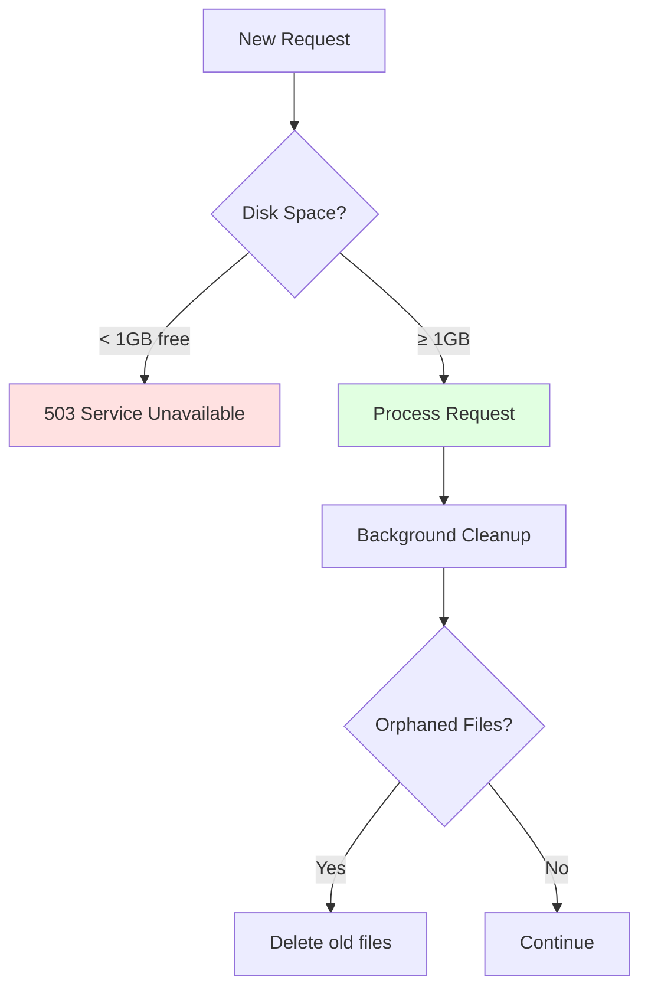
```mermaid
graph TB
    Request[New Request] --> Check{Disk Space?}
    Check -->|< 1GB free| Reject[503 Service Unavailable]
    Check -->|≥ 1GB| Process[Process Request]
    
    Process --> Monitor[Background Cleanup]
    Monitor --> Orphaned{Orphaned Files?}
    Orphaned -->|Yes| Delete[Delete old files]
    Orphaned -->|No| Continue[Continue]
    
    style Reject fill:#ffe1e1
    style Process fill:#e1ffe1
```

**Orphaned File Cleanup:**
- Background task runs every 5 minutes
- Deletes temp files older than 1 hour
- Logs cleanup operations

#### Implementation Location

| Component | Location | Responsibility |
|-----------|----------|----------------|
| Use Case Logic | `application/use_cases/analyze_content.rs` | Size check, orchestration |
| TempFileHandler | `infrastructure/filesystem/temp_file_handler.rs` | File creation, RAII cleanup |
| Mmap Wrapper | `infrastructure/filesystem/mmap.rs` | Memory-mapped I/O abstraction |
| Configuration | `infrastructure/config/server_config.rs` | Threshold and buffer size |

### 4.4. Infrastructure Integration

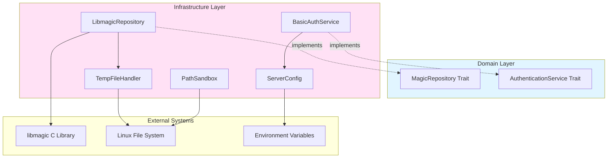
```mermaid
graph TB
    subgraph Domain["Domain Layer"]
        MRTrait[MagicRepository Trait]
        ASTrait[AuthenticationService Trait]
    end
    
    subgraph Infrastructure["Infrastructure Layer"]
        LibmagicImpl[LibmagicRepository]
        AuthImpl[BasicAuthService]
        Sandbox[PathSandbox]
        TempFile[TempFileHandler]
        Config[ServerConfig]
    end
    
    subgraph External["External Systems"]
        Libmagic[libmagic C Library]
        FileSystem[Linux File System]
        EnvVars[Environment Variables]
    end
    
    LibmagicImpl -.->|implements| MRTrait
    AuthImpl -.->|implements| ASTrait
    
    LibmagicImpl --> Libmagic
    LibmagicImpl --> TempFile
    TempFile --> FileSystem
    Sandbox --> FileSystem
    AuthImpl --> Config
    Config --> EnvVars
    
    style Domain fill:#e1f5ff
    style Infrastructure fill:#ffe1f5
```

**Infrastructure Components:**

| Component | Location | Purpose |
|-----------|----------|---------|
| LibmagicRepository | `infrastructure/magic/libmagic_repository.rs` | Thread-safe libmagic wrapper using Arc&lt;Mutex&gt; |
| BasicAuthService | `infrastructure/auth/basic_auth_service.rs` | Credential verification with constant-time comparison |
| PathSandbox | `infrastructure/filesystem/sandbox.rs` | Path canonicalization and boundary enforcement |
| TempFileHandler | `infrastructure/filesystem/temp_file_handler.rs` | RAII-based temporary file management |
| ServerConfig | `infrastructure/config/server_config.rs` | Configuration loading from TOML and environment |

---

## 5. Axum HTTP Server Architecture

### 5.1. Request Processing Flow

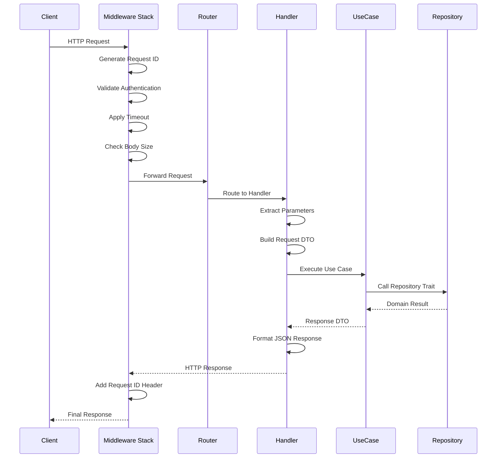
```mermaid
sequenceDiagram
    participant Client
    participant Middleware as Middleware Stack
    participant Router
    participant Handler
    participant UseCase
    participant Repository
    
    Client->>Middleware: HTTP Request
    Middleware->>Middleware: Generate Request ID
    Middleware->>Middleware: Validate Authentication
    Middleware->>Middleware: Apply Timeout
    Middleware->>Middleware: Check Body Size
    Middleware->>Router: Forward Request
    Router->>Handler: Route to Handler
    Handler->>Handler: Extract Parameters
    Handler->>Handler: Build Request DTO
    Handler->>UseCase: Execute Use Case
    UseCase->>Repository: Call Repository Trait
    Repository-->>UseCase: Domain Result
    UseCase-->>Handler: Response DTO
    Handler->>Handler: Format JSON Response
    Handler-->>Middleware: HTTP Response
    Middleware->>Middleware: Add Request ID Header
    Middleware-->>Client: Final Response
```

### 5.2. Middleware Architecture


```mermaid
graph LR
    Request[Incoming Request] --> M1[Request ID]
    M1 --> M2[Timeout Enforcement]
    M2 --> M3[Body Size Limit]
    M3 --> M4[Authentication]
    M4 --> M5[Error Handler]
    M5 --> Handler[Handler]
    Handler --> Response[Response]
    
    style M1 fill:#e1f5ff
    style M2 fill:#fff4e1
    style M3 fill:#ffe1f5
    style M4 fill:#e1ffe1
    style M5 fill:#f5e1ff
```

**Middleware Execution Order (Outer to Inner):**

| Order | Middleware | Location | Purpose |
|-------|-----------|----------|---------|
| 1 | Request ID | `presentation/http/middleware/request_id.rs` | Generates UUID v4 and injects into request extensions |
| 2 | Timeout | `presentation/http/middleware/timeout.rs` | Enforces 60s read/write timeout |
| 3 | Body Limit | Axum built-in | Rejects requests exceeding 100MB |
| 4 | Authentication | `presentation/http/middleware/auth.rs` | Validates HTTP Basic Auth (selective routes) |
| 5 | Error Handler | `presentation/http/middleware/error_handler.rs` | Converts all errors to JSON with appropriate status codes |

### 5.3. Routing Structure

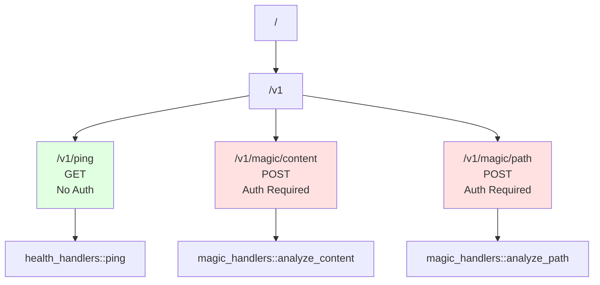
```mermaid
graph TB
    Root["/"]
    V1["/v1"]
    Ping["/v1/ping<br/>GET<br/>No Auth"]
    Content["/v1/magic/content<br/>POST<br/>Auth Required"]
    Path["/v1/magic/path<br/>POST<br/>Auth Required"]
    
    Root --> V1
    V1 --> Ping
    V1 --> Content
    V1 --> Path
    
    Ping --> HealthHandler[health_handlers::ping]
    Content --> MagicHandler1[magic_handlers::analyze_content]
    Path --> MagicHandler2[magic_handlers::analyze_path]
    
    style Ping fill:#e1ffe1
    style Content fill:#ffe1e1
    style Path fill:#ffe1e1
```

**Route Definitions:**

| Method | Path | Handler Location | Auth | Purpose |
|--------|------|------------------|------|---------|
| GET | `/v1/ping` | `presentation/http/handlers/health_handlers.rs` | No | Health check endpoint |
| POST | `/v1/magic/content` | `presentation/http/handlers/magic_handlers.rs` | Yes | Analyze binary content |
| POST | `/v1/magic/path` | `presentation/http/handlers/magic_handlers.rs` | Yes | Analyze file by path |

**Router Configuration:**

The router is configured in `presentation/http/router.rs` with two route groups:
- Public routes without authentication middleware
- Protected routes with authentication middleware applied

All routes share global middleware for request ID, timeout, and body size limits.

### 5.4. State Management

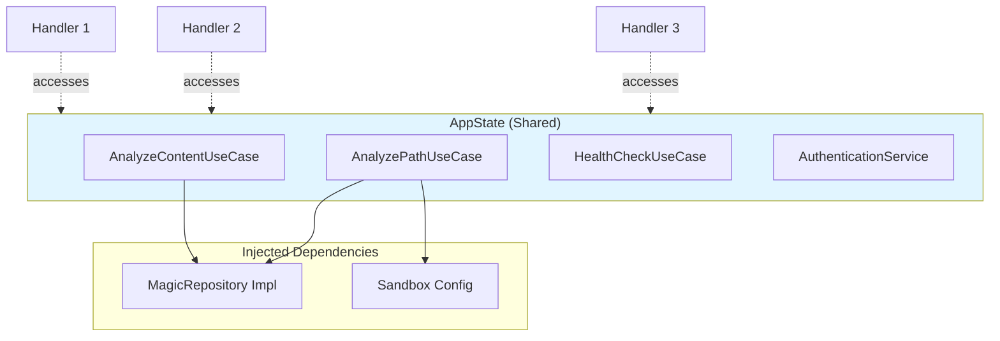
```mermaid
graph TB
    subgraph AppState["AppState (Shared)"]
        UC1[AnalyzeContentUseCase]
        UC2[AnalyzePathUseCase]
        UC3[HealthCheckUseCase]
        AuthSvc[AuthenticationService]
    end
    
    subgraph Dependencies["Injected Dependencies"]
        MagicRepo[MagicRepository Impl]
        Config[Sandbox Config]
    end
    
    UC1 --> MagicRepo
    UC2 --> MagicRepo
    UC2 --> Config
    
    Handler1[Handler 1] -.->|accesses| AppState
    Handler2[Handler 2] -.->|accesses| AppState
    Handler3[Handler 3] -.->|accesses| AppState
    
    style AppState fill:#e1f5ff
```

**State Initialization Flow:**

The application state is constructed during startup and contains all dependency-injected components:

1. Infrastructure components are instantiated (LibmagicRepository, BasicAuthService)
2. Use cases are constructed with repository trait objects
3. AppState struct wraps all use cases and services
4. AppState is cloned cheaply (Arc internally) for each request handler

**State Location:** `presentation/state/app_state.rs`

**Handler Access Pattern:**

Handlers receive AppState through Axum's State extractor, providing access to all use cases without direct infrastructure dependencies.

---

## 6. Security Architecture

### 6.1. Authentication Flow

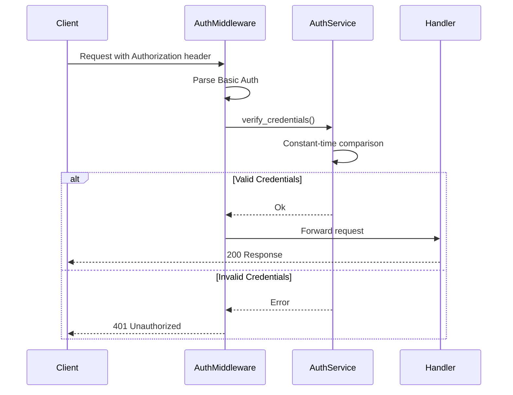
```mermaid
sequenceDiagram
    participant Client
    participant AuthMiddleware
    participant AuthService
    participant Handler
    
    Client->>AuthMiddleware: Request with Authorization header
    AuthMiddleware->>AuthMiddleware: Parse Basic Auth
    AuthMiddleware->>AuthService: verify_credentials()
    AuthService->>AuthService: Constant-time comparison
    alt Valid Credentials
        AuthService-->>AuthMiddleware: Ok
        AuthMiddleware->>Handler: Forward request
        Handler-->>Client: 200 Response
    else Invalid Credentials
        AuthService-->>AuthMiddleware: Error
        AuthMiddleware-->>Client: 401 Unauthorized
    end
```

**Authentication Strategy:**

| Aspect | Implementation |
|--------|----------------|
| Protocol | HTTP Basic Authentication (RFC 7617) |
| Middleware | `presentation/http/middleware/auth.rs` |
| Service | `infrastructure/auth/basic_auth_service.rs` implements `AuthenticationService` trait |
| Credential Storage | Environment variables (production: external secrets manager) |
| Timing Attack Prevention | Constant-time comparison using `subtle` crate |
| Selective Application | Applied only to `/v1/magic/*` routes, not `/v1/ping` |

### 6.2. Path Validation Strategy

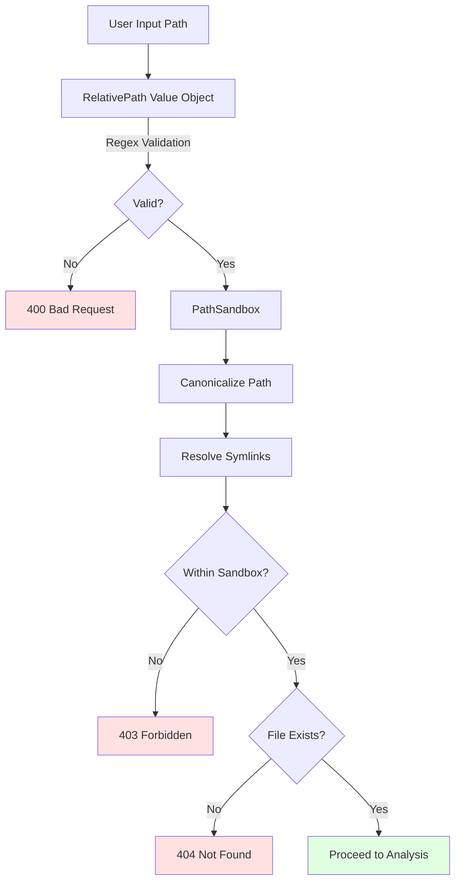
```mermaid
graph TB
    Input[User Input Path] --> V1[RelativePath Value Object]
    V1 -->|Regex Validation| V1A{Valid?}
    V1A -->|No| Reject1[400 Bad Request]
    V1A -->|Yes| V2[PathSandbox]
    V2 --> V2A[Canonicalize Path]
    V2A --> V2B[Resolve Symlinks]
    V2B --> V2C{Within Sandbox?}
    V2C -->|No| Reject2[403 Forbidden]
    V2C -->|Yes| V2D{File Exists?}
    V2D -->|No| Reject3[404 Not Found]
    V2D -->|Yes| Accept[Proceed to Analysis]
    
    style Reject1 fill:#ffe1e1
    style Reject2 fill:#ffe1e1
    style Reject3 fill:#ffe1e1
    style Accept fill:#e1ffe1
```

**Path Security Layers:**

1. **Input Validation** (`domain/value_objects/file_path.rs`)
   - Rejects paths with leading `/` (absolute paths)
   - Rejects paths containing `..` (parent directory traversal)
   - Rejects paths with `//` (double slashes)
   - Rejects paths with leading spaces
   - Rejects paths ending with `.`

2. **Canonicalization** (`infrastructure/filesystem/sandbox.rs`)
   - Uses `std::fs::canonicalize()` to resolve path
   - Follows symlinks to actual file location
   - Converts to absolute path

3. **Boundary Enforcement** (`infrastructure/filesystem/sandbox.rs`)
   - Ensures canonicalized path starts with configured `base_dir`
   - Prevents symlink escape attacks
   - Returns 403 Forbidden if boundary violated

4. **Existence Check** (`application/use_cases/analyze_path.rs`)
   - Verifies file exists before analysis
   - Returns 404 Not Found if missing

**Example Paths:**

| Input | Validation Result | Reason |
|-------|------------------|--------|
| `uploads/file.txt` | ✅ Accept | Valid relative path |
| `/etc/passwd` | ❌ Reject | Absolute path (leading `/`) |
| `../etc/passwd` | ❌ Reject | Contains `..` |
| `data/../../secret` | ❌ Reject | Contains `..` |
| `data//file.txt` | ❌ Reject | Double slash |
| `symlink_to_etc` | ❌ Reject (if escapes sandbox) | Symlink pointing outside |

### 6.3. Request Constraints

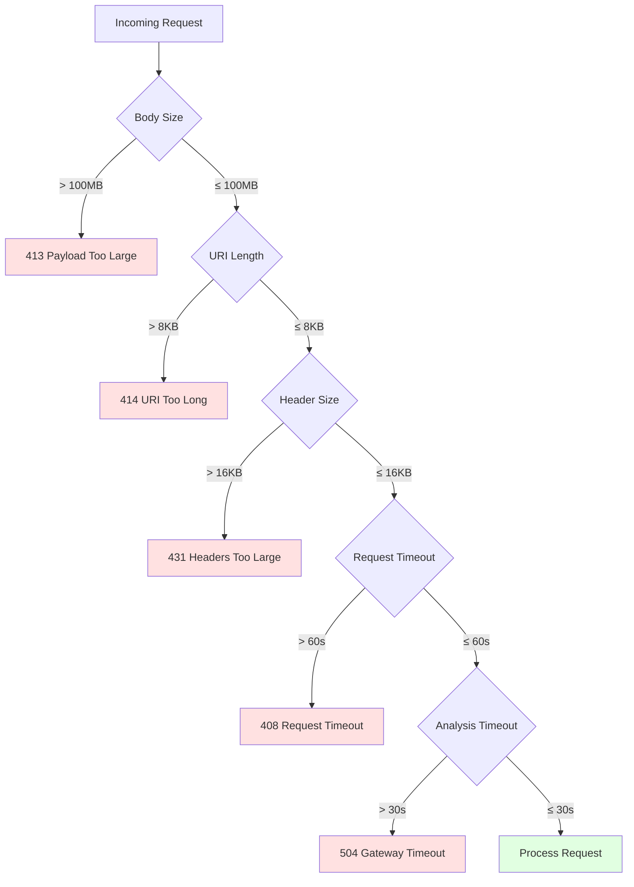
```mermaid
graph TB
    Request[Incoming Request]
    
    Request --> C1{Body Size}
    C1 -->|> 100MB| R1[413 Payload Too Large]
    C1 -->|≤ 100MB| C2{URI Length}
    
    C2 -->|> 8KB| R2[414 URI Too Long]
    C2 -->|≤ 8KB| C3{Header Size}
    
    C3 -->|> 16KB| R3[431 Headers Too Large]
    C3 -->|≤ 16KB| C4{Request Timeout}
    
    C4 -->|> 60s| R4[408 Request Timeout]
    C4 -->|≤ 60s| C5{Analysis Timeout}
    
    C5 -->|> 30s| R5[504 Gateway Timeout]
    C5 -->|≤ 30s| Accept[Process Request]
    
    style R1 fill:#ffe1e1
    style R2 fill:#ffe1e1
    style R3 fill:#ffe1e1
    style R4 fill:#ffe1e1
    style R5 fill:#ffe1e1
    style Accept fill:#e1ffe1
```

**Constraint Enforcement:**

| Constraint | Value | Enforcement Layer | Purpose |
|------------|-------|-------------------|---------|
| Max Request Body | 100MB | Axum `DefaultBodyLimit` middleware | Prevent memory exhaustion |
| Max URI Length | 8KB | Axum default | Prevent buffer overflow attacks |
| Max Header Size | 16KB | Hyper default | Prevent header DoS attacks |
| Request Timeout | 60s | Custom timeout middleware | Prevent connection exhaustion |
| Analysis Timeout | 30s | Use case level | Prevent indefinite blocking |
| Keep-Alive Timeout | 75s | Hyper configuration | Balance connection reuse and cleanup |

---

## 7. Error Handling Architecture

### 7.1. Error Flow

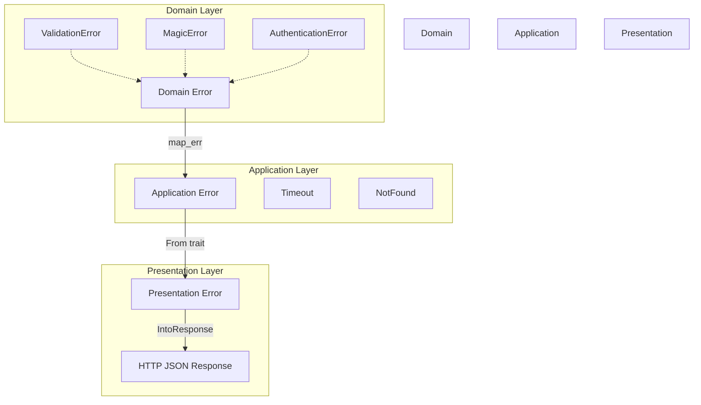
```mermaid
graph TB
    DE[Domain Error] -->|map_err| AE[Application Error]
    AE -->|From trait| PE[Presentation Error]
    PE -->|IntoResponse| HTTP[HTTP JSON Response]
    
    subgraph Domain Layer
        DE
        DV[ValidationError]
        DM[MagicError]
        DA[AuthenticationError]
    end
    
    subgraph Application Layer
        AE
        AT[Timeout]
        AF[NotFound]
    end
    
    subgraph Presentation Layer
        PE
        HTTP
    end
    
    DV -.-> DE
    DM -.-> DE
    DA -.-> DE
    
    style Domain Layer fill:#e1f5ff
    style Application Layer fill:#fff4e1
    style Presentation Layer fill:#e1ffe1
```

**Error Transformation Chain:**

1. **Domain Layer** (`src/domain/errors/`) produces pure domain errors with no HTTP knowledge
2. **Application Layer** (`src/application/errors/`) wraps domain errors and adds application-level errors
3. **Presentation Layer** (`src/presentation/http/responses/error_response.rs`) maps to HTTP status codes

### 7.2. Error Mapping Strategy

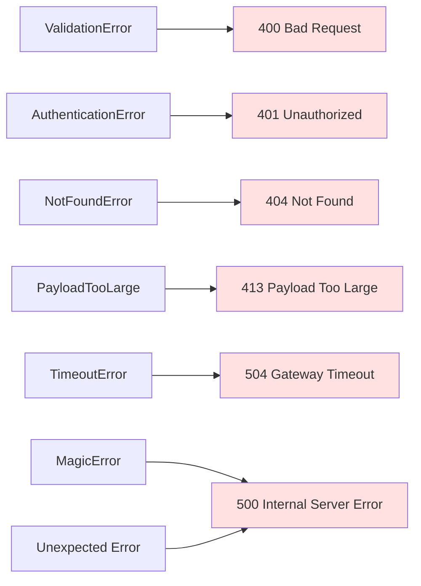
```mermaid
graph LR
    VE[ValidationError] --> B400[400 Bad Request]
    AE[AuthenticationError] --> U401[401 Unauthorized]
    NF[NotFoundError] --> N404[404 Not Found]
    PL[PayloadTooLarge] --> P413[413 Payload Too Large]
    TO[TimeoutError] --> T504[504 Gateway Timeout]
    ME[MagicError] --> S500[500 Internal Server Error]
    UE[Unexpected Error] --> S500
    
    style B400 fill:#ffe1e1
    style U401 fill:#ffe1e1
    style N404 fill:#ffe1e1
    style P413 fill:#ffe1e1
    style T504 fill:#ffe1e1
    style S500 fill:#ffe1e1
```

**Error Mapping Table:**

| Error Source | Error Type | HTTP Status | JSON Error Message | Response Location |
|--------------|-----------|-------------|-------------------|-------------------|
| Domain validation | `ValidationError::InvalidFilename` | 400 | "Invalid filename parameter" | `error_response.rs` |
| Domain validation | `ValidationError::PathTraversal` | 400 | "Path traversal not allowed" | `error_response.rs` |
| Domain validation | `ValidationError::ExceedsMaxLength` | 400 | "Filename exceeds maximum length" | `error_response.rs` |
| Infrastructure auth | `AuthenticationError::InvalidCredentials` | 401 | "Authentication required" | `error_response.rs` |
| Application | `ApplicationError::NotFound` | 404 | "File not found" | `error_response.rs` |
| Middleware | Body limit exceeded | 413 | "Request body exceeds 100MB limit" | Axum built-in |
| Infrastructure | `MagicError::AnalysisFailed` | 500 | "Internal server error" | `error_response.rs` |
| Application | `ApplicationError::Timeout` | 504 | "Request timeout exceeded" | `error_response.rs` |

**Error Response Format:**

All error responses follow this JSON structure defined in the OpenAPI specification:

```json
{
  "error": "Human-readable error message",
  "request_id": "550e8400-e29b-41d4-a716-446655440000"
}
```

**Error Handling Principles:**

- Domain errors contain detailed information for debugging
- Application errors add context about workflow failures
- Presentation layer sanitizes errors to prevent information leakage
- All errors include request_id for tracing
- 5xx errors log full details internally but return generic messages externally

---

## 8. Concurrency Architecture

### 8.1. Runtime Model

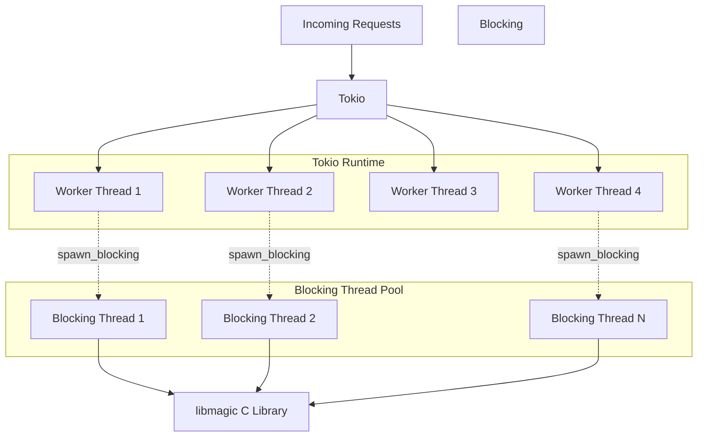
```mermaid
graph TB
    subgraph Tokio Runtime
        Worker1[Worker Thread 1]
        Worker2[Worker Thread 2]
        Worker3[Worker Thread 3]
        Worker4[Worker Thread 4]
    end
    
    subgraph Blocking Thread Pool
        Block1[Blocking Thread 1]
        Block2[Blocking Thread 2]
        Block3[Blocking Thread N]
    end
    
    Request[Incoming Requests] --> Tokio
    
    Tokio --> Worker1
    Tokio --> Worker2
    Tokio --> Worker3
    Tokio --> Worker4
    
    Worker1 -.->|spawn_blocking| Block1
    Worker2 -.->|spawn_blocking| Block2
    Worker4 -.->|spawn_blocking| Block3
    
    Block1 --> Libmagic[libmagic C Library]
    Block2 --> Libmagic
    Block3 --> Libmagic
    
    style Tokio Runtime fill:#e1f5ff
    style Blocking Thread Pool fill:#fff4e1
```

**Runtime Configuration:**

| Component | Configuration | Location | Purpose |
|-----------|---------------|----------|---------|
| Tokio Runtime | Multi-threaded, 4 worker threads | `src/main.rs` | Handle async I/O and HTTP multiplexing |
| Blocking Pool | Unbounded (Tokio default: 512) | Automatic | Execute CPU-bound libmagic operations |
| Task Scheduling | Work-stealing scheduler | Tokio internal | Balance load across workers |

**Concurrency Strategy:**

- HTTP request handling is fully async on Tokio workers
- libmagic calls use `tokio::task::spawn_blocking` to avoid blocking async runtime
- Repository implementation wraps libmagic handle in `Arc<Mutex<T>>` for thread safety
- Each blocking call executes on dedicated OS thread from blocking pool
- Blocking threads return results through channels back to async context

### 8.2. Timeout Strategy

```mermaid
graph TB
    Request[Request Arrives]
    
    Request --> T1[Request Read Timeout<br/>60 seconds]
    T1 -->|Timeout| E1[408 Request Timeout]
    T1 -->|Complete| T2[Handler Execution]
    
    T2 --> T3[Analysis Timeout<br/>30 seconds]
    T3 -->|Timeout| E2[504 Gateway Timeout]
    T3 -->|Complete| T4[Response Write]
    
    T4 --> T5[Response Write Timeout<br/>60 seconds]
    T5 -->|Timeout| E3[Connection Close]
    T5 -->|Complete| Success[200 OK]
    
    Success --> T6[Keep-Alive<br/>75 seconds]
    T6 -->|Timeout| Close[Connection Close]
    T6 -->|New Request| Request
    
    style E1 fill:#ffe1e1
    style E2 fill:#ffe1e1
    style E3 fill:#ffe1e1
    style Success fill:#e1ffe1
```

**Timeout Hierarchy:**

| Timeout Type | Duration | Enforcement Level | Purpose |
|--------------|----------|-------------------|---------|
| Request Read | 60s | Hyper/Axum configuration | Prevent slow-read attacks |
| Response Write | 60s | Hyper/Axum configuration | Prevent slow-send attacks |
| Analysis Execution | 30s | Application use case | Prevent indefinite libmagic blocking |
| Keep-Alive | 75s | Hyper configuration | Balance connection reuse and resource cleanup |

**Timeout Implementation Locations:**

- **Request/Response Timeouts:** Configured in Axum server builder at `src/main.rs`
- **Analysis Timeout:** Applied in use cases using `tokio::time::timeout()` at `src/application/use_cases/`
- **Keep-Alive Timeout:** Configured in Hyper server settings

### 8.3. Connection Limits

```mermaid
graph TB
    Clients[Clients] --> |New Connections| Backlog[OS TCP Backlog<br/>1024 pending]
    Backlog --> |Accept| Active[Active Connections<br/>1000 max]
    Backlog -->|Full| Refused[Connection Refused]
    
    Active --> |Idle 75s| Closed1[Close Connection]
    Active --> |Request Complete| Reuse[Connection Reuse]
    Active --> |Max Reached| Block[Block New Accepts]
    
    Reuse --> Active
    
    style Backlog fill:#fff4e1
    style Active fill:#e1f5ff
    style Refused fill:#ffe1e1
    style Closed1 fill:#ffe1e1
```

**Connection Management:**

| Parameter | Value | Specification | Configuration Location |
|-----------|-------|---------------|------------------------|
| Max Concurrent Connections | 1,000 | Application layer limit | Axum server configuration |
| TCP Backlog | 1,024 | OS-level pending queue | TCP listener configuration |
| Keep-Alive Timeout | 75s | Idle connection timeout | Hyper settings |
| TCP_NODELAY | Enabled | Disable Nagle algorithm | Socket configuration |

**Connection Lifecycle:**

1. Client initiates TCP connection
2. Connection enters OS backlog queue (max 1024)
3. Server accepts connection into active pool (max 1000)
4. Connection processes request(s) with HTTP/1.1 keep-alive
5. Connection closes after 75s idle or explicit closure
6. Resources freed for new connections

---

## 9. Observability Architecture

### 9.1. Tracing Strategy

```mermaid
graph TB
    Request[Incoming Request]
    
    Request --> M1[Middleware: Generate Request ID]
    M1 --> Span1[Create Root Span]
    
    Span1 --> Handler[Handler Span]
    Handler --> UseCase[Use Case Span]
    UseCase --> Repo[Repository Span]
    
    Repo --> Libmagic[Libmagic Call]
    Libmagic --> RepoEnd[Repository Span End]
    RepoEnd --> UseCaseEnd[Use Case Span End]
    UseCaseEnd --> HandlerEnd[Handler Span End]
    HandlerEnd --> Span1End[Root Span End]
    
    Span1End --> Output[Structured Log Output]
    
    style Span1 fill:#e1f5ff
    style Handler fill:#fff4e1
    style UseCase fill:#ffe1f5
    style Repo fill:#e1ffe1
```

**Tracing Framework:**

| Component | Purpose | Location |
|-----------|---------|----------|
| `tracing` crate | Span and event creation | Throughout codebase |
| `tracing-subscriber` | Log formatting and output | `src/main.rs` initialization |
| JSON formatter | Structured logging for production | Configured at startup |
| Pretty formatter | Human-readable logs for development | Configured via environment |

**Instrumentation Points:**

| Layer | Instrumentation | Information Captured |
|-------|----------------|----------------------|
| Middleware | Entry/exit spans | Request ID, duration, status code |
| Handlers | Endpoint spans | Route, parameters, response size |
| Use Cases | Workflow spans | Use case name, input validation, duration |
| Repositories | I/O spans | Operation type, file size, libmagic duration |
| Errors | Error events | Error type, message, context, request ID |

**Log Format Configuration:**

Controlled via environment variable `MAGICER_LOG_FORMAT`:
- `json` - Structured JSON for production (default)
- `pretty` - Human-readable for development
- `compact` - Minimal console output

### 9.2. Request Correlation

```mermaid
sequenceDiagram
    participant Client
    participant Middleware
    participant Extensions
    participant Handler
    participant UseCase
    participant Logger
    
    Client->>Middleware: HTTP Request
    Middleware->>Middleware: Generate UUID v4
    Middleware->>Extensions: Store RequestId
    Middleware->>Logger: Log request start
    Logger->>Logger: Include request_id in span
    
    Middleware->>Handler: Forward request
    Handler->>Extensions: Extract RequestId
    Handler->>UseCase: Execute with context
    UseCase->>Logger: Log use case execution
    Logger->>Logger: Include request_id in span
    
    UseCase-->>Handler: Result
    Handler-->>Middleware: Response
    Middleware->>Middleware: Add request_id to response JSON
    Middleware->>Logger: Log request complete
    Logger->>Logger: Include request_id in span
    Middleware-->>Client: JSON Response with request_id
```

**Request ID Flow:**

1. **Generation:** Request ID middleware (`presentation/http/middleware/request_id.rs`) generates UUID v4
2. **Storage:** UUID stored in `Request::extensions()` for handler access
3. **Propagation:** Passed to all spans via tracing context
4. **Response:** Included in all JSON responses under `request_id` field
5. **Logging:** Appears in every log entry for the request lifecycle

**Benefits:**

- Correlate all logs for a single request across components
- Trace request through distributed systems (future)
- Debug issues by filtering logs by request_id
- Match client errors to server logs

### 9.3. Metrics Collection

```mermaid
graph LR
    subgraph Application
        Handler[Handlers]
        UseCase[Use Cases]
        Repo[Repositories]
    end
    
    Handler --> M1[Request Counter]
    Handler --> M2[Response Time Histogram]
    Handler --> M3[Error Counter]
    
    UseCase --> M4[Use Case Duration]
    
    Repo --> M5[Libmagic Duration]
    Repo --> M6[File Size Distribution]
    
    M1 --> Collector[Metrics Collector]
    M2 --> Collector
    M3 --> Collector
    M4 --> Collector
    M5 --> Collector
    M6 --> Collector
    
    Collector --> Prometheus[Metrics Exporter]
    Prometheus --> Endpoint[Prometheus Endpoint]
    
    style Application fill:#e1f5ff
    style Collector fill:#fff4e1
    style Prometheus fill:#ffe1f5
```

**Proposed Metrics (Future Enhancement):**

| Metric Name | Type | Labels | Purpose |
|-------------|------|--------|---------|
| `http_requests_total` | Counter | method, path, status | Track request volume |
| `http_request_duration_seconds` | Histogram | method, path | Measure latency (p50, p95, p99) |
| `http_errors_total` | Counter | error_type, status_code | Track error rates |
| `active_connections` | Gauge | - | Monitor connection pool usage |
| `magic_analysis_duration_seconds` | Histogram | operation_type | Measure libmagic performance |
| `file_size_bytes` | Histogram | operation_type | Track payload distribution |

**Metrics Endpoint:**

- Path: `/v1/metrics` (future)
- Format: Prometheus text format
- Authentication: No (typically accessed from internal network only)

**Implementation Note:**

Metrics collection is planned for future implementation using `metrics` crate with Prometheus exporter. Current implementation focuses on structured logging via tracing.

---

## 10. Configuration Strategy

```mermaid
graph TB
    Defaults[Default Values] --> Merge1[Merge]
    ConfigFile[config.toml] --> Merge1
    Merge1 --> Merge2[Merge]
    EnvVars[Environment Variables] --> Merge2
    Merge2 --> Final[Final Configuration]
    
    Final --> Validation[Validate]
    Validation -->|Valid| App[Application Startup]
    Validation -->|Invalid| Error[Startup Error]
    
    style Defaults fill:#e1f5ff
    style ConfigFile fill:#fff4e1
    style EnvVars fill:#ffe1f5
    style Final fill:#e1ffe1
    style Error fill:#ffe1e1
```

**Configuration Sources (Priority Order):**

1. **Environment Variables** (highest priority)
2. **Configuration File** (TOML)
3. **Default Values** (lowest priority)

**Configuration Structure:**

Location: `infrastructure/config/server_config.rs`

| Configuration Section | Key Parameters | Purpose |
|----------------------|----------------|---------|
| Server Settings | host, port, max_connections, backlog | Network binding and connection limits |
| Timeout Settings | read_timeout_secs, write_timeout_secs, analysis_timeout_secs, keepalive_secs | Request and connection timeout values |
| Auth Settings | username, password | Basic authentication credentials |
| Sandbox Settings | base_dir | Root directory for path-based file access |
| Magic Settings | database_path (optional) | Custom libmagic database location |
| Logging Settings | level, format | Logging verbosity and format |

**Environment Variable Mapping:**

| Environment Variable | Configuration Path | Example Value |
|---------------------|-------------------|---------------|
| `MAGICER_HOST` | server.host | `0.0.0.0` |
| `MAGICER_PORT` | server.port | `8080` |
| `MAGICER_AUTH_USERNAME` | auth.username | `api_user` |
| `MAGICER_AUTH_PASSWORD` | auth.password | `secret123` |
| `MAGICER_SANDBOX_DIR` | sandbox.base_dir | `/var/lib/magicer/files` |
| `RUST_LOG` | logging.level | `info` |
| `MAGICER_LOG_FORMAT` | logging.format | `json` |

**Configuration File Location:**

- Development: `./config/config.toml`
- Production: `/etc/magicer/config.toml` (configurable via `MAGICER_CONFIG_PATH`)

---

## 11. Lifecycle Management

```mermaid
stateDiagram-v2
    [*] --> Initialize: Process Start
    
    Initialize --> LoadConfig: Load Configuration
    LoadConfig --> ValidateConfig: Validate Settings
    ValidateConfig --> InitInfra: Initialize Infrastructure
    InitInfra --> BuildState: Build AppState
    BuildState --> StartServer: Start HTTP Server
    
    StartServer --> Running: Server Listening
    
    Running --> ShutdownSignal: SIGTERM/SIGINT
    
    ShutdownSignal --> DrainConns: Stop Accepting New Connections
    DrainConns --> WaitInFlight: Wait for In-Flight Requests (10s max)
    WaitInFlight --> Cleanup: Cleanup Resources
    Cleanup --> [*]: Process Exit
    
    ValidateConfig --> [*]: Invalid Config
    InitInfra --> [*]: Infrastructure Error
```

**Startup Sequence:**

1. **Load Configuration** - Parse TOML file and environment variables
2. **Validate Configuration** - Ensure all required settings present and valid
3. **Initialize Infrastructure**
   - Create libmagic repository with database loading
   - Initialize authentication service with credentials
   - Validate sandbox directory exists and is accessible
4. **Build Application State** - Construct use cases and inject dependencies
5. **Start HTTP Server** - Bind to address and begin accepting connections
6. **Enter Running State** - Process requests

**Graceful Shutdown Sequence:**

```mermaid
sequenceDiagram
    participant OS
    participant SignalHandler
    participant Server
    participant Connections
    participant Repository
    
    OS->>SignalHandler: SIGTERM/SIGINT
    SignalHandler->>SignalHandler: Log shutdown initiated
    SignalHandler->>Server: Begin graceful shutdown
    Server->>Server: Stop accepting new connections
    Server->>Connections: Notify existing connections
    
    loop For each active connection
        Connections->>Connections: Complete in-flight request
    end
    
    SignalHandler->>SignalHandler: Wait max 10 seconds
    
    alt All connections closed
        Server->>Repository: Drop resources
        Repository->>Repository: Close libmagic handles
        Repository-->>SignalHandler: Cleanup complete
    else Timeout reached
        Server->>Connections: Force close remaining
        Server->>Repository: Drop resources
        Repository-->>SignalHandler: Cleanup complete
    end
    
    SignalHandler->>OS: Exit process (code 0)
```

**Shutdown Behavior:**

| Phase | Duration | Action |
|-------|----------|--------|
| Signal Reception | Immediate | Register SIGTERM or SIGINT |
| Stop Accept | Immediate | Close listening socket |
| Drain Connections | Up to 10s | Allow in-flight requests to complete |
| Force Close | After 10s | Terminate remaining connections |
| Resource Cleanup | Immediate | Drop Arc references, close file handles |
| Process Exit | Immediate | Exit with status code 0 |

**Signal Handling:**

- Listens for SIGTERM (systemd/Docker) and SIGINT (Ctrl+C)
- Single signal triggers graceful shutdown
- Second signal forces immediate termination
- Implementation location: `src/main.rs`

---

## 12. Technology Stack

**Core Dependencies:**

| Category | Crate | Version | Purpose |
|----------|-------|---------|---------|
| Web Framework | `axum` | 0.7 | HTTP server and routing |
| HTTP Server | `hyper` | 1.0 | Underlying HTTP implementation |
| Middleware | `tower` | 0.4 | Middleware composition and utilities |
| HTTP Middleware | `tower-http` | 0.5 | Common HTTP middleware (CORS, compression, tracing) |
| Async Runtime | `tokio` | 1.x | Asynchronous runtime with work-stealing scheduler |
| Serialization | `serde` | 1.x | JSON serialization/deserialization |
| JSON | `serde_json` | 1.x | JSON format support |
| Config Format | `toml` | 0.8 | TOML configuration parsing |
| Tracing | `tracing` | 0.1 | Structured logging and instrumentation |
| Log Subscriber | `tracing-subscriber` | 0.3 | Log formatting and output |
| UUID | `uuid` | 1.x | Request ID generation |
| Security | `subtle` | 2.x | Constant-time cryptographic operations |
| Base64 | `base64` | 0.21 | Basic auth header parsing |
| File Magic | `magic` | 0.16 | Rust bindings to libmagic |
| Error Handling | `thiserror` | 1.x | Derive macro for error types |
| Error Context | `anyhow` | 1.x | Error context (main.rs only) |

**Development Dependencies:**

| Crate | Version | Purpose |
|-------|---------|---------|
| `axum-test` | 14.x | HTTP endpoint testing utilities |
| `proptest` | 1.x | Property-based testing |
| `mockall` | 0.12 | Mock object generation |
| `criterion` | 0.5 | Benchmarking framework |
| `reqwest` | 0.11 | HTTP client for E2E tests |

**System Dependencies:**

- `libmagic1` - Runtime library for file type identification
- `libmagic-dev` - Development headers for compilation
- `file` - Provides magic database files

---

## Summary

This architecture provides:

1. **Clean Separation** - Four distinct layers with explicit dependencies
2. **Testability** - Trait abstractions enable comprehensive testing with mocks
3. **Security** - Multi-layer path validation and constant-time authentication
4. **Scalability** - Async-first design with configurable concurrency limits
5. **Observability** - Structured logging with request correlation
6. **Reliability** - Graceful shutdown and timeout enforcement at multiple levels
7. **Maintainability** - Clear component boundaries following DDD principles

The Axum framework integrates naturally with clean architecture through state management, middleware composition, and trait-based dependency injection.

---

## Summary

This architecture provides:
1. **Clear separation of concerns** via Clean Architecture layers
2. **Type-safe domain modeling** with value objects
3. **Secure-by-default** path handling and authentication
4. **Observable** with request ID tracing and structured logging
5. **Resilient** with timeouts, limits, and graceful shutdown
6. **Testable** with dependency injection and trait abstractions

The Axum framework integrates naturally with this design through its state management, middleware composition, and async-first handlers.
