# libmagic FFI Integration from Scratch

Designing and implementing safe Rust bindings to the libmagic C library using raw FFI without external crates.

## Overview

This document explains how to build libmagic bindings from scratch using Rust's FFI capabilities, covering raw C function declarations, memory safety, thread safety, error handling, and safe wrapper design.

**Design Goal:** Create safe, idiomatic Rust API over libmagic C library without using third-party binding crates.

---

## Why Build FFI from Scratch?

**Reason:** Learning exercise to understand Rust FFI in depth.

This project builds libmagic bindings from scratch as an educational exercise ("etude") to learn:
- How Rust FFI works at the lowest level
- Memory safety boundaries between Rust and C
- Ownership and lifetime management across FFI
- Error handling patterns for C libraries
- Thread safety considerations with external code

**Note:** In production, using an existing well-maintained crate like `magic` would be more appropriate.

---

## libmagic C API

Understanding the C API structure before designing bindings.

### Core C Functions

```c
// Opaque magic cookie handle
typedef struct magic_set *magic_t;

// Initialize magic library
magic_t magic_open(int flags);

// Load magic database file
int magic_load(magic_t cookie, const char *filename);

// Analyze file by path
const char *magic_file(magic_t cookie, const char *filename);

// Analyze buffer in memory
const char *magic_buffer(magic_t cookie, const void *buffer, size_t length);

// Get last error message
const char *magic_error(magic_t cookie);

// Get last error code (errno)
int magic_errno(magic_t cookie);

// Close and free resources
void magic_close(magic_t cookie);

// Set flags after creation
int magic_setflags(magic_t cookie, int flags);
```

### C Flag Constants

```c
#define MAGIC_NONE              0x0000000 // No special handling
#define MAGIC_MIME_TYPE         0x0000010 // Return MIME type
#define MAGIC_MIME_ENCODING     0x0000400 // Return MIME encoding
#define MAGIC_MIME              (MAGIC_MIME_TYPE|MAGIC_MIME_ENCODING)
#define MAGIC_ERROR             0x0000200 // Detailed error messages
#define MAGIC_SYMLINK           0x0000002 // Follow symlinks
#define MAGIC_COMPRESS          0x0000004 // Check inside compressed files
#define MAGIC_NO_CHECK_COMPRESS 0x0001000 // Don't check compression
```

### C Error Handling Pattern

```
1. Call returns NULL or -1 → Error occurred
2. Call magic_errno() → Get numeric error code
3. Call magic_error() → Get human-readable message
4. Error string owned by libmagic, do not free
```

---

## FFI Architecture

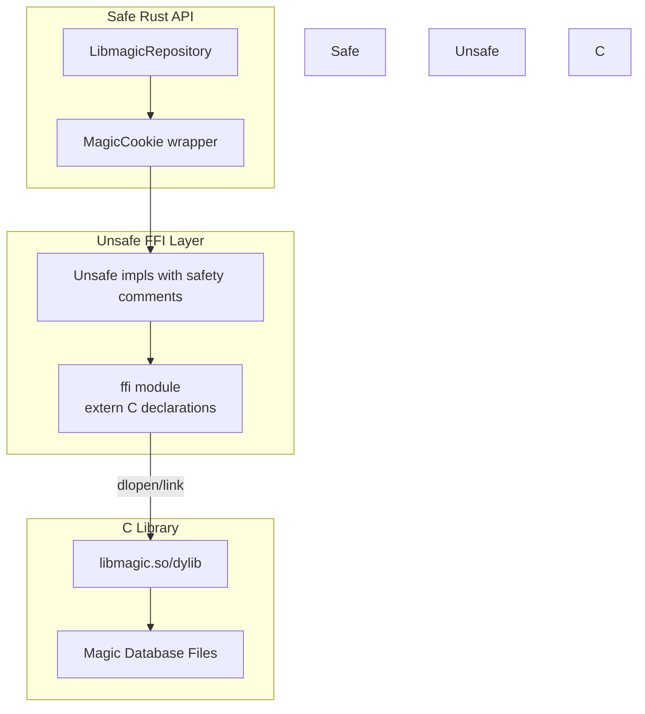
```mermaid
graph TB
    subgraph Safe Rust API
        Repository[LibmagicRepository]
        SafeWrapper[MagicCookie wrapper]
    end
    
    subgraph Unsafe FFI Layer
        RawFFI[ffi module<br/>extern C declarations]
        UnsafeImpl[Unsafe impls with safety comments]
    end
    
    subgraph C Library
        Libmagic[libmagic.so/dylib]
        Database[Magic Database Files]
    end
    
    Repository --> SafeWrapper
    SafeWrapper --> UnsafeImpl
    UnsafeImpl --> RawFFI
    RawFFI -->|dlopen/link| Libmagic
    Libmagic --> Database
    
    style Safe Rust API fill:#e1ffe1
    style Unsafe FFI Layer fill:#ffe1e1
    style C Library fill:#f5e1e1
```

### Module Structure

```
src/infrastructure/magic/
├── ffi.rs              # Raw FFI declarations (unsafe)
├── wrapper.rs          # Safe Rust wrapper types
├── error.rs            # Error type conversions
└── lib.rs              # Public API (repository impl)
```

**Responsibility Distribution:**

| Module | Contains | Safety Level |
|--------|----------|--------------|
| `ffi.rs` | Raw `extern "C"` declarations | 100% unsafe |
| `wrapper.rs` | Safe wrapper over raw FFI | Encapsulates unsafe |
| `error.rs` | Error type conversions | Safe |
| `lib.rs` | Repository implementation | Safe public API |

---

## Raw FFI Module Design

**Location:** `src/infrastructure/magic/ffi.rs`

### Opaque Pointer Type

C's `magic_t` is an opaque pointer - internal structure unknown.

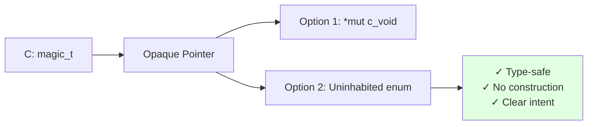
```mermaid
graph LR
    C[C: magic_t] --> Opaque[Opaque Pointer]
    Opaque --> Rust1[Option 1: *mut c_void]
    Opaque --> Rust2[Option 2: Uninhabited enum]
    
    Rust2 --> Best[✓ Type-safe<br/>✓ No construction<br/>✓ Clear intent]
    
    style Best fill:#e1ffe1
```

**Design:** Use uninhabited enum for type safety.

**Rationale:**
- Prevents accidental construction
- Distinct type from other pointers
- Zero runtime cost
- Clear intent that it's opaque

### FFI Type Mapping

| C Type | Rust FFI Type | Notes |
|--------|--------------|-------|
| `int` | `std::os::raw::c_int` | Platform-specific size |
| `size_t` | `usize` | Native pointer-sized |
| `const char*` | `*const std::os::raw::c_char` | C string (null-terminated) |
| `const void*` | `*const std::os::raw::c_void` | Generic data pointer |
| `void*` | `*mut std::os::raw::c_void` | Mutable data pointer |
| `magic_t` | `*mut MagicT` | Custom opaque type |

### Linkage Declaration

Specify which C library to link against during compilation.

**Build Script Location:** `build.rs` (if needed for pkg-config)  
**Link Directive:** `#[link(name = "magic")]`

**Platform Differences:**

| Platform | Library Name | Location |
|----------|-------------|----------|
| Linux | `libmagic.so.1` | `/usr/lib/x86_64-linux-gnu/` |
| macOS | `libmagic.dylib` | `/usr/local/lib/` |
| Windows | `magic1.dll` | (Not supported for this project) |

---

## Safe Wrapper Design

**Location:** `src/infrastructure/magic/wrapper.rs`

### Ownership Model

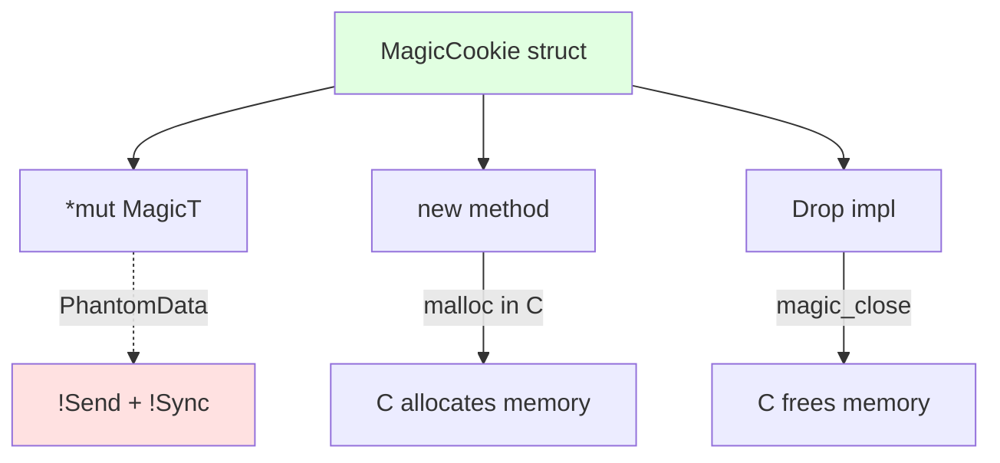
```mermaid
graph TB
    MagicCookie[MagicCookie struct] --> Pointer[*mut MagicT]
    
    MagicCookie --> New[new method]
    MagicCookie --> Drop[Drop impl]
    
    New -->|malloc in C| Allocate[C allocates memory]
    Drop -->|magic_close| Free[C frees memory]
    
    Pointer -.->|PhantomData| Marker[!Send + !Sync]
    
    style MagicCookie fill:#e1ffe1
    style Marker fill:#ffe1e1
```

**Design Principles:**

1. **RAII Pattern** - Resource acquired in constructor, freed in destructor
2. **Ownership** - Rust owns the C resource lifetime
3. **Non-Send/Non-Sync** - libmagic is not thread-safe by default
4. **Panic Safety** - Drop runs even during panic

### MagicCookie Structure

Wraps the raw `*mut MagicT` pointer with safe Rust semantics.

**Fields:**
- `ptr: *mut MagicT` - The raw C pointer
- `_marker: PhantomData<*mut ()>` - Marks as `!Send + !Sync`

**Why PhantomData?**
- Raw pointers are `Send` and `Sync` by default in Rust
- libmagic is NOT thread-safe
- PhantomData prevents accidental cross-thread usage
- Zero runtime cost

### Constructor Pattern

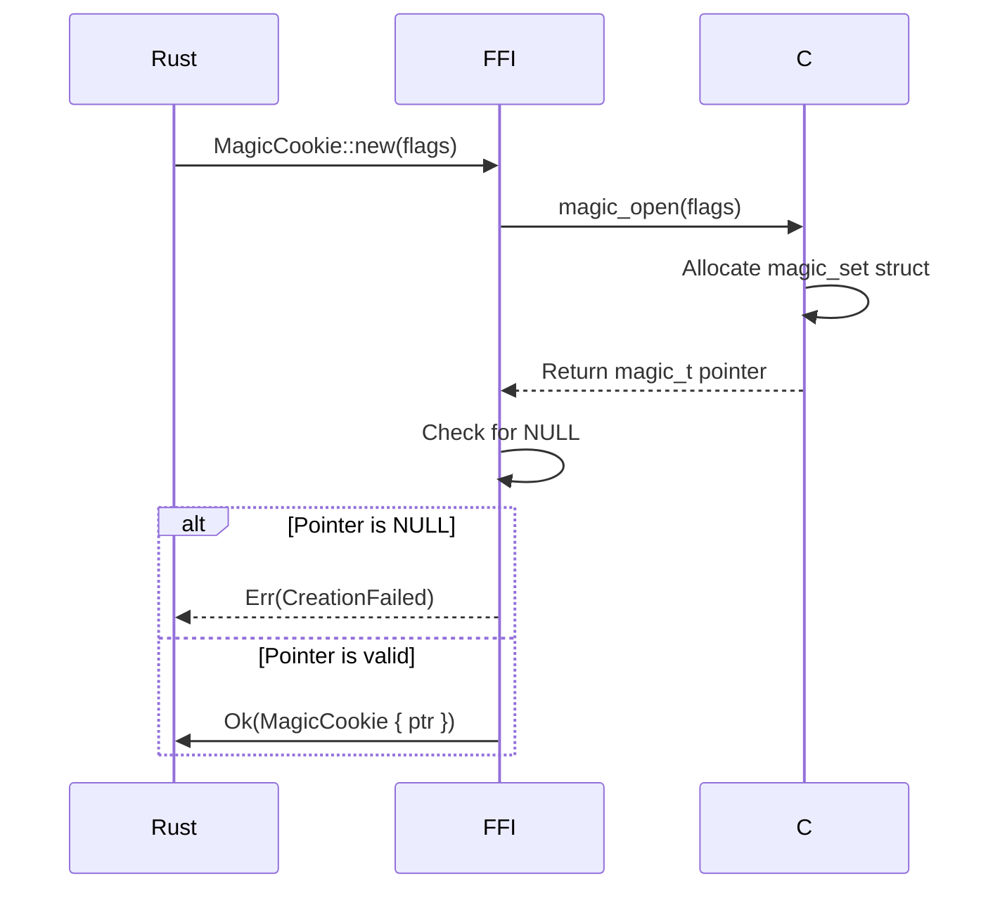
```mermaid
sequenceDiagram
    participant Rust
    participant FFI
    participant C
    
    Rust->>FFI: MagicCookie::new(flags)
    FFI->>C: magic_open(flags)
    C->>C: Allocate magic_set struct
    C-->>FFI: Return magic_t pointer
    FFI->>FFI: Check for NULL
    alt Pointer is NULL
        FFI-->>Rust: Err(CreationFailed)
    else Pointer is valid
        FFI->>Rust: Ok(MagicCookie { ptr })
    end
```

**Error Handling:**
- Check for NULL pointer
- Convert to Rust `Result` type
- No error string available (cookie not yet created)

### Destructor Pattern

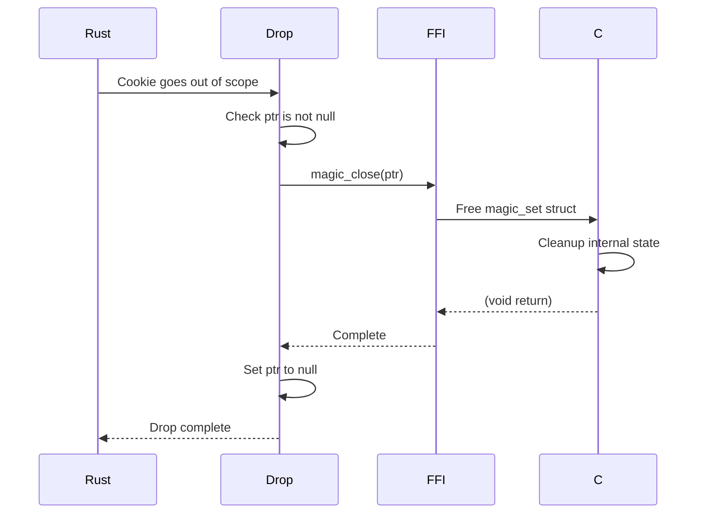
```mermaid
sequenceDiagram
    participant Rust
    participant Drop
    participant FFI
    participant C
    
    Rust->>Drop: Cookie goes out of scope
    Drop->>Drop: Check ptr is not null
    Drop->>FFI: magic_close(ptr)
    FFI->>C: Free magic_set struct
    C->>C: Cleanup internal state
    C-->>FFI: (void return)
    FFI-->>Drop: Complete
    Drop->>Drop: Set ptr to null
    Drop-->>Rust: Drop complete
```

**Safety Requirements:**
- Must not call `magic_close` on NULL
- Must not double-free
- Must run even during panic

### Method Wrappers

Each C function gets a safe Rust method wrapper.

**Pattern for Returning Strings:**

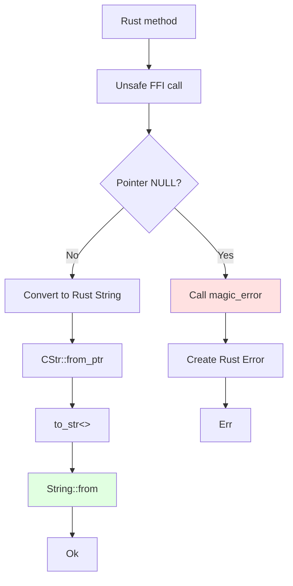
```mermaid
graph TB
    Method[Rust method] --> Call[Unsafe FFI call]
    Call --> Check{Pointer NULL?}
    Check -->|Yes| Error[Call magic_error]
    Check -->|No| Convert[Convert to Rust String]
    
    Error --> CreateErr[Create Rust Error]
    Convert --> CStr[CStr::from_ptr]
    CStr --> UTF8[to_str<>]
    UTF8 --> Clone[String::from]
    
    CreateErr --> Return1[Err]
    Clone --> Return2[Ok]
    
    style Error fill:#ffe1e1
    style Clone fill:#e1ffe1
```

**Safety Invariants:**

1. **Lifetime** - C string valid until next libmagic call
2. **Encoding** - Assume UTF-8 (documented libmagic behavior)
3. **Null Termination** - C strings are null-terminated
4. **Ownership** - Must copy string, C owns original

---

## Thread Safety Strategy

libmagic is not thread-safe - one cookie cannot be used concurrently.

### Problem

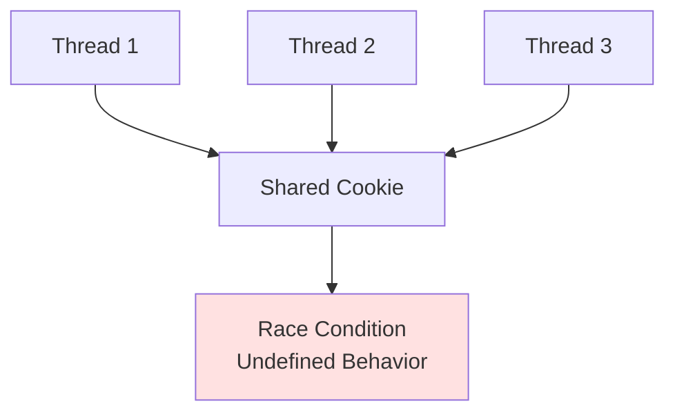
```mermaid
graph TB
    T1[Thread 1] --> Cookie[Shared Cookie]
    T2[Thread 2] --> Cookie
    T3[Thread 3] --> Cookie
    
    Cookie --> Crash[Race Condition<br/>Undefined Behavior]
    
    style Crash fill:#ffe1e1
```

### Solution 1: Mutex Wrapper

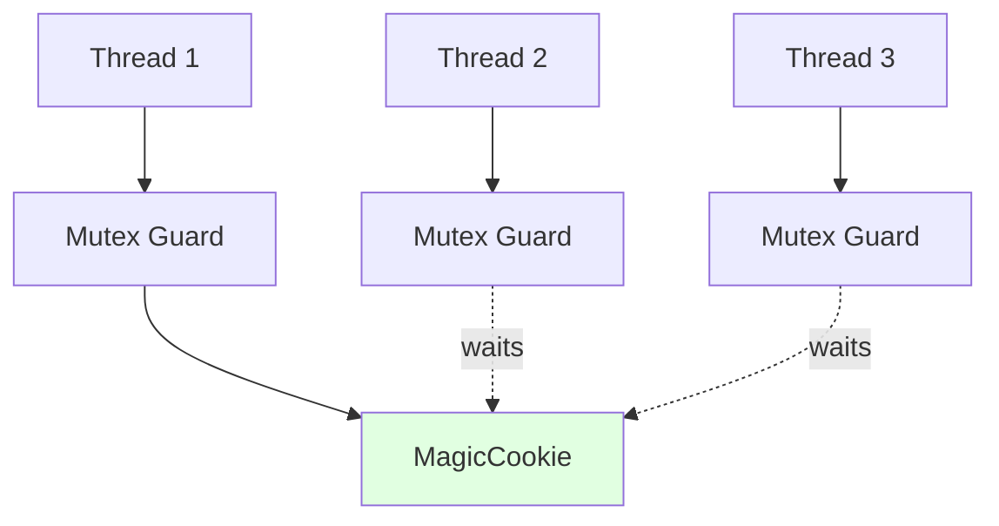
```mermaid
graph TB
    T1[Thread 1] --> M1[Mutex Guard]
    T2[Thread 2] --> M2[Mutex Guard]
    T3[Thread 3] --> M3[Mutex Guard]
    
    M1 --> Cookie[MagicCookie]
    M2 -.->|waits| Cookie
    M3 -.->|waits| Cookie
    
    style Cookie fill:#e1ffe1
```

**Implementation:**
- Wrap `MagicCookie` in `Arc<Mutex<MagicCookie>>`
- Each thread clones the Arc
- Mutex ensures exclusive access
- Only one thread uses libmagic at a time

**Trade-off:** Serializes all libmagic calls.

### Solution 2: Pool of Cookies

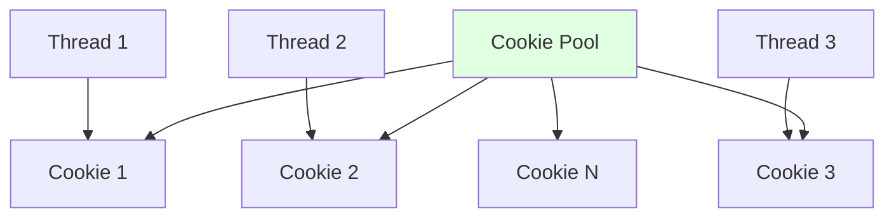
```mermaid
graph TB
    Pool[Cookie Pool] --> C1[Cookie 1]
    Pool --> C2[Cookie 2]
    Pool --> C3[Cookie 3]
    Pool --> C4[Cookie N]
    
    T1[Thread 1] --> C1
    T2[Thread 2] --> C2
    T3[Thread 3] --> C3
    
    style Pool fill:#e1ffe1
```

**Implementation:**
- Create N cookies (e.g., N = num_cpus)
- Store in `Arc<Mutex<Vec<MagicCookie>>>`
- Threads borrow/return cookies from pool
- True parallelism up to pool size

**Trade-off:** More memory, more initialization time.

### Recommended Approach

**For this project:** Single cookie with Mutex.

**Rationale:**
- Simpler implementation
- libmagic analysis is fast (10-100ms)
- Mutex contention acceptable given request rate
- Memory efficient (single database load)

---

## Async Integration with Tokio

libmagic blocks, but we need async API.

### The Problem


```mermaid
graph LR
    AsyncHandler[Async Handler] -->|await| Block[Blocking libmagic call]
    Block -->|blocks thread| Bad[Async runtime blocked!]
    
    style Bad fill:#ffe1e1
```

**Issue:** Blocking calls on async runtime threads cause:
- Runtime stalls
- Request timeouts
- Poor throughput

### The Solution

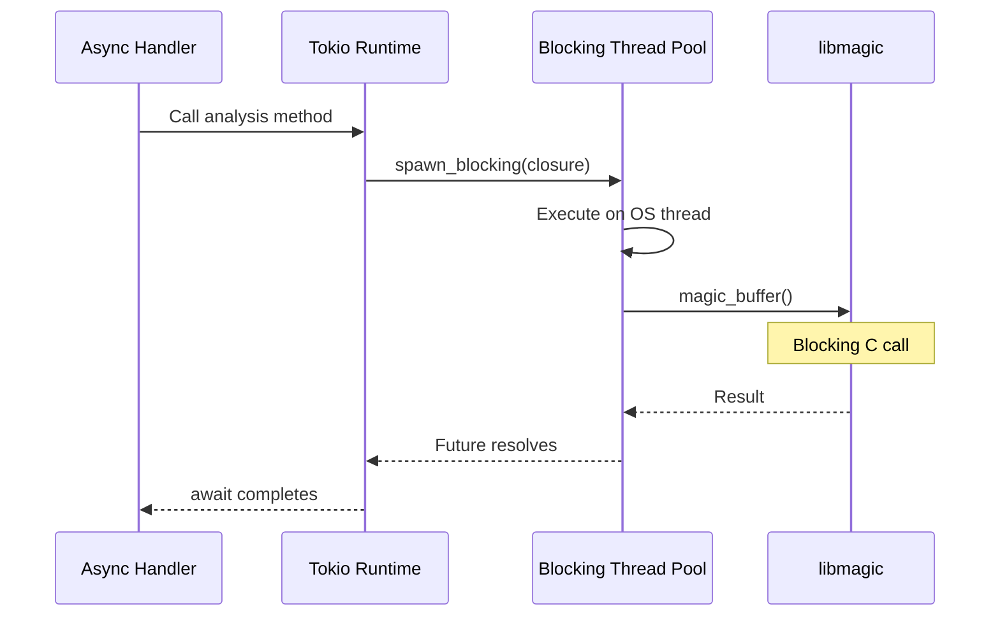
```mermaid
sequenceDiagram
    participant Handler as Async Handler
    participant Runtime as Tokio Runtime
    participant BlockPool as Blocking Thread Pool
    participant Libmagic as libmagic
    
    Handler->>Runtime: Call analysis method
    Runtime->>BlockPool: spawn_blocking(closure)
    BlockPool->>BlockPool: Execute on OS thread
    BlockPool->>Libmagic: magic_buffer()
    Note over Libmagic: Blocking C call
    Libmagic-->>BlockPool: Result
    BlockPool-->>Runtime: Future resolves
    Runtime-->>Handler: await completes
```

**Implementation Pattern:**

Wrap blocking call in `tokio::task::spawn_blocking`.

**Benefits:**
- Async runtime never blocks
- Automatic thread pool management
- Graceful backpressure
- Work-stealing efficiency preserved

---

## Error Handling Architecture

### C Error Model

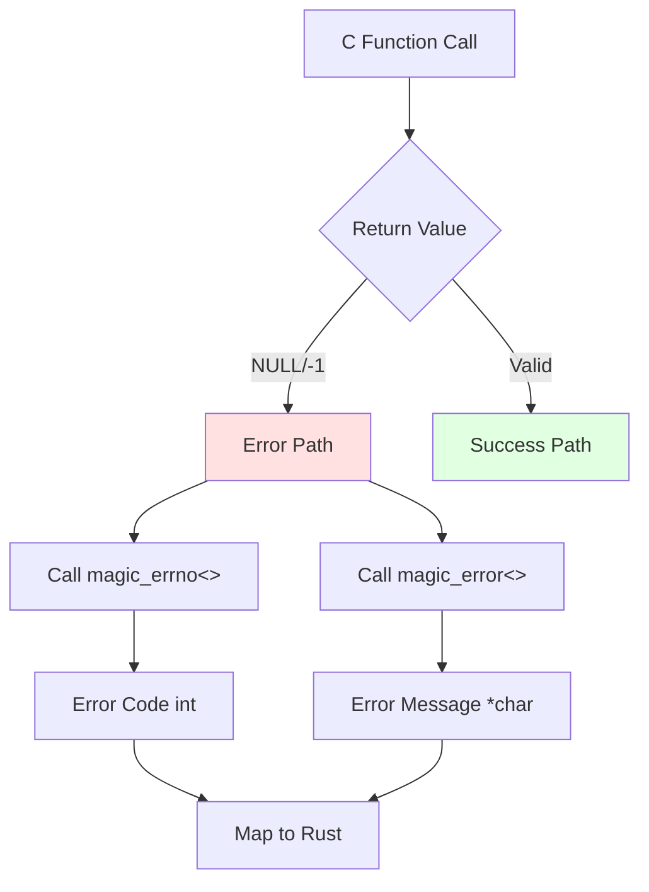
```mermaid
graph TB
    Call[C Function Call] --> Check{Return Value}
    
    Check -->|NULL/-1| Error[Error Path]
    Check -->|Valid| Success[Success Path]
    
    Error --> Errno[Call magic_errno<>]
    Error --> Msg[Call magic_error<>]
    
    Errno --> Code[Error Code int]
    Msg --> Str[Error Message *char]
    
    Code --> Rust[Map to Rust]
    Str --> Rust
    
    style Error fill:#ffe1e1
    style Success fill:#e1ffe1
```

### Rust Error Type

Custom error enum matching domain needs.

**Design:**

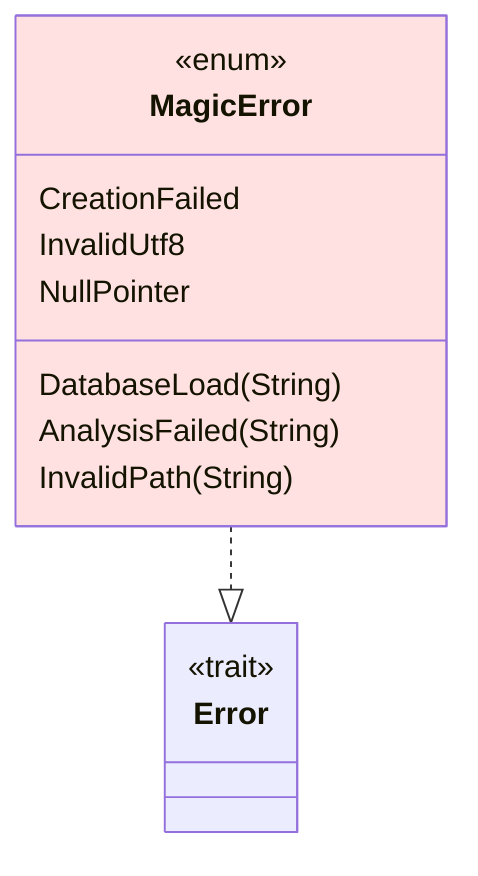
```mermaid
classDiagram
    class MagicError {
        <<enum>>
        CreationFailed
        DatabaseLoad(String)
        AnalysisFailed(String)
        InvalidPath(String)
        InvalidUtf8
        NullPointer
    }
    
    class Error {
        <<trait>>
    }
    
    MagicError ..|> Error
    
    style MagicError fill:#ffe1e1
```

**Variant Meanings:**

| Variant | When | C Source |
|---------|------|----------|
| `CreationFailed` | `magic_open` returns NULL | Initialization error |
| `DatabaseLoad` | `magic_load` returns -1 | File not found, corrupt DB |
| `AnalysisFailed` | `magic_file/buffer` returns NULL | Analysis error |
| `InvalidPath` | Path not UTF-8 or invalid | Path handling |
| `InvalidUtf8` | C string not valid UTF-8 | String conversion |
| `NullPointer` | Unexpected NULL | Defensive programming |

### Error Conversion Flow

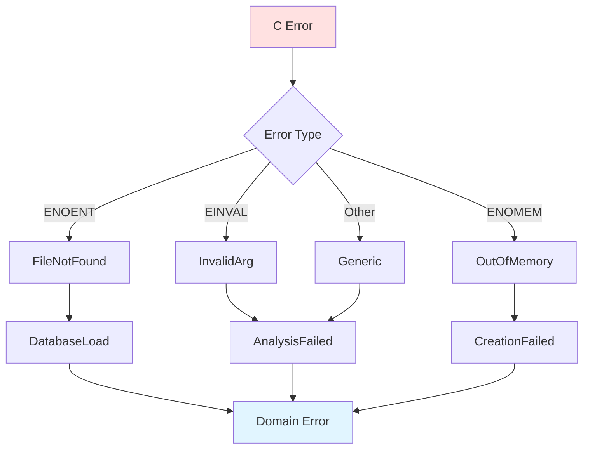
```mermaid
graph TB
    C[C Error] --> Check{Error Type}
    
    Check -->|ENOENT| FileNotFound
    Check -->|EINVAL| InvalidArg
    Check -->|ENOMEM| OutOfMemory
    Check -->|Other| Generic
    
    FileNotFound --> DB[DatabaseLoad]
    InvalidArg --> Analysis[AnalysisFailed]
    OutOfMemory --> Creation[CreationFailed]
    Generic --> Analysis
    
    DB --> Domain[Domain Error]
    Analysis --> Domain
    Creation --> Domain
    
    style C fill:#ffe1e1
    style Domain fill:#e1f5ff
```

**Error String Handling:**

1. Check return value (NULL/-1)
2. Call `magic_error()` to get C string
3. Convert C string to Rust `String` (copy)
4. Wrap in error variant
5. Return Rust `Result`

---

## Memory Safety Guarantees

### Ownership Rules

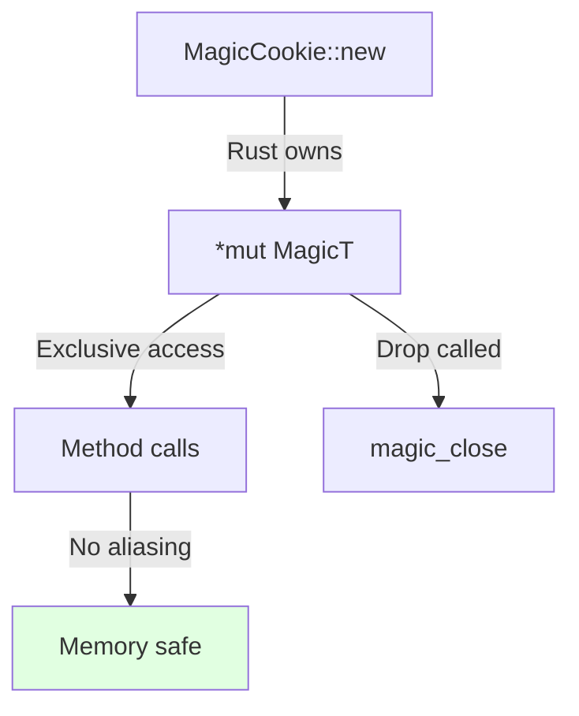
```mermaid
graph TB
    Create[MagicCookie::new] -->|Rust owns| Pointer[*mut MagicT]
    Pointer -->|Exclusive access| Methods[Method calls]
    Methods -->|No aliasing| Safe[Memory safe]
    Pointer -->|Drop called| Free[magic_close]
    
    style Safe fill:#e1ffe1
```

**Guarantees:**

1. **Single Owner** - Only one MagicCookie owns the pointer
2. **No Aliasing** - Raw pointer not exposed publicly
3. **RAII Cleanup** - Drop always runs (even during panic)
4. **Type Safety** - Opaque type prevents misuse

### String Lifetime Safety

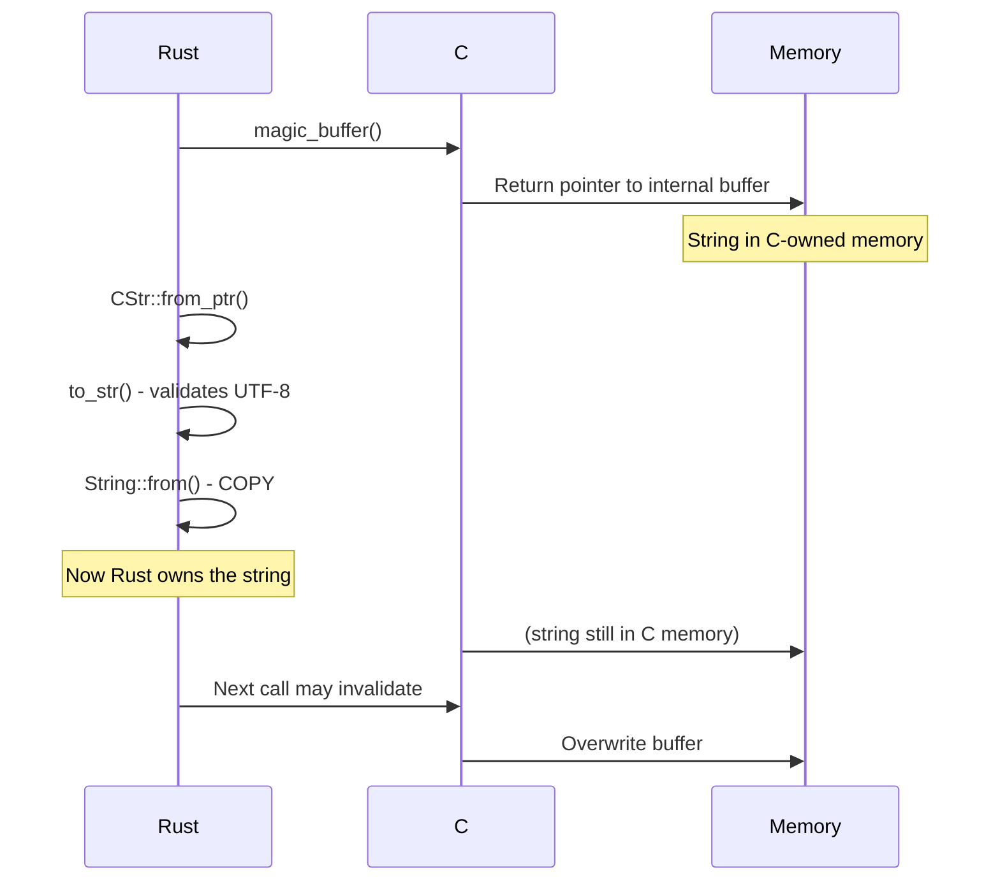
```mermaid
sequenceDiagram
    participant Rust
    participant C
    participant Memory
    
    Rust->>C: magic_buffer()
    C->>Memory: Return pointer to internal buffer
    Note over Memory: String in C-owned memory
    Rust->>Rust: CStr::from_ptr()
    Rust->>Rust: to_str() - validates UTF-8
    Rust->>Rust: String::from() - COPY
    Note over Rust: Now Rust owns the string
    C->>Memory: (string still in C memory)
    Rust->>C: Next call may invalidate
    C->>Memory: Overwrite buffer
```

**Safety Requirements:**

1. **Immediate Copy** - Copy C string before next call
2. **UTF-8 Validation** - Check encoding before using
3. **No Dangling** - Never store raw `*const c_char`
4. **Null Checking** - Always check for NULL

### Panic Safety

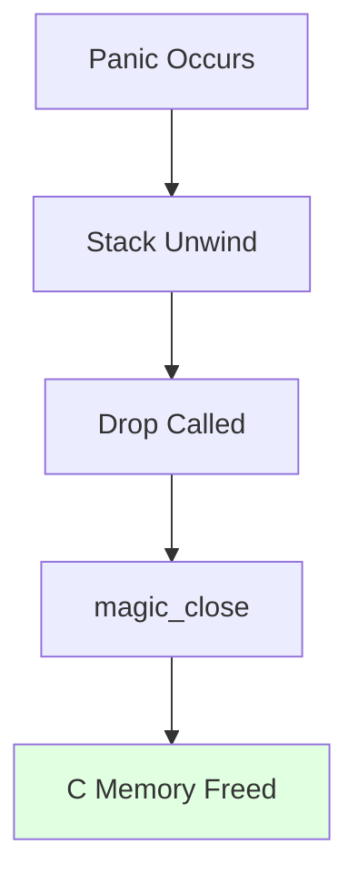
```mermaid
graph TB
    Panic[Panic Occurs] --> Unwind[Stack Unwind]
    Unwind --> Drop[Drop Called]
    Drop --> Close[magic_close]
    Close --> Free[C Memory Freed]
    
    style Free fill:#e1ffe1
```

**Guarantee:** Even if panic occurs, Drop runs and C resources are freed.

**Exception:** Panic during Drop itself (abort policy).

### Mmap Integration with libmagic FFI

Memory-mapped files provide zero-copy buffer access to libmagic through the FFI boundary.

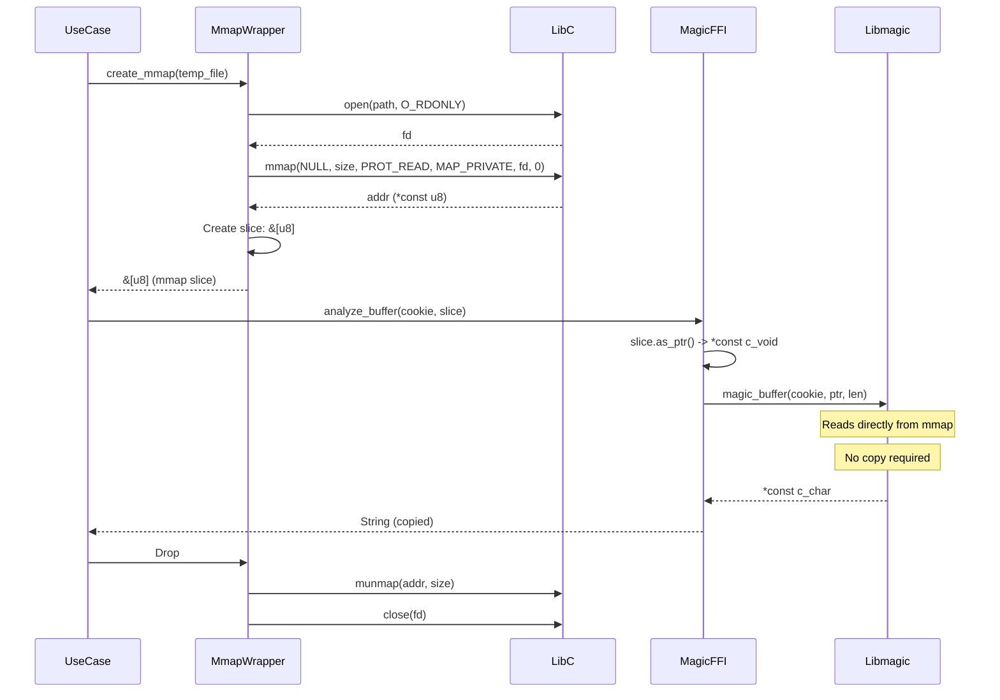
```mermaid
sequenceDiagram
    participant UseCase
    participant MmapWrapper
    participant LibC
    participant MagicFFI
    participant Libmagic
    
    UseCase->>MmapWrapper: create_mmap(temp_file)
    MmapWrapper->>LibC: open(path, O_RDONLY)
    LibC-->>MmapWrapper: fd
    MmapWrapper->>LibC: mmap(NULL, size, PROT_READ, MAP_PRIVATE, fd, 0)
    LibC-->>MmapWrapper: addr (*const u8)
    
    MmapWrapper->>MmapWrapper: Create slice: &[u8]
    MmapWrapper-->>UseCase: &[u8] (mmap slice)
    
    UseCase->>MagicFFI: analyze_buffer(cookie, slice)
    MagicFFI->>MagicFFI: slice.as_ptr() -> *const c_void
    MagicFFI->>Libmagic: magic_buffer(cookie, ptr, len)
    
    Note over Libmagic: Reads directly from mmap
    Note over Libmagic: No copy required
    
    Libmagic-->>MagicFFI: *const c_char
    MagicFFI-->>UseCase: String (copied)
    
    UseCase->>MmapWrapper: Drop
    MmapWrapper->>LibC: munmap(addr, size)
    MmapWrapper->>LibC: close(fd)
```

**FFI Interface for Mmap:**

```rust
// Raw FFI call accepts any *const c_void
extern "C" {
    fn magic_buffer(
        cookie: *const MagicT,
        buffer: *const c_void,  // Can point to mmap or heap memory
        length: size_t,
    ) -> *const c_char;
}

// Safe wrapper accepts &[u8] from any source
impl MagicCookie {
    pub fn analyze_buffer(&self, data: &[u8]) -> Result<String> {
        let ptr = data.as_ptr() as *const c_void;
        let len = data.len();
        
        unsafe {
            let result = magic_buffer(self.cookie, ptr, len);
            // Convert C string to owned String
            self.handle_result(result)
        }
    }
}
```

**Key Properties:**

| Property | Behavior | Benefit |
|----------|----------|---------|
| **Zero-Copy** | libmagic reads directly from mmap | No memory duplication |
| **Unified Interface** | Same function for mmap and heap | Simple API |
| **Pointer Lifetime** | Slice lifetime ensures mmap validity | Memory safe |
| **Page Faults** | OS loads pages on-demand | Memory efficient |

**Safety Guarantees:**

1. **Lifetime Safety:**
   ```rust
   fn analyze_mmap(path: &Path) -> Result<String> {
       let mmap = Mmap::open(path)?;       // Mmap created
       let slice: &[u8] = mmap.as_ref();   // Slice borrows mmap
       
       // Safe: slice lifetime ⊆ mmap lifetime
       let result = magic.analyze_buffer(slice)?;
       
       // Safe: mmap dropped after slice no longer used
       Ok(result)
   }
   ```

2. **Pointer Validity:**
   - Slice pointer guaranteed valid during call
   - Mmap wrapper holds file descriptor open
   - No unmapping while libmagic reads

3. **Read-Only Access:**
   - `PROT_READ` ensures libmagic cannot modify
   - `MAP_PRIVATE` isolates from other processes
   - No aliasing concerns

**Integration with Temp Files:**

```rust
pub struct TempFileAnalyzer {
    temp_file: TempFile,
    mmap: Option<Mmap>,
}

impl TempFileAnalyzer {
    pub fn analyze(&mut self, magic: &MagicCookie) -> Result<String> {
        // Create mmap
        let mmap = Mmap::open(self.temp_file.path())?;
        let data: &[u8] = mmap.as_ref();
        
        // Pass to libmagic via FFI
        let result = magic.analyze_buffer(data)?;
        
        // Mmap automatically unmapped on drop
        Ok(result)
    }
}
```

### File Descriptor Lifecycle in FFI Context

File descriptors have complex lifecycle interactions between Rust RAII and C library usage.

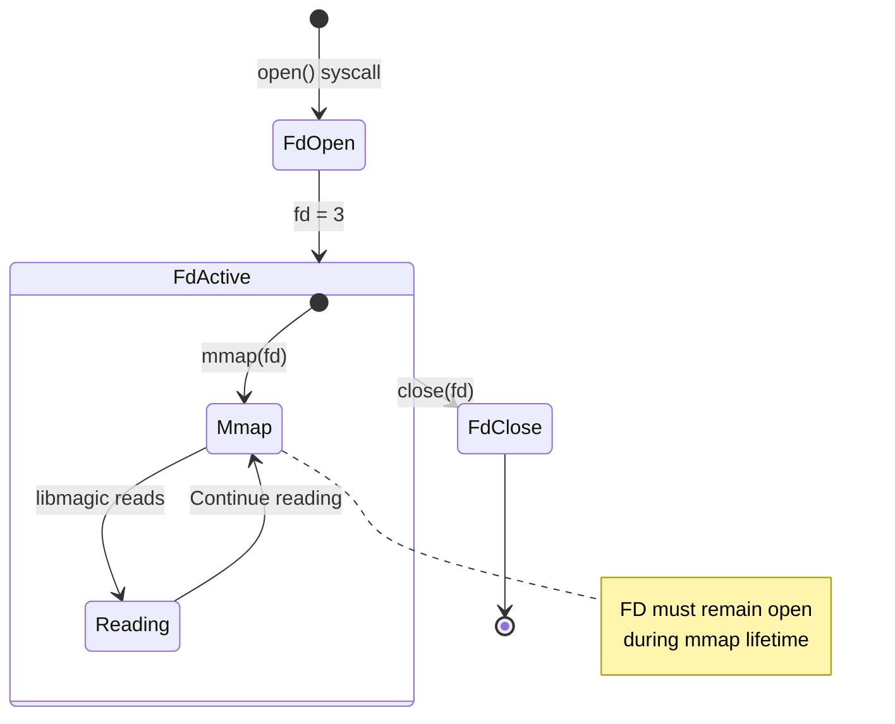
```mermaid
stateDiagram-v2
    [*] --> FdOpen: open() syscall
    FdOpen --> FdActive: fd = 3
    
    state FdActive {
        [*] --> Mmap: mmap(fd)
        Mmap --> Reading: libmagic reads
        Reading --> Mmap: Continue reading
    }
    
    FdActive --> FdClose: close(fd)
    FdClose --> [*]
    
    note right of Mmap
        FD must remain open
        during mmap lifetime
    end note
```

**FD Ownership Patterns:**

**1. Mmap Owns FD (Recommended):**

```rust
pub struct Mmap {
    addr: *const u8,
    len: usize,
    fd: RawFd,  // Owned
}

impl Mmap {
    pub fn open(path: &Path) -> Result<Self> {
        // Open file - FD ownership transferred
        let fd = unsafe {
            libc::open(
                path_cstr.as_ptr(),
                libc::O_RDONLY,
            )
        };
        
        if fd < 0 {
            return Err(io::Error::last_os_error().into());
        }
        
        // Get file size
        let len = get_file_size(fd)?;
        
        // Create mmap - requires FD
        let addr = unsafe {
            libc::mmap(
                std::ptr::null_mut(),
                len,
                libc::PROT_READ,
                libc::MAP_PRIVATE,
                fd,  // FD used here
                0,
            )
        };
        
        if addr == libc::MAP_FAILED {
            unsafe { libc::close(fd); }
            return Err(io::Error::last_os_error().into());
        }
        
        Ok(Mmap { addr: addr as *const u8, len, fd })
    }
}

impl Drop for Mmap {
    fn drop(&mut self) {
        unsafe {
            // Unmap first
            libc::munmap(self.addr as *mut c_void, self.len);
            // Then close FD
            libc::close(self.fd);
        }
    }
}
```

**FD Lifecycle Rules:**

| Phase | FD State | Mmap State | Libmagic Access |
|-------|----------|------------|-----------------|
| Before open | N/A | N/A | ❌ Cannot call |
| FD open, no mmap | Valid | N/A | ✅ Can use `magic_file()` |
| FD open, mmap active | Valid | Valid | ✅ Can use `magic_buffer()` on mmap |
| After munmap | Valid | Invalid | ❌ Cannot use mmap data |
| After close | Invalid | Invalid | ❌ Cannot access file |

**2. Critical Ordering:**

```rust
// CORRECT: Unmap before closing FD
impl Drop for Mmap {
    fn drop(&mut self) {
        unsafe {
            libc::munmap(self.addr as *mut _, self.len);  // 1. Unmap first
            libc::close(self.fd);                          // 2. Close FD
        }
    }
}

// INCORRECT: Closing FD before unmapping
impl Drop for Mmap {
    fn drop(&mut self) {
        unsafe {
            libc::close(self.fd);                          // ❌ Wrong order!
            libc::munmap(self.addr as *mut _, self.len);  // FD already closed
        }
    }
}
```

**3. FD Leakage Prevention:**

```rust
pub fn analyze_with_mmap_safe(path: &Path, magic: &MagicCookie) -> Result<String> {
    // RAII ensures FD cleanup even on error
    let mmap = Mmap::open(path)?;  // Opens FD
    
    // If this fails, Drop still runs
    let result = magic.analyze_buffer(mmap.as_ref())?;
    
    // Drop runs: munmap() then close(fd)
    Ok(result)
}
```

**FD Limit Considerations:**

```rust
// Each mmap temporarily holds 1 FD
// With 1000 concurrent requests:
// - 1000 sockets
// - ~500 temp files (large requests)
// - ~500 FDs for mmap (same as temp files)
// Total: ~2000 FDs

// FD limit must account for:
const REQUIRED_FDS: usize = 
    MAX_CONNECTIONS +           // TCP sockets
    (MAX_CONNECTIONS / 2) +     // Temp files (assume 50% large)
    SYSTEM_FDS;                 // stdout, stderr, logs, etc.
```

### Platform-Specific Mmap Considerations

Mmap behavior varies across platforms and filesystems.

**Linux-Specific:**

```rust
#[cfg(target_os = "linux")]
mod linux_mmap {
    use libc::{mmap, MAP_PRIVATE, PROT_READ, MAP_POPULATE};
    
    pub fn create_optimized_mmap(fd: RawFd, len: usize) -> *const u8 {
        unsafe {
            mmap(
                std::ptr::null_mut(),
                len,
                PROT_READ,
                MAP_PRIVATE | MAP_POPULATE,  // Linux-specific: pre-fault pages
                fd,
                0,
            ) as *const u8
        }
    }
}
```

**Platform Comparison:**

| Feature | Linux | macOS | Notes |
|---------|-------|-------|-------|
| **Max Mmap Size** | 128TB (64-bit) | 8TB | Architecture dependent |
| **Page Size** | 4KB typical | 4KB/16KB | Affects alignment |
| **`MAP_POPULATE`** | ✅ Supported | ❌ Not available | Linux pre-faulting |
| **`MAP_PREFAULT_READ`** | ❌ Not available | ✅ Supported | macOS equivalent |
| **Huge Pages** | ✅ `MAP_HUGETLB` | ❌ Limited | Linux 2MB/1GB pages |
| **File Size Limits** | ext4: 16TB | APFS: 8EB | Filesystem dependent |

**Filesystem-Specific Behavior:**

| Filesystem | Mmap Support | Performance | Notes |
|------------|-------------|-------------|-------|
| **ext4** | ✅ Full | Excellent | Native Linux support |
| **xfs** | ✅ Full | Excellent | Large file optimized |
| **tmpfs** | ✅ Full | Best (RAM) | In-memory filesystem |
| **NFS** | ⚠️ Limited | Poor | Network latency, cache issues |
| **FUSE** | ⚠️ Limited | Variable | Depends on implementation |
| **overlayfs** | ✅ Full | Good | Docker default |

**Conditional Compilation:**

```rust
#[cfg(target_os = "linux")]
pub fn mmap_flags() -> c_int {
    libc::MAP_PRIVATE | libc::MAP_POPULATE
}

#[cfg(target_os = "macos")]
pub fn mmap_flags() -> c_int {
    // MAP_POPULATE not available on macOS
    libc::MAP_PRIVATE
}

#[cfg(not(any(target_os = "linux", target_os = "macos")))]
compile_error!("Unsupported platform for mmap");
```

**Page Alignment Requirements:**

```rust
pub fn get_page_size() -> usize {
    unsafe {
        libc::sysconf(libc::_SC_PAGESIZE) as usize
    }
}

pub fn align_to_page(size: usize) -> usize {
    let page_size = get_page_size();
    (size + page_size - 1) & !(page_size - 1)
}

// Example usage
fn create_mmap(fd: RawFd, file_size: usize) -> Result<Mmap> {
    let page_size = get_page_size();
    
    // File size must be > 0
    if file_size == 0 {
        return Err(Error::InvalidFileSize);
    }
    
    // Mmap size is file size (no need to align for PROT_READ)
    let mmap_size = file_size;
    
    // ... mmap creation
}
```

**NFS and Network Storage Warnings:**

```rust
pub fn is_network_filesystem(path: &Path) -> Result<bool> {
    #[cfg(target_os = "linux")]
    {
        use std::ffi::CString;
        let path_cstr = CString::new(path.as_os_str().as_bytes())?;
        
        let mut stat: libc::statfs = unsafe { std::mem::zeroed() };
        let result = unsafe { libc::statfs(path_cstr.as_ptr(), &mut stat) };
        
        if result != 0 {
            return Err(io::Error::last_os_error().into());
        }
        
        // NFS magic number
        const NFS_SUPER_MAGIC: i64 = 0x6969;
        Ok(stat.f_type == NFS_SUPER_MAGIC)
    }
    
    #[cfg(not(target_os = "linux"))]
    {
        // Conservative: assume might be network
        Ok(false)
    }
}
```

### Signal Handling During FFI Calls (SIGBUS)

Mmap operations can trigger SIGBUS when the underlying file is modified or truncated.

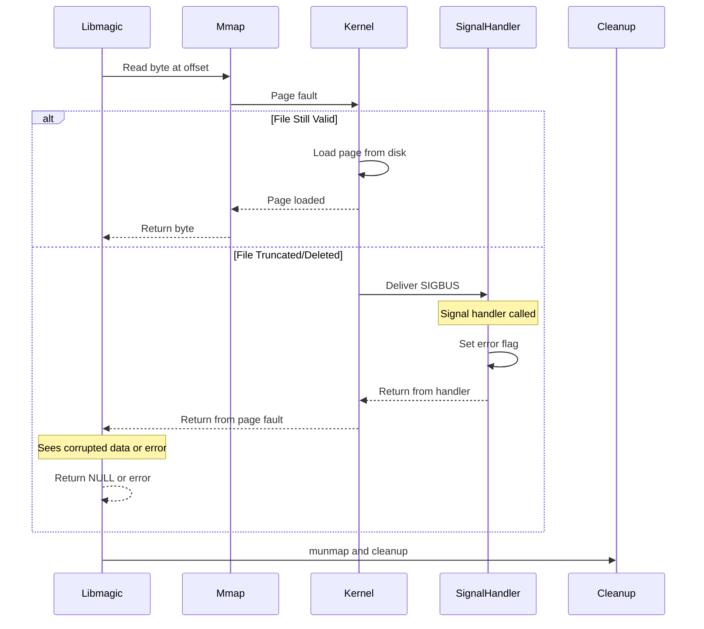
```mermaid
sequenceDiagram
    participant Libmagic
    participant Mmap
    participant Kernel
    participant SignalHandler
    participant Cleanup
    
    Libmagic->>Mmap: Read byte at offset
    Mmap->>Kernel: Page fault
    
    alt File Still Valid
        Kernel->>Kernel: Load page from disk
        Kernel-->>Mmap: Page loaded
        Mmap-->>Libmagic: Return byte
    else File Truncated/Deleted
        Kernel->>SignalHandler: Deliver SIGBUS
        Note over SignalHandler: Signal handler called
        SignalHandler->>SignalHandler: Set error flag
        SignalHandler-->>Kernel: Return from handler
        Kernel-->>Libmagic: Return from page fault
        Note over Libmagic: Sees corrupted data or error
        Libmagic-->>Libmagic: Return NULL or error
    end
    
    Libmagic->>Cleanup: munmap and cleanup
```

**SIGBUS Causes:**

| Scenario | Trigger | Signal Delivered | Impact |
|----------|---------|-----------------|---------|
| File truncated | File shortened while mapped | SIGBUS | Read beyond new EOF |
| File deleted | File removed while mapped | SIGBUS (sometimes) | Read attempts fail |
| Disk full | Write to MAP_SHARED | SIGBUS | N/A (we use MAP_PRIVATE + PROT_READ) |
| Hardware error | Bad disk sector | SIGBUS | Unrecoverable read error |
| Network error | NFS server down | SIGBUS | Remote file unavailable |

**Signal Handler Setup:**

```rust
use std::sync::atomic::{AtomicBool, Ordering};
use std::sync::Arc;

pub struct SigbusHandler {
    error_flag: Arc<AtomicBool>,
}

impl SigbusHandler {
    pub fn install() -> Result<Self> {
        let error_flag = Arc::new(AtomicBool::new(false));
        let flag_for_handler = error_flag.clone();
        
        unsafe {
            let mut sa: libc::sigaction = std::mem::zeroed();
            sa.sa_sigaction = Self::sigbus_handler as usize;
            sa.sa_flags = libc::SA_SIGINFO;
            
            let result = libc::sigaction(
                libc::SIGBUS,
                &sa,
                std::ptr::null_mut(),
            );
            
            if result != 0 {
                return Err(io::Error::last_os_error().into());
            }
        }
        
        // Store flag globally for signal handler access
        SIGBUS_FLAG.store(
            Arc::into_raw(flag_for_handler) as usize,
            Ordering::SeqCst,
        );
        
        Ok(SigbusHandler { error_flag })
    }
    
    extern "C" fn sigbus_handler(
        _sig: c_int,
        _info: *mut libc::siginfo_t,
        _ctx: *mut c_void,
    ) {
        // SAFETY: Minimal signal handler - just set flag
        let flag_ptr = SIGBUS_FLAG.load(Ordering::SeqCst) as *const AtomicBool;
        if !flag_ptr.is_null() {
            unsafe {
                (*flag_ptr).store(true, Ordering::SeqCst);
            }
        }
    }
    
    pub fn check_error(&self) -> Result<()> {
        if self.error_flag.load(Ordering::SeqCst) {
            Err(Error::SigbusReceived)
        } else {
            Ok(())
        }
    }
}

static SIGBUS_FLAG: AtomicUsize = AtomicUsize::new(0);
```

**Integration with Analysis:**

```rust
pub fn analyze_with_sigbus_protection(
    magic: &MagicCookie,
    mmap: &Mmap,
) -> Result<String> {
    // Install SIGBUS handler
    let handler = SigbusHandler::install()?;
    
    // Perform analysis (may trigger SIGBUS)
    let result = magic.analyze_buffer(mmap.as_ref());
    
    // Check if SIGBUS occurred
    handler.check_error()?;
    
    // Return result
    result
}
```

**Signal Handler Constraints:**

Signal handlers must be **async-signal-safe**. Allowed operations:

✅ **Safe:**
- Set atomic variables
- Simple integer arithmetic
- Check pointer for null

❌ **Unsafe:**
- Allocate memory (malloc, Box::new)
- Acquire mutexes
- Call most libc functions
- Perform I/O
- Format strings

**Error Recovery:**

```rust
impl MagicCookie {
    pub fn analyze_buffer_safe(&self, data: &[u8]) -> Result<String> {
        // Clear any previous SIGBUS
        SIGBUS_OCCURRED.store(false, Ordering::SeqCst);
        
        // Call libmagic (may trigger SIGBUS)
        let result_ptr = unsafe {
            magic_buffer(self.cookie, data.as_ptr() as *const c_void, data.len())
        };
        
        // Check for SIGBUS
        if SIGBUS_OCCURRED.load(Ordering::SeqCst) {
            return Err(Error::MmapModified(
                "File was modified during analysis (SIGBUS received)"
            ));
        }
        
        // Check for NULL result
        if result_ptr.is_null() {
            return self.get_error();
        }
        
        // Safe to convert C string
        unsafe {
            let c_str = CStr::from_ptr(result_ptr);
            Ok(c_str.to_str()?.to_owned())
        }
    }
}
```

**Testing SIGBUS Handling:**

```rust
#[test]
fn test_sigbus_handling() {
    // Create temp file
    let temp = NamedTempFile::new().unwrap();
    temp.write_all(&vec![0u8; 1024]).unwrap();
    
    // Create mmap
    let mmap = Mmap::open(temp.path()).unwrap();
    
    // Truncate file while mapped (triggers SIGBUS on next read)
    temp.as_file().set_len(0).unwrap();
    
    // Try to analyze (should handle SIGBUS gracefully)
    let result = magic.analyze_buffer(mmap.as_ref());
    
    // Should return error, not crash
    assert!(result.is_err());
    assert!(result.unwrap_err().to_string().contains("SIGBUS") ||
            result.unwrap_err().to_string().contains("modified"));
}
```

**Alternative: Avoid SIGBUS with MAP_PRIVATE:**

Our use of `MAP_PRIVATE` with `PROT_READ` significantly reduces SIGBUS risk:

- **MAP_PRIVATE:** Copy-on-write isolates us from modifications
- **PROT_READ:** We never write, so no write-related SIGBUS
- **File deletion:** File data remains accessible via inode until unmapped

However, SIGBUS still possible for:
- File truncation beyond mapped region
- Hardware errors
- Network filesystem issues

**Therefore:** Signal handler still recommended for production robustness.

---

## Configuration Design

### Flags as Type-Safe Bitflags

```mermaid
classDiagram
    class MagicFlags {
        <<bitflags>>
        NONE
        MIME_TYPE
        MIME_ENCODING
        MIME
        ERROR
        SYMLINK
        COMPRESS
        NO_CHECK_COMPRESS
    }
    
    style MagicFlags fill:#e1f5ff
```

**Design:** Use `bitflags!` macro or manual bitflag impl.

**Benefits:**
- Type-safe flag combinations
- Compile-time validation
- Named constants
- Bitwise operations

### Database Path Options

```mermaid
graph TB
    Config{Database Config} --> Default[None/Default]
    Config --> Custom[Some path]
    
    Default --> System[Use system default<br/>/usr/share/misc/magic.mgc]
    Custom --> Load[Load specified file]
    
    Load --> Check{File exists?}
    Check -->|No| Error[DatabaseLoad error]
    Check -->|Yes| Success[Load database]
    
    style Success fill:#e1ffe1
    style Error fill:#ffe1e1
```

**API Design:**

- `load_database(None)` - Use default
- `load_database(Some(path))` - Custom path
- Validate path before calling C function

---

## Testing Strategy

### Unit Tests (Wrapper Layer)

Test safe wrapper without full C integration.

**Test Targets:**
- Error conversion functions
- String handling helpers
- Flag bitwise operations
- PhantomData marker properties

### Integration Tests (Full FFI)

Test with real libmagic library.

**Test Cases:**

| Test | Input | Expected |
|------|-------|----------|
| Text file | `"Hello"` | Contains "text" |
| PNG header | PNG magic bytes | "image/png" |
| Empty buffer | `[]` | No panic, some result |
| Invalid UTF-8 | Non-UTF-8 bytes | Handled gracefully |
| NULL scenarios | Edge cases | Proper error handling |

### Miri Testing

Use Rust's Miri to detect undefined behavior.

**Checks:**
- Use-after-free
- Double-free
- Uninitialized memory
- Invalid pointer dereference

**Command:** `cargo +nightly miri test`

### Valgrind Testing

Use Valgrind to check C-level memory issues.

**Checks:**
- Memory leaks
- Invalid reads/writes
- Uninitialized values

**Command:** `valgrind --leak-check=full ./target/debug/test_binary`

---

## Build System Integration

### Link Directive

Tell Rust linker to link against libmagic.

### Build Script (Optional)

**Location:** `build.rs`

**Purpose:**
- Find libmagic via pkg-config
- Set link search paths
- Verify library exists
- Generate bindings (if using bindgen)

**For Manual FFI:** Minimal build script, just link directive.

---

## Security Considerations

### Input Validation

```mermaid
graph TB
    Input[User Input] --> Size{Size Check}
    Size -->|> 100MB| Reject1[Reject]
    Size -->|OK| Null{Null Bytes?}
    Null -->|Yes| Reject2[Reject]
    Null -->|No| Timeout{Timeout?}
    Timeout -->|> 30s| Reject3[Cancel]
    Timeout -->|OK| Process[Process with libmagic]
    
    style Reject1 fill:#ffe1e1
    style Reject2 fill:#ffe1e1
    style Reject3 fill:#ffe1e1
    style Process fill:#e1ffe1
```

**Checks Before FFI:**
1. Size limit (prevent resource exhaustion)
2. Timeout enforcement (prevent infinite loops)
3. Path validation (prevent directory traversal)

### Attack Vectors

| Attack | Mitigation |
|--------|-----------|
| Buffer overflow in libmagic | Use latest libmagic version |
| Malformed file causes crash | Timeout + error handling |
| Resource exhaustion | Size limits + connection limits |
| Directory traversal | Path sandbox validation |
| Use-after-free | Rust ownership prevents |

### Memory-Mapped I/O Security

When analyzing large files via memory-mapped I/O, strict security requirements prevent memory corruption and unauthorized access.

```mermaid
graph TB
    TempFile[Temporary File] --> Create[Create with 0600]
    Create --> FD[Open File Descriptor]
    FD --> Mmap[mmap System Call]
    
    Mmap --> Flags{Validate Flags}
    
    Flags --> F1[PROT_READ]
    Flags --> F2[MAP_PRIVATE]
    Flags --> F3[No PROT_WRITE]
    Flags --> F4[No PROT_EXEC]
    
    F1 --> Check{All Correct?}
    F2 --> Check
    F3 --> Check
    F4 --> Check
    
    Check -->|Yes| Pass[Pass to libmagic]
    Check -->|No| Panic[Security Violation]
    
    Pass --> Analyze[Analyze Buffer]
    Analyze --> Unmap[munmap]
    Unmap --> Delete[Delete Temp File]
    
    style F1 fill:#e1ffe1
    style F2 fill:#e1ffe1
    style F3 fill:#e1ffe1
    style F4 fill:#e1ffe1
    style Panic fill:#ffe1e1
```

**Required mmap Flags:**

| Flag | Value | Security Purpose |
|------|-------|------------------|
| `PROT_READ` | Read permission | Only flag allowed - prevents writes |
| `MAP_PRIVATE` | Private mapping | Copy-on-write isolation from other processes |
| No `PROT_WRITE` | Write denied | Prevents file corruption and tampering |
| No `PROT_EXEC` | Execute denied | Prevents code injection attacks |

**Security Requirements:**

1. **Read-Only Mapping**
   ```rust
   // REQUIRED: Only PROT_READ permission
   let prot = libc::PROT_READ;
   // FORBIDDEN: Never include PROT_WRITE or PROT_EXEC
   ```
   - Write attempts trigger SIGSEGV
   - Prevents modification of temporary file during analysis
   - Hardware-enforced memory protection

2. **Private Copy-on-Write**
   ```rust
   // REQUIRED: MAP_PRIVATE for isolation
   let flags = libc::MAP_PRIVATE;
   // FORBIDDEN: Never use MAP_SHARED
   ```
   - Process-local mapping
   - Changes not visible to other processes
   - Protects against shared memory attacks

3. **No Execute Permission**
   ```rust
   // REQUIRED: Exclude PROT_EXEC
   let prot = libc::PROT_READ; // Never OR with PROT_EXEC
   ```
   - Memory cannot contain executable code
   - Prevents ROP (Return-Oriented Programming) exploits
   - Defense against code injection

4. **SIGBUS Signal Handling**
   - Raised when mapped file is modified concurrently
   - Raised when mapped file is truncated
   - Raised when accessing beyond file size
   - Must gracefully handle and clean up

**FFI Integration Pattern:**

```mermaid
sequenceDiagram
    participant UseCase
    participant MmapWrapper
    participant LibC
    participant Libmagic
    participant SignalHandler
    
    UseCase->>MmapWrapper: create(file, size)
    MmapWrapper->>LibC: open(path, O_RDONLY)
    LibC-->>MmapWrapper: fd
    
    MmapWrapper->>LibC: mmap(NULL, size, PROT_READ, MAP_PRIVATE, fd, 0)
    LibC-->>MmapWrapper: addr
    
    MmapWrapper->>MmapWrapper: Validate flags at compile time
    MmapWrapper-->>UseCase: Ok(&[u8])
    
    UseCase->>Libmagic: magic_buffer(cookie, slice.as_ptr(), slice.len())
    
    alt File Modified During Analysis
        Libmagic->>LibC: Read mapped memory
        LibC->>SignalHandler: SIGBUS signal
        SignalHandler->>MmapWrapper: Set error flag
        SignalHandler-->>Libmagic: Return from signal
        Libmagic-->>UseCase: NULL (error)
        UseCase->>MmapWrapper: Drop (munmap)
    else Normal Operation
        Libmagic-->>UseCase: Result string
        UseCase->>MmapWrapper: Drop (munmap)
    end
    
    MmapWrapper->>LibC: munmap(addr, size)
    MmapWrapper->>LibC: close(fd)
```

**Implementation Requirements:**

```rust
// Compile-time flag validation
const MMAP_PROT: c_int = libc::PROT_READ;
const MMAP_FLAGS: c_int = libc::MAP_PRIVATE;

// Ensure no write or execute permissions
const _: () = assert!(MMAP_PROT & libc::PROT_WRITE == 0);
const _: () = assert!(MMAP_PROT & libc::PROT_EXEC == 0);
```

**Threat Model:**

| Threat | Attack Vector | Mitigation |
|--------|--------------|------------|
| Memory Corruption | Write to mapped region | PROT_READ prevents writes (SIGSEGV) |
| Code Injection | Execute from mapped memory | No PROT_EXEC prevents execution |
| Shared Memory Attack | MAP_SHARED allows IPC | MAP_PRIVATE isolates process |
| Timing Attacks | Page fault side-channels | Read-only mapping reduces leakage |
| Concurrent Modification | File changed during analysis | SIGBUS handler + MAP_PRIVATE |
| Privilege Escalation | Exploit via mmap flags | Compile-time validation |

**Testing Requirements:**

1. **Flag Validation Tests**
   - Verify compile-time assertions catch invalid flags
   - Runtime check for flag correctness
   - Negative tests attempting PROT_WRITE

2. **SIGBUS Handler Tests**
   - Simulate file modification during mmap
   - Verify graceful error handling
   - Check cleanup occurs correctly

3. **Security Tests**
   - Attempt write to mapped memory (expect SIGSEGV)
   - Attempt execute from mapped memory (expect SIGSEGV/SIGILL)
   - Verify MAP_PRIVATE isolation

4. **Integration with libmagic**
   - Test large file analysis via mmap
   - Verify buffer pointer lifetime safety
   - Check error propagation from libmagic

**Platform-Specific Notes:**

- **Linux:** Full support for all flags
- **Page Size:** Use `sysconf(_SC_PAGESIZE)` for alignment
- **File Size:** Handle files larger than address space
- **Kernel Version:** Requires Linux 2.6+ for full mmap support

**File Permissions:**

Temporary files must have restrictive permissions:

```rust
// Create file with owner-only access (0600)
let file = OpenOptions::new()
    .create(true)
    .write(true)
    .mode(0o600)  // rw-------
    .open(path)?;
```

Prevents unauthorized access to temporary file contents during analysis window.

**Cleanup on Error:**

```mermaid
stateDiagram-v2
    [*] --> MmapCreate: Create mapping
    MmapCreate --> Analysis: Success
    Analysis --> Cleanup: Complete
    Cleanup --> [*]: Delete file
    
    MmapCreate --> ErrorCleanup: mmap fails
    Analysis --> ErrorCleanup: SIGBUS or error
    ErrorCleanup --> Munmap: Unmap if mapped
    Munmap --> Delete: Delete temp file
    Delete --> [*]: Return error
```

All error paths must ensure:
1. Memory is unmapped if mmap succeeded
2. File descriptor is closed
3. Temporary file is deleted
4. No resource leaks

**Performance Impact:**

- mmap overhead: ~1-10μs (much less than analysis time)
- No memory copy required (zero-copy from kernel)
- Page faults on first access (demand paging)
- Kernel page cache benefits (repeated access)

**Safe Wrapper Type:**

```rust
pub struct MmapBuffer {
    addr: *const u8,
    len: usize,
    fd: RawFd,
    _phantom: PhantomData<*const u8>, // !Send + !Sync
}

impl Drop for MmapBuffer {
    fn drop(&mut self) {
        unsafe {
            libc::munmap(self.addr as *mut _, self.len);
            libc::close(self.fd);
        }
    }
}

impl AsRef<[u8]> for MmapBuffer {
    fn as_ref(&self) -> &[u8] {
        unsafe { std::slice::from_raw_parts(self.addr, self.len) }
    }
}
```

**Signal Handler Setup:**

```rust
// Install SIGBUS handler for mmap errors
unsafe fn install_sigbus_handler() {
    let mut sa: libc::sigaction = std::mem::zeroed();
    sa.sa_sigaction = sigbus_handler as usize;
    sa.sa_flags = libc::SA_SIGINFO;
    libc::sigaction(libc::SIGBUS, &sa, std::ptr::null_mut());
}

extern "C" fn sigbus_handler(
    _sig: c_int,
    _info: *mut libc::siginfo_t,
    _ctx: *mut c_void,
) {
    // Mark error state and return
    // Cleanup handled by Drop trait
}
```

---

## Performance Optimization

### Bottleneck Analysis

```mermaid
graph LR
    Request[Request] --> Parse[HTTP Parse<br/>~1ms]
    Parse --> FFI[FFI Call<br/>~0.1ms]
    FFI --> Analysis[libmagic Analysis<br/>10-100ms]
    Analysis --> Convert[String Convert<br/>~0.1ms]
    Convert --> Response[Format Response<br/>~1ms]
    
    style Analysis fill:#ffe1e1
```

**Main Bottleneck:** libmagic analysis itself, not FFI overhead.

### Optimization Strategies

1. **Database Caching** - libmagic caches compiled database
2. **Parallel Processing** - Multiple cookies for parallelism
3. **Timeout Enforcement** - Prevent runaway analysis
4. **Streaming** - Don't buffer entire file if possible

---

## Related Documentation

- [Architecture Design](ARCHITECTURE.md) - Infrastructure layer structure
- [Project Structure](../reference/PROJECT_STRUCTURE.md) - Code organization
- [Testing Strategy](../reference/TESTING_STRATEGY.md) - Testing approach

---

## References

- [Rust FFI Documentation](https://doc.rust-lang.org/nomicon/ffi.html)
- [libmagic Man Page](https://man7.org/linux/man-pages/man3/libmagic.3.html)
- [Tokio Blocking Documentation](https://tokio.rs/tokio/topics/bridging)
- [The Rustonomicon - FFI](https://doc.rust-lang.org/nomicon/ffi.html)
