# libmagic FFI Integration from Scratch <!-- omit in toc -->

Designing and implementing safe Rust bindings to the libmagic C library using raw FFI without external crates.

- [Overview](#overview)
- [Why Build FFI from Scratch?](#why-build-ffi-from-scratch)
- [libmagic C API](#libmagic-c-api)
  - [Core C Functions](#core-c-functions)
  - [C Flag Constants](#c-flag-constants)
  - [C Error Handling Pattern](#c-error-handling-pattern)
- [FFI Architecture](#ffi-architecture)
  - [Module Structure](#module-structure)
- [Raw FFI Module Design](#raw-ffi-module-design)
  - [Opaque Pointer Type](#opaque-pointer-type)
  - [FFI Type Mapping](#ffi-type-mapping)
  - [Linkage Declaration](#linkage-declaration)
- [Safe Wrapper Design](#safe-wrapper-design)
  - [Ownership Model](#ownership-model)
  - [MagicCookie Structure](#magiccookie-structure)
  - [Constructor Pattern](#constructor-pattern)
  - [Destructor Pattern](#destructor-pattern)
  - [Method Wrappers](#method-wrappers)
- [Thread Safety Strategy](#thread-safety-strategy)
  - [Problem](#problem)
  - [Solution 1: Mutex Wrapper](#solution-1-mutex-wrapper)
  - [Solution 2: Pool of Cookies](#solution-2-pool-of-cookies)
  - [Recommended Approach](#recommended-approach)
- [Async Integration with Tokio](#async-integration-with-tokio)
  - [The Problem](#the-problem)
  - [The Solution](#the-solution)
- [Error Handling Architecture](#error-handling-architecture)
  - [C Error Model](#c-error-model)
  - [Rust Error Type](#rust-error-type)
  - [Error Conversion Flow](#error-conversion-flow)
- [Memory Safety Guarantees](#memory-safety-guarantees)
  - [Ownership Rules](#ownership-rules)
  - [String Lifetime Safety](#string-lifetime-safety)
  - [Panic Safety](#panic-safety)
  - [Mmap Integration with libmagic FFI](#mmap-integration-with-libmagic-ffi)
  - [File Descriptor Lifecycle in FFI Context](#file-descriptor-lifecycle-in-ffi-context)
  - [Signal Handling During FFI Calls (SIGBUS)](#signal-handling-during-ffi-calls-sigbus)
- [Configuration Design](#configuration-design)
  - [Flags as Type-Safe Bitflags](#flags-as-type-safe-bitflags)
  - [Database Path Options](#database-path-options)
- [Testing Strategy](#testing-strategy)
  - [Unit Tests (Wrapper Layer)](#unit-tests-wrapper-layer)
  - [Integration Tests (Full FFI)](#integration-tests-full-ffi)
  - [Miri Testing](#miri-testing)
  - [Valgrind Testing](#valgrind-testing)
- [Build System Integration](#build-system-integration)
  - [Link Directive](#link-directive)
  - [Build Script (Optional)](#build-script-optional)
- [Security Considerations](#security-considerations)
  - [Input Validation](#input-validation)
  - [Attack Vectors](#attack-vectors)
  - [Memory-Mapped I/O Security](#memory-mapped-io-security)
  - [Optimization Strategies](#optimization-strategies)
- [Related Documentation](#related-documentation)
- [References](#references)


## Overview

This document explains how to build libmagic bindings from scratch using Rust's FFI capabilities, covering raw C function declarations, memory safety, thread safety, error handling, and safe wrapper design.

**Design Goal:** Create safe, idiomatic Rust API over libmagic C library without using third-party binding crates.

---

## Why Build FFI from Scratch?

**Reason:** Learning exercise to understand Rust FFI in depth.

This project builds libmagic bindings from scratch as an educational exercise ("etude") to learn:
- How Rust FFI works at the lowest level
- Memory safety boundaries between Rust and C
- Ownership and lifetime management across FFI
- Error handling patterns for C libraries
- Thread safety considerations with external code

**Note:** In production, using an existing well-maintained crate like `magic` would be more appropriate.

---

## libmagic C API

Understanding the C API structure before designing bindings.

### Core C Functions

The libmagic C API provides functions for initialization, configuration, analysis, error handling, and cleanup.

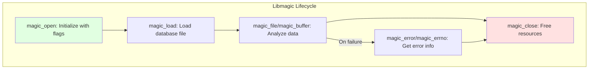
```mermaid
graph TB
    subgraph Lifecycle["Libmagic Lifecycle"]
        Open[magic_open: Initialize with flags]
        Load[magic_load: Load database file]
        Analyze[magic_file/magic_buffer: Analyze data]
        Error[magic_error/magic_errno: Get error info]
        Close[magic_close: Free resources]
    end
    
    Open --> Load
    Load --> Analyze
    Analyze -->|On failure| Error
    Analyze --> Close
    Error --> Close
    
    style Open fill:#e1ffe1
    style Close fill:#ffe1e1
```

**API Functions:**

| Function | Purpose | Return Value |
|----------|---------|--------------|
| `magic_open(flags)` | Initialize library with configuration flags | Opaque handle (magic_t) or NULL on error |
| `magic_load(cookie, filename)` | Load magic database from file path | 0 on success, -1 on error |
| `magic_file(cookie, filename)` | Analyze file at given path | C string with result or NULL on error |
| `magic_buffer(cookie, buffer, length)` | Analyze data in memory buffer | C string with result or NULL on error |
| `magic_error(cookie)` | Get last error message | C string describing error |
| `magic_errno(cookie)` | Get last error code | errno value |
| `magic_close(cookie)` | Free all resources | void (no return) |
| `magic_setflags(cookie, flags)` | Change flags after initialization | 0 on success, -1 on error |

### C Flag Constants

The libmagic library uses bitwise flags to configure its behavior. These flags control output format, symlink handling, compression detection, and error verbosity.

**Flag Categories:**

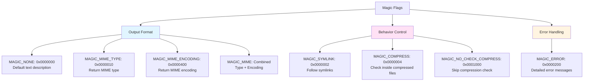
```mermaid
graph TB
    Flags[Magic Flags] --> Output[Output Format]
    Flags --> Behavior[Behavior Control]
    Flags --> Error[Error Handling]
    
    Output --> NONE[MAGIC_NONE: 0x0000000<br/>Default text description]
    Output --> MIME_TYPE[MAGIC_MIME_TYPE: 0x0000010<br/>Return MIME type]
    Output --> MIME_ENC[MAGIC_MIME_ENCODING: 0x0000400<br/>Return MIME encoding]
    Output --> MIME[MAGIC_MIME: Combined<br/>Type + Encoding]
    
    Behavior --> SYMLINK[MAGIC_SYMLINK: 0x0000002<br/>Follow symlinks]
    Behavior --> COMPRESS[MAGIC_COMPRESS: 0x0000004<br/>Check inside compressed files]
    Behavior --> NO_COMPRESS[MAGIC_NO_CHECK_COMPRESS: 0x0001000<br/>Skip compression check]
    
    Error --> ERROR_FLAG[MAGIC_ERROR: 0x0000200<br/>Detailed error messages]
    
    style Output fill:#e1f5ff
    style Behavior fill:#ffe1f5
    style Error fill:#fff4e1
```

**Common Flag Values:**

| Flag | Hex Value | Purpose | Use Case |
|------|-----------|---------|----------|
| MAGIC_NONE | 0x0000000 | Default text description | Human-readable output |
| MAGIC_MIME_TYPE | 0x0000010 | Return MIME type only | API responses (e.g., "image/png") |
| MAGIC_MIME_ENCODING | 0x0000400 | Return MIME encoding | Character encoding detection |
| MAGIC_MIME | 0x0000410 | Type + Encoding combined | Full MIME classification |
| MAGIC_ERROR | 0x0000200 | Detailed error messages | Debugging and logging |
| MAGIC_SYMLINK | 0x0000002 | Follow symbolic links | Analyze link targets |
| MAGIC_COMPRESS | 0x0000004 | Analyze compressed files | Extract and analyze archives |
| MAGIC_NO_CHECK_COMPRESS | 0x0001000 | Skip compression check | Performance optimization |

### C Error Handling Pattern

Libmagic uses a return-value-based error reporting mechanism where failures are indicated by NULL or -1 returns, with detailed error information available through separate function calls.

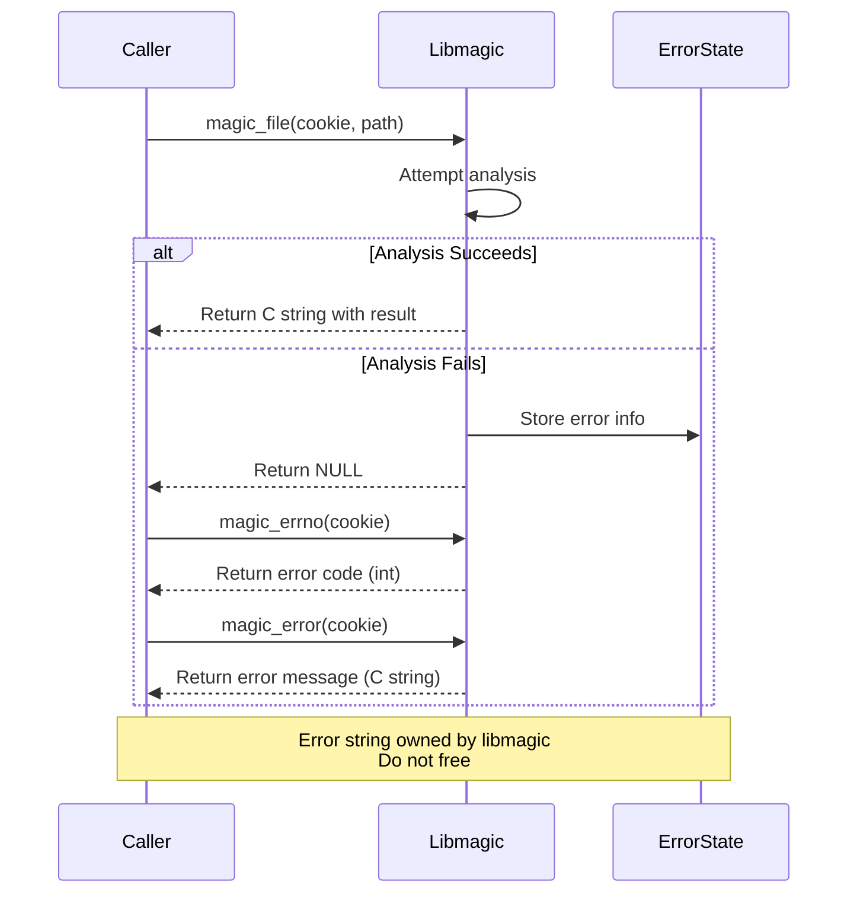
```mermaid
sequenceDiagram
    participant Caller
    participant Libmagic
    participant ErrorState
    
    Caller->>Libmagic: magic_file(cookie, path)
    Libmagic->>Libmagic: Attempt analysis
    
    alt Analysis Succeeds
        Libmagic-->>Caller: Return C string with result
    else Analysis Fails
        Libmagic->>ErrorState: Store error info
        Libmagic-->>Caller: Return NULL
        Caller->>Libmagic: magic_errno(cookie)
        Libmagic-->>Caller: Return error code (int)
        Caller->>Libmagic: magic_error(cookie)
        Libmagic-->>Caller: Return error message (C string)
    end
    
    Note over Caller,ErrorState: Error string owned by libmagic<br/>Do not free
```

**Error Handling Steps:**

| Step | Action | Details |
|------|--------|---------|
| 1 | Check return value | NULL (for pointers) or -1 (for int) indicates error |
| 2 | Call `magic_errno()` | Retrieve numeric error code (errno value) |
| 3 | Call `magic_error()` | Retrieve human-readable error message |
| 4 | Memory ownership | Error string owned by libmagic, caller must not free |

---

## FFI Architecture

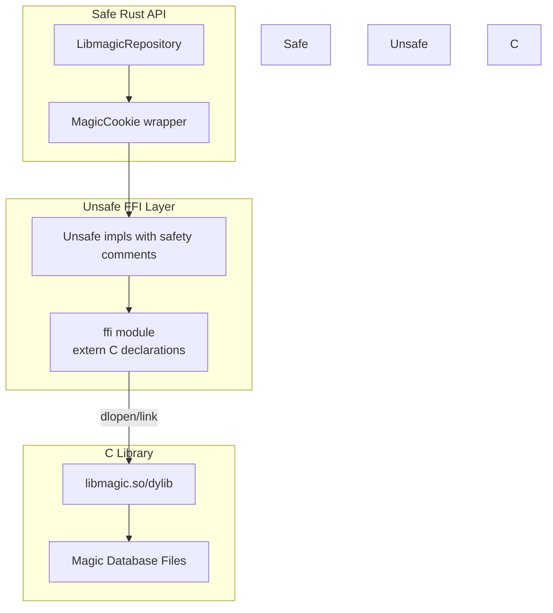
```mermaid
graph TB
    subgraph Safe Rust API
        Repository[LibmagicRepository]
        SafeWrapper[MagicCookie wrapper]
    end
    
    subgraph Unsafe FFI Layer
        RawFFI[ffi module<br/>extern C declarations]
        UnsafeImpl[Unsafe impls with safety comments]
    end
    
    subgraph C Library
        Libmagic[libmagic.so/dylib]
        Database[Magic Database Files]
    end
    
    Repository --> SafeWrapper
    SafeWrapper --> UnsafeImpl
    UnsafeImpl --> RawFFI
    RawFFI -->|dlopen/link| Libmagic
    Libmagic --> Database
    
    style Safe Rust API fill:#e1ffe1
    style Unsafe FFI Layer fill:#ffe1e1
    style C Library fill:#f5e1e1
```

### Module Structure

```
src/infrastructure/magic/
├── ffi.rs              # Raw FFI declarations (unsafe)
├── wrapper.rs          # Safe Rust wrapper types
├── error.rs            # Error type conversions
└── lib.rs              # Public API (repository impl)
```

**Responsibility Distribution:**

| Module | Contains | Safety Level |
|--------|----------|--------------|
| `ffi.rs` | Raw `extern "C"` declarations | 100% unsafe |
| `wrapper.rs` | Safe wrapper over raw FFI | Encapsulates unsafe |
| `error.rs` | Error type conversions | Safe |
| `lib.rs` | Repository implementation | Safe public API |

---

## Raw FFI Module Design

**Location:** `src/infrastructure/magic/ffi.rs`

### Opaque Pointer Type

C's `magic_t` is an opaque pointer - internal structure unknown.

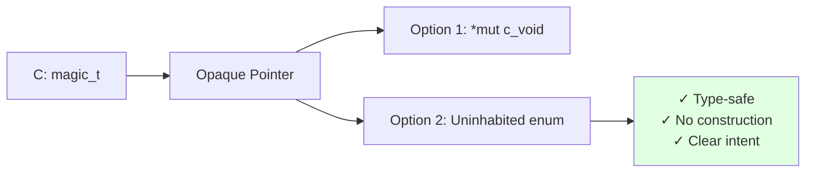
```mermaid
graph LR
    C[C: magic_t] --> Opaque[Opaque Pointer]
    Opaque --> Rust1[Option 1: *mut c_void]
    Opaque --> Rust2[Option 2: Uninhabited enum]
    
    Rust2 --> Best[✓ Type-safe<br/>✓ No construction<br/>✓ Clear intent]
    
    style Best fill:#e1ffe1
```

**Design:** Use uninhabited enum for type safety.

**Rationale:**
- Prevents accidental construction
- Distinct type from other pointers
- Zero runtime cost
- Clear intent that it's opaque

### FFI Type Mapping

| C Type | Rust FFI Type | Notes |
|--------|--------------|-------|
| `int` | `std::os::raw::c_int` | Platform-specific size |
| `size_t` | `usize` | Native pointer-sized |
| `const char*` | `*const std::os::raw::c_char` | C string (null-terminated) |
| `const void*` | `*const std::os::raw::c_void` | Generic data pointer |
| `void*` | `*mut std::os::raw::c_void` | Mutable data pointer |
| `magic_t` | `*mut MagicT` | Custom opaque type |

### Linkage Declaration

Specify which C library to link against during compilation.

**Build Script Location:** `build.rs` (if needed for pkg-config)  
**Link Directive:** `#[link(name = "magic")]`

**Platform Differences:**

| Platform | Library Name | Location |
|----------|-------------|----------|
| Linux | `libmagic.so.1` | `/usr/lib/x86_64-linux-gnu/` |
| macOS | `libmagic.dylib` | `/usr/local/lib/` |
| Windows | `magic1.dll` | (Not supported for this project) |

---

## Safe Wrapper Design

**Location:** `src/infrastructure/magic/wrapper.rs`

### Ownership Model

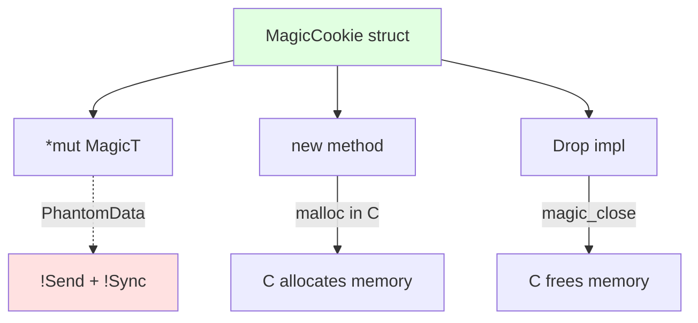
```mermaid
graph TB
    MagicCookie[MagicCookie struct] --> Pointer[*mut MagicT]
    
    MagicCookie --> New[new method]
    MagicCookie --> Drop[Drop impl]
    
    New -->|malloc in C| Allocate[C allocates memory]
    Drop -->|magic_close| Free[C frees memory]
    
    Pointer -.->|PhantomData| Marker[!Send + !Sync]
    
    style MagicCookie fill:#e1ffe1
    style Marker fill:#ffe1e1
```

**Design Principles:**

1. **RAII Pattern** - Resource acquired in constructor, freed in destructor
2. **Ownership** - Rust owns the C resource lifetime
3. **Non-Send/Non-Sync** - libmagic is not thread-safe by default
4. **Panic Safety** - Drop runs even during panic

### MagicCookie Structure

Wraps the raw `*mut MagicT` pointer with safe Rust semantics.

**Fields:**
- `ptr: *mut MagicT` - The raw C pointer
- `_marker: PhantomData<*mut ()>` - Marks as `!Send + !Sync`

**Why PhantomData?**
- Raw pointers are `Send` and `Sync` by default in Rust
- libmagic is NOT thread-safe
- PhantomData prevents accidental cross-thread usage
- Zero runtime cost

### Constructor Pattern

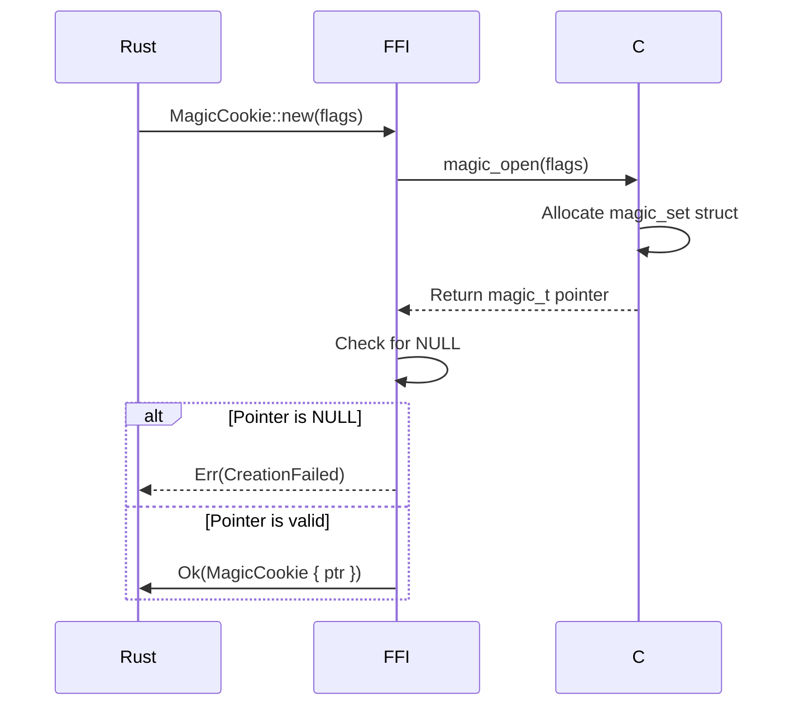
```mermaid
sequenceDiagram
    participant Rust
    participant FFI
    participant C
    
    Rust->>FFI: MagicCookie::new(flags)
    FFI->>C: magic_open(flags)
    C->>C: Allocate magic_set struct
    C-->>FFI: Return magic_t pointer
    FFI->>FFI: Check for NULL
    alt Pointer is NULL
        FFI-->>Rust: Err(CreationFailed)
    else Pointer is valid
        FFI->>Rust: Ok(MagicCookie { ptr })
    end
```

**Error Handling:**
- Check for NULL pointer
- Convert to Rust `Result` type
- No error string available (cookie not yet created)

### Destructor Pattern

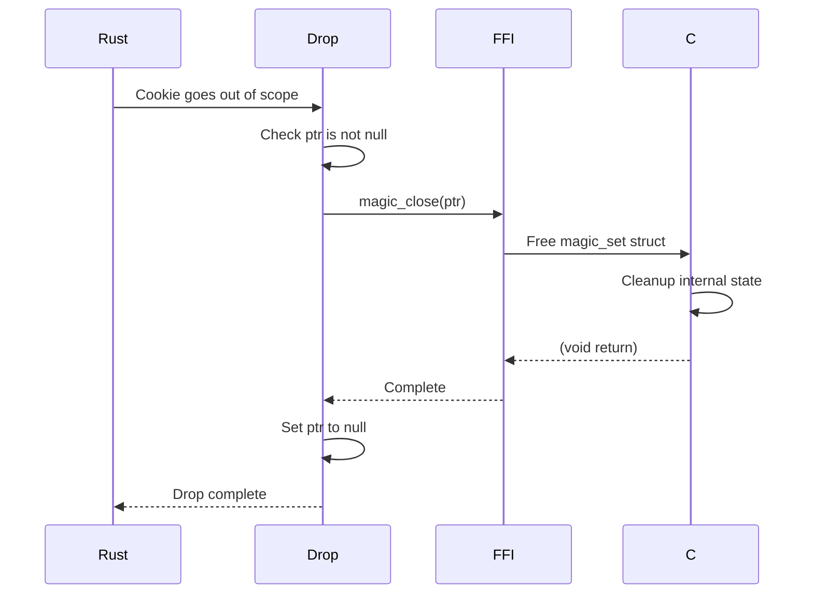
```mermaid
sequenceDiagram
    participant Rust
    participant Drop
    participant FFI
    participant C
    
    Rust->>Drop: Cookie goes out of scope
    Drop->>Drop: Check ptr is not null
    Drop->>FFI: magic_close(ptr)
    FFI->>C: Free magic_set struct
    C->>C: Cleanup internal state
    C-->>FFI: (void return)
    FFI-->>Drop: Complete
    Drop->>Drop: Set ptr to null
    Drop-->>Rust: Drop complete
```

**Safety Requirements:**
- Must not call `magic_close` on NULL
- Must not double-free
- Must run even during panic

### Method Wrappers

Each C function gets a safe Rust method wrapper.

**Pattern for Returning Strings:**

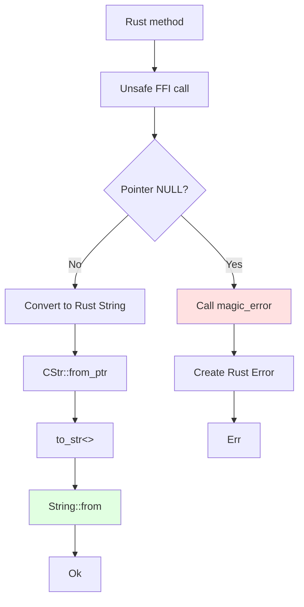
```mermaid
graph TB
    Method[Rust method] --> Call[Unsafe FFI call]
    Call --> Check{Pointer NULL?}
    Check -->|Yes| Error[Call magic_error]
    Check -->|No| Convert[Convert to Rust String]
    
    Error --> CreateErr[Create Rust Error]
    Convert --> CStr[CStr::from_ptr]
    CStr --> UTF8[to_str<>]
    UTF8 --> Clone[String::from]
    
    CreateErr --> Return1[Err]
    Clone --> Return2[Ok]
    
    style Error fill:#ffe1e1
    style Clone fill:#e1ffe1
```

**Safety Invariants:**

1. **Lifetime** - C string valid until next libmagic call
2. **Encoding** - Assume UTF-8 (documented libmagic behavior)
3. **Null Termination** - C strings are null-terminated
4. **Ownership** - Must copy string, C owns original

---

## Thread Safety Strategy

libmagic is not thread-safe - one cookie cannot be used concurrently.

### Problem

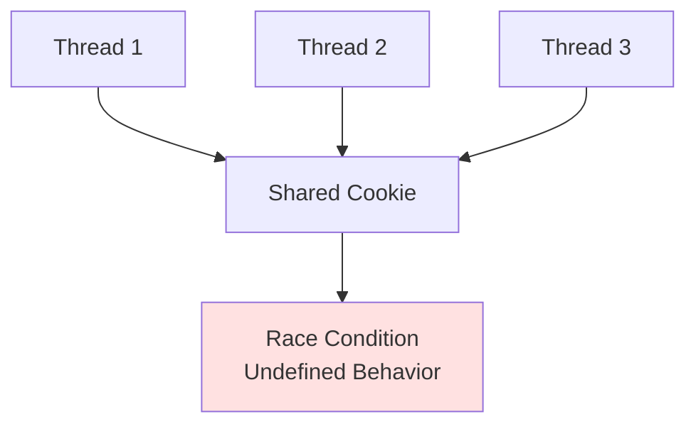
```mermaid
graph TB
    T1[Thread 1] --> Cookie[Shared Cookie]
    T2[Thread 2] --> Cookie
    T3[Thread 3] --> Cookie
    
    Cookie --> Crash[Race Condition<br/>Undefined Behavior]
    
    style Crash fill:#ffe1e1
```

### Solution 1: Mutex Wrapper

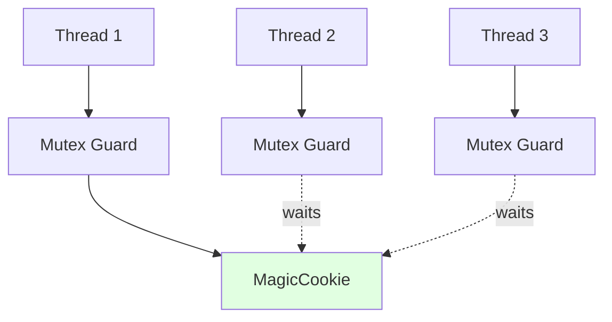
```mermaid
graph TB
    T1[Thread 1] --> M1[Mutex Guard]
    T2[Thread 2] --> M2[Mutex Guard]
    T3[Thread 3] --> M3[Mutex Guard]
    
    M1 --> Cookie[MagicCookie]
    M2 -.->|waits| Cookie
    M3 -.->|waits| Cookie
    
    style Cookie fill:#e1ffe1
```

**Implementation:**
- Wrap `MagicCookie` in `Arc<Mutex<MagicCookie>>`
- Each thread clones the Arc
- Mutex ensures exclusive access
- Only one thread uses libmagic at a time

**Trade-off:** Serializes all libmagic calls.

### Solution 2: Pool of Cookies

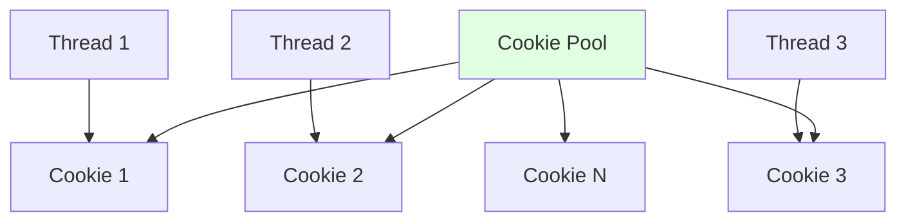
```mermaid
graph TB
    Pool[Cookie Pool] --> C1[Cookie 1]
    Pool --> C2[Cookie 2]
    Pool --> C3[Cookie 3]
    Pool --> C4[Cookie N]
    
    T1[Thread 1] --> C1
    T2[Thread 2] --> C2
    T3[Thread 3] --> C3
    
    style Pool fill:#e1ffe1
```

**Implementation:**
- Create N cookies (e.g., N = num_cpus)
- Store in `Arc<Mutex<Vec<MagicCookie>>>`
- Threads borrow/return cookies from pool
- True parallelism up to pool size

**Trade-off:** More memory, more initialization time.

### Recommended Approach

**For this project:** Single cookie with Mutex.

**Rationale:**
- Simpler implementation
- libmagic analysis is fast (10-100ms)
- Mutex contention acceptable given request rate
- Memory efficient (single database load)

---

## Async Integration with Tokio

libmagic blocks, but we need async API.

### The Problem


```mermaid
graph LR
    AsyncHandler[Async Handler] -->|await| Block[Blocking libmagic call]
    Block -->|blocks thread| Bad[Async runtime blocked!]
    
    style Bad fill:#ffe1e1
```

**Issue:** Blocking calls on async runtime threads cause:
- Runtime stalls
- Request timeouts
- Poor throughput

### The Solution

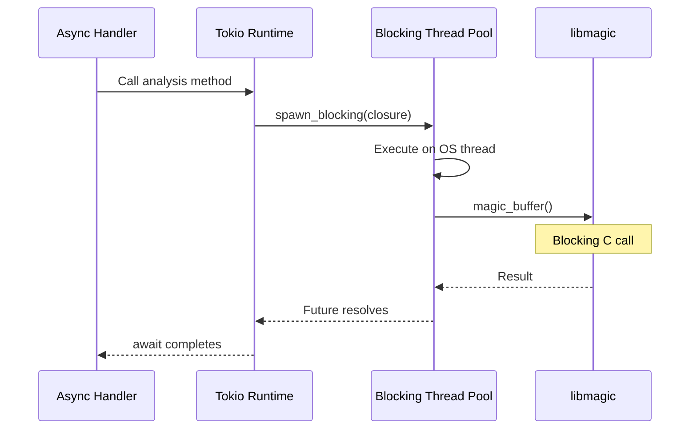
```mermaid
sequenceDiagram
    participant Handler as Async Handler
    participant Runtime as Tokio Runtime
    participant BlockPool as Blocking Thread Pool
    participant Libmagic as libmagic
    
    Handler->>Runtime: Call analysis method
    Runtime->>BlockPool: spawn_blocking(closure)
    BlockPool->>BlockPool: Execute on OS thread
    BlockPool->>Libmagic: magic_buffer()
    Note over Libmagic: Blocking C call
    Libmagic-->>BlockPool: Result
    BlockPool-->>Runtime: Future resolves
    Runtime-->>Handler: await completes
```

**Implementation Pattern:**

Wrap blocking call in `tokio::task::spawn_blocking`.

**Benefits:**
- Async runtime never blocks
- Automatic thread pool management
- Graceful backpressure
- Work-stealing efficiency preserved

---

## Error Handling Architecture

### C Error Model

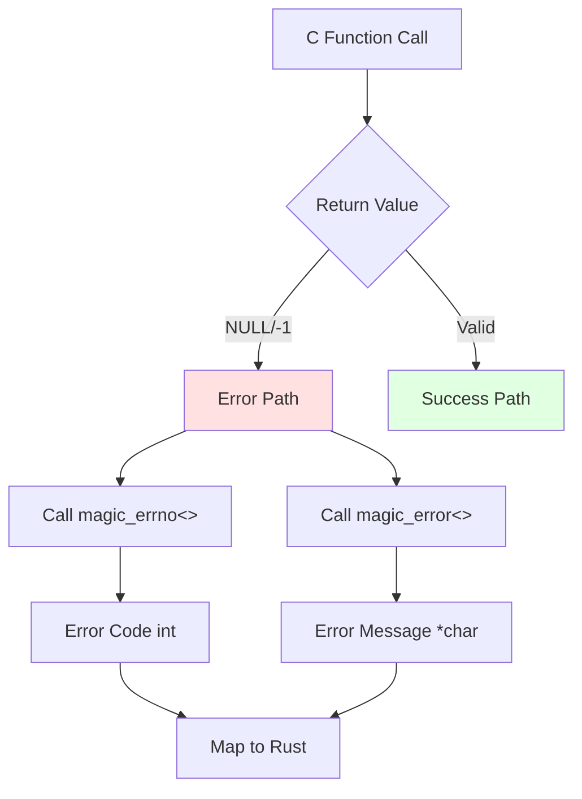
```mermaid
graph TB
    Call[C Function Call] --> Check{Return Value}
    
    Check -->|NULL/-1| Error[Error Path]
    Check -->|Valid| Success[Success Path]
    
    Error --> Errno[Call magic_errno<>]
    Error --> Msg[Call magic_error<>]
    
    Errno --> Code[Error Code int]
    Msg --> Str[Error Message *char]
    
    Code --> Rust[Map to Rust]
    Str --> Rust
    
    style Error fill:#ffe1e1
    style Success fill:#e1ffe1
```

### Rust Error Type

Custom error enum matching domain needs.

**Design:**

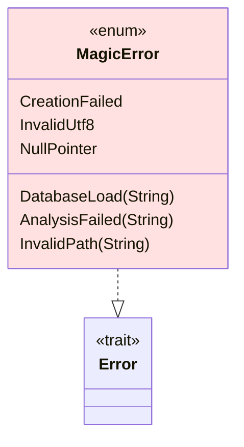
```mermaid
classDiagram
    class MagicError {
        <<enum>>
        CreationFailed
        DatabaseLoad(String)
        AnalysisFailed(String)
        InvalidPath(String)
        InvalidUtf8
        NullPointer
    }
    
    class Error {
        <<trait>>
    }
    
    MagicError ..|> Error
    
    style MagicError fill:#ffe1e1
```

**Variant Meanings:**

| Variant | When | C Source |
|---------|------|----------|
| `CreationFailed` | `magic_open` returns NULL | Initialization error |
| `DatabaseLoad` | `magic_load` returns -1 | File not found, corrupt DB |
| `AnalysisFailed` | `magic_file/buffer` returns NULL | Analysis error |
| `InvalidPath` | Path not UTF-8 or invalid | Path handling |
| `InvalidUtf8` | C string not valid UTF-8 | String conversion |
| `NullPointer` | Unexpected NULL | Defensive programming |

### Error Conversion Flow

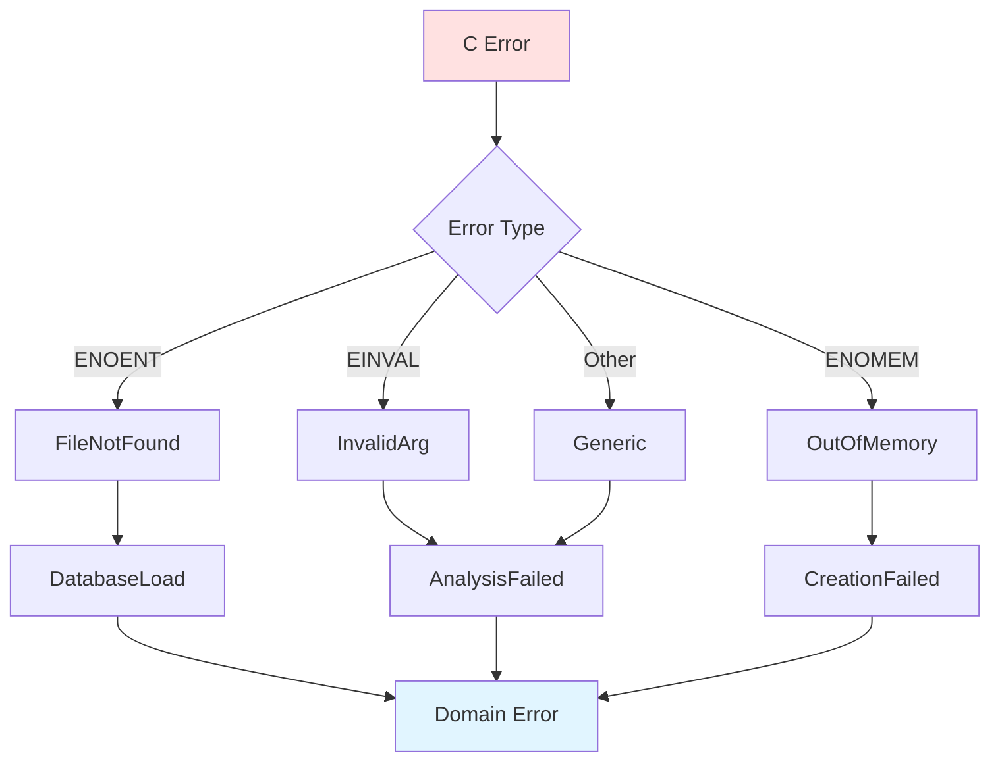
```mermaid
graph TB
    C[C Error] --> Check{Error Type}
    
    Check -->|ENOENT| FileNotFound
    Check -->|EINVAL| InvalidArg
    Check -->|ENOMEM| OutOfMemory
    Check -->|Other| Generic
    
    FileNotFound --> DB[DatabaseLoad]
    InvalidArg --> Analysis[AnalysisFailed]
    OutOfMemory --> Creation[CreationFailed]
    Generic --> Analysis
    
    DB --> Domain[Domain Error]
    Analysis --> Domain
    Creation --> Domain
    
    style C fill:#ffe1e1
    style Domain fill:#e1f5ff
```

**Error String Handling:**

1. Check return value (NULL/-1)
2. Call `magic_error()` to get C string
3. Convert C string to Rust `String` (copy)
4. Wrap in error variant
5. Return Rust `Result`

---

## Memory Safety Guarantees

### Ownership Rules

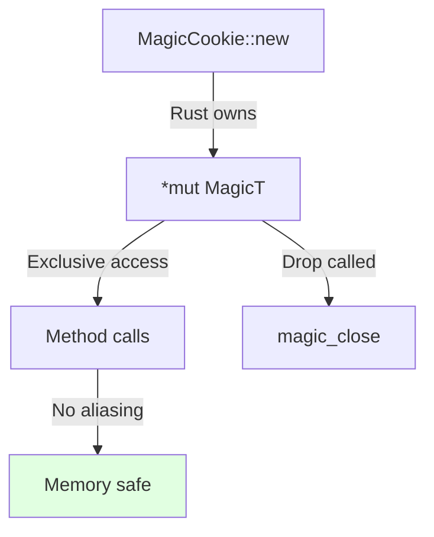
```mermaid
graph TB
    Create[MagicCookie::new] -->|Rust owns| Pointer[*mut MagicT]
    Pointer -->|Exclusive access| Methods[Method calls]
    Methods -->|No aliasing| Safe[Memory safe]
    Pointer -->|Drop called| Free[magic_close]
    
    style Safe fill:#e1ffe1
```

**Guarantees:**

1. **Single Owner** - Only one MagicCookie owns the pointer
2. **No Aliasing** - Raw pointer not exposed publicly
3. **RAII Cleanup** - Drop always runs (even during panic)
4. **Type Safety** - Opaque type prevents misuse

### String Lifetime Safety

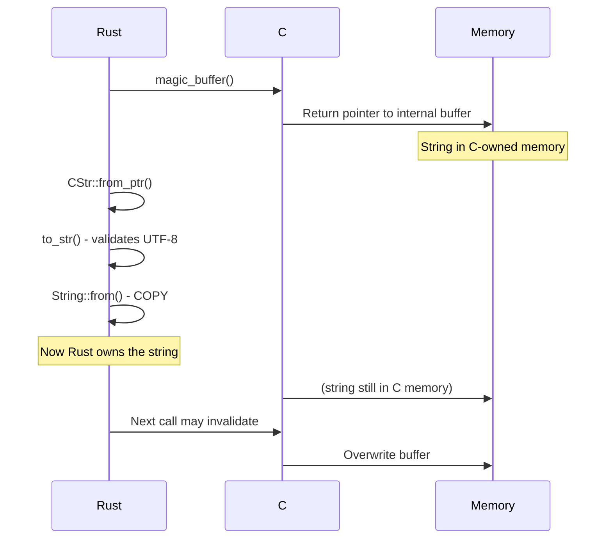
```mermaid
sequenceDiagram
    participant Rust
    participant C
    participant Memory
    
    Rust->>C: magic_buffer()
    C->>Memory: Return pointer to internal buffer
    Note over Memory: String in C-owned memory
    Rust->>Rust: CStr::from_ptr()
    Rust->>Rust: to_str() - validates UTF-8
    Rust->>Rust: String::from() - COPY
    Note over Rust: Now Rust owns the string
    C->>Memory: (string still in C memory)
    Rust->>C: Next call may invalidate
    C->>Memory: Overwrite buffer
```

**Safety Requirements:**

1. **Immediate Copy** - Copy C string before next call
2. **UTF-8 Validation** - Check encoding before using
3. **No Dangling** - Never store raw `*const c_char`
4. **Null Checking** - Always check for NULL

### Panic Safety

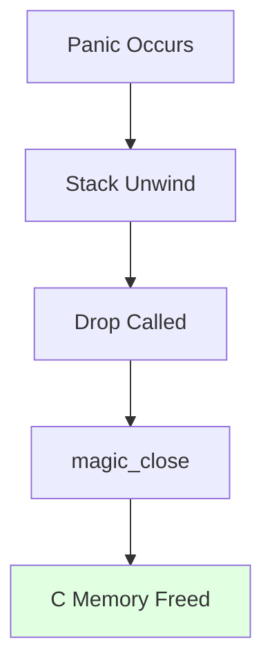
```mermaid
graph TB
    Panic[Panic Occurs] --> Unwind[Stack Unwind]
    Unwind --> Drop[Drop Called]
    Drop --> Close[magic_close]
    Close --> Free[C Memory Freed]
    
    style Free fill:#e1ffe1
```

**Guarantee:** Even if panic occurs, Drop runs and C resources are freed.

**Exception:** Panic during Drop itself (abort policy).

### Mmap Integration with libmagic FFI

Memory-mapped files provide zero-copy buffer access to libmagic through the FFI boundary.

```mermaid
sequenceDiagram
    participant UseCase
    participant MmapWrapper
    participant LibC
    participant MagicFFI
    participant Libmagic
    
    UseCase->>MmapWrapper: create_mmap(temp_file)
    MmapWrapper->>LibC: open(path, O_RDONLY)
    LibC-->>MmapWrapper: fd
    MmapWrapper->>LibC: mmap(NULL, size, PROT_READ, MAP_PRIVATE, fd, 0)
    LibC-->>MmapWrapper: addr (*const u8)
    
    MmapWrapper->>MmapWrapper: Create slice: &[u8]
    MmapWrapper-->>UseCase: &[u8] (mmap slice)
    
    UseCase->>MagicFFI: analyze_buffer(cookie, slice)
    MagicFFI->>MagicFFI: slice.as_ptr() -> *const c_void
    MagicFFI->>Libmagic: magic_buffer(cookie, ptr, len)
    
    Note over Libmagic: Reads directly from mmap
    Note over Libmagic: No copy required
    
    Libmagic-->>MagicFFI: *const c_char
    MagicFFI-->>UseCase: String (copied)
    
    UseCase->>MmapWrapper: Drop
    MmapWrapper->>LibC: munmap(addr, size)
    MmapWrapper->>LibC: close(fd)
```

**FFI Interface for Mmap:**

The FFI layer accepts any memory buffer pointer, whether from heap allocation or memory-mapped files. The safe wrapper converts Rust slices to raw pointers for C interoperability.

**Interface Design:**

| Layer | Type | Description |
|-------|------|-------------|
| Safe Rust API | `&[u8]` | Borrowed slice from any source (mmap, heap, stack) |
| FFI Boundary | `*const c_void` | Raw pointer passed to C function |
| C Library | `const void*` | Libmagic reads from pointer with given length |

**Key Properties:**

| Property | Behavior | Benefit |
|----------|----------|---------|
| **Zero-Copy** | libmagic reads directly from mmap | No memory duplication |
| **Unified Interface** | Same function for mmap and heap | Simple API |
| **Pointer Lifetime** | Slice lifetime ensures mmap validity | Memory safe |
| **Page Faults** | OS loads pages on-demand | Memory efficient |

**Safety Guarantees:**

The Rust type system ensures memory safety through lifetime tracking. The slice reference borrows the mmap, preventing unmapping while the pointer is in use.

```mermaid
graph TB
    subgraph Lifetimes["Lifetime Relationships"]
        Mmap[Mmap Struct]
        Slice["&[u8] Slice"]
        Call[analyze_buffer call]
    end
    
    Mmap -->|'a| Slice
    Slice -->|'b where 'b ⊆ 'a| Call
    
    Note1[Slice lifetime ⊆ Mmap lifetime<br/>Guaranteed by borrow checker]
    
    style Mmap fill:#e1f5ff
    style Slice fill:#e1ffe1
    style Call fill:#fff4e1
```

**Lifetime Safety:**

| Stage | Mmap State | Slice State | Safety |
|-------|------------|-------------|--------|
| Before mmap creation | N/A | N/A | - |
| Mmap created | Valid | N/A | Safe |
| Slice created from mmap | Valid | Valid (borrows mmap) | Safe |
| During FFI call | Valid | Valid | Safe - pointer valid |
| After FFI returns | Valid | Valid | Safe |
| Slice dropped | Valid | Dropped | Safe |
| Mmap dropped | Dropped | Already dropped | Safe |

**Pointer Validity Guarantees:**

1. Slice pointer guaranteed valid during the entire FFI call
2. Mmap wrapper holds file descriptor open throughout analysis
3. No unmapping occurs while libmagic reads data
4. Rust borrow checker prevents use-after-free

**Read-Only Access Properties:**

| Protection | Mechanism | Effect |
|------------|-----------|--------|
| No writes | `PROT_READ` flag | Libmagic cannot modify mapped memory |
| Process isolation | `MAP_PRIVATE` flag | Changes invisible to other processes |
| No aliasing | Rust `&` reference | Immutable borrow prevents mutations |

**Integration with Temp Files:**

The temporary file handler creates a memory mapping after streaming data, then passes the mapped slice to libmagic for analysis. The mmap and file descriptor are automatically cleaned up through RAII.

```mermaid
sequenceDiagram
    participant UseCase
    participant TempFile
    participant Mmap
    participant LibmagicFFI
    
    UseCase->>TempFile: Stream data to temp file
    TempFile->>TempFile: Flush and sync
    
    UseCase->>Mmap: Create Mmap::open(temp_path)
    Mmap->>Mmap: Open FD and mmap
    Mmap-->>UseCase: Mmap instance
    
    UseCase->>Mmap: Get slice: &[u8]
    Mmap-->>UseCase: Slice reference
    
    UseCase->>LibmagicFFI: analyze_buffer(slice)
    LibmagicFFI-->>UseCase: Analysis result
    
    UseCase->>Mmap: Drop mmap
    Mmap->>Mmap: munmap and close(fd)
    
    UseCase->>TempFile: Drop temp file
    TempFile->>TempFile: Delete file
    
    Note over UseCase,TempFile: All resources cleaned automatically
```

**Resource Cleanup Order:**

| Step | Resource | Action | RAII Trigger |
|------|----------|--------|--------------|
| 1 | Analysis | Complete FFI call | - |
| 2 | Mmap | Unmap memory | Drop trait |
| 3 | File Descriptor | Close FD | Drop trait (Mmap) |
| 4 | Temp File | Delete from disk | Drop trait (TempFile) |

### File Descriptor Lifecycle in FFI Context

File descriptors have complex lifecycle interactions between Rust RAII and C library usage.

```mermaid
stateDiagram-v2
    [*] --> FdOpen: open() syscall
    FdOpen --> FdActive: fd = 3
    
    state FdActive {
        [*] --> Mmap: mmap(fd)
        Mmap --> Reading: libmagic reads
        Reading --> Mmap: Continue reading
    }
    
    FdActive --> FdClose: close(fd)
    FdClose --> [*]
    
    note right of Mmap
        FD must remain open
        during mmap lifetime
    end note
```

**FD Ownership Patterns:**

**1. Mmap Owns FD (Recommended):**

The memory-mapped file structure owns the file descriptor from open to close, ensuring proper resource cleanup through RAII semantics. The file descriptor remains valid throughout the mapping's lifetime and is automatically closed when the mapping is dropped.

```mermaid
sequenceDiagram
    participant App as Application
    participant Mmap as Mmap Struct
    participant Kernel as Kernel
    
    App->>Mmap: Create Mmap::open(path)
    Mmap->>Kernel: open(path, O_RDONLY)
    Kernel-->>Mmap: FD (e.g., fd=10)
    Note over Mmap: Store FD in struct
    
    Mmap->>Kernel: fstat(fd) - get file size
    Kernel-->>Mmap: size = 1048576 bytes
    
    Mmap->>Kernel: mmap(addr=NULL, len, PROT_READ, MAP_PRIVATE, fd, 0)
    Kernel-->>Mmap: addr = 0x7f1234000000
    Note over Mmap: Mmap now owns:<br/>- FD (10)<br/>- Memory mapping (addr, len)
    
    Mmap-->>App: Return Mmap instance
    
    Note over App,Kernel: FD and mapping both valid
    
    App->>Mmap: Use mmap data (&[u8])
    Mmap-->>App: Valid memory access
    
    App->>Mmap: Drop Mmap (explicit or scope end)
    
    Note over Mmap: Drop::drop() called
    Mmap->>Kernel: munmap(addr, len)
    Note over Kernel: Memory released<br/>FD still valid
    Kernel-->>Mmap: Success
    
    Mmap->>Kernel: close(fd)
    Note over Kernel: FD released
    Kernel-->>Mmap: Success
    
    Note over Mmap: All resources cleaned up
```

**Ownership Design Principles:**

```mermaid
graph TB
    subgraph Mmap["Mmap Struct (RAII Container)"]
        FD[File Descriptor: i32]
        Addr[Memory Address: *const u8]
        Len[Mapping Length: usize]
    end
    
    subgraph Lifecycle["Resource Lifecycle"]
        Open[1. open: Acquire FD]
        MmapCall[2. mmap: Create mapping using FD]
        Use[3. Use: Read mapped memory]
        Unmap[4. munmap: Release mapping]
        Close[5. close: Release FD]
    end
    
    Open --> FD
    MmapCall --> Addr
    MmapCall --> Len
    FD --> MmapCall
    
    Use --> Addr
    Unmap --> Addr
    Close --> FD
    
    Unmap -.->|Must happen before| Close
    
    style Mmap fill:#e1f5ff
    style FD fill:#fff4e1
    style Addr fill:#e1ffe1
    style Len fill:#e1ffe1
```

**Key Design Properties:**

| Property | Description | Benefit |
|----------|-------------|---------|
| Single Owner | Mmap struct owns both FD and mapping | Clear ownership, no shared state |
| RAII Cleanup | Drop trait handles all cleanup | Automatic resource release, leak-proof |
| Correct Ordering | munmap before close enforced by Drop | Prevents invalid operations |
| Error Safety | Cleanup runs even on panic | No resource leaks during unwinding |
| Encapsulation | FD hidden from external code | Cannot accidentally close FD early |

**FD Lifecycle Rules:**

| Phase | FD State | Mmap State | Libmagic Access |
|-------|----------|------------|-----------------|
| Before open | N/A | N/A | ❌ Cannot call |
| FD open, no mmap | Valid | N/A | ✅ Can use `magic_file()` |
| FD open, mmap active | Valid | Valid | ✅ Can use `magic_buffer()` on mmap |
| After munmap | Valid | Invalid | ❌ Cannot use mmap data |
| After close | Invalid | Invalid | ❌ Cannot access file |

**2. Critical Ordering:**

The Drop implementation must unmap memory before closing the file descriptor to prevent invalid operations. This ordering is critical for correctness.

```mermaid
stateDiagram-v2
    [*] --> FDOpen: open() returns FD
    FDOpen --> MmapCreated: mmap(fd) creates mapping
    MmapCreated --> InUse: Memory accessible
    
    InUse --> Dropping: Drop called
    
    state Dropping {
        [*] --> Unmapping
        Unmapping --> FDClosing: munmap() first
        FDClosing --> Closed: close(fd) second
        Closed --> [*]
    }
    
    Dropping --> [*]: All resources released
    
    note right of Unmapping
        CRITICAL: Must unmap before close
        Wrong order causes undefined behavior
    end note
```

**Correct vs Incorrect Ordering:**

| Correct Order | Incorrect Order | Consequence |
|---------------|-----------------|-------------|
| 1. munmap(addr, len) | 1. close(fd) | ❌ Undefined behavior |
| 2. close(fd) | 2. munmap(addr, len) | ❌ Accessing closed FD |
| ✅ Safe cleanup | ❌ Potential crashes | - |

**3. FD Leakage Prevention:**

RAII pattern ensures file descriptor cleanup even when errors occur. The Drop trait runs automatically when Mmap goes out of scope, whether by normal return, early return, or panic unwinding.

```mermaid
graph TB
    Start[Function Entry] --> Create[Create Mmap::open]
    Create -->|Success| FDOpen[FD Acquired]
    Create -->|Failure| NoCleanup[No cleanup needed]
    
    FDOpen --> UseData[Use mapped data]
    UseData -->|Success| NormalExit[Normal exit]
    UseData -->|Error| ErrorReturn[Early return]
    UseData -->|Panic| PanicUnwind[Panic unwind]
    
    NormalExit --> DropRuns1[Drop runs]
    ErrorReturn --> DropRuns2[Drop runs]
    PanicUnwind --> DropRuns3[Drop runs]
    
    DropRuns1 --> Cleanup[munmap then close]
    DropRuns2 --> Cleanup
    DropRuns3 --> Cleanup
    
    Cleanup --> End[FD Released]
    NoCleanup --> End
    
    style Cleanup fill:#e1ffe1
    style DropRuns1 fill:#e1ffe1
    style DropRuns2 fill:#e1ffe1
    style DropRuns3 fill:#e1ffe1
```

**Error Safety Guarantees:**

| Scenario | Drop Runs | FD Cleaned | Leak Prevention |
|----------|-----------|------------|-----------------|
| Normal completion | ✅ Yes | ✅ Yes | Safe |
| Early return with `?` | ✅ Yes | ✅ Yes | Safe |
| Explicit `return Err` | ✅ Yes | ✅ Yes | Safe |
| Panic during analysis | ✅ Yes | ✅ Yes | Safe |
| Out of scope | ✅ Yes | ✅ Yes | Safe |

**FD Limit Considerations:**

Each memory-mapped file holds one file descriptor throughout its lifetime. The system must account for concurrent file descriptors from network sockets, temporary files, and memory mappings.

```mermaid
graph TB
    subgraph FDUsage["FD Usage per 1000 Concurrent Requests"]
        Sockets[TCP Sockets: 1000 FDs]
        TempFiles[Temp Files: ~500 FDs]
        Mmaps[Mmap FDs: ~500 FDs]
        System[System FDs: ~50 FDs]
    end
    
    Sockets --> Total[Total: ~2050 FDs]
    TempFiles --> Total
    Mmaps --> Total
    System --> Total
    
    Total --> Required[Required Limit: 4096+]
    
    style Total fill:#fff4e1
    style Required fill:#e1ffe1
```

**FD Calculation:**

| Resource Type | Count (per 1000 requests) | Notes |
|---------------|---------------------------|-------|
| TCP Sockets | 1000 | One per connection |
| Temp Files | ~500 | Assumes 50% large requests |
| Mmap FDs | ~500 | Same as temp files (1:1) |
| System FDs | ~50 | stdout, stderr, logs, config |
| **Total Required** | **~2050** | Must set ulimit appropriately |
| **Recommended Limit** | **4096+** | 2x headroom for safety |


**Platform-Specific Mmap Considerations:**

Memory-mapped I/O behavior varies across operating systems and filesystems. Platform-specific flags and features affect performance, but the core functionality remains portable.

**Linux-Specific Features:**

Linux provides the MAP_POPULATE flag to pre-fault pages into memory during the mmap call, reducing page fault latency during analysis. This optimization is particularly useful for large files where predictable latency is important.

```mermaid
graph LR
    subgraph Linux["Linux Mmap"]
        L1[mmap with MAP_POPULATE]
        L2[Pre-fault all pages]
        L3[No page faults during read]
    end
    
    subgraph Other["macOS/Other"]
        O1[mmap without populate]
        O2[Lazy page loading]
        O3[Page faults on first access]
    end
    
    L1 --> L2 --> L3
    O1 --> O2 --> O3
    
    style L3 fill:#e1ffe1
    style O3 fill:#fff4e1
```

**Platform Comparison:**

| Feature | Linux | macOS | Notes |
|---------|-------|-------|-------|
| **Max Mmap Size** | 128TB (64-bit) | 8TB | Architecture dependent |
| **Page Size** | 4KB typical | 4KB/16KB | Affects alignment |
| **`MAP_POPULATE`** | ✅ Supported | ❌ Not available | Linux pre-faulting |
| **`MAP_PREFAULT_READ`** | ❌ Not available | ✅ Supported | macOS equivalent |
| **Huge Pages** | ✅ `MAP_HUGETLB` | ❌ Limited | Linux 2MB/1GB pages |
| **File Size Limits** | ext4: 16TB | APFS: 8EB | Filesystem dependent |

**Filesystem-Specific Behavior:**

| Filesystem | Mmap Support | Performance | Notes |
|------------|-------------|-------------|-------|
| **ext4** | ✅ Full | Excellent | Native Linux support |
| **xfs** | ✅ Full | Excellent | Large file optimized |
| **tmpfs** | ✅ Full | Best (RAM) | In-memory filesystem |
| **NFS** | ⚠️ Limited | Poor | Network latency, cache issues |
| **FUSE** | ⚠️ Limited | Variable | Depends on implementation |
| **overlayfs** | ✅ Full | Good | Docker default |

**Conditional Compilation:**

The implementation uses conditional compilation to select platform-appropriate mmap flags. Linux uses MAP_POPULATE for performance, while other platforms use standard flags.

```mermaid
graph TB
    Code[Mmap Implementation] --> Compile{Compile Time}
    
    Compile -->|Linux| LinuxFlags[MAP_PRIVATE + MAP_POPULATE]
    Compile -->|macOS| MacFlags[MAP_PRIVATE only]
    Compile -->|Other| Error[Compile Error]
    
    LinuxFlags --> Build[Build Succeeds]
    MacFlags --> Build
    
    style LinuxFlags fill:#e1ffe1
    style MacFlags fill:#e1ffe1
    style Error fill:#ffe1e1
```

**Platform-Specific Configuration:**

| Platform | Flags Used | Reason |
|----------|-----------|--------|
| Linux | MAP_PRIVATE + MAP_POPULATE | Pre-fault optimization available |
| macOS | MAP_PRIVATE | MAP_POPULATE not supported |
| Other | Compilation error | Explicit platform support required |

**Page Alignment Requirements:**

Memory mappings must respect system page size boundaries. The offset parameter must be page-aligned, but the length can be any value. The kernel rounds up the length to the nearest page boundary automatically.

```mermaid
graph LR
    FileSize[File Size: 10500 bytes] --> PageSize{Page Size: 4096 bytes}
    PageSize --> Aligned[Mapped: 12288 bytes<br/>3 pages]
    
    subgraph Mapping["Memory Layout"]
        Page1[Page 1: 0-4095<br/>4096 bytes]
        Page2[Page 2: 4096-8191<br/>4096 bytes]
        Page3[Page 3: 8192-12287<br/>4096 bytes]
    end
    
    Aligned --> Page1
    Aligned --> Page2
    Aligned --> Page3
    
    Note1[Only first 10500 bytes<br/>contain valid file data]
    
    style Aligned fill:#e1ffe1
```

**Alignment Rules:**

| Parameter | Alignment Requirement | Notes |
|-----------|----------------------|-------|
| Offset | Must be page-aligned (multiple of 4096) | Kernel enforces this |
| Length | No requirement | Kernel rounds up automatically |
| Address | Kernel decides | Always page-aligned |
| Page Size | System dependent | Typically 4KB on x86_64 |

**NFS and Network Storage Detection:**

Network filesystems like NFS have poor mmap performance due to network latency and cache coherency issues. The system can detect NFS mounts using filesystem type checking.

```mermaid
graph TB
    CheckFS[Check Filesystem Type] --> GetStat[Call statfs]
    GetStat --> Compare{f_type == NFS_SUPER_MAGIC?}
    
    Compare -->|Yes| NetworkFS[Network Filesystem]
    Compare -->|No| LocalFS[Local Filesystem]
    
    NetworkFS --> Warning[Warn: Poor mmap performance]
    LocalFS --> Safe[Optimal mmap performance]
    
    style Warning fill:#fff4e1
    style Safe fill:#e1ffe1
```

### Signal Handling During FFI Calls (SIGBUS)

Mmap operations can trigger SIGBUS when the underlying file is modified or truncated.

```mermaid
sequenceDiagram
    participant Libmagic
    participant Mmap
    participant Kernel
    participant SignalHandler
    participant Cleanup
    
    Libmagic->>Mmap: Read byte at offset
    Mmap->>Kernel: Page fault
    
    alt File Still Valid
        Kernel->>Kernel: Load page from disk
        Kernel-->>Mmap: Page loaded
        Mmap-->>Libmagic: Return byte
    else File Truncated/Deleted
        Kernel->>SignalHandler: Deliver SIGBUS
        Note over SignalHandler: Signal handler called
        SignalHandler->>SignalHandler: Set error flag
        SignalHandler-->>Kernel: Return from handler
        Kernel-->>Libmagic: Return from page fault
        Note over Libmagic: Sees corrupted data or error
        Libmagic-->>Libmagic: Return NULL or error
    end
    
    Libmagic->>Cleanup: munmap and cleanup
```

**SIGBUS Causes:**

| Scenario | Trigger | Signal Delivered | Impact |
|----------|---------|-----------------|---------|
| File truncated | File shortened while mapped | SIGBUS | Read beyond new EOF |
| File deleted | File removed while mapped | SIGBUS (sometimes) | Read attempts fail |
| Disk full | Write to MAP_SHARED | SIGBUS | N/A (we use MAP_PRIVATE + PROT_READ) |
| Hardware error | Bad disk sector | SIGBUS | Unrecoverable read error |
| Network error | NFS server down | SIGBUS | Remote file unavailable |

**Signal Handler Setup:**

The signal handler installs a custom SIGBUS handler using libc sigaction. The handler uses an atomic flag to communicate errors back to Rust code safely.

```mermaid
graph TB
    subgraph Setup["Handler Installation"]
        Init[Initialize AtomicBool flag]
        Register[Register signal handler via sigaction]
        Store[Store flag pointer globally]
    end
    
    subgraph Runtime["Signal Delivery"]
        Access[Libmagic accesses mmap]
        Fault[Page fault occurs]
        Signal[Kernel delivers SIGBUS]
        Handler[Signal handler executes]
        SetFlag[Set atomic flag to true]
    end
    
    subgraph Check["Error Detection"]
        CheckFlag[Check atomic flag]
        Error[Return error if flag set]
    end
    
    Init --> Register --> Store
    Store --> Access
    Access --> Fault --> Signal --> Handler --> SetFlag
    SetFlag --> CheckFlag --> Error
    
    style Handler fill:#fff4e1
    style SetFlag fill:#ffe1e1
```

**Handler Components:**

| Component | Purpose | Thread Safety |
|-----------|---------|---------------|
| `AtomicBool` flag | Signal occurred indicator | Lock-free, async-signal-safe |
| `sigaction` syscall | Register signal handler | POSIX standard |
| `extern "C"` handler | Minimal handler function | Async-signal-safe operations only |
| Global static | Handler-to-Rust communication | Atomic operations only |

**Integration with Analysis:**

The analysis function installs the SIGBUS handler before calling libmagic, then checks the error flag afterward. If SIGBUS occurred, the function returns an error indicating the mmap was invalidated.

```mermaid
sequenceDiagram
    participant App
    participant Handler as SIGBUS Handler
    participant Magic as Libmagic FFI
    participant Kernel
    
    App->>Handler: Install handler
    Handler->>Kernel: sigaction(SIGBUS)
    Handler->>Handler: Set flag = false
    
    App->>Magic: analyze_buffer(mmap)
    Magic->>Kernel: Read from mmap
    
    alt File Still Valid
        Kernel-->>Magic: Data returned
        Magic-->>App: Analysis result
        App->>Handler: Check flag
        Handler-->>App: flag = false (OK)
    else File Truncated
        Kernel->>Handler: SIGBUS signal
        Handler->>Handler: Set flag = true
        Handler-->>Kernel: Return
        Kernel-->>Magic: Resume execution
        Magic-->>App: Corrupted result or NULL
        App->>Handler: Check flag
        Handler-->>App: flag = true (ERROR)
        App->>App: Return error
    end
```

**Signal Handler Constraints:**

Signal handlers must be **async-signal-safe**, meaning they can only perform a limited set of operations that won't deadlock or corrupt state.

**Allowed Operations:**

| Operation | Reason | Example |
|-----------|--------|---------|
| Set atomic variables | Lock-free, no allocation | `AtomicBool::store(true)` |
| Simple arithmetic | No side effects | Increment counter |
| Null pointer check | Safe conditional | `if !ptr.is_null()` |

**Forbidden Operations:**

| Operation | Reason | Risk |
|-----------|--------|------|
| Allocate memory | malloc not reentrant | Deadlock if malloc already locked |
| Acquire mutexes | Not async-signal-safe | Deadlock if mutex already held |
| Call libc functions | Most not signal-safe | Undefined behavior |
| Perform I/O | Not signal-safe | Corruption or deadlock |
| Format strings | Uses allocation | Crash or corruption |

**Error Recovery:**

The analysis function clears the atomic flag before calling libmagic, then checks it afterward. If SIGBUS occurred, the function returns a specific error indicating file modification during analysis.

**Recovery Steps:**

| Step | Action | Purpose |
|------|--------|---------|
| 1 | Clear flag | Reset from previous operations |
| 2 | Call libmagic | Perform analysis (may trigger SIGBUS) |
| 3 | Check flag | Detect if SIGBUS occurred |
| 4 | Return error | Inform caller of file modification |

**Error Recovery Process:**

```mermaid
stateDiagram-v2
    [*] --> Clear: Clear atomic flag
    Clear --> CallFFI: Call libmagic FFI
    
    state CallFFI {
        [*] --> Reading
        Reading --> Success: No SIGBUS
        Reading --> SigbusOccurs: File truncated
        
        SigbusOccurs --> FlagSet: Handler sets flag
        FlagSet --> FFIReturns: FFI returns (corrupted/null)
    }
    
    CallFFI --> CheckFlag: Check atomic flag
    CheckFlag --> ReturnOK: flag = false
    CheckFlag --> ReturnError: flag = true
    
    ReturnOK --> [*]: Success
    ReturnError --> [*]: MmapModified Error
```

**Testing SIGBUS Handling:**

Test scenarios verify that SIGBUS is handled gracefully without crashing the application. The test creates a mapped file, truncates it to trigger SIGBUS, then verifies error handling.

**Test Strategy:**

| Test Case | Setup | Expected Result |
|-----------|-------|-----------------|
| File truncation | Create mmap, then truncate file | Returns error, does not crash |
| File deletion | Create mmap, delete file | May succeed (inode remains) or error |
| Zero-length file | Truncate to 0 bytes while mapped | Returns SIGBUS error |
| Partial truncation | Truncate to half size | Reads up to new size, then SIGBUS |

**Alternative: SIGBUS Prevention with MAP_PRIVATE:**

The use of MAP_PRIVATE with PROT_READ significantly reduces SIGBUS risk compared to MAP_SHARED mappings.

**Protection Properties:**

| Protection | Mechanism | Effect |
|------------|-----------|--------|
| Copy-on-write | MAP_PRIVATE | Isolates from external modifications |
| Read-only | PROT_READ | No write-related SIGBUS |
| Inode retention | Unix semantics | File data accessible after deletion until unmapping |

**Remaining SIGBUS Risks:**

| Risk | Cause | Frequency |
|------|-------|-----------|
| File truncation | File shortened beyond mapped region | Medium |
| Hardware errors | Bad disk sectors | Rare |
| Network errors | NFS server unreachable | Medium (if using NFS) |

**Recommendation:** Signal handler remains necessary for production robustness despite MAP_PRIVATE protections.

---

## Configuration Design

### Flags as Type-Safe Bitflags

```mermaid
classDiagram
    class MagicFlags {
        <<bitflags>>
        NONE
        MIME_TYPE
        MIME_ENCODING
        MIME
        ERROR
        SYMLINK
        COMPRESS
        NO_CHECK_COMPRESS
    }
    
    style MagicFlags fill:#e1f5ff
```

**Design:** Use `bitflags!` macro or manual bitflag impl.

**Benefits:**
- Type-safe flag combinations
- Compile-time validation
- Named constants
- Bitwise operations

### Database Path Options

```mermaid
graph TB
    Config{Database Config} --> Default[None/Default]
    Config --> Custom[Some path]
    
    Default --> System[Use system default<br/>/usr/share/misc/magic.mgc]
    Custom --> Load[Load specified file]
    
    Load --> Check{File exists?}
    Check -->|No| Error[DatabaseLoad error]
    Check -->|Yes| Success[Load database]
    
    style Success fill:#e1ffe1
    style Error fill:#ffe1e1
```

**API Design:**

- `load_database(None)` - Use default
- `load_database(Some(path))` - Custom path
- Validate path before calling C function

---

## Testing Strategy

### Unit Tests (Wrapper Layer)

Test safe wrapper without full C integration.

**Test Targets:**
- Error conversion functions
- String handling helpers
- Flag bitwise operations
- PhantomData marker properties

### Integration Tests (Full FFI)

Test with real libmagic library.

**Test Cases:**

| Test | Input | Expected |
|------|-------|----------|
| Text file | `"Hello"` | Contains "text" |
| PNG header | PNG magic bytes | "image/png" |
| Empty buffer | `[]` | No panic, some result |
| Invalid UTF-8 | Non-UTF-8 bytes | Handled gracefully |
| NULL scenarios | Edge cases | Proper error handling |

### Miri Testing

Use Rust's Miri to detect undefined behavior.

**Checks:**
- Use-after-free
- Double-free
- Uninitialized memory
- Invalid pointer dereference

**Command:** `cargo +nightly miri test`

### Valgrind Testing

Use Valgrind to check C-level memory issues.

**Checks:**
- Memory leaks
- Invalid reads/writes
- Uninitialized values

**Command:** `valgrind --leak-check=full ./target/debug/test_binary`

---

## Build System Integration

### Link Directive

Tell Rust linker to link against libmagic.

### Build Script (Optional)

**Location:** `build.rs`

**Purpose:**
- Find libmagic via pkg-config
- Set link search paths
- Verify library exists
- Generate bindings (if using bindgen)

**For Manual FFI:** Minimal build script, just link directive.

---

## Security Considerations

### Input Validation

```mermaid
graph TB
    Input[User Input] --> Size{Size Check}
    Size -->|> 100MB| Reject1[Reject]
    Size -->|OK| Null{Null Bytes?}
    Null -->|Yes| Reject2[Reject]
    Null -->|No| Timeout{Timeout?}
    Timeout -->|> 30s| Reject3[Cancel]
    Timeout -->|OK| Process[Process with libmagic]
    
    style Reject1 fill:#ffe1e1
    style Reject2 fill:#ffe1e1
    style Reject3 fill:#ffe1e1
    style Process fill:#e1ffe1
```

**Checks Before FFI:**
1. Size limit (prevent resource exhaustion)
2. Timeout enforcement (prevent infinite loops)
3. Path validation (prevent directory traversal)

### Attack Vectors

| Attack | Mitigation |
|--------|-----------|
| Buffer overflow in libmagic | Use latest libmagic version |
| Malformed file causes crash | Timeout + error handling |
| Resource exhaustion | Size limits + connection limits |
| Directory traversal | Path sandbox validation |
| Use-after-free | Rust ownership prevents |

### Memory-Mapped I/O Security

When analyzing large files via memory-mapped I/O, strict security requirements prevent memory corruption and unauthorized access.

```mermaid
graph TB
    TempFile[Temporary File] --> Create[Create with 0600]
    Create --> FD[Open File Descriptor]
    FD --> Mmap[mmap System Call]
    
    Mmap --> Flags{Validate Flags}
    
    Flags --> F1[PROT_READ]
    Flags --> F2[MAP_PRIVATE]
    Flags --> F3[No PROT_WRITE]
    Flags --> F4[No PROT_EXEC]
    
    F1 --> Check{All Correct?}
    F2 --> Check
    F3 --> Check
    F4 --> Check
    
    Check -->|Yes| Pass[Pass to libmagic]
    Check -->|No| Panic[Security Violation]
    
    Pass --> Analyze[Analyze Buffer]
    Analyze --> Unmap[munmap]
    Unmap --> Delete[Delete Temp File]
    
    style F1 fill:#e1ffe1
    style F2 fill:#e1ffe1
    style F3 fill:#e1ffe1
    style F4 fill:#e1ffe1
    style Panic fill:#ffe1e1
```

**Required mmap Flags:**

| Flag | Value | Security Purpose |
|------|-------|------------------|
| `PROT_READ` | Read permission | Only flag allowed - prevents writes |
| `MAP_PRIVATE` | Private mapping | Copy-on-write isolation from other processes |
| No `PROT_WRITE` | Write denied | Prevents file corruption and tampering |
| No `PROT_EXEC` | Execute denied | Prevents code injection attacks |

**Security Requirements:**

The mmap configuration must enforce read-only, private mapping with no execution permission. These requirements are security-critical and enforced at the kernel level.

```mermaid
graph TB
    Requirement[Security Requirements] --> ReadOnly[1. Read-Only Mapping]
    Requirement --> Private[2. Private Copy-on-Write]
    Requirement --> NoExec[3. No Execute Permission]
    Requirement --> Signal[4. SIGBUS Signal Handling]
    
    ReadOnly --> R1[PROT_READ only]
    ReadOnly --> R2[Write attempts → SIGSEGV]
    ReadOnly --> R3[Hardware-enforced protection]
    
    Private --> P1[MAP_PRIVATE flag]
    Private --> P2[Process-local mapping]
    Private --> P3[Changes invisible to others]
    
    NoExec --> N1[Exclude PROT_EXEC]
    NoExec --> N2[Prevents code execution]
    NoExec --> N3[ROP exploit defense]
    
    Signal --> S1[Handle file modification]
    Signal --> S2[Handle truncation]
    Signal --> S3[Graceful cleanup]
    
    style ReadOnly fill:#e1ffe1
    style Private fill:#e1ffe1
    style NoExec fill:#e1ffe1
    style Signal fill:#fff4e1
```

**Security Properties:**

| Requirement | Implementation | Protection |
|-------------|---------------|------------|
| **Read-Only Mapping** | Only PROT_READ flag set | Write attempts cause SIGSEGV, prevents file corruption |
| **Private Mapping** | MAP_PRIVATE flag set | Copy-on-write isolation, protects against shared memory attacks |
| **No Write Permission** | PROT_WRITE never included | Hardware prevents modifications, immutable during analysis |
| **No Execute Permission** | PROT_EXEC never included | Memory cannot execute code, prevents code injection and ROP |
| **SIGBUS Handling** | Signal handler installed | Graceful handling of concurrent file modification |

**Protection Mechanisms:**

| Attack Vector | Protection | Enforcement Level |
|---------------|------------|-------------------|
| File corruption | PROT_READ only | CPU memory protection unit |
| Shared memory exploit | MAP_PRIVATE | Kernel page table isolation |
| Code injection | No PROT_EXEC | CPU NX (No-Execute) bit |
| ROP attack | No PROT_EXEC | Hardware DEP (Data Execution Prevention) |
| Concurrent modification | SIGBUS handler | OS signal delivery |

**FFI Integration Pattern:**

```mermaid
sequenceDiagram
    participant UseCase
    participant MmapWrapper
    participant LibC
    participant Libmagic
    participant SignalHandler
    
    UseCase->>MmapWrapper: create(file, size)
    MmapWrapper->>LibC: open(path, O_RDONLY)
    LibC-->>MmapWrapper: fd
    
    MmapWrapper->>LibC: mmap(NULL, size, PROT_READ, MAP_PRIVATE, fd, 0)
    LibC-->>MmapWrapper: addr
    
    MmapWrapper->>MmapWrapper: Validate flags at compile time
    MmapWrapper-->>UseCase: Ok(&[u8])
    
    UseCase->>Libmagic: magic_buffer(cookie, slice.as_ptr(), slice.len())
    
    alt File Modified During Analysis
        Libmagic->>LibC: Read mapped memory
        LibC->>SignalHandler: SIGBUS signal
        SignalHandler->>MmapWrapper: Set error flag
        SignalHandler-->>Libmagic: Return from signal
        Libmagic-->>UseCase: NULL (error)
        UseCase->>MmapWrapper: Drop (munmap)
    else Normal Operation
        Libmagic-->>UseCase: Result string
        UseCase->>MmapWrapper: Drop (munmap)
    end
    
    MmapWrapper->>LibC: munmap(addr, size)
    MmapWrapper->>LibC: close(fd)
```

**Implementation Requirements:**

The mmap flags must be validated at compile time to prevent incorrect configuration. Constant assertions ensure that write and execute permissions are never included.

**Compile-Time Safety:**

| Validation | Check | Purpose |
|------------|-------|---------|
| PROT_READ only | Assert PROT_WRITE not set | Prevents accidental write permission |
| PROT_READ only | Assert PROT_EXEC not set | Prevents accidental execute permission |
| MAP_PRIVATE only | Assert MAP_SHARED not set | Ensures process isolation |

**Threat Model:**

| Threat | Attack Vector | Mitigation |
|--------|--------------|------------|
| Memory Corruption | Write to mapped region | PROT_READ prevents writes (SIGSEGV) |
| Code Injection | Execute from mapped memory | No PROT_EXEC prevents execution |
| Shared Memory Attack | MAP_SHARED allows IPC | MAP_PRIVATE isolates process |
| Timing Attacks | Page fault side-channels | Read-only mapping reduces leakage |
| Concurrent Modification | File changed during analysis | SIGBUS handler + MAP_PRIVATE |
| Privilege Escalation | Exploit via mmap flags | Compile-time validation |

**Testing Requirements:**

The security properties must be verified through automated tests covering flag validation, signal handling, and protection enforcement.

```mermaid
graph TB
    Tests[Security Tests] --> Flag[Flag Validation]
    Tests --> Signal[SIGBUS Handler]
    Tests --> Security[Protection Enforcement]
    Tests --> Integration[Libmagic Integration]
    
    Flag --> F1[Compile-time assertions]
    Flag --> F2[Runtime flag checks]
    Flag --> F3[Negative tests for PROT_WRITE]
    
    Signal --> S1[Simulate file modification]
    Signal --> S2[Verify error handling]
    Signal --> S3[Check cleanup occurs]
    
    Security --> Sec1[Write attempt → SIGSEGV]
    Security --> Sec2[Execute attempt → SIGSEGV/SIGILL]
    Security --> Sec3[Verify MAP_PRIVATE isolation]
    
    Integration --> I1[Large file analysis]
    Integration --> I2[Buffer pointer safety]
    Integration --> I3[Multi-request concurrency]
    
    style Flag fill:#e1ffe1
    style Signal fill:#e1ffe1
    style Security fill:#fff4e1
    style Integration fill:#e1f5ff
```

**Test Categories:**

| Category | Test Cases | Expected Behavior |
|----------|------------|-------------------|
| **Flag Validation** | Compile-time assertions, Runtime checks, Invalid flag rejection | Compilation fails or panics for invalid flags |
| **SIGBUS Handler** | File truncation, File deletion, Concurrent modification | Returns error, no crash, clean cleanup |
| **Protection Enforcement** | Write attempt, Execute attempt, Isolation verification | SIGSEGV or SIGILL, process-local changes only |
| **Integration** | Large file mmap, Pointer lifetime, Concurrent requests | Successful analysis, no memory corruption |

**Platform-Specific Notes:**

| Platform Aspect | Requirement | Notes |
|-----------------|-------------|-------|
| **Linux** | Full flag support | All PROT and MAP flags available |
| **Page Size** | Use sysconf(_SC_PAGESIZE) | Typically 4KB, required for alignment |
| **File Size** | Handle > address space | Use partial mapping for huge files |
| **Kernel Version** | Linux 2.6+ | Modern mmap features required |

**File Permissions:**

Temporary files must have restrictive permissions to prevent unauthorized access during the analysis window. Files are created with owner-only read/write permissions (mode 0600).

**Permission Requirements:**

| Permission | Mode | Purpose |
|------------|------|---------|
| Owner read/write | 0600 (rw-------) | Only server process can access |
| No group access | 0 | Prevents same-group users |
| No other access | 0 | Prevents other users |

**Cleanup on Error:**

All resources must be cleaned up even when errors occur during mmap operations. RAII ensures automatic cleanup through Drop traits.

```mermaid
stateDiagram-v2
    [*] --> MmapCreate: Create mapping
    MmapCreate --> Analysis: Success
    Analysis --> Cleanup: Complete
    Cleanup --> [*]: Delete file
    
    MmapCreate --> ErrorCleanup: mmap fails
    Analysis --> ErrorCleanup: SIGBUS or error
    ErrorCleanup --> Munmap: Unmap if mapped
    Munmap --> Delete: Delete temp file
    Delete --> [*]: Return error
```

All error paths must ensure:
1. Memory is unmapped if mmap succeeded
2. File descriptor is closed
3. Temporary file is deleted
4. No resource leaks

**Performance Impact:**

- mmap overhead: ~1-10μs (much less than analysis time)
- No memory copy required (zero-copy from kernel)
- Page faults on first access (demand paging)
- Kernel page cache benefits (repeated access)

**Safe Wrapper Type:**

The Mmap wrapper encapsulates the raw pointer, length, and file descriptor in a RAII struct. The PhantomData marker ensures the type is neither Send nor Sync, preventing unsafe cross-thread usage. The Drop trait automatically unmaps and closes the file descriptor.

**Wrapper Properties:**

| Property | Implementation | Purpose |
|----------|---------------|---------|
| Pointer storage | `*const u8` field | Raw memory address from mmap |
| Length tracking | `usize` field | Number of bytes mapped |
| FD ownership | `RawFd` field | File descriptor for cleanup |
| Thread safety | `PhantomData<*const u8>` | Marks !Send + !Sync |
| RAII cleanup | Drop trait | Automatic munmap + close |
| Slice conversion | AsRef<[u8]> trait | Safe access via Rust slice |

**Signal Handler Setup:**

The SIGBUS handler is installed using libc sigaction with SA_SIGINFO flag. The handler itself must be minimal and async-signal-safe, only marking an error state. Cleanup is handled by the Drop trait, not the signal handler.
```

---

## Performance Optimization

### Bottleneck Analysis

```mermaid
graph LR
    Request[Request] --> Parse[HTTP Parse<br/>~1ms]
    Parse --> FFI[FFI Call<br/>~0.1ms]
    FFI --> Analysis[libmagic Analysis<br/>10-100ms]
    Analysis --> Convert[String Convert<br/>~0.1ms]
    Convert --> Response[Format Response<br/>~1ms]
    
    style Analysis fill:#ffe1e1
```

**Main Bottleneck:** libmagic analysis itself, not FFI overhead.

### Optimization Strategies

1. **Database Caching** - libmagic caches compiled database
2. **Parallel Processing** - Multiple cookies for parallelism
3. **Timeout Enforcement** - Prevent runaway analysis
4. **Streaming** - Don't buffer entire file if possible

---

## Related Documentation

- [Architecture Design](ARCHITECTURE.md) - Infrastructure layer structure
- [Project Structure](../reference/PROJECT_STRUCTURE.md) - Code organization
- [Testing Strategy](../reference/TESTING_STRATEGY.md) - Testing approach

---

## References

- [Rust FFI Documentation](https://doc.rust-lang.org/nomicon/ffi.html)
- [libmagic Man Page](https://man7.org/linux/man-pages/man3/libmagic.3.html)
- [Tokio Blocking Documentation](https://tokio.rs/tokio/topics/bridging)
- [The Rustonomicon - FFI](https://doc.rust-lang.org/nomicon/ffi.html)
