# libmagic FFI Integration from Scratch

Designing and implementing safe Rust bindings to the libmagic C library using raw FFI without external crates.

## Overview

This document explains how to build libmagic bindings from scratch using Rust's FFI capabilities, covering raw C function declarations, memory safety, thread safety, error handling, and safe wrapper design.

**Design Goal:** Create safe, idiomatic Rust API over libmagic C library without using third-party binding crates.

---

## Why Build FFI from Scratch?

**Reason:** Learning exercise to understand Rust FFI in depth.

This project builds libmagic bindings from scratch as an educational exercise ("etude") to learn:
- How Rust FFI works at the lowest level
- Memory safety boundaries between Rust and C
- Ownership and lifetime management across FFI
- Error handling patterns for C libraries
- Thread safety considerations with external code

**Note:** In production, using an existing well-maintained crate like `magic` would be more appropriate.

---

## libmagic C API

Understanding the C API structure before designing bindings.

### Core C Functions

```c
// Opaque magic cookie handle
typedef struct magic_set *magic_t;

// Initialize magic library
magic_t magic_open(int flags);

// Load magic database file
int magic_load(magic_t cookie, const char *filename);

// Analyze file by path
const char *magic_file(magic_t cookie, const char *filename);

// Analyze buffer in memory
const char *magic_buffer(magic_t cookie, const void *buffer, size_t length);

// Get last error message
const char *magic_error(magic_t cookie);

// Get last error code (errno)
int magic_errno(magic_t cookie);

// Close and free resources
void magic_close(magic_t cookie);

// Set flags after creation
int magic_setflags(magic_t cookie, int flags);
```

### C Flag Constants

```c
#define MAGIC_NONE              0x0000000 // No special handling
#define MAGIC_MIME_TYPE         0x0000010 // Return MIME type
#define MAGIC_MIME_ENCODING     0x0000400 // Return MIME encoding
#define MAGIC_MIME              (MAGIC_MIME_TYPE|MAGIC_MIME_ENCODING)
#define MAGIC_ERROR             0x0000200 // Detailed error messages
#define MAGIC_SYMLINK           0x0000002 // Follow symlinks
#define MAGIC_COMPRESS          0x0000004 // Check inside compressed files
#define MAGIC_NO_CHECK_COMPRESS 0x0001000 // Don't check compression
```

### C Error Handling Pattern

```
1. Call returns NULL or -1 → Error occurred
2. Call magic_errno() → Get numeric error code
3. Call magic_error() → Get human-readable message
4. Error string owned by libmagic, do not free
```

---

## FFI Architecture


### Module Structure

```
src/infrastructure/magic/
├── ffi.rs              # Raw FFI declarations (unsafe)
├── wrapper.rs          # Safe Rust wrapper types
├── error.rs            # Error type conversions
└── lib.rs              # Public API (repository impl)
```

**Responsibility Distribution:**

| Module | Contains | Safety Level |
|--------|----------|--------------|
| `ffi.rs` | Raw `extern "C"` declarations | 100% unsafe |
| `wrapper.rs` | Safe wrapper over raw FFI | Encapsulates unsafe |
| `error.rs` | Error type conversions | Safe |
| `lib.rs` | Repository implementation | Safe public API |

---

## Raw FFI Module Design

**Location:** `src/infrastructure/magic/ffi.rs`

### Opaque Pointer Type

C's `magic_t` is an opaque pointer - internal structure unknown.


**Design:** Use uninhabited enum for type safety.

**Rationale:**
- Prevents accidental construction
- Distinct type from other pointers
- Zero runtime cost
- Clear intent that it's opaque

### FFI Type Mapping

| C Type | Rust FFI Type | Notes |
|--------|--------------|-------|
| `int` | `std::os::raw::c_int` | Platform-specific size |
| `size_t` | `usize` | Native pointer-sized |
| `const char*` | `*const std::os::raw::c_char` | C string (null-terminated) |
| `const void*` | `*const std::os::raw::c_void` | Generic data pointer |
| `void*` | `*mut std::os::raw::c_void` | Mutable data pointer |
| `magic_t` | `*mut MagicT` | Custom opaque type |

### Linkage Declaration

Specify which C library to link against during compilation.

**Build Script Location:** `build.rs` (if needed for pkg-config)  
**Link Directive:** `#[link(name = "magic")]`

**Platform Differences:**

| Platform | Library Name | Location |
|----------|-------------|----------|
| Linux | `libmagic.so.1` | `/usr/lib/x86_64-linux-gnu/` |
| macOS | `libmagic.dylib` | `/usr/local/lib/` |
| Windows | `magic1.dll` | (Not supported for this project) |

---

## Safe Wrapper Design

**Location:** `src/infrastructure/magic/wrapper.rs`

### Ownership Model


**Design Principles:**

1. **RAII Pattern** - Resource acquired in constructor, freed in destructor
2. **Ownership** - Rust owns the C resource lifetime
3. **Non-Send/Non-Sync** - libmagic is not thread-safe by default
4. **Panic Safety** - Drop runs even during panic

### MagicCookie Structure

Wraps the raw `*mut MagicT` pointer with safe Rust semantics.

**Fields:**
- `ptr: *mut MagicT` - The raw C pointer
- `_marker: PhantomData<*mut ()>` - Marks as `!Send + !Sync`

**Why PhantomData?**
- Raw pointers are `Send` and `Sync` by default in Rust
- libmagic is NOT thread-safe
- PhantomData prevents accidental cross-thread usage
- Zero runtime cost

### Constructor Pattern


**Error Handling:**
- Check for NULL pointer
- Convert to Rust `Result` type
- No error string available (cookie not yet created)

### Destructor Pattern


**Safety Requirements:**
- Must not call `magic_close` on NULL
- Must not double-free
- Must run even during panic

### Method Wrappers

Each C function gets a safe Rust method wrapper.

**Pattern for Returning Strings:**


**Safety Invariants:**

1. **Lifetime** - C string valid until next libmagic call
2. **Encoding** - Assume UTF-8 (documented libmagic behavior)
3. **Null Termination** - C strings are null-terminated
4. **Ownership** - Must copy string, C owns original

---

## Thread Safety Strategy

libmagic is not thread-safe - one cookie cannot be used concurrently.

### Problem


### Solution 1: Mutex Wrapper


**Implementation:**
- Wrap `MagicCookie` in `Arc<Mutex<MagicCookie>>`
- Each thread clones the Arc
- Mutex ensures exclusive access
- Only one thread uses libmagic at a time

**Trade-off:** Serializes all libmagic calls.

### Solution 2: Pool of Cookies


**Implementation:**
- Create N cookies (e.g., N = num_cpus)
- Store in `Arc<Mutex<Vec<MagicCookie>>>`
- Threads borrow/return cookies from pool
- True parallelism up to pool size

**Trade-off:** More memory, more initialization time.

### Recommended Approach

**For this project:** Single cookie with Mutex.

**Rationale:**
- Simpler implementation
- libmagic analysis is fast (10-100ms)
- Mutex contention acceptable given request rate
- Memory efficient (single database load)

---

## Async Integration with Tokio

libmagic blocks, but we need async API.

### The Problem


**Issue:** Blocking calls on async runtime threads cause:
- Runtime stalls
- Request timeouts
- Poor throughput

### The Solution


**Implementation Pattern:**

Wrap blocking call in `tokio::task::spawn_blocking`.

**Benefits:**
- Async runtime never blocks
- Automatic thread pool management
- Graceful backpressure
- Work-stealing efficiency preserved

---

## Error Handling Architecture

### C Error Model


### Rust Error Type

Custom error enum matching domain needs.

**Design:**


**Variant Meanings:**

| Variant | When | C Source |
|---------|------|----------|
| `CreationFailed` | `magic_open` returns NULL | Initialization error |
| `DatabaseLoad` | `magic_load` returns -1 | File not found, corrupt DB |
| `AnalysisFailed` | `magic_file/buffer` returns NULL | Analysis error |
| `InvalidPath` | Path not UTF-8 or invalid | Path handling |
| `InvalidUtf8` | C string not valid UTF-8 | String conversion |
| `NullPointer` | Unexpected NULL | Defensive programming |

### Error Conversion Flow


**Error String Handling:**

1. Check return value (NULL/-1)
2. Call `magic_error()` to get C string
3. Convert C string to Rust `String` (copy)
4. Wrap in error variant
5. Return Rust `Result`

---

## Memory Safety Guarantees

### Ownership Rules


**Guarantees:**

1. **Single Owner** - Only one MagicCookie owns the pointer
2. **No Aliasing** - Raw pointer not exposed publicly
3. **RAII Cleanup** - Drop always runs (even during panic)
4. **Type Safety** - Opaque type prevents misuse

### String Lifetime Safety

```mermaid
sequenceDiagram
    participant Rust
    participant C
    participant Memory
    
    Rust->>C: magic_buffer()
    C->>Memory: Return pointer to internal buffer
    Note over Memory: String in C-owned memory
    Rust->>Rust: CStr::from_ptr()
    Rust->>Rust: to_str() - validates UTF-8
    Rust->>Rust: String::from() - COPY
    Note over Rust: Now Rust owns the string
    C->>Memory: (string still in C memory)
    Rust->>C: Next call may invalidate
    C->>Memory: Overwrite buffer
```



**Safety Requirements:**

1. **Immediate Copy** - Copy C string before next call
2. **UTF-8 Validation** - Check encoding before using
3. **No Dangling** - Never store raw `*const c_char`
4. **Null Checking** - Always check for NULL

### Panic Safety


**Guarantee:** Even if panic occurs, Drop runs and C resources are freed.

**Exception:** Panic during Drop itself (abort policy).

---

## Configuration Design

### Flags as Type-Safe Bitflags


**Design:** Use `bitflags!` macro or manual bitflag impl.

**Benefits:**
- Type-safe flag combinations
- Compile-time validation
- Named constants
- Bitwise operations

### Database Path Options


**API Design:**

- `load_database(None)` - Use default
- `load_database(Some(path))` - Custom path
- Validate path before calling C function

---

## Testing Strategy

### Unit Tests (Wrapper Layer)

Test safe wrapper without full C integration.

**Test Targets:**
- Error conversion functions
- String handling helpers
- Flag bitwise operations
- PhantomData marker properties

### Integration Tests (Full FFI)

Test with real libmagic library.

**Test Cases:**

| Test | Input | Expected |
|------|-------|----------|
| Text file | `"Hello"` | Contains "text" |
| PNG header | PNG magic bytes | "image/png" |
| Empty buffer | `[]` | No panic, some result |
| Invalid UTF-8 | Non-UTF-8 bytes | Handled gracefully |
| NULL scenarios | Edge cases | Proper error handling |

### Miri Testing

Use Rust's Miri to detect undefined behavior.

**Checks:**
- Use-after-free
- Double-free
- Uninitialized memory
- Invalid pointer dereference

**Command:** `cargo +nightly miri test`

### Valgrind Testing

Use Valgrind to check C-level memory issues.

**Checks:**
- Memory leaks
- Invalid reads/writes
- Uninitialized values

**Command:** `valgrind --leak-check=full ./target/debug/test_binary`

---

## Build System Integration

### Link Directive

Tell Rust linker to link against libmagic.

### Build Script (Optional)

**Location:** `build.rs`

**Purpose:**
- Find libmagic via pkg-config
- Set link search paths
- Verify library exists
- Generate bindings (if using bindgen)

**For Manual FFI:** Minimal build script, just link directive.

---

## Security Considerations

### Input Validation


**Checks Before FFI:**
1. Size limit (prevent resource exhaustion)
2. Timeout enforcement (prevent infinite loops)
3. Path validation (prevent directory traversal)

### Attack Vectors

| Attack | Mitigation |
|--------|-----------|
| Buffer overflow in libmagic | Use latest libmagic version |
| Malformed file causes crash | Timeout + error handling |
| Resource exhaustion | Size limits + connection limits |
| Directory traversal | Path sandbox validation |
| Use-after-free | Rust ownership prevents |

---

## Performance Optimization

### Bottleneck Analysis

```mermaid
graph LR
    Request[Request] --> Parse[HTTP Parse<br/>~1ms]
    Parse --> FFI[FFI Call<br/>~0.1ms]
    FFI --> Analysis[libmagic Analysis<br/>10-100ms]
    Analysis --> Convert[String Convert<br/>~0.1ms]
    Convert --> Response[Format Response<br/>~1ms]
    
    style Analysis fill:#ffe1e1
```

**Main Bottleneck:** libmagic analysis itself, not FFI overhead.

### Optimization Strategies

1. **Database Caching** - libmagic caches compiled database
2. **Parallel Processing** - Multiple cookies for parallelism
3. **Timeout Enforcement** - Prevent runaway analysis
4. **Streaming** - Don't buffer entire file if possible

---

## Related Documentation

- [Architecture Design](ARCHITECTURE.md) - Infrastructure layer structure
- [Project Structure](../reference/PROJECT_STRUCTURE.md) - Code organization
- [Testing Strategy](../reference/TESTING_STRATEGY.md) - Testing approach

---

## References

- [Rust FFI Documentation](https://doc.rust-lang.org/nomicon/ffi.html)
- [libmagic Man Page](https://man7.org/linux/man-pages/man3/libmagic.3.html)
- [Tokio Blocking Documentation](https://tokio.rs/tokio/topics/bridging)
- [The Rustonomicon - FFI](https://doc.rust-lang.org/nomicon/ffi.html)
