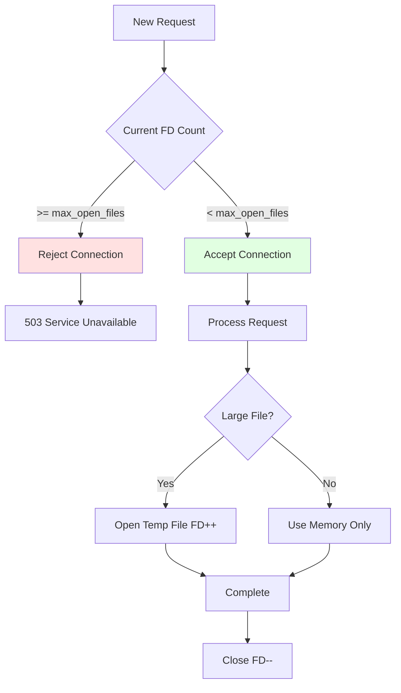

# Configuration Reference <!-- omit in toc -->

Complete reference for all configuration options in `config.toml`.

- [File Location](#file-location)
- [Configuration Loading Priority](#configuration-loading-priority)
- [Server Configuration](#server-configuration)
  - [`[server]`](#server)
    - [`server.host`](#serverhost)
    - [`server.port`](#serverport)
    - [`server.max_connections`](#servermax_connections)
    - [`server.backlog`](#serverbacklog)
    - [`server.max_open_files`](#servermax_open_files)
- [Timeout Configuration](#timeout-configuration)
  - [`[server.timeouts]`](#servertimeouts)
    - [`server.timeouts.read_timeout_secs`](#servertimeoutsread_timeout_secs)
    - [`server.timeouts.write_timeout_secs`](#servertimeoutswrite_timeout_secs)
    - [`server.timeouts.analysis_timeout_secs`](#servertimeoutsanalysis_timeout_secs)
    - [`server.timeouts.keepalive_secs`](#servertimeoutskeepalive_secs)
- [Request Limits](#request-limits)
  - [`[server.limits]`](#serverlimits)
    - [`server.limits.max_body_size_mb`](#serverlimitsmax_body_size_mb)
    - [`server.limits.max_uri_length`](#serverlimitsmax_uri_length)
    - [`server.limits.max_header_size`](#serverlimitsmax_header_size)
- [Sandbox Configuration](#sandbox-configuration)
  - [`[sandbox]`](#sandbox)
    - [`sandbox.base_dir`](#sandboxbase_dir)
- [Authentication Configuration](#authentication-configuration)
  - [`[auth]`](#auth)
    - [`auth.username`](#authusername)
    - [`auth.password`](#authpassword)
- [Analysis Configuration](#analysis-configuration)
  - [`[analysis]`](#analysis)
    - [`analysis.large_file_threshold_mb`](#analysislarge_file_threshold_mb)
    - [`analysis.write_buffer_size_kb`](#analysiswrite_buffer_size_kb)
    - [`analysis.temp_dir`](#analysistemp_dir)
    - [`analysis.min_free_space_mb`](#analysismin_free_space_mb)
    - [`analysis.temp_file_max_age_secs`](#analysistemp_file_max_age_secs)
    - [`analysis.mmap_fallback_enabled`](#analysismmap_fallback_enabled)
- [Magic Database Configuration](#magic-database-configuration)
  - [`[magic]`](#magic)
    - [`magic.database_path`](#magicdatabase_path)
- [Logging Configuration](#logging-configuration)
  - [`[logging]`](#logging)
    - [`logging.level`](#logginglevel)
    - [`logging.format`](#loggingformat)
- [Complete Configuration Example](#complete-configuration-example)
  - [Minimal Configuration](#minimal-configuration)
  - [Full Configuration with All Options](#full-configuration-with-all-options)
  - [Development Configuration](#development-configuration)
  - [Production Configuration](#production-configuration)
- [Environment Variable Reference](#environment-variable-reference)
- [Configuration Validation](#configuration-validation)
- [Security Best Practices](#security-best-practices)
- [Troubleshooting](#troubleshooting)
  - [Configuration File Not Found](#configuration-file-not-found)
  - [Invalid Configuration Value](#invalid-configuration-value)
  - [Sandbox Directory Issues](#sandbox-directory-issues)
  - [Port Already in Use](#port-already-in-use)
- [Related Documentation](#related-documentation)


## File Location

| Environment | Default Path | Override |
|-------------|-------------|----------|
| Development | `./config/config.toml` | `MAGICER_CONFIG_PATH` |
| Production | `/etc/magicer/config.toml` | `MAGICER_CONFIG_PATH` |

## Configuration Loading Priority

1. **Environment Variables** (highest priority)
2. **TOML Configuration File**
3. **Default Values** (lowest priority)

---

## Server Configuration

### `[server]`

Main server settings for network binding and connection management.

#### `server.host`

**Type:** String  
**Default:** "127.0.0.1"  
**Environment:** `MAGICER_HOST`  
**Description:** IP address to bind the HTTP server. Typical values are "0.0.0.0" to bind to all interfaces or "127.0.0.1" for local access only.

#### `server.port`

**Type:** Unsigned 16-bit integer  
**Default:** 8080  
**Environment:** `MAGICER_PORT`  
**Description:** TCP port number for the HTTP server. Valid range is 1 to 65535.

#### `server.max_connections`

**Type:** Unsigned integer  
**Default:** 1000  
**Description:** Maximum number of concurrent active TCP connections. Connections exceeding this limit enter the backlog queue.

#### `server.backlog`

**Type:** Unsigned 32-bit integer  
**Default:** 1024  
**Description:** OS-level TCP listen queue size for pending connections.

#### `server.max_open_files`

**Type:** Unsigned integer  
**Default:** 4096  
**Environment:** `MAGICER_MAX_OPEN_FILES`  
**Description:** Maximum number of file descriptors the server process can have open simultaneously. This setting helps prevent file descriptor exhaustion by enabling an application-level limit.

**File Descriptor Usage Breakdown:**
Every request typically consumes one socket descriptor. Large file analysis may consume an additional file descriptor for the temporary file. The total limit should also account for system overhead such as log handles and configuration files.

**System Configuration Requirements:**
This value must be less than or equal to the system-level limit. On Linux, current limits can be inspected and modified using the standard `ulimit` command or by configuring the security limits file.

**Handling Limit Exhaustion:**
When the limit is reached, the server rejects new connections with a 503 Service Unavailable status. If a temporary file cannot be created due to resource exhaustion, it results in a 500 Internal Server Error.

**Behavior:**



**Error Scenarios:**

| Condition | Response | Error Message | Action |
|-----------|----------|---------------|--------|
| FD limit reached | 503 Service Unavailable | "Too many open files" | Reject new connections |
| Temp file creation fails | 500 Internal Server Error | "Failed to create temp file: too many open files" | Return error |
| System limit exceeded | Startup failure | "Cannot increase FD limit to {value}" | Exit with error |

**Monitoring:**

Critical metrics:
- `open_file_descriptors` - Gauge of current FD count
- `max_open_files` - Gauge of configured limit
- `fd_limit_rejections_total` - Counter of 503 responses
- `fd_usage_percentage` - Gauge: `(current / max) × 100`

**Alerts:**

| Alert | Threshold | Action |
|-------|-----------|--------|
| High FD usage | > 80% of max | Investigate FD leaks |
| Critical FD usage | > 95% of max | Increase limit or reduce connections |
| Rejections | > 0 in 5 min | Immediate investigation |

**Validation:**

Startup checks:
1. `max_open_files <= system ulimit` - Warn if exceeds system
2. `max_open_files >= (max_connections × 2)` - Warn if too low
3. Value is positive integer
4. Attempt to set limit at startup, fail if unable

**Platform-Specific Notes:**

**Linux:**
- Default: 1024 (soft), 4096 (hard)
- Increase via `/etc/security/limits.conf`
- Check: `cat /proc/sys/fs/file-max` (system-wide)
- Per-process: `cat /proc/<pid>/limits`

**Systemd:**
- Set via `LimitNOFILE=4096` in unit file
- Overrides `ulimit` settings

**Docker:**
- Set via `--ulimit nofile=4096:65536` in `docker run`
- Or in docker-compose: `ulimits: nofile: { soft: 4096, hard: 65536 }`

**Troubleshooting:**

**Error: "Too many open files"**

```bash
# Check current usage
lsof -p <pid> | wc -l

# Check limit
cat /proc/<pid>/limits | grep "open files"

# Increase limit
ulimit -n 8192

# Verify
ulimit -n
```

**Related Settings:**

- `server.max_connections` - Must be < `max_open_files / 2`
- `analysis.temp_dir` - Temp files consume FDs
- System: `ulimit -n`, `/proc/sys/fs/file-max`

**Example:**

Development:
```toml
[server]
max_open_files = 1024
```

Standard production:
```toml
[server]
max_open_files = 4096
```

High-traffic production:
```toml
[server]
max_open_files = 8192
```

---

## Timeout Configuration

### `[server.timeouts]`

Timeout values controlling request/response lifecycle.

#### `server.timeouts.read_timeout_secs`

**Type:** Unsigned 64-bit integer  
**Default:** 60  
**Unit:** Seconds  
**Description:** Maximum time allowed to receive a complete HTTP request, including headers and body. This helps prevent slow-read denial of service attacks.

#### `server.timeouts.write_timeout_secs`

**Type:** Unsigned 64-bit integer  
**Default:** 60  
**Unit:** Seconds  
**Description:** Maximum time allowed to transmit the full HTTP response to the client. This protects against slow-send attacks and prevents resource exhaustion.

#### `server.timeouts.analysis_timeout_secs`

**Type:** Unsigned 64-bit integer  
**Default:** 30  
**Unit:** Seconds  
**Description:** Maximum time allocated for the libmagic file analysis operation. This prevents the server from blocking indefinitely on complex or malformed files.

#### `server.timeouts.keepalive_secs`

**Type:** Unsigned 64-bit integer  
**Default:** 75  
**Unit:** Seconds  
**Description:** HTTP keep-alive timeout for idle connections. This setting balances the benefits of connection reuse against the cost of maintaining idle resources.

---

## Request Limits

### `[server.limits]`

Size constraints for HTTP requests.

#### `server.limits.max_body_size_mb`

**Type:** Unsigned 64-bit integer  
**Default:** 100  
**Unit:** Megabytes  
**Description:** Maximum allowed size for the HTTP request body. This constraint prevents memory exhaustion and storage overflow from excessively large payloads.

#### `server.limits.max_uri_length`

**Type:** Unsigned integer  
**Default:** 8192  
**Unit:** Bytes  
**Description:** Maximum length of the request URI, including all query parameters. This limit protects against certain types of buffer overflow and resource consumption attacks.

#### `server.limits.max_header_size`

**Type:** Unsigned integer  
**Default:** 16384  
**Unit:** Bytes  
**Description:** Maximum total size allowed for all HTTP request headers. This helps prevent header-based denial of service attacks.

---

## Sandbox Configuration

### `[sandbox]`

File system access restrictions for path-based analysis.

#### `sandbox.base_dir`

**Type:** Absolute Path String  
**Default:** "/var/lib/magicer/files"  
**Environment:** `MAGICER_SANDBOX_DIR`  
**Description:** The root directory for all path-based file operations. The server process must have read permissions for this directory. For security, all relative paths provided in API requests are resolved strictly within this boundary.

---

## Authentication Configuration

### `[auth]`

HTTP Basic Authentication settings.

#### `auth.username`

**Type:** String  
**Default:** None (Required)  
**Environment:** `MAGICER_AUTH_USERNAME`  
**Description:** The username required for HTTP Basic Authentication on protected endpoints.

#### `auth.password`

**Type:** String  
**Default:** None (Required)  
**Environment:** `MAGICER_AUTH_PASSWORD`  
**Description:** The password required for HTTP Basic Authentication. Credentials are compared using a constant-time algorithm to prevent timing attacks.

**Security Recommendation**: In production environments, it is strongly recommended to provide the password via the environment variable rather than storing it in the configuration file.

---

## Analysis Configuration

### `[analysis]`

File analysis behavior settings.

#### `analysis.large_file_threshold_mb`

**Type:** Unsigned 64-bit integer  
**Default:** 10  
**Unit:** Megabytes  
**Description:** The size threshold at which the server switches from in-memory analysis to file-based streaming and memory-mapped I/O. Lower values reduce memory pressure but increase disk I/O.

#### `analysis.write_buffer_size_kb`

**Type:** Unsigned 64-bit integer  
**Default:** 64  
**Unit:** Kilobytes  
**Description:** The size of the buffer used when streaming request content to temporary files. Optimal values vary based on the storage medium (e.g., SSD vs. HDD).

#### `analysis.temp_dir`

**Type:** Absolute Path String  
**Default:** "/tmp/magicer"  
**Description:** The directory where temporary files are stored during large content analysis. The server must have write permissions for this directory. Using a memory-based filesystem (tmpfs) can significantly improve performance.

#### `analysis.min_free_space_mb`

**Type:** Unsigned 64-bit integer  
**Default:** 1024  
**Unit:** Megabytes  
**Environment:** `MAGICER_MIN_FREE_SPACE_MB`  
**Description:** Minimum free disk space required in the temporary directory before accepting large analysis requests.

**Pre-flight Logic:**
Before starting a large file analysis, the server checks the available space in the temporary directory using system calls (e.g., `statvfs`). If the available space is less than this threshold, the request is rejected immediately with a 507 Insufficient Storage status. This prevents disk exhaustion and partial writes that would inevitably fail.

#### `analysis.temp_file_max_age_secs`

**Type:** Unsigned 64-bit integer  
**Default:** 3600 (1 hour)  
**Unit:** Seconds  
**Environment:** `MAGICER_TEMP_FILE_MAX_AGE_SECS`  
**Description:** The maximum age for temporary files before they are considered orphaned and eligible for automatic cleanup.

**Cleanup Process:**
A background task scans the temporary directory periodically (every 5 minutes) and removes files older than this threshold. This handles orphaned files resulting from server crashes or ungraceful shutdowns. A similar cleanup process also occurs during server startup.

#### `analysis.mmap_fallback_enabled`

**Type:** Boolean  
**Default:** true  
**Environment:** `MAGICER_MMAP_FALLBACK_ENABLED`  
**Description:** Whether to allow falling back to traditional buffer-based analysis if memory-mapping the temporary file fails.

**Availability and Performance:**
When enabled, the server will attempt to read the entire file into memory if `mmap` fails due to system limits or filesystem constraints. This improves overall availability at the cost of a temporary memory spike. If disabled, the server will return a 500 or 507 error immediately upon `mmap` failure.

---

## Magic Database Configuration

### `[magic]`

libmagic library settings.

#### `magic.database_path`

**Type:** Optional Absolute Path String  
**Default:** System default (typically "/usr/share/misc/magic.mgc")  
**Description:** Path to a custom magic database file. If omitted, the server uses the default database provided by the system's `libmagic` installation. This is useful for providing custom file detection rules or using a more recent database version.

---

## Logging Configuration

### `[logging]`

Logging behavior and output format.

#### `logging.level`

**Type:** String  
**Default:** "info"  
**Environment:** `RUST_LOG`  
**Description:** The verbosity level for system logs. Valid values include "error", "warn", "info", "debug", and "trace". Advanced filtering can also be applied through the environment variable to set different levels for specific modules or external libraries.

#### `logging.format`

**Type:** String  
**Default:** "json"  
**Environment:** `MAGICER_LOG_FORMAT`  
**Description:** The output format for logs. Standard options include "json" for structured production logging, "pretty" for human-readable development output, and "compact" for minimal console messaging.

---

## Configuration Deployment Scenarios

### Development Environment
For local development, the server is typically configured to bind to localhost with human-readable "pretty" logging. Resource limits are kept low, and fast cleanup of temporary files is enabled to facilitate rapid testing cycles. Fallback mechanisms are often disabled to ensure any system misconfigurations are caught immediately.

### Production Environment
In production, the server binds to all interfaces and uses structured JSON logging for integration with centralized logging systems. Resource limits like max connections and file descriptors are tuned for high performance. Timeouts are set more aggressively, and memory-mapped fallback is enabled to maximize service availability.

---

## Environment Variable Reference

The server supports overriding any configuration setting through environment variables. These variables follow a standard naming convention, typically prefixed with `MAGICER_`. For example, `MAGICER_PORT` overrides the server port, and `MAGICER_SANDBOX_DIR` sets the sandbox root directory. A complete list of supported variables can be found in the system's environment mapping documentation.

## Configuration Validation

The server performs a comprehensive validation check during the startup sequence. This ensures that:
- **Critical Settings**: Authentication credentials and the sandbox directory are provided and valid.
- **System Integrity**: Port numbers are in the allowed range, and all specified paths are absolute and accessible.
- **Limit Constraints**: All timeout and size constraints are positive and within functional bounds.

If any validation check fails, the server exits immediately with a descriptive error message, preventing it from running in an insecure or non-functional state.

## Security Best Practices

1. **Secret Management**: Never store production passwords in the configuration file. Use environment variables or a secure secrets manager.
2. **File Permissions**: Ensure the configuration file itself has restricted permissions (read-only for the service user).
3. **Sandbox Isolation**: Always use absolute paths for the sandbox directory and ensure it is properly isolated from sensitive system files.
4. **Monitoring**: Regularly review log verbosity and timeout settings based on observed traffic patterns.

---

## Troubleshooting

### Configuration File Not Found

**Error:** `Failed to load configuration file`

**Solution:**
- Check file exists at default location
- Use `MAGICER_CONFIG_PATH` to specify custom location
- Verify file permissions (must be readable by server process)

### Invalid Configuration Value

**Error:** `Configuration validation failed`

**Solution:**
- Check all required fields are present
- Verify value types match specification
- Ensure numeric values are within valid ranges

### Sandbox Directory Issues

**Error:** `Sandbox directory does not exist` or `Permission denied`

**Solution:**
- Create directory: `mkdir -p /var/lib/magicer/files`
- Set permissions: `chown magicer:magicer /var/lib/magicer/files`
- Verify path is absolute, not relative

### Port Already in Use

**Error:** `Address already in use`

**Solution:**
- Change `server.port` to different value
- Stop conflicting process using the port
- Use reverse proxy on port 80/443

---

## Related Documentation

- [Deployment Guide](../how-to-guides/DEPLOYMENT.md) - Production deployment with configuration
- [HTTP Server Specification](HTTP_SERVER.md) - Server behavior and limits
- [Architecture Design](../explanation/ARCHITECTURE.md) - Configuration loading strategy
