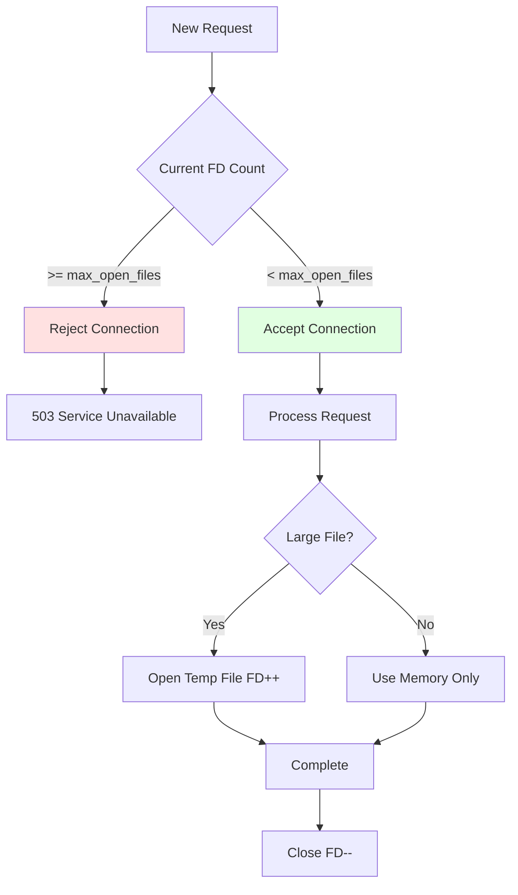
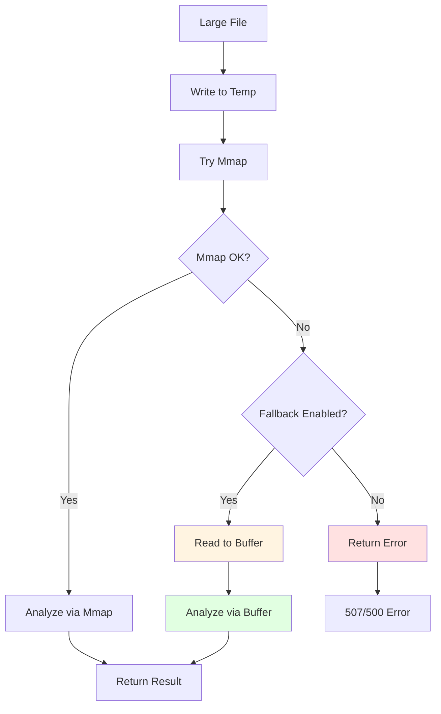

# Configuration Reference <!-- omit in toc -->

Complete reference for all configuration options in `config.toml`.

- [File Location](#file-location)
- [Configuration Loading Priority](#configuration-loading-priority)
- [Server Configuration](#server-configuration)
  - [`[server]`](#server)
    - [`server.host`](#serverhost)
    - [`server.port`](#serverport)
    - [`server.max_connections`](#servermax_connections)
    - [`server.backlog`](#serverbacklog)
    - [`server.max_open_files`](#servermax_open_files)
- [Timeout Configuration](#timeout-configuration)
  - [`[server.timeouts]`](#servertimeouts)
    - [`server.timeouts.read_timeout_secs`](#servertimeoutsread_timeout_secs)
    - [`server.timeouts.write_timeout_secs`](#servertimeoutswrite_timeout_secs)
    - [`server.timeouts.analysis_timeout_secs`](#servertimeoutsanalysis_timeout_secs)
    - [`server.timeouts.keepalive_secs`](#servertimeoutskeepalive_secs)
- [Request Limits](#request-limits)
  - [`[server.limits]`](#serverlimits)
    - [`server.limits.max_body_size_mb`](#serverlimitsmax_body_size_mb)
    - [`server.limits.max_uri_length`](#serverlimitsmax_uri_length)
    - [`server.limits.max_header_size`](#serverlimitsmax_header_size)
- [Sandbox Configuration](#sandbox-configuration)
  - [`[sandbox]`](#sandbox)
    - [`sandbox.base_dir`](#sandboxbase_dir)
- [Authentication Configuration](#authentication-configuration)
  - [`[auth]`](#auth)
    - [`auth.username`](#authusername)
    - [`auth.password`](#authpassword)
- [Analysis Configuration](#analysis-configuration)
  - [`[analysis]`](#analysis)
    - [`analysis.large_file_threshold_mb`](#analysislarge_file_threshold_mb)
    - [`analysis.write_buffer_size_kb`](#analysiswrite_buffer_size_kb)
    - [`analysis.temp_dir`](#analysistemp_dir)
    - [`analysis.min_free_space_mb`](#analysismin_free_space_mb)
    - [`analysis.temp_file_max_age_secs`](#analysistemp_file_max_age_secs)
    - [`analysis.mmap_fallback_enabled`](#analysismmap_fallback_enabled)
- [Magic Database Configuration](#magic-database-configuration)
  - [`[magic]`](#magic)
    - [`magic.database_path`](#magicdatabase_path)
- [Logging Configuration](#logging-configuration)
  - [`[logging]`](#logging)
    - [`logging.level`](#logginglevel)
    - [`logging.format`](#loggingformat)
- [Complete Configuration Example](#complete-configuration-example)
  - [Minimal Configuration](#minimal-configuration)
  - [Full Configuration with All Options](#full-configuration-with-all-options)
  - [Development Configuration](#development-configuration)
  - [Production Configuration](#production-configuration)
- [Environment Variable Reference](#environment-variable-reference)
- [Configuration Validation](#configuration-validation)
- [Security Best Practices](#security-best-practices)
- [Troubleshooting](#troubleshooting)
  - [Configuration File Not Found](#configuration-file-not-found)
  - [Invalid Configuration Value](#invalid-configuration-value)
  - [Sandbox Directory Issues](#sandbox-directory-issues)
  - [Port Already in Use](#port-already-in-use)
- [Related Documentation](#related-documentation)


## File Location

| Environment | Default Path | Override |
|-------------|-------------|----------|
| Development | `./config/config.toml` | `MAGICER_CONFIG_PATH` |
| Production | `/etc/magicer/config.toml` | `MAGICER_CONFIG_PATH` |

## Configuration Loading Priority

1. **Environment Variables** (highest priority)
2. **TOML Configuration File**
3. **Default Values** (lowest priority)

---

## Server Configuration

### `[server]`

Main server settings for network binding and connection management.

#### `server.host`

**Type:** String  
**Default:** `"0.0.0.0"`  
**Environment:** `MAGICER_HOST`  
**Description:** IP address to bind the HTTP server.

**Valid Values:**
- `"0.0.0.0"` - Bind to all network interfaces
- `"127.0.0.1"` - Localhost only
- Any valid IPv4 address

**Example:**
```toml
[server]
host = "0.0.0.0"
```

#### `server.port`

**Type:** Unsigned integer (u16)  
**Default:** `8080`  
**Environment:** `MAGICER_PORT`  
**Description:** TCP port number for HTTP server.

**Valid Range:** 1 - 65535  
**Recommended:** 8080 (development), 80/443 (production with reverse proxy)

**Example:**
```toml
[server]
port = 8080
```

#### `server.max_connections`

**Type:** Unsigned integer (usize)  
**Default:** `1000`  
**Description:** Maximum number of concurrent active TCP connections.

**Valid Range:** 1 - 10000  
**Note:** Connections exceeding this limit enter the backlog queue.

**Example:**
```toml
[server]
max_connections = 1000
```

#### `server.backlog`

**Type:** Unsigned integer (u32)  
**Default:** `1024`  
**Description:** OS-level TCP listen queue size for pending connections.

**Valid Range:** 1 - 65535  
**Note:** Connections exceeding backlog are refused by the OS.

**Example:**
```toml
[server]
backlog = 1024
```

#### `server.max_open_files`

**Type:** Unsigned integer (usize)  
**Default:** `4096`  
**Environment:** `MAGICER_MAX_OPEN_FILES`  
**Description:** Maximum number of file descriptors (FDs) the server process can have open simultaneously.

**Valid Range:** 1024 - 65536  
**Recommended:** 4096 (production), matches common `ulimit -n` defaults

**Purpose:**

Prevent file descriptor exhaustion by:
- Setting application-level limit
- Enabling graceful degradation (503 errors instead of crashes)
- Providing visibility into FD usage

**File Descriptor Usage Breakdown:**

| Resource | FDs per Request | Max Concurrent | Estimated FDs |
|----------|----------------|----------------|---------------|
| **TCP Socket** | 1 | 1000 | 1000 |
| **Temp File** | 0-1 | ~500 (50% large) | 500 |
| **Mmap** | 0-1 (included in temp) | ~500 | 0 (reuses FD) |
| **System Files** | - | - | ~100 (stdout, logs, etc.) |
| **Total** | - | - | **~1600** |

**Calculation for Your Environment:**

```
Required FDs = (max_connections × socket_multiplier) + 
               (large_file_percentage × max_connections) + 
               system_overhead

Example:
= (1000 × 1) + (0.5 × 1000) + 100
= 1000 + 500 + 100
= 1600 FDs minimum
```

**Recommended Values:**

| Environment | max_connections | Recommended max_open_files | Reasoning |
|-------------|----------------|---------------------------|-----------|
| Development | 100 | 1024 | Minimal testing |
| Production (low) | 1000 | 4096 | 2.5x safety margin |
| Production (high) | 2000 | 8192 | 2x safety margin for 2000 connections |
| Testing | 10 | 256 | Rapid cycles |

**Safety Margin:**

Always set `max_open_files >= 2 × estimated_fd_usage` to account for:
- Concurrent request spikes
- Background cleanup tasks
- Logging file handles
- Library internal usage

**System Limit Check:**

This setting must be ≤ system ulimit:

```bash
# Check system limit
ulimit -n
# Output: 1024 (default on many systems)

# Increase system limit (temporary)
ulimit -n 4096

# Increase system limit (permanent) - add to /etc/security/limits.conf
* soft nofile 4096
* hard nofile 65536
```

**Behavior:**



**Error Scenarios:**

| Condition | Response | Error Message | Action |
|-----------|----------|---------------|--------|
| FD limit reached | 503 Service Unavailable | "Too many open files" | Reject new connections |
| Temp file creation fails | 500 Internal Server Error | "Failed to create temp file: too many open files" | Return error |
| System limit exceeded | Startup failure | "Cannot increase FD limit to {value}" | Exit with error |

**Monitoring:**

Critical metrics:
- `open_file_descriptors` - Gauge of current FD count
- `max_open_files` - Gauge of configured limit
- `fd_limit_rejections_total` - Counter of 503 responses
- `fd_usage_percentage` - Gauge: `(current / max) × 100`

**Alerts:**

| Alert | Threshold | Action |
|-------|-----------|--------|
| High FD usage | > 80% of max | Investigate FD leaks |
| Critical FD usage | > 95% of max | Increase limit or reduce connections |
| Rejections | > 0 in 5 min | Immediate investigation |

**Validation:**

Startup checks:
1. `max_open_files <= system ulimit` - Warn if exceeds system
2. `max_open_files >= (max_connections × 2)` - Warn if too low
3. Value is positive integer
4. Attempt to set limit at startup, fail if unable

**Platform-Specific Notes:**

**Linux:**
- Default: 1024 (soft), 4096 (hard)
- Increase via `/etc/security/limits.conf`
- Check: `cat /proc/sys/fs/file-max` (system-wide)
- Per-process: `cat /proc/<pid>/limits`

**Systemd:**
- Set via `LimitNOFILE=4096` in unit file
- Overrides `ulimit` settings

**Docker:**
- Set via `--ulimit nofile=4096:65536` in `docker run`
- Or in docker-compose: `ulimits: nofile: { soft: 4096, hard: 65536 }`

**Troubleshooting:**

**Error: "Too many open files"**

```bash
# Check current usage
lsof -p <pid> | wc -l

# Check limit
cat /proc/<pid>/limits | grep "open files"

# Increase limit
ulimit -n 8192

# Verify
ulimit -n
```

**Related Settings:**

- `server.max_connections` - Must be < `max_open_files / 2`
- `analysis.temp_dir` - Temp files consume FDs
- System: `ulimit -n`, `/proc/sys/fs/file-max`

**Example:**

Development:
```toml
[server]
max_open_files = 1024
```

Standard production:
```toml
[server]
max_open_files = 4096
```

High-traffic production:
```toml
[server]
max_open_files = 8192
```

---

## Timeout Configuration

### `[server.timeouts]`

Timeout values controlling request/response lifecycle.

#### `server.timeouts.read_timeout_secs`

**Type:** Unsigned integer (u64)  
**Default:** `60`  
**Unit:** Seconds  
**Description:** Maximum time to receive complete HTTP request (headers + body).

**Valid Range:** 1 - 600  
**Purpose:** Prevent slow-read DoS attacks.

**Example:**
```toml
[server.timeouts]
read_timeout_secs = 60
```

#### `server.timeouts.write_timeout_secs`

**Type:** Unsigned integer (u64)  
**Default:** `60`  
**Unit:** Seconds  
**Description:** Maximum time to send complete HTTP response to client.

**Valid Range:** 1 - 600  
**Purpose:** Prevent slow-send attacks and resource exhaustion.

**Example:**
```toml
[server.timeouts]
write_timeout_secs = 60
```

#### `server.timeouts.analysis_timeout_secs`

**Type:** Unsigned integer (u64)  
**Default:** `30`  
**Unit:** Seconds  
**Description:** Maximum time for libmagic file analysis operation.

**Valid Range:** 1 - 300  
**Purpose:** Prevent indefinite blocking on complex files.

**Example:**
```toml
[server.timeouts]
analysis_timeout_secs = 30
```

#### `server.timeouts.keepalive_secs`

**Type:** Unsigned integer (u64)  
**Default:** `75`  
**Unit:** Seconds  
**Description:** HTTP keep-alive timeout for idle connections.

**Valid Range:** 1 - 600  
**Purpose:** Balance connection reuse with resource cleanup.

**Example:**
```toml
[server.timeouts]
keepalive_secs = 75
```

---

## Request Limits

### `[server.limits]`

Size constraints for HTTP requests.

#### `server.limits.max_body_size_mb`

**Type:** Unsigned integer (u64)  
**Default:** `100`  
**Unit:** Megabytes  
**Description:** Maximum HTTP request body size.

**Valid Range:** 1 - 1024  
**Purpose:** Prevent memory exhaustion from large payloads.

**Example:**
```toml
[server.limits]
max_body_size_mb = 100
```

#### `server.limits.max_uri_length`

**Type:** Unsigned integer (usize)  
**Default:** `8192`  
**Unit:** Bytes  
**Description:** Maximum URI length including query parameters.

**Valid Range:** 256 - 65536  
**Purpose:** Prevent buffer overflow attacks.

**Example:**
```toml
[server.limits]
max_uri_length = 8192
```

#### `server.limits.max_header_size`

**Type:** Unsigned integer (usize)  
**Default:** `16384`  
**Unit:** Bytes  
**Description:** Maximum total size of all HTTP request headers.

**Valid Range:** 1024 - 65536  
**Purpose:** Prevent header-based DoS attacks.

**Example:**
```toml
[server.limits]
max_header_size = 16384
```

---

## Sandbox Configuration

### `[sandbox]`

File system access restrictions for path-based analysis.

#### `sandbox.base_dir`

**Type:** String (absolute path)  
**Default:** `/var/lib/magicer/files`  
**Environment:** `MAGICER_SANDBOX_DIR`  
**Description:** Root directory for all file path operations.

**Requirements:**
- Must be an absolute path
- Directory must exist and be readable
- Server process must have appropriate permissions

**Security:** All relative paths in API requests are resolved within this directory.

**Example:**
```toml
[sandbox]
base_dir = "/var/lib/magicer/files"
```

---

## Authentication Configuration

### `[auth]`

HTTP Basic Authentication settings.

#### `auth.username`

**Type:** String  
**Default:** None (required)  
**Environment:** `MAGICER_AUTH_USERNAME`  
**Description:** Username for HTTP Basic Authentication.

**Requirements:**
- Non-empty string
- Must match client-provided username

**Example:**
```toml
[auth]
username = "api_user"
```

#### `auth.password`

**Type:** String  
**Default:** None (required)  
**Environment:** `MAGICER_AUTH_PASSWORD`  
**Description:** Password for HTTP Basic Authentication.

**Requirements:**
- Non-empty string
- Stored in plain text (use environment variable in production)
- Compared using constant-time algorithm

**Security Recommendation:** Use `MAGICER_AUTH_PASSWORD` environment variable instead of storing in TOML file.

**Example:**
```toml
[auth]
password = "secret_password"
```

---

## Analysis Configuration

### `[analysis]`

File analysis behavior settings.

#### `analysis.large_file_threshold_mb`

**Type:** Unsigned integer (u64)  
**Default:** `10`  
**Unit:** Megabytes  
**Description:** Size threshold above which content is streamed to temporary file instead of analyzed in memory.

**Valid Range:** 1 - 100  
**Purpose:** Reduce memory consumption for large file analysis.

**Trade-offs:**
- **Lower values** - Less memory usage, more disk I/O
- **Higher values** - More memory usage, less disk I/O

**Example:**
```toml
[analysis]
large_file_threshold_mb = 10
```

#### `analysis.write_buffer_size_kb`

**Type:** Unsigned integer (u64)  
**Default:** `64`  
**Unit:** Kilobytes  
**Description:** Buffer size for streaming content to temporary files.

**Valid Range:** 4 - 1024  
**Purpose:** Control memory vs I/O performance trade-off when writing temporary files.

**Recommended:**
- Fast disks (SSD): 64-128 KB
- Slow disks (HDD): 256-512 KB
- Network storage: 128-256 KB

**Example:**
```toml
[analysis]
write_buffer_size_kb = 64
```

#### `analysis.temp_dir`

**Type:** String (absolute path)  
**Default:** `/tmp/magicer`  
**Description:** Directory for temporary files during large content analysis.

**Requirements:**
- Must be an absolute path
- Directory must exist or be creatable
- Server process must have write permissions
- Should be on a filesystem with sufficient space

**Recommendations:**
- Use tmpfs for performance (if sufficient RAM)
- Ensure at least 10GB free space for production
- Separate from main data directories

**Example:**
```toml
[analysis]
temp_dir = "/tmp/magicer"
```

#### `analysis.min_free_space_mb`

**Type:** Unsigned integer (u64)  
**Default:** `1024`  
**Unit:** Megabytes  
**Environment:** `MAGICER_MIN_FREE_SPACE_MB`  
**Description:** Minimum free disk space required in temp directory before accepting large file analysis requests.

**Valid Range:** 100 - 102400 (100MB - 100GB)  
**Recommended:** 1024 MB (1 GB) for production

**Purpose:**

Pre-flight disk space check to prevent:
- Disk exhaustion during file streaming
- Partial file writes that fail mid-operation
- System-wide storage issues
- Cascading failures from full disk

**Behavior:**

1. **Pre-flight Check:** Before creating temp file, server checks available space in temp directory
2. **Threshold Comparison:** If `available_space < min_free_space_mb`, request is rejected immediately
3. **Error Response:** Client receives `507 Insufficient Storage` with clear error message
4. **No Temp File Created:** Prevents wasting I/O on doomed operations

**Space Calculation:**

Uses `statvfs()` system call to determine:
- Available space = `f_bavail * f_frsize` (available to non-root)
- Converts to MB for threshold comparison
- Additional check: `available >= (content_size + threshold)` for safety margin

**Error Messages:**

Pre-flight check failure:
```json
{
  "error": "Insufficient storage space for analysis",
  "details": "Temp directory has 512MB available, but 1024MB minimum required",
  "request_id": "abc-123"
}
```

Disk full during write:
```json
{
  "error": "Disk space exhausted during file processing",
  "details": "Failed to write chunk at offset 52428800: No space left on device",
  "request_id": "abc-123"
}
```

**Sizing Guidance:**

| Environment | Recommended Value | Reasoning |
|-------------|------------------|-----------|
| Development | 512 MB | Lower threshold for testing |
| Production (low traffic) | 1024 MB (1 GB) | Safety margin for 10 concurrent 100MB files |
| Production (high traffic) | 5120 MB (5 GB) | Buffer for hundreds of concurrent requests |
| Network storage | 2048 MB (2 GB) | Account for delayed sync/flush |

**Trade-offs:**

- **Lower threshold:**
  - Accepts more requests when space is tight
  - Higher risk of mid-operation failures
  - More partial file cleanup overhead

- **Higher threshold:**
  - More conservative rejection policy
  - Better protection against disk exhaustion
  - May reject valid requests unnecessarily

**Storage Planning:**

For production deployment, ensure temp filesystem has:
- `min_free_space_mb` × 2 (safety margin)
- Plus expected concurrent requests × max file size
- Example: `1024MB × 2 + (100 concurrent × 100MB) = 12GB minimum`

**Monitoring:**

Key metrics:
- `disk_space_check_failures_total` - Pre-flight rejections
- `temp_dir_available_space_mb` - Current available space (gauge)
- `disk_space_write_failures_total` - Failures during streaming

**Related Settings:**

- `server.limits.max_body_size_mb` - Maximum request size (100MB)
- `analysis.large_file_threshold_mb` - When temp files are used (10MB)
- `analysis.temp_dir` - Location of temp files

**Validation:**

Startup checks:
- Value is positive integer
- Value >= 100 MB (sanity check)
- Temp directory is accessible
- Initial available space >= threshold (warning if not)

**Example:**

Minimal (development):
```toml
[analysis]
min_free_space_mb = 512
```

Standard (production):
```toml
[analysis]
min_free_space_mb = 1024
```

High traffic (production):
```toml
[analysis]
min_free_space_mb = 5120
```

#### `analysis.temp_file_max_age_secs`

**Type:** Unsigned integer (u64)  
**Default:** `3600` (1 hour)  
**Unit:** Seconds  
**Environment:** `MAGICER_TEMP_FILE_MAX_AGE_SECS`  
**Description:** Maximum age for temporary files before considered orphaned and eligible for cleanup.

**Valid Range:** 300 - 86400 (5 minutes - 24 hours)  
**Recommended:** 3600 seconds (1 hour) for production

**Purpose:**

Automatic cleanup of orphaned temporary files that remain after:
- Server crashes (SIGKILL, power loss)
- Panics during analysis
- Ungraceful shutdowns
- Failed cleanup operations

**Behavior:**

1. **Background Cleanup Task:** Runs every 5 minutes
2. **Age Check:** Files older than threshold are deleted
3. **Safety Margin:** Default 1 hour provides buffer for long-running analysis
4. **Startup Cleanup:** Server scans temp directory on startup and removes old files

**How Age is Calculated:**

```
age = current_time - file_creation_time (mtime)
if age > temp_file_max_age_secs:
    delete_file()
```

**Use Cases:**

| Scenario | File Age | Action |
|----------|----------|--------|
| Normal operation | < 1 min | Active, not cleaned |
| Long analysis (valid) | 30 min | Active, not cleaned |
| Server crash orphan | 2 hours | Cleaned by background task |
| Startup orphan | 5 hours | Cleaned at startup |

**Sizing Guidance:**

| Environment | Recommended Value | Reasoning |
|-------------|------------------|-----------|
| Development | 600 (10 minutes) | Fast cleanup for testing |
| Production (fast) | 3600 (1 hour) | Default, safe for typical workloads |
| Production (slow) | 7200 (2 hours) | Large files with slow disk |
| Testing | 300 (5 minutes) | Minimal for test cycles |

**Trade-offs:**

- **Lower threshold:**
  - Faster cleanup of orphaned files
  - Less disk space wasted
  - Risk: May delete files from slow operations

- **Higher threshold:**
  - More safety margin for legitimate operations
  - More disk space temporarily used
  - Slower cleanup of true orphans

**Cleanup Process:**

```mermaid
stateDiagram-v2
    [*] --> Scan: Background task (5 min)
    Scan --> Check: For each file
    Check --> Age{Age check}
    Age -->|< threshold| Skip: Keep file
    Age -->|> threshold| Delete: Remove file
    Delete --> Log: Log deletion
    Skip --> Next: Next file
    Log --> Next
    Next --> Check: More files?
    Next --> [*]: Complete
```

**Monitoring:**

Metrics to track:
- `orphaned_files_cleaned_total` - Counter for cleaned files
- `orphaned_files_found` - Gauge for files found during scan
- `cleanup_task_duration_seconds` - Histogram for cleanup time

**Related Settings:**

- `analysis.temp_dir` - Location of temporary files to scan
- `server.timeouts.analysis_timeout_secs` - Maximum legitimate file age during analysis

**Validation:**

Startup checks:
- Value is positive integer
- Value >= 300 seconds (minimum 5 minutes)
- Warning if value < analysis timeout (files could be prematurely deleted)

**Example:**

Standard (production):
```toml
[analysis]
temp_file_max_age_secs = 3600  # 1 hour
```

Conservative (slow storage):
```toml
[analysis]
temp_file_max_age_secs = 7200  # 2 hours
```

Aggressive (testing):
```toml
[analysis]
temp_file_max_age_secs = 300  # 5 minutes
```

#### `analysis.mmap_fallback_enabled`

**Type:** Boolean  
**Default:** `true`  
**Environment:** `MAGICER_MMAP_FALLBACK_ENABLED`  
**Description:** Enable fallback to buffer-based analysis if memory mapping fails.

**Purpose:**

Improve availability by gracefully degrading when mmap operations fail due to:
- Resource limits (max memory maps exceeded)
- File system limitations (network mounts)
- Platform-specific issues
- Kernel restrictions

**Behavior:**

1. **Mmap Attempt:** Try to memory map temp file
2. **On Failure:** If `mmap_fallback_enabled = true`, read file into buffer
3. **Analysis:** Proceed with buffer-based analysis
4. **On Success:** Return result (client unaware of fallback)

**Flow Diagram:**



**Trade-offs:**

| Aspect | Enabled (true) | Disabled (false) |
|--------|---------------|------------------|
| **Availability** | Higher (graceful degradation) | Lower (fails on mmap error) |
| **Memory Usage** | Spikes to 100MB on fallback | Constant low usage |
| **Performance** | Slower on fallback | Consistent (fast or fail) |
| **Debugging** | Masks mmap issues | Exposes mmap issues immediately |

**When to Enable (true):**

- Production environments prioritizing availability
- Network-mounted temp directories
- Systems with unpredictable mmap limits
- When monitoring detects occasional mmap failures

**When to Disable (false):**

- Testing/development to catch mmap issues
- Systems with strict memory limits
- When mmap failures indicate misconfiguration
- Performance-critical deployments

**Error Handling:**

With fallback **enabled**:
```
1. Mmap fails → Log warning
2. Read to buffer → Log info "Using fallback"
3. Analyze buffer → Success
4. Metric: mmap_fallback_used_total++
```

With fallback **disabled**:
```
1. Mmap fails → Return error immediately
2. Client receives: 500 Internal Server Error
3. Log error: "Failed to memory map file: {cause}"
4. Metric: mmap_failures_total++
```

**Performance Impact:**

Fallback scenario (100MB file):
- Mmap approach: ~10ms + 100ms analysis = 110ms
- Fallback approach: ~500ms (read) + 100ms analysis = 600ms
- **5x slower** but completes successfully

**Monitoring:**

Required metrics when enabled:
- `mmap_fallback_used_total` - Counter for fallback usage
- `mmap_failures_total` - Counter for mmap failures
- `buffer_analysis_duration_seconds` - Histogram for fallback performance

**Alerts:**

If fallback used frequently:
- Alert: "Mmap fallback rate > 1% of requests"
- Action: Investigate mmap failures, tune limits
- Root cause: Resource limits, filesystem issues

**Related Settings:**

- `analysis.large_file_threshold_mb` - When mmap is attempted
- `server.limits.max_body_size_mb` - Maximum buffer size
- System: `ulimit -v` (virtual memory limit)

**Validation:**

- Boolean value (true/false)
- No range validation needed
- Warning if disabled in production

**Example:**

Production (availability first):
```toml
[analysis]
mmap_fallback_enabled = true
```

Development (fail fast):
```toml
[analysis]
mmap_fallback_enabled = false
```

---

## Magic Database Configuration

### `[magic]`

libmagic library settings.

#### `magic.database_path`

**Type:** String (optional, absolute path)  
**Default:** System default (`/usr/share/misc/magic.mgc`)  
**Description:** Path to custom magic database file.

**When to Use:**
- Custom file type detection rules
- Alternative magic database
- Testing with modified rules

**If Not Set:** Uses system-provided magic database.

**Example:**
```toml
[magic]
database_path = "/usr/local/share/magic/custom.mgc"
```

---

## Logging Configuration

### `[logging]`

Logging behavior and output format.

#### `logging.level`

**Type:** String  
**Default:** `"info"`  
**Environment:** `RUST_LOG`  
**Description:** Logging verbosity level.

**Valid Values:**
- `"error"` - Errors only
- `"warn"` - Warnings and errors
- `"info"` - Informational messages (default)
- `"debug"` - Debug information
- `"trace"` - Verbose trace logging

**Example:**
```toml
[logging]
level = "info"
```

**Advanced Filtering (via RUST_LOG):**
```bash
export RUST_LOG="magicer=debug,tower_http=info,hyper=warn"
```

#### `logging.format`

**Type:** String  
**Default:** `"json"`  
**Environment:** `MAGICER_LOG_FORMAT`  
**Description:** Log output format.

**Valid Values:**
- `"json"` - Structured JSON (production)
- `"pretty"` - Human-readable (development)
- `"compact"` - Minimal console output

**Example:**
```toml
[logging]
format = "json"
```

---

## Complete Configuration Example

### Minimal Configuration

```toml
[server]
host = "0.0.0.0"
port = 8080

[sandbox]
base_dir = "/var/lib/magicer/files"

[auth]
username = "api_user"
# Use MAGICER_AUTH_PASSWORD environment variable
```

### Full Configuration with All Options

```toml
[server]
host = "0.0.0.0"
port = 8080
max_connections = 1000
backlog = 1024
max_open_files = 4096

[server.timeouts]
read_timeout_secs = 60
write_timeout_secs = 60
analysis_timeout_secs = 30
keepalive_secs = 75

[server.limits]
max_body_size_mb = 100
max_uri_length = 8192
max_header_size = 16384

[analysis]
large_file_threshold_mb = 10
write_buffer_size_kb = 64
temp_dir = "/tmp/magicer"
min_free_space_mb = 1024
temp_file_max_age_secs = 3600
mmap_fallback_enabled = true

[sandbox]
base_dir = "/var/lib/magicer/files"

[auth]
username = "api_user"
password = "secret_password"  # Use env var in production

[magic]
database_path = "/usr/share/misc/magic.mgc"

[logging]
level = "info"
format = "json"
```

### Development Configuration

```toml
[server]
host = "127.0.0.1"
port = 8080
max_connections = 100
max_open_files = 1024

[server.timeouts]
read_timeout_secs = 120
analysis_timeout_secs = 60

[analysis]
large_file_threshold_mb = 5  # Lower threshold for testing
write_buffer_size_kb = 32
temp_dir = "./tmp"
min_free_space_mb = 512  # Lower for dev environment
temp_file_max_age_secs = 600  # 10 minutes for faster cleanup
mmap_fallback_enabled = false  # Fail fast in development

[sandbox]
base_dir = "./test-files"

[auth]
username = "dev"
password = "dev"

[logging]
level = "debug"
format = "pretty"
```

### Production Configuration

```toml
[server]
host = "0.0.0.0"
port = 8080
max_connections = 2000
backlog = 2048
max_open_files = 8192

[server.timeouts]
read_timeout_secs = 30
write_timeout_secs = 30
analysis_timeout_secs = 20
keepalive_secs = 60

[server.limits]
max_body_size_mb = 100

[analysis]
large_file_threshold_mb = 10
write_buffer_size_kb = 128  # Optimized for SSD
temp_dir = "/var/tmp/magicer"
min_free_space_mb = 5120  # 5GB for high traffic
temp_file_max_age_secs = 3600  # 1 hour
mmap_fallback_enabled = true  # High availability

[sandbox]
base_dir = "/srv/magicer/files"

[auth]
username = "api_production"
# Password from MAGICER_AUTH_PASSWORD environment variable

[logging]
level = "info"
format = "json"
```

---

## Environment Variable Reference

Complete mapping of environment variables to configuration keys.

| Environment Variable | Configuration Key | Type | Default |
|---------------------|------------------|------|---------|
| `MAGICER_CONFIG_PATH` | N/A (file location) | String | `./config/config.toml` or `/etc/magicer/config.toml` |
| `MAGICER_HOST` | `server.host` | String | `"0.0.0.0"` |
| `MAGICER_PORT` | `server.port` | u16 | `8080` |
| `MAGICER_MAX_OPEN_FILES` | `server.max_open_files` | usize | `4096` |
| `MAGICER_SANDBOX_DIR` | `sandbox.base_dir` | String | `/var/lib/magicer/files` |
| `MAGICER_AUTH_USERNAME` | `auth.username` | String | None (required) |
| `MAGICER_AUTH_PASSWORD` | `auth.password` | String | None (required) |
| `MAGICER_MIN_FREE_SPACE_MB` | `analysis.min_free_space_mb` | u64 | `1024` |
| `MAGICER_TEMP_FILE_MAX_AGE_SECS` | `analysis.temp_file_max_age_secs` | u64 | `3600` |
| `MAGICER_MMAP_FALLBACK_ENABLED` | `analysis.mmap_fallback_enabled` | bool | `true` |
| `MAGICER_LOG_FORMAT` | `logging.format` | String | `"json"` |
| `RUST_LOG` | `logging.level` | String | `"info"` |

---

## Configuration Validation

The server validates configuration on startup:

**Required Fields:**
- `auth.username` (or `MAGICER_AUTH_USERNAME`)
- `auth.password` (or `MAGICER_AUTH_PASSWORD`)
- `sandbox.base_dir` must exist as a directory

**Validation Checks:**
- Port number in valid range (1-65535)
- Timeout values > 0
- Size limits > 0
- Paths must be absolute and accessible

**Startup Failure:**
If configuration is invalid, the server exits with an error message indicating the problem.

---

## Security Best Practices

1. **Never commit credentials** - Use environment variables for `auth.password`
2. **Restrict file permissions** - Set `config.toml` to mode 0600 (owner read/write only)
3. **Use absolute paths** - Always use absolute paths for `sandbox.base_dir`
4. **Validate sandbox** - Ensure sandbox directory exists before starting server
5. **Monitor timeouts** - Adjust timeouts based on actual file analysis performance
6. **Limit connections** - Set `max_connections` based on available system resources

---

## Troubleshooting

### Configuration File Not Found

**Error:** `Failed to load configuration file`

**Solution:**
- Check file exists at default location
- Use `MAGICER_CONFIG_PATH` to specify custom location
- Verify file permissions (must be readable by server process)

### Invalid Configuration Value

**Error:** `Configuration validation failed`

**Solution:**
- Check all required fields are present
- Verify value types match specification
- Ensure numeric values are within valid ranges

### Sandbox Directory Issues

**Error:** `Sandbox directory does not exist` or `Permission denied`

**Solution:**
- Create directory: `mkdir -p /var/lib/magicer/files`
- Set permissions: `chown magicer:magicer /var/lib/magicer/files`
- Verify path is absolute, not relative

### Port Already in Use

**Error:** `Address already in use`

**Solution:**
- Change `server.port` to different value
- Stop conflicting process using the port
- Use reverse proxy on port 80/443

---

## Related Documentation

- [Deployment Guide](../how-to-guides/DEPLOYMENT.md) - Production deployment with configuration
- [HTTP Server Specification](HTTP_SERVER.md) - Server behavior and limits
- [Architecture Design](../explanation/ARCHITECTURE.md) - Configuration loading strategy
