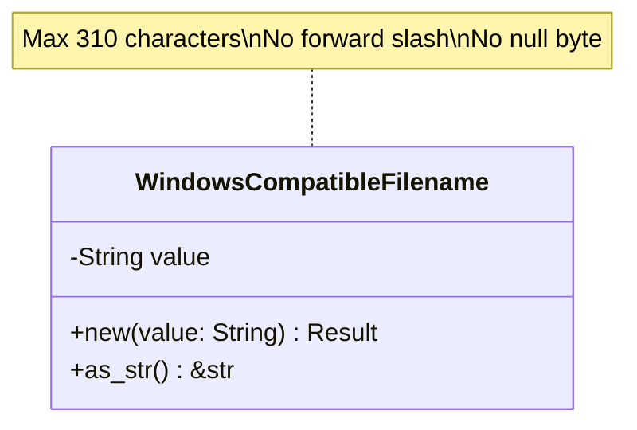

# Documentation Policy

## Core Principle

**Documentation files in `docs/` MUST NOT contain programming code.** All technical concepts should be described using natural language sentences and diagrams.

## What to Avoid

### ❌ Programming Code

Do NOT include:
- Trait definitions with method signatures
- Struct definitions with fields
- Implementation blocks
- Function bodies
- Code examples with syntax
- Test code
- Any Rust, JavaScript, Python, or other programming language code

### ❌ Code-like Syntax

Do NOT use:
- `::` (double colon) in diagrams or text
- Function call syntax like `method(param1, param2)`
- Type annotations like `: Type` or `-> ReturnType`
- Generic syntax like `<T: Trait>`
- Code comments like `//` or `/* */`

## What to Use Instead

### ✅ Natural Language Descriptions

**Instead of:**
```rust
pub trait MagicRepository: Send + Sync {
    fn analyze_buffer(&self, data: &[u8], filename: &str) -> Result<MagicResult, DomainError>;
}
```

**Write:**
The MagicRepository trait defines an analyze_buffer method that accepts a byte slice and filename string, returning either a MagicResult or DomainError. The trait requires Send and Sync bounds for thread safety.

### ✅ Mermaid Diagrams

Use diagrams to show:
- **Class structure** - Use class diagrams
- **Relationships** - Use arrows and connections
- **Processes** - Use flowcharts
- **Interactions** - Use sequence diagrams
- **State changes** - Use state diagrams

### ✅ Tables

Use tables to organize:
- Properties and their types
- Methods and their descriptions
- Error variants and their meanings
- Configuration options

### ✅ Descriptive Scenarios

**Instead of code examples**, write scenarios:

"When constructing a WindowsCompatibleFilename with a valid filename like 'document.pdf', the value object is successfully created. When attempting to construct with a filename exceeding 310 characters, construction fails with a TooLong validation error."

## Examples of Compliant Documentation

### Class Diagram


### Process Description

The authentication process begins by extracting the username and password from the HTTP Authorization header. The service then performs constant-time comparison of both credentials. If both match, the method returns true. If either fails to match, the method returns false. The comparison always takes the same amount of time regardless of which credential is incorrect, preventing timing attacks.

### Property Table

| Property | Type | Description |
|----------|------|-------------|
| username | String | Validated username (non-empty, max 256 chars) |
| password | SecureString | Securely stored password (min 8 chars) |

## Migration Guide

### For Existing Documents

1. **Identify code blocks** - Find all ` ```rust ` blocks
2. **Extract intent** - Understand what the code demonstrates
3. **Rewrite as prose** - Describe the behavior in sentences
4. **Add diagrams** - Use Mermaid for visual representation
5. **Remove code** - Delete the code block entirely

### Common Patterns

| Code Pattern | Documentation Approach |
|--------------|------------------------|
| Trait definition | Describe methods and their purpose in a table |
| Struct fields | List properties in a table with types and descriptions |
| Method implementation | Describe the algorithm or process in a flowchart |
| Usage example | Write a scenario describing the behavior |
| Test case | Describe the test scenario and expected outcome |
| Error handling | Show error flow in a flowchart diagram |

## Rationale

### Why No Code in Documentation?

1. **Separation of Concerns** - Documentation describes design; code is the implementation
2. **Maintainability** - Code examples become outdated; descriptions remain valid
3. **Clarity** - Natural language is more accessible than code syntax
4. **Focus** - Documentation should explain "why" and "what", not "how"
5. **Diátaxis Compliance** - Reference documentation provides information, not implementation

### When Code is Appropriate

Code belongs in:
- **Source files** (`src/`) - The actual implementation
- **Test files** (`tests/`) - Verification of behavior
- **Examples** (`examples/`) - Runnable demonstrations
- **README** - Quick start snippets (minimal, high-level only)

## Enforcement

### Review Checklist

Before committing documentation:
- [ ] No ```` ```rust ```` blocks present
- [ ] No trait or struct definitions
- [ ] No function implementations
- [ ] No test code
- [ ] All concepts described in prose
- [ ] Diagrams used for visual concepts
- [ ] Tables used for structured data

### Automated Checks

Consider adding a pre-commit hook:
```bash
# Check for Rust code blocks in docs
if grep -r "```rust" docs/; then
    echo "Error: Rust code found in documentation"
    exit 1
fi
```

## Status

### Completed

- ✅ Domain layer files updated (credentials.md, filename.md, file_path.md, request_id.md, mime_type.md, magic_result.md, magic_repository.md, authentication_service.md, errors.md)
- ✅ Application layer files updated (analyze_content.md, analyze_path.md, health_check.md, dtos.md, errors.md)
- ✅ Infrastructure layer files updated (libmagic_repository.md, basic_auth_service.md, sandbox.md, temp_file_handler.md, server_config.md)
- ✅ Presentation layer files updated (magic_handlers.md, health_handlers.md, middleware.md, router.md, app_state.md, responses.md)
- ✅ Reference documents updated (PROJECT_STRUCTURE.md, CONFIG.md, TESTING_STRATEGY.md)

### Remaining

All reference documentation files have been remediated to comply with the no-code policy.

## References

- [Diátaxis Framework](https://diataxis.fr/) - Documentation structure
- [Mermaid Documentation](https://mermaid.js.org/) - Diagram syntax
- Design Conventions (`.cursor/rules/design-conventions.mdc`)
- Documentation Conventions (`.cursor/rules/documentation.mdc`)
