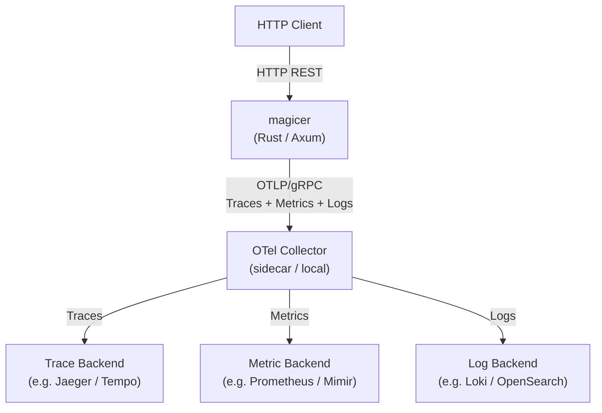
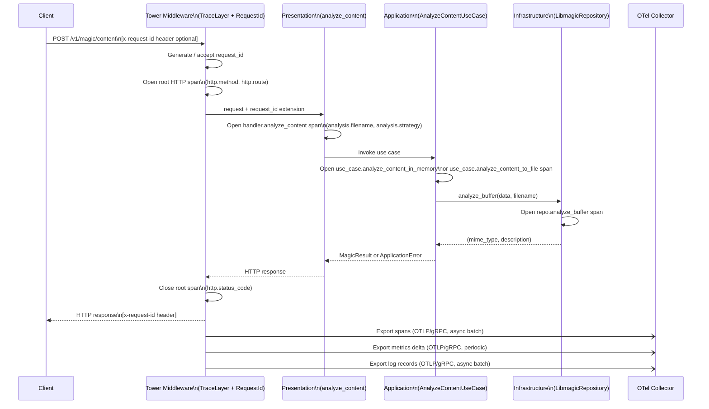

# OpenTelemetry Data Specification <!-- omit in toc -->

- [1. Instrumentation Strategy](#1-instrumentation-strategy)
- [2. System Context](#2-system-context)
- [3. Telemetry Signal Flow](#3-telemetry-signal-flow)
  - [3.1 Request Trace Flow](#31-request-trace-flow)
  - [3.2 Span Hierarchy](#32-span-hierarchy)
- [4. Service Resource Attributes](#4-service-resource-attributes)
- [5. Traces](#5-traces)
  - [5.1 Span Catalog](#51-span-catalog)
  - [5.2 Span Attribute Reference](#52-span-attribute-reference)
- [6. Metrics](#6-metrics)
  - [6.1 HTTP-Level Metrics](#61-http-level-metrics)
  - [6.2 Domain Metrics](#62-domain-metrics)
  - [6.3 Infrastructure Metrics](#63-infrastructure-metrics)
- [7. Logs](#7-logs)
  - [7.1 Log Record Catalog](#71-log-record-catalog)
  - [7.2 Structured Field Reference](#72-structured-field-reference)
- [8. Privacy and Security Constraints](#8-privacy-and-security-constraints)
- [9. Naming Conventions](#9-naming-conventions)
- [10. Export Configuration](#10-export-configuration)

This document defines the OpenTelemetry (OTel) telemetry contract for the magicer service — the complete catalog of spans, metrics, and log records the service emits, together with attribute schemas, naming rules, and security constraints.

---

## 1. Instrumentation Strategy

Rust has no auto-instrumentation agent. The service uses **manual instrumentation via the `tracing-opentelemetry` bridge**, which routes all three OTel signals through a single OTLP pipeline without rewriting any existing log calls.

| Signal | Mechanism |
| --- | --- |
| **Traces** | `#[tracing::instrument]` spans at each Clean Architecture layer boundary, rooted by `tower-http`'s `TraceLayer` per HTTP request |
| **Metrics** | OTel metrics API at the presentation and infrastructure boundaries |
| **Logs** | `opentelemetry-appender-tracing` bridges all existing `tracing` events to OTel log records automatically |

All three signals carry the same `service.name` and `service.version` resource attributes to guarantee cross-signal correlation.

---

## 2. System Context

The diagram below shows how the magicer service fits into the broader observability landscape. Telemetry is emitted to a sidecar OTel Collector, which fans out to downstream backends.

The magicer process emits all three signals to a single OTLP endpoint. The Collector is responsible for routing, sampling, and forwarding — the service itself has no direct dependency on any specific observability backend.

---

## 3. Telemetry Signal Flow

### 3.1 Request Trace Flow

The sequence below shows how a telemetry context is created, propagated, and exported for a `POST /v1/magic/content` request.

### 3.2 Span Hierarchy

The tree below shows the parent–child span relationships for each route.

```mermaid
graph TD
    subgraph "POST /v1/magic/content — small payload"
        A1["HTTP POST /v1/magic/content\n(root)"]
        B1["handler.analyze_content"]
        C1["use_case.analyze_content_in_memory"]
        D1["repo.analyze_buffer"]
        A1 --> B1 --> C1 --> D1
    end

    subgraph "POST /v1/magic/content — large or chunked payload"
        A2["HTTP POST /v1/magic/content\n(root)"]
        B2["handler.analyze_content"]
        C2["use_case.analyze_content_to_file"]
        D2["filesystem.temp_file_create"]
        E2["filesystem.mmap_open"]
        F2["repo.analyze_buffer"]
        A2 --> B2 --> C2
        C2 --> D2
        C2 --> E2
        C2 --> F2
    end

    subgraph "POST /v1/magic/path"
        A3["HTTP POST /v1/magic/path\n(root)"]
        B3["handler.analyze_path"]
        C3["use_case.analyze_path"]
        D3["filesystem.sandbox_resolve"]
        E3["filesystem.mmap_open"]
        F3["repo.analyze_buffer"]
        A3 --> B3 --> C3
        C3 --> D3
        C3 --> E3
        C3 --> F3
    end

    subgraph "Background task"
        BG["filesystem.temp_cleanup\n(no parent — background)"]
    end
```

---

## 4. Service Resource Attributes

These attributes are attached at provider initialization and apply to every span, metric data point, and log record emitted by the process.

| Attribute | Source | Example |
| --- | --- | --- |
| `service.name` | `CARGO_PKG_NAME` | `magicer` |
| `service.version` | `CARGO_PKG_VERSION` | `0.1.0` |
| `service.instance.id` | Runtime UUID or hostname | `i-0a1b2c3d4e` |
| `deployment.environment` | `OTEL_RESOURCE_ATTRIBUTES` env var | `production` |

---

## 5. Traces

### 5.1 Span Catalog

Spans follow the naming convention `{layer}.{operation}` in snake_case. The HTTP root span is created automatically by `TraceLayer`.

**Presentation Layer**

| Span Name | Trigger | Parent |
| --- | --- | --- |
| `HTTP POST /v1/magic/content` | Every content analysis request | — (root) |
| `HTTP POST /v1/magic/path` | Every path analysis request | — (root) |
| `HTTP GET /v1/ping` | Every health check request | — (root) |
| `handler.analyze_content` | Entry into `analyze_content` handler | Root span |
| `handler.analyze_path` | Entry into `analyze_path` handler | Root span |

**Application Layer**

| Span Name | Trigger | Parent |
| --- | --- | --- |
| `use_case.analyze_content_in_memory` | Payload is below the large-file threshold and not chunked | `handler.analyze_content` |
| `use_case.analyze_content_to_file` | Payload is chunked or exceeds large-file threshold | `handler.analyze_content` |
| `use_case.analyze_path` | Path-based analysis request | `handler.analyze_path` |

**Infrastructure Layer**

| Span Name | Trigger | Parent |
| --- | --- | --- |
| `repo.analyze_buffer` | libmagic FFI call to identify content | `use_case.*` |
| `filesystem.mmap_open` | Memory-mapped file open for analysis | `use_case.*` |
| `filesystem.temp_file_create` | Temporary file allocation for the streaming path | `use_case.analyze_content_to_file` |
| `filesystem.sandbox_resolve` | Path resolution and sandbox boundary check | `use_case.analyze_path` |
| `filesystem.temp_cleanup` | Background orphaned-file removal scan cycle | — (background, no parent) |

### 5.2 Span Attribute Reference

All spans within a request context must carry `request_id`. Additional attributes are scoped to the layer where they are first known.

**Common — all request spans**

| Attribute | Type | Description |
| --- | --- | --- |
| `request_id` | string | UUID v4; from `x-request-id` header or generated at ingress |

**HTTP root span (set by `TraceLayer`)**

| Attribute | Type | Description |
| --- | --- | --- |
| `http.method` | string | `POST` or `GET` |
| `http.route` | string | `/v1/magic/content`, `/v1/magic/path`, or `/v1/ping` |
| `http.status_code` | int | Response HTTP status code |
| `http.request_content_length` | int | Value of `Content-Length` header when present |

**Handler spans**

| Attribute | Type | Description |
| --- | --- | --- |
| `analysis.filename` | string | Validated `filename` query parameter |
| `analysis.transfer_encoding` | string | `chunked` or `fixed` |
| `analysis.strategy` | string | `in_memory` or `temp_file` |

**Use case spans**

| Attribute | Type | Description |
| --- | --- | --- |
| `analysis.type` | string | `content_in_memory`, `content_to_file`, or `path` |
| `analysis.timeout_secs` | int | Configured analysis timeout |
| `error.kind` | string | Present on error spans only; see §7.2 for values |

**Infrastructure spans**

| Attribute | Type | Description |
| --- | --- | --- |
| `repo.operation` | string | `analyze_buffer` |
| `filesystem.operation` | string | `mmap_open`, `temp_file_create`, `sandbox_resolve`, or `temp_cleanup` |
| `filesystem.cleanup.removed_count` | int | Number of orphaned files removed in this scan cycle |

---

## 6. Metrics

### 6.1 HTTP-Level Metrics

| Metric Name | Instrument | Unit | Description |
| --- | --- | --- | --- |
| `http.server.request.duration` | Histogram | `ms` | End-to-end HTTP request duration from first byte received to last byte sent |
| `http.server.active_requests` | UpDownCounter | `{request}` | Number of requests currently being processed |

**Labels**

| Label | Values |
| --- | --- |
| `http.method` | `GET`, `POST` |
| `http.route` | `/v1/magic/content`, `/v1/magic/path`, `/v1/ping` |
| `http.status_code` | HTTP status integer |

### 6.2 Domain Metrics

| Metric Name | Instrument | Unit | Description |
| --- | --- | --- | --- |
| `app.analysis.duration` | Histogram | `ms` | Time from use-case entry to `MagicResult` return, excluding HTTP framing |
| `app.analysis.errors` | Counter | `{error}` | Count of analysis failures, broken down by error kind |

**Labels**

| Label | Values |
| --- | --- |
| `analysis.type` | `content_in_memory`, `content_to_file`, `path` |
| `error.kind` | `bad_request`, `not_found`, `timeout`, `internal`, `insufficient_storage`, `unauthorized`, `forbidden` |

### 6.3 Infrastructure Metrics

| Metric Name | Instrument | Unit | Description |
| --- | --- | --- | --- |
| `app.tempfile.cleanup.duration` | Histogram | `ms` | Duration of each background cleanup scan cycle |
| `app.tempfile.cleanup.removed` | Counter | `{file}` | Total orphaned temp files removed across all scan cycles |

---

## 7. Logs

Log records are produced automatically by the `opentelemetry-appender-tracing` bridge from all existing `tracing` calls. No separate OTel log API calls are needed or permitted.

### 7.1 Log Record Catalog

| Event | Level | Timing | Structured Fields |
| --- | --- | --- | --- |
| Server configuration loaded | INFO | Startup — after config parse | `service.version` |
| Listening on address | INFO | Startup — after TCP bind | `server.addr`, `server.backlog` |
| Failed to set open-files limit | WARN | Startup — rlimit | `error` |
| Shutdown signal received | INFO | Shutdown — signal handler | — |
| Orphaned temp file removed | INFO | Background cleanup — per file | `file.name` |
| Failed to remove orphaned temp file | WARN | Background cleanup — per file | `file.name`, `error` |

All log records emitted during an active request span automatically inherit `request_id` from the span context via the bridge.

### 7.2 Structured Field Reference

| Field | Type | Description |
| --- | --- | --- |
| `request_id` | string | Correlation ID; injected by active span context |
| `server.addr` | string | Bind address (e.g., `127.0.0.1:8080`) |
| `server.backlog` | int | TCP listen backlog size |
| `file.name` | string | Filename component only — never the full resolved path |
| `error` | string | Error message string; must not contain credentials or file content |
| `error.kind` | string | One of: `bad_request`, `not_found`, `timeout`, `internal`, `insufficient_storage`, `unauthorized`, `forbidden` |

---

## 8. Privacy and Security Constraints

The following rules apply to all three signals and override any instrumentation defaults.

| Constraint | Applies To | Rule |
| --- | --- | --- |
| Auth credentials | Spans, logs, metrics | Never attach `auth.username` or `auth.password` to any signal. Apply `***` masking if a framework propagates these automatically. |
| Request / response bodies | Spans | Never include body bytes as span attributes. Bodies may contain PII. |
| Resolved file paths | Spans, logs | Use `file.name` (filename component only). Never attach the sandbox-resolved absolute path — it exposes directory layout. |
| Raw `path` query parameter | Spans | Attach as `request.path_param` only after sandbox validation succeeds; never before. |
| Large arrays / directory listings | Logs | Do not log raw file lists inline. Log only a count (e.g., `filesystem.cleanup.removed_count`). |
| OTLP channel | Export | TLS is required in production. Configure via `OTEL_EXPORTER_OTLP_CERTIFICATE`. Never disable TLS in a production deployment. |

---

## 9. Naming Conventions

| Element | Convention | Example |
| --- | --- | --- |
| Span names (layer spans) | `{layer}.{operation}` in snake_case | `use_case.analyze_content_in_memory` |
| Span names (HTTP root) | `HTTP {METHOD} {route}` set by `TraceLayer` | `HTTP POST /v1/magic/content` |
| Metric names | OTel semantic conventions first, then `app.*` for domain metrics | `http.server.request.duration`, `app.analysis.duration` |
| Metric label keys | lowercase dot-notation | `http.status_code`, `error.kind` |
| Span attribute keys | lowercase dot-notation | `request_id`, `analysis.type`, `filesystem.operation` |
| Log field keys | lowercase dot-notation | `server.addr`, `file.name` |

---

## 10. Export Configuration

All signals are exported to an OTel Collector via OTLP/gRPC. The endpoint and TLS configuration are provided exclusively through environment variables.

| Environment Variable | Purpose | Default |
| --- | --- | --- |
| `OTEL_EXPORTER_OTLP_ENDPOINT` | Collector gRPC endpoint | `http://localhost:4317` |
| `OTEL_EXPORTER_OTLP_CERTIFICATE` | Path to CA certificate for TLS | — (TLS disabled if unset) |
| `OTEL_RESOURCE_ATTRIBUTES` | Additional resource attributes (e.g. `deployment.environment=production`) | — |
| `OTEL_SERVICE_NAME` | Override for `service.name` resource attribute | `magicer` |

All three providers (tracer, meter, logger) are initialized before the HTTP listener starts and flushed gracefully on `SIGTERM` / `SIGINT` to ensure in-flight telemetry is exported before process exit.
