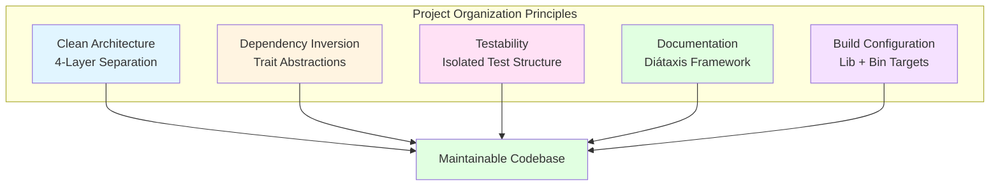

# Project Structure - Linux File Magic API Server <!-- omit in toc -->

- [1. Directory Layout](#1-directory-layout)
- [2. Source Code Organization](#2-source-code-organization)
  - [2.1. Domain Layer (`src/domain/`)](#21-domain-layer-srcdomain)
  - [2.2. Application Layer (`src/application/`)](#22-application-layer-srcapplication)
  - [2.3. Infrastructure Layer (`src/infrastructure/`)](#23-infrastructure-layer-srcinfrastructure)
  - [2.4. Presentation Layer (`src/presentation/`)](#24-presentation-layer-srcpresentation)
- [3. Configuration Files](#3-configuration-files)
- [4. Documentation](#4-documentation)
- [5. Testing Organization](#5-testing-organization)
- [6. Build Artifacts](#6-build-artifacts)
- [7. Module Dependency Graph](#7-module-dependency-graph)
- [8. File Naming Conventions](#8-file-naming-conventions)

---

## 1. Directory Layout

```
magicer/
├── .cursor/
│   └── rules/                      # Cursor AI rules
│       ├── convensions.mdc
│       ├── design-conventions.mdc
│       └── documentation.mdc
├── .github/
│   └── workflows/                  # CI/CD pipelines
│       ├── openapi-docs.yml
│       ├── test.yml
│       ├── lint.yml
│       └── release.yml
├── api/
│   └── v1/
│       └── openapi.yaml            # OpenAPI 3.0 specification
├── benches/                        # Performance benchmarks
│   ├── magic_analysis_benchmark.rs
│   └── http_throughput_benchmark.rs
├── config/                         # Runtime configuration
│   ├── config.toml.example
│   └── development.toml
├── docs/                           # Documentation (Diátaxis)
│   ├── ARCHITECTURE.md             # Technical design (Explanation)
│   ├── DEPLOYMENT.md               # Deployment guide (How-to)
│   ├── HTTP_SERVER.md              # Server specification (Reference)
│   ├── TESTING_STRATEGY.md         # Testing guide (Reference)
│   ├── PROJECT_STRUCTURE.md        # This file (Reference)
│   └── GITHUB_PAGES_SETUP.md
├── scripts/                        # Build and deployment scripts
│   ├── load_test.js
│   ├── docker-build.sh
│   └── install-libmagic.sh
├── src/
│   ├── domain/                     # Domain layer (pure business logic)
│   │   ├── entities/
│   │   │   ├── mod.rs
│   │   │   └── magic_result.rs
│   │   ├── value_objects/
│   │   │   ├── mod.rs
│   │   │   ├── filename.rs
│   │   │   ├── file_path.rs
│   │   │   ├── request_id.rs
│   │   │   ├── mime_type.rs
│   │   │   └── credentials.rs
│   │   ├── repositories/
│   │   │   ├── mod.rs
│   │   │   └── magic_repository.rs
│   │   ├── services/
│   │   │   ├── mod.rs
│   │   │   └── authentication_service.rs
│   │   ├── errors/
│   │   │   ├── mod.rs
│   │   │   ├── domain_error.rs
│   │   │   ├── validation_error.rs
│   │   │   └── magic_error.rs
│   │   └── mod.rs
│   ├── application/                # Application layer (use cases)
│   │   ├── use_cases/
│   │   │   ├── mod.rs
│   │   │   ├── analyze_content.rs
│   │   │   ├── analyze_path.rs
│   │   │   └── health_check.rs
│   │   ├── dtos/
│   │   │   ├── mod.rs
│   │   │   ├── analyze_content_request.rs
│   │   │   ├── analyze_path_request.rs
│   │   │   └── magic_response.rs
│   │   ├── errors/
│   │   │   ├── mod.rs
│   │   │   └── application_error.rs
│   │   └── mod.rs
│   ├── infrastructure/             # Infrastructure layer (I/O, external)
│   │   ├── magic/
│   │   │   ├── mod.rs
│   │   │   └── libmagic_repository.rs
│   │   ├── auth/
│   │   │   ├── mod.rs
│   │   │   └── basic_auth_service.rs
│   │   ├── filesystem/
│   │   │   ├── mod.rs
│   │   │   ├── sandbox.rs
│   │   │   └── temp_file_handler.rs
│   │   ├── config/
│   │   │   ├── mod.rs
│   │   │   └── server_config.rs
│   │   └── mod.rs
│   ├── presentation/               # Presentation layer (HTTP/Axum)
│   │   ├── http/
│   │   │   ├── handlers/
│   │   │   │   ├── mod.rs
│   │   │   │   ├── magic_handlers.rs
│   │   │   │   └── health_handlers.rs
│   │   │   ├── middleware/
│   │   │   │   ├── mod.rs
│   │   │   │   ├── request_id.rs
│   │   │   │   ├── auth.rs
│   │   │   │   ├── timeout.rs
│   │   │   │   └── error_handler.rs
│   │   │   ├── extractors/
│   │   │   │   ├── mod.rs
│   │   │   │   ├── filename.rs
│   │   │   │   └── authenticated_user.rs
│   │   │   ├── responses/
│   │   │   │   ├── mod.rs
│   │   │   │   ├── magic_response.rs
│   │   │   │   └── error_response.rs
│   │   │   ├── router.rs
│   │   │   └── mod.rs
│   │   ├── state/
│   │   │   ├── mod.rs
│   │   │   └── app_state.rs
│   │   └── mod.rs
│   ├── lib.rs                      # Library entrypoint
│   └── main.rs                     # Binary entrypoint
├── tests/
│   ├── common/
│   │   └── mod.rs                  # Shared test utilities
│   ├── unit/
│   │   ├── domain/
│   │   │   ├── value_objects/
│   │   │   │   ├── filename_tests.rs
│   │   │   │   ├── file_path_tests.rs
│   │   │   │   └── request_id_tests.rs
│   │   │   └── entities/
│   │   │       └── magic_result_tests.rs
│   │   └── application/
│   │       └── use_cases/
│   │           ├── analyze_content_tests.rs
│   │           └── analyze_path_tests.rs
│   ├── integration/
│   │   ├── http/
│   │   │   ├── magic_endpoints_tests.rs
│   │   │   └── health_endpoint_tests.rs
│   │   ├── middleware/
│   │   │   ├── auth_tests.rs
│   │   │   └── request_id_tests.rs
│   │   └── repository/
│   │       └── libmagic_integration_tests.rs
│   ├── property/
│   │   ├── filename_validation_tests.rs
│   │   └── path_validation_tests.rs
│   ├── e2e/
│   │   └── full_workflow_tests.rs
│   └── security/
│       └── path_traversal_tests.rs
├── .dockerignore
├── .gitignore
├── Cargo.lock
├── Cargo.toml
├── Dockerfile
├── LICENSE
└── README.md
```

---

## 2. Source Code Organization

### 2.1. Domain Layer (`src/domain/`)

**Purpose:** Pure business logic with zero external dependencies.

#### **entities/**
Contains domain entities with identity.

- `magic_result.rs`: The core entity representing file magic analysis result
  - Struct: `MagicResult`
  - Methods: Constructor, getters, domain invariants

#### **value_objects/**
Immutable objects without identity, validated on construction.

- `filename.rs`: `WindowsCompatibleFilename`
  - Validation: max 310 chars, no `/` or `\0`
  - Derives: `Clone`, `Eq`, `PartialEq`, `Hash`, `Debug`
  
- `file_path.rs`: `RelativePath`
  - Validation: no leading `/`, no `..`, no `//`
  - Canonicalization support
  
- `request_id.rs`: `RequestId`
  - UUID v4 wrapper
  - Generation and parsing

- `mime_type.rs`: `MimeType`
  - MIME type validation
  - Type/subtype separation

- `credentials.rs`: `BasicAuthCredentials`
  - Username/password pair
  - Validation rules

#### **repositories/**
Trait definitions for data access.

- `magic_repository.rs`: `trait MagicRepository`

**Trait Method Signatures:**

```rust
pub trait MagicRepository: Send + Sync {
    /// Analyzes binary data from any source (memory, mmap, static).
    /// 
    /// Accepts any byte slice regardless of source:
    /// - In-memory buffers (Vec<u8>, Bytes)
    /// - Memory-mapped file slices (via mmap)
    /// - Static data (compile-time arrays)
    /// - Network buffers (HTTP body)
    ///
    /// # Arguments
    /// * `data` - Byte slice to analyze (from any source)
    /// * `filename` - Original filename for libmagic context
    ///
    /// # Returns
    /// * `Ok(MagicResult)` - Analysis successful
    /// * `Err(DomainError)` - Analysis failed or invalid input
    fn analyze_buffer(
        &self,
        data: &[u8],
        filename: &str,
    ) -> Result<MagicResult, DomainError>;

    /// Analyzes file by path (libmagic opens file internally).
    ///
    /// # Arguments
    /// * `path` - Absolute path to file (must be within sandbox)
    ///
    /// # Returns
    /// * `Ok(MagicResult)` - Analysis successful
    /// * `Err(DomainError)` - File not found or analysis failed
    fn analyze_file(
        &self,
        path: &Path,
    ) -> Result<MagicResult, DomainError>;
}
```

**Unified Interface Design:**

The `analyze_buffer` method uses a unified interface accepting `&[u8]` from any source:

| Source Type | Example | Works with `&[u8]` |
|-------------|---------|-------------------|
| In-Memory Buffer | `Vec<u8>`, `Bytes` | ✅ Yes |
| Memory-Mapped File | `MmapBuffer::as_ref()` | ✅ Yes |
| Static Data | `&[u8]` literal | ✅ Yes |
| Network Buffer | HTTP body bytes | ✅ Yes |
| Any `AsRef<[u8]>` | Custom types | ✅ Yes |

**Key Design Decision:**

Single method for all buffer sources rather than separate methods for mmap vs memory. The implementation treats all `&[u8]` identically when passing to libmagic FFI.

**Returns:**
- Domain errors only (no infrastructure types leak)
- `DomainError::ValidationError` for invalid inputs
- `DomainError::MagicError` for analysis failures

#### **services/**
Domain services for multi-entity operations.

- `authentication_service.rs`: `trait AuthenticationService`
  - `verify_credentials()`: Credential validation
  - Constant-time comparison requirement

#### **errors/**
Domain-specific error types.

- `domain_error.rs`: Top-level `DomainError` enum
- `validation_error.rs`: `ValidationError` with detailed messages
- `magic_error.rs`: `MagicError` for analysis failures

**Key Constraint:** No imports from `infrastructure/` or `presentation/`.

---

### 2.2. Application Layer (`src/application/`)

**Purpose:** Orchestrate domain objects through use cases.

#### **use_cases/**
Application workflows.

- `analyze_content.rs`: `AnalyzeContentUseCase`
  - Input: `AnalyzeContentRequest` DTO
  - Output: `MagicResponse` DTO
  - Dependencies: `MagicRepository` (trait object)
  - Error handling: Map domain errors to application errors

- `analyze_path.rs`: `AnalyzePathUseCase`
  - Additional validation: sandbox boundary checks
  - File existence verification

- `health_check.rs`: `HealthCheckUseCase`
  - Simple liveness check
  - No external dependencies

#### **dtos/**
Data Transfer Objects for use case boundaries.

- `analyze_content_request.rs`: Request payload for content analysis
- `analyze_path_request.rs`: Request payload for path analysis
- `magic_response.rs`: Unified response format

#### **errors/**
- `application_error.rs`: `ApplicationError` enum
  - Wraps domain errors
  - Adds application-specific errors (timeout, etc.)

**Dependency Rule:** Depends only on `domain/`.

---

### 2.3. Infrastructure Layer (`src/infrastructure/`)

**Purpose:** Implement domain traits with external dependencies.

#### **magic/**
- `libmagic_repository.rs`: `impl MagicRepository for LibmagicRepository`
  - Wraps `magic` crate
  - Uses `tokio::task::spawn_blocking` for CPU-bound work
  - Maps libmagic errors to domain errors

#### **auth/**
- `basic_auth_service.rs`: `impl AuthenticationService for BasicAuthService`
  - Credential storage (environment variables)
  - Constant-time comparison using `subtle` crate

#### **filesystem/**
- `sandbox.rs`: `PathSandbox` utility
  - Canonicalization
  - Boundary enforcement
  - Symlink policy

- `temp_file_handler.rs`: Temporary file management
  - For content-based analysis requiring file paths
  - Auto-cleanup on drop

#### **config/**
- `server_config.rs`: Configuration loading
  - TOML parsing
  - Environment variable overrides
  - Validation

**Allowed Dependencies:** Any crates (`tokio`, `serde`, `magic`, etc.)

---

### 2.4. Presentation Layer (`src/presentation/`)

**Purpose:** HTTP server implementation with Axum.

#### **http/handlers/**
Request handlers (Axum endpoint functions).

- `magic_handlers.rs`:
  - `analyze_content()`: POST `/v1/magic/content`
  - `analyze_path()`: POST `/v1/magic/path`

- `health_handlers.rs`:
  - `ping()`: GET `/v1/ping`

#### **http/middleware/**
Axum middleware layers.

- `request_id.rs`: Generates and injects UUID
- `auth.rs`: Basic auth validation
- `timeout.rs`: Request timeout enforcement
- `error_handler.rs`: Global error to HTTP response mapping

#### **http/extractors/**
Custom Axum extractors.

- `filename.rs`: Query parameter extraction and validation
- `authenticated_user.rs`: Post-auth user info

#### **http/responses/**
Response type definitions.

- `magic_response.rs`: JSON success responses
- `error_response.rs`: JSON error responses with `IntoResponse` impl

#### **http/**
- `router.rs`: Axum router configuration
  - Route definitions
  - Middleware composition
  - Layer ordering

#### **state/**
- `app_state.rs`: `AppState` shared state
  - Use case instances
  - Service instances
  - Configuration

**Entry Points:**
- `src/lib.rs`: Exports public API for library consumers
- `src/main.rs`: Binary entrypoint, server initialization

---

## 3. Configuration Files

### **Cargo.toml**

Main project manifest defining:
- Package metadata (name, version, license)
- Dual targets: library (`src/lib.rs`) and binary (`src/main.rs`)
- Dependencies organized by category (web, async, serialization, observability)
- Development dependencies for testing
- Release profile with aggressive optimization
- Benchmark harness configuration

Key dependency categories:
- Web Framework: axum, tower, hyper
- Async Runtime: tokio
- Serialization: serde, serde_json, toml
- Observability: tracing, tracing-subscriber
- Security: subtle (constant-time), base64
- Domain-Specific: magic (libmagic bindings)
- Testing: axum-test, proptest, mockall, criterion

### **config/config.toml.example**

Example runtime configuration template showing:
- Server settings (host, port, connection limits)
- Timeout configurations
- Sandbox directory path
- Magic database path (optional)
- Logging configuration

Actual configuration files should not be committed (see .gitignore).

### **.gitignore**

Excludes from version control:
- Build artifacts (`/target`)
- Dependency lock file in library projects
- Editor temporary files
- OS-specific files (.DS_Store)
- Environment files with secrets (`.env`, `.env.*`)
- Coverage reports
- Log files
- IDE configuration directories
- Local configuration overrides

---

## 4. Documentation

Organized following **Diátaxis** framework:

| Document | Type | Purpose |
|----------|------|---------|
| `ARCHITECTURE.md` | Explanation | System design and decisions |
| `DEPLOYMENT.md` | How-to Guide | Production deployment steps |
| `HTTP_SERVER.md` | Reference | Technical specifications |
| `TESTING_STRATEGY.md` | Reference | Testing guidelines |
| `PROJECT_STRUCTURE.md` | Reference | Code organization (this file) |
| `README.md` | Tutorial | Quick start and overview |

---

## 5. Testing Organization

### **tests/unit/**
Mirror `src/` structure for unit tests.
- Test pure functions and domain logic
- Use mocks for repository traits

### **tests/integration/**
Cross-module integration tests.
- HTTP endpoint tests with test server
- Real repository implementations

### **tests/property/**
Property-based tests using `proptest`.
- Input validation edge cases
- Invariant verification

### **tests/e2e/**
End-to-end workflow tests.
- Full server lifecycle
- Real HTTP clients

### **tests/security/**
Security-specific test suites.
- Path traversal attempts
- Authentication bypass attempts
- Timing attack resistance

### **tests/common/mod.rs**
Shared test utilities:
- `build_test_app_state()`
- `create_test_file()`
- `cleanup_test_files()`
- Mock builders

---

## 6. Build Artifacts

### **Development**
```bash
# Debug build
cargo build
# Output: target/debug/magicer

# Run tests
cargo test
# Coverage: target/coverage/
```

### **Release**
```bash
# Optimized build
cargo build --release
# Output: target/release/magicer (stripped, ~5MB)

# Docker image
docker build -t magicer:latest .
```

---

## 7. Module Dependency Graph

```
Presentation Layer (src/presentation/)
  ↓ depends on
Application Layer (src/application/)
  ↓ depends on
Domain Layer (src/domain/)
  ↑ implemented by
Infrastructure Layer (src/infrastructure/)
```

**Allowed Imports:**
- Presentation → Application, Domain
- Application → Domain
- Infrastructure → Domain
- Domain → std only

**Forbidden:**
- Domain → Infrastructure ❌
- Domain → Application ❌
- Application → Infrastructure ❌
- Application → Presentation ❌

---

## 8. File Naming Conventions

### **Rust Files**
- All source files use `snake_case.rs` naming
- Module definitions use `mod.rs` as entry point
- Test files suffixed with `_tests.rs`
- Benchmark files suffixed with `_benchmark.rs`

### **Documentation**
- Documentation files use `SCREAMING_SNAKE_CASE.md`
- Topic-prefixed naming (e.g., `HTTP_SERVER.md`, `ARCHITECTURE.md`)
- Following Diátaxis framework categories

### **Configuration**
- Main configuration: `config.toml`
- Environment-specific: `{environment}.toml` (e.g., `development.toml`)
- Environment variable templates: `.env.example`
- Never commit actual `.env` files

### **Code Identifiers**
- Types and structs: `PascalCase`
- Functions and methods: `snake_case`
- Constants: `SCREAMING_SNAKE_CASE`
- Module names: `snake_case`

---

## Summary



This project structure enforces:

1. **Clean Architecture** - Four distinct layers with explicit dependencies (domain ← application ← presentation, infrastructure implements domain)

2. **Dependency Inversion** - Domain defines traits, infrastructure implements them, presentation and application depend only on abstractions

3. **Testability** - Separate test directory structure mirroring source code organization, enabling isolated unit and integration tests

4. **Documentation** - Following Diátaxis framework with clear separation of tutorials, how-to guides, reference docs, and explanations

5. **Build Optimization** - Dual library and binary targets allow reuse of core logic in different contexts

**Architectural Integrity Rules:**

- Domain layer: Zero external dependencies (only `std`)
- Application layer: Depends only on domain
- Infrastructure layer: Implements domain traits
- Presentation layer: Depends on application and domain
- No circular dependencies between modules
- All cross-layer communication through trait boundaries

**File Organization Principles:**

- Group by feature within layers (e.g., `magic/`, `auth/`, `filesystem/`)
- Separate concerns horizontally (same layer) and vertically (across layers)
- Test structure mirrors source structure for easy navigation
- Configuration and documentation at project root level
