# Testing Strategy - Linux File Magic API Server <!-- omit in toc -->

- [1. Testing Philosophy](#1-testing-philosophy)
- [2. Test Organization](#2-test-organization)
- [3. Test Pyramid](#3-test-pyramid)
- [4. Testing by Layer](#4-testing-by-layer)
  - [4.1. Domain Layer Testing](#41-domain-layer-testing)
  - [4.2. Application Layer Testing](#42-application-layer-testing)
  - [4.3. Large Content Handling Testing](#43-large-content-handling-testing)
  - [4.4. libmagic FFI Testing](#44-libmagic-ffi-testing)
  - [4.5. Presentation Layer Testing](#45-presentation-layer-testing)
  - [4.6. Infrastructure Layer Testing (Other)](#46-infrastructure-layer-testing-other)
  - [4.7. Error Message Validation Testing](#47-error-message-validation-testing)
- [5. Property-Based Testing](#5-property-based-testing)
- [6. Integration Testing Strategy](#6-integration-testing-strategy)
- [7. End-to-End Testing](#7-end-to-end-testing)
- [8. Security Testing](#8-security-testing)
- [9. Performance Testing](#9-performance-testing)
- [10. Coverage Requirements](#10-coverage-requirements)
- [11. Test Infrastructure](#11-test-infrastructure)
- [12. Continuous Integration](#12-continuous-integration)

---

## 1. Testing Philosophy

**Goals:**
- Ensure correctness of business rules and domain invariants
- Prevent regressions through comprehensive test coverage
- Provide executable specifications that document behavior
- Enable confident production deployments without manual QA

**Principles:**
- Test observable behavior, not implementation details
- Prefer integration tests for complex interactions
- Use property-based testing for validation logic and edge cases
- Mock only at architectural boundaries (domain trait implementations)
- Fast feedback loops with unit tests forming the pyramid base
- Maintain test independence - no shared mutable state between tests

---

## 2. Test Organization

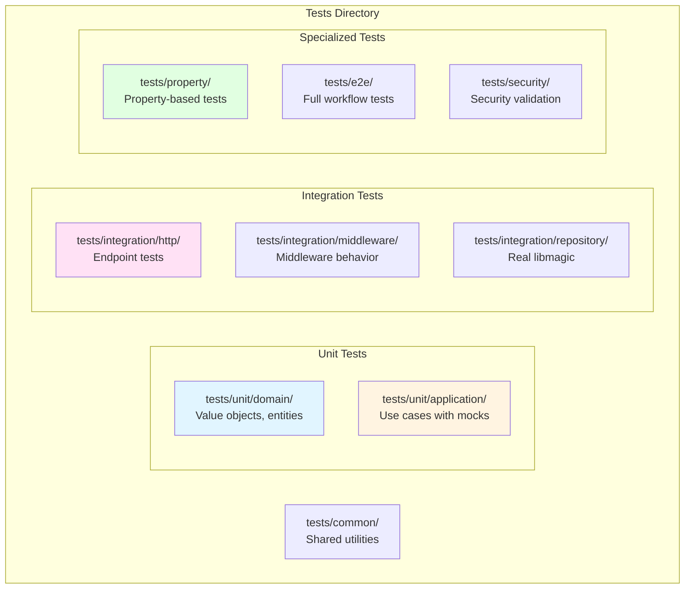

**Test Directory Structure:**

| Path | Purpose | Test Type |
|------|---------|-----------|
| `tests/common/` | Shared test utilities, fixtures, mock builders | Helper code |
| `tests/unit/domain/` | Domain value objects and entities | Unit tests |
| `tests/unit/application/` | Use case logic with mocked repositories | Unit tests |
| `tests/integration/http/` | HTTP endpoints with test server | Integration tests |
| `tests/integration/middleware/` | Middleware stack behavior | Integration tests |
| `tests/integration/repository/` | Repository implementations with real libmagic | Integration tests |
| `tests/property/` | Property-based validation tests | Property tests |
| `tests/e2e/` | Full system workflow tests | E2E tests |
| `tests/security/` | Security vulnerability tests | Security tests |

---

## 3. Test Pyramid

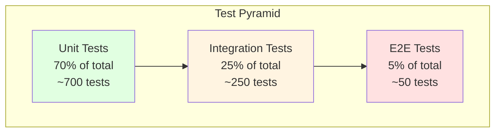

**Distribution Rationale:**

| Layer | Percentage | Focus Areas | Execution Speed |
|-------|-----------|-------------|-----------------|
| Unit | 70% | Domain logic, value objects, use cases | Milliseconds |
| Integration | 25% | HTTP handlers, repository implementations, middleware | Seconds |
| E2E | 5% | Critical user workflows, full system behavior | Seconds to minutes |

**Coverage Targets:**

- Unit tests provide fast feedback on business logic
- Integration tests verify component interactions
- E2E tests validate critical paths from user perspective
- Property-based tests complement all layers with edge case generation

---

## 4. Testing by Layer

### 4.1. Domain Layer Testing

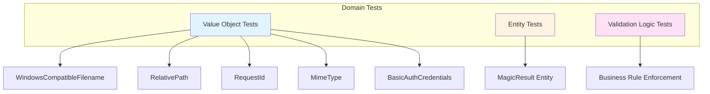

**Domain Layer Test Locations:**

| Component | Test Path | Focus |
|-----------|-----------|-------|
| WindowsCompatibleFilename | `tests/unit/domain/value_objects/filename_tests.rs` | Max length, forbidden characters, empty values |
| RelativePath | `tests/unit/domain/value_objects/file_path_tests.rs` | Path traversal prevention, absolute path rejection |
| RequestId | `tests/unit/domain/value_objects/request_id_tests.rs` | UUID generation, parsing validation |
| MimeType | `tests/unit/domain/value_objects/mime_type_tests.rs` | MIME type format validation |
| MagicResult | `tests/unit/domain/entities/magic_result_tests.rs` | Entity construction, field access |

**WindowsCompatibleFilename Test Scenarios:**

| Test Case | Expected Behavior |
|-----------|------------------|
| Valid filename "test.txt" | Accept |
| Filename with `/` character | Reject with InvalidCharacter error |
| Filename with `\0` null byte | Reject with InvalidCharacter error |
| Filename exceeding 310 characters | Reject with ExceedsMaxLength error |
| Filename at exactly 310 characters | Accept |
| Empty string | Reject with EmptyValue error |
| Unicode filename "файл_测试_🎉.txt" | Accept (UTF-8 support) |

**RelativePath Test Scenarios:**

| Input Path | Expected Behavior | Reason |
|-----------|------------------|--------|
| "uploads/file.txt" | Accept | Valid relative path |
| "/etc/passwd" | Reject | Absolute path (leading /) |
| "../etc/passwd" | Reject | Parent traversal (..) |
| "data/../../secret" | Reject | Contains .. |
| "data//file.txt" | Reject | Double slash |
| "data/." | Reject | Ends with dot |
| " data/file.txt" | Reject | Leading space |

**Entity Test Coverage:**

- Verify all entity fields are properly initialized
- Test field accessor methods return correct values
- Validate entity identity comparison (for entities with ID)
- Ensure immutability where required

### 4.2. Application Layer Testing

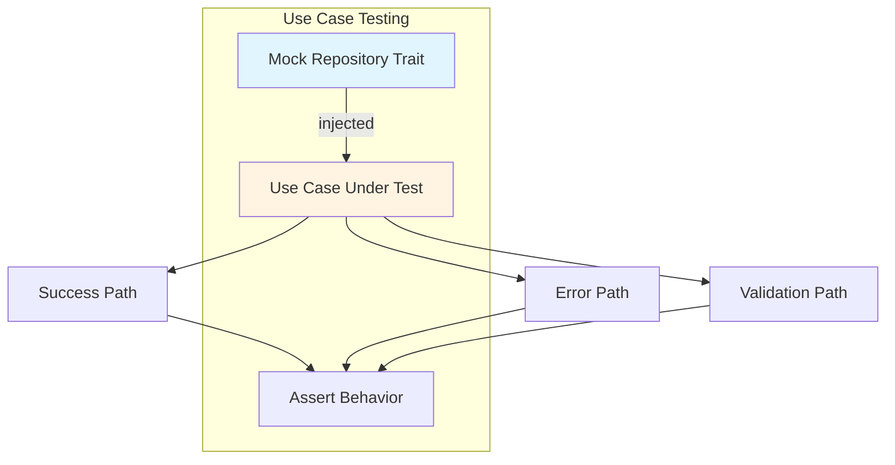

**Application Layer Test Locations:**

| Use Case | Test Path | Mock Strategy |
|----------|-----------|---------------|
| AnalyzeContentUseCase | `tests/unit/application/use_cases/analyze_content_tests.rs` | Mock MagicRepository trait |
| AnalyzePathUseCase | `tests/unit/application/use_cases/analyze_path_tests.rs` | Mock MagicRepository trait |
| HealthCheckUseCase | `tests/unit/application/use_cases/health_check_tests.rs` | No mocks needed |

**AnalyzeContentUseCase Test Scenarios:**

| Scenario | Mock Behavior | Expected Result |
|----------|---------------|-----------------|
| Small content (< threshold) | Return detected type and description | Success, direct buffer analysis |
| Large content (≥ threshold) | Return detected type and description | Success, temp file + mmap |
| Repository failure | Return analysis error | Application layer analysis error |
| Empty content | N/A (caught before repository call) | Validation error |
| Timeout during analysis | Timeout after 30s | Timeout error |
| Large payload (100MB) | Return success | Success (boundary test) |
| Temp file creation fails | Disk full scenario | Insufficient storage error |
| Temp file cleanup on error | Mock returns error | Temp file still deleted |
| Concurrent large files | Multiple parallel requests | All succeed, no file conflicts |

**AnalyzePathUseCase Test Scenarios:**

| Scenario | Mock Behavior | Expected Result |
|----------|---------------|-----------------|
| Valid file path | Return detected type and description | Success with response |
| File not found | N/A (filesystem check fails first) | Not found error |
| Path outside sandbox | N/A (validation rejects before repository) | Validation error |
| Repository failure | Return analysis error | Application layer analysis error |

**Mock Strategy:**

- Use a mock generation framework to create mock implementations of repository traits
- Configure mock expectations for specific test scenarios
- Verify mock methods called with correct parameters
- Test both success and failure paths

### 4.3. Large Content Handling Testing

**Test Location:** tests/unit/application/use_cases/large_content_tests.rs

#### Unit Tests with Mocks

| Test Case | Setup | Verification |
|-----------|-------|--------------|
| Threshold detection | Content exactly at threshold | Correct path chosen (memory vs file) |
| Buffer writing | Large content > threshold | Content written in chunks |
| Mmap creation | Temp file created | Mmap slice matches original content |
| Cleanup on success | Analysis completes | Temp file deleted |
| Cleanup on error | Analysis fails | Temp file still deleted |
| Concurrent requests | Multiple large files | Unique temp file names, no conflicts |

#### Integration Tests

**Test Location:** tests/integration/large_content_tests.rs

| Test Case | Input | Expected Behavior |
|-----------|-------|-------------------|
| Small file (1MB) | Text content | Direct buffer analysis, no temp file |
| At threshold (10MB) | Binary content | File-based analysis triggered |
| Large file (50MB) | PDF content | Streamed to temp, mmap analysis |
| Very large (100MB) | Max size payload | Success with file-based analysis |
| Disk full scenario | Mock filesystem full | Insufficient Storage error |
| Mmap failure | Mock mmap error | Graceful error handling |
| Temp dir missing | Missing directory | Automatic creation or clear error |
| Permission denied | Read-only temp dir | Internal server error |

#### Resource Management Tests

**Test Location:** tests/integration/resource_management_tests.rs

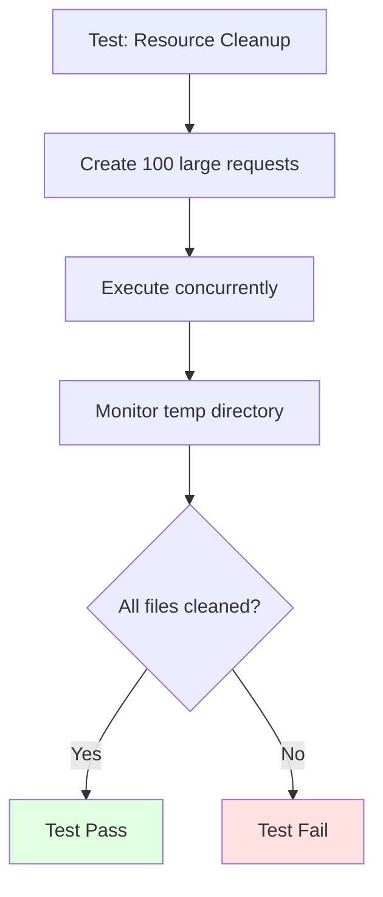

| Test Case | Scenario | Verification |
|-----------|----------|--------------|
| Serial cleanup | Process 100 requests serially | Zero temp files remain |
| Concurrent cleanup | 50 concurrent large requests | All temp files cleaned |
| Panic during analysis | Force panic in analysis | Cleanup routine runs, file deleted |
| Timeout with cleanup | Request times out | Temp file cleaned before timeout response |
| Orphaned file detection | Manually create old temp files | Background cleanup removes them |

#### Performance Tests

**Test Location:** benches/large_content_benchmark.rs

| Benchmark | Input Size | Measured Metric |
|-----------|-----------|-----------------|
| Memory analysis | 1MB, 5MB, 9MB | Throughput (req/s) |
| File-based analysis | 10MB, 50MB, 100MB | Throughput (req/s) |
| Write buffer impact | 10MB with 16KB, 64KB, 256KB buffers | Write time |
| Mmap overhead | 10MB file vs buffer | Analysis time difference |
| Concurrent large files | 10 x 50MB files | Total time, resource usage |

#### Memory Profiling Tests

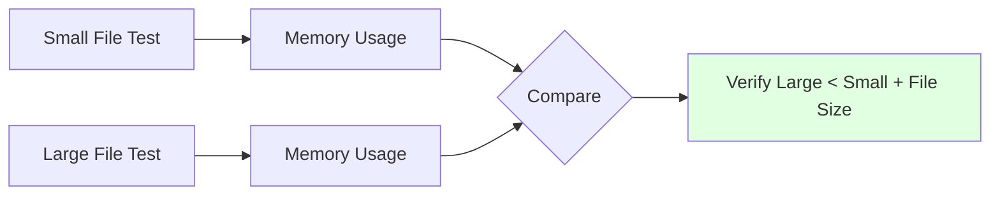

**Test Strategy:**
- Use memory profiler (e.g., valgrind massif)
- Compare memory usage: small file vs large file
- Verify large file doesn't load entire content into memory
- Confirm mmap doesn't duplicate data

#### Disk Space Exhaustion Simulation
Test scenarios for disk full conditions during streaming operations involve using mocks to simulate various failure points. These tests ensure that the system handles "No space left on device" errors correctly, either by rejecting requests during the pre-flight check or by cleaning up partial files if the disk becomes full during the upload stream.

#### Write Recovery Verification
Tests for partial write recovery confirm that if a streaming operation fails midway, any partial data written to the temporary directory is promptly and completely removed. This prevents orphaned files from consuming storage space over time.

#### File Descriptor Monitoring
Tests for file descriptor usage verify that the system stays within its configured limits and correctly increments/decrements counters as connections and files are opened and closed. This includes testing the graceful rejection of new requests when the limit is reached.

#### Automated Orphaned File Cleanup
Automatic cleanup logic is tested by manually placing older files in the temporary directory and verifying that the background task identifies and deletes them according to the configured retention policy.

#### Memory-Map Fallback Logic
Tests for mmap fallback verify that if a memory-mapping operation fails due to system constraints, the analysis can still proceed using an in-memory buffer if the fallback is enabled. These tests also confirm that the appropriate warnings are logged and metrics are updated.

#### Startup Sequence and Integrity
Startup tests verify that the server performs all necessary pre-flight checks, including directory accessibility and the removal of any stale temporary files left from previous executions.

#### Error Message Integrity
A dedicated suite of tests ensures that all error messages produced by the system include the required context:
1. **Operation**: Specifies what the system was trying to do (e.g., "create temp file").
2. **Root Cause**: Explains why it failed (e.g., "permission denied").
3. **Details**: Includes relevant data points like offsets or file paths where applicable.
4. **Readability**: Ensures messages are human-readable and follow a consistent format.

#### Continuous Integration and Linting
The CI pipeline incorporates automated checks to verify the integrity of the codebase and its documentation. This includes running the full test suite, measuring coverage against targets, and ensuring that no generic or non-descriptive error messages are introduced into the system.

#### Success Criteria

All error message tests must verify:

1. ✅ **Operation Context:** Error specifies what operation was attempted
2. ✅ **Root Cause:** Error explains why the operation failed
3. ✅ **Relevant Details:** Error includes context-specific information (offset, path, etc.)
4. ✅ **Human Readable:** Error message is clear and actionable
5. ✅ **Consistent Format:** Follows `"Failed to {operation}: {cause}"` pattern
6. ✅ **No Swallowing:** Context preserved across layer boundaries
7. ✅ **No Generic Messages:** Avoids generic errors without context


---

## 5. Property-Based Testing

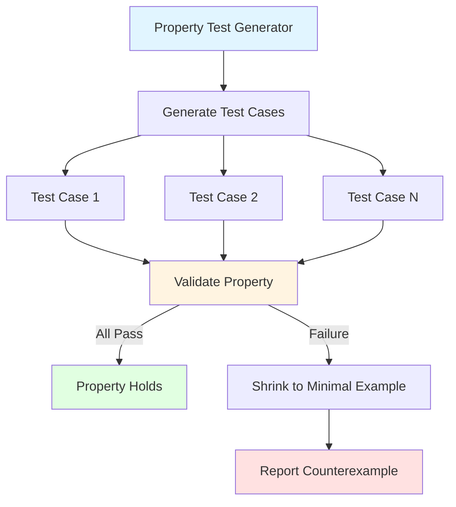

**Property-Based Test Locations:**

| Component | Test Path | Property Framework |
|-----------|-----------|-------------------|
| WindowsCompatibleFilename | tests/property/filename_validation_tests.rs | proptest |
| RelativePath | tests/property/path_validation_tests.rs | proptest |
| RequestId | tests/property/request_id_tests.rs | proptest |

**WindowsCompatibleFilename Properties:**

| Property | Generator Strategy | Invariant |
|----------|-------------------|-----------|
| Valid filenames accepted | Strings without forward slash or null byte, length 1-310 | Constructor returns success |
| Invalid char rejected | Insert forward slash or null byte into valid string | Constructor returns invalid character error |
| Length limit enforced | Generate strings of length 311-500 | Constructor returns exceeds max length error |
| Empty rejected | Empty string | Constructor returns empty value error |
| Unicode supported | Generate Unicode strings (no slash or null) | Constructor returns success |

**RelativePath Properties:**

| Property | Generator Strategy | Invariant |
|----------|-------------------|-----------|
| Valid relative paths accepted | Join 1-5 alphanumeric segments with forward slash | Constructor returns success |
| Absolute paths rejected | Prepend forward slash to valid path | Constructor returns absolute path error |
| Parent traversal rejected | Insert .. into path segments | Constructor returns path traversal error |
| Double slash rejected | Insert // into path | Constructor returns invalid path error |

**Property Test Benefits:**

- Automatically discovers edge cases developers might miss
- Tests thousands of input combinations
- Provides minimal failing example when property violated
- Complements hand-written unit tests with exhaustive coverage

**Shrinking Strategy:**

When a property test fails, the framework automatically shrinks the input to find the minimal failing case:

1. Generate random input that violates property
2. Iteratively simplify input while preserving failure
3. Report smallest input that triggers bug
4. Developer fixes issue for specific case
5. Re-run to verify all cases pass

---

## 6. Integration Testing Strategy

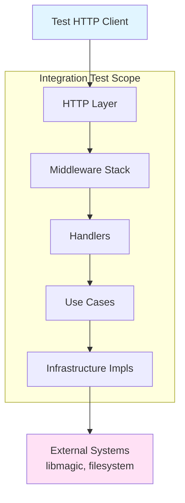

**Integration Test Strategy:**

Integration tests verify that multiple components work together correctly. Unlike unit tests with mocks, integration tests use real implementations where practical.

**Test Scope:**

| Test Type | Components Tested | External Dependencies |
|-----------|------------------|----------------------|
| HTTP Integration | Router + Middleware + Handlers + Use Cases | Mock repositories |
| Repository Integration | Repository implementations | Real libmagic, real filesystem |
| Middleware Integration | Middleware stack | Real request/response cycle |

**Integration Test Benefits:**

- Catch integration bugs that unit tests miss
- Verify correct middleware ordering and composition
- Test with real HTTP request/response cycle
- Validate error propagation across layers

---

## 7. End-to-End Testing

```mermaid
sequenceDiagram
    participant Test
    participant Server
    participant Libmagic
    participant Filesystem
    
    Test->>Test: Start real server
    Test->>Server: HTTP POST content endpoint
    Server->>Server: Apply all middleware
    Server->>Server: Authenticate
    Server->>Server: Execute use case
    Server->>Libmagic: Analyze buffer
    Libmagic-->>Server: detected type + description
    Server-->>Test: JSON response
    Test->>Test: Assert response correctness
    Test->>Server: HTTP GET ping endpoint
    Server-->>Test: pong response
    Test->>Test: Shutdown server
    
    style Test fill:#e1f5ff
    style Server fill:#fff4e1
```

**E2E Test Locations:**

tests/e2e/full_workflow_tests.rs

**E2E Test Scenarios:**

| Workflow | Steps | Verification |
|----------|-------|--------------|
| Analyze content workflow | 1. Start server<br/>2. POST binary to content endpoint<br/>3. Verify response | Success with correct type and request ID |
| Large file analysis | 1. Start server<br/>2. POST 50MB file<br/>3. Monitor temp directory<br/>4. Verify cleanup | Success, temp file cleaned after response |
| Concurrent large files | 1. Start server<br/>2. POST 10 x 20MB files in parallel<br/>3. All complete | All succeed with unique request IDs |
| Analyze path workflow | 1. Start server<br/>2. Create file in sandbox<br/>3. POST to path endpoint<br/>4. Verify response | Success with analysis result |
| Health check workflow | 1. Start server<br/>2. GET ping endpoint<br/>3. Verify response | Success with pong message |
| Authentication failure | 1. Start server<br/>2. POST without auth<br/>3. Verify rejection | Unauthorized error |
| Path traversal prevention | 1. Start server<br/>2. POST with malicious path<br/>3. Verify rejection | Bad request or forbidden error |

**E2E Test Characteristics:**

- Use real HTTP client
- Start actual server process
- Use real libmagic library
- No mocked components
- Test complete user workflows
- Verify system behavior from external perspective
- Slower execution (seconds per test)
- Fewer tests (5-10 critical paths)

---

## 8. Security Testing

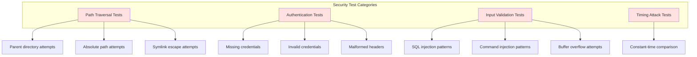

**Security Test Locations:**

| Test Category | Test Path | Focus Area |
|---------------|-----------|------------|
| Path Traversal | tests/security/path_traversal_tests.rs | File system security boundaries |
| Authentication | tests/security/auth_security_tests.rs | Credential validation and timing attacks |
| Input Validation | tests/security/input_validation_tests.rs | Injection attack prevention |
| Rate Limiting | tests/security/rate_limit_tests.rs | DoS prevention (future) |

**Path Traversal Test Cases:**

| Attack Vector | Input Example | Expected Behavior |
|---------------|---------------|-------------------|
| Parent traversal | ../etc/passwd | Bad Request |
| Multi-level traversal | ../../etc/passwd | Bad Request |
| Hidden traversal | data/../../etc/passwd | Bad Request |
| Deep traversal | data/../../../etc/passwd | Bad Request |
| Encoded traversal | URL encoded dots and slashes | Bad Request |
| Mixed separators | Backslashes and slashes | Bad Request |
| Symlink escape | Symlink pointing outside sandbox | Forbidden |

**Authentication Security Tests:**

| Test Case | Scenario | Expected Behavior |
|-----------|----------|-------------------|
| Missing header | No Authorization header | Unauthorized |
| Invalid credentials | Wrong username/password | Unauthorized |
| Malformed header | Invalid Base64 encoding | Bad Request |
| Empty credentials | Empty username or password | Unauthorized |
| Long credentials | Very long username/password | Bad Request or Unauthorized |
| Timing attack | Measure comparison time | Constant-time verification |

**Timing Attack Test Strategy:**

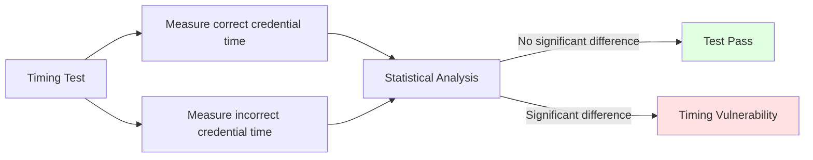

**Timing Test Methodology:**

1. Run credential verification 1000+ times
2. Measure execution time for correct credentials
3. Measure execution time for incorrect credentials
4. Perform statistical analysis
5. Verify no statistically significant time difference
6. Ensures resistant to timing-based side-channel attacks

**Input Validation Security Tests:**

| Attack Type | Test Input | Expected Behavior |
|-------------|-----------|-------------------|
| Null byte injection | file with null byte | Reject with validation error |
| Control characters | Filename with newline or carriage return | Reject with validation error |
| Extremely long input | 10,000 character filename | Reject with max length error |
| Unicode exploits | Bidirectional override characters | Accept or sanitize safely |
| Path injection | Filename containing path traversal | Reject with validation error |

**Security Test Goals:**

- Verify defense-in-depth layers
- Ensure no single validation failure exposes system
- Test both positive (blocked attacks) and negative (legitimate use) cases
- Document expected security behavior

---

## 9. Performance Testing

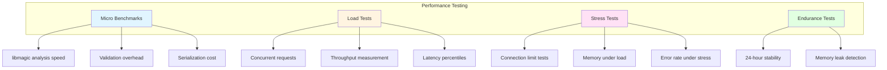

### 9.1. Micro Benchmarks

**Benchmark Locations:**

| Benchmark | File Path | Framework |
|-----------|-----------|-----------|
| Magic analysis | benches/magic_analysis_benchmark.rs | criterion |
| Validation | benches/validation_benchmark.rs | criterion |
| HTTP throughput | benches/http_throughput_benchmark.rs | criterion |

**Benchmark Scenarios:**

| Operation | Input Size | Measured Metric |
|-----------|-----------|-----------------|
| Analyze text | Various sizes | Execution time |
| Analyze binary | Various sizes | Execution time |
| Filename validation | Various valid/invalid patterns | Execution time |
| Path validation | Various path patterns | Execution time |
| Request serialization | Typical JSON response | Execution time |

**Performance Targets:**

| Operation | Target | Measurement |
|-----------|--------|-------------|
| Small file analysis (< 1MB) | < 100ms | p95 latency |
| Large file analysis (100MB) | < 5s | p95 latency |
| Validation overhead | < 10µs | Average |
| Request handling (no analysis) | < 10ms | p95 latency |

### 9.2. Load Testing

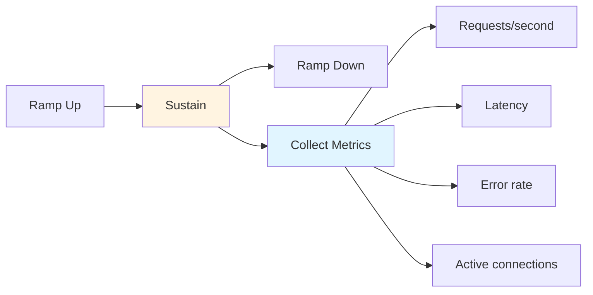

**Load Test Scenarios:**

| Scenario | Virtual Users | Duration | Target RPS | Success Criteria |
|----------|--------------|----------|------------|------------------|
| Normal load | 100 | 5 minutes | 500-1000 | < 1% errors, p95 < 500ms |
| High load | 500 | 5 minutes | 2000-3000 | < 5% errors, p95 < 1s |
| Spike test | Sudden increase | 2 minutes | Varies | Graceful degradation |

**Load Test Tool:** k6

**Load Test Metrics:**

| Metric | Collection Method | Acceptance Threshold |
|--------|------------------|---------------------|
| Throughput (RPS) | load test tool | > 500 req/s |
| Response time p50 | load test tool | < 200ms |
| Response time p95 | load test tool | < 500ms |
| Response time p99 | load test tool | < 1000ms |
| Error rate | load test tool | < 1% |
| Concurrent connections | Server metrics | < 1000 |

### 9.3. Stress Testing

**Stress Test Objectives:**

- Find breaking point (maximum capacity)
- Verify graceful degradation
- Confirm timeout enforcement
- Test connection limit behavior
- Identify memory leaks under pressure

**Stress Test Scenarios:**

| Test Type | Configuration | Expected Behavior |
|-----------|--------------|-------------------|
| Connection limit | Open many connections | Reject after limit |
| Memory stress | Continuous large requests | Stable memory, no leaks |
| Timeout stress | Slow client connections | Timeout and release resources |
| Error rate spike | Send many invalid requests | Maintain throughput for valid requests |

### 9.4. Endurance Testing

**Endurance Test Configuration:**

| Parameter | Value | Purpose |
|-----------|-------|---------|
| Duration | 24 hours | Detect slow leaks |
| Load | 50% capacity | Sustainable load |
| Monitoring | Periodic | Memory, CPU, connections |

**Monitored Metrics:**

- Memory usage
- CPU utilization
- Active connections
- Request latency
- Error rate
- File descriptor count

**Acceptance Criteria:**

- Memory usage remains stable
- No file descriptor leaks
- Response times remain consistent
- Error rate stays low

---

## 10. Coverage Requirements

```mermaid
graph TB
    subgraph Coverage Targets by Layer
        Domain[Domain Layer<br/>Min: 90% | Target: 95%]
        Application[Application Layer<br/>Min: 85% | Target: 90%]
        Infrastructure[Infrastructure Layer<br/>Min: 70% | Target: 80%]
        Presentation[Presentation Layer<br/>Min: 75% | Target: 85%]
    end
    
    Overall[Overall Project<br/>Min: 80% | Target: 90%]
    
    Domain --> Overall
    Application --> Overall
    Infrastructure --> Overall
    Presentation --> Overall
    
    style Domain fill:#e1f5ff
    style Application fill:#fff4e1
    style Infrastructure fill:#ffe1f5
    style Presentation fill:#e1ffe1
```

**Coverage Requirements by Layer:**

| Layer | Minimum Coverage | Target Coverage | Rationale |
|-------|-----------------|-----------------|-----------|
| Domain | 90% | 95% | Pure business logic must be thoroughly tested |
| Application | 85% | 90% | Use cases coordinate critical workflows |
| Infrastructure | 70% | 80% | Some external integration code hard to test |
| Presentation | 75% | 85% | HTTP layer has framework-generated code |
| **Overall** | **80%** | **90%** | High confidence for production deployment |

**Coverage Measurement:**

| Tool | Purpose | Output Format |
|------|---------|---------------|
| coverage tool | Line and branch coverage | HTML, XML, JSON |
| coverage dashboard | Tracking and visualization | Web dashboard |

**Coverage Exclusions:**

- Generated code
- Main function boilerplate
- Debug-only code paths
- Unreachable branches
- External components

**Coverage Enforcement:**

- CI pipeline fails if coverage drops below minimum
- PRs require coverage report attached
- Coverage trend tracked over time
- Uncovered critical paths flagged for review

---

## 11. Test Infrastructure

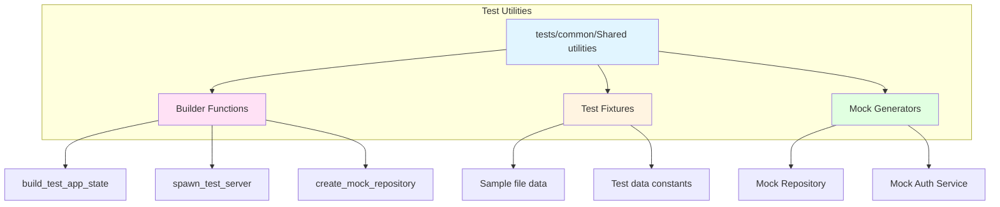

**Test Utilities Location:** tests/common/mod.rs

**Utility Functions:**

| Function | Purpose | Returns |
|----------|---------|---------|
| build_test_app_state | Creates application state with test configuration | Application state |
| spawn_test_server | Starts HTTP server on random port | Server handle + URL |
| create_test_file | Creates file in temporary directory | Path to file |
| cleanup_test_files | Removes test files and directories | Success or failure |
| generate_test_data | Creates various file type samples | Collection of samples |
| create_mock_repository | Builds mock repository with defaults | Mock repository |

**Test Fixtures:**

| Fixture Type | Location | Content |
|--------------|----------|---------|
| Sample files | tests/fixtures/files/ | Text, JSON, XML, binary samples |
| Test credentials | tests/common/ | Default test username/password |
| Mock responses | tests/common/ | Predefined MIME types and descriptions |

**Fixture Examples:**

- sample.txt - Plain text file
- sample.json - JSON document
- sample.png - PNG image
- empty.bin - Empty file

**Test Helper Patterns:**

All tests can use shared utilities to:
- Avoid code duplication
- Ensure consistent test setup
- Simplify test maintenance
- Provide realistic test data

---

## 12. Continuous Integration

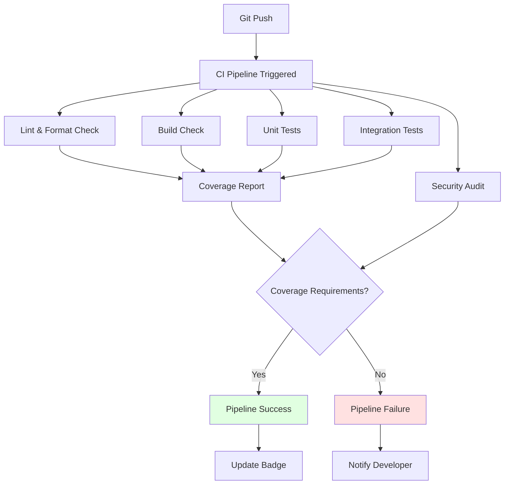

**CI Workflow Stages:**

| Stage | Command | Duration | Failure Action |
|-------|---------|----------|---------------|
| Lint | Static analysis | 30s | Block PR |
| Format | Style check | 10s | Block PR |
| Build | Compile project | 2-3min | Block PR |
| Unit Tests | Library tests | 1-2min | Block PR |
| Integration Tests | Cross-module tests | 2-3min | Block PR |
| Doc Tests | Documentation tests | 30s | Block PR |
| Coverage | Measure coverage | 3-5min | Warn if below threshold |
| Security Audit | Vulnerability scan | 30s | Warn on high severity |

**CI Environments:**

| Environment | OS | Toolchain | Purpose |
|-------------|----|-----------|---------| |
| Primary | Ubuntu | Stable | Main test suite |
| MSRV | Ubuntu | Minimum supported version | Stability check |
| Nightly | Ubuntu | Nightly | Early warning |

**CI Triggers:**

- Every push to any branch
- Every pull request
- Daily scheduled run
- Manual workflow dispatch

**Artifacts:**

| Artifact | Format | Retention | Purpose |
|----------|--------|-----------|---------|
| Coverage report | HTML | 30 days | Debug coverage issues |
| Test results | XML | 30 days | Failure analysis |
| Build logs | Text | 7 days | Build troubleshooting |
| Binary | Executable | 7 days | Testing/deployment |

**Quality Gates:**

All checks must pass before merge:
- Zero compiler warnings
- Zero analysis warnings
- All tests pass
- Coverage meets minimum requirements
- No high-severity security vulnerabilities
- Code formatted correctly

---

## Summary

This testing strategy ensures:

1. **Comprehensive Coverage** - 80%+ code coverage across all layers
2. **Fast Feedback** - Unit tests provide rapid iteration cycles
3. **Reliable Integration** - Real components tested together
4. **Security Validation** - Specific tests for common vulnerabilities
5. **Performance Baselines** - Benchmarks detect regressions
6. **Production Confidence** - E2E tests validate user workflows
7. **Continuous Quality** - CI pipeline enforces standards

The multi-layer testing approach provides defense in depth, catching issues at the appropriate testing level for fast feedback and comprehensive validation.

---

## Summary

This testing strategy ensures:
- **Comprehensive coverage** across all architectural layers
- **Fast feedback** with unit tests dominating the pyramid
- **Regression prevention** through property-based testing
- **Security validation** against common vulnerabilities
- **Performance baselines** with benchmarks
- **CI/CD integration** for automated quality gates

All tests must pass before merging to main branch.
