# Testing Strategy - Linux File Magic API Server <!-- omit in toc -->

- [1. Testing Philosophy](#1-testing-philosophy)
- [2. Test Organization](#2-test-organization)
- [3. Test Pyramid](#3-test-pyramid)
- [4. Testing by Layer](#4-testing-by-layer)
  - [4.1. Domain Layer Testing](#41-domain-layer-testing)
  - [4.2. Application Layer Testing](#42-application-layer-testing)
  - [4.3. Large Content Handling Testing](#43-large-content-handling-testing)
  - [4.4. libmagic FFI Testing](#44-libmagic-ffi-testing)
  - [4.5. Presentation Layer Testing](#45-presentation-layer-testing)
  - [4.6. Infrastructure Layer Testing (Other)](#46-infrastructure-layer-testing-other)
  - [4.7. Error Message Validation Testing](#47-error-message-validation-testing)
- [5. Property-Based Testing](#5-property-based-testing)
- [6. Integration Testing Strategy](#6-integration-testing-strategy)
- [7. End-to-End Testing](#7-end-to-end-testing)
- [8. Security Testing](#8-security-testing)
- [9. Performance Testing](#9-performance-testing)
- [10. Coverage Requirements](#10-coverage-requirements)
- [11. Test Infrastructure](#11-test-infrastructure)
- [12. Continuous Integration](#12-continuous-integration)

---

## 1. Testing Philosophy

**Goals:**
- Ensure correctness of business rules and domain invariants
- Prevent regressions through comprehensive test coverage
- Provide executable specifications that document behavior
- Enable confident production deployments without manual QA

**Principles:**
- Test observable behavior, not implementation details
- Prefer integration tests for complex interactions
- Use property-based testing for validation logic and edge cases
- Mock only at architectural boundaries (domain trait implementations)
- Fast feedback loops with unit tests forming the pyramid base
- Maintain test independence - no shared mutable state between tests

---

## 2. Test Organization

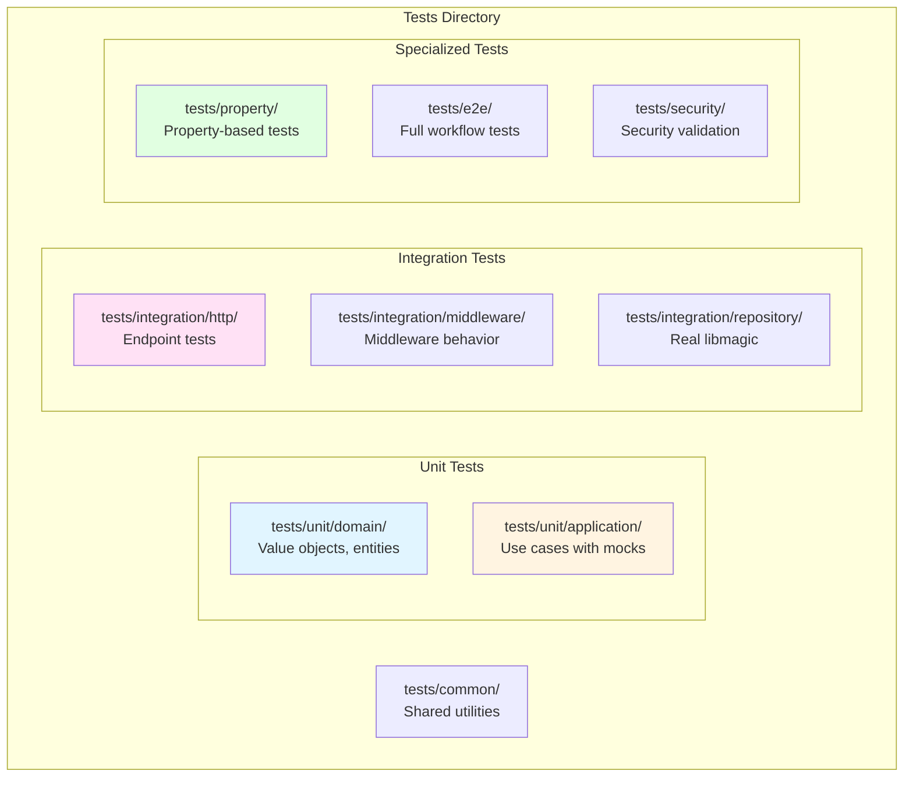

**Test Directory Structure:**

| Path | Purpose | Test Type |
|------|---------|-----------|
| `tests/common/` | Shared test utilities, fixtures, mock builders | Helper code |
| `tests/unit/domain/` | Domain value objects and entities | Unit tests |
| `tests/unit/application/` | Use case logic with mocked repositories | Unit tests |
| `tests/integration/http/` | HTTP endpoints with test server | Integration tests |
| `tests/integration/middleware/` | Middleware stack behavior | Integration tests |
| `tests/integration/repository/` | Repository implementations with real libmagic | Integration tests |
| `tests/property/` | Property-based validation tests | Property tests |
| `tests/e2e/` | Full system workflow tests | E2E tests |
| `tests/security/` | Security vulnerability tests | Security tests |

---

## 3. Test Pyramid

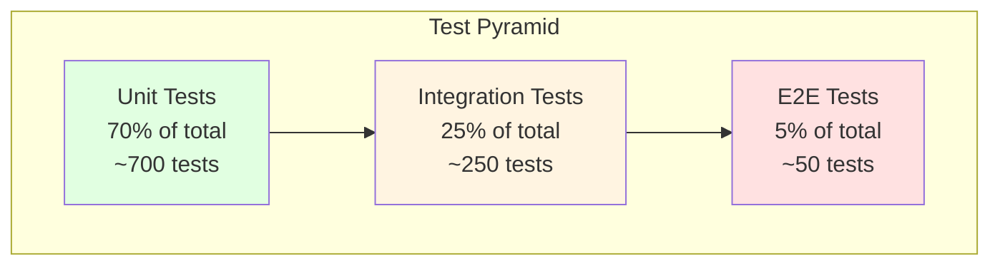

**Distribution Rationale:**

| Layer | Percentage | Focus Areas | Execution Speed |
|-------|-----------|-------------|-----------------|
| Unit | 70% | Domain logic, value objects, use cases | Milliseconds |
| Integration | 25% | HTTP handlers, repository implementations, middleware | Seconds |
| E2E | 5% | Critical user workflows, full system behavior | Seconds to minutes |

**Coverage Targets:**

- Unit tests provide fast feedback on business logic
- Integration tests verify component interactions
- E2E tests validate critical paths from user perspective
- Property-based tests complement all layers with edge case generation

---

## 4. Testing by Layer

### 4.1. Domain Layer Testing

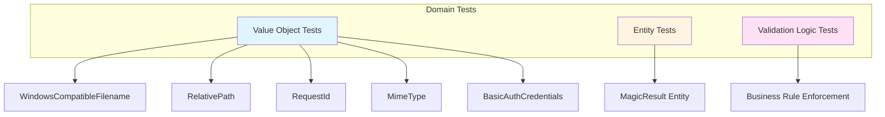

**Domain Layer Test Locations:**

| Component | Test Path | Focus |
|-----------|-----------|-------|
| WindowsCompatibleFilename | `tests/unit/domain/value_objects/filename_tests.rs` | Max length, forbidden characters, empty values |
| RelativePath | `tests/unit/domain/value_objects/file_path_tests.rs` | Path traversal prevention, absolute path rejection |
| RequestId | `tests/unit/domain/value_objects/request_id_tests.rs` | UUID generation, parsing validation |
| MimeType | `tests/unit/domain/value_objects/mime_type_tests.rs` | MIME type format validation |
| MagicResult | `tests/unit/domain/entities/magic_result_tests.rs` | Entity construction, field access |

**WindowsCompatibleFilename Test Scenarios:**

| Test Case | Expected Behavior |
|-----------|------------------|
| Valid filename "test.txt" | Accept |
| Filename with `/` character | Reject with InvalidCharacter error |
| Filename with `\0` null byte | Reject with InvalidCharacter error |
| Filename exceeding 310 characters | Reject with ExceedsMaxLength error |
| Filename at exactly 310 characters | Accept |
| Empty string | Reject with EmptyValue error |
| Unicode filename "файл_测试_🎉.txt" | Accept (UTF-8 support) |

**RelativePath Test Scenarios:**

| Input Path | Expected Behavior | Reason |
|-----------|------------------|--------|
| "uploads/file.txt" | Accept | Valid relative path |
| "/etc/passwd" | Reject | Absolute path (leading /) |
| "../etc/passwd" | Reject | Parent traversal (..) |
| "data/../../secret" | Reject | Contains .. |
| "data//file.txt" | Reject | Double slash |
| "data/." | Reject | Ends with dot |
| " data/file.txt" | Reject | Leading space |

**Entity Test Coverage:**

- Verify all entity fields are properly initialized
- Test field accessor methods return correct values
- Validate entity identity comparison (for entities with ID)
- Ensure immutability where required

### 4.2. Application Layer Testing

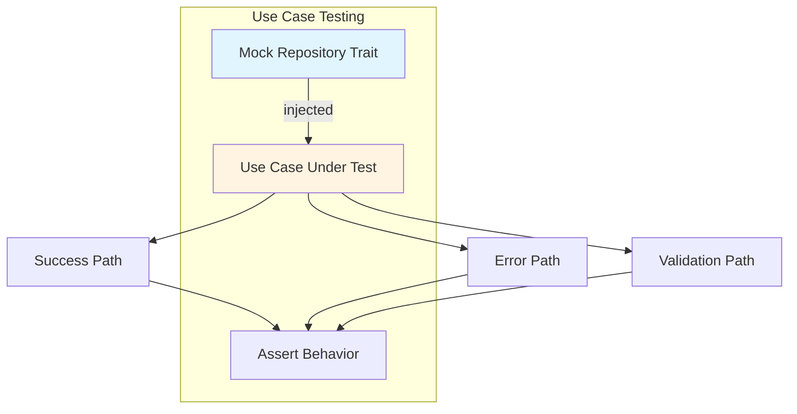

**Application Layer Test Locations:**

| Use Case | Test Path | Mock Strategy |
|----------|-----------|---------------|
| AnalyzeContentUseCase | `tests/unit/application/use_cases/analyze_content_tests.rs` | Mock MagicRepository trait |
| AnalyzePathUseCase | `tests/unit/application/use_cases/analyze_path_tests.rs` | Mock MagicRepository trait |
| HealthCheckUseCase | `tests/unit/application/use_cases/health_check_tests.rs` | No mocks needed |

**AnalyzeContentUseCase Test Scenarios:**

| Scenario | Mock Behavior | Expected Result |
|----------|---------------|-----------------|
| Small content (< threshold) | Return (MimeType, description) | Success, direct buffer analysis |
| Large content (≥ threshold) | Return (MimeType, description) | Success, temp file + mmap |
| Repository failure | Return MagicError | ApplicationError::MagicAnalysis |
| Empty content | N/A (caught before repository call) | ApplicationError::Validation |
| Timeout during analysis | Timeout after 30s | ApplicationError::Timeout |
| Large payload (100MB) | Return success | Success (boundary test) |
| Temp file creation fails | Disk full scenario | ApplicationError::InsufficientStorage |
| Temp file cleanup on error | Mock returns error | Temp file still deleted (RAII) |
| Concurrent large files | Multiple parallel requests | All succeed, no file conflicts |

**AnalyzePathUseCase Test Scenarios:**

| Scenario | Mock Behavior | Expected Result |
|----------|---------------|-----------------|
| Valid file path | Return (MimeType, description) | Success with response DTO |
| File not found | N/A (filesystem check fails first) | ApplicationError::NotFound |
| Path outside sandbox | N/A (validation rejects before repository) | ApplicationError::Validation |
| Repository failure | Return MagicError | ApplicationError::MagicAnalysis |

**Mock Strategy:**

- Use `mockall` crate to generate mock implementations of repository traits
- Configure mock expectations for specific test scenarios
- Verify mock methods called with correct parameters
- Test both success and failure paths

### 4.3. Large Content Handling Testing

**Test Location:** `tests/unit/application/use_cases/large_content_tests.rs`

#### Unit Tests with Mocks

| Test Case | Setup | Verification |
|-----------|-------|--------------|
| Threshold detection | Content exactly at threshold | Correct path chosen (memory vs file) |
| Buffer writing | Large content > threshold | Content written in chunks |
| Mmap creation | Temp file created | Mmap slice matches original content |
| Cleanup on success | Analysis completes | Temp file deleted |
| Cleanup on error | Analysis fails | Temp file still deleted |
| Concurrent requests | Multiple large files | Unique temp file names, no conflicts |

#### Integration Tests

**Test Location:** `tests/integration/large_content_tests.rs`

| Test Case | Input | Expected Behavior |
|-----------|-------|-------------------|
| Small file (1MB) | Text content | Direct buffer analysis, no temp file |
| At threshold (10MB) | Binary content | File-based analysis triggered |
| Large file (50MB) | PDF content | Streamed to temp, mmap analysis |
| Very large (100MB) | Max size payload | Success with file-based analysis |
| Disk full scenario | Mock filesystem full | 507 Insufficient Storage error |
| Mmap failure | Mock mmap error | Graceful error handling |
| Temp dir missing | Missing directory | Automatic creation or clear error |
| Permission denied | Read-only temp dir | 500 Internal Server Error |

#### Resource Management Tests

**Test Location:** `tests/integration/resource_management_tests.rs`

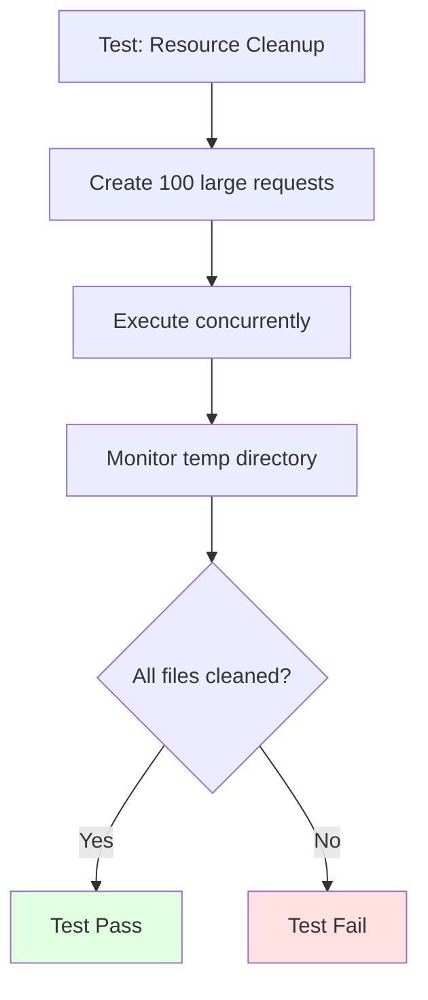

| Test Case | Scenario | Verification |
|-----------|----------|--------------|
| Serial cleanup | Process 100 requests serially | Zero temp files remain |
| Concurrent cleanup | 50 concurrent large requests | All temp files cleaned |
| Panic during analysis | Force panic in analysis | Drop runs, file deleted |
| Timeout with cleanup | Request times out | Temp file cleaned before timeout response |
| Orphaned file detection | Manually create old temp files | Background cleanup removes them |

#### Performance Tests

**Test Location:** `benches/large_content_benchmark.rs`

| Benchmark | Input Size | Measured Metric |
|-----------|-----------|-----------------|
| Memory analysis | 1MB, 5MB, 9MB | Throughput (req/s) |
| File-based analysis | 10MB, 50MB, 100MB | Throughput (req/s) |
| Write buffer impact | 10MB with 16KB, 64KB, 256KB buffers | Write time |
| Mmap overhead | 10MB file vs buffer | Analysis time difference |
| Concurrent large files | 10 x 50MB files | Total time, resource usage |

#### Memory Profiling Tests

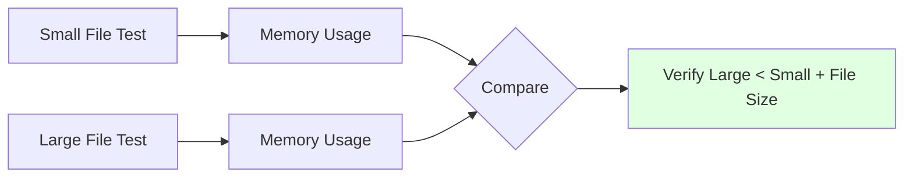

**Test Strategy:**
- Use memory profiler (e.g., valgrind massif)
- Compare memory usage: small file vs large file
- Verify large file doesn't load entire content into memory
- Confirm mmap doesn't duplicate data

#### Disk Space Exhaustion Tests

**Test Location:** `tests/integration/disk_space_tests.rs`

Test scenarios for disk full conditions during streaming operations.

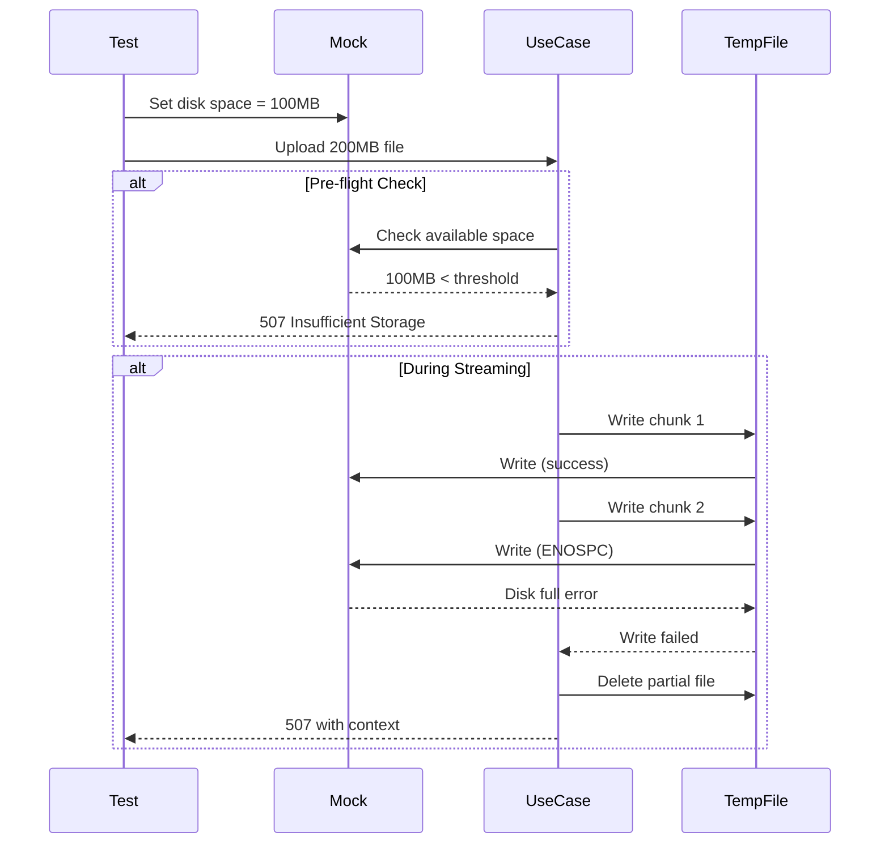

| Test Case | Setup | Expected Behavior | Verification |
|-----------|-------|-------------------|--------------|
| Pre-flight check fails | Set `available < min_free_space_mb` | Reject before temp file created | 507 error, no temp file created |
| Disk full at chunk 1 | Mock ENOSPC on first write | Immediate error with context | 507 error, partial file cleaned up |
| Disk full mid-stream | Mock ENOSPC at 50MB offset | Error includes offset in message | Error: "Failed to write chunk at offset 52428800" |
| Disk full at flush | Mock ENOSPC on flush() | Cleanup and error | Partial file deleted, 507 returned |
| Concurrent space check | Multiple requests check space simultaneously | All get consistent results | No race conditions |
| Space freed during request | Disk space increases mid-request | Request continues successfully | Complete successfully |

**Mock Implementation:**

```rust
struct MockFilesystem {
    available_space: AtomicU64,
    fail_at_offset: Option<u64>,
}

impl MockFilesystem {
    fn set_available_space(&self, bytes: u64) {
        self.available_space.store(bytes, Ordering::SeqCst);
    }
    
    fn write(&self, offset: u64, data: &[u8]) -> Result<(), io::Error> {
        if let Some(fail_offset) = self.fail_at_offset {
            if offset >= fail_offset {
                return Err(io::Error::from_raw_os_error(ENOSPC));
            }
        }
        // Simulate write
        Ok(())
    }
}
```

#### Partial Write Recovery Tests

**Test Location:** `tests/integration/partial_write_tests.rs`

Test cleanup and error handling when writes fail partway through streaming.

| Test Case | Failure Point | Expected Recovery | Verification |
|-----------|--------------|-------------------|--------------|
| Fail at 25% | After 25MB written | Delete partial file, return error | Temp file deleted, error includes offset |
| Fail at 50% | After 50MB written | Delete partial file, return error | No orphaned 50MB file remains |
| Fail at 99% | After 99MB written | Delete partial file, return error | Complete cleanup despite large size |
| Cleanup fails | Write fails AND unlink fails | Log warning, return original error | Warning logged, 507 still returned |
| Multiple concurrent failures | 10 requests fail simultaneously | All partial files cleaned | Temp dir empty after tests |
| Panic during write | Force panic mid-write | Drop trait runs, file deleted | RAII cleanup successful |

**Test Implementation Pattern:**

```rust
#[tokio::test]
async fn test_partial_write_cleanup() {
    // Setup: Create mock that fails at 50MB
    let mock_fs = MockFilesystem::fail_at_offset(50 * 1024 * 1024);
    let temp_dir = TempDir::new().unwrap();
    
    // Execute: Try to write 100MB file
    let result = analyze_large_content(
        100_000_000_bytes,
        &mock_fs,
        &temp_dir,
    ).await;
    
    // Verify: Error returned
    assert!(result.is_err());
    let err = result.unwrap_err();
    assert!(err.to_string().contains("Failed to write chunk at offset"));
    assert!(err.to_string().contains("52428800")); // 50MB
    
    // Verify: Partial file cleaned up
    let temp_files = std::fs::read_dir(&temp_dir).unwrap().count();
    assert_eq!(temp_files, 0, "Partial file not cleaned up");
    
    // Verify: Error includes context
    assert!(err.to_string().contains("No space left on device") ||
            err.to_string().contains("ENOSPC"));
}
```

**Edge Cases:**

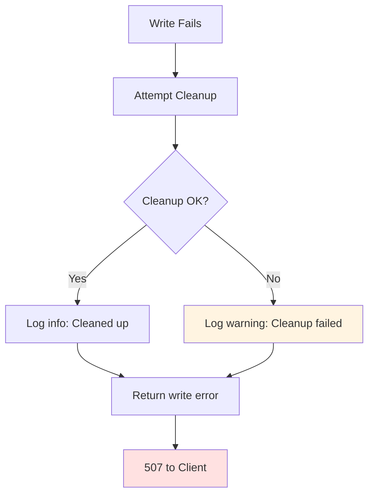

#### File Descriptor Exhaustion Tests

**Test Location:** `tests/integration/fd_limit_tests.rs`

Test behavior when file descriptor limits are reached.

| Test Case | Setup | Expected Behavior | Verification |
|-----------|-------|-------------------|--------------|
| Reach FD limit | Open `max_open_files` connections | Reject new connections | 503 Service Unavailable |
| FD limit with temp files | `max_connections/2` + temp files = limit | Graceful degradation | Some requests succeed, others 503 |
| Temp file creation at limit | All FDs used, try create temp | Clear error message | Error: "too many open files" |
| FD leak detection | Run 1000 requests, check FD count | No leaks | Final FD count ≈ initial count |
| Concurrent FD exhaustion | Multiple threads hit limit simultaneously | Thread-safe error handling | No panics, consistent errors |
| Recovery after limit | Close connections, retry | Requests succeed after FDs freed | Successful after cleanup |

**Test Implementation:**

```rust
#[tokio::test]
async fn test_fd_exhaustion_graceful_degradation() {
    // Setup: Set low FD limit
    let config = TestConfig {
        max_open_files: 100,
        max_connections: 50,
    };
    let app = spawn_test_app(config).await;
    
    // Execute: Open connections until limit reached
    let mut handles = vec![];
    for i in 0..60 {
        let handle = tokio::spawn(async move {
            app.post("/v1/magic/content")
                .body(large_content())
                .send()
                .await
        });
        handles.push(handle);
    }
    
    // Verify: Some succeed, some rejected
    let results: Vec<_> = join_all(handles).await;
    let successes = results.iter().filter(|r| r.is_ok()).count();
    let failures = results.iter().filter(|r| r.is_err()).count();
    
    assert!(successes > 0, "Some requests should succeed");
    assert!(failures > 0, "Some requests should be rejected");
    
    // Verify: Error messages clear
    for result in results.iter().filter(|r| r.is_err()) {
        let err = result.as_ref().unwrap_err();
        assert!(err.to_string().contains("too many") ||
                err.to_string().contains("503"));
    }
}
```

**Monitoring Verification:**

```rust
#[tokio::test]
async fn test_fd_metrics_updated() {
    let metrics = TestMetrics::new();
    let app = spawn_test_app_with_metrics(metrics.clone()).await;
    
    // Execute: Create connections
    let _conn1 = app.connect().await;
    let _conn2 = app.connect().await;
    
    // Verify: Metrics updated
    assert_eq!(metrics.get("open_file_descriptors"), 2);
    assert!(metrics.get("fd_usage_percentage") > 0.0);
    
    // Execute: Close connections
    drop(_conn1);
    drop(_conn2);
    
    // Verify: Metrics decremented
    assert_eq!(metrics.get("open_file_descriptors"), 0);
}
```

#### Orphaned File Cleanup Tests

**Test Location:** `tests/integration/orphaned_file_tests.rs`

Test automatic cleanup of files left behind after crashes or failures.

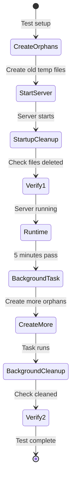

| Test Case | Setup | Expected Behavior | Verification |
|-----------|-------|-------------------|--------------|
| Startup cleanup | Create files older than `temp_file_max_age_secs` | Deleted on startup | Files removed before server ready |
| Startup preserves recent | Create files younger than threshold | Preserved on startup | Recent files remain |
| Background task runs | Wait 5 minutes with old files | Cleanup task executes | Files deleted automatically |
| Background task interval | Monitor for 15 minutes | Task runs 3 times | Consistent 5-minute interval |
| Large orphan cleanup | Create 1000 old temp files | All deleted in one sweep | Temp dir empty after cleanup |
| Concurrent cleanup | Cleanup runs while requests active | No interference | Active files unaffected |
| Cleanup metrics | Old files present | Metrics updated | `orphaned_files_cleaned_total` incremented |

**Test Implementation:**

```rust
#[tokio::test]
async fn test_startup_cleanup_orphaned_files() {
    let temp_dir = TempDir::new().unwrap();
    
    // Setup: Create orphaned temp files
    let old_file = create_temp_file_with_age(&temp_dir, Duration::hours(2));
    let recent_file = create_temp_file_with_age(&temp_dir, Duration::minutes(5));
    
    // Setup: Configure server with 1 hour threshold
    let config = TestConfig {
        temp_file_max_age_secs: 3600, // 1 hour
        temp_dir: temp_dir.path(),
    };
    
    // Execute: Start server (triggers startup cleanup)
    let _app = spawn_test_app(config).await;
    
    // Verify: Old file deleted
    assert!(!old_file.exists(), "Old file should be cleaned up");
    
    // Verify: Recent file preserved
    assert!(recent_file.exists(), "Recent file should be preserved");
}

#[tokio::test]
async fn test_background_cleanup_task() {
    let temp_dir = TempDir::new().unwrap();
    let app = spawn_test_app_with_temp_dir(&temp_dir).await;
    
    // Execute: Create orphaned file while server running
    tokio::time::sleep(Duration::seconds(10)).await;
    let orphan = create_temp_file_with_age(&temp_dir, Duration::hours(2));
    
    // Execute: Wait for background task (runs every 5 min)
    tokio::time::sleep(Duration::minutes(6)).await;
    
    // Verify: Orphan cleaned up
    assert!(!orphan.exists(), "Background task should clean orphan");
}
```

**Cleanup Verification Helper:**

```rust
async fn verify_no_orphans(temp_dir: &Path, max_age: Duration) -> Result<()> {
    let now = SystemTime::now();
    
    for entry in std::fs::read_dir(temp_dir)? {
        let entry = entry?;
        let metadata = entry.metadata()?;
        let modified = metadata.modified()?;
        let age = now.duration_since(modified)?;
        
        if age > max_age {
            return Err(anyhow!(
                "Found orphaned file: {:?}, age: {:?}",
                entry.path(),
                age
            ));
        }
    }
    
    Ok(())
}
```

#### Mmap Failure Fallback Tests

**Test Location:** `tests/integration/mmap_fallback_tests.rs`

Test graceful degradation when memory mapping fails.

| Test Case | Trigger Condition | `mmap_fallback_enabled=true` | `mmap_fallback_enabled=false` |
|-----------|------------------|------------------------------|-------------------------------|
| Resource limit exceeded | Mock `ENOMEM` | Falls back to buffer, succeeds | Returns 500 error immediately |
| Invalid file size | Zero-byte temp file | Falls back to buffer | Returns 500 error |
| Mmap not supported | Mock unsupported filesystem | Falls back to buffer | Returns 500 error |
| Multiple concurrent failures | 10 mmap failures at once | All fall back successfully | All fail with errors |
| Fallback performance | Measure time with fallback | Slower but completes | N/A (fails) |
| Metrics tracking | Mmap fails | `mmap_fallback_used_total++` | `mmap_failures_total++` |

**Test Implementation:**

```rust
#[tokio::test]
async fn test_mmap_fallback_enabled() {
    // Setup: Mock mmap to fail
    let mock_mmap = MockMmap::fail_with(ErrorKind::OutOfMemory);
    let config = TestConfig {
        mmap_fallback_enabled: true,
    };
    
    // Execute: Analyze large file
    let result = analyze_large_content_with_mock(
        50_000_000_bytes,
        mock_mmap,
        config,
    ).await;
    
    // Verify: Request succeeds via fallback
    assert!(result.is_ok(), "Should succeed with fallback");
    
    // Verify: Metrics updated
    assert_eq!(metrics.get("mmap_fallback_used_total"), 1);
    
    // Verify: Warning logged
    assert_logs_contain("mmap failed, using buffer fallback");
}

#[tokio::test]
async fn test_mmap_fallback_disabled() {
    // Setup: Mock mmap to fail
    let mock_mmap = MockMmap::fail_with(ErrorKind::OutOfMemory);
    let config = TestConfig {
        mmap_fallback_enabled: false,
    };
    
    // Execute: Analyze large file
    let result = analyze_large_content_with_mock(
        50_000_000_bytes,
        mock_mmap,
        config,
    ).await;
    
    // Verify: Request fails
    assert!(result.is_err(), "Should fail without fallback");
    let err = result.unwrap_err();
    
    // Verify: Error message includes context
    assert!(err.to_string().contains("Failed to memory map file"));
    assert!(err.to_string().contains("resource limit") ||
            err.to_string().contains("out of memory"));
    
    // Verify: Metrics updated
    assert_eq!(metrics.get("mmap_failures_total"), 1);
}
```

**Performance Comparison Test:**

```rust
#[tokio::test]
async fn test_fallback_performance_impact() {
    let test_file = create_test_file(50_000_000); // 50MB
    
    // Measure: Normal mmap performance
    let start = Instant::now();
    let _result1 = analyze_with_mmap(&test_file).await.unwrap();
    let mmap_duration = start.elapsed();
    
    // Measure: Fallback buffer performance
    let start = Instant::now();
    let _result2 = analyze_with_buffer(&test_file).await.unwrap();
    let buffer_duration = start.elapsed();
    
    // Verify: Fallback is slower but reasonable
    assert!(buffer_duration > mmap_duration);
    assert!(buffer_duration < mmap_duration * 10, 
        "Fallback shouldn't be >10x slower");
    
    println!("Mmap: {:?}, Buffer: {:?}, Ratio: {:.2}x",
        mmap_duration, buffer_duration,
        buffer_duration.as_secs_f64() / mmap_duration.as_secs_f64());
}
```

#### Startup Cleanup Integration Tests

**Test Location:** `tests/integration/startup_tests.rs`

Test complete startup sequence including cleanup and validation.

| Test Case | Pre-conditions | Expected Startup Behavior | Post-startup State |
|-----------|---------------|--------------------------|-------------------|
| Clean start | No temp files | Server starts normally | Ready for requests |
| Orphaned files present | 10 old temp files | Cleanup runs, server starts | Old files deleted, server ready |
| Recent files present | 5 recent temp files | Preserved, server starts | Recent files remain |
| Large cleanup | 1000 old temp files | Cleanup completes, server starts | All old files deleted |
| Cleanup failure | Read-only temp dir | Log warning, server starts anyway | Best-effort cleanup |
| Concurrent startup | 3 server instances | Each cleans independently | No interference |

**Test Implementation:**

```rust
#[tokio::test]
async fn test_startup_sequence_with_cleanup() {
    let temp_dir = TempDir::new().unwrap();
    
    // Setup: Create various temp files
    let old_files = create_temp_files(&temp_dir, 10, Duration::hours(3));
    let recent_files = create_temp_files(&temp_dir, 5, Duration::minutes(10));
    
    // Setup: Capture logs
    let logs = TestLogCapture::new();
    
    // Execute: Start server
    let config = TestConfig {
        temp_dir: temp_dir.path(),
        temp_file_max_age_secs: 3600, // 1 hour
    };
    
    let start = Instant::now();
    let app = spawn_test_app_with_logs(config, logs.clone()).await;
    let startup_duration = start.elapsed();
    
    // Verify: Startup completed quickly
    assert!(startup_duration < Duration::seconds(5),
        "Startup with cleanup should be fast");
    
    // Verify: Old files cleaned
    for file in &old_files {
        assert!(!file.exists(), "Old file should be deleted: {:?}", file);
    }
    
    // Verify: Recent files preserved
    for file in &recent_files {
        assert!(file.exists(), "Recent file should remain: {:?}", file);
    }
    
    // Verify: Cleanup logged
    assert_logs_contain(&logs, "Cleaned up 10 orphaned temp files");
    
    // Verify: Server functional
    let response = app.get("/v1/ping").send().await;
    assert_eq!(response.status(), 200);
}
```

**Startup Validation Tests:**

```rust
#[tokio::test]
async fn test_startup_validation_sequence() {
    let config = TestConfig::default();
    let logs = TestLogCapture::new();
    
    // Execute: Start server with full validation
    let app = spawn_test_app_with_logs(config, logs.clone()).await;
    
    // Verify: All validation steps logged
    assert_logs_contain(&logs, "Validating configuration");
    assert_logs_contain(&logs, "Checking temp directory");
    assert_logs_contain(&logs, "Cleaning orphaned files");
    assert_logs_contain(&logs, "Validating file descriptor limits");
    assert_logs_contain(&logs, "Server ready");
    
    // Verify: Server is functional
    let response = app.get("/v1/ping").send().await;
    assert_eq!(response.status(), 200);
}
```

### 4.4. libmagic FFI Testing

**Test Location:** `tests/infrastructure/magic/ffi_tests.rs`

#### Raw FFI Binding Tests

Testing the unsafe FFI layer with minimal abstractions.

| Test Case | Setup | Verification |
|-----------|-------|--------------|
| Cookie creation | Call `magic_open` with flags | Returns non-NULL pointer |
| Cookie creation failure | Mock resource exhaustion | Returns NULL, handled safely |
| Database loading | Call `magic_load` with default path | Returns 0 (success) |
| Database load failure | Invalid database path | Returns -1, errno set |
| Buffer analysis | Call `magic_buffer` with known data | Returns valid C string pointer |
| File analysis | Call `magic_file` with existing file | Returns valid C string pointer |
| Error retrieval | Force error, call `magic_error` | Returns error message string |
| Errno retrieval | Force error, call `magic_errno` | Returns valid errno code |
| Cookie cleanup | Call `magic_close` | No crash, valgrind shows no leak |
| Double close safety | Call `magic_close` twice | Second call on NULL safe |

#### Safe Wrapper Tests

Testing the safe Rust wrapper over raw FFI.

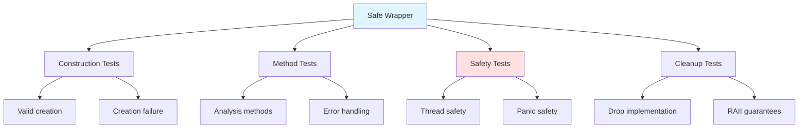

**Test Scenarios:**

| Test Case | Test Type | Verification |
|-----------|-----------|--------------|
| **Construction** | | |
| MagicCookie::new() success | Unit | Cookie created, pointer non-null |
| MagicCookie::new() with flags | Unit | Flags applied correctly |
| Creation with invalid flags | Unit | Error returned, no panic |
| **Analysis Methods** | | |
| analyze_buffer() text | Integration | Detects "text/plain" |
| analyze_buffer() binary | Integration | Detects correct MIME type |
| analyze_buffer() empty | Integration | Returns result, no panic |
| analyze_file() existing | Integration | Correct detection |
| analyze_file() missing | Integration | Returns NotFound error |
| **String Handling** | | |
| C string to Rust conversion | Unit | UTF-8 validation |
| Invalid UTF-8 from libmagic | Unit | Returns InvalidUtf8 error |
| NULL pointer handling | Unit | Returns NullPointer error |
| String lifetime safety | Unit | Copy made before next call |
| **Thread Safety** | | |
| Sequential access | Unit | Multiple calls succeed |
| Arc<Mutex<Cookie>> pattern | Integration | Concurrent access safe |
| !Send + !Sync marker | Compile | Won't compile if sent across threads |
| **Memory Safety** | | |
| Drop runs on panic | Unit | RAII cleanup verified |
| Drop with NULL pointer | Unit | Safe no-op |
| No use-after-free | Miri | Miri detects no violations |
| No double-free | Valgrind | Valgrind shows clean exit |
| No memory leaks | Valgrind | All allocations freed |

#### Error Conversion Tests

**Test Location:** `tests/infrastructure/magic/error_tests.rs`

| C Error Scenario | Errno | Expected Rust Error |
|------------------|-------|---------------------|
| Database not found | ENOENT (2) | MagicError::DatabaseLoad("No such file") |
| Permission denied | EACCES (13) | MagicError::DatabaseLoad("Permission denied") |
| Out of memory | ENOMEM (12) | MagicError::CreationFailed |
| Invalid argument | EINVAL (22) | MagicError::AnalysisFailed |
| Unknown error | Other | MagicError::Unknown with errno |

#### Async Integration Tests

Testing FFI with Tokio's async runtime.

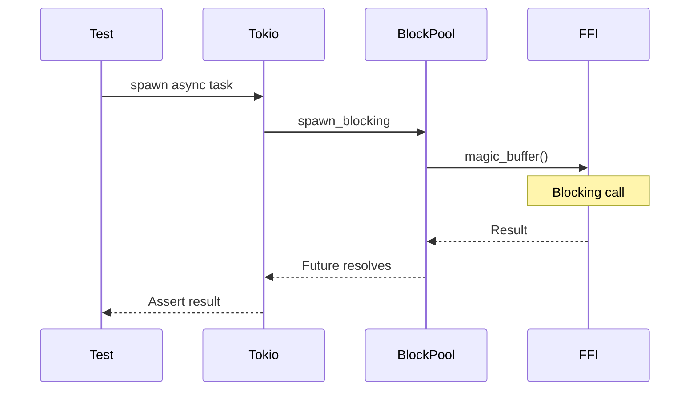

| Test Case | Verification |
|-----------|--------------|
| Single async call | Completes successfully |
| 100 concurrent async calls | All complete, no race conditions |
| Blocking doesn't block runtime | Other tasks make progress |
| Timeout enforcement | Analysis cancelled after 30s |
| Panic in blocking task | Runtime remains stable |

#### Property-Based Tests

**Test Location:** `tests/infrastructure/magic/property_tests.rs`

Using `proptest` to generate random inputs.

| Property | Generator | Invariant |
|----------|-----------|-----------|
| No panic on any input | Random byte arrays (0-100KB) | Always returns Result, never panics |
| Valid UTF-8 output | Any input | Output is valid UTF-8 or error |
| Deterministic results | Same input twice | Same MIME type returned |
| Empty input handling | Empty slice | Returns result, no crash |
| Large input handling | 100MB random data | Completes within timeout or returns timeout error |

#### Miri Testing

Testing for undefined behavior with Rust's interpreter.

**Command:** `cargo +nightly miri test ffi`

**Checks:**
- Use-after-free detection
- Double-free detection
- Uninitialized memory access
- Invalid pointer dereference
- Data races (if using unsafe threading)

**Test Cases:**

| Test | Expected Miri Result |
|------|---------------------|
| Normal cookie lifecycle | Pass |
| Drop during panic | Pass |
| Concurrent access (with Mutex) | Pass |
| String conversion | Pass |
| NULL pointer handling | Pass |

#### Valgrind Testing

Testing for C-level memory issues.

**Command:** `valgrind --leak-check=full --track-origins=yes ./target/debug/ffi_tests`

**Checks:**
- Memory leaks in libmagic
- Invalid reads/writes
- Uninitialized values
- Use of freed memory

**Test Scenarios:**

| Test | Expected Valgrind Output |
|------|-------------------------|
| Create and destroy 1000 cookies | 0 bytes leaked |
| Analyze 100 different files | No invalid reads/writes |
| Error path (failed operations) | All resources freed |
| Concurrent operations | No race conditions reported |

#### Platform-Specific Tests

Testing FFI behavior across different platforms.

| Platform | libmagic Version | Test Focus |
|----------|-----------------|------------|
| Ubuntu 22.04 | 5.41 | Standard behavior |
| Debian 12 | 5.44 | API compatibility |
| Alpine Linux | 5.45 | musl libc compatibility |
| macOS (CI) | Homebrew version | Darwin-specific behavior |

#### Fuzzing Tests

**Tool:** `cargo-fuzz`

**Test Location:** `fuzz/fuzz_targets/ffi_analyze.rs`

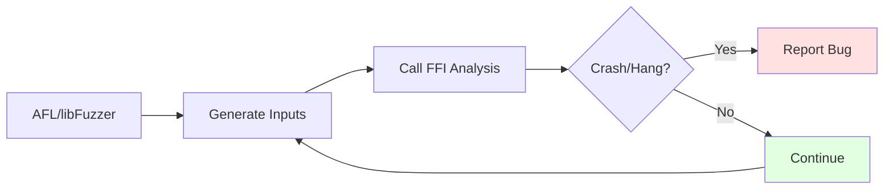

**Fuzz Targets:**

| Target | Input | Goal |
|--------|-------|------|
| ffi_analyze_buffer | Random byte arrays | Find crashes, hangs |
| ffi_load_database | Random file paths | Test path handling |
| ffi_large_input | Large files (up to 100MB) | Test resource limits |
| ffi_malformed_data | Specially crafted malicious files | Find security issues |

**Fuzzing Duration:** 24 hours per target in CI

#### FFI Safety Audit Checklist

Manual review checklist for FFI code safety.

| Check | Requirement | Status |
|-------|-------------|--------|
| All FFI calls in unsafe blocks | ✓ Required | |
| Safety comments on all unsafe | ✓ Required | |
| NULL pointer checks | ✓ Required | |
| Pointer lifetime documented | ✓ Required | |
| Drop implementation correct | ✓ Required | |
| PhantomData markers correct | ✓ Required | |
| String conversion immediate copy | ✓ Required | |
| No raw pointers exposed publicly | ✓ Required | |
| Error handling comprehensive | ✓ Required | |
| Panic safety in Drop | ✓ Required | |

### 4.5. Presentation Layer Testing

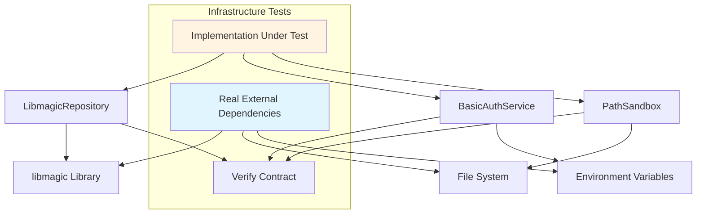

**Infrastructure Test Locations:**

| Component | Test Path | External Dependency |
|-----------|-----------|---------------------|
| LibmagicRepository | `tests/integration/repository/libmagic_integration_tests.rs` | Real libmagic library |
| BasicAuthService | `tests/integration/auth/auth_service_tests.rs` | Real constant-time comparison |
| PathSandbox | `tests/integration/filesystem/sandbox_tests.rs` | Real file system |

**LibmagicRepository Test Scenarios:**

| Input Type | Test Data | Expected Detection |
|-----------|-----------|-------------------|
| Plain text | "Hello, World!" | text/plain or text/... |
| JSON | {"key": "value"} | application/json |
| XML | &lt;?xml version='1.0'?&gt; | application/xml or text/xml |
| PNG image | PNG magic bytes (89 50 4E 47...) | image/png |
| Empty file | Empty byte array | Success (empty file type) |
| Large file | 100MB binary data | Success within timeout |

**PathSandbox Test Scenarios:**

| Test Case | Setup | Expected Behavior |
|-----------|-------|------------------|
| Valid relative path | Create file in sandbox | Return canonicalized path |
| Path escaping sandbox | Create symlink to /etc | Reject with validation error |
| Non-existent path | No file created | Return error (path doesn't exist) |
| Symlink within sandbox | Create valid symlink | Accept and resolve |
| Deeply nested path | Create nested directories | Accept if within sandbox |

### 4.6. Infrastructure Layer Testing (Other)

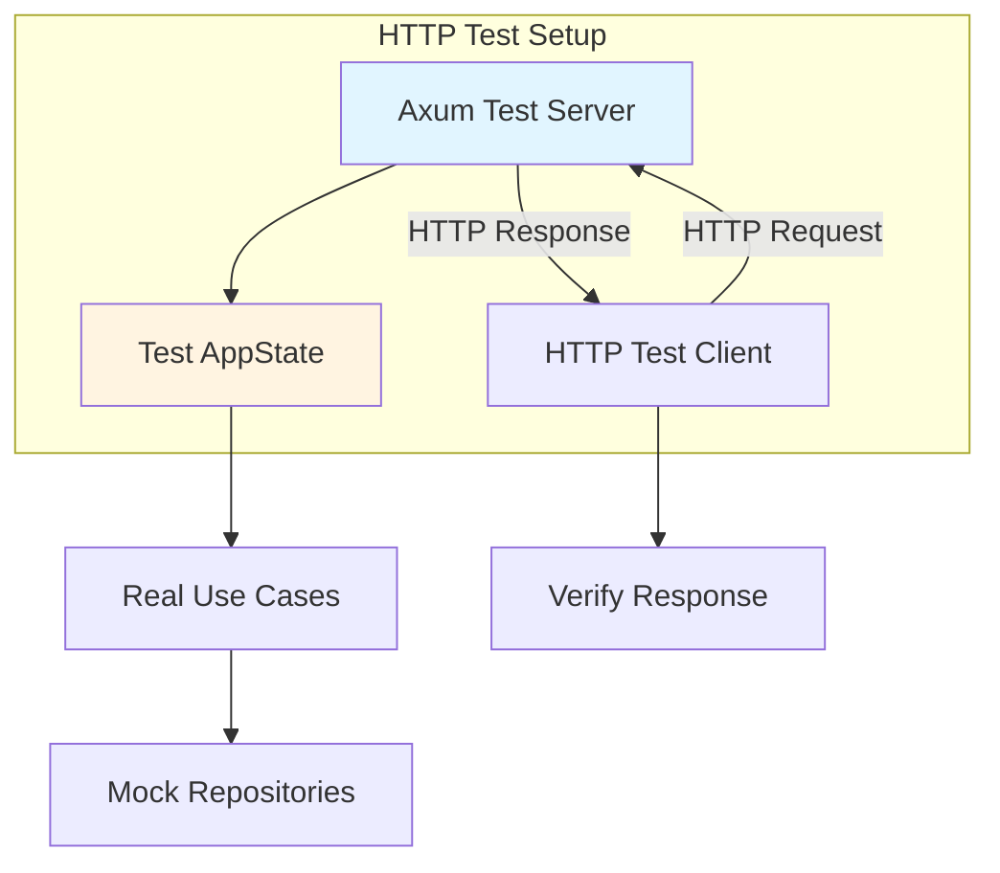

**Presentation Test Locations:**

| Component | Test Path | Test Strategy |
|-----------|-----------|---------------|
| Magic handlers | `tests/integration/http/magic_endpoints_tests.rs` | Full HTTP request/response cycle |
| Health handler | `tests/integration/http/health_endpoint_tests.rs` | Simple GET requests |
| Auth middleware | `tests/integration/middleware/auth_tests.rs` | Test with/without credentials |
| Request ID middleware | `tests/integration/middleware/request_id_tests.rs` | Verify UUID injection |
| Timeout middleware | `tests/integration/middleware/timeout_tests.rs` | Test timeout enforcement |

**HTTP Endpoint Test Scenarios:**

| Endpoint | Scenario | Expected Status | Expected Response |
|----------|----------|----------------|-------------------|
| POST /v1/magic/content | Valid request with auth | 200 OK | JSON with request_id, filename, result |
| POST /v1/magic/content | Small content (1MB) | 200 OK | Fast response, no temp file |
| POST /v1/magic/content | Large content (50MB) | 200 OK | Success with file-based analysis |
| POST /v1/magic/content | Max size content (100MB) | 200 OK | Success at boundary |
| POST /v1/magic/content | Invalid filename (contains /) | 400 Bad Request | Error JSON with request_id |
| POST /v1/magic/content | No authentication | 401 Unauthorized | Error JSON |
| POST /v1/magic/content | Payload exceeds 100MB | 413 Payload Too Large | Error JSON |
| POST /v1/magic/path | Valid file path | 200 OK | JSON with analysis result |
| POST /v1/magic/path | File not found | 404 Not Found | Error JSON |
| POST /v1/magic/path | Path traversal attempt | 400 Bad Request | Error JSON |
| GET /v1/ping | No auth required | 200 OK | {"message": "pong", "request_id": "..."} |

**Middleware Test Scenarios:**

| Middleware | Test Case | Verification |
|-----------|-----------|--------------|
| Request ID | Any request | Response contains valid UUID in request_id field |
| Authentication | Valid Basic Auth header | Request proceeds to handler |
| Authentication | Invalid credentials | 401 response without calling handler |
| Authentication | Missing Authorization header | 401 response |
| Timeout | Request completes in 30s | Success |
| Timeout | Request takes > 60s | 408 or 504 timeout response |
| Body Limit | Body size 99MB | Accept |
| Body Limit | Body size 101MB | 413 Payload Too Large |

### 4.7. Error Message Validation Testing

All error scenarios must verify that error messages include proper context about which operation failed and why.

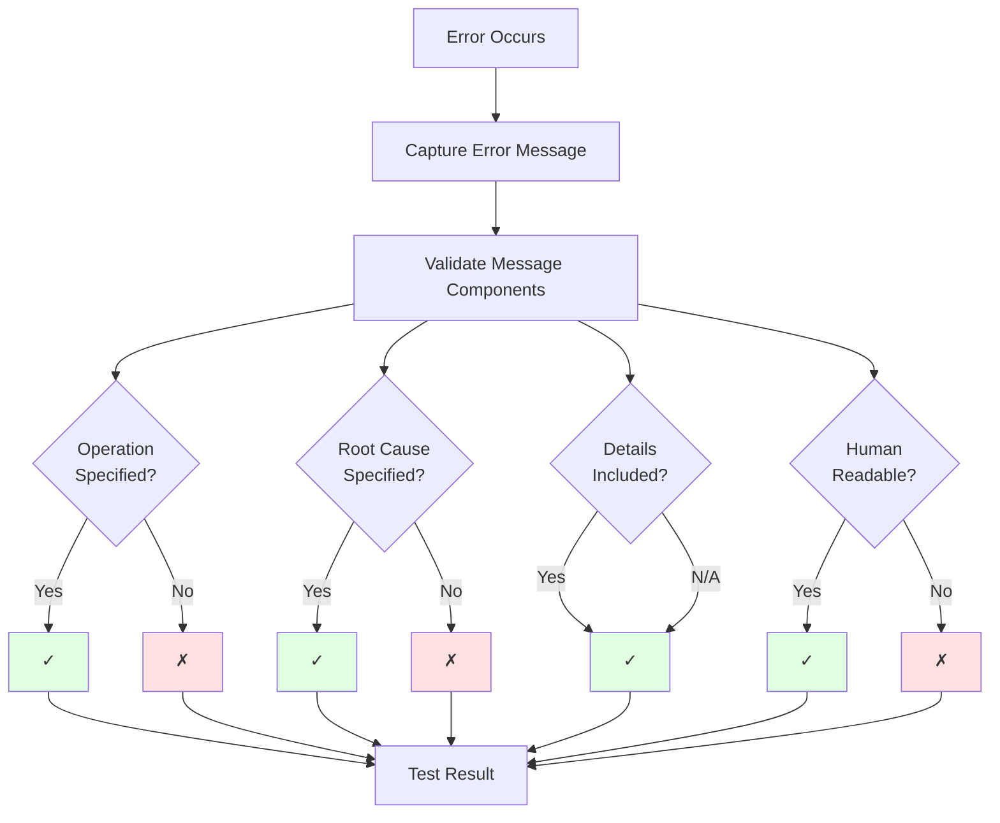

#### Required Error Message Components

**Structure:** `"Failed to {operation}: {root_cause}"`

**Components to Validate:**

| Component | Required | Description | Test Method |
|-----------|----------|-------------|-------------|
| Operation | Yes | What was being attempted | Assert message contains operation name |
| Root Cause | Yes | Why it failed | Assert message contains failure reason |
| Details | Conditional | Context-specific info | Assert relevant details present if applicable |
| Human Readable | Yes | Clear, understandable | Manual review + length check |

#### Test Scenarios by Operation Type

**1. Temp File Operations**

| Test Scenario | Trigger Condition | Expected Error Message |
|--------------|-------------------|------------------------|
| Creation fails (disk full) | Mock disk full (ENOSPC) | `"Failed to create temp file: disk full"` or `"Failed to create temp file: No space left on device"` |
| Creation fails (permission) | Mock permission denied | `"Failed to create temp file: permission denied"` |
| Write fails at offset | Mock I/O error during write | `"Failed to write chunk at offset 10485760: I/O error"` |
| Write fails (disk full) | Mock ENOSPC during write | `"Failed to write chunk at offset {N}: No space left on device"` |
| Flush fails | Mock flush error | `"Failed to flush temp file: {cause}"` |
| Sync fails | Mock sync error | `"Failed to sync temp file to disk: {cause}"` |
| Delete fails | Mock unlink failure | `"Failed to delete temp file {path}: permission denied"` |

**Test Implementation Pattern:**

```rust
#[test]
fn test_temp_file_creation_error_message() {
    // Setup: Mock disk full condition
    let result = create_temp_file_with_mocked_error(ENOSPC);
    
    // Assert: Error message structure
    let error_msg = result.unwrap_err().to_string();
    assert!(error_msg.contains("Failed to create temp file"), 
        "Missing operation context");
    assert!(error_msg.contains("disk full") || error_msg.contains("No space"),
        "Missing root cause");
}
```

**2. Memory-Mapped I/O Operations**

| Test Scenario | Trigger Condition | Expected Error Message |
|--------------|-------------------|------------------------|
| File open fails | Mock file not found | `"Failed to open file for mmap: file not found"` |
| Mmap fails (limit) | Mock ENOMEM or limit | `"Failed to memory map file: resource limit exceeded"` |
| Mmap fails (size) | Mock invalid size | `"Failed to memory map file: invalid file size"` |
| Read fails (SIGBUS) | Simulate concurrent modification | `"Failed to read from mmap: SIGBUS received"` |
| Munmap fails | Mock invalid address | `"Failed to unmap memory: invalid address"` |

**Test Implementation:**

```rust
#[test]
fn test_mmap_error_message() {
    // Setup: Force mmap failure
    let result = memory_map_file_with_limit_exceeded();
    
    let error_msg = result.unwrap_err().to_string();
    assert!(error_msg.contains("Failed to memory map file"));
    assert!(error_msg.contains("resource limit") || error_msg.contains("exceeded"));
}
```

**3. libmagic FFI Operations**

| Test Scenario | Trigger Condition | Expected Error Message |
|--------------|-------------------|------------------------|
| Cookie creation fails | Mock NULL return | `"Failed to create libmagic cookie: {cause}"` |
| Database load fails | Mock database not found | `"Failed to load magic database: file not found"` |
| Database load fails | Mock invalid database | `"Failed to load magic database: invalid format"` |
| Buffer analysis fails | Mock NULL return | `"Failed to analyze buffer: libmagic returned NULL"` |
| File analysis fails | Mock access denied | `"Failed to analyze file {path}: access denied"` |
| Error retrieval fails | Mock invalid cookie | `"Failed to get libmagic error: invalid cookie"` |

**Test Implementation:**

```rust
#[test]
fn test_libmagic_analysis_error_message() {
    // Setup: Mock libmagic returning NULL
    let result = analyze_with_null_return();
    
    let error_msg = result.unwrap_err().to_string();
    assert!(error_msg.contains("Failed to analyze buffer"));
    assert!(error_msg.contains("libmagic returned NULL") || 
            error_msg.contains("analysis failed"));
}
```

**4. Disk Space Operations**

| Test Scenario | Trigger Condition | Expected Error Message |
|--------------|-------------------|------------------------|
| Space check fails | Mock statvfs error | `"Failed to check disk space: statvfs failed"` |
| Pre-flight check fails | Available < threshold | `"Insufficient storage space for analysis"` with details |
| Write during stream fails | Mock ENOSPC mid-stream | `"Disk space exhausted during file processing"` with offset |

**Expected Detail Format:**

```
"Temp directory has 512MB available, but 1024MB minimum required"
"Failed to write chunk at offset 52428800: No space left on device"
```

**5. Network/HTTP Operations**

| Test Scenario | Trigger Condition | Expected Error Message |
|--------------|-------------------|------------------------|
| Body read fails | Mock connection reset | `"Failed to read request body: connection reset"` |
| Stream chunk fails | Mock timeout | `"Failed to stream chunk: timeout exceeded"` |
| Response write fails | Mock broken pipe | `"Failed to write response: broken pipe"` |

#### Error Context Validation Tests

**Unit Test Pattern:**

```rust
#[cfg(test)]
mod error_message_tests {
    use super::*;

    #[test]
    fn error_messages_include_operation_context() {
        let scenarios = vec![
            (create_temp_file_error(), "Failed to create temp file"),
            (write_chunk_error(1024), "Failed to write chunk at offset 1024"),
            (mmap_error(), "Failed to memory map file"),
            (analyze_buffer_error(), "Failed to analyze buffer"),
        ];

        for (error, expected_context) in scenarios {
            assert!(
                error.to_string().contains(expected_context),
                "Error missing operation context: {}",
                error
            );
        }
    }

    #[test]
    fn error_messages_include_root_cause() {
        let error = create_temp_file_error_with_cause(ENOSPC);
        let msg = error.to_string();
        
        // Must contain both operation AND cause
        assert!(msg.contains("Failed to create temp file"));
        assert!(msg.contains("disk full") || msg.contains("No space"));
    }

    #[test]
    fn error_messages_include_relevant_details() {
        let offset = 10485760;
        let error = write_error_at_offset(offset);
        let msg = error.to_string();
        
        assert!(msg.contains(&offset.to_string()));
    }
}
```

**Integration Test Pattern:**

```rust
#[tokio::test]
async fn test_http_error_response_includes_context() {
    // Setup: Trigger specific error condition
    let app = create_test_app_with_full_disk();
    let response = app
        .post("/v1/magic/content")
        .body(large_content())
        .send()
        .await;

    // Assert: Response includes context
    assert_eq!(response.status(), 507);
    let body: ErrorResponse = response.json().await;
    
    // Validate error message structure
    assert!(body.error.contains("storage") || body.error.contains("disk"));
    assert!(body.error.contains("failed") || body.error.contains("exhausted"));
}
```

#### Error Message Anti-Patterns to Test Against

**Bad Patterns (Should Fail Tests):**

| Anti-Pattern | Example | Problem |
|--------------|---------|---------|
| Generic message | `"Operation failed"` | No operation specified |
| Technical only | `"ENOSPC"` | Not user-friendly |
| Missing cause | `"Error writing file"` | No root cause |
| Missing operation | `"I/O error"` | No context |
| Swallowed details | `"Error"` | No information |

**Validation Rules:**

```rust
fn validate_error_message(msg: &str) -> Result<(), String> {
    // Rule 1: Must not be generic
    let generic_patterns = ["error", "failed", "operation failed"];
    if generic_patterns.iter().any(|p| msg.to_lowercase() == *p) {
        return Err("Error message too generic".to_string());
    }

    // Rule 2: Must contain operation verb
    let operation_verbs = ["create", "write", "read", "map", "analyze", "delete"];
    if !operation_verbs.iter().any(|v| msg.to_lowercase().contains(v)) {
        return Err("Missing operation context".to_string());
    }

    // Rule 3: Must contain separator (colon)
    if !msg.contains(':') {
        return Err("Missing cause separator ':'".to_string());
    }

    // Rule 4: Minimum length (too short = not descriptive)
    if msg.len() < 20 {
        return Err("Error message too short".to_string());
    }

    Ok(())
}
```

#### Test Coverage Requirements

**Error Message Validation Coverage:**

| Category | Coverage Target | Validation Method |
|----------|----------------|-------------------|
| Temp file operations | 100% of error paths | Unit tests with mocks |
| Mmap operations | 100% of error paths | Unit + integration tests |
| libmagic FFI | 100% of error paths | Unit tests with mocked FFI |
| Disk space checks | 100% of error paths | Integration tests |
| HTTP operations | 100% of error paths | Integration tests |

**Automated Validation:**

```rust
// Test helper to validate all error messages in test suite
#[macro_export]
macro_rules! assert_error_context {
    ($result:expr, $operation:expr, $cause:expr) => {
        let error = $result.unwrap_err();
        let msg = error.to_string();
        assert!(msg.contains($operation), 
            "Error missing operation '{}': {}", $operation, msg);
        assert!(msg.contains($cause), 
            "Error missing cause '{}': {}", $cause, msg);
    };
}

// Usage in tests
#[test]
fn test_error_context() {
    let result = create_temp_file_on_full_disk();
    assert_error_context!(result, "create temp file", "disk full");
}
```

#### CI/CD Integration

**Error Message Linting:**

Add to CI pipeline to check error messages:

```bash
# Grep for anti-patterns in error messages
cargo test 2>&1 | grep -E "Error:|error:" | \
  grep -E "^(error|failed|Error)$" && exit 1 || echo "No generic errors"
```

**Documentation Sync:**

Ensure error examples in docs match actual error messages:

```bash
# Extract error examples from tests
cargo test --no-run -- --list | grep error_message

# Compare with documented examples in ARCHITECTURE.md
```

#### Success Criteria

All error message tests must verify:

1. ✅ **Operation Context:** Error specifies what operation was attempted
2. ✅ **Root Cause:** Error explains why the operation failed
3. ✅ **Relevant Details:** Error includes context-specific information (offset, path, etc.)
4. ✅ **Human Readable:** Error message is clear and actionable
5. ✅ **Consistent Format:** Follows `"Failed to {operation}: {cause}"` pattern
6. ✅ **No Swallowing:** Context preserved across layer boundaries
7. ✅ **No Generic Messages:** Avoids "Error", "Failed", "Operation failed" without context


---

## 5. Property-Based Testing

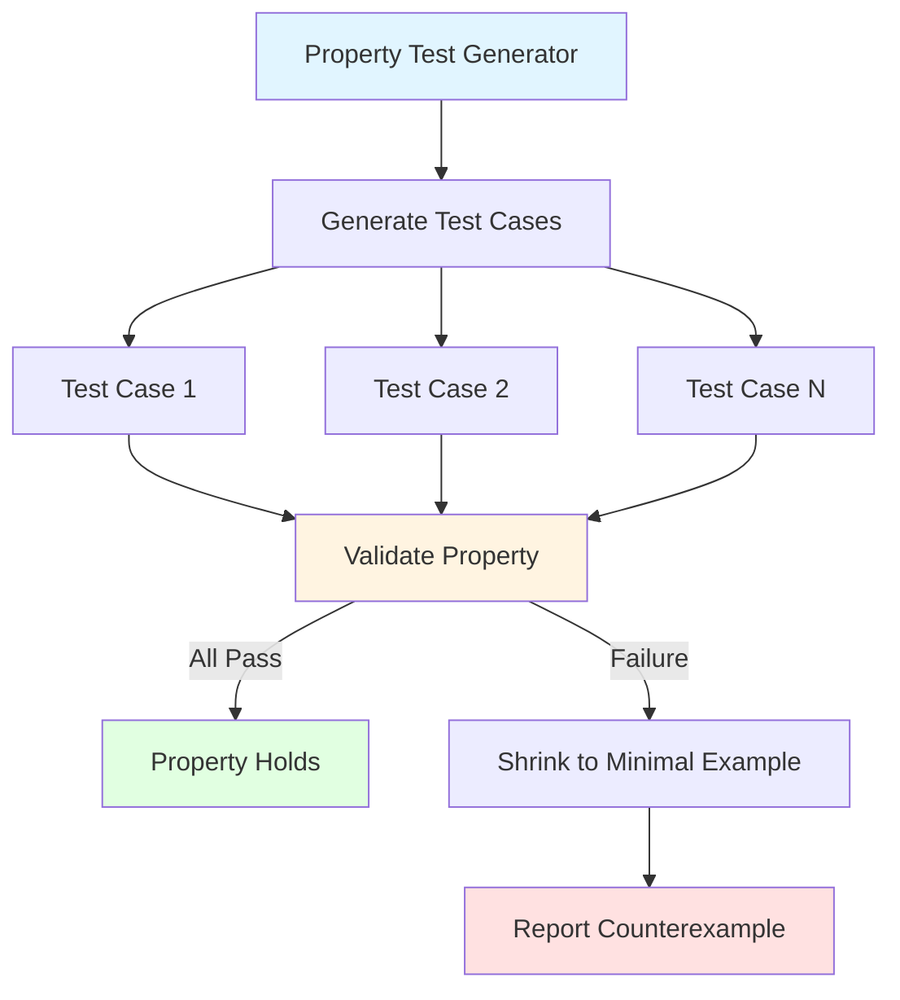

**Property-Based Test Locations:**

| Component | Test Path | Property Framework |
|-----------|-----------|-------------------|
| WindowsCompatibleFilename | `tests/property/filename_validation_tests.rs` | proptest |
| RelativePath | `tests/property/path_validation_tests.rs` | proptest |
| RequestId | `tests/property/request_id_tests.rs` | proptest |

**WindowsCompatibleFilename Properties:**

| Property | Generator Strategy | Invariant |
|----------|-------------------|-----------|
| Valid filenames accepted | Strings without `/` or `\0`, length 1-310 | Constructor returns Ok |
| Invalid char rejected | Insert `/` or `\0` into valid string | Constructor returns Err(InvalidCharacter) |
| Length limit enforced | Generate strings of length 311-500 | Constructor returns Err(ExceedsMaxLength) |
| Empty rejected | Empty string | Constructor returns Err(EmptyValue) |
| Unicode supported | Generate Unicode strings (no `/`, `\0`) | Constructor returns Ok |

**RelativePath Properties:**

| Property | Generator Strategy | Invariant |
|----------|-------------------|-----------|
| Valid relative paths accepted | Join 1-5 alphanumeric segments with `/` | Constructor returns Ok |
| Absolute paths rejected | Prepend `/` to valid path | Constructor returns Err(AbsolutePath) |
| Parent traversal rejected | Insert `..` into path segments | Constructor returns Err(PathTraversal) |
| Double slash rejected | Insert `//` into path | Constructor returns Err(InvalidPath) |

**Property Test Benefits:**

- Automatically discovers edge cases developers might miss
- Tests thousands of input combinations
- Provides minimal failing example when property violated
- Complements hand-written unit tests with exhaustive coverage

**Shrinking Strategy:**

When a property test fails, proptest automatically shrinks the input to find the minimal failing case:

1. Generate random input that violates property
2. Iteratively simplify input while preserving failure
3. Report smallest input that triggers bug
4. Developer fixes issue for specific case
5. Re-run to verify all cases pass

---

## 6. Integration Testing Strategy

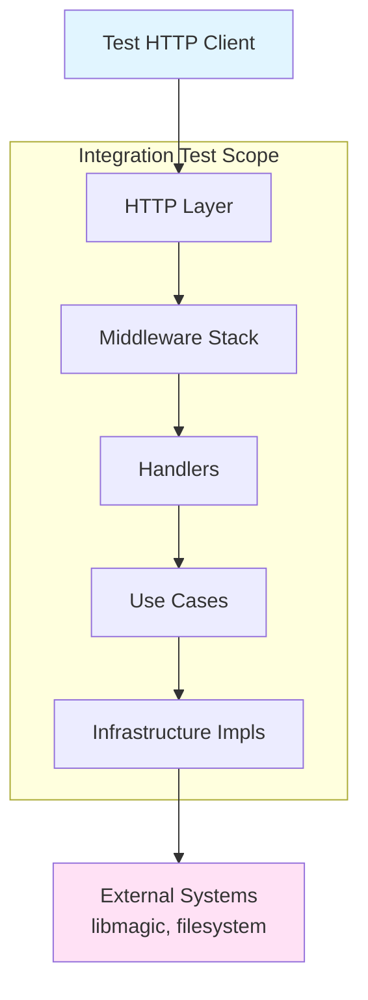

**Integration Test Strategy:**

Integration tests verify that multiple components work together correctly. Unlike unit tests with mocks, integration tests use real implementations where practical.

**Test Scope:**

| Test Type | Components Tested | External Dependencies |
|-----------|------------------|----------------------|
| HTTP Integration | Router + Middleware + Handlers + Use Cases | Mock repositories |
| Repository Integration | Repository implementations | Real libmagic, real filesystem |
| Middleware Integration | Middleware stack | Real request/response cycle |

**Integration Test Benefits:**

- Catch integration bugs that unit tests miss
- Verify correct middleware ordering and composition
- Test with real HTTP request/response cycle
- Validate error propagation across layers

---

## 7. End-to-End Testing

```mermaid
sequenceDiagram
    participant Test
    participant Server
    participant Libmagic
    participant Filesystem
    
    Test->>Test: Start real server
    Test->>Server: HTTP POST /v1/magic/content
    Server->>Server: Apply all middleware
    Server->>Server: Authenticate
    Server->>Server: Execute use case
    Server->>Libmagic: Analyze buffer
    Libmagic-->>Server: MIME type + description
    Server-->>Test: JSON response
    Test->>Test: Assert response correctness
    Test->>Server: HTTP GET /v1/ping
    Server-->>Test: pong response
    Test->>Test: Shutdown server
    
    style Test fill:#e1f5ff
    style Server fill:#fff4e1
```

**E2E Test Locations:**

`tests/e2e/full_workflow_tests.rs`

**E2E Test Scenarios:**

| Workflow | Steps | Verification |
|----------|-------|--------------|
| Analyze content workflow | 1. Start server<br/>2. POST binary to /v1/magic/content<br/>3. Verify response | 200 OK with correct MIME type and request_id |
| Large file analysis | 1. Start server<br/>2. POST 50MB file<br/>3. Monitor temp directory<br/>4. Verify cleanup | 200 OK, temp file cleaned after response |
| Concurrent large files | 1. Start server<br/>2. POST 10 x 20MB files in parallel<br/>3. All complete | All succeed with unique request_ids |
| Analyze path workflow | 1. Start server<br/>2. Create file in sandbox<br/>3. POST to /v1/magic/path<br/>4. Verify response | 200 OK with analysis result |
| Health check workflow | 1. Start server<br/>2. GET /v1/ping<br/>3. Verify response | 200 OK with "pong" message |
| Authentication failure | 1. Start server<br/>2. POST without auth<br/>3. Verify rejection | 401 Unauthorized |
| Path traversal prevention | 1. Start server<br/>2. POST with malicious path<br/>3. Verify rejection | 400 Bad Request or 403 Forbidden |

**E2E Test Characteristics:**

- Use real HTTP client (reqwest)
- Start actual server process
- Use real libmagic library
- No mocked components
- Test complete user workflows
- Verify system behavior from external perspective
- Slower execution (seconds per test)
- Fewer tests (5-10 critical paths)

---

## 8. Security Testing

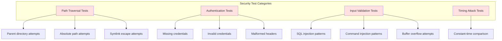

**Security Test Locations:**

| Test Category | Test Path | Focus Area |
|---------------|-----------|------------|
| Path Traversal | `tests/security/path_traversal_tests.rs` | File system security boundaries |
| Authentication | `tests/security/auth_security_tests.rs` | Credential validation and timing attacks |
| Input Validation | `tests/security/input_validation_tests.rs` | Injection attack prevention |
| Rate Limiting | `tests/security/rate_limit_tests.rs` | DoS prevention (future) |

**Path Traversal Test Cases:**

| Attack Vector | Input Example | Expected Behavior |
|---------------|---------------|-------------------|
| Parent traversal | `../etc/passwd` | 400 Bad Request |
| Multi-level traversal | `../../etc/passwd` | 400 Bad Request |
| Hidden traversal | `data/../../etc/passwd` | 400 Bad Request |
| Deep traversal | `data/../../../etc/passwd` | 400 Bad Request |
| Encoded traversal | `%2e%2e%2fetc%2fpasswd` | 400 Bad Request |
| Mixed separators | `..\etc\passwd` | 400 Bad Request (if applicable) |
| Symlink escape | Symlink pointing to `/etc` | 403 Forbidden |

**Authentication Security Tests:**

| Test Case | Scenario | Expected Behavior |
|-----------|----------|-------------------|
| Missing header | No Authorization header | 401 Unauthorized |
| Invalid credentials | Wrong username/password | 401 Unauthorized |
| Malformed header | Invalid Base64 encoding | 400 Bad Request |
| Empty credentials | Empty username or password | 401 Unauthorized |
| Long credentials | Very long username/password | 400 Bad Request or 401 |
| Timing attack | Measure comparison time | Constant-time verification |

**Timing Attack Test Strategy:**

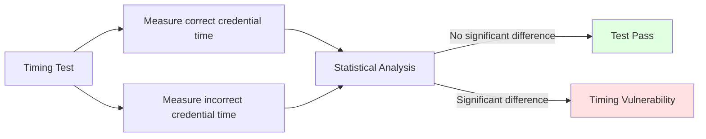

**Timing Test Methodology:**

1. Run credential verification 1000+ times
2. Measure execution time for correct credentials
3. Measure execution time for incorrect credentials
4. Perform statistical analysis (t-test, Mann-Whitney U)
5. Verify no statistically significant time difference
6. Ensures resistant to timing-based side-channel attacks

**Input Validation Security Tests:**

| Attack Type | Test Input | Expected Behavior |
|-------------|-----------|-------------------|
| Null byte injection | `file\0.txt` | Reject with validation error |
| Control characters | Filename with `\n`, `\r` | Reject with validation error |
| Extremely long input | 10,000 character filename | Reject with max length error |
| Unicode exploits | Bidirectional override characters | Accept or sanitize safely |
| Path injection | Filename containing `../` | Reject with validation error |

**Security Test Goals:**

- Verify defense-in-depth layers
- Ensure no single validation failure exposes system
- Test both positive (blocked attacks) and negative (legitimate use) cases
- Document expected security behavior

---

## 9. Performance Testing

```mermaid
graph TB
    subgraph Performance Testing
        Bench[Micro Benchmarks]
        Load[Load Tests]
        Stress[Stress Tests]
        Endurance[Endurance Tests]
    end
    
    Bench --> B1[libmagic analysis speed]
    Bench --> B2[Validation overhead]
    Bench --> B3[Serialization cost]
    
    Load --> L1[Concurrent requests]
    Load --> L2[Throughput measurement]
    Load --> L3[Latency percentiles]
    
    Stress --> S1[Connection limit tests]
    Stress --> S2[Memory under load]
    Stress --> S3[Error rate under stress]
    
    Endurance --> E1[24-hour stability]
    Endurance --> E2[Memory leak detection]
    
    style Bench fill:#e1f5ff
    style Load fill:#fff4e1
    style Stress fill:#ffe1f5
    style Endurance fill:#e1ffe1
```

### 9.1. Micro Benchmarks

**Benchmark Locations:**

| Benchmark | File Path | Framework |
|-----------|-----------|-----------|
| Magic analysis | `benches/magic_analysis_benchmark.rs` | criterion |
| Validation | `benches/validation_benchmark.rs` | criterion |
| HTTP throughput | `benches/http_throughput_benchmark.rs` | criterion |

**Benchmark Scenarios:**

| Operation | Input Size | Measured Metric |
|-----------|-----------|-----------------|
| Analyze text | 1KB, 10KB, 100KB, 1MB, 10MB | Execution time (µs/ms) |
| Analyze binary | 1MB, 10MB, 50MB, 100MB | Execution time (ms) |
| Filename validation | Various valid/invalid patterns | Execution time (ns) |
| Path validation | Various path patterns | Execution time (ns) |
| Request serialization | Typical JSON response | Execution time (µs) |

**Performance Targets:**

| Operation | Target | Measurement |
|-----------|--------|-------------|
| Small file analysis (< 1MB) | < 100ms | p95 latency |
| Large file analysis (100MB) | < 5s | p95 latency |
| Validation overhead | < 10µs | Average |
| Request handling (no analysis) | < 10ms | p95 latency |

### 9.2. Load Testing

```mermaid
graph LR
    Ramp[Ramp Up<br/>30s to 100 users] --> Sustain[Sustain<br/>100 users for 60s]
    Sustain --> Down[Ramp Down<br/>30s to 0 users]
    
    Sustain --> Collect[Collect Metrics]
    Collect --> RPS[Requests/second]
    Collect --> Latency[Latency p50/p95/p99]
    Collect --> Errors[Error rate]
    Collect --> Conns[Active connections]
    
    style Sustain fill:#fff4e1
    style Collect fill:#e1f5ff
```

**Load Test Scenarios:**

| Scenario | Virtual Users | Duration | Target RPS | Success Criteria |
|----------|--------------|----------|------------|------------------|
| Normal load | 100 | 5 minutes | 500-1000 | < 1% errors, p95 < 500ms |
| High load | 500 | 5 minutes | 2000-3000 | < 5% errors, p95 < 1s |
| Spike test | 0→1000→0 | 2 minutes | Varies | Graceful degradation |

**Load Test Tool:** k6 (JavaScript-based load testing)

**Load Test Metrics:**

| Metric | Collection Method | Acceptance Threshold |
|--------|------------------|---------------------|
| Throughput (RPS) | k6 built-in | > 500 req/s |
| Response time p50 | k6 histogram | < 200ms |
| Response time p95 | k6 histogram | < 500ms |
| Response time p99 | k6 histogram | < 1000ms |
| Error rate | k6 checks | < 1% |
| Concurrent connections | Server metrics | < 1000 |

### 9.3. Stress Testing

**Stress Test Objectives:**

- Find breaking point (maximum capacity)
- Verify graceful degradation
- Confirm timeout enforcement
- Test connection limit behavior
- Identify memory leaks under pressure

**Stress Test Scenarios:**

| Test Type | Configuration | Expected Behavior |
|-----------|--------------|-------------------|
| Connection limit | Open 1500 connections | Reject after 1000, backlog to 1024, rest refused |
| Memory stress | Continuous 100MB requests | Stable memory, no leaks |
| Timeout stress | Slow client connections | Timeout after 60s, release resources |
| Error rate spike | Send 50% invalid requests | Maintain throughput for valid requests |

### 9.4. Endurance Testing

**Endurance Test Configuration:**

| Parameter | Value | Purpose |
|-----------|-------|---------|
| Duration | 24 hours | Detect slow leaks |
| Load | 50% capacity | Sustainable load |
| Monitoring | Every 5 minutes | Memory, CPU, connections |

**Monitored Metrics:**

- Memory usage (RSS, heap)
- CPU utilization
- Active connections
- Request latency (trend over time)
- Error rate
- File descriptor count

**Acceptance Criteria:**

- Memory usage remains stable (< 5% growth over 24h)
- No file descriptor leaks
- Response times remain consistent
- Error rate stays below 0.1%

---

## 10. Coverage Requirements

```mermaid
graph TB
    subgraph Coverage Targets by Layer
        Domain[Domain Layer<br/>Min: 90% | Target: 95%]
        Application[Application Layer<br/>Min: 85% | Target: 90%]
        Infrastructure[Infrastructure Layer<br/>Min: 70% | Target: 80%]
        Presentation[Presentation Layer<br/>Min: 75% | Target: 85%]
    end
    
    Overall[Overall Project<br/>Min: 80% | Target: 90%]
    
    Domain --> Overall
    Application --> Overall
    Infrastructure --> Overall
    Presentation --> Overall
    
    style Domain fill:#e1f5ff
    style Application fill:#fff4e1
    style Infrastructure fill:#ffe1f5
    style Presentation fill:#e1ffe1
```

**Coverage Requirements by Layer:**

| Layer | Minimum Coverage | Target Coverage | Rationale |
|-------|-----------------|-----------------|-----------|
| Domain | 90% | 95% | Pure business logic must be thoroughly tested |
| Application | 85% | 90% | Use cases coordinate critical workflows |
| Infrastructure | 70% | 80% | Some external integration code hard to test |
| Presentation | 75% | 85% | HTTP layer has framework-generated code |
| **Overall** | **80%** | **90%** | High confidence for production deployment |

**Coverage Measurement:**

| Tool | Purpose | Output Format |
|------|---------|---------------|
| cargo-tarpaulin | Line and branch coverage | HTML, XML, JSON |
| codecov | Coverage tracking and visualization | Web dashboard |
| Coveralls | Alternative coverage service | Web dashboard |

**Coverage Exclusions:**

- Generated code (build.rs output)
- Main function boilerplate
- Debug-only code paths
- Unreachable panic branches
- External crate re-exports

**Coverage Enforcement:**

- CI pipeline fails if coverage drops below minimum
- PRs require coverage report attached
- Coverage trend tracked over time
- Uncovered critical paths flagged for review

---

## 11. Test Infrastructure

```mermaid
graph TB
    subgraph Test Utilities
        Common[tests/common/mod.rs]
        Fixtures[Test Fixtures]
        Builders[Builder Functions]
        Mocks[Mock Generators]
    end
    
    Common --> Builders
    Common --> Fixtures
    Common --> Mocks
    
    Builders --> TestState[build_test_app_state]
    Builders --> TestServer[spawn_test_server]
    Builders --> TestRepo[create_mock_repository]
    
    Fixtures --> SampleFiles[Sample file data]
    Fixtures --> TestData[Test data constants]
    
    Mocks --> MockRepo[MockMagicRepository]
    Mocks --> MockAuth[MockAuthService]
    
    style Common fill:#e1f5ff
    style Fixtures fill:#fff4e1
    style Builders fill:#ffe1f5
    style Mocks fill:#e1ffe1
```

**Test Utilities Location:** `tests/common/mod.rs`

**Utility Functions:**

| Function | Purpose | Returns |
|----------|---------|---------|
| `build_test_app_state()` | Creates AppState with test configuration | AppState |
| `spawn_test_server()` | Starts HTTP server on random port | Server handle + URL |
| `create_test_file()` | Creates file in temporary directory | Path to file |
| `cleanup_test_files()` | Removes test files and directories | () |
| `generate_test_data()` | Creates various file type samples | HashMap of samples |
| `create_mock_repository()` | Builds mockall repository with defaults | MockMagicRepository |

**Test Fixtures:**

| Fixture Type | Location | Content |
|--------------|----------|---------|
| Sample files | `tests/fixtures/files/` | Text, JSON, XML, binary samples |
| Test credentials | `tests/common/mod.rs` | Default test username/password |
| Mock responses | `tests/common/mod.rs` | Predefined MIME types and descriptions |

**Fixture Examples:**

- `tests/fixtures/files/sample.txt` - Plain text file
- `tests/fixtures/files/sample.json` - JSON document
- `tests/fixtures/files/sample.png` - PNG image (magic bytes)
- `tests/fixtures/files/empty.bin` - Empty file

**Test Helper Patterns:**

All tests can use shared utilities to:
- Avoid code duplication
- Ensure consistent test setup
- Simplify test maintenance
- Provide realistic test data

---

## 12. Continuous Integration

```mermaid
graph TB
    Push[Git Push] --> CI[CI Pipeline Triggered]
    
    CI --> Lint[Lint & Format Check]
    CI --> Build[Build Check]
    CI --> UnitTest[Unit Tests]
    CI --> IntTest[Integration Tests]
    CI --> Security[Security Audit]
    
    Lint --> Coverage[Coverage Report]
    Build --> Coverage
    UnitTest --> Coverage
    IntTest --> Coverage
    
    Coverage --> Gate{Coverage >= 80%?}
    Security --> Gate
    
    Gate -->|Yes| Success[Pipeline Success]
    Gate -->|No| Fail[Pipeline Failure]
    
    Success --> Badge[Update Badge]
    Fail --> Notify[Notify Developer]
    
    style Success fill:#e1ffe1
    style Fail fill:#ffe1e1
```

**CI Workflow Stages:**

| Stage | Command | Duration | Failure Action |
|-------|---------|----------|---------------|
| Lint | `cargo clippy -- -D warnings` | 30s | Block PR |
| Format | `cargo fmt -- --check` | 10s | Block PR |
| Build | `cargo build --release` | 2-3min | Block PR |
| Unit Tests | `cargo test --lib` | 1-2min | Block PR |
| Integration Tests | `cargo test --test '*'` | 2-3min | Block PR |
| Doc Tests | `cargo test --doc` | 30s | Block PR |
| Coverage | `cargo tarpaulin --out Xml` | 3-5min | Warn if < 80% |
| Security Audit | `cargo audit` | 30s | Warn on high severity |

**CI Environments:**

| Environment | OS | Rust Version | Purpose |
|-------------|----|--------------|---------| |
| Primary | Ubuntu 22.04 | Stable | Main test suite |
| MSRV | Ubuntu 22.04 | 1.70.0 | Minimum supported Rust version |
| Nightly | Ubuntu 22.04 | Nightly | Early warning for breaking changes |

**CI Triggers:**

- Every push to any branch
- Every pull request (open, update, reopen)
- Daily scheduled run on main branch
- Manual workflow dispatch

**Artifacts:**

| Artifact | Format | Retention | Purpose |
|----------|--------|-----------|---------|
| Coverage report | HTML | 30 days | Debug coverage issues |
| Test results | JUnit XML | 30 days | Failure analysis |
| Build logs | Text | 7 days | Build troubleshooting |
| Binary | Executable | 7 days | Testing/deployment |

**Quality Gates:**

All checks must pass before merge:
- Zero compiler warnings
- Zero clippy warnings
- All tests pass
- Coverage >= 80%
- No high-severity security vulnerabilities
- Code formatted correctly

---

## Summary

This testing strategy ensures:

1. **Comprehensive Coverage** - 80%+ code coverage across all layers
2. **Fast Feedback** - Unit tests provide rapid iteration cycles
3. **Reliable Integration** - Real components tested together
4. **Security Validation** - Specific tests for common vulnerabilities
5. **Performance Baselines** - Benchmarks detect regressions
6. **Production Confidence** - E2E tests validate user workflows
7. **Continuous Quality** - CI pipeline enforces standards

The multi-layer testing approach provides defense in depth, catching issues at the appropriate testing level for fast feedback and comprehensive validation.

---

## Summary

This testing strategy ensures:
- **Comprehensive coverage** across all architectural layers
- **Fast feedback** with unit tests dominating the pyramid
- **Regression prevention** through property-based testing
- **Security validation** against common vulnerabilities
- **Performance baselines** with benchmarks
- **CI/CD integration** for automated quality gates

All tests must pass before merging to main branch.
