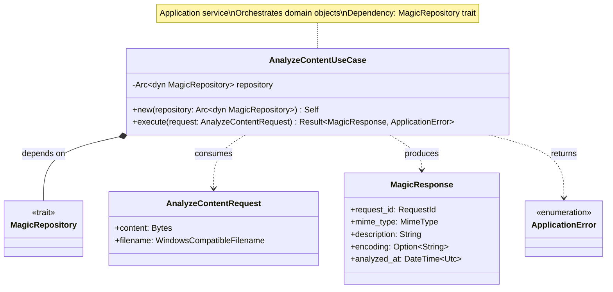
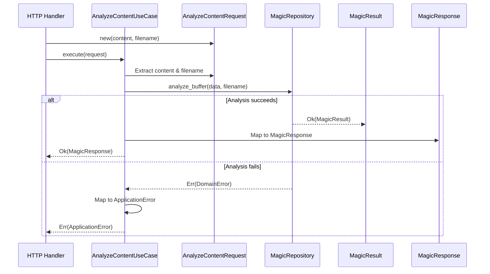
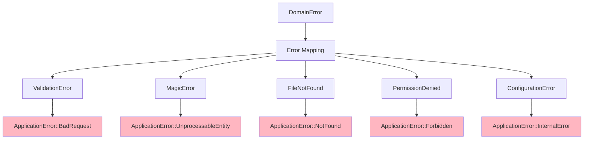
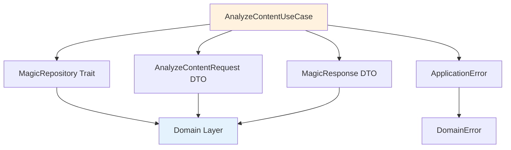

# AnalyzeContentUseCase Class Diagram

## Overview

The `AnalyzeContentUseCase` orchestrates the analysis of binary content (uploaded files, network buffers) using the magic repository.

## Class Diagram

## Execution Flow

## Properties

| Property | Type | Description |
|----------|------|-------------|
| `repository` | `Arc<dyn MagicRepository>` | Magic analysis repository (trait object) |

## Methods

| Method | Parameters | Return Type | Description |
|--------|------------|-------------|-------------|
| `new` | `repository: Arc<dyn MagicRepository>` | `Self` | Constructor with dependency injection |
| `execute` | `request: AnalyzeContentRequest` | `Result<MagicResponse, ApplicationError>` | Execute use case |

## Execution Process

## Error Mapping

## Usage Scenario

### Use Case Initialization

The AnalyzeContentUseCase is initialized by providing a thread-safe reference to a MagicRepository implementation. This is typically done during application startup when the dependency injection container is configured.

### Executing Analysis

To analyze content, a request object is created containing the binary data and the original filename. When the execute method is called with this request, the use case validates the input, delegates the actual magic analysis to the repository, and returns a formatted response.

### Handling Failures

The use case provides semantic error handling. If the input data is empty or invalid, it returns a BadRequest error. If the libmagic analysis fails due to data corruption or other internal issues, it returns an UnprocessableEntity error. Unexpected system failures are returned as InternalError.

## Request Validation

The use case performs several validation steps before proceeding with analysis:
1. **Empty Check**: Rejects requests where the binary content is empty.
2. **Size Check**: While the absolute limit is enforced at the HTTP layer, the use case ensures the content is within reasonable processing bounds.
3. **Filename Integrity**: Verifies that the provided filename hint is valid and safe.

## Response Construction

Upon successful analysis, the use case transforms the domain-level MagicResult entity into an application-level MagicResponse DTO. This process involves:
1. Generating a new unique RequestId for tracking.
2. Extracting the MIME type and human-readable description.
3. Including the character encoding if one was detected.
4. Recording the precise UTC timestamp when the analysis was completed.

## Dependencies

## Design Rationale

- **Single Responsibility**: Only orchestrates content analysis workflow
- **Dependency Inversion**: Depends on `MagicRepository` trait, not concrete implementation
- **DTO Boundary**: Uses DTOs for input/output, isolating domain from presentation
- **Error Translation**: Maps domain errors to application-level semantic errors
- **Testability**: Easy to test with mock repository
- **Thread Safety**: `Arc<dyn Trait>` enables sharing across async tasks
