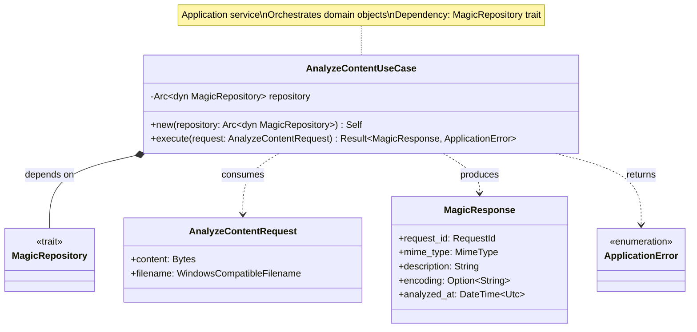
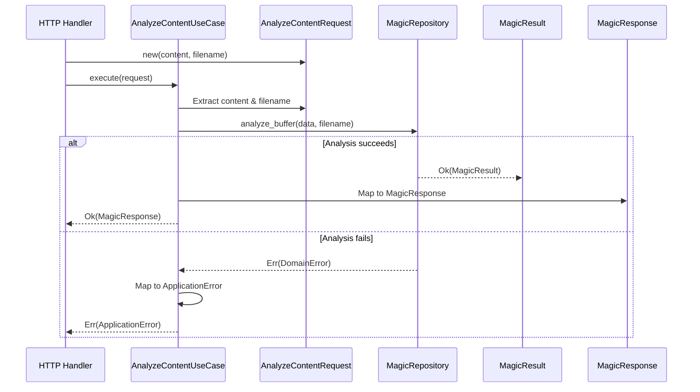
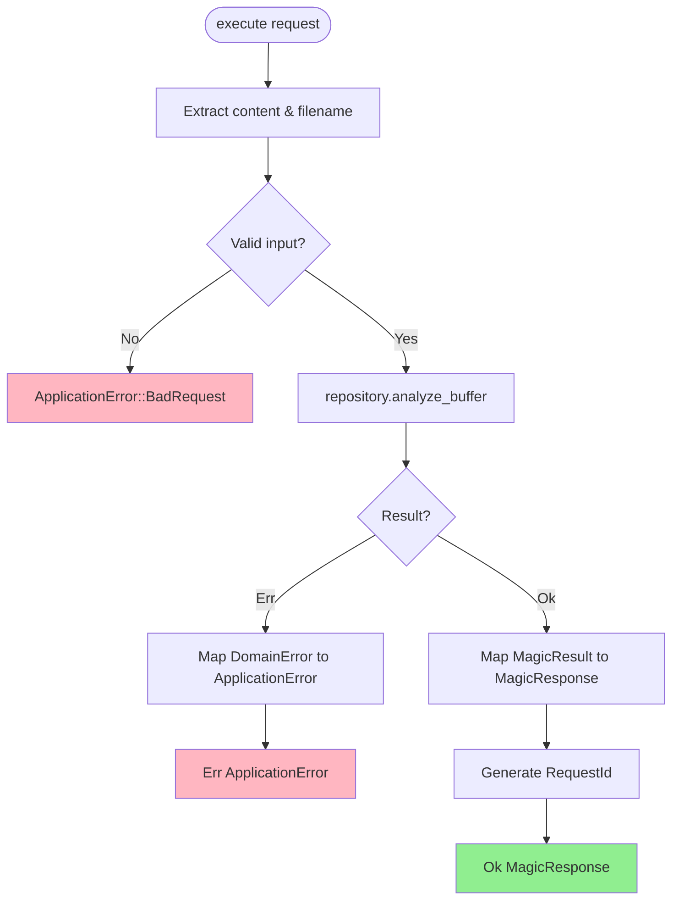
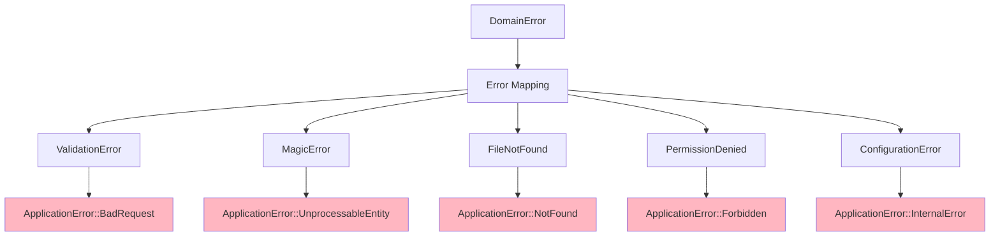
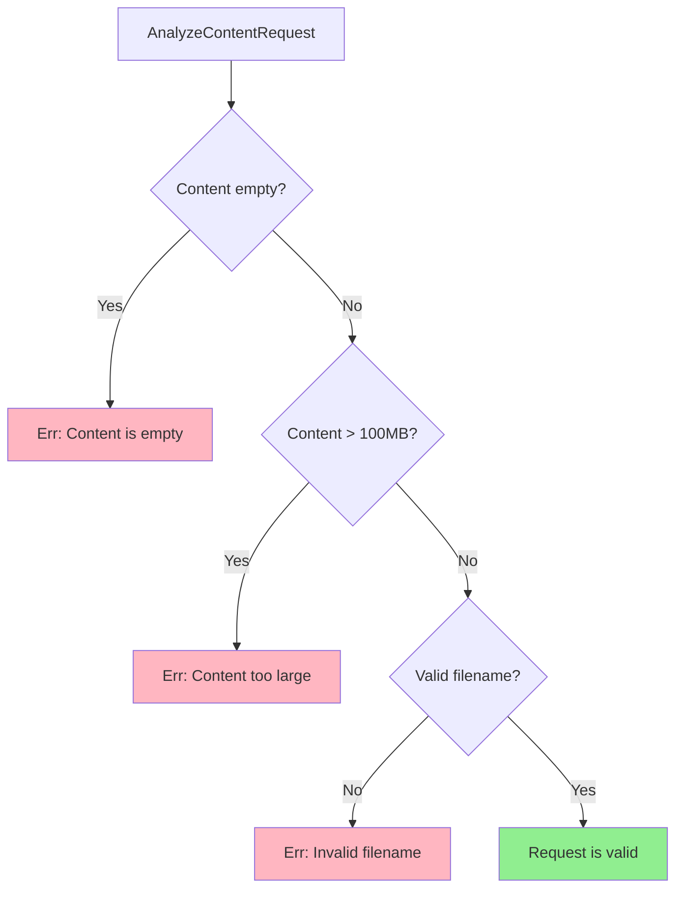
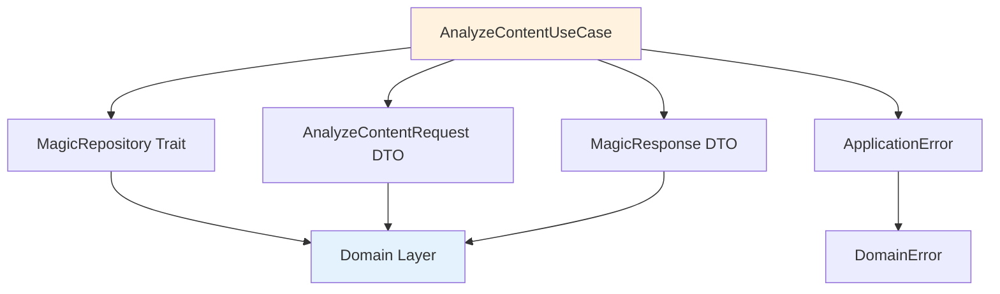

# AnalyzeContentUseCase Class Diagram

## Overview

The `AnalyzeContentUseCase` orchestrates the analysis of binary content (uploaded files, network buffers) using the magic repository.

## Class Diagram



## Execution Flow



## Properties

| Property | Type | Description |
|----------|------|-------------|
| `repository` | `Arc<dyn MagicRepository>` | Magic analysis repository (trait object) |

## Methods

| Method | Parameters | Return Type | Description |
|--------|------------|-------------|-------------|
| `new` | `repository: Arc<dyn MagicRepository>` | `Self` | Constructor with dependency injection |
| `execute` | `request: AnalyzeContentRequest` | `Result<MagicResponse, ApplicationError>` | Execute use case |

## Execution Process



## Error Mapping



## Usage Example

```rust
// Dependency injection
let repository = Arc::new(LibmagicRepository::new()?);
let use_case = AnalyzeContentUseCase::new(repository);

// Execute use case
let request = AnalyzeContentRequest {
    content: Bytes::from(file_data),
    filename: WindowsCompatibleFilename::new("document.pdf".to_string())?,
};

let response = use_case.execute(request)?;
println!("MIME Type: {}", response.mime_type.as_str());
println!("Description: {}", response.description);

// Error handling
match use_case.execute(request) {
    Ok(response) => {
        // Success - return HTTP 200
        Json(response)
    },
    Err(ApplicationError::BadRequest(msg)) => {
        // Invalid input - return HTTP 400
        StatusCode::BAD_REQUEST
    },
    Err(ApplicationError::UnprocessableEntity(msg)) => {
        // Analysis failed - return HTTP 422
        StatusCode::UNPROCESSABLE_ENTITY
    },
    Err(_) => {
        // Internal error - return HTTP 500
        StatusCode::INTERNAL_SERVER_ERROR
    },
}
```

## Request Validation



## Response Construction

```rust
impl From<MagicResult> for MagicResponse {
    fn from(result: MagicResult) -> Self {
        MagicResponse {
            request_id: RequestId::new(),
            mime_type: result.mime_type().clone(),
            description: result.description().to_string(),
            encoding: result.encoding().map(|s| s.to_string()),
            analyzed_at: result.analyzed_at(),
        }
    }
}
```

## Dependencies



## Design Rationale

- **Single Responsibility**: Only orchestrates content analysis workflow
- **Dependency Inversion**: Depends on `MagicRepository` trait, not concrete implementation
- **DTO Boundary**: Uses DTOs for input/output, isolating domain from presentation
- **Error Translation**: Maps domain errors to application-level semantic errors
- **Testability**: Easy to test with mock repository
- **Thread Safety**: `Arc<dyn Trait>` enables sharing across async tasks
