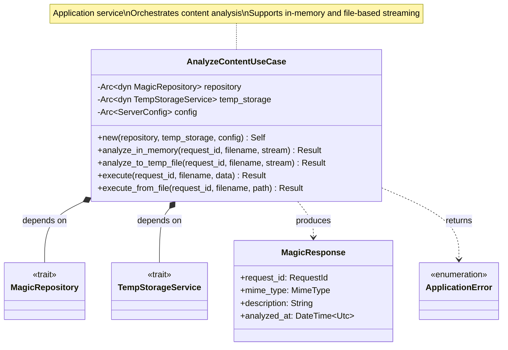
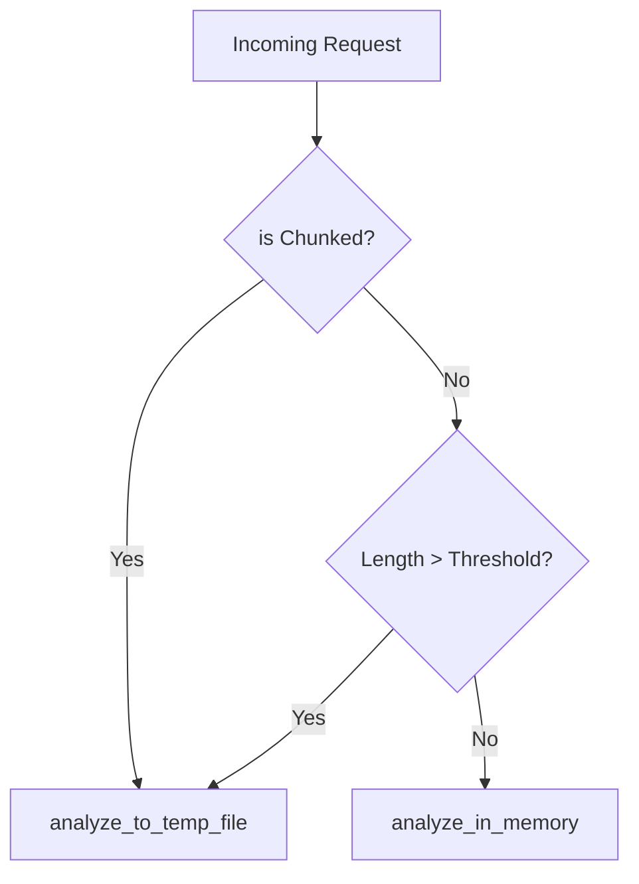
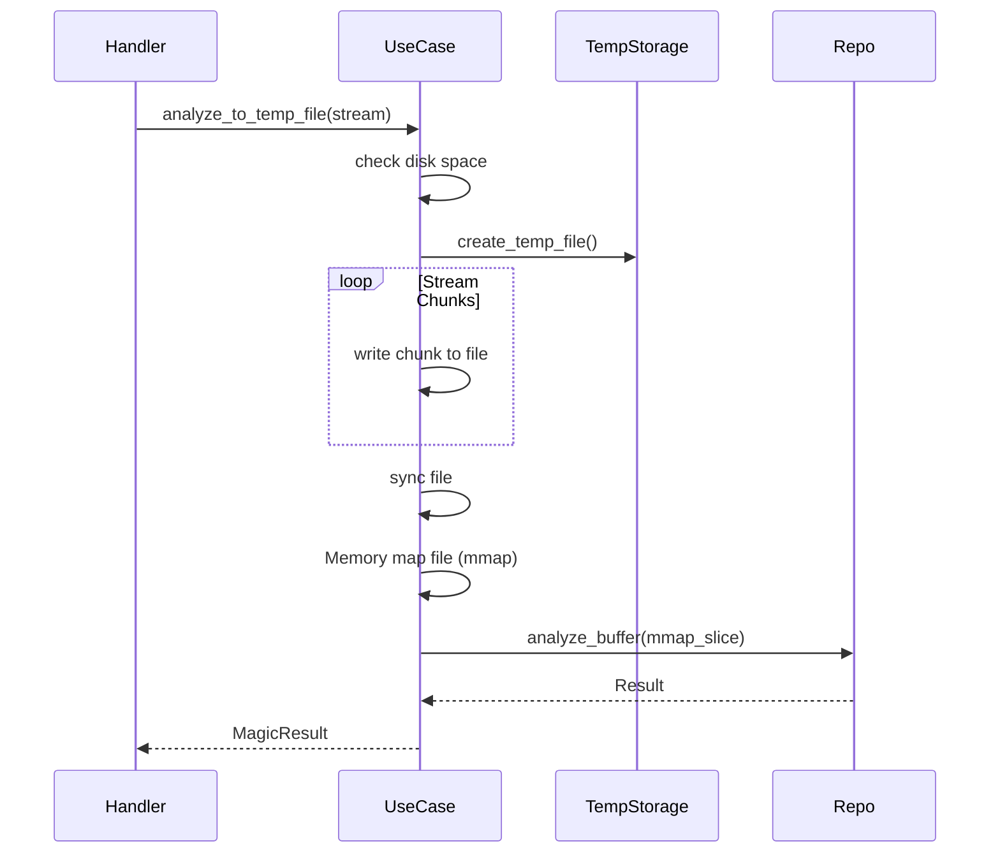
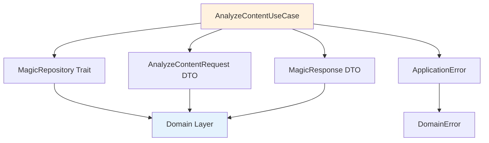

# AnalyzeContentUseCase Class Diagram <!-- omit in toc -->

- [Overview](#overview)
- [Class Diagram](#class-diagram)
- [Execution Flow](#execution-flow)
- [Properties](#properties)
- [Methods](#methods)
- [Execution Process](#execution-process)
- [Error Mapping](#error-mapping)
- [Usage Scenario](#usage-scenario)
  - [Use Case Initialization](#use-case-initialization)
  - [Executing Analysis](#executing-analysis)
  - [Handling Failures](#handling-failures)
- [Request Validation](#request-validation)
- [Response Construction](#response-construction)
- [Dependencies](#dependencies)
- [Design Rationale](#design-rationale)

---

## Overview

The `AnalyzeContentUseCase` orchestrates the analysis of binary content (uploaded files, network buffers) using the magic repository.

## Class Diagram

## Execution Flow

The processing strategy is determined at the Presentation Layer (HTTP Handler) based on request headers.

### Decision Logic (Handler)

### File-Based Analysis Flow

## Properties

| Property | Type | Description |
|----------|------|-------------|
| `magic_repo` | `Arc<dyn MagicRepository>` | Repository for libmagic analysis |
| `temp_storage` | `Arc<dyn TempStorageService>` | Service for temporary file management |
| `config` | `Arc<ServerConfig>` | Application configuration |

## Methods

| Method | Parameters | Return Type | Description |
|--------|------------|-------------|-------------|
| `new` | repo, storage, config | `Self` | Constructor |
| `analyze_in_memory` | id, name, stream | `Result` | Collects stream into buffer and analyzes |
| `analyze_to_temp_file` | id, name, stream | `Result` | Streams to temp file and analyzes via mmap |
| `execute` | id, name, data | `Result` | Direct buffer analysis (atomic operation) |
| `execute_from_file` | id, name, path | `Result` | Direct file analysis (atomic operation) |

## Execution Process

The `AnalyzeContentUseCase` provides specialized methods for different data sources:

1. **In-Memory Streaming (`analyze_in_memory`)**:
   - Collects chunks from an async stream into a `Vec<u8>`.
   - Once the stream is exhausted, it calls `execute()`.
   - Used for small fixed-length payloads.

2. **File-Based Streaming (`analyze_to_temp_file`)**:
   - Initializes a temporary file (checking disk space first).
   - Streams chunks directly to disk.
   - Synchronizes file state and calls `execute_from_file()`.
   - Used for chunked encoding or large payloads.

3. **Core Analysis (`execute` / `execute_from_file`)**:
   - Performs the actual integration with `MagicRepository`.
   - Applies the analysis timeout constraint.
   - Maps domain results to `MagicResult` entities.

## Error Mapping

| Domain/Infra Error | Application Error | HTTP Status |
|--------------------|-------------------|-------------|
| Validation Error | `BadRequest` | 400 |
| Magic Error | `InternalError` | 500 |
| Disk Full (IO) | `InsufficientStorage` | 507 |
| Analysis Timeout | `Timeout` | 504 |

## Usage Scenario

### Use Case Initialization

The AnalyzeContentUseCase is initialized by providing a thread-safe reference to a MagicRepository implementation. This is typically done during application startup when the dependency injection container is configured.

### Executing Analysis

To analyze content, a request object is created containing the binary data and the original filename. When the execute method is called with this request, the use case validates the input, delegates the actual magic analysis to the repository, and returns a formatted response.

### Handling Failures

The use case provides semantic error handling. If the input data is empty or invalid, it returns a BadRequest error. If the libmagic analysis fails due to data corruption or other internal issues, it returns an UnprocessableEntity error. Unexpected system failures are returned as InternalError.

## Request Validation

The use case performs several validation steps before proceeding with analysis:
1. **Empty Check**: Rejects requests where the binary content is empty.
2. **Size Check**: While the absolute limit is enforced at the HTTP layer, the use case ensures the content is within reasonable processing bounds.
3. **Filename Integrity**: Verifies that the provided filename hint is valid and safe.

## Response Construction

Upon successful analysis, the use case transforms the domain-level MagicResult entity into an application-level MagicResponse DTO. This process involves:
1. Generating a new unique RequestId for tracking.
2. Extracting the MIME type and human-readable description.
3. Including the character encoding if one was detected.
4. Recording the precise UTC timestamp when the analysis was completed.

## Dependencies

## Design Rationale

- **Single Responsibility**: Only orchestrates content analysis workflow
- **Dependency Inversion**: Depends on `MagicRepository` trait, not concrete implementation
- **DTO Boundary**: Uses DTOs for input/output, isolating domain from presentation
- **Error Translation**: Maps domain errors to application-level semantic errors
- **Testability**: Easy to test with mock repository
- **Thread Safety**: `Arc<dyn Trait>` enables sharing across async tasks
