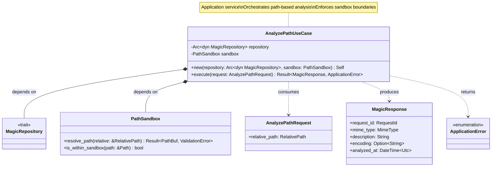
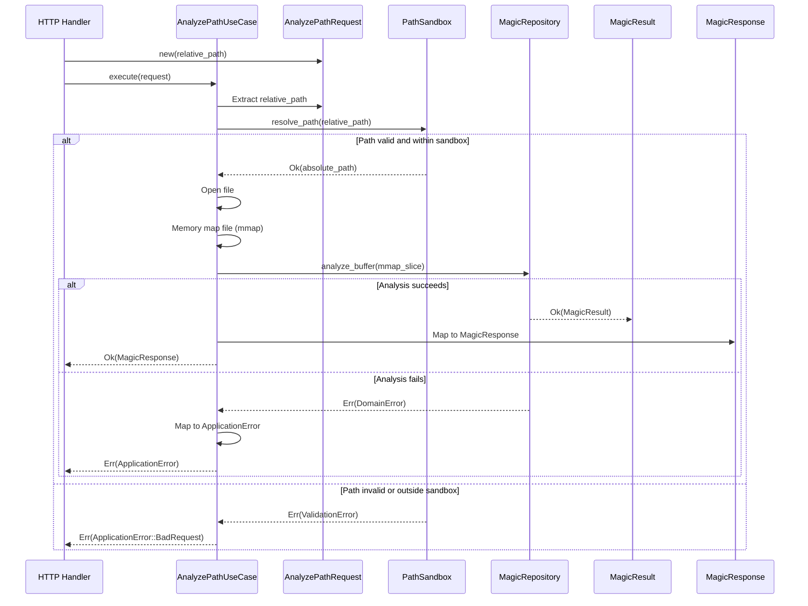
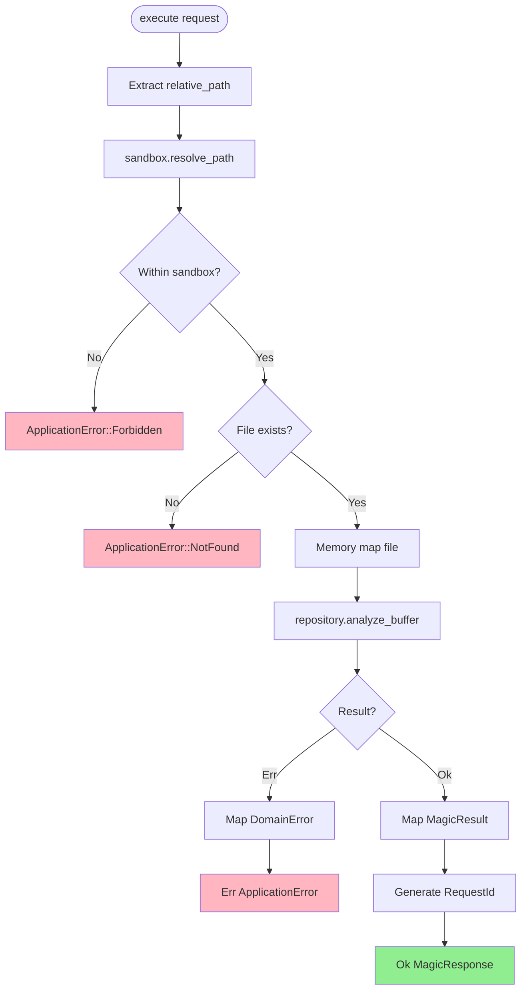
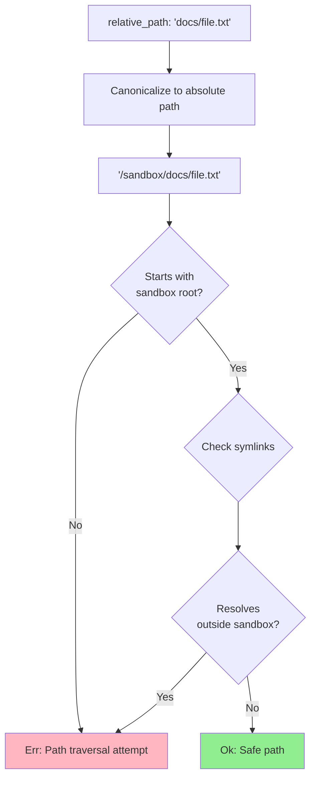
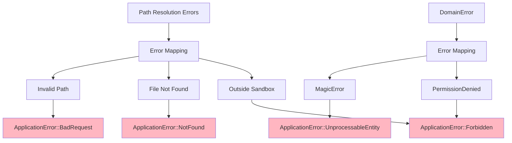
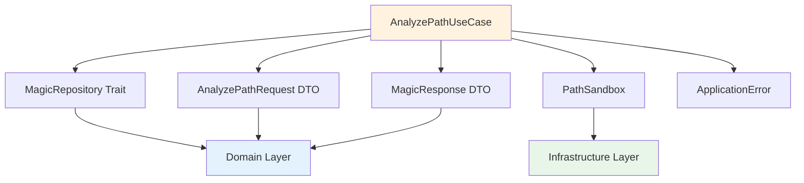

# AnalyzePathUseCase Class Diagram <!-- omit in toc -->

- [Overview](#overview)
- [Class Diagram](#class-diagram)
- [Execution Flow](#execution-flow)
- [Properties](#properties)
- [Methods](#methods)
- [Execution Process](#execution-process)
- [Sandbox Validation](#sandbox-validation)
- [Path Resolution Example](#path-resolution-example)
- [Error Mapping](#error-mapping)
- [Usage Scenario](#usage-scenario)
  - [Initialization](#initialization)
  - [Execution Pattern](#execution-pattern)
  - [Response and Error Handling](#response-and-error-handling)
- [Security Validation Process](#security-validation-process)
- [Testing Strategy](#testing-strategy)
- [Dependencies](#dependencies)
- [Design Rationale](#design-rationale)

---

## Overview

The `AnalyzePathUseCase` orchestrates the analysis of files by relative path, with sandbox validation and boundary checks.

## Class Diagram

## Execution Flow

## Properties

| Property | Type | Description |
|----------|------|-------------|
| `repository` | `Arc<dyn MagicRepository>` | Magic analysis repository |
| `sandbox` | `Arc<dyn SandboxService>` | Sandbox boundary enforcer |
| `analysis_timeout_secs` | `u64` | Analysis timeout in seconds |

## Methods

| Method | Parameters | Return Type | Description |
|--------|------------|-------------|-------------|
| `new` | `repository, sandbox, timeout` | `Self` | Constructor with dependencies |
| `execute` | `request_id, filename, path` | `Result<MagicResult, ApplicationError>` | Execute use case with sandbox validation |

## Execution Process

## Sandbox Validation

## Path Resolution Example

| Input (Relative) | Sandbox Root | Resolved (Absolute) | Result |
|------------------|--------------|---------------------|--------|
| `docs/file.txt` | `/sandbox` | `/sandbox/docs/file.txt` | ✅ Allowed |
| `../etc/passwd` | `/sandbox` | `/etc/passwd` | ❌ Outside sandbox |
| `docs/../file.txt` | `/sandbox` | `/sandbox/file.txt` | ✅ Allowed (normalizes) |
| `/etc/passwd` | `/sandbox` | - | ❌ Absolute path rejected |

## Error Mapping

## Usage Scenario

### Initialization

The AnalyzePathUseCase is initialized with two primary dependencies: a MagicRepository implementation for the actual file analysis and a PathSandbox for enforcing security boundaries. These dependencies are typically injected as thread-safe atomic reference counters.

### Execution Pattern

To analyze a file by path, a request is constructed containing a RelativePath value object. The execute method first resolves this relative path to an absolute path within the sandbox. If resolution succeeds and the file exists, the use case calls the repository to analyze the file and returns a response.

### Response and Error Handling

Successful execution results in a MagicResponse containing the file type details. If the path traversal attempt is detected, it returns Forbidden. If the file does not exist, it returns NotFound. Other input errors result in BadRequest, and analysis failures return UnprocessableEntity.

## Security Validation Process

The use case coordinates a multi-step security validation process:
1. **Initial Validation**: The RelativePath object ensures the input doesn't contain forbidden sequences like parent directory references.
2. **Path Resolution**: The sandbox resolves the path, ensuring it stays within the configured root and doesn't escape via symlinks.
3. **Existence Verification**: Confirms the file exists before attempting analysis.
4. **Boundary Check**: Final verification that the canonicalized path remains within the sandbox.

## Testing Strategy

Testing the path-based analysis involves several scenarios:
- **Success Path**: Verification that valid files within the sandbox are correctly analyzed.
- **Symlink Protection**: Ensuring symlinks pointing outside the sandbox are rejected.
- **Traversal Prevention**: Confirming that attempts to use '..' or absolute paths are blocked at the entry point.
- **Missing Resources**: Verifying that 404 errors are returned for files that do not exist.

## Dependencies

## Design Rationale

- **Security First**: Multi-layer path validation prevents traversal attacks
- **Sandbox Isolation**: Enforces boundary checks before file access
- **Dependency Inversion**: Depends on traits, not concrete implementations
- **Explicit Security**: PathSandbox makes security boundaries explicit
- **Error Semantics**: Maps low-level errors to high-level HTTP semantics
- **Testability**: Easy to test with mock repository and sandbox
