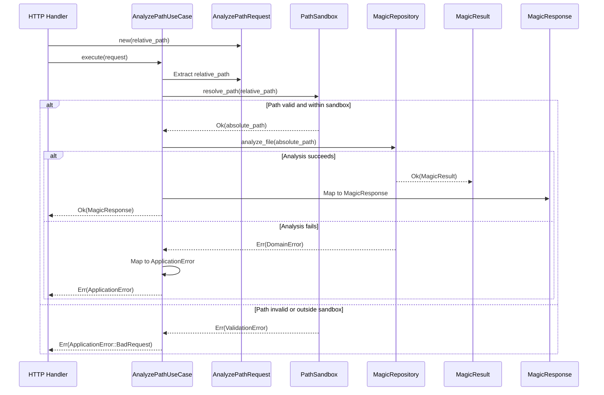
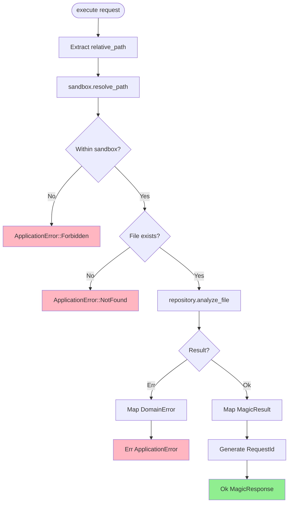
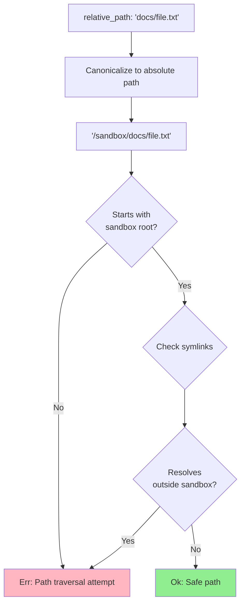
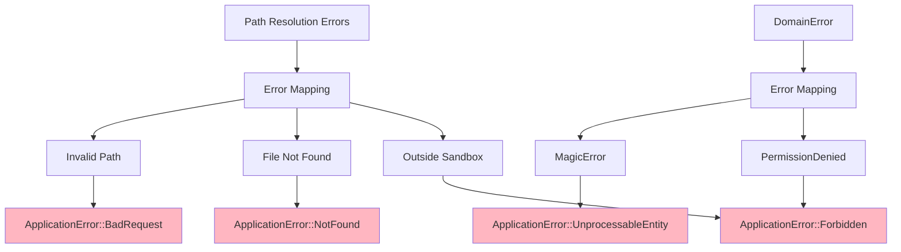
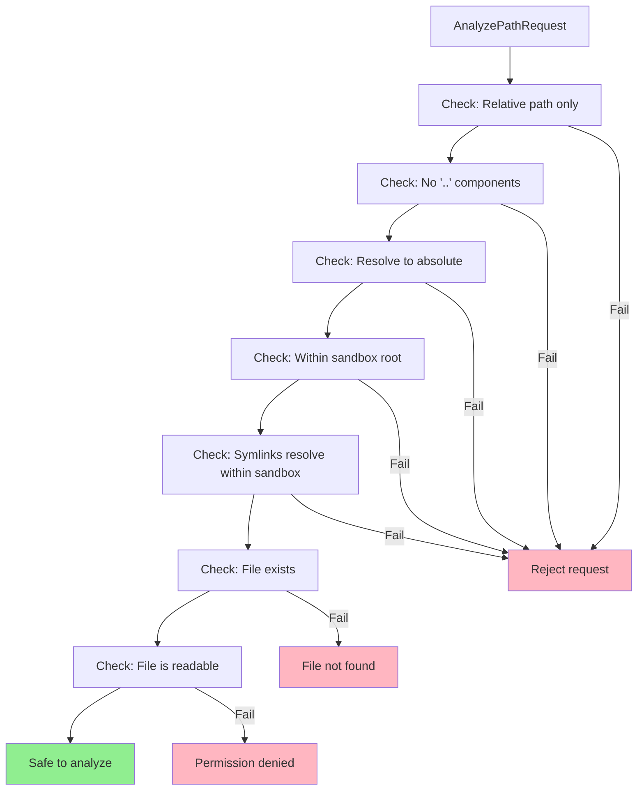
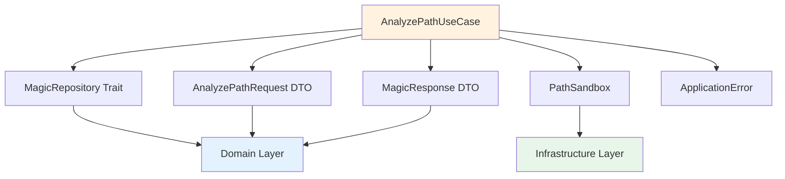

# AnalyzePathUseCase Class Diagram

## Overview

The `AnalyzePathUseCase` orchestrates the analysis of files by relative path, with sandbox validation and boundary checks.

## Class Diagram


## Execution Flow



## Properties

| Property | Type | Description |
|----------|------|-------------|
| `repository` | `Arc<dyn MagicRepository>` | Magic analysis repository |
| `sandbox` | `PathSandbox` | Sandbox boundary enforcer |

## Methods

| Method | Parameters | Return Type | Description |
|--------|------------|-------------|-------------|
| `new` | `repository: Arc<dyn MagicRepository>, sandbox: PathSandbox` | `Self` | Constructor with dependencies |
| `execute` | `request: AnalyzePathRequest` | `Result<MagicResponse, ApplicationError>` | Execute use case with sandbox validation |

## Execution Process



## Sandbox Validation



## Path Resolution Example

| Input (Relative) | Sandbox Root | Resolved (Absolute) | Result |
|------------------|--------------|---------------------|--------|
| `docs/file.txt` | `/sandbox` | `/sandbox/docs/file.txt` | ✅ Allowed |
| `../etc/passwd` | `/sandbox` | `/etc/passwd` | ❌ Outside sandbox |
| `docs/../file.txt` | `/sandbox` | `/sandbox/file.txt` | ✅ Allowed (normalizes) |
| `/etc/passwd` | `/sandbox` | - | ❌ Absolute path rejected |

## Error Mapping



## Usage Example

```rust
// Dependency injection
let repository = Arc::new(LibmagicRepository::new()?);
let sandbox = PathSandbox::new("/var/data/uploads")?;
let use_case = AnalyzePathUseCase::new(repository, sandbox);

// Execute use case
let request = AnalyzePathRequest {
    relative_path: RelativePath::new("documents/report.pdf")?,
};

let response = use_case.execute(request)?;
println!("MIME Type: {}", response.mime_type.as_str());

// Error handling
match use_case.execute(request) {
    Ok(response) => {
        // Success - return HTTP 200
        Json(response)
    },
    Err(ApplicationError::BadRequest(msg)) => {
        // Invalid path - return HTTP 400
        (StatusCode::BAD_REQUEST, msg)
    },
    Err(ApplicationError::Forbidden(msg)) => {
        // Path traversal attempt - return HTTP 403
        (StatusCode::FORBIDDEN, msg)
    },
    Err(ApplicationError::NotFound(msg)) => {
        // File not found - return HTTP 404
        (StatusCode::NOT_FOUND, msg)
    },
    Err(ApplicationError::UnprocessableEntity(msg)) => {
        // Analysis failed - return HTTP 422
        (StatusCode::UNPROCESSABLE_ENTITY, msg)
    },
    Err(_) => {
        // Internal error - return HTTP 500
        (StatusCode::INTERNAL_SERVER_ERROR, "Internal error")
    },
}
```

## Security Checks



## Path Traversal Attack Prevention

```
Attack: ../../etc/passwd
Result: Rejected (ParentTraversal in RelativePath validation)

Attack: docs/../../../etc/passwd
Result: Rejected (ParentTraversal detected)

Attack: /etc/passwd
Result: Rejected (AbsolutePath in RelativePath validation)

Attack: docs/symlink-to-etc (where symlink -> /etc)
Result: Rejected (Symlink resolves outside sandbox)

Valid: docs/report.pdf
Result: Accepted (within sandbox, no traversal)
```

## Dependencies



## Design Rationale

- **Security First**: Multi-layer path validation prevents traversal attacks
- **Sandbox Isolation**: Enforces boundary checks before file access
- **Dependency Inversion**: Depends on traits, not concrete implementations
- **Explicit Security**: PathSandbox makes security boundaries explicit
- **Error Semantics**: Maps low-level errors to high-level HTTP semantics
- **Testability**: Easy to test with mock repository and sandbox
