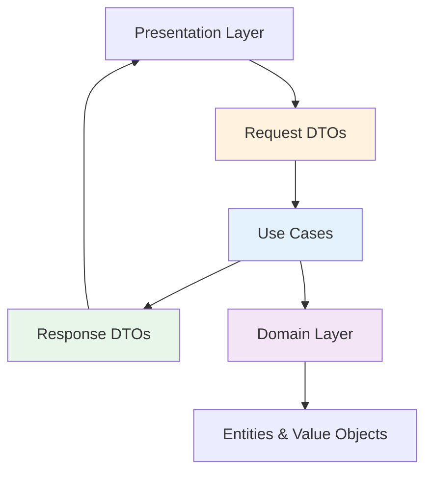
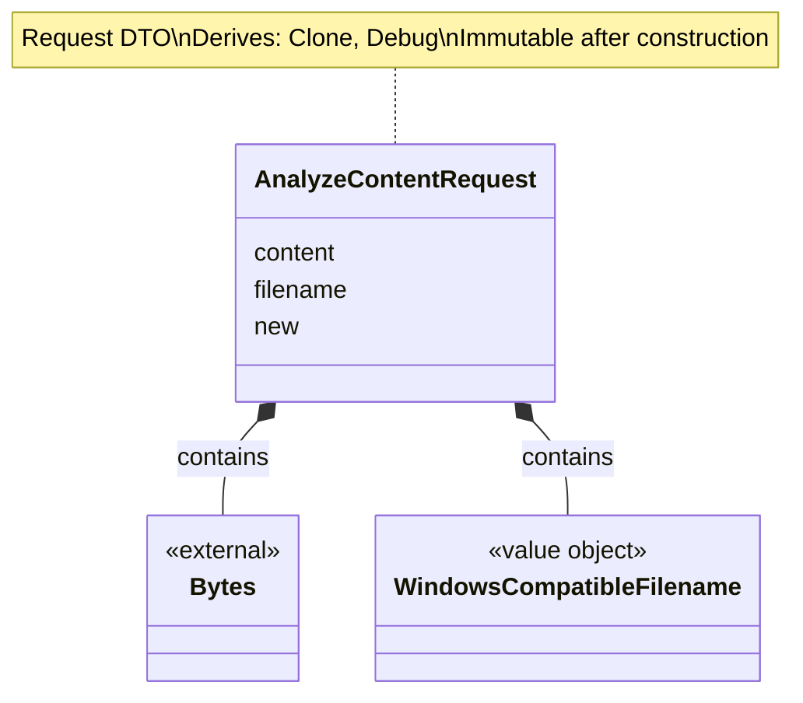
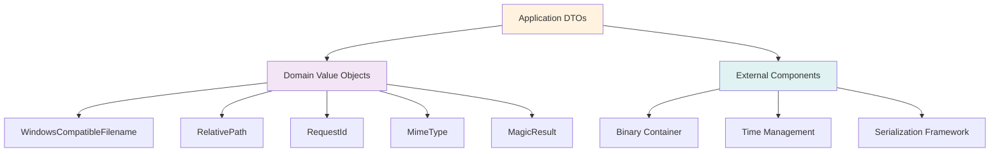

# Application DTOs Class Diagrams <!-- omit in toc -->

- [Overview](#overview)
- [DTO Architecture](#dto-architecture)
- [AnalyzeContentRequest DTO](#analyzecontentrequest-dto)
  - [Class Diagram](#class-diagram)
  - [Properties](#properties)
  - [Methods](#methods)
- [AnalyzePathRequest DTO](#analyzepathrequest-dto)
  - [Class Diagram](#class-diagram-1)
  - [Properties](#properties-1)
  - [Methods](#methods-1)
- [MagicResponse DTO](#magicresponse-dto)
  - [Class Diagram](#class-diagram-2)
  - [Properties](#properties-2)
  - [Methods](#methods-2)
- [Usage Pattern](#usage-pattern)
  - [AnalyzeContentRequest](#analyzecontentrequest)
  - [AnalyzePathRequest](#analyzepathrequest)
  - [MagicResponse](#magicresponse)
- [DTO Mapping and Serialization](#dto-mapping-and-serialization)
  - [Serialization Options](#serialization-options)
- [Dependencies](#dependencies)
- [Design Rationale](#design-rationale)

---

## Overview

Data Transfer Objects (DTOs) define the input and output contracts for application use cases, isolating domain from presentation concerns.

## DTO Architecture

---

## AnalyzeContentRequest DTO

### Class Diagram

### Properties

| Property | Type | Description | Validation |
|----------|------|-------------|------------|
| content | Binary Data | Binary file content | Max 100MB (enforced at HTTP layer) |
| filename | Filename | Original filename | Value object validation |

### Methods

| Method | Parameters | Return Type | Description |
|--------|------------|-------------|-------------|
| new | content, filename | Self | Constructor |
| content | self | Data reference | Get content reference |
| filename | self | Filename reference | Get filename reference |

## Usage Pattern

### AnalyzeContentRequest

The AnalyzeContentRequest DTO is typically constructed in the presentation layer after extracting the binary body and filename from the HTTP request. Once created, it is passed to the AnalyzeContentUseCase for processing. It encapsulates the binary data and its associated metadata in a single immutable structure.

### AnalyzePathRequest

The AnalyzePathRequest DTO is created when a request arrives at the path-based analysis endpoint. It wraps a validated RelativePath value object, ensuring that the use case receives a safe and well-formed path.

### MagicResponse

The MagicResponse DTO is the primary output of the system. It is constructed by use cases from domain entities and then serialized to JSON for the HTTP response. It includes the detected file type, a descriptive label, any encoding information, and a unique tracking ID for the request.

## DTO Mapping and Serialization

The system uses a strict mapping approach to maintain layer isolation:
1. **Input Mapping**: HTTP request data is transformed into request DTOs.
2. **Internal Processing**: Use cases operate on DTOs and produce domain entities.
3. **Output Mapping**: Domain entities are transformed into response DTOs.
4. **Serialization**: Response DTOs are serialized into JSON format.

Serialization is controlled via standard mechanisms to handle optional fields (omitting empty values from JSON) and formatting timestamps consistently using the ISO 8601 standard.

### Serialization Options

| Option | Usage | Purpose |
|--------|-------|---------|
| Skip if empty | Optional fields | Omit missing values from JSON |
| Rename field | Field naming | Control JSON key names |
| Timestamp format | Timestamp format | Consistent time representation |

## Dependencies

## Design Rationale

- **Boundary Objects**: DTOs mark the boundary between layers
- **Type Safety**: Value objects ensure validation before reaching use cases
- **Serialization**: DTOs are designed for JSON serialization (HTTP responses)
- **Immutability**: Prevents accidental modification during request processing
- **Simple**: No methods beyond getters and builders
- **Testable**: Easy to construct for testing
