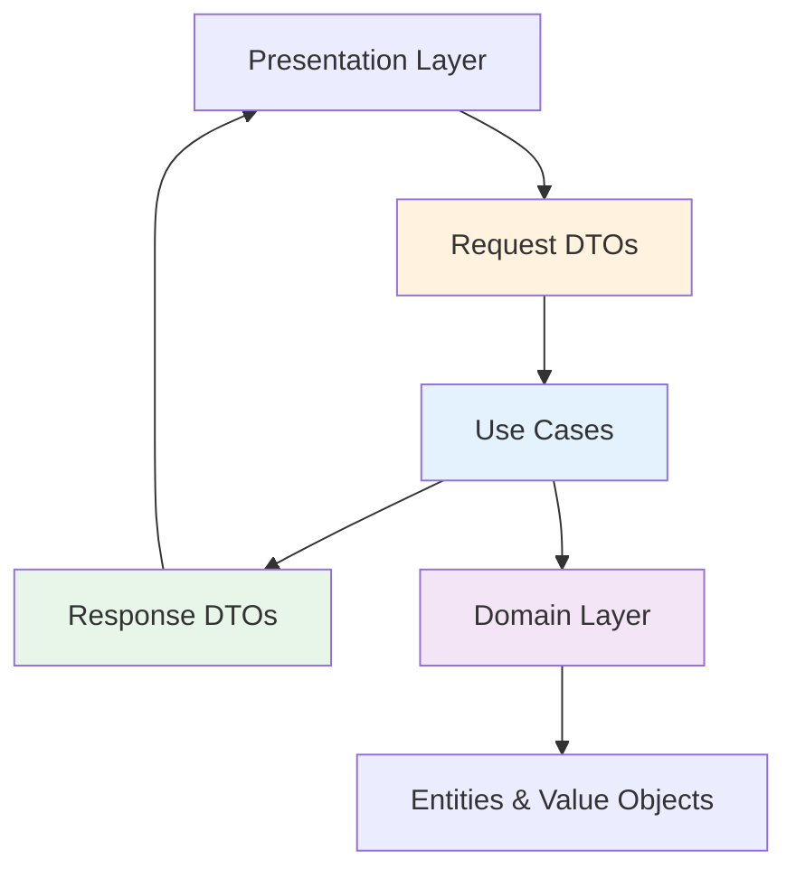
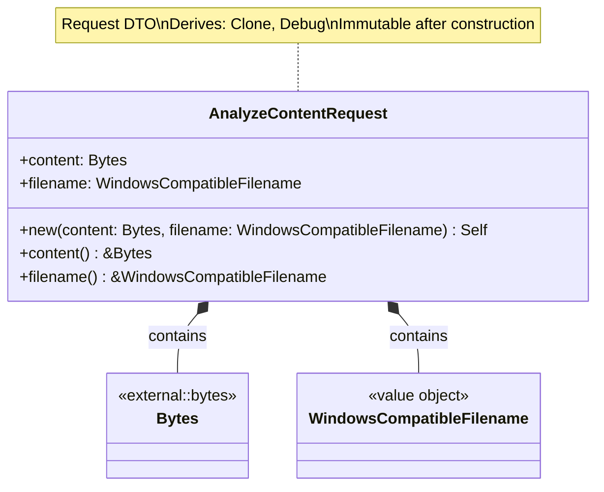
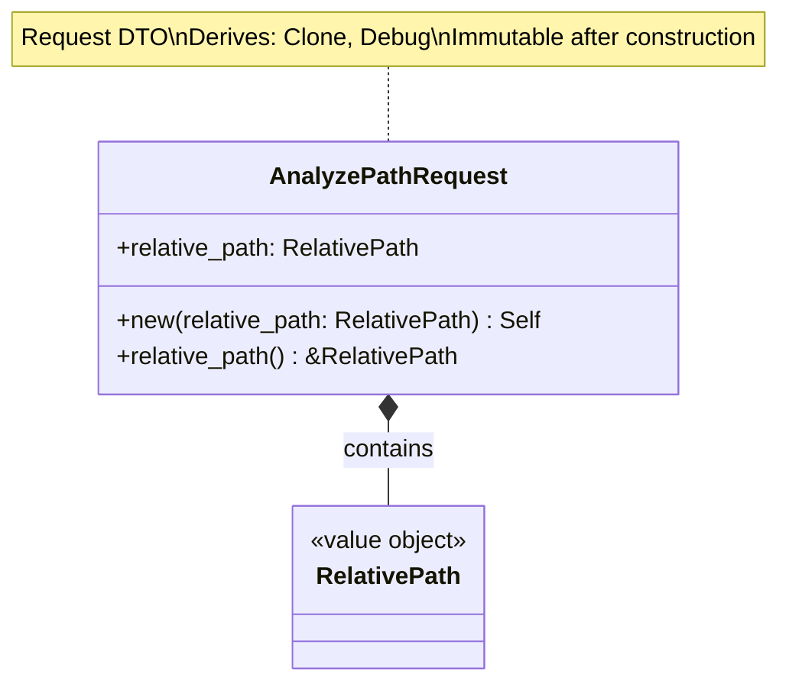
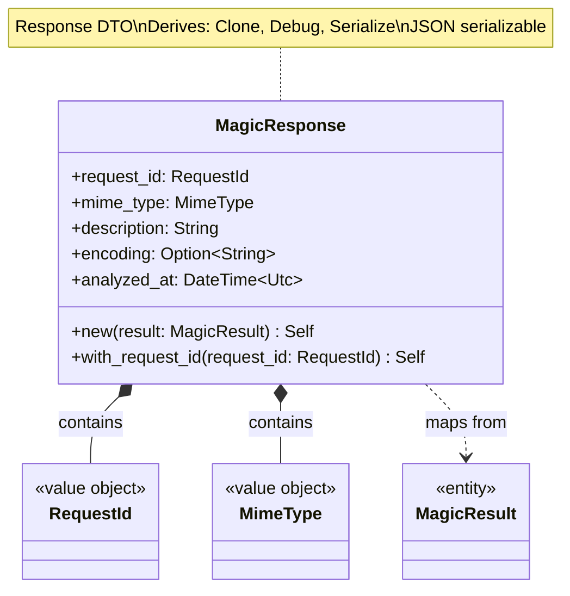
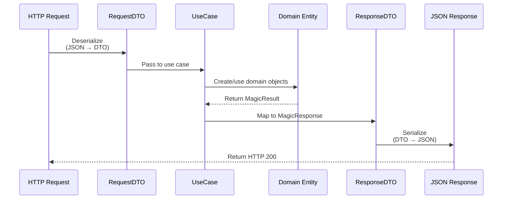
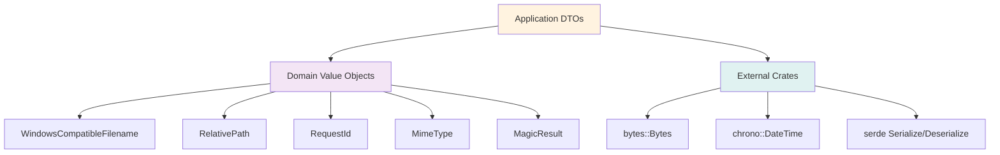

# Application DTOs Class Diagrams

## Overview

Data Transfer Objects (DTOs) define the input and output contracts for application use cases, isolating domain from presentation concerns.

## DTO Architecture



---

## AnalyzeContentRequest DTO

### Class Diagram



### Properties

| Property | Type | Description | Validation |
|----------|------|-------------|------------|
| `content` | `Bytes` | Binary file content | Max 100MB (enforced at HTTP layer) |
| `filename` | `WindowsCompatibleFilename` | Original filename | Value object validation |

### Methods

| Method | Parameters | Return Type | Description |
|--------|------------|-------------|-------------|
| `new` | `content: Bytes, filename: WindowsCompatibleFilename` | `Self` | Constructor |
| `content` | `&self` | `&Bytes` | Get content reference |
| `filename` | `&self` | `&WindowsCompatibleFilename` | Get filename reference |

### Usage Example

```rust
let content = Bytes::from(vec![0x89, 0x50, 0x4E, 0x47]); // PNG header
let filename = WindowsCompatibleFilename::new("image.png".to_string())?;
let request = AnalyzeContentRequest::new(content, filename);
```

---

## AnalyzePathRequest DTO

### Class Diagram



### Properties

| Property | Type | Description | Validation |
|----------|------|-------------|------------|
| `relative_path` | `RelativePath` | Relative path to file | Value object validation (no `..`, no leading `/`) |

### Methods

| Method | Parameters | Return Type | Description |
|--------|------------|-------------|-------------|
| `new` | `relative_path: RelativePath` | `Self` | Constructor |
| `relative_path` | `&self` | `&RelativePath` | Get path reference |

### Usage Example

```rust
let path = RelativePath::new("documents/report.pdf")?;
let request = AnalyzePathRequest::new(path);
```

---

## MagicResponse DTO

### Class Diagram



### Properties

| Property | Type | Description | JSON Example |
|----------|------|-------------|--------------|
| `request_id` | `RequestId` | Unique request identifier | `"550e8400-e29b-41d4-a716-446655440000"` |
| `mime_type` | `MimeType` | Detected MIME type | `"text/plain"` |
| `description` | `String` | Human-readable description | `"ASCII text"` |
| `encoding` | `Option<String>` | Character encoding (if applicable) | `"utf-8"` or `null` |
| `analyzed_at` | `DateTime<Utc>` | Analysis timestamp | `"2024-02-11T14:30:00Z"` |

### Methods

| Method | Parameters | Return Type | Description |
|--------|------------|-------------|-------------|
| `new` | `result: MagicResult` | `Self` | Map from domain entity, auto-generate request ID |
| `with_request_id` | `self, request_id: RequestId` | `Self` | Builder: set specific request ID |

### JSON Representation

```json
{
  "request_id": "550e8400-e29b-41d4-a716-446655440000",
  "mime_type": "text/plain",
  "description": "ASCII text",
  "encoding": "us-ascii",
  "analyzed_at": "2024-02-11T14:30:00Z"
}
```

### Usage Example

```rust
// Map from domain entity
let magic_result = repository.analyze_buffer(data, filename)?;
let response = MagicResponse::new(magic_result);

// With custom request ID
let request_id = RequestId::parse("550e8400-e29b-41d4-a716-446655440000")?;
let response = MagicResponse::new(magic_result)
    .with_request_id(request_id);
```

### Mapping from MagicResult

```rust
impl From<MagicResult> for MagicResponse {
    fn from(result: MagicResult) -> Self {
        MagicResponse {
            request_id: RequestId::new(), // Auto-generate
            mime_type: result.mime_type().clone(),
            description: result.description().to_string(),
            encoding: result.encoding().map(|s| s.to_string()),
            analyzed_at: result.analyzed_at(),
        }
    }
}
```

---

## DTO Mapping Flow



## DTO Design Principles

| Principle | Description | Benefit |
|-----------|-------------|---------|
| **Immutability** | All fields immutable after construction | Thread-safe, no unexpected mutations |
| **Validation at Construction** | Use value objects for validated fields | Invalid DTOs cannot be constructed |
| **No Business Logic** | Pure data containers | Simple, testable, serializable |
| **Derives Traits** | `Clone`, `Debug`, `Serialize`, `Deserialize` | Easy to use, log, and transmit |
| **Layer Boundary** | Isolate domain from presentation | Domain changes don't break API |

## Serialization

All response DTOs implement `serde::Serialize`:

```rust
use serde::{Serialize, Deserialize};

#[derive(Debug, Clone, Serialize)]
pub struct MagicResponse {
    pub request_id: RequestId,
    pub mime_type: MimeType,
    pub description: String,
    #[serde(skip_serializing_if = "Option::is_none")]
    pub encoding: Option<String>,
    pub analyzed_at: DateTime<Utc>,
}
```

### Serialization Options

| Option | Usage | Purpose |
|--------|-------|---------|
| `#[serde(skip_serializing_if = "Option::is_none")]` | Optional fields | Omit `null` from JSON |
| `#[serde(rename = "mime_type")]` | Field naming | Control JSON key names |
| `#[serde(with = "chrono::serde::ts_seconds")]` | Timestamp format | Unix timestamp instead of ISO 8601 |

## Dependencies



## Design Rationale

- **Boundary Objects**: DTOs mark the boundary between layers
- **Type Safety**: Value objects ensure validation before reaching use cases
- **Serialization**: DTOs are designed for JSON serialization (HTTP responses)
- **Immutability**: Prevents accidental modification during request processing
- **Simple**: No methods beyond getters and builders
- **Testable**: Easy to construct for testing
