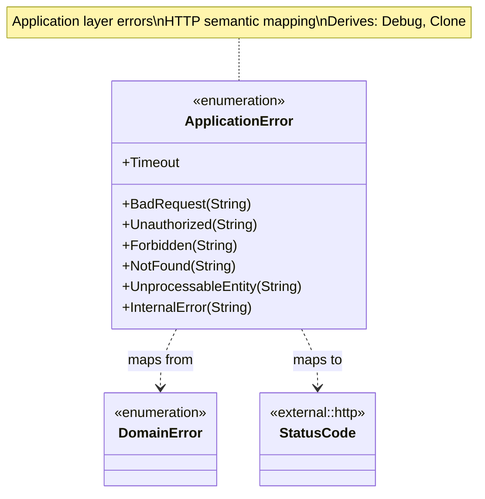
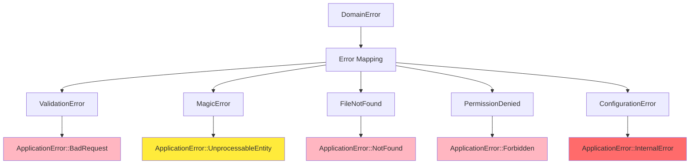

# Application Errors Class Diagram

## Overview

`ApplicationError` represents all possible failures at the application layer, mapping domain errors to HTTP-friendly semantic errors.

## Class Diagram

## Error Variants

| Variant | HTTP Status | Description | Use Case |
|---------|-------------|-------------|----------|
| `BadRequest(String)` | 400 | Invalid input or validation failure | Malformed request, invalid value object |
| `Unauthorized(String)` | 401 | Authentication required or failed | Missing or invalid credentials |
| `Forbidden(String)` | 403 | Authenticated but not authorized | Path traversal, sandbox violation |
| `NotFound(String)` | 404 | Resource not found | File doesn't exist |
| `UnprocessableEntity(String)` | 422 | Valid request but semantic error | File analysis failed, unsupported format |
| `InternalError(String)` | 500 | Unexpected system error | Configuration error, unexpected exception |
| `Timeout` | 504 | Request timeout | Analysis took too long |

## Error Mapping from Domain

## Usage Patterns

### Error Propagation in Use Cases

Use cases are responsible for executing business logic and coordinating with repositories. When a domain-level error occurs, the use case maps it to an appropriate application error variant. For example, a validation error from a value object is transformed into a BadRequest application error, while an infrastructure failure is mapped to UnprocessableEntity or InternalError.

### Integration with Handlers

HTTP handlers call use cases and receive results. If a use case returns an error, the handler maps that error to a specific HTTP status code and constructs a standardized JSON error response. This ensures that clients receive consistent and actionable error information regardless of which endpoint they are calling.

## Error Mapping and Context

The error system follows a multi-stage mapping process:
1. **Infrastructure Boundary**: Low-level system or library errors are converted to domain errors.
2. **Application Boundary**: Domain errors are mapped to application errors with semantic HTTP meaning.
3. **Presentation Boundary**: Application errors are transformed into status codes and JSON responses.

Each error variant provides a machine-readable code, a human-readable message, and a request ID for correlation across logs and monitoring systems.

## Error Metrics

| Error Type | Metric | Alert Threshold |
|------------|--------|-----------------|
| `BadRequest` | `http_errors_bad_request_total` | > 10% of requests |
| `Unauthorized` | `http_errors_unauthorized_total` | > 5% of requests |
| `Forbidden` | `http_errors_forbidden_total` | Investigate all |
| `NotFound` | `http_errors_not_found_total` | Monitor trend |
| `UnprocessableEntity` | `http_errors_unprocessable_total` | > 1% of requests |
| `InternalError` | `http_errors_internal_total` | > 0.1% of requests |
| `Timeout` | `http_errors_timeout_total` | > 0.5% of requests |

## Design Rationale

- **HTTP Semantics**: Error variants map directly to HTTP status codes
- **User-Friendly**: Include descriptive messages for debugging
- **Security**: Internal errors don't leak sensitive details
- **Traceability**: Include request ID in error responses
- **Layered**: Maps from domain errors without exposing domain internals
- **Actionable**: Error messages guide users to fix issues
