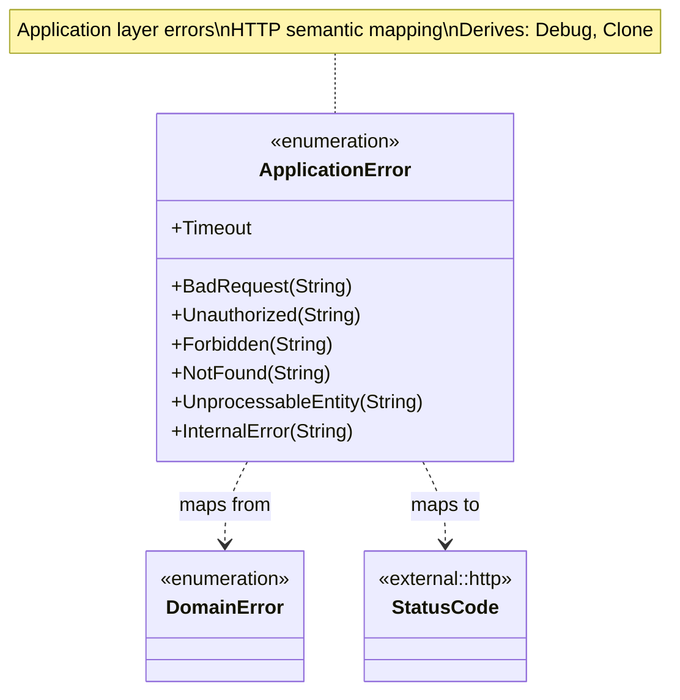
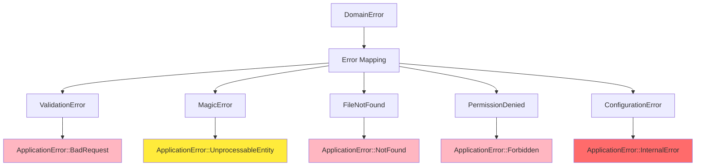
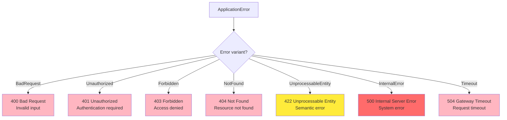
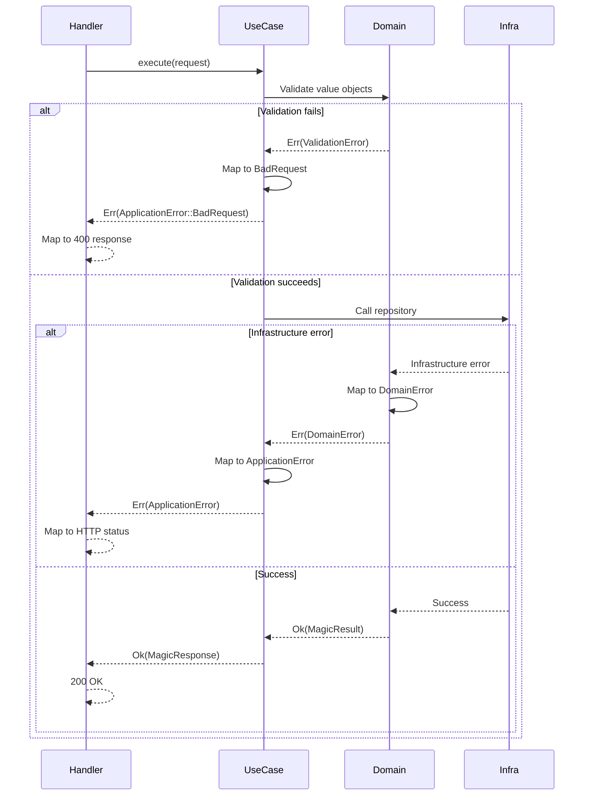

# Application Errors Class Diagram

## Overview

`ApplicationError` represents all possible failures at the application layer, mapping domain errors to HTTP-friendly semantic errors.

## Class Diagram



## Error Variants

| Variant | HTTP Status | Description | Use Case |
|---------|-------------|-------------|----------|
| `BadRequest(String)` | 400 | Invalid input or validation failure | Malformed request, invalid value object |
| `Unauthorized(String)` | 401 | Authentication required or failed | Missing or invalid credentials |
| `Forbidden(String)` | 403 | Authenticated but not authorized | Path traversal, sandbox violation |
| `NotFound(String)` | 404 | Resource not found | File doesn't exist |
| `UnprocessableEntity(String)` | 422 | Valid request but semantic error | File analysis failed, unsupported format |
| `InternalError(String)` | 500 | Unexpected system error | Configuration error, unexpected exception |
| `Timeout` | 504 | Request timeout | Analysis took too long |

## Error Mapping from Domain



## Mapping Implementation

```rust
impl From<DomainError> for ApplicationError {
    fn from(error: DomainError) -> Self {
        match error {
            DomainError::ValidationError(e) => {
                ApplicationError::BadRequest(format!("Validation failed: {}", e))
            },
            DomainError::MagicError(e) => {
                ApplicationError::UnprocessableEntity(format!("Analysis failed: {}", e))
            },
            DomainError::FileNotFound(path) => {
                ApplicationError::NotFound(format!("File not found: {}", path))
            },
            DomainError::PermissionDenied(path) => {
                ApplicationError::Forbidden(format!("Access denied: {}", path))
            },
            DomainError::ConfigurationError(msg) => {
                ApplicationError::InternalError(format!("Configuration error: {}", msg))
            },
        }
    }
}
```

## HTTP Response Mapping



## Error Response Format

```json
{
  "error": {
    "code": "validation_error",
    "message": "Validation failed: Filename too long (311, max 310)",
    "request_id": "550e8400-e29b-41d4-a716-446655440000"
  }
}
```

## Error Code Mapping

| ApplicationError | HTTP Status | Error Code | Message Template |
|------------------|-------------|------------|------------------|
| `BadRequest` | 400 | `validation_error` | "Validation failed: {details}" |
| `Unauthorized` | 401 | `authentication_required` | "Authentication required" |
| `Forbidden` | 403 | `access_denied` | "Access denied: {reason}" |
| `NotFound` | 404 | `not_found` | "Resource not found: {resource}" |
| `UnprocessableEntity` | 422 | `processing_error` | "Cannot process: {reason}" |
| `InternalError` | 500 | `internal_error` | "Internal server error" |
| `Timeout` | 504 | `timeout` | "Request timeout" |

## Usage Examples

### In Use Cases

```rust
impl<R: MagicRepository> AnalyzeContentUseCase<R> {
    pub fn execute(&self, request: AnalyzeContentRequest) -> Result<MagicResponse, ApplicationError> {
        // Validate request
        if request.content().is_empty() {
            return Err(ApplicationError::BadRequest("Content is empty".to_string()));
        }
        
        // Call repository
        let result = self.repository
            .analyze_buffer(request.content(), request.filename().as_str())
            .map_err(ApplicationError::from)?; // Automatic mapping
        
        // Map to response
        Ok(MagicResponse::from(result))
    }
}
```

### In HTTP Handlers

```rust
async fn analyze_content_handler(
    State(use_case): State<Arc<AnalyzeContentUseCase>>,
    Json(request): Json<AnalyzeContentRequest>,
) -> Result<Json<MagicResponse>, (StatusCode, Json<ErrorResponse>)> {
    use_case
        .execute(request)
        .map(Json)
        .map_err(|e| {
            let status = match &e {
                ApplicationError::BadRequest(_) => StatusCode::BAD_REQUEST,
                ApplicationError::Unauthorized(_) => StatusCode::UNAUTHORIZED,
                ApplicationError::Forbidden(_) => StatusCode::FORBIDDEN,
                ApplicationError::NotFound(_) => StatusCode::NOT_FOUND,
                ApplicationError::UnprocessableEntity(_) => StatusCode::UNPROCESSABLE_ENTITY,
                ApplicationError::InternalError(_) => StatusCode::INTERNAL_SERVER_ERROR,
                ApplicationError::Timeout => StatusCode::GATEWAY_TIMEOUT,
            };
            
            let error_response = ErrorResponse {
                error: ErrorDetail {
                    code: e.code(),
                    message: e.to_string(),
                    request_id: RequestId::new(),
                },
            };
            
            (status, Json(error_response))
        })
}
```

## Error Context Flow



## Error Logging

```rust
impl ApplicationError {
    pub fn log(&self) {
        match self {
            ApplicationError::BadRequest(msg) => {
                log::warn!("Bad request: {}", msg);
            },
            ApplicationError::Unauthorized(msg) => {
                log::warn!("Unauthorized: {}", msg);
            },
            ApplicationError::Forbidden(msg) => {
                log::warn!("Forbidden: {}", msg);
            },
            ApplicationError::NotFound(msg) => {
                log::info!("Not found: {}", msg);
            },
            ApplicationError::UnprocessableEntity(msg) => {
                log::warn!("Unprocessable: {}", msg);
            },
            ApplicationError::InternalError(msg) => {
                log::error!("Internal error: {}", msg);
            },
            ApplicationError::Timeout => {
                log::warn!("Request timeout");
            },
        }
    }
}
```

## Error Metrics

| Error Type | Metric | Alert Threshold |
|------------|--------|-----------------|
| `BadRequest` | `http_errors_bad_request_total` | > 10% of requests |
| `Unauthorized` | `http_errors_unauthorized_total` | > 5% of requests |
| `Forbidden` | `http_errors_forbidden_total` | Investigate all |
| `NotFound` | `http_errors_not_found_total` | Monitor trend |
| `UnprocessableEntity` | `http_errors_unprocessable_total` | > 1% of requests |
| `InternalError` | `http_errors_internal_total` | > 0.1% of requests |
| `Timeout` | `http_errors_timeout_total` | > 0.5% of requests |

## Design Rationale

- **HTTP Semantics**: Error variants map directly to HTTP status codes
- **User-Friendly**: Include descriptive messages for debugging
- **Security**: Internal errors don't leak sensitive details
- **Traceability**: Include request ID in error responses
- **Layered**: Maps from domain errors without exposing domain internals
- **Actionable**: Error messages guide users to fix issues
