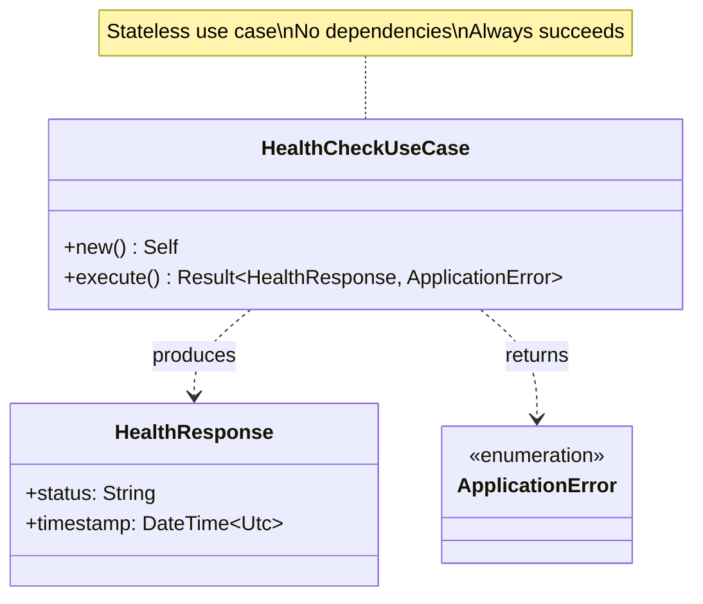
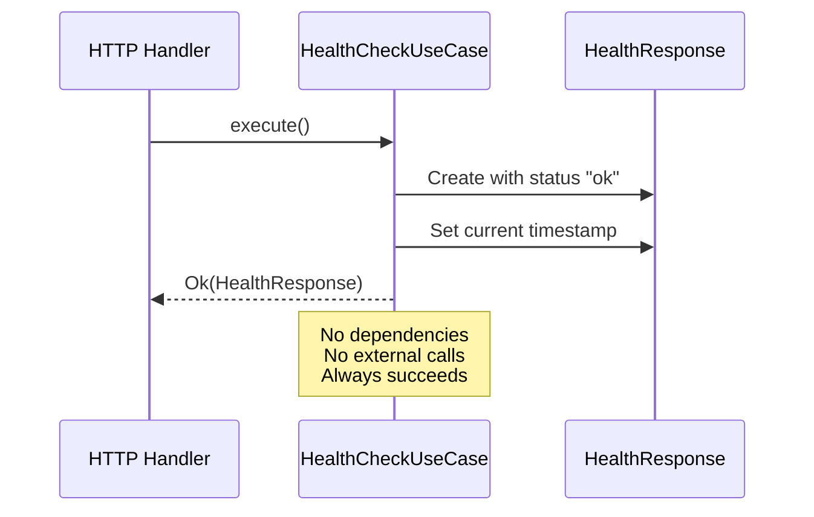

# HealthCheckUseCase Class Diagram

## Overview

The `HealthCheckUseCase` provides a simple liveness check with no external dependencies or state.

## Class Diagram



## Execution Flow



## Properties

| Property | Type | Description |
|----------|------|-------------|
| - | - | No properties (stateless) |

## Methods

| Method | Parameters | Return Type | Description |
|--------|------------|-------------|-------------|
| `new` | - | `Self` | Constructor (no dependencies) |
| `execute` | - | `Result<HealthResponse, ApplicationError>` | Execute health check (always succeeds) |

## Execution Process


## HealthResponse Structure

```json
{
  "status": "ok",
  "timestamp": "2024-02-11T14:30:00Z"
}
```

| Field | Type | Description | Example |
|-------|------|-------------|---------|
| `status` | `String` | Health status (always "ok") | `"ok"` |
| `timestamp` | `DateTime<Utc>` | Current UTC timestamp | `"2024-02-11T14:30:00Z"` |

## Usage Scenario

### Integration Patterns

The HealthCheckUseCase is primarily used in the ping handler. Because it is stateless and has no dependencies, it can be easily instantiated or injected as a singleton.

### Execution

When executed, the use case simply generates a success status and records the current timestamp. This provides a lightweight way for external systems to verify that the application process is running and the async runtime is responding.

## Response Codes

The health check is designed to be highly reliable. Under normal operating conditions, it always returns a 200 OK status with a JSON response confirming the "ok" status and current time. A failure (500 Internal Server Error) would only occur in the event of a catastrophic system failure that prevents the use case from even executing.

## Testing Strategy

Testing for this use case focuses on two simple invariants:
1. **Always Succeeds**: Confirms that calling the use case returns a success result.
2. **Fresh Timestamp**: Verifies that the returned timestamp is current and accurate.
