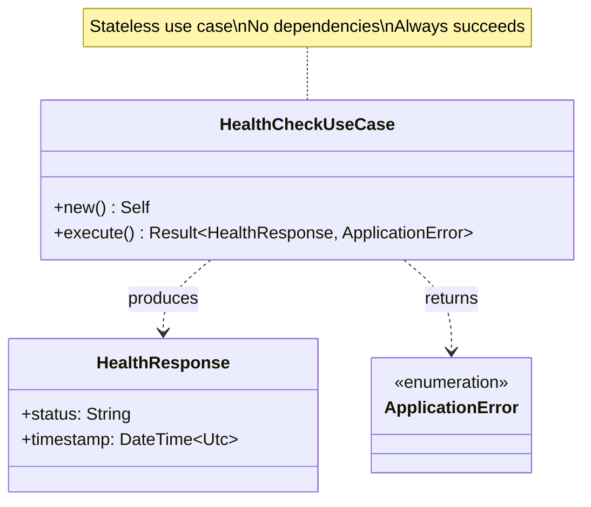
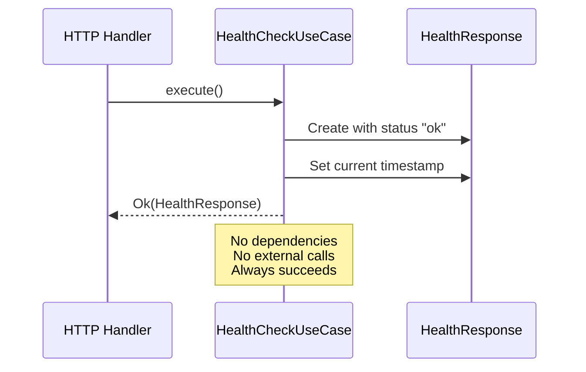
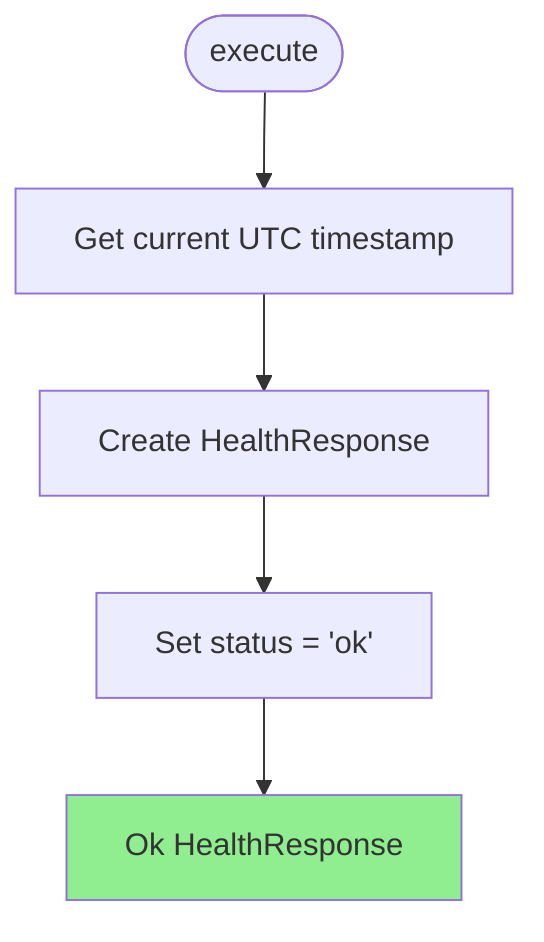
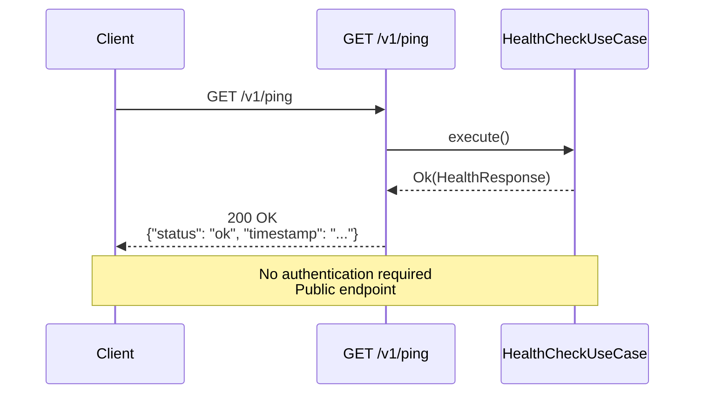
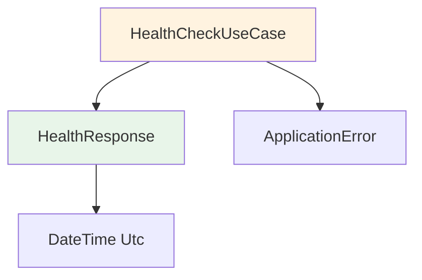

# HealthCheckUseCase Class Diagram

## Overview

The `HealthCheckUseCase` provides a simple liveness check with no external dependencies or state.

## Class Diagram



## Execution Flow



## Properties

| Property | Type | Description |
|----------|------|-------------|
| - | - | No properties (stateless) |

## Methods

| Method | Parameters | Return Type | Description |
|--------|------------|-------------|-------------|
| `new` | - | `Self` | Constructor (no dependencies) |
| `execute` | - | `Result<HealthResponse, ApplicationError>` | Execute health check (always succeeds) |

## Execution Process



## HealthResponse Structure

```json
{
  "status": "ok",
  "timestamp": "2024-02-11T14:30:00Z"
}
```

| Field | Type | Description | Example |
|-------|------|-------------|---------|
| `status` | `String` | Health status (always "ok") | `"ok"` |
| `timestamp` | `DateTime<Utc>` | Current UTC timestamp | `"2024-02-11T14:30:00Z"` |

## Usage Example

```rust
// No dependencies needed
let use_case = HealthCheckUseCase::new();

// Execute (always succeeds)
let response = use_case.execute()?;
assert_eq!(response.status, "ok");
println!("Health check at: {}", response.timestamp);

// In HTTP handler
async fn ping_handler(
    State(use_case): State<HealthCheckUseCase>,
) -> Result<Json<HealthResponse>, StatusCode> {
    use_case
        .execute()
        .map(Json)
        .map_err(|_| StatusCode::INTERNAL_SERVER_ERROR)
}
```

## HTTP Integration



## Response Codes

| HTTP Status | Condition | Body |
|-------------|-----------|------|
| 200 OK | Always (health check succeeded) | `{"status": "ok", "timestamp": "..."}` |
| 500 Internal Server Error | Extremely rare (system failure) | Error message |

## Use Cases

| Scenario | Purpose | Frequency |
|----------|---------|-----------|
| **Load Balancer Health Check** | Determine if instance is alive | Every 5-30 seconds |
| **Kubernetes Liveness Probe** | Restart unhealthy pods | Every 10 seconds |
| **Monitoring/Alerting** | Track service availability | Every 1-5 minutes |
| **Deployment Verification** | Confirm successful deployment | Once per deployment |

## Comparison with Deep Health Check

| Feature | Liveness Check (`/v1/ping`) | Deep Health Check |
|---------|------------------------------|-------------------|
| **Dependencies** | None | Database, external services |
| **Response Time** | < 1ms | Variable (seconds) |
| **Authentication** | No | Usually yes |
| **Purpose** | "Is process alive?" | "Is system functional?" |
| **Failure Impact** | Instance restart | Alert, investigation |

## Design Rationale

- **Simplicity**: No dependencies = no failure modes
- **Fast**: Returns immediately (< 1ms)
- **Lightweight**: Minimal CPU/memory usage
- **Public**: No authentication required (no sensitive data)
- **Always Available**: Works even if database/services are down
- **Kubernetes-Ready**: Perfect for liveness probes

## Enhanced Health Check (Future)

For a more comprehensive health check in production:

```rust
pub struct EnhancedHealthCheckUseCase {
    repository: Arc<dyn MagicRepository>,
    auth_service: Arc<dyn AuthenticationService>,
}

impl EnhancedHealthCheckUseCase {
    pub async fn execute(&self) -> Result<DetailedHealthResponse, ApplicationError> {
        let checks = vec![
            self.check_repository().await,
            self.check_auth_service().await,
            self.check_filesystem().await,
        ];
        
        Ok(DetailedHealthResponse {
            status: if checks.iter().all(|c| c.healthy) { "ok" } else { "degraded" },
            timestamp: Utc::now(),
            checks,
        })
    }
}
```

| Check | Purpose | Healthy Criteria |
|-------|---------|------------------|
| **Repository** | libmagic available | Can analyze test data |
| **Auth Service** | Credentials configured | Can verify test credentials |
| **Filesystem** | Sandbox accessible | Can read/write temp files |

## Dependencies



## Design Pattern

```
Health Check Pattern:
- No state
- No dependencies
- Fast response
- Always succeeds (unless catastrophic failure)
- Returns timestamp for freshness verification
```

## Testing

```rust
#[test]
fn test_health_check_always_succeeds() {
    let use_case = HealthCheckUseCase::new();
    let response = use_case.execute().unwrap();
    assert_eq!(response.status, "ok");
}

#[test]
fn test_health_check_returns_recent_timestamp() {
    let use_case = HealthCheckUseCase::new();
    let before = Utc::now();
    let response = use_case.execute().unwrap();
    let after = Utc::now();
    
    assert!(response.timestamp >= before);
    assert!(response.timestamp <= after);
}
```
