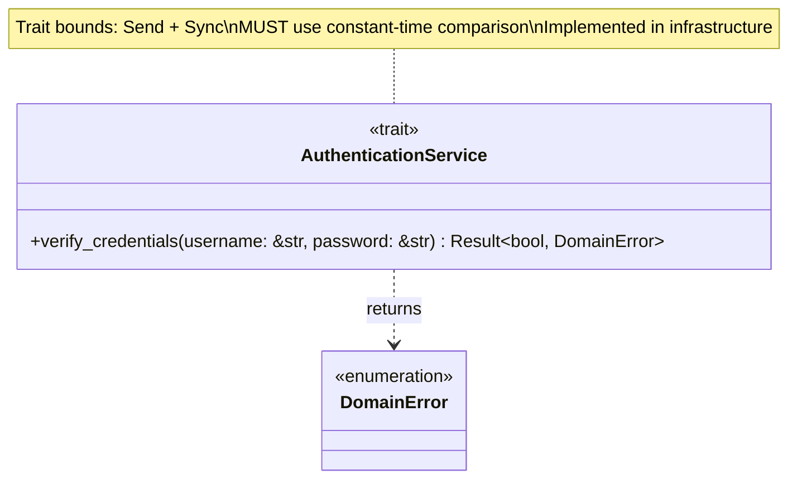
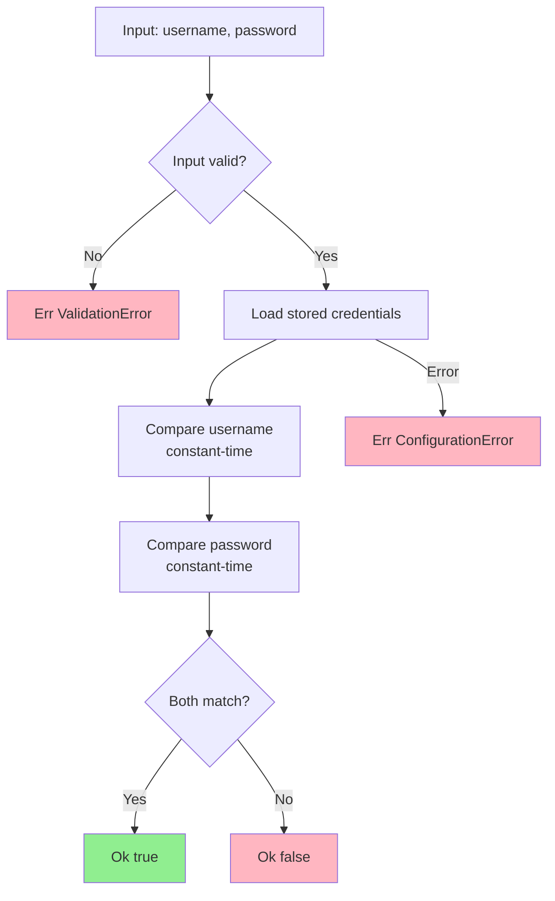
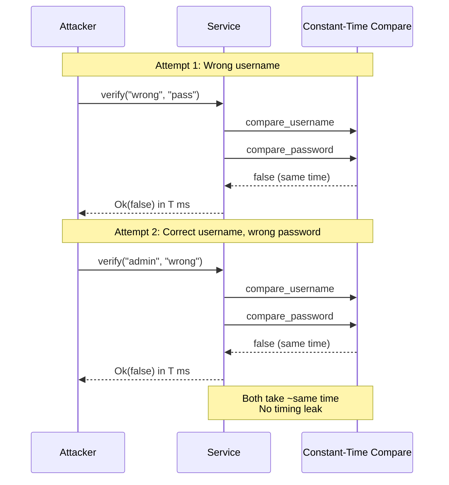
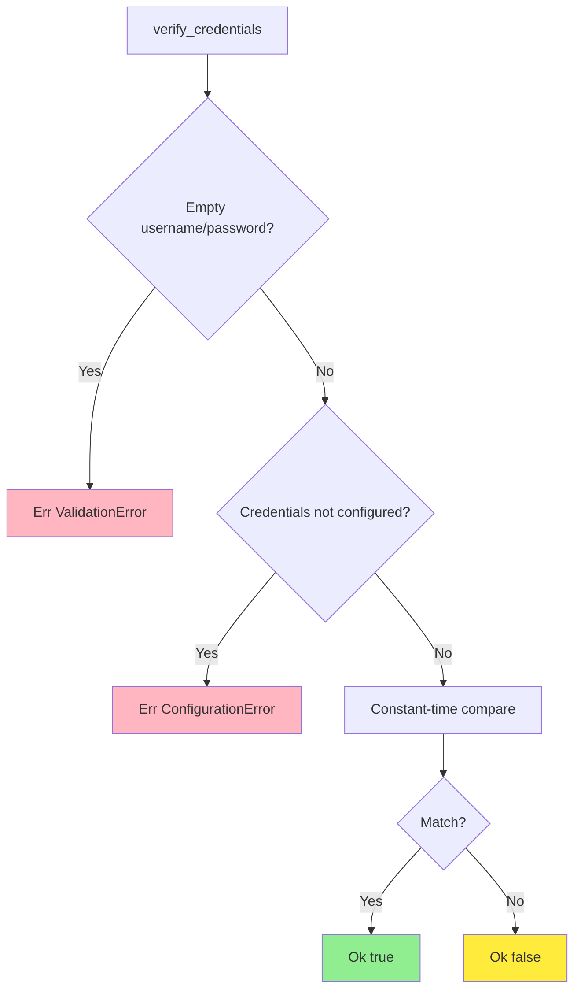
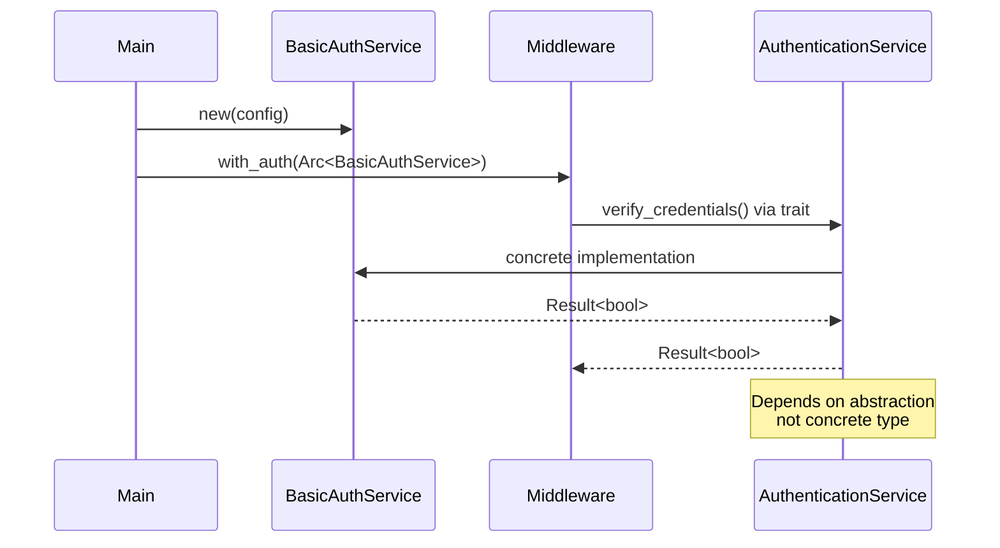

# AuthenticationService Trait Class Diagram

## Overview

The `AuthenticationService` trait defines the contract for credential verification with constant-time comparison requirements.

## Class Diagram



## Trait Definition

```rust
pub trait AuthenticationService: Send + Sync {
    /// Verifies credentials using constant-time comparison.
    ///
    /// SECURITY REQUIREMENT: Implementation MUST use constant-time
    /// comparison to prevent timing attacks.
    ///
    /// # Arguments
    /// * `username` - Username to verify
    /// * `password` - Password to verify
    ///
    /// # Returns
    /// * `Ok(true)` - Credentials are valid
    /// * `Ok(false)` - Credentials are invalid
    /// * `Err(DomainError)` - Verification process failed
    fn verify_credentials(
        &self,
        username: &str,
        password: &str,
    ) -> Result<bool, DomainError>;
}
```

## Verification Flow



## Security Requirements

### Constant-Time Comparison

**CRITICAL**: Implementation MUST use constant-time comparison to prevent timing attacks.



### Timing Attack Mitigation

| Vulnerability | Mitigation |
|---------------|------------|
| **Early Return** | Always compare both username AND password |
| **Variable Time** | Use `subtle::ConstantTimeEq` for comparison |
| **Branch Timing** | No conditional early exit based on comparison |
| **Cache Timing** | Compare same-length strings (pad if needed) |

## Implementation Requirements

Implementations MUST:

1. **Constant-Time**: Use `subtle` crate or equivalent for comparison
2. **No Early Exit**: Always compare both username and password
3. **Thread Safety**: Implement `Send + Sync`
4. **Error Handling**: Return `Result`, never panic
5. **Secure Storage**: Store credentials securely (hashed in production)

## Error Cases



## Trait Bounds

```rust
pub trait AuthenticationService: Send + Sync {
    // Methods...
}
```

| Bound | Purpose |
|-------|---------|
| `Send` | Can be transferred between threads |
| `Sync` | Can be shared between threads (via `Arc`) |

## Usage Example

```rust
// In presentation layer (middleware)
pub async fn auth_middleware<S: AuthenticationService>(
    State(auth_service): State<Arc<S>>,
    req: Request,
    next: Next,
) -> Result<Response, AuthError> {
    let (username, password) = extract_basic_auth(&req)?;
    
    let is_valid = auth_service
        .verify_credentials(&username, &password)
        .map_err(|e| AuthError::InternalError(e))?;
    
    if is_valid {
        Ok(next.run(req).await)
    } else {
        Err(AuthError::InvalidCredentials)
    }
}

// In infrastructure layer (implementation)
pub struct BasicAuthService {
    stored_username: String,
    stored_password_hash: String,
}

impl AuthenticationService for BasicAuthService {
    fn verify_credentials(&self, username: &str, password: &str) -> Result<bool, DomainError> {
        use subtle::ConstantTimeEq;
        
        // Validate inputs
        if username.is_empty() || password.is_empty() {
            return Err(DomainError::ValidationError(
                ValidationError::EmptyCredentials
            ));
        }
        
        // Constant-time comparison
        let username_match = self.stored_username.as_bytes().ct_eq(username.as_bytes());
        let password_match = verify_password_hash(password, &self.stored_password_hash)?;
        
        // Combine results (both must be true)
        Ok(bool::from(username_match & password_match))
    }
}
```

## Timing Attack Example (What NOT to Do)

```rust
// ❌ VULNERABLE: Early return leaks timing information
fn verify_credentials_vulnerable(&self, username: &str, password: &str) -> bool {
    if self.stored_username != username {
        return false; // Early return reveals timing
    }
    if self.stored_password != password {
        return false; // Early return reveals timing
    }
    true
}

// ✅ SECURE: Constant-time, no early return
fn verify_credentials_secure(&self, username: &str, password: &str) -> bool {
    use subtle::ConstantTimeEq;
    let user_match = self.stored_username.as_bytes().ct_eq(username.as_bytes());
    let pass_match = self.stored_password.as_bytes().ct_eq(password.as_bytes());
    bool::from(user_match & pass_match) // Always evaluates both
}
```

## Dependency Injection



## Test Doubles

```rust
// Mock for testing
#[cfg(test)]
pub struct MockAuthService {
    valid_username: String,
    valid_password: String,
}

impl AuthenticationService for MockAuthService {
    fn verify_credentials(&self, username: &str, password: &str) -> Result<bool, DomainError> {
        use subtle::ConstantTimeEq;
        let user_match = self.valid_username.as_bytes().ct_eq(username.as_bytes());
        let pass_match = self.valid_password.as_bytes().ct_eq(password.as_bytes());
        Ok(bool::from(user_match & pass_match))
    }
}

#[test]
fn test_valid_credentials() {
    let service = MockAuthService {
        valid_username: "admin".to_string(),
        valid_password: "secret".to_string(),
    };
    
    assert!(service.verify_credentials("admin", "secret").unwrap());
    assert!(!service.verify_credentials("admin", "wrong").unwrap());
}
```

## Design Rationale

- **Security First**: Constant-time requirement prevents timing attacks
- **Dependency Inversion**: Domain defines interface, infrastructure implements
- **Simplicity**: Single method covers all verification needs
- **Boolean Result**: `Ok(bool)` separates verification failure from system errors
- **Thread Safety**: `Send + Sync` enables async/concurrent use
- **Testability**: Easy to mock for testing authentication flows
