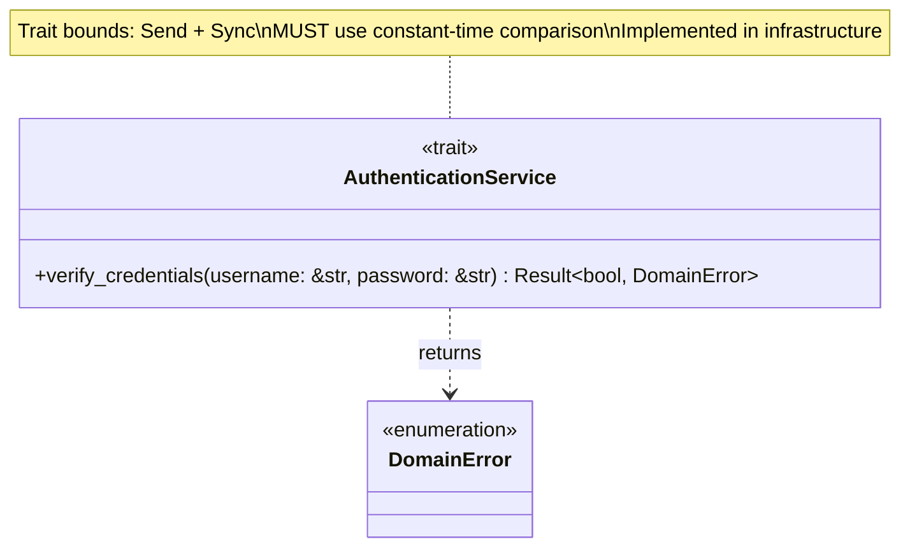
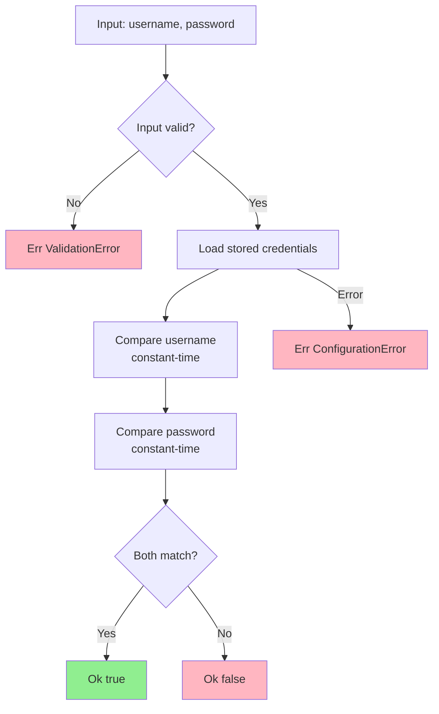
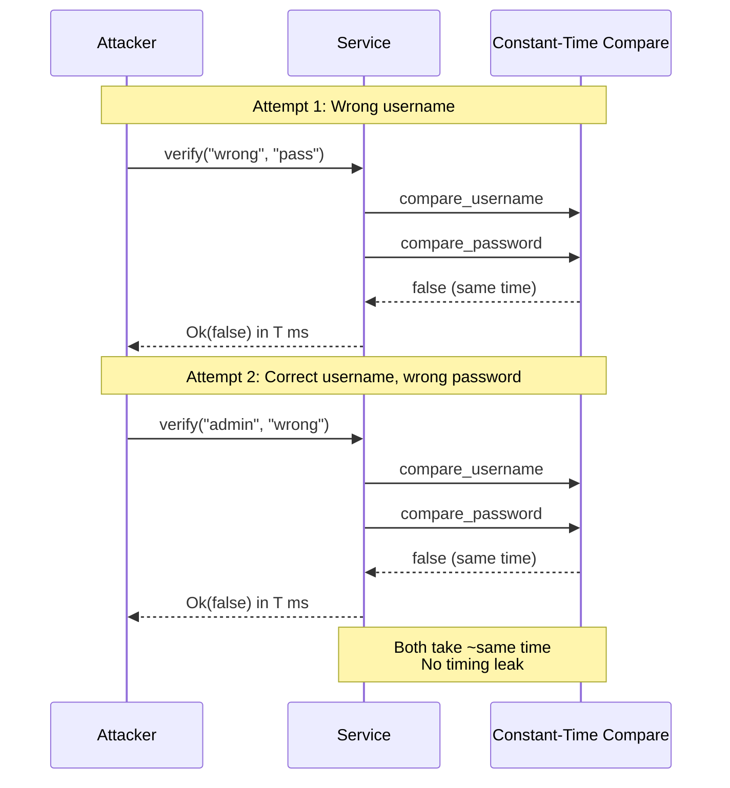
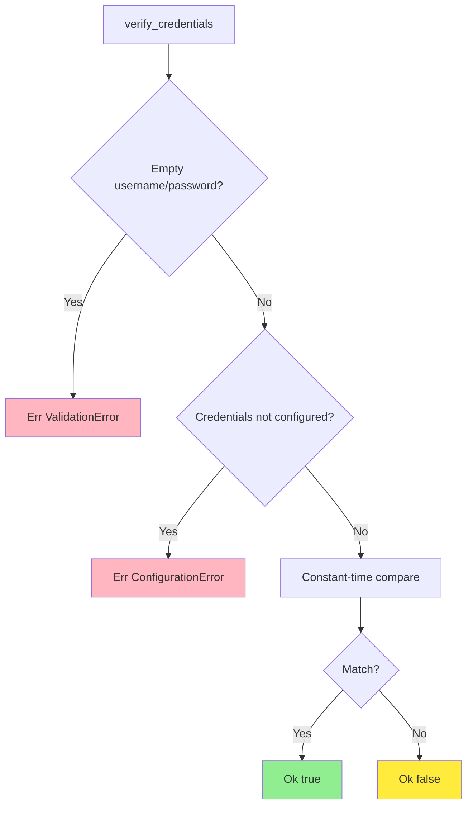
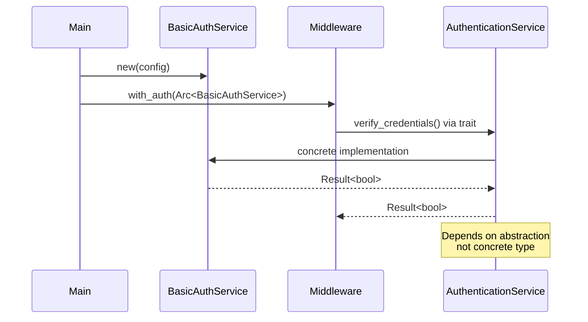

# AuthenticationService Trait Class Diagram

## Overview

The `AuthenticationService` trait defines the contract for credential verification with constant-time comparison requirements.

## Class Diagram

## Trait Definition

The AuthenticationService trait defines a single method verify_credentials that accepts username and password strings and returns a Result containing either a boolean (true for valid, false for invalid) or a DomainError if verification fails.

**Security Requirement:** Implementations MUST use constant-time comparison to prevent timing attacks. The comparison must always take the same amount of time regardless of whether credentials match or not.

The trait requires Send and Sync bounds to enable thread-safe usage in async contexts.

## Verification Flow

## Security Requirements

### Constant-Time Comparison

**CRITICAL**: Implementation MUST use constant-time comparison to prevent timing attacks.

### Timing Attack Mitigation

| Vulnerability | Mitigation |
|---------------|------------|
| **Early Return** | Always compare both username AND password |
| **Variable Time** | Use `subtle::ConstantTimeEq` for comparison |
| **Branch Timing** | No conditional early exit based on comparison |
| **Cache Timing** | Compare same-length strings (pad if needed) |

## Implementation Requirements

Implementations MUST:

1. **Constant-Time**: Use `subtle` crate or equivalent for comparison
2. **No Early Exit**: Always compare both username and password
3. **Thread Safety**: Implement `Send + Sync`
4. **Error Handling**: Return `Result`, never panic
5. **Secure Storage**: Store credentials securely (hashed in production)

## Error Cases

## Trait Bounds

| Bound | Purpose |
|-------|---------|
| Send | Can be transferred between threads |
| Sync | Can be shared between threads via Arc |

## Usage Patterns

### In Presentation Layer

Middleware extracts username and password from the HTTP request, then calls the authentication service's verify_credentials method. If the result is true, the request proceeds to the next handler. If false or an error occurs, an authentication error is returned to the client.

### In Infrastructure Layer

Concrete implementations like BasicAuthService store the expected username and password (or password hash). The verify_credentials method validates that inputs are non-empty, then performs constant-time comparison of both username and password using specialized cryptographic comparison functions. Both comparisons are always executed, and the results are combined with a logical AND operation to produce the final boolean result.

## Timing Attack Prevention

### Vulnerable Approach

A vulnerable implementation checks the username first and returns immediately if it doesn't match, then checks the password and returns immediately if it doesn't match. This early return pattern leaks timing information because failed username checks complete faster than failed password checks, allowing attackers to determine which credential is incorrect based on response time.

### Secure Approach

A secure implementation always performs both username and password comparisons using constant-time comparison functions, regardless of whether the username matches. The results are combined using a logical AND operation. This ensures the function always takes approximately the same amount of time, preventing timing-based information leakage.

## Dependency Injection

## Test Doubles

For testing purposes, a mock authentication service can be created that stores valid username and password values. The mock implements the AuthenticationService trait with the same constant-time comparison logic as production implementations. Test cases verify that the service returns true for matching credentials and false for non-matching credentials, ensuring the authentication logic works correctly in isolation.

## Design Rationale

- **Security First**: Constant-time requirement prevents timing attacks
- **Dependency Inversion**: Domain defines interface, infrastructure implements
- **Simplicity**: Single method covers all verification needs
- **Boolean Result**: `Ok(bool)` separates verification failure from system errors
- **Thread Safety**: `Send + Sync` enables async/concurrent use
- **Testability**: Easy to mock for testing authentication flows
