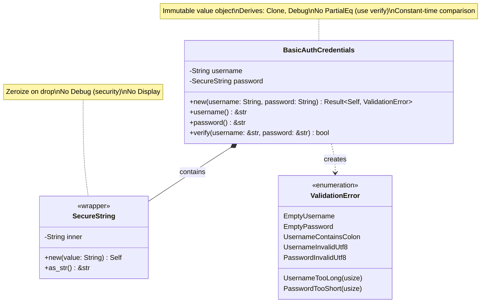
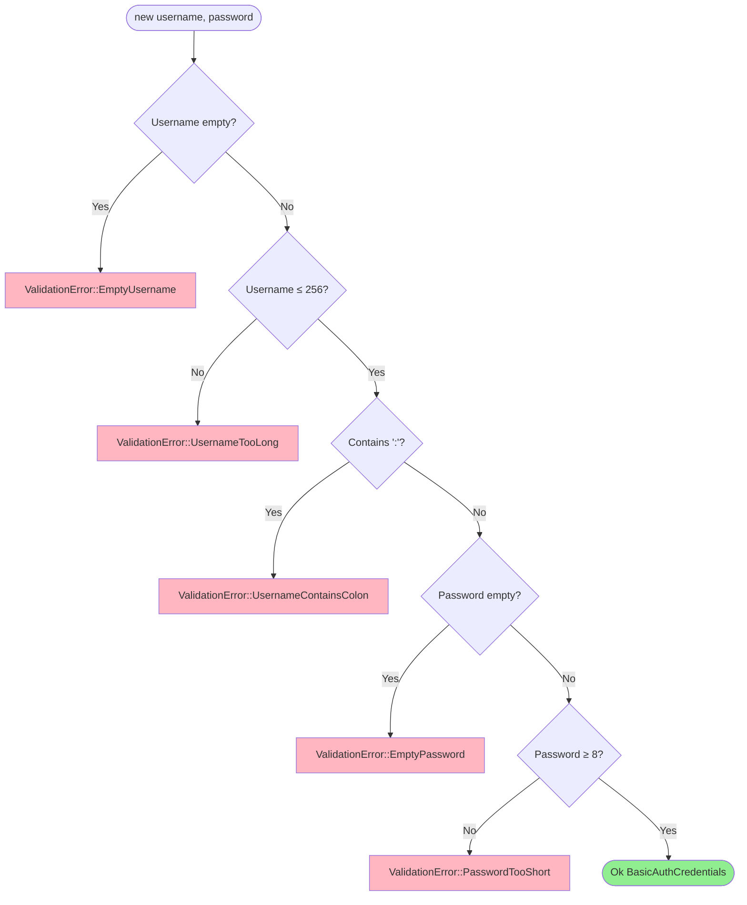
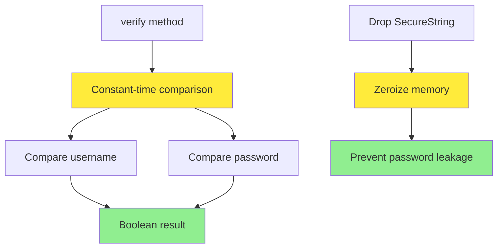
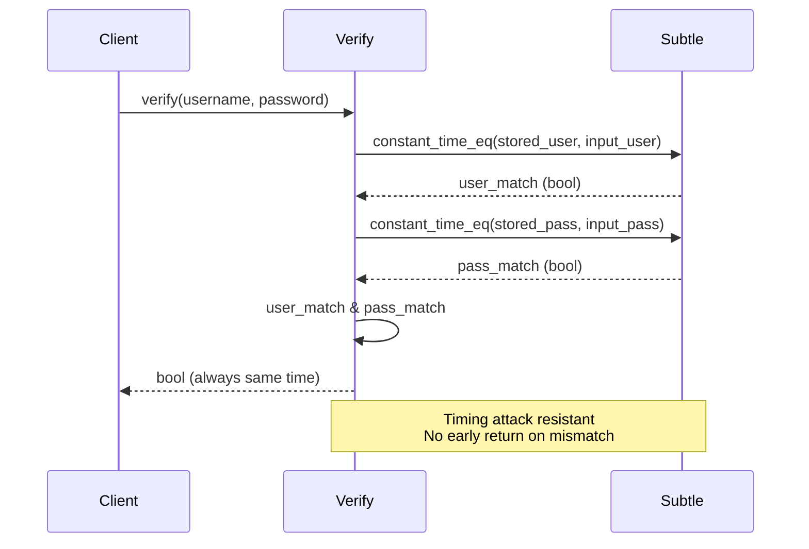

# Credentials Value Object Class Diagram

## Overview

The `BasicAuthCredentials` value object encapsulates username and password for HTTP Basic Authentication with validation.

## Class Diagram



## Validation Rules



## Properties

| Property | Type | Description |
|----------|------|-------------|
| `username` | `String` | Validated username |
| `password` | `SecureString` | Securely stored password |

## Methods

| Method | Parameters | Return Type | Description |
|--------|------------|-------------|-------------|
| `new` | `username: String, password: String` | `Result<Self, ValidationError>` | Constructor with validation |
| `username` | `&self` | `&str` | Get username (public info) |
| `password` | `&self` | `&str` | Get password (internal use only) |
| `verify` | `username: &str, password: &str` | `bool` | Constant-time credential verification |

## Invariants

1. Username is non-empty
2. Username is ≤ 256 characters
3. Username does not contain `:` (Basic Auth format)
4. Username is valid UTF-8
5. Password is non-empty
6. Password is ≥ 8 characters
7. Password is valid UTF-8
8. Immutable after construction

## Security Features



## Usage Example

```rust
// Valid credentials
let creds = BasicAuthCredentials::new(
    "admin".to_string(),
    "securepassword123".to_string()
)?;

// Verify credentials (constant-time)
assert!(creds.verify("admin", "securepassword123"));
assert!(!creds.verify("admin", "wrongpassword"));

// Invalid: empty username
let result = BasicAuthCredentials::new("".to_string(), "password".to_string());
assert!(matches!(result, Err(ValidationError::EmptyUsername)));

// Invalid: username contains colon
let result = BasicAuthCredentials::new("user:name".to_string(), "password".to_string());
assert!(matches!(result, Err(ValidationError::UsernameContainsColon)));

// Invalid: password too short
let result = BasicAuthCredentials::new("admin".to_string(), "pass".to_string());
assert!(matches!(result, Err(ValidationError::PasswordTooShort(4))));
```

## HTTP Basic Auth Format

```
Authorization: Basic base64(username:password)

Example:
  Username: admin
  Password: secret123
  
  Encoded: Basic YWRtaW46c2VjcmV0MTIz
  
  Decoded: admin:secret123
           └───┘ └──────┘
           user  password
           
Note: Username cannot contain ':' to avoid ambiguity
```

## Constant-Time Verification



## Security Considerations

| Threat | Mitigation |
|--------|------------|
| **Timing Attacks** | Constant-time comparison using `subtle` crate |
| **Memory Leakage** | `SecureString` zeroes memory on drop |
| **Format Confusion** | Forbid `:` in username (Basic Auth separator) |
| **Weak Passwords** | Minimum 8 character requirement |
| **Logging Leaks** | No `Display` trait, redacted `Debug` output |

## Design Rationale

- **HTTP Basic Auth**: Follows RFC 7617 format requirements
- **Security First**: Constant-time comparison prevents timing attacks
- **Memory Safety**: Password zeroization prevents post-use leakage
- **Type Safety**: Cannot accidentally log or display passwords
- **Validation**: Enforces security policies at construction
- **Value Object Pattern**: Immutable, self-validating, secure by default
