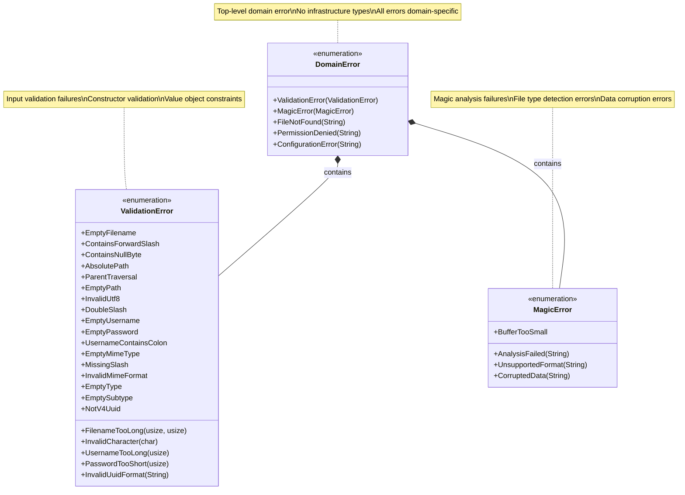
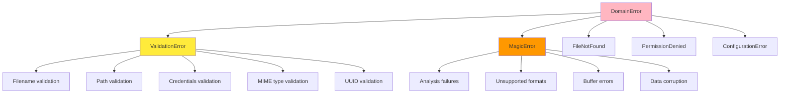
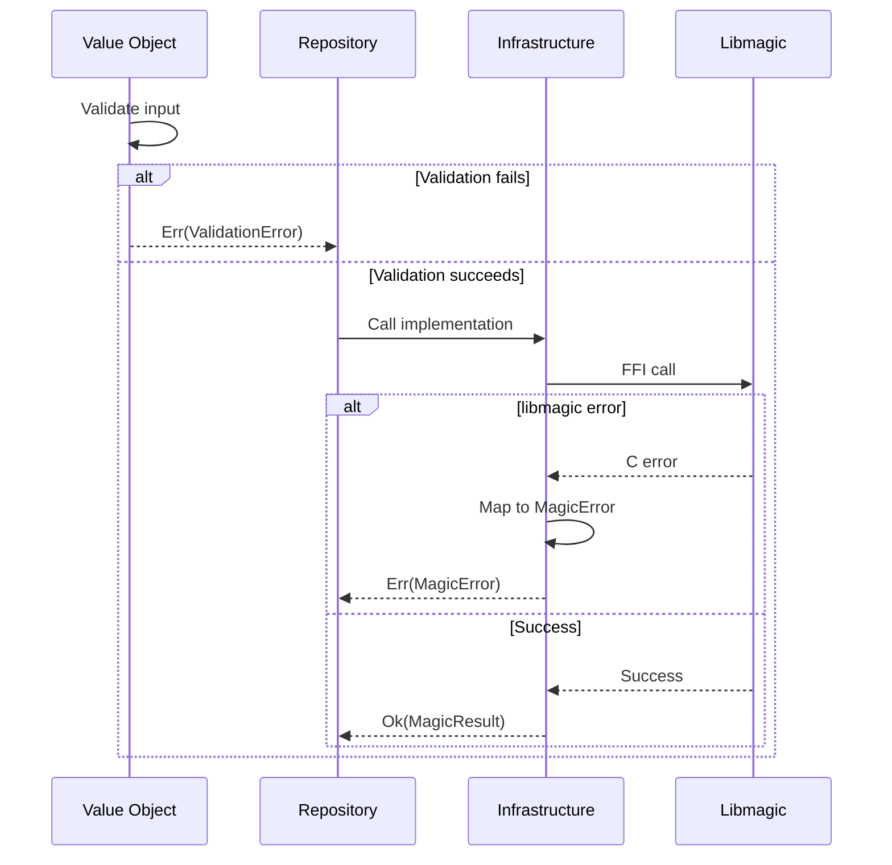
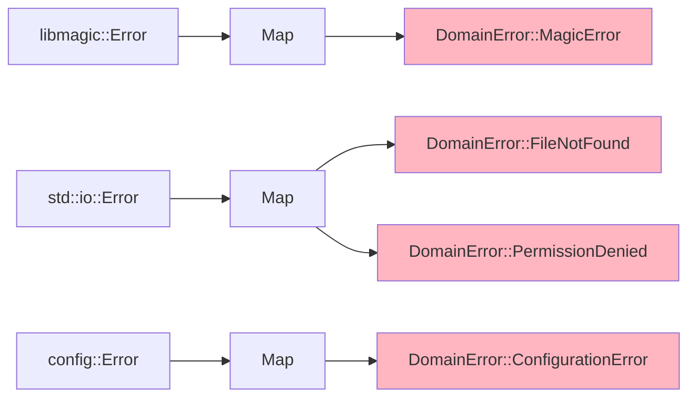

# Domain Errors Class Diagram

## Overview

Domain errors represent all possible failures within the domain layer, with no leakage of infrastructure implementation details.

## Class Diagram



## Error Hierarchy



## DomainError Variants

| Variant | Payload | Description | Use Case |
|---------|---------|-------------|----------|
| `ValidationError` | `ValidationError` | Input validation failed | Value object construction |
| `MagicError` | `MagicError` | Magic analysis failed | Repository operations |
| `FileNotFound` | `String` (path) | File doesn't exist | Path-based analysis |
| `PermissionDenied` | `String` (path) | Insufficient permissions | File access |
| `ConfigurationError` | `String` (message) | Invalid configuration | Service initialization |

## ValidationError Variants

### Filename Validation

| Variant | Payload | Constraint Violated |
|---------|---------|---------------------|
| `EmptyFilename` | - | Non-empty requirement |
| `FilenameTooLong` | `(actual, max)` | Max 310 characters |
| `ContainsForwardSlash` | - | No `/` allowed |
| `ContainsNullByte` | - | No `\0` allowed |
| `InvalidCharacter` | `char` | Invalid character found |

### Path Validation

| Variant | Payload | Constraint Violated |
|---------|---------|---------------------|
| `AbsolutePath` | - | Must be relative |
| `ParentTraversal` | - | No `..` allowed |
| `EmptyPath` | - | Non-empty requirement |
| `InvalidUtf8` | - | Valid UTF-8 required |
| `DoubleSlash` | - | No `//` allowed |

### Credentials Validation

| Variant | Payload | Constraint Violated |
|---------|---------|---------------------|
| `EmptyUsername` | - | Non-empty requirement |
| `EmptyPassword` | - | Non-empty requirement |
| `UsernameTooLong` | `usize` (length) | Max 256 characters |
| `PasswordTooShort` | `usize` (length) | Min 8 characters |
| `UsernameContainsColon` | - | No `:` in username |

### MIME Type Validation

| Variant | Payload | Constraint Violated |
|---------|---------|---------------------|
| `EmptyMimeType` | - | Non-empty requirement |
| `MissingSlash` | - | Must contain `/` |
| `InvalidMimeFormat` | - | RFC 6838 compliance |
| `EmptyType` | - | Type part non-empty |
| `EmptySubtype` | - | Subtype part non-empty |

### UUID Validation

| Variant | Payload | Constraint Violated |
|---------|---------|---------------------|
| `InvalidUuidFormat` | `String` (input) | Valid UUID format |
| `NotV4Uuid` | - | Must be UUID v4 |

## MagicError Variants

| Variant | Payload | Description | Recovery |
|---------|---------|-------------|----------|
| `AnalysisFailed` | `String` (reason) | libmagic analysis failed | None |
| `UnsupportedFormat` | `String` (format) | File format not recognized | None |
| `BufferTooSmall` | - | Insufficient data for analysis | Provide more data |
| `CorruptedData` | `String` (reason) | File data is corrupted | None |

## Error Flow



## Error Mapping

Infrastructure errors are mapped to domain errors at the boundary:



## Usage Example

```rust
// Value object validation
let filename = WindowsCompatibleFilename::new("a".repeat(311))
    .map_err(|e| DomainError::ValidationError(e))?;

// Repository operation
let result = repository.analyze_buffer(data, &filename)
    .map_err(|e| match e {
        DomainError::MagicError(magic_err) => {
            log::error!("Magic analysis failed: {:?}", magic_err);
            e
        },
        DomainError::ValidationError(val_err) => {
            log::warn!("Invalid input: {:?}", val_err);
            e
        },
        _ => e,
    })?;

// Error handling in application layer
match use_case.execute(request) {
    Ok(response) => Ok(response),
    Err(DomainError::ValidationError(e)) => {
        Err(ApplicationError::BadRequest(format!("Invalid input: {}", e)))
    },
    Err(DomainError::FileNotFound(path)) => {
        Err(ApplicationError::NotFound(format!("File not found: {}", path)))
    },
    Err(DomainError::PermissionDenied(path)) => {
        Err(ApplicationError::Forbidden(format!("Access denied: {}", path)))
    },
    Err(e) => {
        Err(ApplicationError::InternalError(format!("Unexpected error: {:?}", e)))
    },
}
```

## Trait Implementations

```rust
impl std::fmt::Display for DomainError {
    fn fmt(&self, f: &mut std::fmt::Formatter<'_>) -> std::fmt::Result {
        match self {
            DomainError::ValidationError(e) => write!(f, "Validation error: {}", e),
            DomainError::MagicError(e) => write!(f, "Magic analysis error: {}", e),
            DomainError::FileNotFound(path) => write!(f, "File not found: {}", path),
            DomainError::PermissionDenied(path) => write!(f, "Permission denied: {}", path),
            DomainError::ConfigurationError(msg) => write!(f, "Configuration error: {}", msg),
        }
    }
}

impl std::error::Error for DomainError {}
```

## Error Conversion

```rust
impl From<ValidationError> for DomainError {
    fn from(err: ValidationError) -> Self {
        DomainError::ValidationError(err)
    }
}

impl From<MagicError> for DomainError {
    fn from(err: MagicError) -> Self {
        DomainError::MagicError(err)
    }
}
```

## Design Rationale

- **No Infrastructure Leakage**: Domain errors contain no `std::io::Error`, `sqlx::Error`, etc.
- **Semantic Errors**: Each error variant has domain meaning, not technical details
- **Comprehensive**: Covers all domain-level failure modes
- **Composable**: Hierarchical structure (top-level → specific)
- **Mappable**: Easy to convert from infrastructure errors at boundary
- **Type Safety**: Compile-time guarantee of proper error handling
