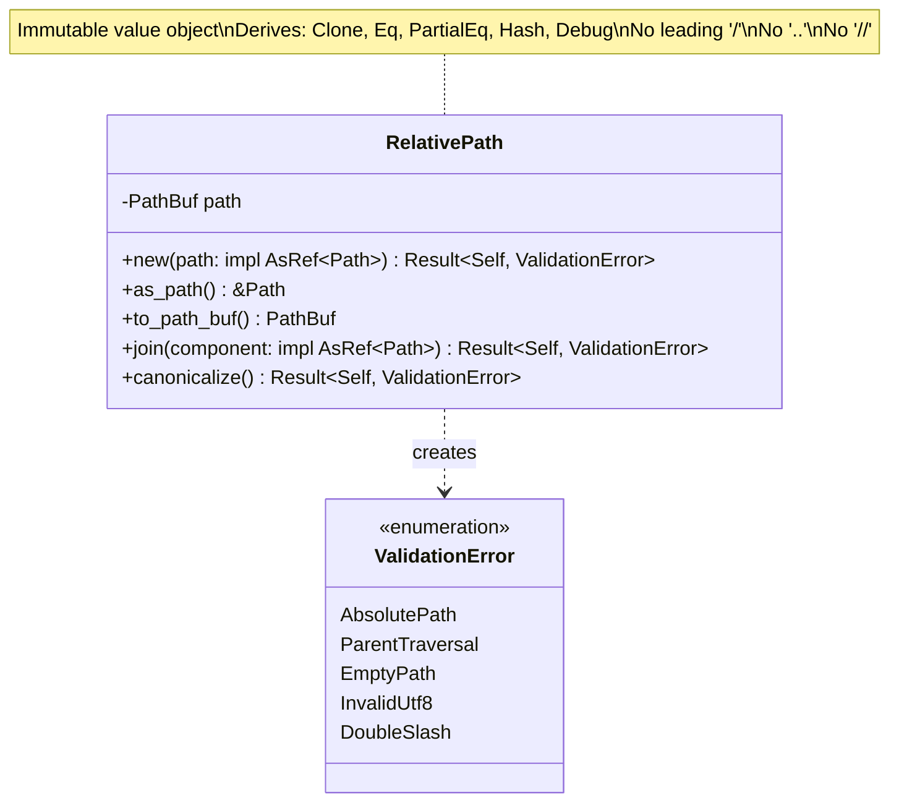
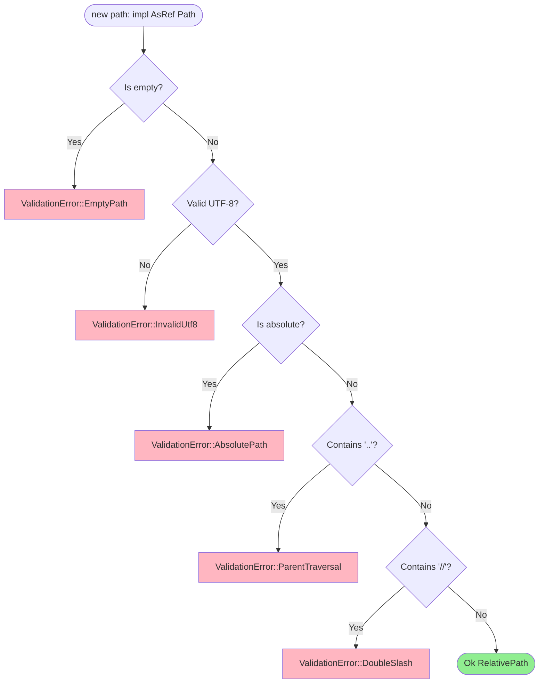
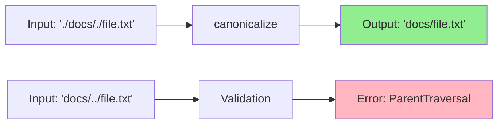

# FilePath Value Object Class Diagram

## Overview

The `RelativePath` value object ensures file paths are relative, normalized, and safe from traversal attacks.

## Class Diagram



## Validation Rules



## Properties

| Property | Type | Description |
|----------|------|-------------|
| `path` | `PathBuf` | Validated relative path |

## Methods

| Method | Parameters | Return Type | Description |
|--------|------------|-------------|-------------|
| `new` | `path: impl AsRef<Path>` | `Result<Self, ValidationError>` | Constructor with validation |
| `as_path` | `&self` | `&Path` | Borrow as Path reference |
| `to_path_buf` | `&self` | `PathBuf` | Clone as PathBuf |
| `join` | `component: impl AsRef<Path>` | `Result<Self, ValidationError>` | Join with another component, re-validate |
| `canonicalize` | `&self` | `Result<Self, ValidationError>` | Normalize path (resolve `.`, ensure relative) |

## Invariants

1. Never empty
2. Always relative (no leading `/`)
3. No parent directory traversal (`..`)
4. No double slashes (`//`)
5. Valid UTF-8 encoding
6. Immutable after construction

## Usage Example

```rust
// Valid relative path
let path = RelativePath::new("documents/report.pdf")?;
assert_eq!(path.as_path(), Path::new("documents/report.pdf"));

// Invalid: absolute path
let result = RelativePath::new("/etc/passwd");
assert!(matches!(result, Err(ValidationError::AbsolutePath)));

// Invalid: parent traversal
let result = RelativePath::new("../etc/passwd");
assert!(matches!(result, Err(ValidationError::ParentTraversal)));

// Join operation
let base = RelativePath::new("documents")?;
let full = base.join("report.pdf")?;
assert_eq!(full.as_path(), Path::new("documents/report.pdf"));
```

## Path Normalization



## Design Rationale

- **Security**: Prevents directory traversal attacks through multiple validation layers
- **Normalization**: Removes redundant path components (`.`, trailing slashes)
- **Type Safety**: Compile-time guarantee that paths are validated before use
- **Cross-Platform**: Uses `PathBuf` for platform-agnostic path handling
- **Value Object Pattern**: Immutable, self-validating, comparable by value
