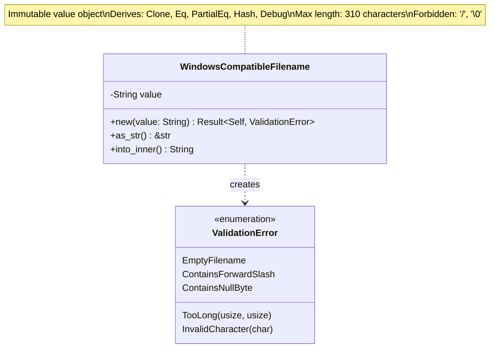
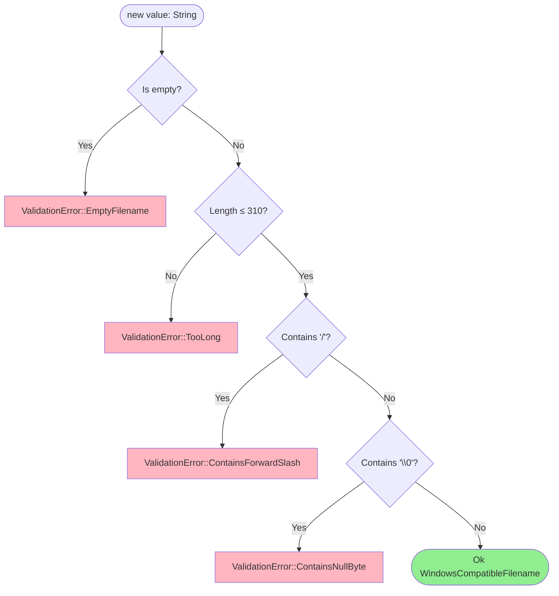

# Filename Value Object Class Diagram <!-- omit in toc -->

- [Overview](#overview)
- [Class Diagram](#class-diagram)
- [Validation Rules](#validation-rules)
- [Properties](#properties)
- [Methods](#methods)
- [Invariants](#invariants)
- [Usage Scenarios](#usage-scenarios)
  - [Valid Filename](#valid-filename)
  - [Invalid Scenarios](#invalid-scenarios)
- [Design Rationale](#design-rationale)

---

## Overview

The `WindowsCompatibleFilename` value object ensures filenames meet Windows compatibility requirements and security constraints.

## Class Diagram

## Validation Rules

## Properties

| Property | Type | Description |
|----------|------|-------------|
| `value` | `String` | Validated filename string |

## Methods

| Method | Parameters | Return Type | Description |
|--------|------------|-------------|-------------|
| `new` | `value: String` | `Result<Self, ValidationError>` | Constructor with validation |
| `as_str` | `&self` | `&str` | Borrow as string slice |
| `into_inner` | `self` | `String` | Consume and return inner string |

## Invariants

1. Never empty
2. Maximum 310 characters (Windows MAX_PATH - 5 for drive + `\\?\`)
3. No forward slash `/` (path separator)
4. No null byte `\0` (C string terminator)
5. Immutable after construction

## Usage Scenarios

### Valid Filename

When constructing WindowsCompatibleFilename with a valid filename like "document.pdf", the value object is successfully created and the filename can be retrieved as a string slice.

### Invalid Scenarios

**Filename Too Long:** Construction fails with TooLong validation error when the filename exceeds 310 characters. For example, a filename with 311 'a' characters would fail validation.

**Contains Forward Slash:** Construction fails with ContainsForwardSlash validation error when the filename contains a forward slash character, such as "path/to/file.txt", as this would represent a path rather than a simple filename.

## Design Rationale

- **Windows Compatibility**: Ensures filenames work across platforms, using Windows as strictest constraint
- **Security**: Prevents path traversal by rejecting slashes
- **Safety**: Rejects null bytes that could truncate C strings in FFI calls
- **Value Object Pattern**: Immutable, comparable by value, self-validating
