# Filename Value Object Class Diagram

## Overview

The `WindowsCompatibleFilename` value object ensures filenames meet Windows compatibility requirements and security constraints.

## Class Diagram


## Validation Rules

```mermaid
flowchart TD
    Start([new value: String]) --> CheckEmpty{Is empty?}
    CheckEmpty -->|Yes| ErrEmpty[ValidationError::EmptyFilename]
    CheckEmpty -->|No| CheckLength{Length ≤ 310?}
    CheckLength -->|No| ErrTooLong[ValidationError::TooLong]
    CheckLength -->|Yes| CheckSlash{Contains '/'?}
    CheckSlash -->|Yes| ErrSlash[ValidationError::ContainsForwardSlash]
    CheckSlash -->|No| CheckNull{Contains '\\0'?}
    CheckNull -->|Yes| ErrNull[ValidationError::ContainsNullByte]
    CheckNull -->|No| Success([Ok WindowsCompatibleFilename])
    
    style Success fill:#90EE90
    style ErrEmpty fill:#FFB6C1
    style ErrTooLong fill:#FFB6C1
    style ErrSlash fill:#FFB6C1
    style ErrNull fill:#FFB6C1
```



## Properties

| Property | Type | Description |
|----------|------|-------------|
| `value` | `String` | Validated filename string |

## Methods

| Method | Parameters | Return Type | Description |
|--------|------------|-------------|-------------|
| `new` | `value: String` | `Result<Self, ValidationError>` | Constructor with validation |
| `as_str` | `&self` | `&str` | Borrow as string slice |
| `into_inner` | `self` | `String` | Consume and return inner string |

## Invariants

1. Never empty
2. Maximum 310 characters (Windows MAX_PATH - 5 for drive + `\\?\`)
3. No forward slash `/` (path separator)
4. No null byte `\0` (C string terminator)
5. Immutable after construction

## Usage Example

```rust
// Valid filename
let filename = WindowsCompatibleFilename::new("document.pdf".to_string())?;
assert_eq!(filename.as_str(), "document.pdf");

// Invalid: too long
let long = "a".repeat(311);
let result = WindowsCompatibleFilename::new(long);
assert!(matches!(result, Err(ValidationError::TooLong(311, 310))));

// Invalid: contains slash
let result = WindowsCompatibleFilename::new("path/to/file.txt".to_string());
assert!(matches!(result, Err(ValidationError::ContainsForwardSlash)));
```

## Design Rationale

- **Windows Compatibility**: Ensures filenames work across platforms, using Windows as strictest constraint
- **Security**: Prevents path traversal by rejecting slashes
- **Safety**: Rejects null bytes that could truncate C strings in FFI calls
- **Value Object Pattern**: Immutable, comparable by value, self-validating
