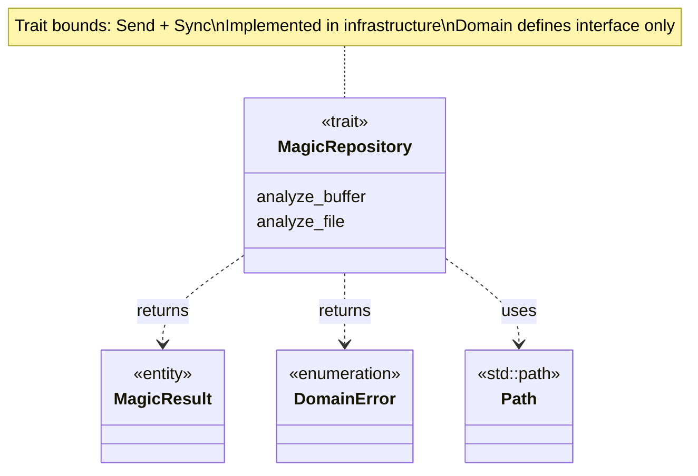
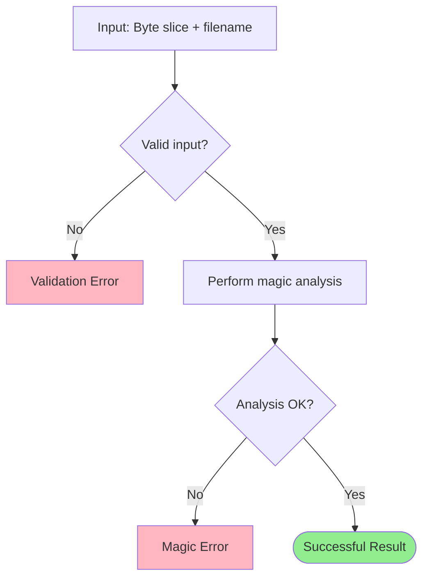
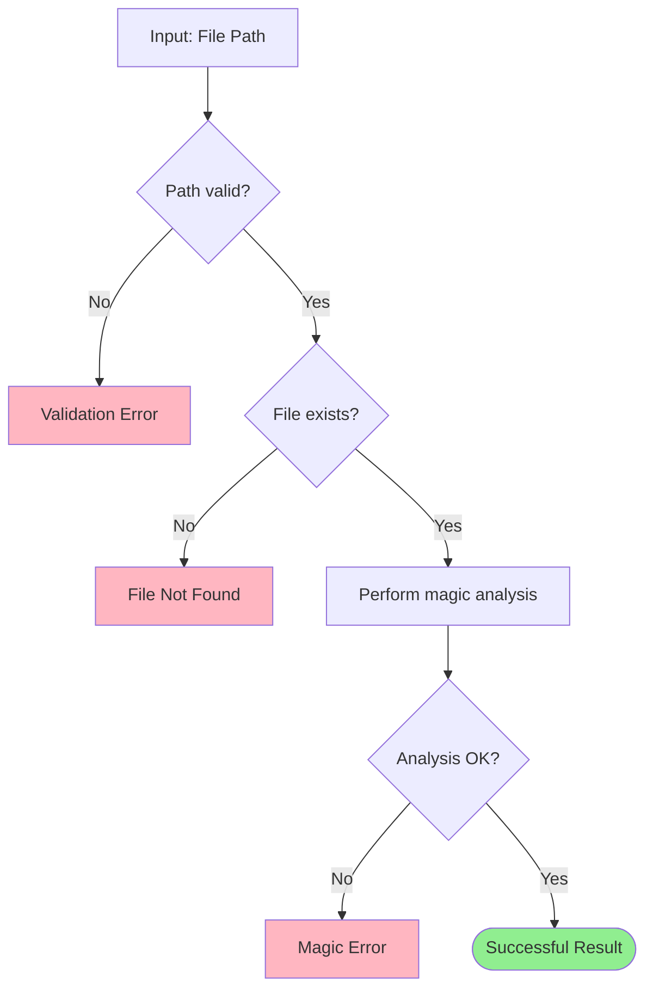
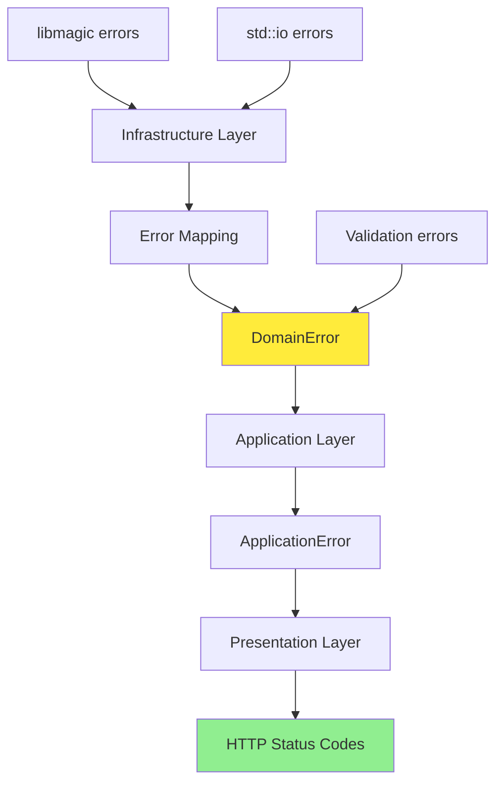
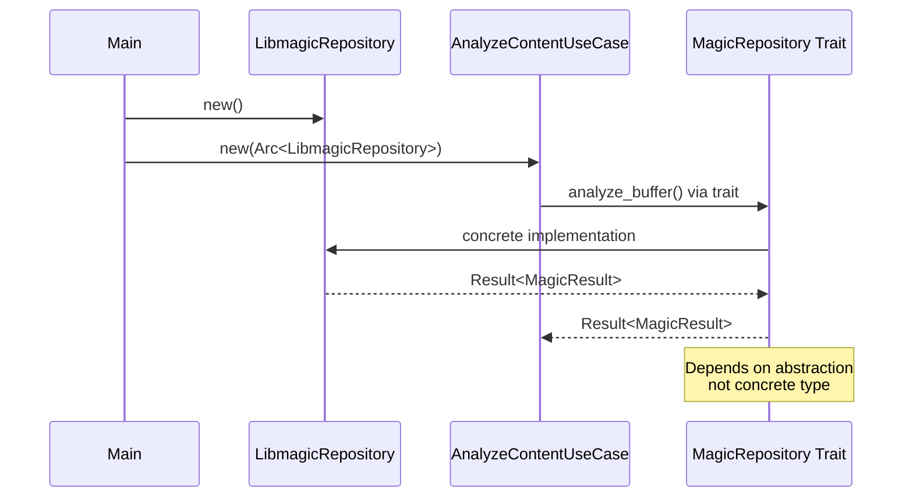

# MagicRepository Trait Class Diagram <!-- omit in toc -->

- [Overview](#overview)
- [Class Diagram](#class-diagram)
- [Trait Definition](#trait-definition)
- [Method Specifications](#method-specifications)
  - [analyze_buffer](#analyze_buffer)
  - [analyze_file](#analyze_file)
- [Error Mapping](#error-mapping)
- [Implementation Requirements](#implementation-requirements)
- [Trait Bounds](#trait-bounds)
- [Usage Patterns](#usage-patterns)
  - [In Application Layer](#in-application-layer)
  - [In Infrastructure Layer](#in-infrastructure-layer)
- [Dependency Injection](#dependency-injection)
- [Design Rationale](#design-rationale)

---

## Overview

The `MagicRepository` trait defines the contract for file magic analysis operations. Implementations exist in the infrastructure layer.

## Class Diagram

## Trait Definition

The MagicRepository trait defines two methods for file magic analysis. The analyze_buffer method accepts a byte slice and filename, returning either a MagicResult or DomainError. The analyze_file method accepts a Path reference and returns the same result type. Both methods require Send and Sync trait bounds to enable thread-safe usage in async contexts.

## Method Specifications

### analyze_buffer

Analyzes binary data from any source (memory, mmap, static).

**Parameters:**
- data: Byte slice from any source (memory, mmap, network)
- filename: Original filename for context (libmagic uses this)

**Returns:**
- Successful Result: Analysis successful
- Validation Error: Invalid input (empty data, invalid filename)
- Magic Error: Analysis failed (libmagic error)

**Accepts data from:**

| Source Type | Example | Compatible |
|-------------|---------|------------|
| In-Memory Buffer | Buffer from memory | ✅ |
| Memory-Mapped File | Slice from mapped file | ✅ |
| Static Data | Constant array | ✅ |
| Network Buffer | HTTP request body | ✅ |

### analyze_file

Analyzes file by filesystem path (libmagic opens file internally).

**Parameters:**
- path: Absolute path to file (must be within sandbox)

**Returns:**
- Successful Result: Analysis successful
- Validation Error: Invalid path
- File Not Found: File doesn't exist
- Magic Error: Analysis failed

## Error Mapping

## Implementation Requirements

Implementations MUST:

1. **Thread Safety**: Implement `Send + Sync` for multi-threaded async runtime
2. **Error Mapping**: Convert all infrastructure errors to `DomainError`
3. **Validation**: Validate inputs before calling external dependencies
4. **No Panics**: Return `Result` for all error conditions
5. **Idempotency**: Same input produces same output (deterministic)

## Trait Bounds

| Bound | Purpose |
|-------|---------|
| Send | Enables transfer between threads |
| Sync | Enables sharing between threads via Arc |

These bounds are required for Tokio async runtime and Axum state sharing, ensuring the repository can be safely used in concurrent contexts.

## Usage Patterns

### In Application Layer

Use cases depend on the MagicRepository trait through generic type parameters or trait objects wrapped in Arc. The use case calls repository methods and maps domain errors to application errors.

### In Infrastructure Layer

Concrete implementations like LibmagicRepository implement the MagicRepository trait. The implementation holds the necessary state (such as a libmagic cookie handle) and provides concrete logic for both analyze_buffer and analyze_file methods using libmagic FFI bindings.

## Dependency Injection

## Design Rationale

- **Dependency Inversion**: Domain defines interface, infrastructure implements
- **Testability**: Easy to mock in tests (trait object or generic)
- **Unified Interface**: Single `&[u8]` parameter handles all buffer sources
- **Error Abstraction**: Domain errors hide infrastructure details
- **Thread Safety**: `Send + Sync` enables async/parallel execution
- **Simplicity**: Two methods cover all use cases (buffer vs file)
