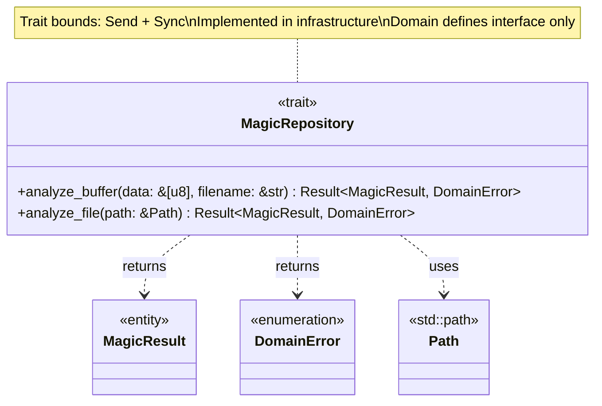
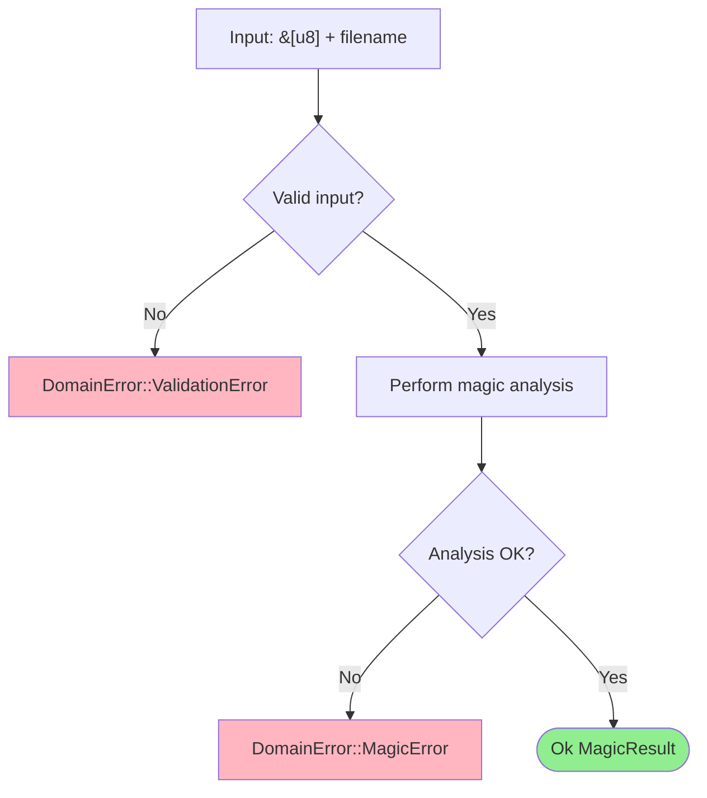
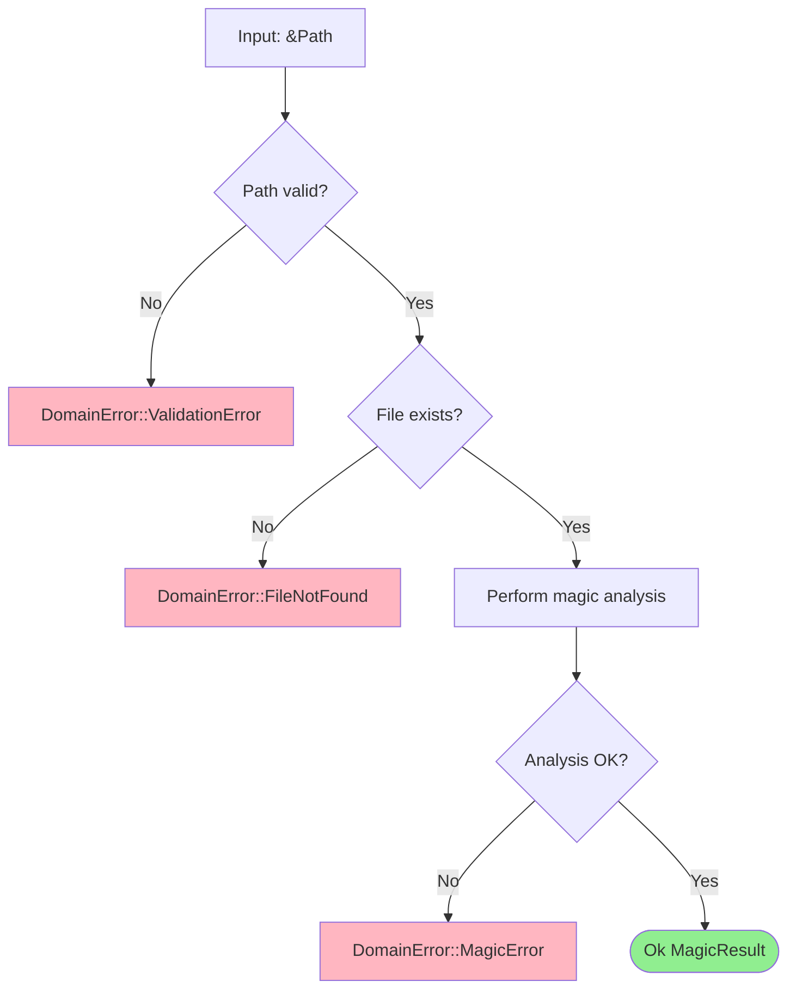
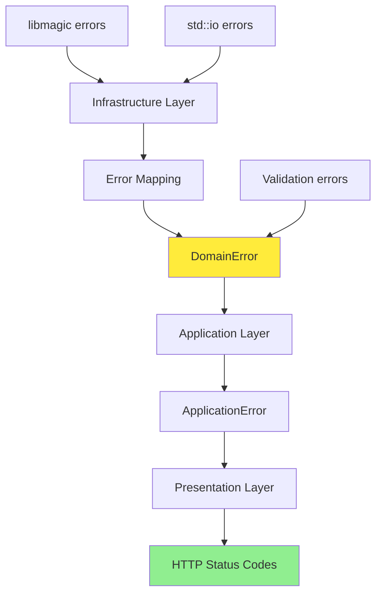
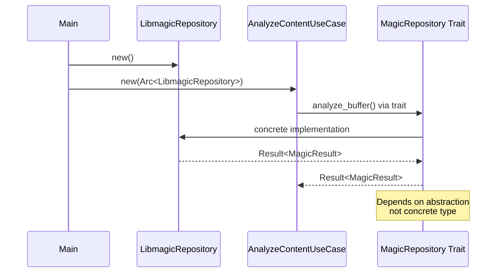

# MagicRepository Trait Class Diagram

## Overview

The `MagicRepository` trait defines the contract for file magic analysis operations. Implementations exist in the infrastructure layer.

## Class Diagram



## Trait Definition

```rust
pub trait MagicRepository: Send + Sync {
    fn analyze_buffer(
        &self,
        data: &[u8],
        filename: &str,
    ) -> Result<MagicResult, DomainError>;
    
    fn analyze_file(
        &self,
        path: &Path,
    ) -> Result<MagicResult, DomainError>;
}
```

## Method Specifications

### analyze_buffer

Analyzes binary data from any source (memory, mmap, static).



**Parameters:**
- `data: &[u8]` - Byte slice from any source (memory, mmap, network)
- `filename: &str` - Original filename for context (libmagic uses this)

**Returns:**
- `Ok(MagicResult)` - Analysis successful
- `Err(DomainError::ValidationError)` - Invalid input (empty data, invalid filename)
- `Err(DomainError::MagicError)` - Analysis failed (libmagic error)

**Accepts data from:**

| Source Type | Example | Compatible |
|-------------|---------|------------|
| In-Memory Buffer | `Vec<u8>`, `Bytes` | ✅ |
| Memory-Mapped File | `Mmap::as_ref()` | ✅ |
| Static Data | `&[u8; N]` | ✅ |
| Network Buffer | HTTP request body | ✅ |

### analyze_file

Analyzes file by filesystem path (libmagic opens file internally).



**Parameters:**
- `path: &Path` - Absolute path to file (must be within sandbox)

**Returns:**
- `Ok(MagicResult)` - Analysis successful
- `Err(DomainError::ValidationError)` - Invalid path
- `Err(DomainError::FileNotFound)` - File doesn't exist
- `Err(DomainError::MagicError)` - Analysis failed

## Error Mapping



## Implementation Requirements

Implementations MUST:

1. **Thread Safety**: Implement `Send + Sync` for multi-threaded async runtime
2. **Error Mapping**: Convert all infrastructure errors to `DomainError`
3. **Validation**: Validate inputs before calling external dependencies
4. **No Panics**: Return `Result` for all error conditions
5. **Idempotency**: Same input produces same output (deterministic)

## Trait Bounds

```rust
pub trait MagicRepository: Send + Sync {
    // Methods...
}
```

| Bound | Purpose |
|-------|---------|
| `Send` | Can be transferred between threads |
| `Sync` | Can be shared between threads (via `Arc`) |

Required for Tokio async runtime and Axum state sharing.

## Usage Example

```rust
// In application layer (use case)
pub struct AnalyzeContentUseCase<R: MagicRepository> {
    repository: Arc<R>,
}

impl<R: MagicRepository> AnalyzeContentUseCase<R> {
    pub fn execute(&self, data: &[u8], filename: &str) -> Result<MagicResult, ApplicationError> {
        self.repository
            .analyze_buffer(data, filename)
            .map_err(ApplicationError::from)
    }
}

// In infrastructure layer (implementation)
pub struct LibmagicRepository {
    cookie: Cookie,
}

impl MagicRepository for LibmagicRepository {
    fn analyze_buffer(&self, data: &[u8], filename: &str) -> Result<MagicResult, DomainError> {
        // Implementation using libmagic FFI
    }
    
    fn analyze_file(&self, path: &Path) -> Result<MagicResult, DomainError> {
        // Implementation using libmagic FFI
    }
}
```

## Dependency Injection



## Design Rationale

- **Dependency Inversion**: Domain defines interface, infrastructure implements
- **Testability**: Easy to mock in tests (trait object or generic)
- **Unified Interface**: Single `&[u8]` parameter handles all buffer sources
- **Error Abstraction**: Domain errors hide infrastructure details
- **Thread Safety**: `Send + Sync` enables async/parallel execution
- **Simplicity**: Two methods cover all use cases (buffer vs file)
