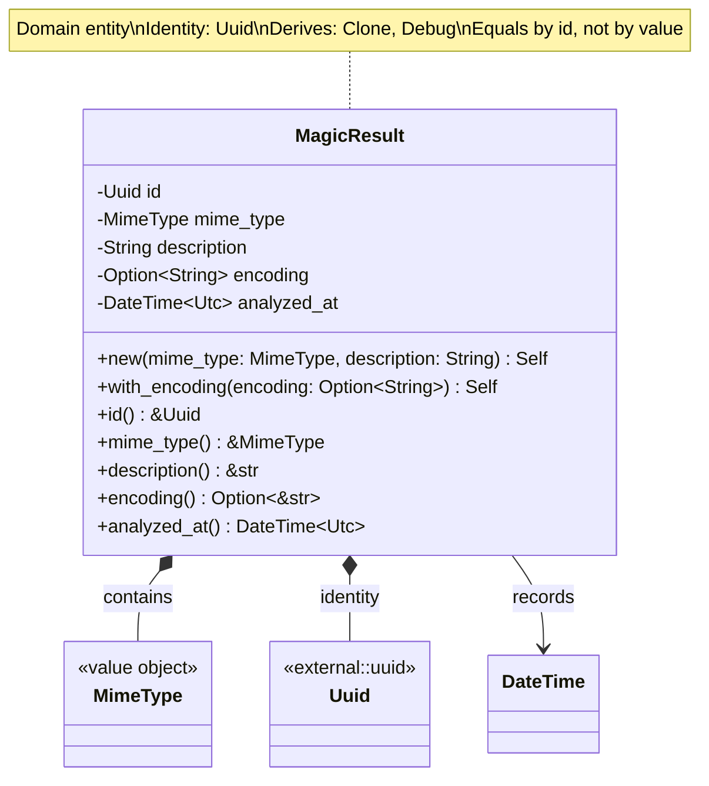
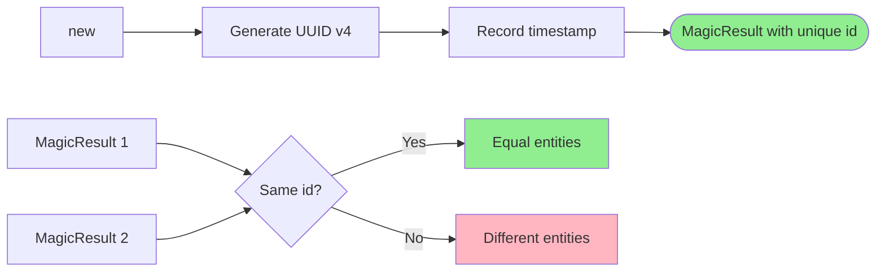
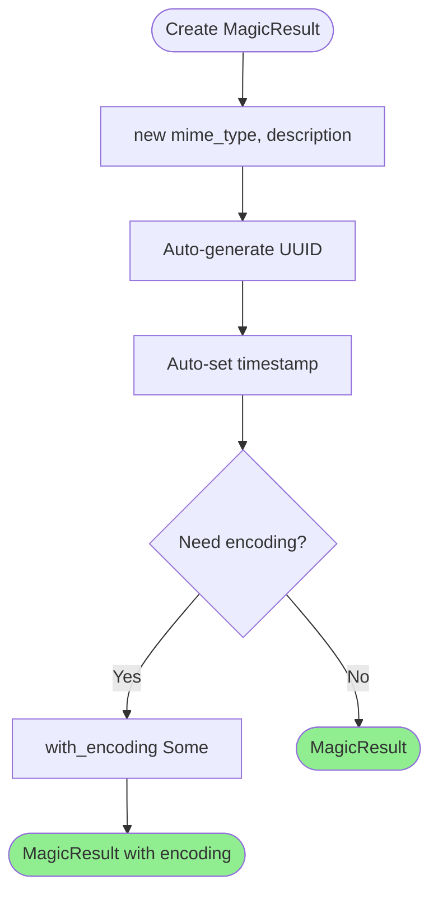
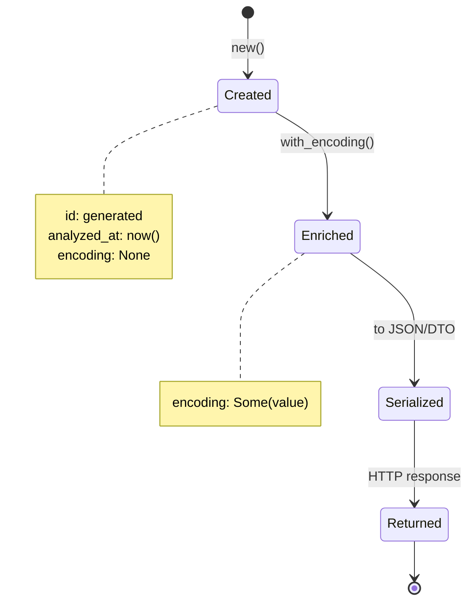

# MagicResult Entity Class Diagram <!-- omit in toc -->

- [Overview](#overview)
- [Class Diagram](#class-diagram)
- [Entity Identity](#entity-identity)
- [Properties](#properties)
- [Methods](#methods)
- [Construction Pattern](#construction-pattern)
- [Invariants](#invariants)
- [Usage Scenarios](#usage-scenarios)
  - [Create Basic Result](#create-basic-result)
  - [Create Result with Encoding](#create-result-with-encoding)
  - [Entity Identity](#entity-identity-1)
- [Entity Lifecycle](#entity-lifecycle)
- [Equality Semantics](#equality-semantics)
- [Sample Data](#sample-data)
- [Design Rationale](#design-rationale)

---

## Overview

The `MagicResult` entity represents the outcome of file magic analysis, containing file type identification and metadata.

## Class Diagram

## Entity Identity

## Properties

| Property | Type | Required | Description |
|----------|------|----------|-------------|
| `id` | `Uuid` | Yes | Unique entity identity (UUID v4) |
| `mime_type` | `MimeType` | Yes | Detected MIME type |
| `description` | `String` | Yes | Human-readable file type description |
| `encoding` | `Option<String>` | No | Character encoding (for text files) |
| `analyzed_at` | `DateTime<Utc>` | Yes | UTC timestamp of analysis |

## Methods

| Method | Parameters | Return Type | Description |
|--------|------------|-------------|-------------|
| `new` | `mime_type: MimeType, description: String` | `Self` | Create new result with generated ID |
| `with_encoding` | `self, encoding: Option<String>` | `Self` | Builder pattern: set encoding |
| `id` | `&self` | `&Uuid` | Get unique identifier |
| `mime_type` | `&self` | `&MimeType` | Get detected MIME type |
| `description` | `&self` | `&str` | Get type description |
| `encoding` | `&self` | `Option<&str>` | Get character encoding if present |
| `analyzed_at` | `&self` | `DateTime<Utc>` | Get analysis timestamp |

## Construction Pattern

## Invariants

1. `id` is always unique (UUID v4)
2. `mime_type` is always valid (value object guarantee)
3. `description` is never empty
4. `analyzed_at` is set at construction (immutable)
5. Entities are equal if and only if their `id` is equal

## Usage Scenarios

### Create Basic Result

When constructing a MagicResult with a MIME type like "text/plain" and description "ASCII text", the entity is successfully created with an automatically generated unique identifier and timestamp. The description can be retrieved from the entity.

### Create Result with Encoding

When constructing a MagicResult for a text file like HTML, the encoding can be optionally set using the with_encoding builder method. For example, creating a result for "HTML document" and then setting encoding to "utf-8" produces an entity with both description and encoding information.

### Entity Identity

When creating two MagicResult entities with identical MIME type and description (such as "Text file"), each entity receives a different unique identifier. This demonstrates that entities are distinguished by identity rather than by their attribute values. Two results with the same data are considered different entities because they have different IDs.

## Entity Lifecycle

## Equality Semantics

MagicResult entities implement equality comparison based solely on their unique identifier. Two MagicResult entities are considered equal if and only if they have the same ID value. The comparison ignores all other fields including MIME type, description, encoding, and timestamp. This identity-based equality is a fundamental characteristic of the entity pattern, distinguishing entities from value objects which compare all fields.

## Sample Data

| MIME Type | Description | Encoding | Use Case |
|-----------|-------------|----------|----------|
| `text/plain` | ASCII text | `us-ascii` | Plain text files |
| `text/plain` | UTF-8 Unicode text | `utf-8` | Modern text documents |
| `application/pdf` | PDF document | None | PDF files |
| `image/jpeg` | JPEG image data | None | JPEG images |
| `application/zip` | Zip archive data | None | ZIP archives |
| `text/html` | HTML document | `utf-8` | Web pages |
| `application/json` | JSON data | `utf-8` | API responses |

## Design Rationale

- **Entity Pattern**: Has identity (`id`), distinguished from value objects
- **Immutability**: All fields are immutable after construction (builder pattern for optional fields)
- **Identity Equality**: Two results are equal iff they have the same `id`
- **Timestamp**: Records when analysis occurred for auditing/caching
- **Builder Pattern**: Fluent API for optional fields (`with_encoding`)
- **Domain Focus**: No persistence or serialization concerns (pure domain)
