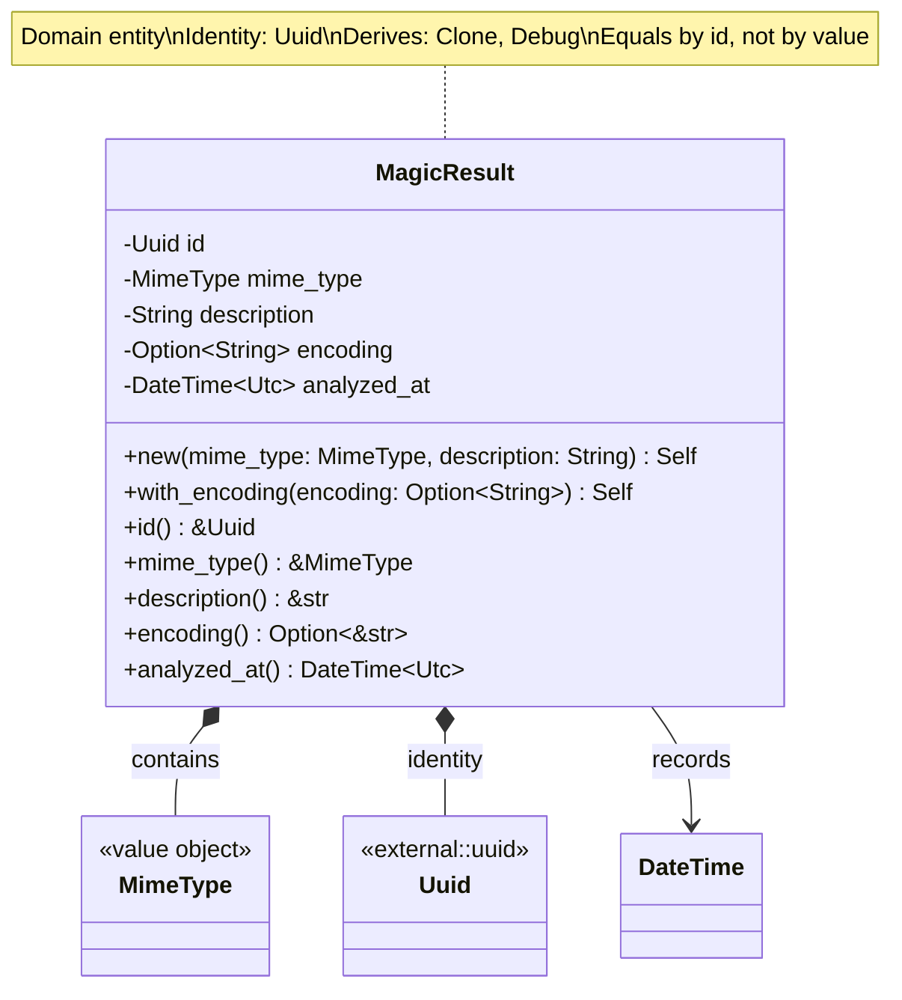
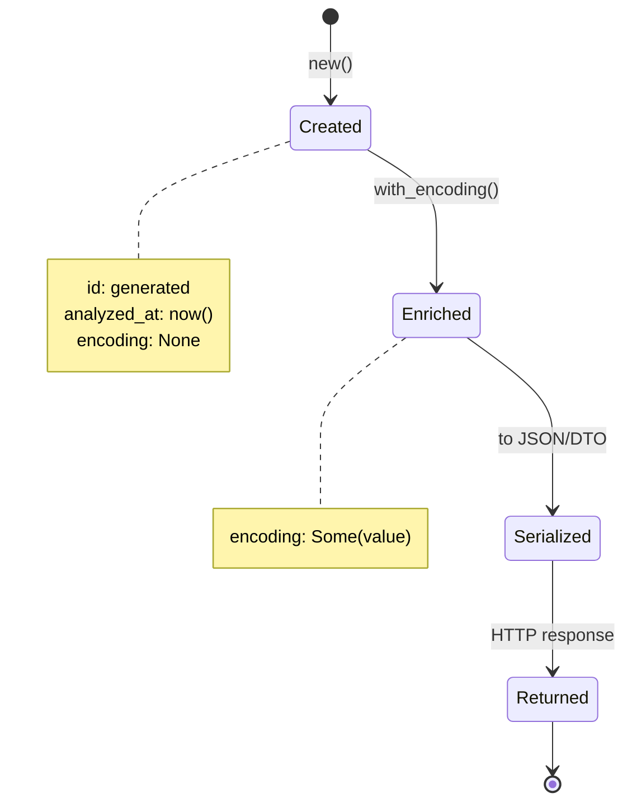

# MagicResult Entity Class Diagram

## Overview

The `MagicResult` entity represents the outcome of file magic analysis, containing file type identification and metadata.

## Class Diagram



## Entity Identity


## Properties

| Property | Type | Required | Description |
|----------|------|----------|-------------|
| `id` | `Uuid` | Yes | Unique entity identity (UUID v4) |
| `mime_type` | `MimeType` | Yes | Detected MIME type |
| `description` | `String` | Yes | Human-readable file type description |
| `encoding` | `Option<String>` | No | Character encoding (for text files) |
| `analyzed_at` | `DateTime<Utc>` | Yes | UTC timestamp of analysis |

## Methods

| Method | Parameters | Return Type | Description |
|--------|------------|-------------|-------------|
| `new` | `mime_type: MimeType, description: String` | `Self` | Create new result with generated ID |
| `with_encoding` | `self, encoding: Option<String>` | `Self` | Builder pattern: set encoding |
| `id` | `&self` | `&Uuid` | Get unique identifier |
| `mime_type` | `&self` | `&MimeType` | Get detected MIME type |
| `description` | `&self` | `&str` | Get type description |
| `encoding` | `&self` | `Option<&str>` | Get character encoding if present |
| `analyzed_at` | `&self` | `DateTime<Utc>` | Get analysis timestamp |

## Construction Pattern


## Invariants

1. `id` is always unique (UUID v4)
2. `mime_type` is always valid (value object guarantee)
3. `description` is never empty
4. `analyzed_at` is set at construction (immutable)
5. Entities are equal if and only if their `id` is equal

## Usage Example

```rust
// Create basic result
let mime = MimeType::new("text/plain")?;
let result = MagicResult::new(mime, "ASCII text".to_string());
assert_eq!(result.description(), "ASCII text");

// Create result with encoding
let mime = MimeType::new("text/html")?;
let result = MagicResult::new(mime, "HTML document".to_string())
    .with_encoding(Some("utf-8".to_string()));
assert_eq!(result.encoding(), Some("utf-8"));

// Entity identity
let result1 = MagicResult::new(mime.clone(), "Text file".to_string());
let result2 = MagicResult::new(mime.clone(), "Text file".to_string());
assert_ne!(result1.id(), result2.id()); // Different entities even with same data
```

## Entity Lifecycle



## Equality Semantics

```rust
impl PartialEq for MagicResult {
    fn eq(&self, other: &Self) -> bool {
        self.id == other.id
        // Only compare identity, not values
    }
}

impl Eq for MagicResult {}
```

## Sample Data

| MIME Type | Description | Encoding | Use Case |
|-----------|-------------|----------|----------|
| `text/plain` | ASCII text | `us-ascii` | Plain text files |
| `text/plain` | UTF-8 Unicode text | `utf-8` | Modern text documents |
| `application/pdf` | PDF document | None | PDF files |
| `image/jpeg` | JPEG image data | None | JPEG images |
| `application/zip` | Zip archive data | None | ZIP archives |
| `text/html` | HTML document | `utf-8` | Web pages |
| `application/json` | JSON data | `utf-8` | API responses |

## Design Rationale

- **Entity Pattern**: Has identity (`id`), distinguished from value objects
- **Immutability**: All fields are immutable after construction (builder pattern for optional fields)
- **Identity Equality**: Two results are equal iff they have the same `id`
- **Timestamp**: Records when analysis occurred for auditing/caching
- **Builder Pattern**: Fluent API for optional fields (`with_encoding`)
- **Domain Focus**: No persistence or serialization concerns (pure domain)
