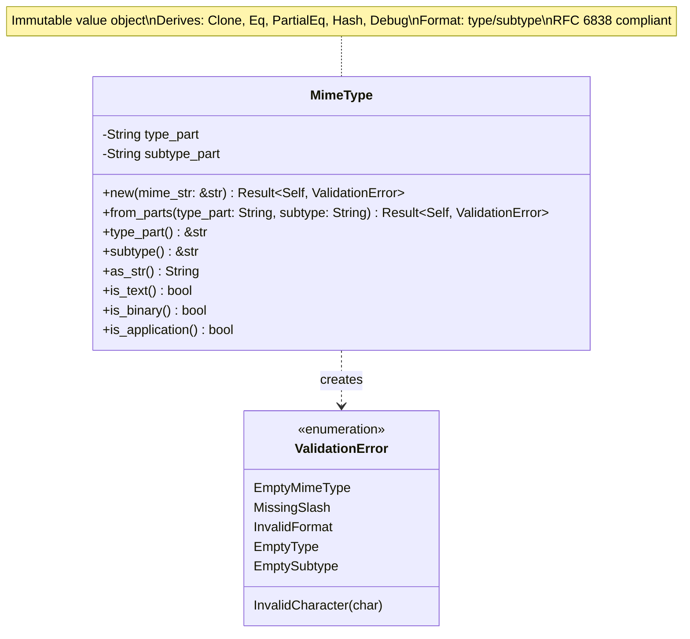
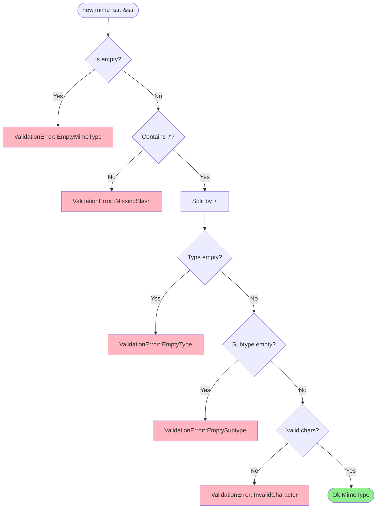
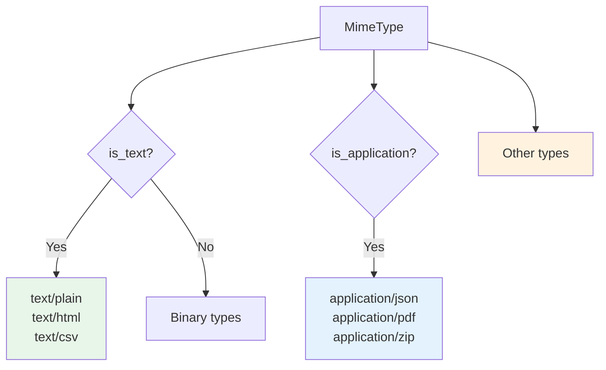

# MimeType Value Object Class Diagram

## Overview

The `MimeType` value object ensures MIME types conform to RFC 6838 format and provides type/subtype parsing.

## Class Diagram



## MIME Type Format

```
type/subtype[+suffix][;parameters]

Examples:
- text/plain
- application/json
- image/svg+xml
- text/html; charset=utf-8

This implementation focuses on type/subtype only.
```

## Validation Rules



## Properties

| Property | Type | Description |
|----------|------|-------------|
| `type_part` | `String` | Type component (before `/`) |
| `subtype_part` | `String` | Subtype component (after `/`) |

## Methods

| Method | Parameters | Return Type | Description |
|--------|------------|-------------|-------------|
| `new` | `mime_str: &str` | `Result<Self, ValidationError>` | Parse from "type/subtype" string |
| `from_parts` | `type_part: String, subtype: String` | `Result<Self, ValidationError>` | Construct from separate parts |
| `type_part` | `&self` | `&str` | Get type component |
| `subtype` | `&self` | `&str` | Get subtype component |
| `as_str` | `&self` | `String` | Reconstruct "type/subtype" string |
| `is_text` | `&self` | `bool` | Check if type is "text" |
| `is_binary` | `&self` | `bool` | Check if type is not "text" |
| `is_application` | `&self` | `bool` | Check if type is "application" |

## Common MIME Types

| Category | MIME Type | Description |
|----------|-----------|-------------|
| Text | `text/plain` | Plain text |
| Text | `text/html` | HTML document |
| Application | `application/json` | JSON data |
| Application | `application/pdf` | PDF document |
| Application | `application/zip` | ZIP archive |
| Application | `application/octet-stream` | Binary data |
| Image | `image/jpeg` | JPEG image |
| Image | `image/png` | PNG image |
| Video | `video/mp4` | MP4 video |
| Audio | `audio/mpeg` | MP3 audio |

## Invariants

1. Never empty
2. Always contains exactly one `/`
3. Type part is non-empty
4. Subtype part is non-empty
5. Contains only valid MIME characters (alphanumeric, `-`, `+`, `.`, `_`)
6. Immutable after construction

## Usage Example

```rust
// Valid MIME types
let mime = MimeType::new("text/plain")?;
assert_eq!(mime.type_part(), "text");
assert_eq!(mime.subtype(), "plain");
assert!(mime.is_text());

let mime = MimeType::new("application/json")?;
assert!(mime.is_application());
assert!(!mime.is_text());

// Construct from parts
let mime = MimeType::from_parts("image".to_string(), "png".to_string())?;
assert_eq!(mime.as_str(), "image/png");

// Invalid: missing slash
let result = MimeType::new("textplain");
assert!(matches!(result, Err(ValidationError::MissingSlash)));

// Invalid: empty type
let result = MimeType::new("/plain");
assert!(matches!(result, Err(ValidationError::EmptyType)));
```

## Type Categorization



## Design Rationale

- **RFC 6838 Compliance**: Follows IANA MIME type standards
- **Parsing**: Separates type and subtype for categorical operations
- **Validation**: Ensures valid format before use in HTTP headers
- **Type Safety**: Prevents invalid MIME strings in domain logic
- **Value Object Pattern**: Immutable, self-validating, comparable by value
