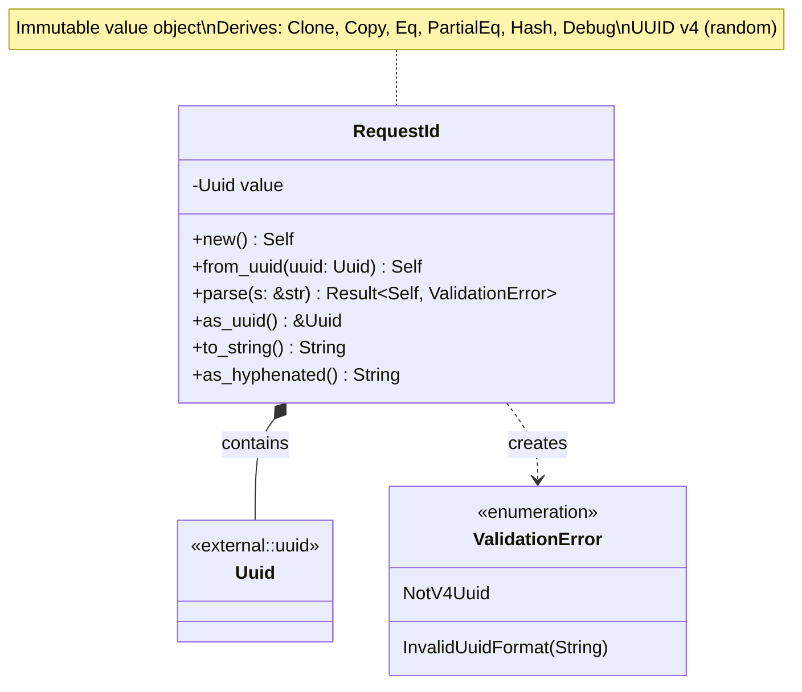
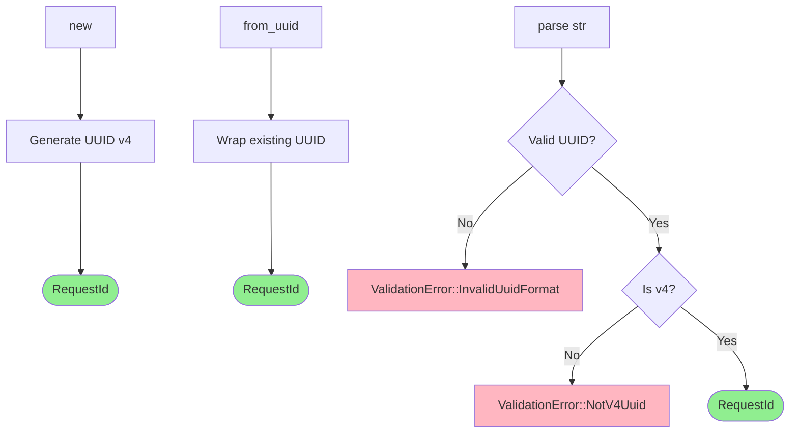

# RequestId Value Object Class Diagram

## Overview

The `RequestId` value object wraps UUID v4 for distributed tracing and request correlation.

## Class Diagram



## Creation Methods



## Properties

| Property | Type | Description |
|----------|------|-------------|
| `value` | `Uuid` | UUID v4 instance |

## Methods

| Method | Parameters | Return Type | Description |
|--------|------------|-------------|-------------|
| `new` | - | `Self` | Generate new UUID v4 |
| `from_uuid` | `uuid: Uuid` | `Self` | Wrap existing UUID (no validation) |
| `parse` | `s: &str` | `Result<Self, ValidationError>` | Parse from string, validate v4 |
| `as_uuid` | `&self` | `&Uuid` | Borrow inner UUID |
| `to_string` | `&self` | `String` | Convert to hyphenated string |
| `as_hyphenated` | `&self` | `String` | Explicit hyphenated format |

## Invariants

1. Always UUID v4 (random)
2. Never null or invalid
3. Immutable after construction
4. Globally unique (probabilistically)

## Usage Scenarios

### Generate New Request ID

When creating a new RequestId, a random UUID v4 is automatically generated. The resulting identifier can be converted to a hyphenated string format like "550e8400-e29b-41d4-a716-446655440000".

### Parse from String

When parsing a RequestId from a valid UUID v4 string like "550e8400-e29b-41d4-a716-446655440000", the value object is successfully created.

### Invalid Scenarios

**Invalid Format:** Parsing fails with InvalidUuidFormat validation error when the string is not a valid UUID format, such as "not-a-uuid".

**Invalid Version:** When wrapping an existing UUID that is not version 4 (such as a UUID v1 with identifier "550e8400-e29b-11d4-a716-446655440000"), the from_uuid method does not validate the version. Use the parse method for validation to ensure only UUID v4 is accepted.

## UUID v4 Format

```
xxxxxxxx-xxxx-4xxx-yxxx-xxxxxxxxxxxx

x: any hexadecimal digit (0-9, a-f)
4: version identifier (v4)
y: variant identifier (8, 9, a, or b)

Example: 550e8400-e29b-41d4-a716-446655440000
         └──────┘ └──┘ │└─┘ └──┘ └──────────┘
         time_low  mid │var  node
                      version
```

## Trait Implementations

| Trait | Purpose |
|-------|---------|
| `Clone, Copy` | Lightweight copying (16 bytes) |
| `Eq, PartialEq` | Value equality comparison |
| `Hash` | HashMap/HashSet key usage |
| `Debug` | Debug formatting |
| `Display` | User-facing string conversion |
| `FromStr` | Parse from string |
| `Serialize, Deserialize` | JSON/TOML serialization |

## Design Rationale

- **Distributed Tracing**: Enables request correlation across services and logs
- **UUID v4**: Random generation ensures uniqueness without coordination
- **Type Safety**: Wrapper prevents mixing with other UUIDs or strings
- **HTTP Header**: Suitable for `X-Request-ID` header format
- **Value Object Pattern**: Immutable, self-identifying, copyable
