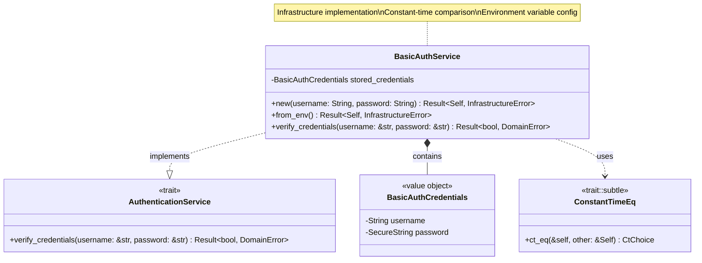
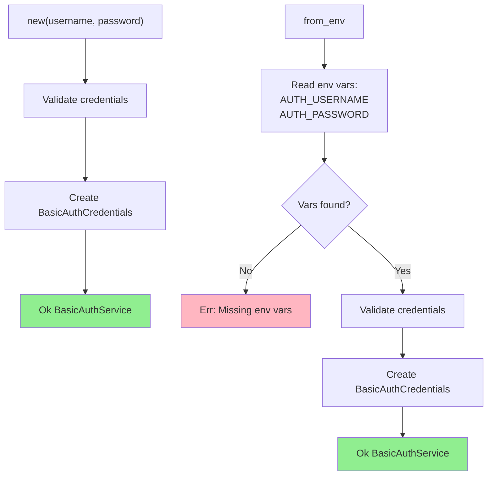
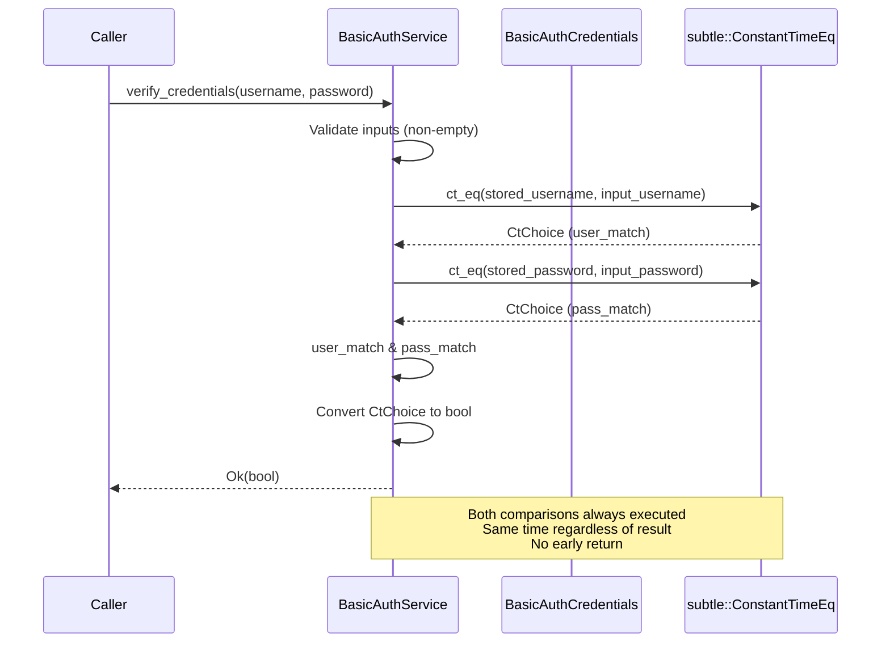
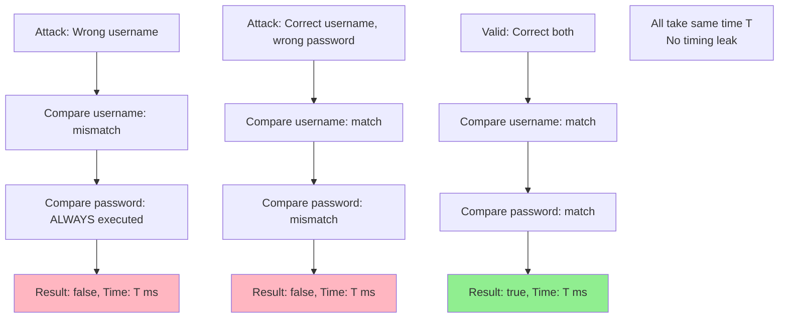
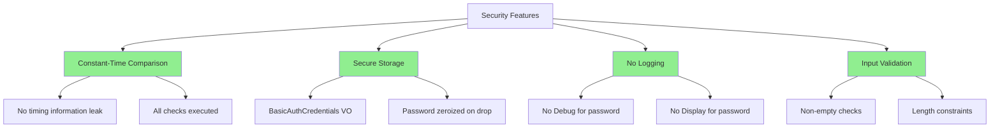
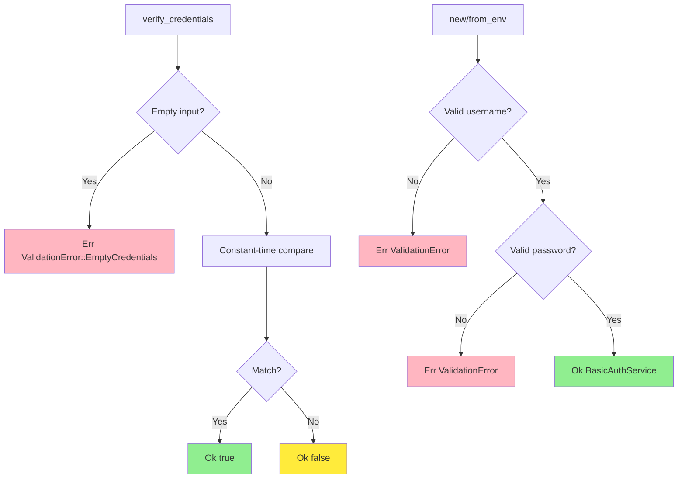

# BasicAuthService Implementation Class Diagram

## Overview

The `BasicAuthService` implements the `AuthenticationService` trait using HTTP Basic Authentication with constant-time credential comparison.

## Class Diagram

## Initialization Methods

## Properties

| Property | Type | Description |
|----------|------|-------------|
| `stored_credentials` | `BasicAuthCredentials` | Validated stored credentials |

## Methods

| Method | Parameters | Return Type | Description |
|--------|------------|-------------|-------------|
| `new` | `username: String, password: String` | `Result<Self, InfrastructureError>` | Constructor with explicit credentials |
| `from_env` | - | `Result<Self, InfrastructureError>` | Constructor from environment variables |
| `verify_credentials` | `username: &str, password: &str` | `Result<bool, DomainError>` | Verify credentials (constant-time) |

## Verification Flow (Constant-Time)

## Constant-Time Comparison

The verify_credentials method first validates that both username and password inputs are non-empty. If either is empty, it returns a ValidationError.

For the actual comparison, the method converts both the stored and provided usernames to byte arrays and performs a constant-time equality check. It then performs the same constant-time comparison for passwords.

**Critical Security Feature:** Both comparisons are always executed regardless of whether the username matches. The results are combined using a logical AND operation. This ensures the method always takes the same amount of time to execute, preventing attackers from determining which credential is incorrect based on response timing.

## Timing Attack Prevention

## Environment Variable Configuration

| Variable | Required | Description | Example |
|----------|----------|-------------|---------|
| `AUTH_USERNAME` | Yes | Basic auth username | `admin` |
| `AUTH_PASSWORD` | Yes | Basic auth password | `securepassword123` |

## Configuration Loading

The from_env method reads the AUTH_USERNAME and AUTH_PASSWORD environment variables. If either variable is missing, it returns an InfrastructureError indicating which configuration is absent. If both are present, it calls the new method with the loaded values.

## Usage Scenarios

### Construction from Explicit Credentials

When constructing BasicAuthService with explicit username "admin" and password "securepassword123", the service is successfully created after validating that both credentials meet the requirements.

### Construction from Environment Variables

When constructing from environment variables, the service reads AUTH_USERNAME and AUTH_PASSWORD from the process environment. If both are set to valid values, the service initializes successfully.

### Verification Behavior

When verifying credentials with matching username and password, the method returns true. When verifying with correct username but incorrect password, the method returns false. Both cases take approximately the same amount of time due to constant-time comparison.

### Error Handling

When attempting to verify credentials with an empty username or password, the method returns a ValidationError indicating empty credentials, rather than returning false.

## Security Features

## Error Cases

## Integration with Middleware

The authentication middleware receives the BasicAuthService through dependency injection. It extracts the Authorization header from the incoming request. If the header is missing or doesn't start with "Basic ", it returns an unauthorized status.

The middleware then extracts the Base64-encoded credentials, decodes them to a UTF-8 string, and splits on the first colon to separate username and password. If any of these steps fail or if the split doesn't produce exactly two parts, it returns an unauthorized status.

With the extracted credentials, the middleware calls the authentication service's verify_credentials method. If verification succeeds (returns true), the request proceeds to the next handler. If verification fails (returns false), an unauthorized status is returned. If an error occurs during verification, an internal server error status is returned.

## Testing Approach

### Valid Credentials Test

A test constructs BasicAuthService with username "admin" and password "password123". When verifying with the exact same credentials, the method returns true, confirming successful authentication.

### Invalid Password Test

A test constructs the service with specific credentials, then verifies with the correct username but incorrect password "wrongpass". The method returns false, correctly rejecting invalid credentials.

### Empty Credentials Test

A test attempts to verify credentials where the username is an empty string. The method returns a ValidationError rather than false, distinguishing between invalid input and failed authentication.

### Timing Attack Resistance Test

A test measures the execution time for two scenarios: wrong username with correct password, and correct username with wrong password. Both operations complete in approximately the same amount of time (within 10% tolerance), demonstrating resistance to timing attacks. The similar timing prevents attackers from determining which credential component is incorrect.

## Design Rationale

- **Constant-Time**: Uses `subtle` crate to prevent timing attacks
- **Value Object**: Uses `BasicAuthCredentials` for validation and security
- **Environment Config**: Production-ready configuration from env vars
- **Trait Implementation**: Implements domain-defined `AuthenticationService`
- **Security First**: No logging of passwords, zeroized on drop
- **Simple**: No complex hashing/salting (suitable for demo/internal use)
- **Thread-Safe**: Immutable after construction, can be shared via `Arc`

## Production Considerations

For production systems, consider:

| Enhancement | Purpose | Implementation |
|-------------|---------|----------------|
| **Password Hashing** | Protect stored passwords | Use `argon2`, `bcrypt`, or `scrypt` |
| **Rate Limiting** | Prevent brute force | Track failed attempts per IP/user |
| **Account Lockout** | Block repeated failures | Temporary lockout after N failures |
| **Audit Logging** | Track auth attempts | Log (username, result, timestamp, IP) |
| **Token-Based Auth** | Avoid repeated credential verification | JWT or session tokens |
| **Multi-Factor Auth** | Additional security layer | TOTP, SMS, hardware tokens |
