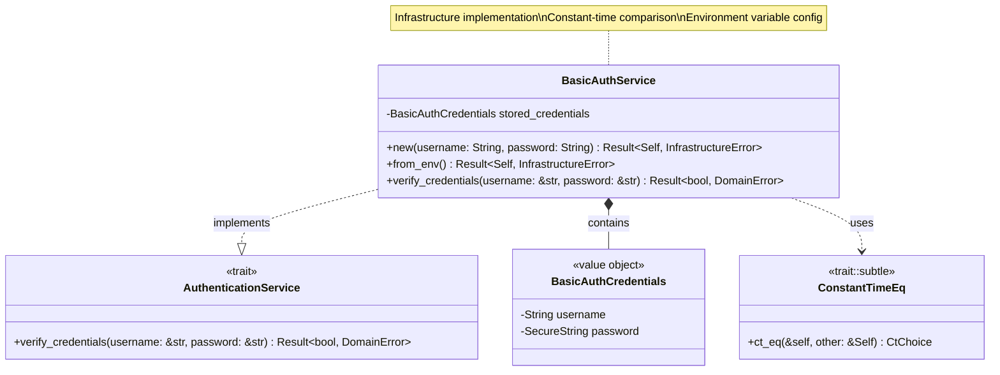
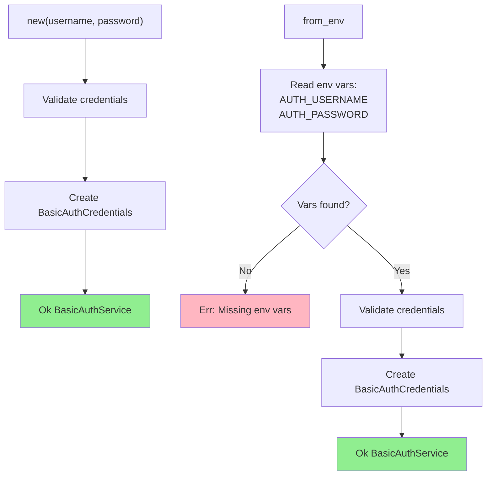
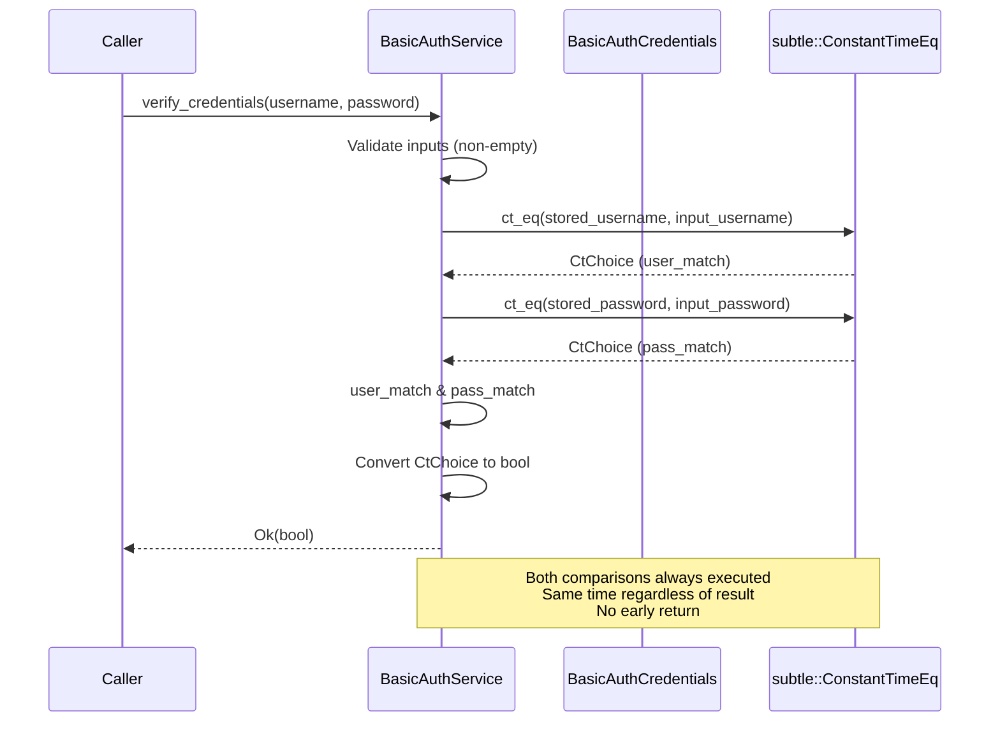
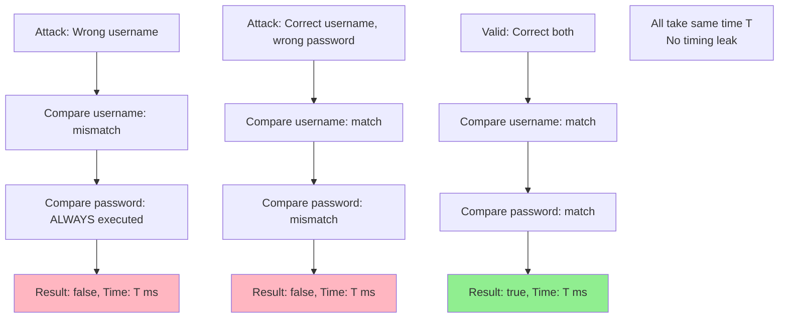
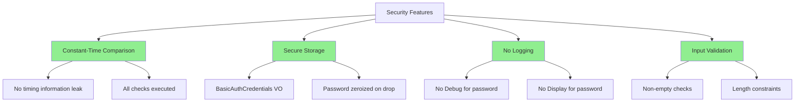
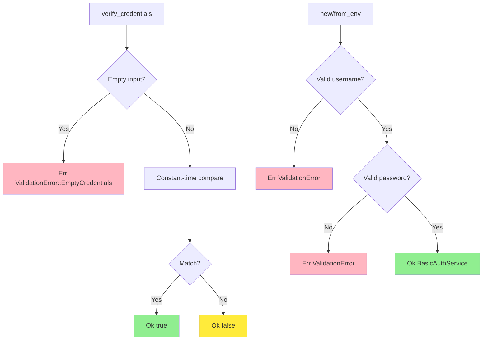

# BasicAuthService Implementation Class Diagram

## Overview

The `BasicAuthService` implements the `AuthenticationService` trait using HTTP Basic Authentication with constant-time credential comparison.

## Class Diagram



## Initialization Methods



## Properties

| Property | Type | Description |
|----------|------|-------------|
| `stored_credentials` | `BasicAuthCredentials` | Validated stored credentials |

## Methods

| Method | Parameters | Return Type | Description |
|--------|------------|-------------|-------------|
| `new` | `username: String, password: String` | `Result<Self, InfrastructureError>` | Constructor with explicit credentials |
| `from_env` | - | `Result<Self, InfrastructureError>` | Constructor from environment variables |
| `verify_credentials` | `username: &str, password: &str` | `Result<bool, DomainError>` | Verify credentials (constant-time) |

## Verification Flow (Constant-Time)



## Constant-Time Comparison

```rust
use subtle::ConstantTimeEq;

fn verify_credentials(&self, username: &str, password: &str) -> Result<bool, DomainError> {
    // Validate inputs
    if username.is_empty() || password.is_empty() {
        return Err(DomainError::ValidationError(
            ValidationError::EmptyCredentials
        ));
    }
    
    // Constant-time comparison
    let user_match = self.stored_credentials
        .username()
        .as_bytes()
        .ct_eq(username.as_bytes());
    
    let pass_match = self.stored_credentials
        .password()
        .as_bytes()
        .ct_eq(password.as_bytes());
    
    // Combine results (both must be true)
    // CRITICAL: No early return, always same execution time
    Ok(bool::from(user_match & pass_match))
}
```

## Timing Attack Prevention



## Environment Variable Configuration

| Variable | Required | Description | Example |
|----------|----------|-------------|---------|
| `AUTH_USERNAME` | Yes | Basic auth username | `admin` |
| `AUTH_PASSWORD` | Yes | Basic auth password | `securepassword123` |

```rust
impl BasicAuthService {
    pub fn from_env() -> Result<Self, InfrastructureError> {
        let username = std::env::var("AUTH_USERNAME")
            .map_err(|_| InfrastructureError::MissingConfig("AUTH_USERNAME"))?;
        
        let password = std::env::var("AUTH_PASSWORD")
            .map_err(|_| InfrastructureError::MissingConfig("AUTH_PASSWORD"))?;
        
        Self::new(username, password)
    }
}
```

## Usage Example

```rust
// From explicit credentials
let service = BasicAuthService::new(
    "admin".to_string(),
    "securepassword123".to_string()
)?;

// From environment variables
std::env::set_var("AUTH_USERNAME", "admin");
std::env::set_var("AUTH_PASSWORD", "securepassword123");
let service = BasicAuthService::from_env()?;

// Verify credentials
let is_valid = service.verify_credentials("admin", "securepassword123")?;
assert!(is_valid);

let is_valid = service.verify_credentials("admin", "wrongpassword")?;
assert!(!is_valid);

// Error handling
match service.verify_credentials("", "password") {
    Ok(false) => println!("Invalid credentials"),
    Err(DomainError::ValidationError(_)) => println!("Empty username/password"),
    _ => {}
}
```

## Security Features



## Error Cases



## Integration with Middleware

```rust
// In presentation layer middleware
pub async fn auth_middleware<B>(
    State(auth_service): State<Arc<BasicAuthService>>,
    mut req: Request<B>,
    next: Next<B>,
) -> Result<Response, StatusCode> {
    // Extract Authorization header
    let auth_header = req.headers()
        .get("authorization")
        .and_then(|h| h.to_str().ok())
        .ok_or(StatusCode::UNAUTHORIZED)?;
    
    // Parse Basic auth
    if !auth_header.starts_with("Basic ") {
        return Err(StatusCode::UNAUTHORIZED);
    }
    
    let encoded = &auth_header[6..];
    let decoded = base64::decode(encoded)
        .map_err(|_| StatusCode::UNAUTHORIZED)?;
    let credentials = String::from_utf8(decoded)
        .map_err(|_| StatusCode::UNAUTHORIZED)?;
    
    let parts: Vec<&str> = credentials.splitn(2, ':').collect();
    if parts.len() != 2 {
        return Err(StatusCode::UNAUTHORIZED);
    }
    
    let (username, password) = (parts[0], parts[1]);
    
    // Verify credentials (constant-time)
    let is_valid = auth_service
        .verify_credentials(username, password)
        .map_err(|_| StatusCode::INTERNAL_SERVER_ERROR)?;
    
    if is_valid {
        Ok(next.run(req).await)
    } else {
        Err(StatusCode::UNAUTHORIZED)
    }
}
```

## Testing

```rust
#[test]
fn test_valid_credentials() {
    let service = BasicAuthService::new(
        "admin".to_string(),
        "password123".to_string()
    ).unwrap();
    
    assert!(service.verify_credentials("admin", "password123").unwrap());
}

#[test]
fn test_invalid_password() {
    let service = BasicAuthService::new(
        "admin".to_string(),
        "password123".to_string()
    ).unwrap();
    
    assert!(!service.verify_credentials("admin", "wrongpass").unwrap());
}

#[test]
fn test_empty_credentials() {
    let service = BasicAuthService::new(
        "admin".to_string(),
        "password123".to_string()
    ).unwrap();
    
    let result = service.verify_credentials("", "password123");
    assert!(matches!(result, Err(DomainError::ValidationError(_))));
}

#[test]
fn test_timing_attack_resistance() {
    use std::time::Instant;
    
    let service = BasicAuthService::new(
        "admin".to_string(),
        "password123".to_string()
    ).unwrap();
    
    // Time wrong username
    let start = Instant::now();
    let _ = service.verify_credentials("wrong", "password123");
    let time1 = start.elapsed();
    
    // Time correct username, wrong password
    let start = Instant::now();
    let _ = service.verify_credentials("admin", "wrongpass");
    let time2 = start.elapsed();
    
    // Times should be similar (within 10% tolerance)
    let diff = if time1 > time2 { time1 - time2 } else { time2 - time1 };
    let max_time = time1.max(time2);
    let diff_percent = (diff.as_nanos() * 100) / max_time.as_nanos();
    
    assert!(diff_percent < 10, "Timing difference too large: {}%", diff_percent);
}
```

## Design Rationale

- **Constant-Time**: Uses `subtle` crate to prevent timing attacks
- **Value Object**: Uses `BasicAuthCredentials` for validation and security
- **Environment Config**: Production-ready configuration from env vars
- **Trait Implementation**: Implements domain-defined `AuthenticationService`
- **Security First**: No logging of passwords, zeroized on drop
- **Simple**: No complex hashing/salting (suitable for demo/internal use)
- **Thread-Safe**: Immutable after construction, can be shared via `Arc`

## Production Considerations

For production systems, consider:

| Enhancement | Purpose | Implementation |
|-------------|---------|----------------|
| **Password Hashing** | Protect stored passwords | Use `argon2`, `bcrypt`, or `scrypt` |
| **Rate Limiting** | Prevent brute force | Track failed attempts per IP/user |
| **Account Lockout** | Block repeated failures | Temporary lockout after N failures |
| **Audit Logging** | Track auth attempts | Log (username, result, timestamp, IP) |
| **Token-Based Auth** | Avoid repeated credential verification | JWT or session tokens |
| **Multi-Factor Auth** | Additional security layer | TOTP, SMS, hardware tokens |
