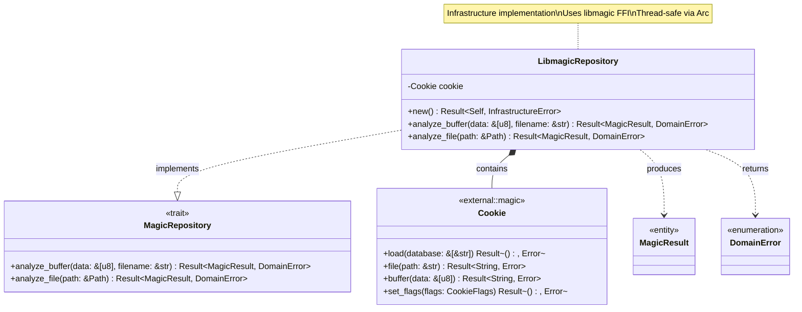
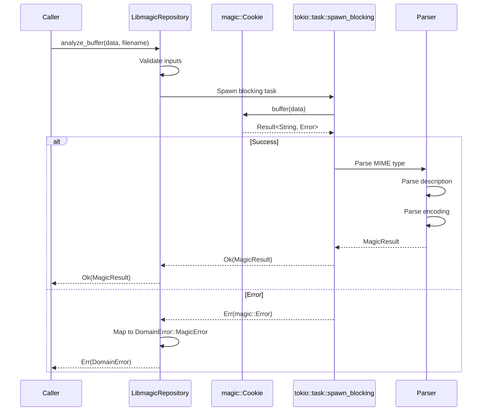
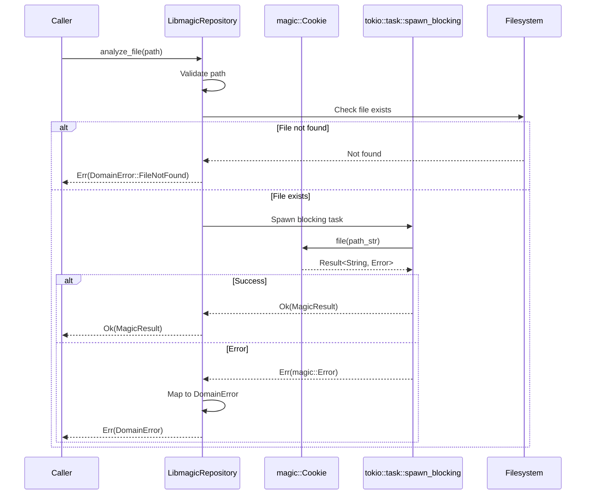
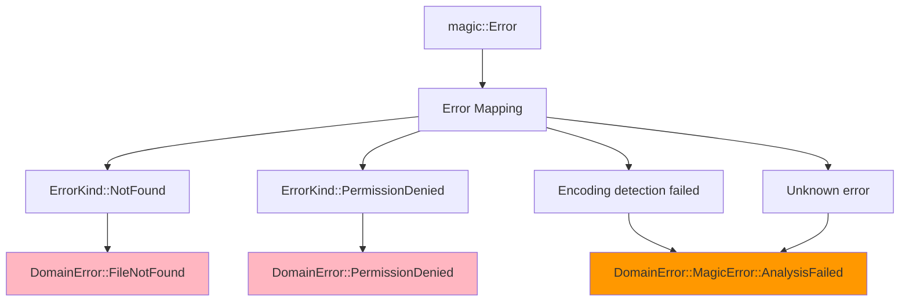
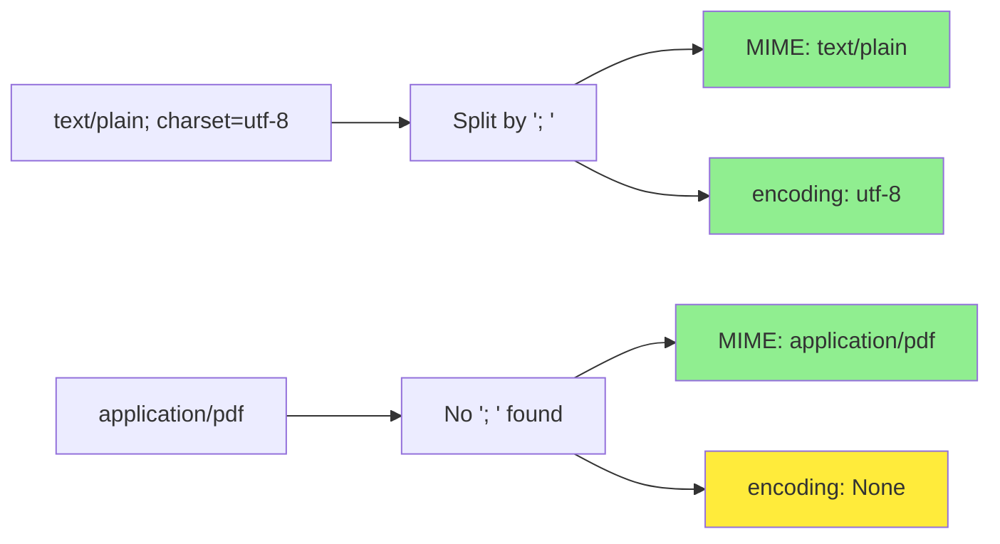

# LibmagicRepository Implementation Class Diagram

## Overview

The `LibmagicRepository` implements the `MagicRepository` trait using libmagic FFI bindings for file type analysis.

## Class Diagram



## Cookie Lifecycle

```mermaid
stateDiagram-v2
    [*] --> Created: Cookie::open()
    Created --> Configured: set_flags(MIME_TYPE | MIME_ENCODING)
    Configured --> Loaded: load(default database)
    Loaded --> Ready: Ready for analysis
    Ready --> Analyzing: analyze_buffer/file
    Analyzing --> Ready: Return result
    Ready --> [*]: Drop
    
    note right of Ready
        Cookie is reusable
        Thread-safe when wrapped in Arc
    end note
```

## Properties

| Property | Type | Description |
|----------|------|-------------|
| `cookie` | `Cookie` | libmagic cookie handle (FFI) |

## Methods

| Method | Parameters | Return Type | Description |
|--------|------------|-------------|-------------|
| `new` | - | `Result<Self, InfrastructureError>` | Initialize libmagic with default database |
| `analyze_buffer` | `&self, data: &[u8], filename: &str` | `Result<MagicResult, DomainError>` | Analyze binary buffer |
| `analyze_file` | `&self, path: &Path` | `Result<MagicResult, DomainError>` | Analyze file by path |

## Initialization Flow


## analyze_buffer Implementation



## analyze_file Implementation



## Error Mapping



## Cookie Flags

| Flag | Purpose | Example Output |
|------|---------|----------------|
| `MIME_TYPE` | Return MIME type | `text/plain` |
| `MIME_ENCODING` | Return character encoding | `us-ascii` |
| `SYMLINK` | Follow symlinks | Analyze target file |
| `ERROR` | Continue on errors | Partial results |
| `NO_CHECK_*` | Skip specific checks | Performance optimization |

## libmagic Output Parsing

```
Raw output: "text/plain; charset=utf-8"

Parsing:
1. Split by '; ' → ["text/plain", "charset=utf-8"]
2. First part → MIME type: "text/plain"
3. Second part (if exists) → Parse encoding: "utf-8"
4. If no encoding → None
```



## Usage Example

```rust
// Initialization
let repository = Arc::new(LibmagicRepository::new()?);

// Analyze buffer (in-memory data)
let data = vec![0x89, 0x50, 0x4E, 0x47, 0x0D, 0x0A, 0x1A, 0x0A]; // PNG header
let result = repository.analyze_buffer(&data, "image.png")?;
assert_eq!(result.mime_type().as_str(), "image/png");

// Analyze file (by path)
let path = Path::new("/sandbox/documents/report.pdf");
let result = repository.analyze_file(path)?;
assert_eq!(result.mime_type().type_part(), "application");

// Error handling
match repository.analyze_file(path) {
    Ok(result) => println!("Type: {}", result.description()),
    Err(DomainError::FileNotFound(p)) => eprintln!("File not found: {}", p),
    Err(DomainError::PermissionDenied(p)) => eprintln!("Access denied: {}", p),
    Err(DomainError::MagicError(e)) => eprintln!("Analysis failed: {:?}", e),
    Err(e) => eprintln!("Unexpected error: {:?}", e),
}
```

## Thread Safety

```rust
// LibmagicRepository is Send + Sync
// Can be shared across threads via Arc
let repository = Arc::new(LibmagicRepository::new()?);

// Use in async context (Axum handler)
async fn handler(
    State(repo): State<Arc<LibmagicRepository>>,
    data: Bytes,
) -> Result<Json<MagicResponse>, StatusCode> {
    // spawn_blocking because libmagic is CPU-bound
    let result = tokio::task::spawn_blocking(move || {
        repo.analyze_buffer(&data, "file.bin")
    })
    .await
    .map_err(|_| StatusCode::INTERNAL_SERVER_ERROR)?
    .map_err(|_| StatusCode::UNPROCESSABLE_ENTITY)?;
    
    Ok(Json(MagicResponse::from(result)))
}
```

## Performance Considerations

| Aspect | Strategy | Rationale |
|--------|----------|-----------|
| **CPU-bound** | `spawn_blocking` | libmagic analysis is synchronous and CPU-intensive |
| **Cookie Reuse** | Single cookie per instance | Avoid repeated initialization overhead |
| **Thread Safety** | `Cookie` is thread-safe | Can be shared via `Arc` |
| **Database Loading** | Load once at startup | Database loading is expensive |
| **Buffer Size** | No internal buffering | Accept any `&[u8]` size (limited by HTTP layer) |

## Database Configuration

```rust
impl LibmagicRepository {
    pub fn new() -> Result<Self, InfrastructureError> {
        let cookie = Cookie::open(CookieFlags::MIME_TYPE | CookieFlags::MIME_ENCODING)?;
        
        // Load default database
        cookie.load::<String>(&[])?;
        
        Ok(Self { cookie })
    }
    
    pub fn with_database(database_path: &str) -> Result<Self, InfrastructureError> {
        let cookie = Cookie::open(CookieFlags::MIME_TYPE | CookieFlags::MIME_ENCODING)?;
        
        // Load custom database
        cookie.load(&[database_path])?;
        
        Ok(Self { cookie })
    }
}
```

## Testing

```rust
#[test]
fn test_analyze_png_buffer() {
    let repo = LibmagicRepository::new().unwrap();
    let png_header = vec![0x89, 0x50, 0x4E, 0x47, 0x0D, 0x0A, 0x1A, 0x0A];
    
    let result = repo.analyze_buffer(&png_header, "test.png").unwrap();
    assert_eq!(result.mime_type().as_str(), "image/png");
}

#[test]
fn test_analyze_file_not_found() {
    let repo = LibmagicRepository::new().unwrap();
    let result = repo.analyze_file(Path::new("/nonexistent/file.txt"));
    
    assert!(matches!(result, Err(DomainError::FileNotFound(_))));
}
```

## Design Rationale

- **Trait Implementation**: Implements domain-defined `MagicRepository` trait
- **Error Mapping**: Converts FFI errors to domain errors at boundary
- **Async-Ready**: Uses `spawn_blocking` for CPU-bound libmagic calls
- **Thread-Safe**: Cookie is thread-safe, shareable via `Arc`
- **Dependency Inversion**: Domain defines interface, infrastructure provides concrete implementation
- **Clean Separation**: No domain logic, only infrastructure concerns
