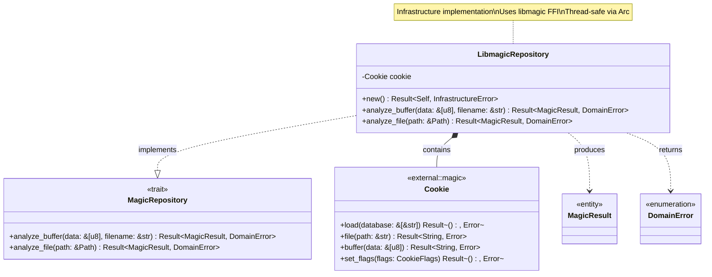
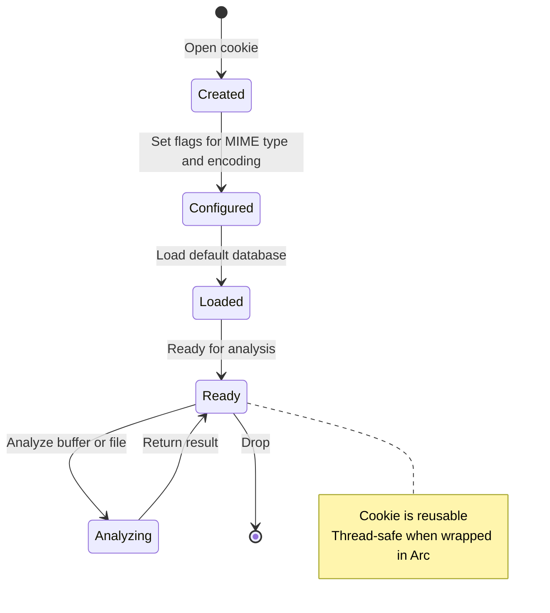
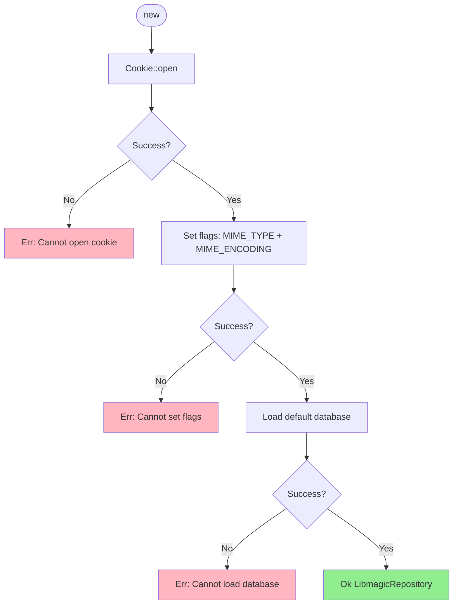
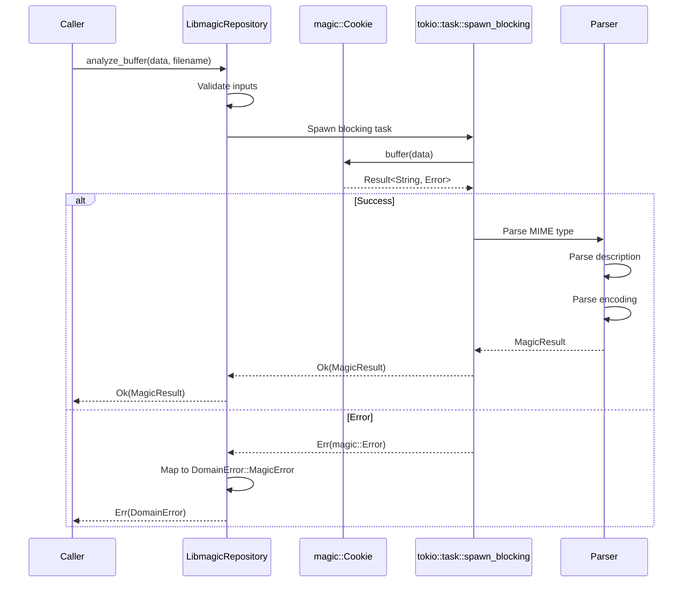
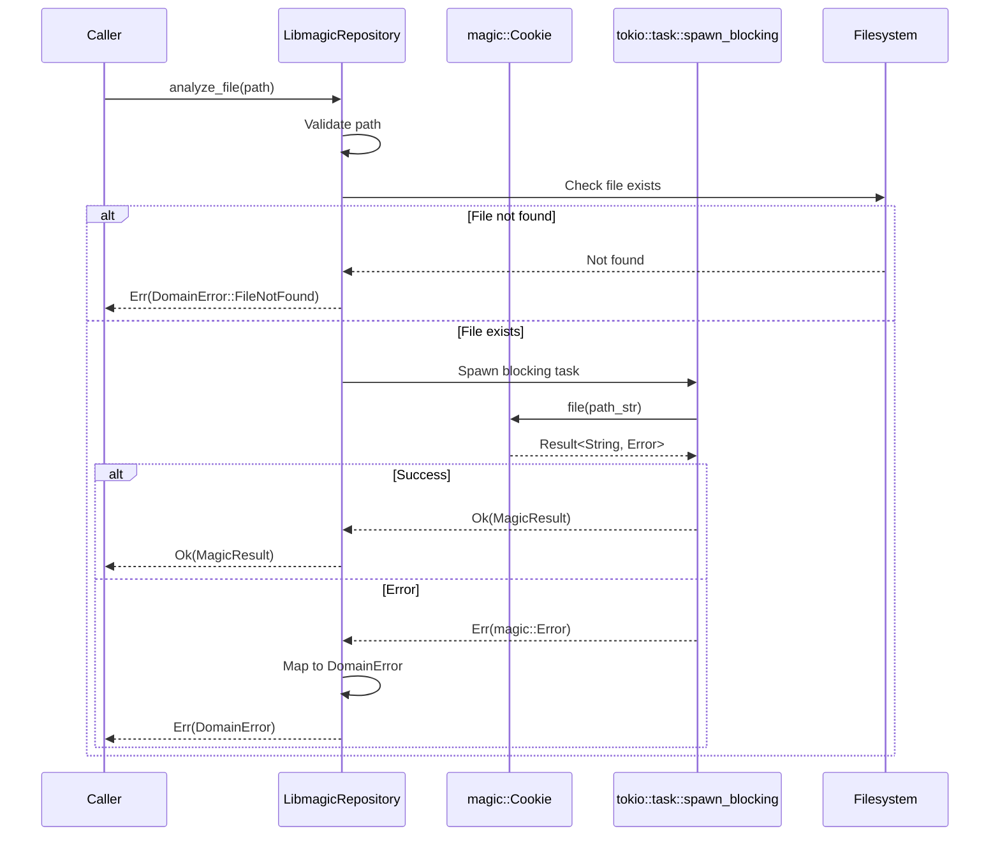
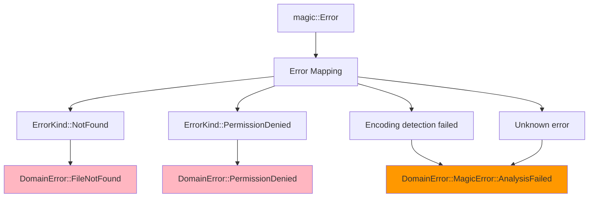
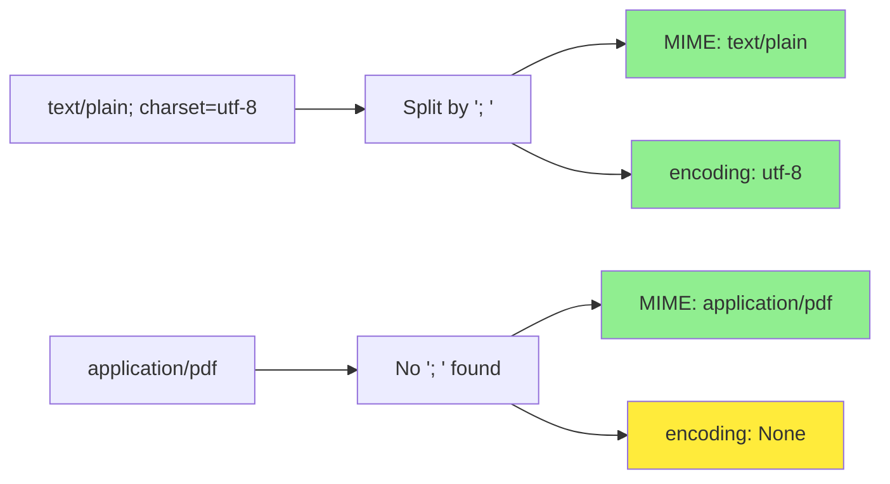

# LibmagicRepository Implementation Class Diagram

## Overview

The `LibmagicRepository` implements the `MagicRepository` trait using libmagic FFI bindings for file type analysis.

## Class Diagram



## Cookie Lifecycle



## Properties

| Property | Type | Description |
|----------|------|-------------|
| `cookie` | `Cookie` | libmagic cookie handle (FFI) |

## Methods

| Method | Parameters | Return Type | Description |
|--------|------------|-------------|-------------|
| `new` | - | `Result<Self, InfrastructureError>` | Initialize libmagic with default database |
| `analyze_buffer` | `&self, data: &[u8], filename: &str` | `Result<MagicResult, DomainError>` | Analyze binary buffer |
| `analyze_file` | `&self, path: &Path` | `Result<MagicResult, DomainError>` | Analyze file by path |

## Initialization Flow



## analyze_buffer Implementation



## analyze_file Implementation



## Error Mapping



## Cookie Flags

| Flag | Purpose | Example Output |
|------|---------|----------------|
| `MIME_TYPE` | Return MIME type | `text/plain` |
| `MIME_ENCODING` | Return character encoding | `us-ascii` |
| `SYMLINK` | Follow symlinks | Analyze target file |
| `ERROR` | Continue on errors | Partial results |
| `NO_CHECK_*` | Skip specific checks | Performance optimization |

## libmagic Output Parsing

```
Raw output: "text/plain; charset=utf-8"

Parsing:
1. Split by '; ' → ["text/plain", "charset=utf-8"]
2. First part → MIME type: "text/plain"
3. Second part (if exists) → Parse encoding: "utf-8"
4. If no encoding → None
```



## Usage Scenarios

### Initialization

The LibmagicRepository is initialized and wrapped in an Arc for thread-safe sharing across the application. The initialization may fail if the libmagic library cannot be opened or the database cannot be loaded.

### Analyze Buffer

When analyzing in-memory data such as a PNG file header (8 bytes starting with hex values 0x89, 0x50, 0x4E, 0x47), the analyze_buffer method is called with the byte slice and a filename hint. The method returns a MagicResult with the detected MIME type "image/png".

### Analyze File by Path

When analyzing a file by its filesystem path such as "/sandbox/documents/report.pdf", the analyze_file method is called with the path. The method returns a MagicResult with the MIME type detected from the file, such as "application/pdf".

### Error Handling

When analyzing a file, various errors can occur. FileNotFound indicates the file doesn't exist at the specified path. PermissionDenied indicates insufficient permissions to read the file. MagicError indicates the analysis failed (e.g., corrupted file or unsupported format). Other domain errors may occur for unexpected conditions.

## Thread Safety

LibmagicRepository implements Send and Sync traits, allowing it to be safely shared across threads when wrapped in an Arc. This is essential for use in async web servers where multiple requests may be processed concurrently.

When used in async contexts such as Axum handlers, the repository is accessed through Arc from the application state. Because libmagic operations are CPU-bound and synchronous, they should be executed using spawn_blocking to avoid blocking the async runtime. The blocking task receives the Arc-wrapped repository, performs the analysis, and returns the result. Any errors from the spawned task or the analysis itself are mapped to appropriate HTTP status codes.

## Performance Considerations

| Aspect | Strategy | Rationale |
|--------|----------|-----------|
| **CPU-bound** | `spawn_blocking` | libmagic analysis is synchronous and CPU-intensive |
| **Cookie Reuse** | Single cookie per instance | Avoid repeated initialization overhead |
| **Thread Safety** | `Cookie` is thread-safe | Can be shared via `Arc` |
| **Database Loading** | Load once at startup | Database loading is expensive |
| **Buffer Size** | No internal buffering | Accept any `&[u8]` size (limited by HTTP layer) |

## Database Configuration

### Default Database

The new constructor opens a libmagic cookie with flags for MIME type and encoding detection, then loads the default system magic database. The default database is typically located at a system-specific path like "/usr/share/misc/magic.mgc". If either operation fails, an InfrastructureError is returned.

### Custom Database

The with_database constructor accepts a custom database path parameter. It opens the cookie with the same flags, then loads the specified database file instead of the default. This allows using application-specific or updated magic databases. If the database file doesn't exist or cannot be loaded, an InfrastructureError is returned.

## Testing Approach

### PNG Buffer Analysis Test

A test creates a LibmagicRepository instance and provides a byte vector containing the PNG file signature (8 bytes: 0x89, 0x50, 0x4E, 0x47, 0x0D, 0x0A, 0x1A, 0x0A). When analyzing this buffer with filename "test.png", the repository correctly identifies the MIME type as "image/png".

### File Not Found Test

A test creates a repository instance and attempts to analyze a non-existent file path "/nonexistent/file.txt". The analyze_file method returns a DomainError with the FileNotFound variant, correctly handling the missing file scenario.

## Design Rationale

- **Trait Implementation**: Implements domain-defined `MagicRepository` trait
- **Error Mapping**: Converts FFI errors to domain errors at boundary
- **Async-Ready**: Uses `spawn_blocking` for CPU-bound libmagic calls
- **Thread-Safe**: Cookie is thread-safe, shareable via `Arc`
- **Dependency Inversion**: Domain defines interface, infrastructure provides concrete implementation
- **Clean Separation**: No domain logic, only infrastructure concerns
