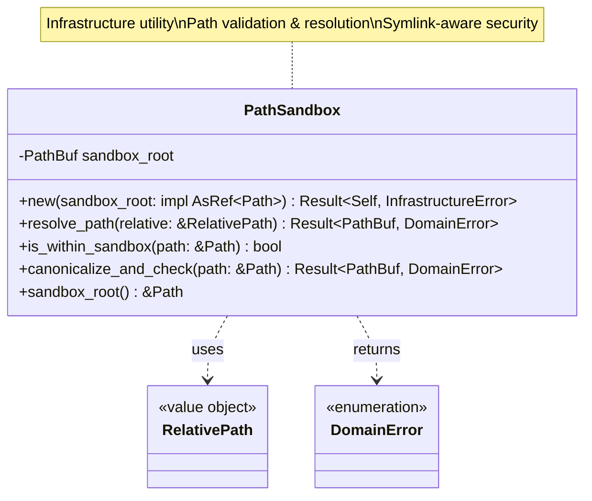
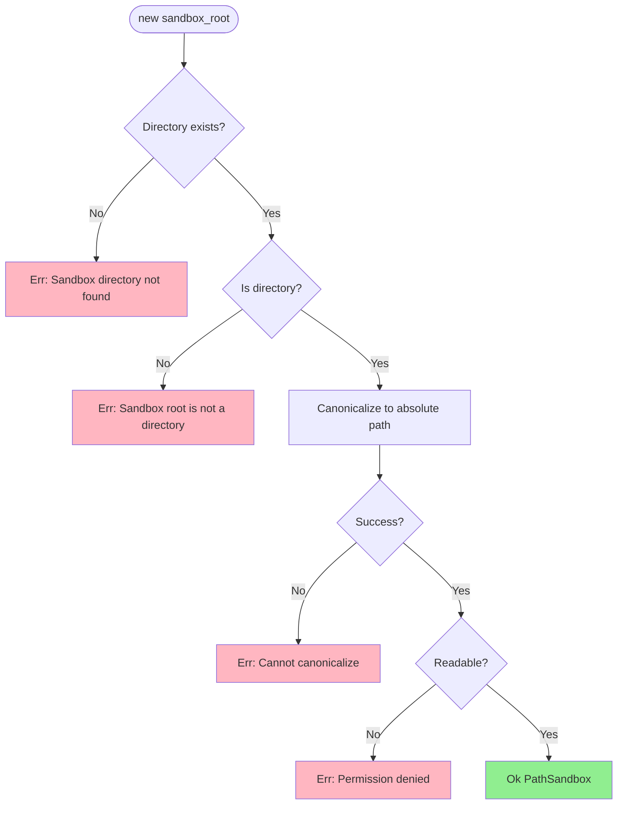
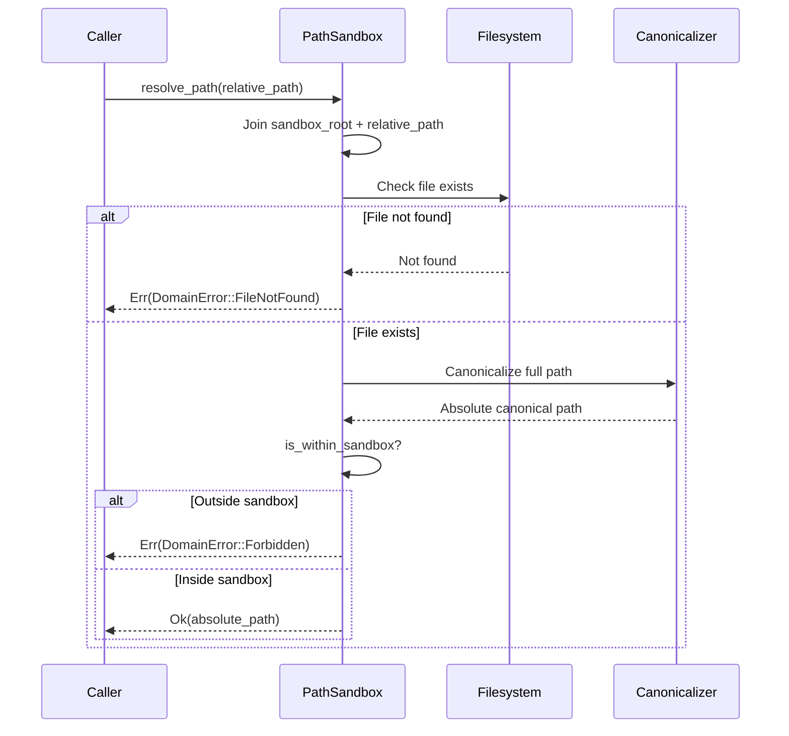
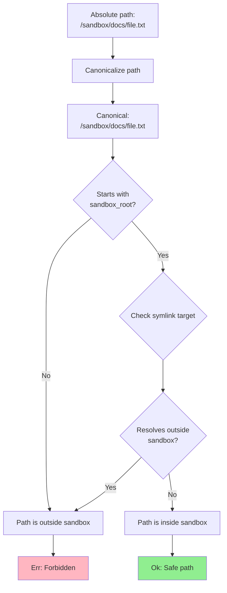
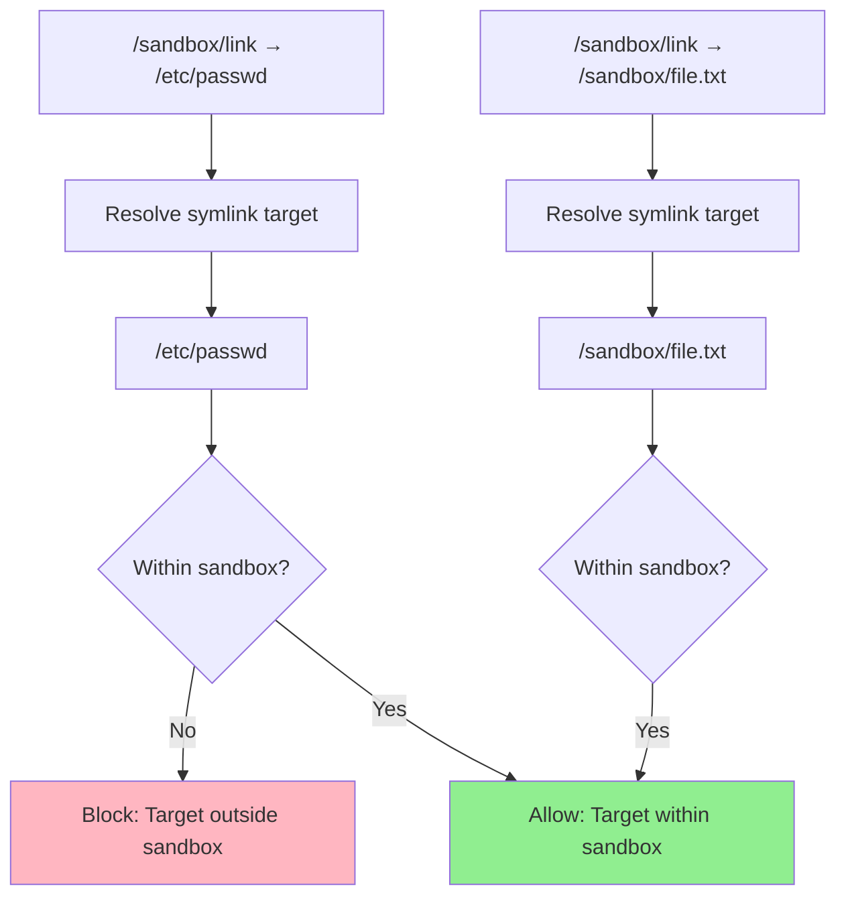
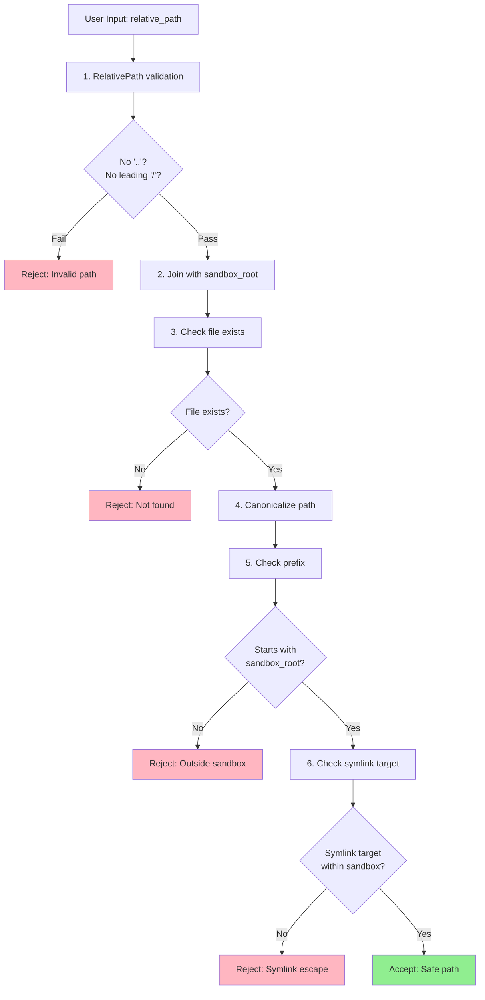

# PathSandbox Class Diagram

## Overview

The `PathSandbox` utility enforces filesystem boundaries to prevent directory traversal attacks by validating and resolving paths within a sandbox root.

## Class Diagram



## Initialization



## Properties

| Property | Type | Description |
|----------|------|-------------|
| `sandbox_root` | `PathBuf` | Canonicalized absolute path to sandbox root |

## Methods

| Method | Parameters | Return Type | Description |
|--------|------------|-------------|-------------|
| `new` | `sandbox_root: impl AsRef<Path>` | `Result<Self, InfrastructureError>` | Initialize sandbox with root directory |
| `resolve_path` | `relative: &RelativePath` | `Result<PathBuf, DomainError>` | Resolve relative path to absolute within sandbox |
| `is_within_sandbox` | `path: &Path` | `bool` | Check if path is within sandbox boundaries |
| `canonicalize_and_check` | `path: &Path` | `Result<PathBuf, DomainError>` | Canonicalize and verify path is within sandbox |
| `sandbox_root` | `&self` | `&Path` | Get sandbox root path |

## Path Resolution Process



## Boundary Checking



## Symlink Handling



## Path Traversal Prevention

| Attack Vector | Input | Result | Reason |
|---------------|-------|--------|--------|
| **Absolute path** | `/etc/passwd` | ❌ Rejected | `RelativePath` validation fails |
| **Parent traversal** | `../../../etc/passwd` | ❌ Rejected | `RelativePath` validation fails (contains `..`) |
| **Normalized traversal** | `docs/../../etc/passwd` | ❌ Rejected | `RelativePath` validation fails |
| **Symlink escape** | `link` → `/etc/passwd` | ❌ Rejected | Canonicalized path outside sandbox |
| **Valid relative** | `docs/file.txt` | ✅ Allowed | Within sandbox, no traversal |

## Usage Example

```rust
// Initialize sandbox
let sandbox = PathSandbox::new("/var/data/uploads")?;

// Resolve valid relative path
let relative = RelativePath::new("documents/report.pdf")?;
let absolute = sandbox.resolve_path(&relative)?;
assert_eq!(absolute, Path::new("/var/data/uploads/documents/report.pdf"));

// Check if path is within sandbox
assert!(sandbox.is_within_sandbox(Path::new("/var/data/uploads/file.txt")));
assert!(!sandbox.is_within_sandbox(Path::new("/etc/passwd")));

// Canonicalize and check
let path = Path::new("/var/data/uploads/../uploads/file.txt");
let canonical = sandbox.canonicalize_and_check(path)?;
assert_eq!(canonical, Path::new("/var/data/uploads/file.txt"));

// Path traversal attempt (rejected by RelativePath)
let result = RelativePath::new("../../../etc/passwd");
assert!(matches!(result, Err(ValidationError::ParentTraversal)));

// Symlink escape (rejected by sandbox)
// Given: /var/data/uploads/evil_link → /etc/passwd
let relative = RelativePath::new("evil_link")?;
let result = sandbox.resolve_path(&relative);
assert!(matches!(result, Err(DomainError::Forbidden(_))));
```

## Security Validation Steps



## Implementation Details

```rust
impl PathSandbox {
    pub fn resolve_path(&self, relative: &RelativePath) -> Result<PathBuf, DomainError> {
        // 1. Join sandbox root with relative path
        let full_path = self.sandbox_root.join(relative.as_path());
        
        // 2. Check if file exists
        if !full_path.exists() {
            return Err(DomainError::FileNotFound(full_path.display().to_string()));
        }
        
        // 3. Canonicalize (resolves symlinks, normalizes path)
        let canonical = full_path.canonicalize()
            .map_err(|e| DomainError::FileSystemError(e.to_string()))?;
        
        // 4. Verify canonical path is within sandbox
        if !self.is_within_sandbox(&canonical) {
            return Err(DomainError::Forbidden(
                format!("Path traversal attempt: {}", relative.as_path().display())
            ));
        }
        
        Ok(canonical)
    }
    
    pub fn is_within_sandbox(&self, path: &Path) -> bool {
        path.starts_with(&self.sandbox_root)
    }
}
```

## Testing

```rust
#[test]
fn test_resolve_valid_path() {
    let temp_dir = tempdir().unwrap();
    let sandbox = PathSandbox::new(temp_dir.path()).unwrap();
    
    // Create test file
    let file_path = temp_dir.path().join("test.txt");
    std::fs::write(&file_path, b"test").unwrap();
    
    let relative = RelativePath::new("test.txt").unwrap();
    let resolved = sandbox.resolve_path(&relative).unwrap();
    
    assert_eq!(resolved, file_path);
}

#[test]
fn test_reject_symlink_escape() {
    let temp_dir = tempdir().unwrap();
    let sandbox = PathSandbox::new(temp_dir.path()).unwrap();
    
    // Create symlink to /etc/passwd
    let link_path = temp_dir.path().join("evil_link");
    std::os::unix::fs::symlink("/etc/passwd", &link_path).unwrap();
    
    let relative = RelativePath::new("evil_link").unwrap();
    let result = sandbox.resolve_path(&relative);
    
    assert!(matches!(result, Err(DomainError::Forbidden(_))));
}

#[test]
fn test_is_within_sandbox() {
    let sandbox = PathSandbox::new("/var/data/uploads").unwrap();
    
    assert!(sandbox.is_within_sandbox(Path::new("/var/data/uploads/file.txt")));
    assert!(sandbox.is_within_sandbox(Path::new("/var/data/uploads/sub/file.txt")));
    assert!(!sandbox.is_within_sandbox(Path::new("/etc/passwd")));
    assert!(!sandbox.is_within_sandbox(Path::new("/var/data/other/file.txt")));
}
```

## Error Cases

| Scenario | Error | HTTP Status |
|----------|-------|-------------|
| File not found | `DomainError::FileNotFound` | 404 Not Found |
| Path outside sandbox | `DomainError::Forbidden` | 403 Forbidden |
| Symlink to external file | `DomainError::Forbidden` | 403 Forbidden |
| Permission denied | `DomainError::PermissionDenied` | 403 Forbidden |
| Invalid sandbox root | `InfrastructureError::InvalidConfig` | 500 Internal Error |

## Design Rationale

- **Defense in Depth**: Multiple layers of validation (value object + sandbox)
- **Canonicalization**: Resolves symlinks and normalizes paths for accurate checking
- **Explicit Boundaries**: Sandbox root is explicit and immutable
- **Security First**: Rejects on any suspicious pattern
- **Integration**: Works with `RelativePath` value object for end-to-end safety
- **Testable**: Easy to test with temporary directories
