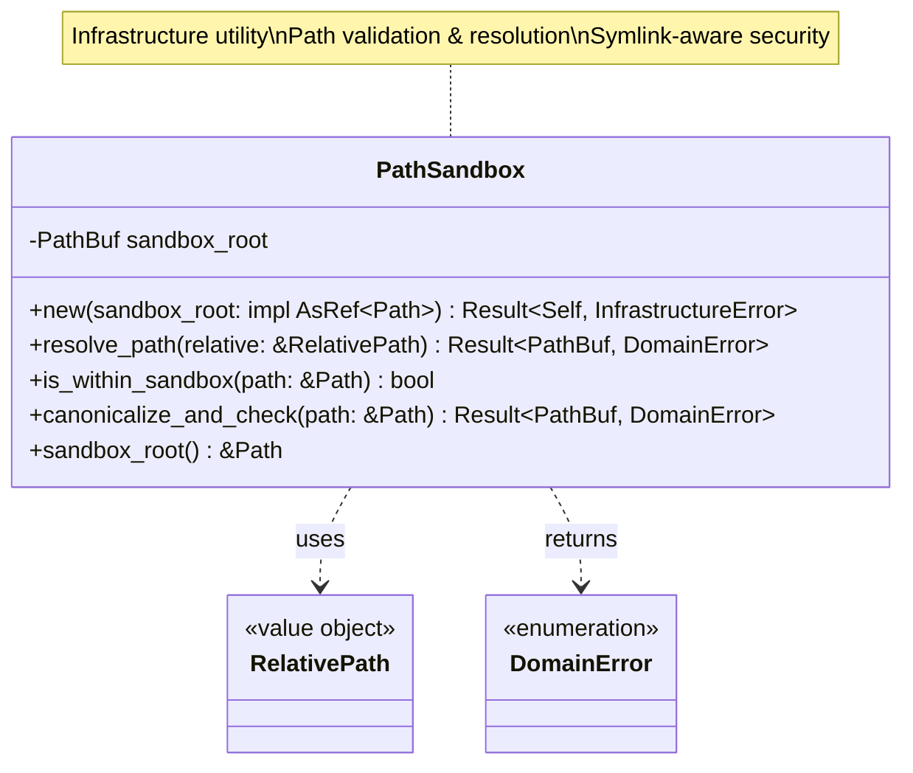
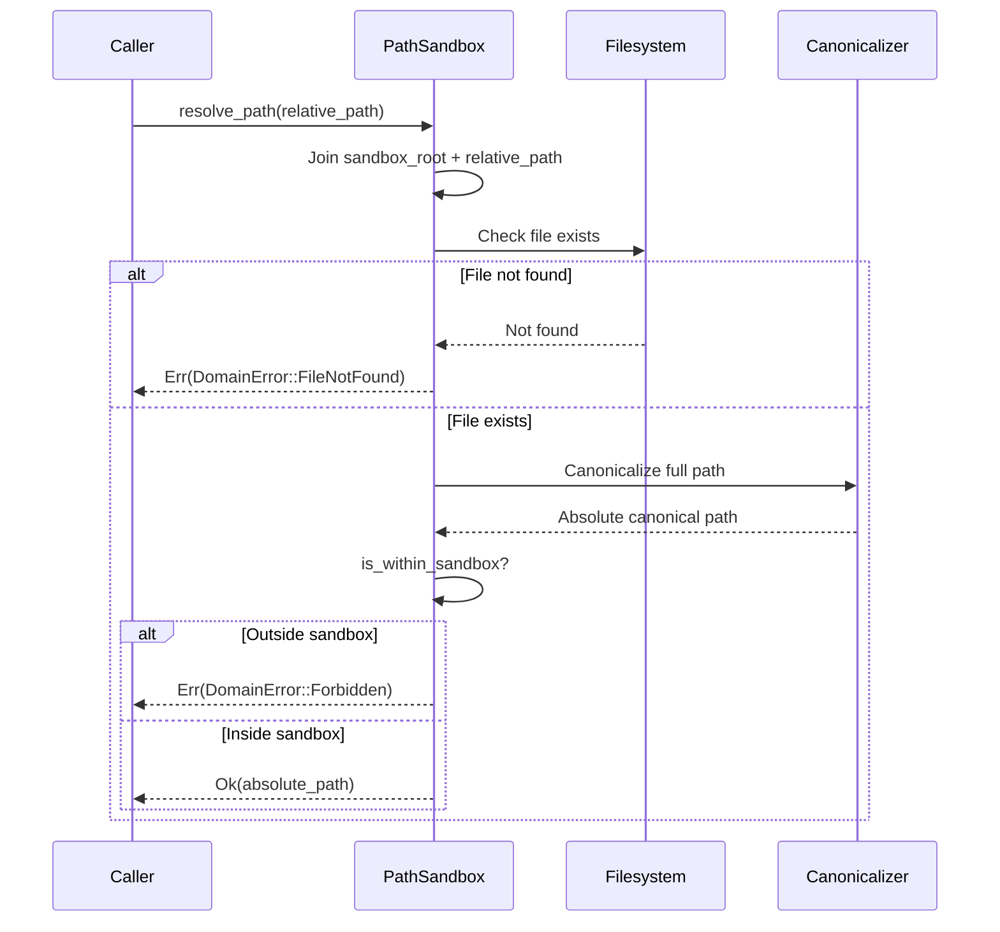
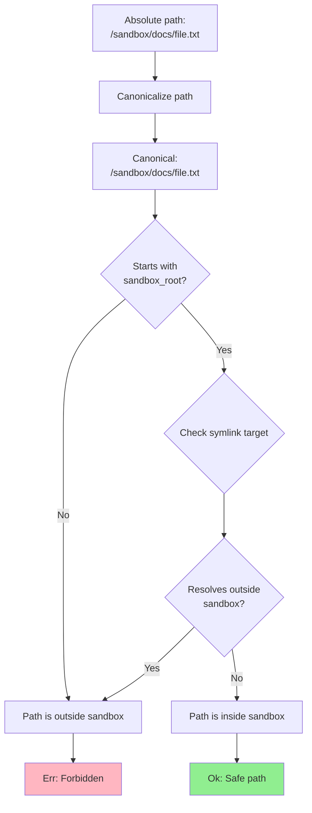
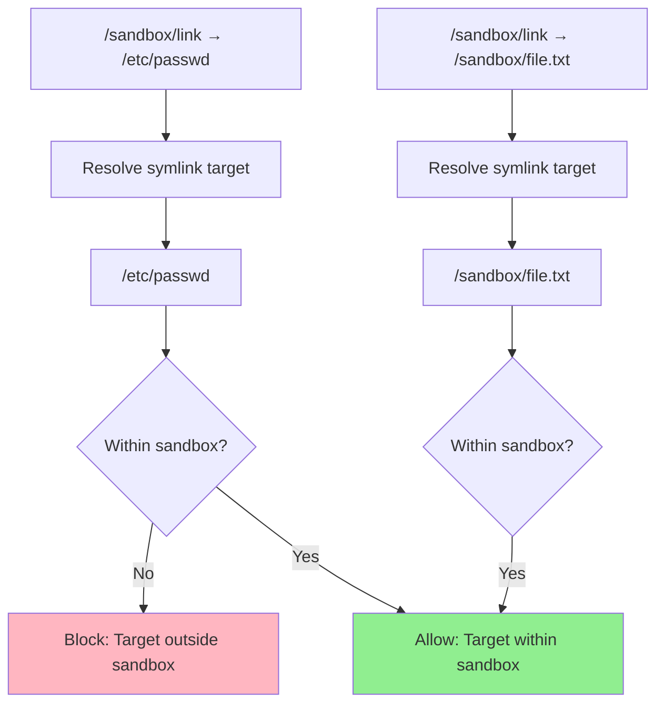

# PathSandbox Class Diagram

## Overview

The `PathSandbox` utility enforces filesystem boundaries to prevent directory traversal attacks by validating and resolving paths within a sandbox root.

## Class Diagram

## Initialization

## Properties

| Property | Type | Description |
|----------|------|-------------|
| `sandbox_root` | `PathBuf` | Canonicalized absolute path to sandbox root |

## Methods

| Method | Parameters | Return Type | Description |
|--------|------------|-------------|-------------|
| `new` | `sandbox_root: impl AsRef<Path>` | `Result<Self, InfrastructureError>` | Initialize sandbox with root directory |
| `resolve_path` | `relative: &RelativePath` | `Result<PathBuf, DomainError>` | Resolve relative path to absolute within sandbox |
| `is_within_sandbox` | `path: &Path` | `bool` | Check if path is within sandbox boundaries |
| `canonicalize_and_check` | `path: &Path` | `Result<PathBuf, DomainError>` | Canonicalize and verify path is within sandbox |
| `sandbox_root` | `&self` | `&Path` | Get sandbox root path |

## Path Resolution Process

## Boundary Checking

## Symlink Handling

## Path Traversal Prevention

| Attack Vector | Input | Result | Reason |
|---------------|-------|--------|--------|
| **Absolute path** | `/etc/passwd` | ❌ Rejected | `RelativePath` validation fails |
| **Parent traversal** | `../../../etc/passwd` | ❌ Rejected | `RelativePath` validation fails (contains `..`) |
| **Normalized traversal** | `docs/../../etc/passwd` | ❌ Rejected | `RelativePath` validation fails |
| **Symlink escape** | `link` → `/etc/passwd` | ❌ Rejected | Canonicalized path outside sandbox |
| **Valid relative** | `docs/file.txt` | ✅ Allowed | Within sandbox, no traversal |

## Usage Scenario

### Initialization

The PathSandbox is initialized with a path to the root directory that defines the security boundary. During initialization, it verifies that the directory exists and is accessible, then canonicalizes the path to ensure all subsequent boundary checks use absolute, normalized paths.

### Path Resolution

When resolving a path, the sandbox takes a RelativePath value object and joins it with the sandbox root. It then verifies the file exists, canonicalizes the full path to resolve any internal symlinks or relative components, and finally checks if the resulting absolute path still starts with the sandbox root.

### Boundary Verification

The sandbox provides a dedicated check to determine if any given path resides within its defined boundaries. This is used both during path resolution and as a general-purpose security check throughout the infrastructure layer.

## Implementation Details

The implementation of PathSandbox relies on several key filesystem operations:
1. **Joining**: Combines the sandbox root with the user-provided relative path.
2. **Existence Check**: Confirms the file exists before attempting more complex resolution.
3. **Canonicalization**: The core security step which resolves all symbolic links and dot-segments (`.` and `..`) to produce a definitive absolute path.
4. **Prefix Check**: A string-based comparison ensuring the canonical path begins with the canonical sandbox root.

## Testing Strategy

Testing the sandbox involves multiple scenarios to ensure no escape is possible:
- **Valid Resolution**: Confirms that normal files within the sandbox are correctly resolved.
- **Symlink Escapes**: Verifies that symlinks pointing to sensitive system files like `/etc/passwd` are detected and blocked.
- **Boundary Checks**: Ensures that both immediate children and deeply nested files are correctly identified as being within the sandbox.
- **Negative Cases**: Confirms that files in sister directories or parent directories are correctly rejected.

## Error Cases

| Scenario | Error | HTTP Status |
|----------|-------|-------------|
| File not found | `DomainError::FileNotFound` | 404 Not Found |
| Path outside sandbox | `DomainError::Forbidden` | 403 Forbidden |
| Symlink to external file | `DomainError::Forbidden` | 403 Forbidden |
| Permission denied | `DomainError::PermissionDenied` | 403 Forbidden |
| Invalid sandbox root | `InfrastructureError::InvalidConfig` | 500 Internal Error |

## Design Rationale

- **Defense in Depth**: Multiple layers of validation (value object + sandbox)
- **Canonicalization**: Resolves symlinks and normalizes paths for accurate checking
- **Explicit Boundaries**: Sandbox root is explicit and immutable
- **Security First**: Rejects on any suspicious pattern
- **Integration**: Works with `RelativePath` value object for end-to-end safety
- **Testable**: Easy to test with temporary directories
