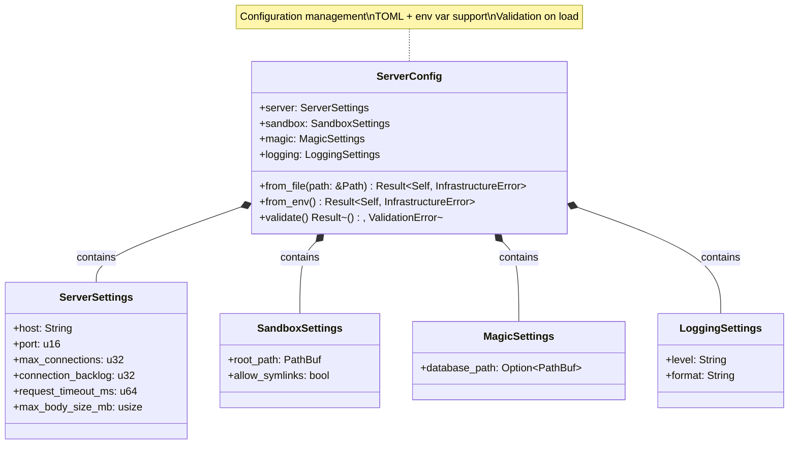
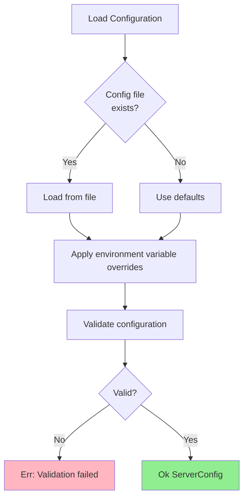
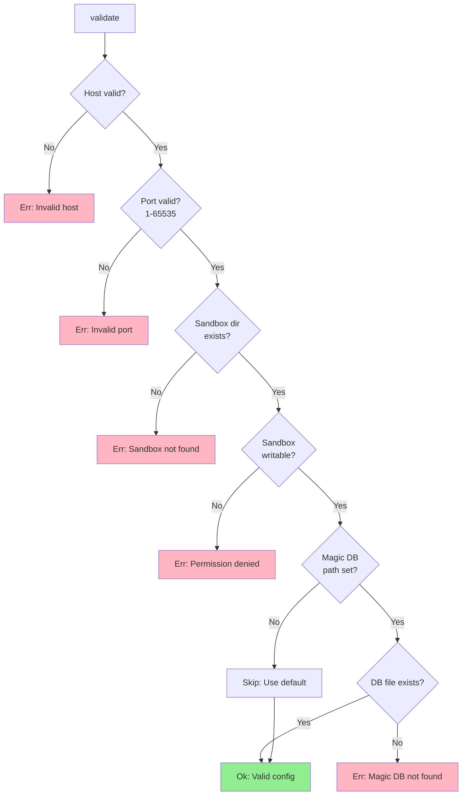
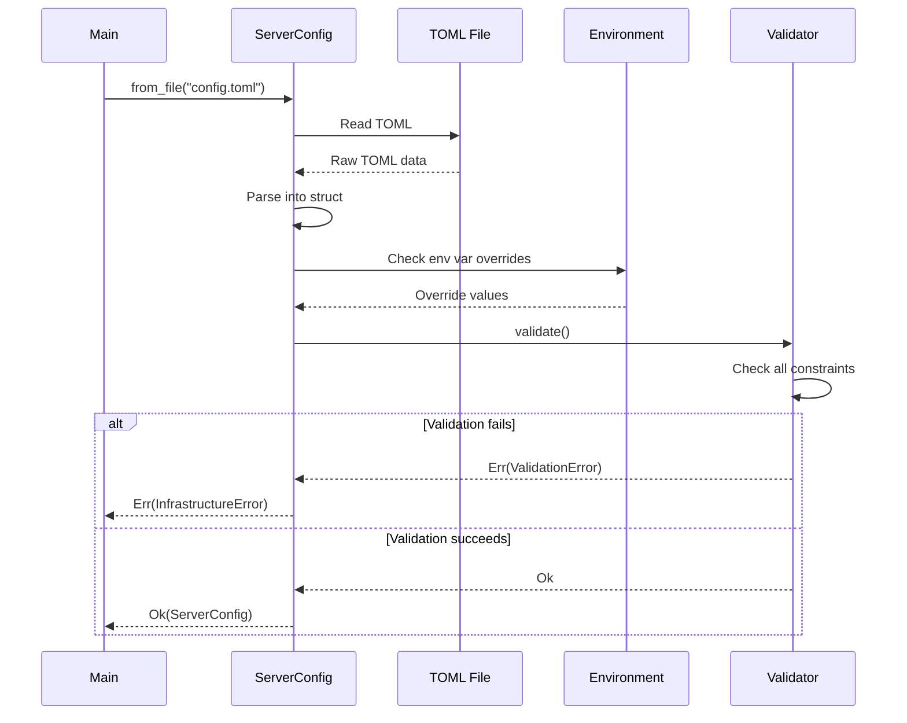

# ServerConfig Class Diagram

## Overview

The `ServerConfig` manages server configuration loading from TOML files and environment variables with validation.

## Class Diagram



## Configuration File Format

```toml
[server]
host = "0.0.0.0"
port = 8080
max_connections = 1000
connection_backlog = 1024
request_timeout_ms = 30000
max_body_size_mb = 100

[sandbox]
root_path = "/var/data/uploads"
allow_symlinks = false

[magic]
database_path = "/usr/share/misc/magic.mgc"  # Optional, uses default if omitted

[logging]
level = "info"
format = "json"
```

## Loading Priority



## Environment Variable Overrides

| Environment Variable | TOML Path | Type | Example |
|---------------------|-----------|------|---------|
| `SERVER_HOST` | `server.host` | String | `0.0.0.0` |
| `SERVER_PORT` | `server.port` | u16 | `8080` |
| `SERVER_MAX_CONNECTIONS` | `server.max_connections` | u32 | `1000` |
| `SERVER_REQUEST_TIMEOUT_MS` | `server.request_timeout_ms` | u64 | `30000` |
| `SANDBOX_ROOT_PATH` | `sandbox.root_path` | PathBuf | `/var/data/uploads` |
| `SANDBOX_ALLOW_SYMLINKS` | `sandbox.allow_symlinks` | bool | `false` |
| `MAGIC_DATABASE_PATH` | `magic.database_path` | PathBuf | `/usr/share/misc/magic.mgc` |
| `LOG_LEVEL` | `logging.level` | String | `info` |
| `LOG_FORMAT` | `logging.format` | String | `json` |

## Validation Rules



## ServerSettings Constraints

| Field | Type | Min | Max | Default |
|-------|------|-----|-----|---------|
| `host` | `String` | - | - | `0.0.0.0` |
| `port` | `u16` | 1 | 65535 | `8080` |
| `max_connections` | `u32` | 1 | 100000 | `1000` |
| `connection_backlog` | `u32` | 1 | 65535 | `1024` |
| `request_timeout_ms` | `u64` | 100 | 300000 | `30000` |
| `max_body_size_mb` | `usize` | 1 | 1000 | `100` |

## Usage Example

```rust
// Load from file
let config = ServerConfig::from_file(Path::new("config/config.toml"))?;

// Load from environment (with defaults)
let config = ServerConfig::from_env()?;

// Access settings
println!("Server listening on {}:{}", config.server.host, config.server.port);
println!("Sandbox root: {:?}", config.sandbox.root_path);

// Validate
config.validate()?;

// Use in application
let sandbox = PathSandbox::new(&config.sandbox.root_path)?;
let repository = if let Some(db_path) = &config.magic.database_path {
    LibmagicRepository::with_database(db_path.to_str().unwrap())?
} else {
    LibmagicRepository::new()?
};
```

## Configuration Loading Sequence



## Error Handling

| Error Type | Cause | Recovery |
|------------|-------|----------|
| `FileNotFound` | Config file missing | Use `from_env()` with defaults |
| `ParseError` | Invalid TOML syntax | Fix TOML file |
| `ValidationError` | Invalid values | Fix config or environment |
| `PermissionDenied` | Cannot read config file | Check file permissions |
| `InvalidPath` | Sandbox path invalid | Create directory, check path |

## Default Configuration

```rust
impl Default for ServerConfig {
    fn default() -> Self {
        ServerConfig {
            server: ServerSettings {
                host: "0.0.0.0".to_string(),
                port: 8080,
                max_connections: 1000,
                connection_backlog: 1024,
                request_timeout_ms: 30000,
                max_body_size_mb: 100,
            },
            sandbox: SandboxSettings {
                root_path: PathBuf::from("/var/data/uploads"),
                allow_symlinks: false,
            },
            magic: MagicSettings {
                database_path: None, // Use libmagic default
            },
            logging: LoggingSettings {
                level: "info".to_string(),
                format: "json".to_string(),
            },
        }
    }
}
```

## Testing

```rust
#[test]
fn test_load_from_file() {
    let config = ServerConfig::from_file(Path::new("config/test.toml")).unwrap();
    assert_eq!(config.server.port, 8080);
    assert_eq!(config.server.host, "0.0.0.0");
}

#[test]
fn test_env_var_override() {
    std::env::set_var("SERVER_PORT", "9090");
    let config = ServerConfig::from_env().unwrap();
    assert_eq!(config.server.port, 9090);
    std::env::remove_var("SERVER_PORT");
}

#[test]
fn test_validation_invalid_port() {
    let mut config = ServerConfig::default();
    config.server.port = 0; // Invalid
    let result = config.validate();
    assert!(matches!(result, Err(ValidationError::InvalidPort(_))));
}

#[test]
fn test_validation_sandbox_not_found() {
    let mut config = ServerConfig::default();
    config.sandbox.root_path = PathBuf::from("/nonexistent/path");
    let result = config.validate();
    assert!(matches!(result, Err(ValidationError::SandboxNotFound(_))));
}
```

## Serde Integration

```rust
use serde::{Deserialize, Serialize};

#[derive(Debug, Clone, Deserialize, Serialize)]
pub struct ServerConfig {
    pub server: ServerSettings,
    pub sandbox: SandboxSettings,
    pub magic: MagicSettings,
    pub logging: LoggingSettings,
}

impl ServerConfig {
    pub fn from_file(path: &Path) -> Result<Self, InfrastructureError> {
        let contents = std::fs::read_to_string(path)?;
        let config: ServerConfig = toml::from_str(&contents)?;
        config.validate()?;
        Ok(config)
    }
}
```

## Deployment Scenarios

### Development

```toml
[server]
host = "127.0.0.1"
port = 8080

[logging]
level = "debug"
format = "pretty"
```

### Production

```toml
[server]
host = "0.0.0.0"
port = 8080
max_connections = 10000

[sandbox]
root_path = "/var/data/uploads"
allow_symlinks = false

[logging]
level = "info"
format = "json"
```

### Docker

```bash
# Use environment variables
docker run \
  -e SERVER_HOST=0.0.0.0 \
  -e SERVER_PORT=8080 \
  -e SANDBOX_ROOT_PATH=/data \
  -v /host/data:/data \
  magicer:latest
```

## Design Rationale

- **Layered Configuration**: File → Env vars → Validation (priority order)
- **Type Safety**: Strong types prevent runtime errors
- **Validation**: Early failure on invalid configuration
- **Flexibility**: TOML files for complex config, env vars for simple overrides
- **Defaults**: Sensible defaults for all settings
- **Documentation**: Self-documenting via example TOML file
- **Testability**: Easy to test with in-memory config or test files
