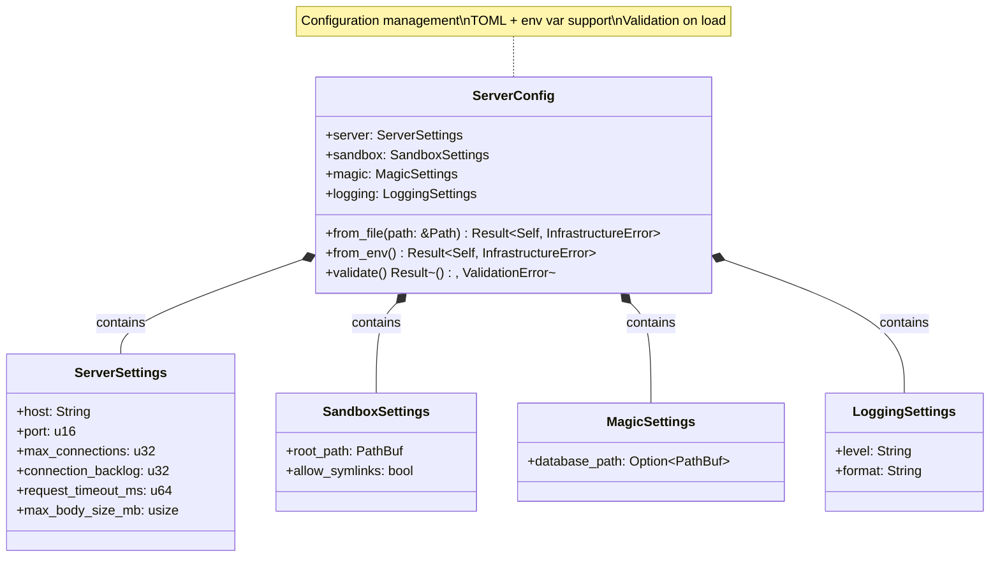

# ServerConfig Class Diagram <!-- omit in toc -->

- [Overview](#overview)
- [Class Diagram](#class-diagram)
- [Configuration Specification](#configuration-specification)
  - [Server Settings](#server-settings)
  - [Sandbox Settings](#sandbox-settings)
  - [Magic Settings](#magic-settings)
  - [Logging Settings](#logging-settings)
- [Usage Scenario](#usage-scenario)
  - [Loading Configuration](#loading-configuration)
  - [Validation during Startup](#validation-during-startup)
  - [Dependency Injection](#dependency-injection)
- [Testing Strategy](#testing-strategy)
- [Design Rationale](#design-rationale)

---

## Overview

The `ServerConfig` manages server configuration loading from TOML files and environment variables with validation.

## Class Diagram

## Configuration Specification

### Server Settings

| Field | Type | Description |
|-------|------|-------------|
| `host` | String | IP address to bind (e.g., "0.0.0.0") |
| `port` | Unsigned 16-bit | TCP port for the HTTP server |
| `max_connections` | Unsigned 32-bit | Maximum concurrent active connections |
| `connection_backlog` | Unsigned 32-bit | OS-level listen queue size |
| `request_timeout_ms` | Unsigned 64-bit | Request processing timeout in milliseconds |
| `max_body_size_mb` | Unsigned 64-bit | Maximum allowed request body size in MB |

### Sandbox Settings

| Field | Type | Description |
|-------|------|-------------|
| `root_path` | Path | Root directory for file boundary enforcement |
| `allow_symlinks` | Boolean | Whether to allow resolution of internal symlinks |

### Magic Settings

| Field | Type | Description |
|-------|------|-------------|
| `database_path` | Optional Path | Path to custom magic database file |

### Logging Settings

| Field | Type | Description |
|-------|------|-------------|
| `level` | String | Log verbosity (error, warn, info, debug, trace) |
| `format` | String | Output format (json, pretty, compact) |

## Usage Scenario

### Loading Configuration

The server configuration can be loaded from multiple sources with a defined priority. Typically, the system attempts to read a TOML file from a standard location (e.g., `config/config.toml`). If any environment variables are present, they override the values found in the file. Finally, if any settings are still missing, sensible defaults are applied.

### Validation during Startup

Once the configuration is loaded, it undergoes a strict validation process. The system ensures that:
- Port numbers are within the valid range (1-65535).
- The sandbox root directory exists and is accessible.
- If a custom magic database is specified, the file is readable.
- All numeric limits are positive and within reasonable bounds.

Failure to validate results in an immediate startup error, preventing the server from running in an inconsistent state.

### Dependency Injection

The validated configuration is wrapped in an atomic reference counter and included in the application state. This allows handlers and middleware to access configuration parameters efficiently across multiple threads.

## Testing Strategy

Testing the configuration manager involves verifying the loading and priority logic:
- **File Loading**: Confirms that valid TOML files are correctly parsed into the internal structures.
- **Environment Overrides**: Ensures that setting an environment variable like `SERVER_PORT` correctly overrides the file-based value.
- **Invalid Values**: Verifies that out-of-range ports or non-existent paths trigger validation errors.
- **Defaults**: Confirms that the system provides usable default values when no configuration is provided.

## Design Rationale

- **Layered Configuration**: File → Env vars → Validation (priority order)
- **Type Safety**: Strong types prevent runtime errors
- **Validation**: Early failure on invalid configuration
- **Flexibility**: TOML files for complex config, env vars for simple overrides
- **Defaults**: Sensible defaults for all settings
- **Documentation**: Self-documenting via example TOML file
- **Testability**: Easy to test with in-memory config or test files
