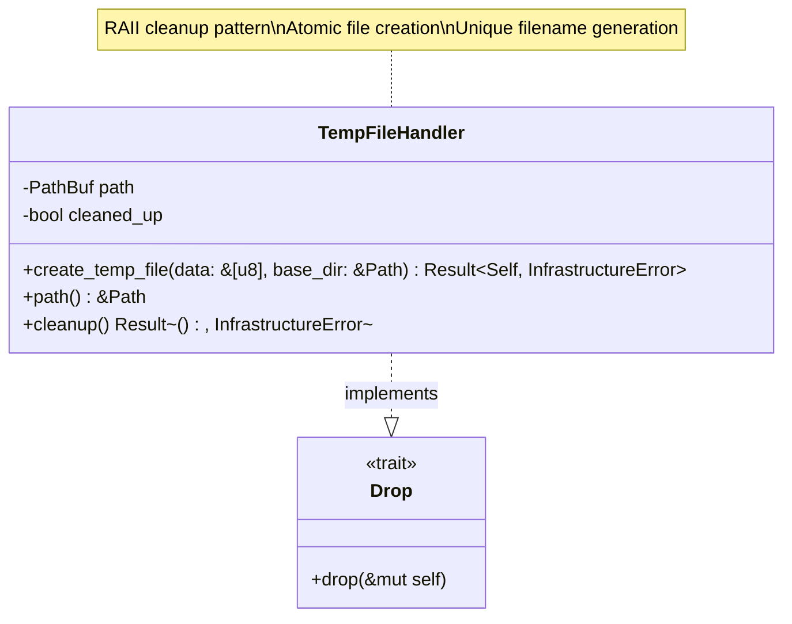
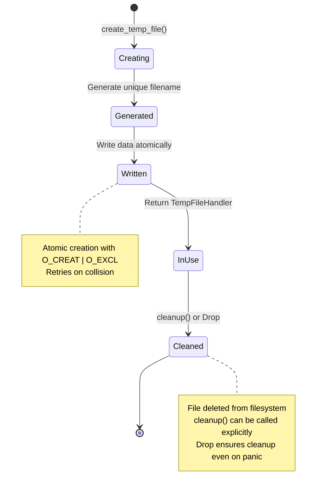
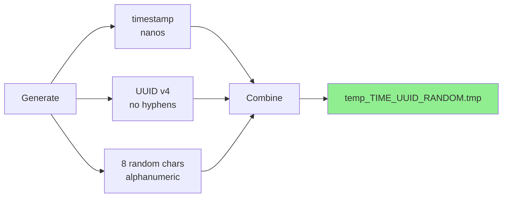
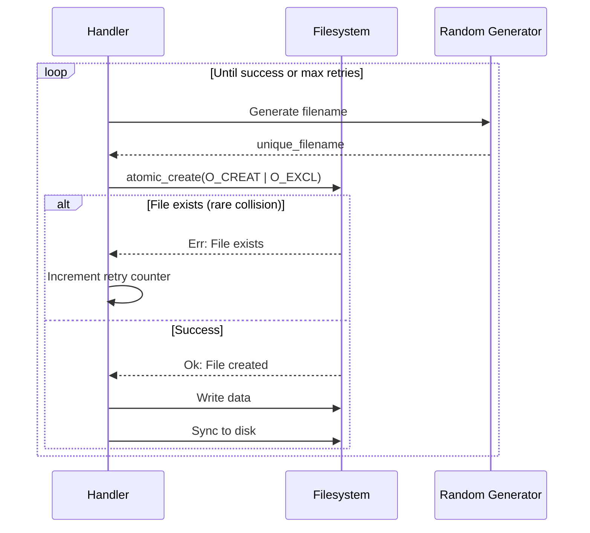
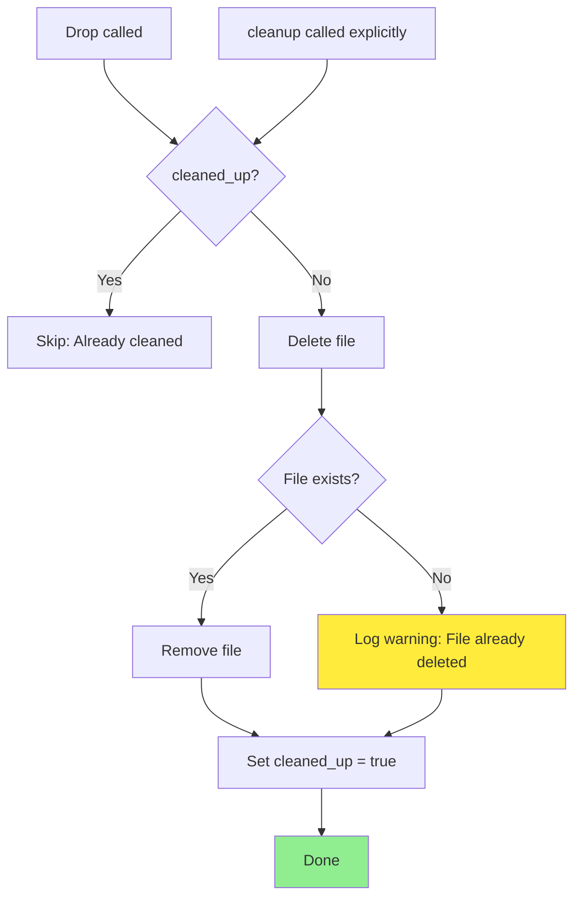
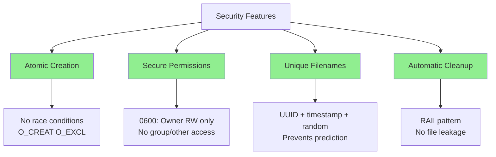

# TempFileHandler Class Diagram

## Overview

The `TempFileHandler` manages temporary files for content-based magic analysis, ensuring atomic creation, unique naming, and automatic cleanup.

## Class Diagram



## Lifecycle



## Properties

| Property | Type | Description |
|----------|------|-------------|
| `path` | `PathBuf` | Absolute path to temporary file |
| `cleaned_up` | `bool` | Flag to prevent double cleanup |

## Methods

| Method | Parameters | Return Type | Description |
|--------|------------|-------------|-------------|
| `create_temp_file` | `data: &[u8], base_dir: &Path` | `Result<Self, InfrastructureError>` | Create temp file with unique name, write data |
| `path` | `&self` | `&Path` | Get path to temporary file |
| `cleanup` | `&mut self` | `Result<(), InfrastructureError>` | Explicitly delete file (called automatically on drop) |

## File Creation Process


## Unique Filename Generation

```
Format: temp_{timestamp}_{uuid}_{random}.tmp

Components:
- timestamp: Unix timestamp in nanoseconds
- uuid: UUID v4 (without hyphens)
- random: 8 random alphanumeric characters

Example: temp_1707664200123456789_550e8400e29b41d4a716446655440000_a7b3c9d2.tmp
```



## Atomic File Creation

```rust
use std::fs::OpenOptions;
use std::os::unix::fs::OpenOptionsExt;

fn atomic_create(path: &Path) -> Result<File, std::io::Error> {
    OpenOptions::new()
        .write(true)
        .create_new(true) // Fails if file exists (atomic check)
        .mode(0o600)      // Owner read/write only
        .open(path)
}
```

| Flag | Purpose | Behavior |
|------|---------|----------|
| `create_new(true)` | Atomic creation | Fails if file already exists (prevents race conditions) |
| `mode(0o600)` | Secure permissions | Owner read/write only (no group/other access) |
| `write(true)` | Write access | Required to write data |

## Collision Handling



## Cleanup Behavior



## Usage Example

```rust
use std::path::Path;

// Create temporary file with data
let data = b"Test file content";
let base_dir = Path::new("/tmp");
let temp_file = TempFileHandler::create_temp_file(data, base_dir)?;

// Use the file
let path = temp_file.path();
println!("Temp file created at: {}", path.display());

// Analyze with libmagic
let result = repository.analyze_file(path)?;

// Explicit cleanup (optional, drop does this automatically)
temp_file.cleanup()?;

// Drop cleanup example
{
    let temp = TempFileHandler::create_temp_file(data, base_dir)?;
    // Use temp file...
} // temp is dropped here, file is automatically deleted
```

## Error Handling

| Error Condition | Error Type | Recovery |
|-----------------|------------|----------|
| Base directory doesn't exist | `InfrastructureError::InvalidPath` | Create directory first |
| Permission denied | `InfrastructureError::PermissionDenied` | Check directory permissions |
| Disk full | `InfrastructureError::IoError` | Free disk space |
| Max retries exceeded | `InfrastructureError::MaxRetriesExceeded` | Rare, investigate |
| Cleanup failure | `InfrastructureError::IoError` | Log warning, continue |

## Security Features



## Performance Considerations

| Aspect | Impact | Mitigation |
|--------|--------|------------|
| **Collision Probability** | Very low (UUID + timestamp + random) | Retry mechanism handles rare cases |
| **File I/O** | Disk write for every request | Use tmpfs (`/dev/shm`) for performance |
| **Cleanup Overhead** | One `unlink()` syscall | Negligible, O(1) operation |
| **Max Retries** | 10 attempts maximum | Sufficient for even high collision rates |

## Testing

```rust
#[test]
fn test_create_temp_file() {
    let temp_dir = tempdir().unwrap();
    let data = b"test data";
    
    let temp_file = TempFileHandler::create_temp_file(data, temp_dir.path()).unwrap();
    
    // File exists
    assert!(temp_file.path().exists());
    
    // Correct permissions (Unix only)
    #[cfg(unix)]
    {
        use std::os::unix::fs::PermissionsExt;
        let metadata = std::fs::metadata(temp_file.path()).unwrap();
        assert_eq!(metadata.permissions().mode() & 0o777, 0o600);
    }
    
    // Correct content
    let content = std::fs::read(temp_file.path()).unwrap();
    assert_eq!(content, data);
}

#[test]
fn test_automatic_cleanup() {
    let temp_dir = tempdir().unwrap();
    let data = b"test data";
    let path = {
        let temp_file = TempFileHandler::create_temp_file(data, temp_dir.path()).unwrap();
        temp_file.path().to_path_buf()
    }; // temp_file dropped here
    
    // File should be deleted
    assert!(!path.exists());
}

#[test]
fn test_explicit_cleanup() {
    let temp_dir = tempdir().unwrap();
    let data = b"test data";
    
    let mut temp_file = TempFileHandler::create_temp_file(data, temp_dir.path()).unwrap();
    let path = temp_file.path().to_path_buf();
    
    // Explicit cleanup
    temp_file.cleanup().unwrap();
    
    // File should be deleted
    assert!(!path.exists());
}

#[test]
fn test_unique_filenames() {
    let temp_dir = tempdir().unwrap();
    let data = b"test";
    
    let temp1 = TempFileHandler::create_temp_file(data, temp_dir.path()).unwrap();
    let temp2 = TempFileHandler::create_temp_file(data, temp_dir.path()).unwrap();
    
    // Different filenames
    assert_ne!(temp1.path(), temp2.path());
}
```

## Integration with Use Cases

```rust
// In AnalyzeContentUseCase
impl AnalyzeContentUseCase {
    pub fn execute(&self, request: AnalyzeContentRequest) -> Result<MagicResponse, ApplicationError> {
        // Create temporary file
        let temp_file = TempFileHandler::create_temp_file(
            request.content(),
            &self.temp_dir
        )?;
        
        // Analyze file
        let result = self.repository.analyze_file(temp_file.path())?;
        
        // temp_file dropped here, automatically cleaned up
        
        Ok(MagicResponse::from(result))
    }
}
```

## Configuration

```toml
[server]
temp_dir = "/dev/shm/magicer"  # Fast tmpfs for temp files
max_temp_file_retries = 10      # Max filename collision retries
```

## Design Rationale

- **RAII Pattern**: Automatic cleanup via `Drop` prevents file leaks
- **Atomic Creation**: `O_CREAT | O_EXCL` prevents race conditions
- **Unique Names**: Collision-resistant filename generation (timestamp + UUID + random)
- **Secure Permissions**: `0600` protects file contents from other users
- **Explicit Cleanup**: Optional `cleanup()` for early deletion
- **Error Recovery**: Retry mechanism handles rare collisions
- **Testability**: Easy to test with temporary directories
