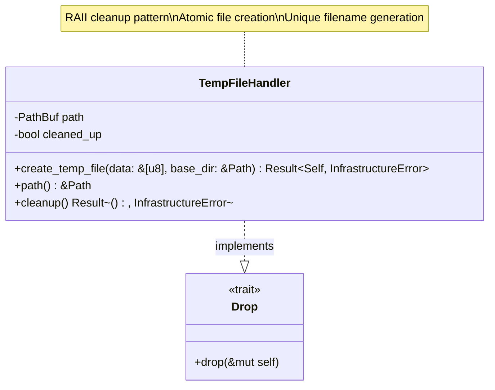
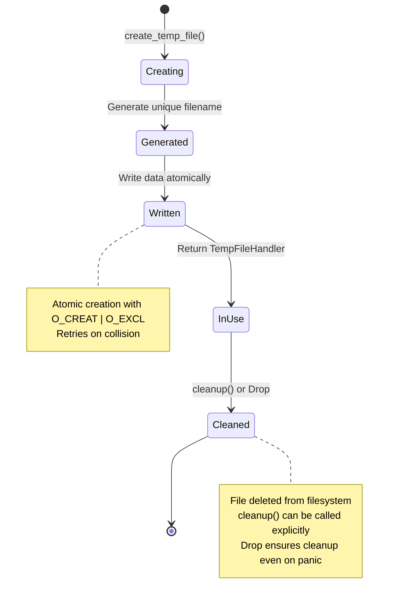
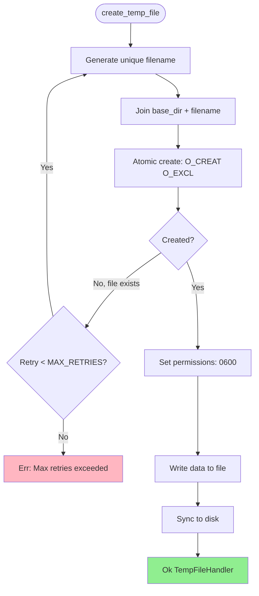
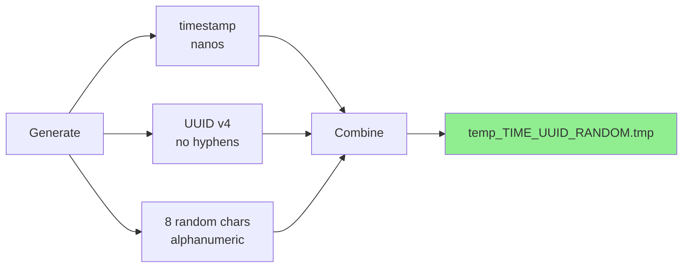

# TempFileHandler Class Diagram

## Overview

The `TempFileHandler` manages temporary files for content-based magic analysis, ensuring atomic creation, unique naming, and automatic cleanup.

## Class Diagram



## Lifecycle



## Properties

| Property | Type | Description |
|----------|------|-------------|
| `path` | `PathBuf` | Absolute path to temporary file |
| `cleaned_up` | `bool` | Flag to prevent double cleanup |

## Methods

| Method | Parameters | Return Type | Description |
|--------|------------|-------------|-------------|
| `create_temp_file` | `data: &[u8], base_dir: &Path` | `Result<Self, InfrastructureError>` | Create temp file with unique name, write data |
| `path` | `&self` | `&Path` | Get path to temporary file |
| `cleanup` | `&mut self` | `Result<(), InfrastructureError>` | Explicitly delete file (called automatically on drop) |

## File Creation Process



## Unique Filename Generation

```
Format: temp_{timestamp}_{uuid}_{random}.tmp

Components:
- timestamp: Unix timestamp in nanoseconds
- uuid: UUID v4 (without hyphens)
- random: 8 random alphanumeric characters

Example: temp_1707664200123456789_550e8400e29b41d4a716446655440000_a7b3c9d2.tmp
```



## Atomic File Creation

The handler ensures that temporary files are created securely and without race conditions. It uses specific system flags to guarantee that:
1. **Exclusivity**: The file is created only if it does not already exist. If a file with the same name is found, the creation fails atomically, allowing the handler to retry with a new name.
2. **Permissions**: Files are created with restrictive permissions (read/write for the owner only, typically represented as mode 0600).
3. **Atomic check-and-create**: The existence check and the file creation happen as a single uninterruptible operation at the kernel level.

## Usage Scenario

### Creating a Temporary File

The primary way to use the handler is by calling the creation method with the binary data and a target directory. The handler generates a unique name, creates the file atomically, writes the data, and returns an instance that manages the file's lifecycle.

### Accessing the Path

Once created, the absolute path to the temporary file can be retrieved for use with other system components, such as the libmagic repository.

### Automatic and Explicit Cleanup

The handler implements the Resource Acquisition Is Initialization (RAII) pattern. When the handler instance goes out of scope, the temporary file is automatically deleted from the filesystem. Cleanup can also be triggered explicitly if the file is no longer needed before the instance is dropped.

## Testing Strategy

The testing suite for TempFileHandler covers several critical behaviors:
- **Existence and Content**: Verifies that the file is actually created and contains the exact bytes provided.
- **Security Permissions**: Confirms that the file is created with restricted access (owner-only).
- **RAII Lifecycle**: Ensures that files are correctly removed when the handler is dropped, even if a panic occurs.
- **Uniqueness**: Validates that multiple concurrent requests result in distinct filenames without collisions.

## Integration with Use Cases

In application use cases, the TempFileHandler is used to facilitate analysis of uploaded content that requires a filesystem path. The use case creates the temporary file, passes its path to the repository, and then allows the handler to naturally clean up the file when the operation is complete.

## Configuration

```toml
[server]
temp_dir = "/dev/shm/magicer"  # Fast tmpfs for temp files
max_temp_file_retries = 10      # Max filename collision retries
```

## Design Rationale

- **RAII Pattern**: Automatic cleanup via `Drop` prevents file leaks
- **Atomic Creation**: `O_CREAT | O_EXCL` prevents race conditions
- **Unique Names**: Collision-resistant filename generation (timestamp + UUID + random)
- **Secure Permissions**: `0600` protects file contents from other users
- **Explicit Cleanup**: Optional `cleanup()` for early deletion
- **Error Recovery**: Retry mechanism handles rare collisions
- **Testability**: Easy to test with temporary directories
