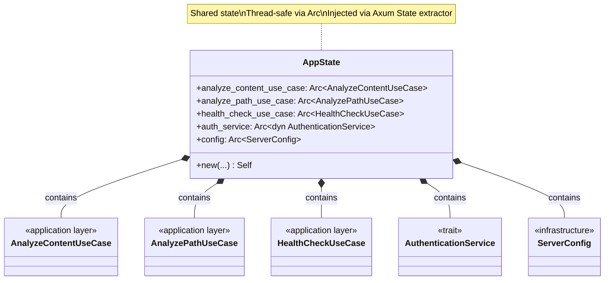
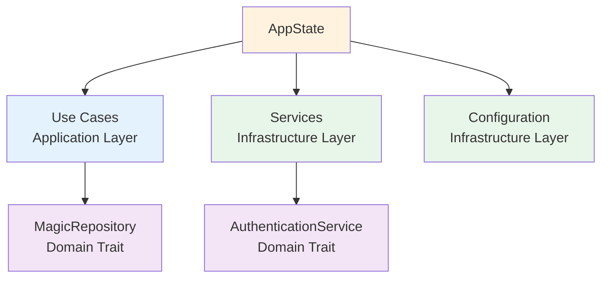

# AppState Class Diagram

## Overview

The `AppState` struct holds shared application state, including use case instances and services, injected into handlers via Axum's `State` extractor.

## Class Diagram

## Properties

| Property | Type | Description | Usage |
|----------|------|-------------|-------|
| `analyze_content_use_case` | `Arc<AnalyzeContentUseCase>` | Content analysis use case | `analyze_content_handler` |
| `analyze_path_use_case` | `Arc<AnalyzePathUseCase>` | Path-based analysis use case | `analyze_path_handler` |
| `health_check_use_case` | `Arc<HealthCheckUseCase>` | Health check use case | `ping_handler` |
| `auth_service` | `Arc<dyn AuthenticationService>` | Authentication service | Auth middleware |
| `config` | `Arc<ServerConfig>` | Server configuration | Various handlers/middleware |

## State Initialization and Construction

The application state is constructed during the server startup process. It gathers all initialized infrastructure components and application use cases into a single structure. To ensure this state can be safely shared across multiple concurrent request handlers, it is wrapped in an atomic reference counter. This approach provides efficient, read-only access to shared dependencies without the overhead of locks.

## Usage in Handlers and Middleware

Handlers and middleware access the application state through a dedicated extraction mechanism provided by the web framework. This allows them to:
- **Execute Use Cases**: Directly call business logic methods.
- **Access Configuration**: Retrieve system limits and paths.
- **Verify Credentials**: Use the authentication service for security checks.

The extraction process is type-safe and handles the necessary cloning of reference counters automatically.

## Thread Safety and Performance

The use of atomic reference counters (`Arc`) is critical for the server's concurrent architecture:
- **Shared Access**: Multiple threads can hold a reference to the same state instance.
- **Zero-Copy**: Only the reference counter is incremented when state is "cloned" for a request.
- **Immutability**: Once initialized, the state is treated as immutable, eliminating data races.

## Dependencies and Layering

The AppState serves as the integration point for all architectural layers:
- **Application Layer**: Holds use case instances.
- **Infrastructure Layer**: Holds concrete service implementations and configuration.
- **Domain Layer**: Holds references to repository and service traits.

This centralized structure makes dependencies explicit and simplifies the testing process by allowing the injection of mock objects into the state.

## Dependencies

## Design Rationale

- **Centralized State**: All shared dependencies in one place
- **Thread-Safe**: `Arc` enables safe concurrent access
- **Type-Safe**: Axum extractors provide compile-time guarantees
- **Testable**: Easy to create test states with mock dependencies
- **Immutable**: State is immutable after initialization (no locks needed)
- **Explicit Dependencies**: All dependencies visible in state struct
- **Cloneable**: `Clone` trait allows Axum to clone state for each request
