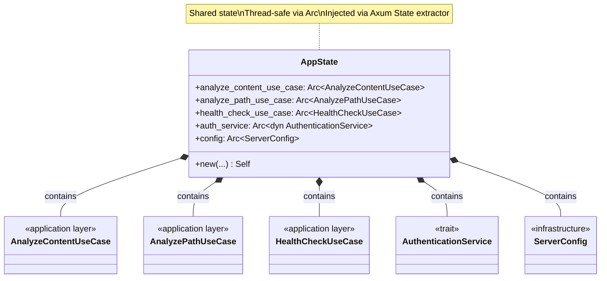
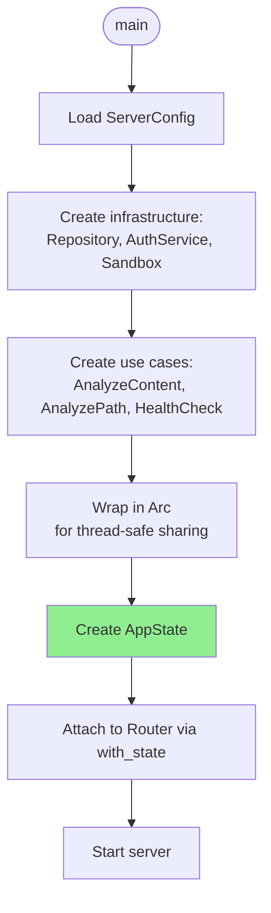
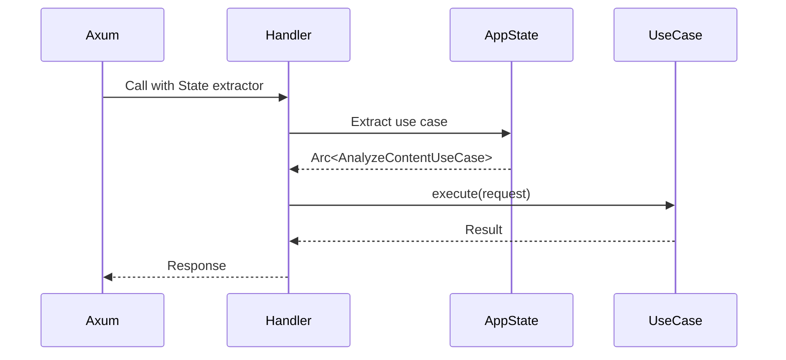
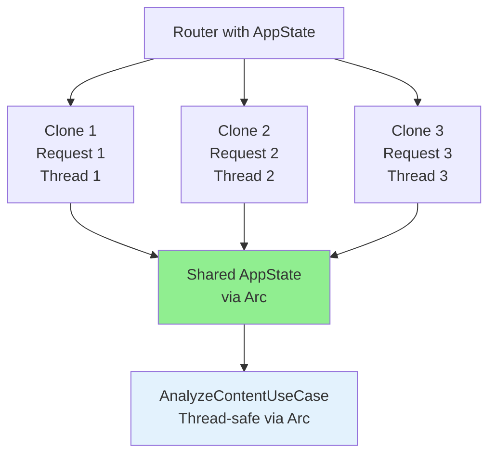
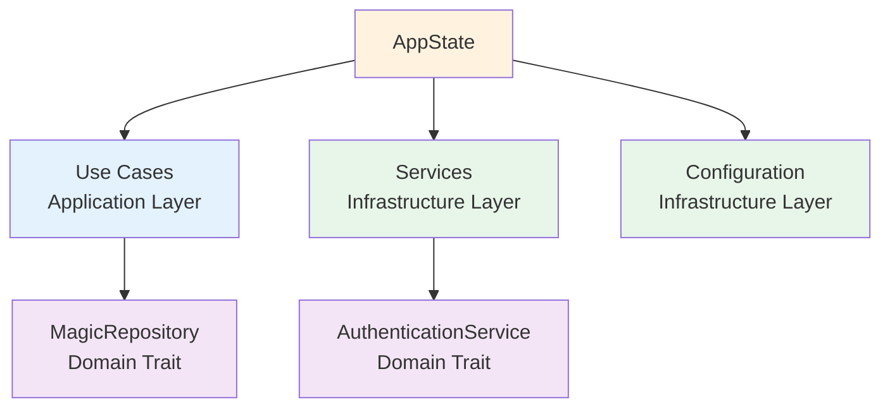

# AppState Class Diagram

## Overview

The `AppState` struct holds shared application state, including use case instances and services, injected into handlers via Axum's `State` extractor.

## Class Diagram



## Properties

| Property | Type | Description | Usage |
|----------|------|-------------|-------|
| `analyze_content_use_case` | `Arc<AnalyzeContentUseCase>` | Content analysis use case | `analyze_content_handler` |
| `analyze_path_use_case` | `Arc<AnalyzePathUseCase>` | Path-based analysis use case | `analyze_path_handler` |
| `health_check_use_case` | `Arc<HealthCheckUseCase>` | Health check use case | `ping_handler` |
| `auth_service` | `Arc<dyn AuthenticationService>` | Authentication service | Auth middleware |
| `config` | `Arc<ServerConfig>` | Server configuration | Various handlers/middleware |

## State Initialization



## Construction

```rust
impl AppState {
    pub fn new(
        analyze_content_use_case: Arc<AnalyzeContentUseCase>,
        analyze_path_use_case: Arc<AnalyzePathUseCase>,
        health_check_use_case: Arc<HealthCheckUseCase>,
        auth_service: Arc<dyn AuthenticationService>,
        config: Arc<ServerConfig>,
    ) -> Self {
        Self {
            analyze_content_use_case,
            analyze_path_use_case,
            health_check_use_case,
            auth_service,
            config,
        }
    }
}
```

## Usage in Handlers

```rust
// In handler signatures
pub async fn analyze_content_handler(
    State(state): State<Arc<AppState>>,  // Extract entire state
    Query(query): Query<FilenameQuery>,
    body: Bytes,
) -> Result<Json<MagicResponse>, (StatusCode, Json<ErrorResponse>)> {
    // Use specific use case from state
    state.analyze_content_use_case.execute(/* ... */)?;
    
    // Access config if needed
    let max_size = state.config.server.max_body_size_mb;
    
    // ...
}

// Alternative: Extract specific use case directly
pub async fn analyze_content_handler(
    State(use_case): State<Arc<AnalyzeContentUseCase>>,  // Extract specific field
    Query(query): Query<FilenameQuery>,
    body: Bytes,
) -> Result<Json<MagicResponse>, (StatusCode, Json<ErrorResponse>)> {
    use_case.execute(/* ... */)?;
    // ...
}
```

## State Extraction



## Thread Safety



**Why `Arc`?**
- Axum handlers are called concurrently across multiple threads
- `Arc` (Atomic Reference Counting) enables thread-safe sharing
- Each thread gets a clone of the `Arc`, pointing to the same state
- No data races because state is immutable after initialization

## Full Example

```rust
use std::sync::Arc;

#[derive(Clone)]
pub struct AppState {
    pub analyze_content_use_case: Arc<AnalyzeContentUseCase>,
    pub analyze_path_use_case: Arc<AnalyzePathUseCase>,
    pub health_check_use_case: Arc<HealthCheckUseCase>,
    pub auth_service: Arc<dyn AuthenticationService>,
    pub config: Arc<ServerConfig>,
}

impl AppState {
    pub fn new(
        repository: Arc<dyn MagicRepository>,
        auth_service: Arc<dyn AuthenticationService>,
        sandbox: PathSandbox,
        config: Arc<ServerConfig>,
    ) -> Self {
        // Create use cases
        let analyze_content_use_case = Arc::new(
            AnalyzeContentUseCase::new(repository.clone())
        );
        
        let analyze_path_use_case = Arc::new(
            AnalyzePathUseCase::new(repository, sandbox)
        );
        
        let health_check_use_case = Arc::new(
            HealthCheckUseCase::new()
        );
        
        Self {
            analyze_content_use_case,
            analyze_path_use_case,
            health_check_use_case,
            auth_service,
            config,
        }
    }
}

// In main.rs
#[tokio::main]
async fn main() -> Result<(), Box<dyn std::error::Error>> {
    // Load configuration
    let config = Arc::new(ServerConfig::from_env()?);
    
    // Initialize infrastructure
    let repository = Arc::new(LibmagicRepository::new()?);
    let auth_service = Arc::new(BasicAuthService::from_env()?);
    let sandbox = PathSandbox::new(&config.sandbox.root_path)?;
    
    // Create application state
    let state = AppState::new(repository, auth_service, sandbox, config.clone());
    
    // Create router with state
    let app = Router::new()
        .route("/v1/ping", get(ping_handler))
        .route("/v1/magic/content", post(analyze_content_handler))
        .route("/v1/magic/path", post(analyze_path_handler))
        .with_state(Arc::new(state));  // Wrap in Arc and attach to router
    
    // Start server
    let addr = format!("{}:{}", config.server.host, config.server.port);
    let listener = tokio::net::TcpListener::bind(&addr).await?;
    axum::serve(listener, app).await?;
    
    Ok(())
}
```

## State Access Patterns

### Pattern 1: Extract Entire State

```rust
pub async fn handler(
    State(state): State<Arc<AppState>>,
) -> Result<Json<Response>, StatusCode> {
    // Access multiple fields
    let use_case = &state.analyze_content_use_case;
    let config = &state.config;
    
    // Use them...
}
```

### Pattern 2: Extract Specific Field

```rust
pub async fn handler(
    State(use_case): State<Arc<AnalyzeContentUseCase>>,
) -> Result<Json<Response>, StatusCode> {
    // Direct access to specific use case
    use_case.execute(request)?;
}
```

### Pattern 3: Multiple Extractors

```rust
pub async fn handler(
    State(use_case): State<Arc<AnalyzeContentUseCase>>,
    State(config): State<Arc<ServerConfig>>,
) -> Result<Json<Response>, StatusCode> {
    // Access multiple fields directly
    let max_size = config.server.max_body_size_mb;
    use_case.execute(request)?;
}
```

## Testing

```rust
#[cfg(test)]
mod tests {
    use super::*;
    
    fn create_test_state() -> AppState {
        // Create mock dependencies
        let repository = Arc::new(MockMagicRepository::new());
        let auth_service = Arc::new(MockAuthService::new());
        let sandbox = PathSandbox::new("/tmp/test").unwrap();
        let config = Arc::new(ServerConfig::default());
        
        AppState::new(repository, auth_service, sandbox, config)
    }
    
    #[test]
    fn test_state_creation() {
        let state = create_test_state();
        
        assert!(Arc::strong_count(&state.analyze_content_use_case) >= 1);
        assert!(Arc::strong_count(&state.health_check_use_case) >= 1);
    }
    
    #[tokio::test]
    async fn test_handler_with_state() {
        let state = Arc::new(create_test_state());
        
        // Simulate Axum State extraction
        let use_case = state.analyze_content_use_case.clone();
        
        // Use in handler logic
        let request = AnalyzeContentRequest::new(/* ... */);
        let result = use_case.execute(request);
        
        assert!(result.is_ok());
    }
}
```

## Dependencies



## Design Rationale

- **Centralized State**: All shared dependencies in one place
- **Thread-Safe**: `Arc` enables safe concurrent access
- **Type-Safe**: Axum extractors provide compile-time guarantees
- **Testable**: Easy to create test states with mock dependencies
- **Immutable**: State is immutable after initialization (no locks needed)
- **Explicit Dependencies**: All dependencies visible in state struct
- **Cloneable**: `Clone` trait allows Axum to clone state for each request
